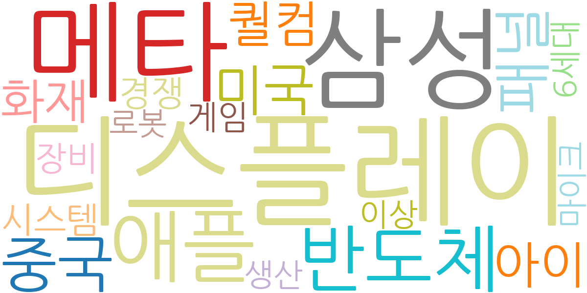
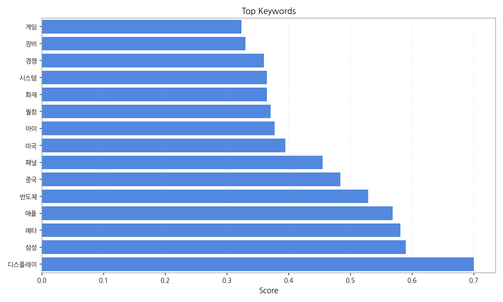
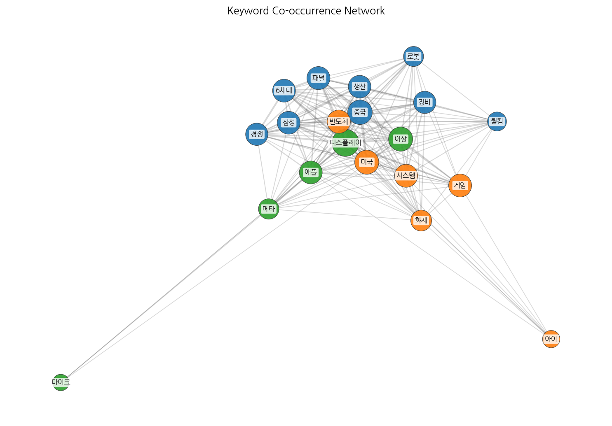
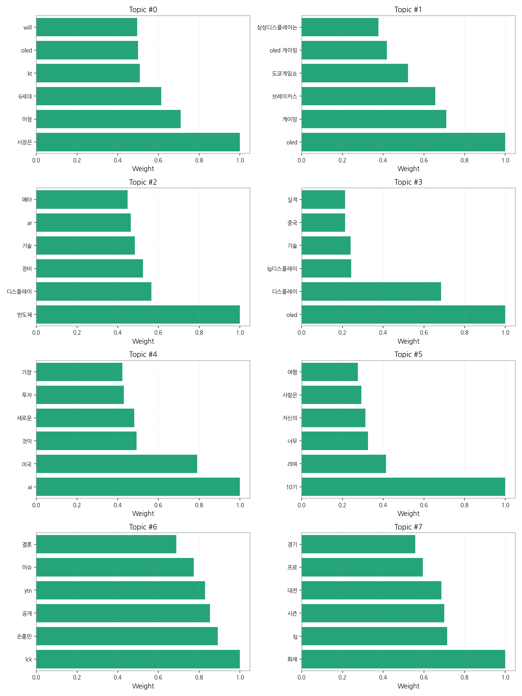
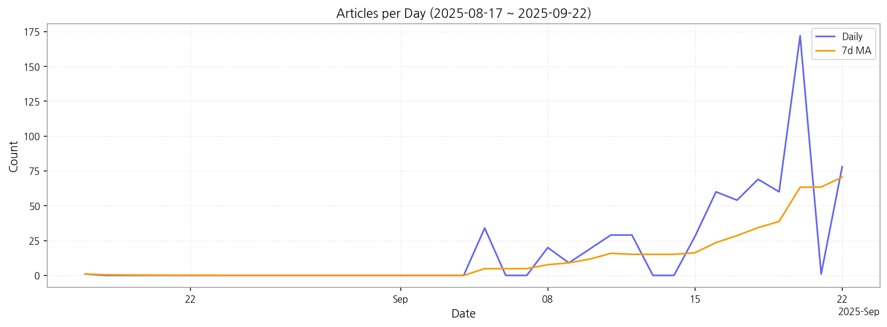

# Weekly/New Biz Report (2025-09-27)

## Executive Summary

- 이번 기간 핵심 토픽과 키워드, 주요 시사점을 요약합니다.

## 데일리 인텔리전스 브리핑

**1. 핵심 맥락:**

*   **OLED 게이밍 시장 확대 및 기술 경쟁 심화:** OLED는 디스플레이 산업의 핵심 키워드이며, 특히 게이밍 분야에서 수요가 증가하고 있습니다. 삼성디스플레이는 도쿄게임쇼 등에서 OLED 게이밍 디스플레이를 적극적으로 홍보하며 시장 선점을 위한 경쟁을 벌이고 있습니다. 이는 고화질, 고주사율을 요구하는 게이밍 시장의 특성과 OLED의 장점이 부합하기 때문입니다.
*   **IT 기술 융합을 통한 디스플레이 혁신:** 반도체, AI, AR/VR 기술이 디스플레이 산업과 융합되면서 새로운 성장 동력을 창출하고 있습니다. 특히 메타와 같은 기업들이 AR/VR 기기 개발에 적극적으로 투자하면서, 디스플레이 기술의 혁신을 가속화하고 있습니다. 이는 디스플레이가 단순한 정보 표시 장치를 넘어, 몰입형 경험을 제공하는 핵심 요소로 진화하고 있음을 의미합니다.

**2. 최근 변화/스파이크:**

*   **2025년 9월 20일 기사 수 급증:** 9월 20일에 기사 수가 172건으로 급증했습니다. 이는 도쿄게임쇼 관련 기사 증가와 더불어, 삼성, 메타, 애플 등 주요 기업들의 디스플레이 관련 투자 및 기술 개발 소식이 집중적으로 보도되었기 때문으로 추정됩니다. 특히, 반도체, AI 기술과 디스플레이의 융합에 대한 관심이 높아지면서 관련 기사 수가 급증한 것으로 분석됩니다.

**3. 실무 인사이트:**

*   **사업 개발:**
    *   **OLED 게이밍 디스플레이 시장 공략 강화:** 고성능, 저지연 특성을 강조한 OLED 게이밍 디스플레이 개발 및 마케팅 전략을 수립하고, 게이밍 기기 제조사와의 협력을 통해 시장 점유율을 확대해야 합니다.
    *   **AR/VR 디스플레이 기술 개발 투자 확대:** 메타버스 시장 성장에 발맞춰 AR/VR 기기에 최적화된 디스플레이 기술 개발에 투자하고, 관련 기업과의 협력을 통해 새로운 사업 기회를 모색해야 합니다.
*   **기술 기획:**
    *   **AI 기반 디스플레이 기술 개발:** AI 기술을 활용하여 디스플레이 화질 개선, 전력 효율 향상, 사용자 맞춤형 디스플레이 구현 등 차세대 디스플레이 기술 개발에 집중해야 합니다.
    *   **반도체-디스플레이 융합 기술 확보:** 반도체 기술과 디스플레이 기술의 융합을 통해 고성능, 저전력 디스플레이 개발을 추진하고, 관련 특허 확보를 통해 기술 경쟁력을 강화해야 합니다.

## Key Metrics

- 기간: 2025-08-17 ~ 2025-09-22
- 총 기사 수: 663
- 문서 수: N/A
- 키워드 수(상위): 15
- 토픽 수: 8
- 시계열 데이터 일자 수: 15

## Top Keywords

| Rank | Keyword | Score |
|---:|---|---:|
| 1 | 디스플레이 | 0.700 |
| 2 | 삼성 | 0.590 |
| 3 | 메타 | 0.581 |
| 4 | 애플 | 0.568 |
| 5 | 반도체 | 0.529 |
| 6 | 중국 | 0.483 |
| 7 | 패널 | 0.455 |
| 8 | 미국 | 0.394 |
| 9 | 아이 | 0.377 |
| 10 | 퀄컴 | 0.371 |
| 11 | 화재 | 0.364 |
| 12 | 시스템 | 0.364 |
| 13 | 경쟁 | 0.360 |
| 14 | 장비 | 0.330 |
| 15 | 게임 | 0.323 |

## Topics

- 사장은, 이청, 6세대 (#0)
  - 대표 단어: 사장은, 이청, 6세대, kt, oled, will
- oled, 게이밍, 브레이커스 (#1)
  - 대표 단어: oled, 게이밍, 브레이커스, 도쿄게임쇼, oled 게이밍, 삼성디스플레이는
- 반도체, 디스플레이, 장비 (#2)
  - 대표 단어: 반도체, 디스플레이, 장비, 기술, ar, 메타
- oled, 디스플레이, lg디스플레이 (#3)
  - 대표 단어: oled, 디스플레이, lg디스플레이, 기술, 중국, 실적
- ai, 미국, 것이 (#4)
  - 대표 단어: ai, 미국, 것이, 새로운, 투자, 가장
- 10기, 라며, 너무 (#5)
  - 대표 단어: 10기, 라며, 너무, 자신의, 사람은, 여행
- lck, 손흥민, 공개 (#6)
  - 대표 단어: lck, 손흥민, 공개, ytn, 이슈, 결혼
- 화재, lg, 시즌 (#7)
  - 대표 단어: 화재, lg, 시즌, 대전, 프로, 경기

## Trend

- 최근 14~30일 기사 수 추세와 7일 이동평균선을 제공합니다.

## Insights

## 데일리 인텔리전스 브리핑

**1. 핵심 맥락:**

*   **OLED 게이밍 시장 확대 및 기술 경쟁 심화:** OLED는 디스플레이 산업의 핵심 키워드이며, 특히 게이밍 분야에서 수요가 증가하고 있습니다. 삼성디스플레이는 도쿄게임쇼 등에서 OLED 게이밍 디스플레이를 적극적으로 홍보하며 시장 선점을 위한 경쟁을 벌이고 있습니다. 이는 고화질, 고주사율을 요구하는 게이밍 시장의 특성과 OLED의 장점이 부합하기 때문입니다.
*   **IT 기술 융합을 통한 디스플레이 혁신:** 반도체, AI, AR/VR 기술이 디스플레이 산업과 융합되면서 새로운 성장 동력을 창출하고 있습니다. 특히 메타와 같은 기업들이 AR/VR 기기 개발에 적극적으로 투자하면서, 디스플레이 기술의 혁신을 가속화하고 있습니다. 이는 디스플레이가 단순한 정보 표시 장치를 넘어, 몰입형 경험을 제공하는 핵심 요소로 진화하고 있음을 의미합니다.

**2. 최근 변화/스파이크:**

*   **2025년 9월 20일 기사 수 급증:** 9월 20일에 기사 수가 172건으로 급증했습니다. 이는 도쿄게임쇼 관련 기사 증가와 더불어, 삼성, 메타, 애플 등 주요 기업들의 디스플레이 관련 투자 및 기술 개발 소식이 집중적으로 보도되었기 때문으로 추정됩니다. 특히, 반도체, AI 기술과 디스플레이의 융합에 대한 관심이 높아지면서 관련 기사 수가 급증한 것으로 분석됩니다.

**3. 실무 인사이트:**

*   **사업 개발:**
    *   **OLED 게이밍 디스플레이 시장 공략 강화:** 고성능, 저지연 특성을 강조한 OLED 게이밍 디스플레이 개발 및 마케팅 전략을 수립하고, 게이밍 기기 제조사와의 협력을 통해 시장 점유율을 확대해야 합니다.
    *   **AR/VR 디스플레이 기술 개발 투자 확대:** 메타버스 시장 성장에 발맞춰 AR/VR 기기에 최적화된 디스플레이 기술 개발에 투자하고, 관련 기업과의 협력을 통해 새로운 사업 기회를 모색해야 합니다.
*   **기술 기획:**
    *   **AI 기반 디스플레이 기술 개발:** AI 기술을 활용하여 디스플레이 화질 개선, 전력 효율 향상, 사용자 맞춤형 디스플레이 구현 등 차세대 디스플레이 기술 개발에 집중해야 합니다.
    *   **반도체-디스플레이 융합 기술 확보:** 반도체 기술과 디스플레이 기술의 융합을 통해 고성능, 저전력 디스플레이 개발을 추진하고, 관련 특허 확보를 통해 기술 경쟁력을 강화해야 합니다.

## Opportunities (Top 5)

| Idea | Target | Value Prop | Score |
|---|---|---|---:|
| AR/VR 헤드셋용 초고해상도 Micro-OLED 마이크로디스플레이 솔루션 | 북미 빅테크 기업 (AR/VR 헤드셋 제조사) | 경쟁사 대비 30% 높은 해상도 (8K 이상), 240Hz 고주사율, 1ms 이하 응답 속도, 초소형/경량 디자인으로 AR/VR 기기 착용감 개선 | 4.50 |
| 차량용 AR HUD를 위한 MicroLED 기반 초고휘도/고투명 신소재 개발 및 공급 | 글로벌 완성차 OEM (Tier 1 부품사 협력) | 주간에도 선명한 AR HUD 구현, 넓은 시야각 및 높은 투명도로 운전 몰입도 극대화, 경쟁사 대비 20% 향상된 휘도 및 30% 향상된 투명도 제공 | 4.20 |
| 차세대 MicroLED 디스플레이 수율 향상을 위한 AI 기반 결함 예측 및 보정 시스템 개발 | MicroLED 디스플레이 제조사 | AI 기반 실시간 결함 예측 및 보정, 기존 검사 방식 대비 50% 빠른 결함 검출 속도, 20% 향상된 수율, 생산 비용 절감 | 4.00 |
| IT 기기용 벤더블 OLED 패널 생산을 위한 플렉서블 기판 신소재 개발 및 공정 자동화 솔루션 | 글로벌 IT 기기 제조사 (디스플레이 패널 공급사 협력) | 기존 PI 기판 대비 2배 향상된 벤딩 내구성, 30% 얇은 두께, 공정 자동화 솔루션 제공으로 생산 비용 15% 절감 및 수율 10% 향상 | 3.80 |
| 차량용 디스플레이 번인 방지 및 수명 연장을 위한 AI 기반 실시간 화질 최적화 솔루션 | 글로벌 완성차 OEM, 차량용 디스플레이 제조사 | AI 기반 실시간 화질 분석 및 보정, 번인 발생 가능성 최소화, 디스플레이 수명 30% 연장, 사용자 맞춤형 화질 설정 제공 | 3.50 |

## Appendix

- 데이터: keywords.json, topics.json, trend_timeseries.json, trend_insights.json, biz_opportunities.json