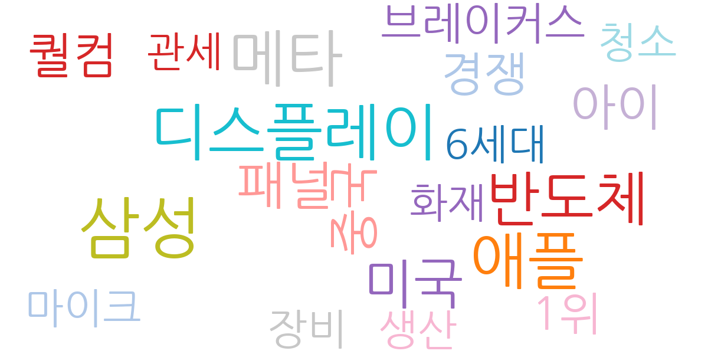
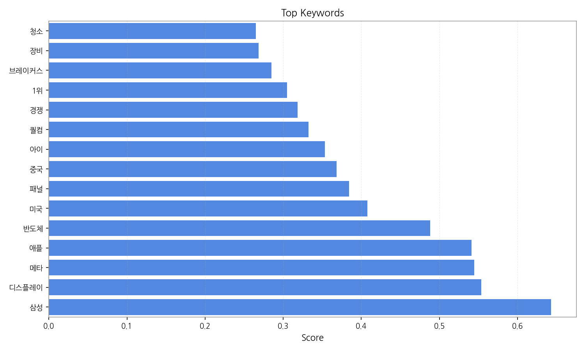
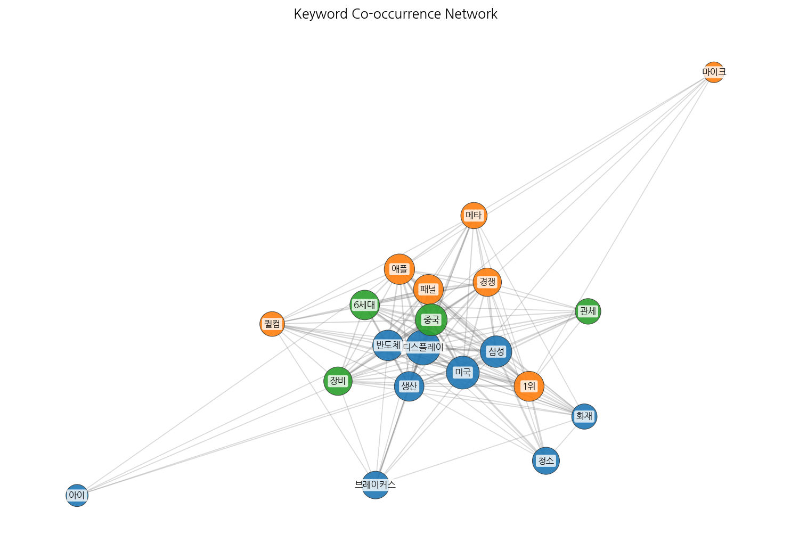
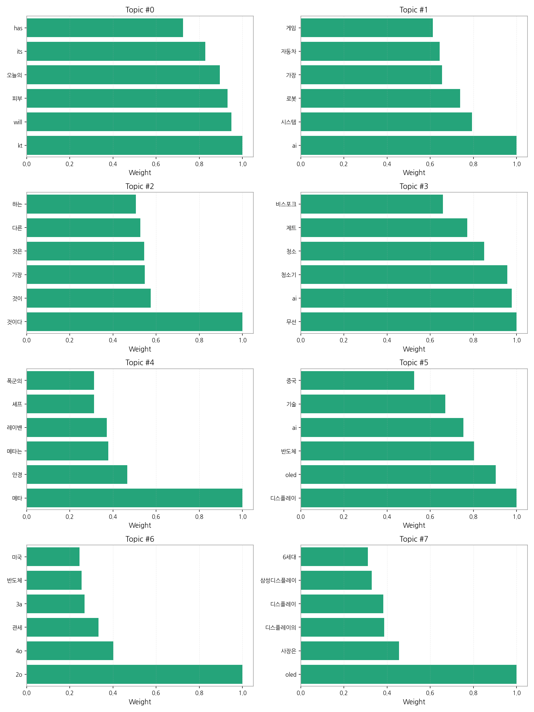
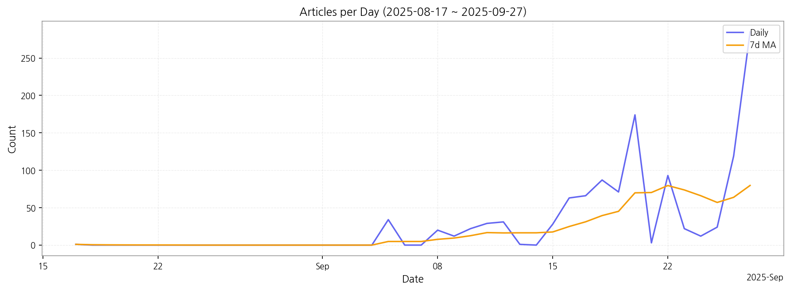

# Weekly/New Biz Report (2025-09-28)

## Executive Summary

- 이번 기간 핵심 토픽과 키워드, 주요 시사점을 요약합니다.

## 데일리 인텔리전스 브리핑

**1. 핵심 맥락:**

*   **AI 융합 디스플레이 기술 경쟁 심화:** 디스플레이 산업은 AI 기술과의 융합을 통해 차세대 성장 동력을 확보하려는 움직임이 활발합니다. 특히, 메타의 AR/VR 기기, 무선 청소기, 자동차 등 다양한 분야에서 AI 기반 디스플레이 기술의 중요성이 부각되고 있으며, 이는 디스플레이 성능 향상뿐 아니라 새로운 사용자 경험 창출에 기여할 것으로 예상됩니다.
*   **미-중 기술 패권 경쟁 속 디스플레이 및 반도체 산업 영향력 확대:** 미국과 중국 간의 기술 패권 경쟁이 심화되면서 디스플레이 및 반도체 산업에 대한 관심이 높아지고 있습니다. 특히, 관세, 핵심 기술, 장비 등의 키워드를 통해 알 수 있듯이, 양국 간의 무역 분쟁 및 기술 제재가 디스플레이 산업의 공급망 및 시장 경쟁 구도에 미치는 영향에 대한 우려가 커지고 있습니다.

**2. 최근 변화/스파이크:**

*   **2025년 9월 20일 기사 수 급증:** 2025년 9월 20일에 기사 수가 174건으로 급증한 것은 디스플레이, 반도체, 메타, AI 등의 키워드와 관련이 있을 것으로 추론됩니다. 이는 메타의 신규 AR/VR 기기 출시, AI 기반 디스플레이 기술 혁신, 또는 미-중 기술 경쟁 심화와 관련된 새로운 규제 발표 등 시장에 큰 영향을 미치는 사건이 발생했을 가능성을 시사합니다. 특히, 9월 26일과 27일에도 높은 기사 수를 유지하는 것으로 보아, 해당 이슈가 단발성 이벤트가 아닌 지속적인 시장 관심사임을 알 수 있습니다.

**3. 실무 인사이트:**

*   **AI 융합 디스플레이 기술 개발 로드맵 구체화:** 사업 개발 및 기술 기획 담당자는 AI 기술을 활용한 디스플레이 성능 향상 및 새로운 폼팩터 개발에 집중해야 합니다. 특히, AR/VR, 자동차, 가전 등 다양한 응용 분야를 고려하여 맞춤형 디스플레이 솔루션을 개발하고, 관련 기술 특허 확보에 적극적으로 나서야 합니다.
*   **공급망 다변화 및 리스크 관리 강화:** 미-중 기술 패권 경쟁 심화에 따른 공급망 불안정성에 대비하여, 핵심 부품 및 소재의 공급망을 다변화하고, 대체 공급처를 확보해야 합니다. 또한, 기술 제재 및 무역 규제 변화에 대한 모니터링을 강화하고, 리스크 관리 시스템을 구축하여 불확실성에 대비해야 합니다.
*   **차세대 디스플레이 기술 경쟁력 확보:** OLED, 마이크로 LED 등 차세대 디스플레이 기술 개발에 대한 투자를 확대하고, 기술 경쟁력 확보에 주력해야 합니다. 특히, 중국 기업과의 기술 격차를 유지하고, 시장 선점 우위를 확보하기 위해 핵심 기술 개발 및 인력 양성에 적극적으로 투자해야 합니다.

## Key Metrics

- 기간: 2025-08-17 ~ 2025-09-27
- 총 기사 수: 1,197
- 문서 수: N/A
- 키워드 수(상위): 15
- 토픽 수: 8
- 시계열 데이터 일자 수: 21

## Top Keywords

| Rank | Keyword | Score |
|---:|---|---:|
| 1 | 삼성 | 0.643 |
| 2 | 디스플레이 | 0.554 |
| 3 | 메타 | 0.545 |
| 4 | 애플 | 0.541 |
| 5 | 반도체 | 0.488 |
| 6 | 미국 | 0.408 |
| 7 | 패널 | 0.384 |
| 8 | 중국 | 0.368 |
| 9 | 아이 | 0.353 |
| 10 | 퀄컴 | 0.332 |
| 11 | 경쟁 | 0.319 |
| 12 | 1위 | 0.305 |
| 13 | 브레이커스 | 0.285 |
| 14 | 장비 | 0.269 |
| 15 | 청소 | 0.265 |

## Topics

- kt, will, 피부 (#0)
  - 대표 단어: kt, will, 피부, 오늘의, its, has
- ai, 시스템, 로봇 (#1)
  - 대표 단어: ai, 시스템, 로봇, 가장, 자동차, 게임
- 것이다, 것이, 가장 (#2)
  - 대표 단어: 것이다, 것이, 가장, 것은, 다른, 하는
- 무선, ai, 청소기 (#3)
  - 대표 단어: 무선, ai, 청소기, 청소, 제트, 비스포크
- 메타, 안경, 메타는 (#4)
  - 대표 단어: 메타, 안경, 메타는, 레이밴, 셰프, 폭군의
- 디스플레이, oled, 반도체 (#5)
  - 대표 단어: 디스플레이, oled, 반도체, ai, 기술, 중국
- 2o, 4o, 관세 (#6)
  - 대표 단어: 2o, 4o, 관세, 3a, 반도체, 미국
- oled, 사장은, 디스플레이의 (#7)
  - 대표 단어: oled, 사장은, 디스플레이의, 디스플레이, 삼성디스플레이, 6세대

## Trend

- 최근 14~30일 기사 수 추세와 7일 이동평균선을 제공합니다.

## Insights

## 데일리 인텔리전스 브리핑

**1. 핵심 맥락:**

*   **AI 융합 디스플레이 기술 경쟁 심화:** 디스플레이 산업은 AI 기술과의 융합을 통해 차세대 성장 동력을 확보하려는 움직임이 활발합니다. 특히, 메타의 AR/VR 기기, 무선 청소기, 자동차 등 다양한 분야에서 AI 기반 디스플레이 기술의 중요성이 부각되고 있으며, 이는 디스플레이 성능 향상뿐 아니라 새로운 사용자 경험 창출에 기여할 것으로 예상됩니다.
*   **미-중 기술 패권 경쟁 속 디스플레이 및 반도체 산업 영향력 확대:** 미국과 중국 간의 기술 패권 경쟁이 심화되면서 디스플레이 및 반도체 산업에 대한 관심이 높아지고 있습니다. 특히, 관세, 핵심 기술, 장비 등의 키워드를 통해 알 수 있듯이, 양국 간의 무역 분쟁 및 기술 제재가 디스플레이 산업의 공급망 및 시장 경쟁 구도에 미치는 영향에 대한 우려가 커지고 있습니다.

**2. 최근 변화/스파이크:**

*   **2025년 9월 20일 기사 수 급증:** 2025년 9월 20일에 기사 수가 174건으로 급증한 것은 디스플레이, 반도체, 메타, AI 등의 키워드와 관련이 있을 것으로 추론됩니다. 이는 메타의 신규 AR/VR 기기 출시, AI 기반 디스플레이 기술 혁신, 또는 미-중 기술 경쟁 심화와 관련된 새로운 규제 발표 등 시장에 큰 영향을 미치는 사건이 발생했을 가능성을 시사합니다. 특히, 9월 26일과 27일에도 높은 기사 수를 유지하는 것으로 보아, 해당 이슈가 단발성 이벤트가 아닌 지속적인 시장 관심사임을 알 수 있습니다.

**3. 실무 인사이트:**

*   **AI 융합 디스플레이 기술 개발 로드맵 구체화:** 사업 개발 및 기술 기획 담당자는 AI 기술을 활용한 디스플레이 성능 향상 및 새로운 폼팩터 개발에 집중해야 합니다. 특히, AR/VR, 자동차, 가전 등 다양한 응용 분야를 고려하여 맞춤형 디스플레이 솔루션을 개발하고, 관련 기술 특허 확보에 적극적으로 나서야 합니다.
*   **공급망 다변화 및 리스크 관리 강화:** 미-중 기술 패권 경쟁 심화에 따른 공급망 불안정성에 대비하여, 핵심 부품 및 소재의 공급망을 다변화하고, 대체 공급처를 확보해야 합니다. 또한, 기술 제재 및 무역 규제 변화에 대한 모니터링을 강화하고, 리스크 관리 시스템을 구축하여 불확실성에 대비해야 합니다.
*   **차세대 디스플레이 기술 경쟁력 확보:** OLED, 마이크로 LED 등 차세대 디스플레이 기술 개발에 대한 투자를 확대하고, 기술 경쟁력 확보에 주력해야 합니다. 특히, 중국 기업과의 기술 격차를 유지하고, 시장 선점 우위를 확보하기 위해 핵심 기술 개발 및 인력 양성에 적극적으로 투자해야 합니다.

## Opportunities (Top 5)

| Idea | Target | Value Prop | Score |
|---|---|---|---:|
| 개인 맞춤형 XR 글래스용 초고해상도 마이크로 OLED | 북미 빅테크 기업 (AR/VR 디바이스 제조사) | 개인별 시력 및 IPD에 최적화된 초고해상도 마이크로 OLED 제공, 몰입감 극대화 및 사용자 피로도 감소, 경쟁사 대비 뛰어난 화질 및 저전력 성능 | 4.50 |
| AI 기반 디스플레이 공정 자동화 및 수율 예측 시스템 | 자사 디스플레이 제조 사업부, 디스플레이 장비 제조사 | AI 기반 실시간 공정 데이터 분석 및 수율 예측, 생산 효율성 극대화 및 불량률 감소, 숙련된 엔지니어의 의존도 감소 및 운영 비용 절감 | 4.30 |
| AI 기반 차량용 HUD 증강 현실 솔루션 | 글로벌 완성차 OEM (Tier 1 부품사 협력) | AI 기반 실시간 객체 인식 및 예측을 통해 운전자에게 최적화된 AR 정보를 제공, 시선 분산 최소화 및 안전 운전 지원, 경쟁사 대비 높은 몰입감과 직관적인 정보 제공 | 4.20 |
| 퀀텀닷(QD) 기반 색 변환층을 활용한 MicroLED 디스플레이 | 프리미엄 TV 제조사, 디지털 사이니지 기업 | 퀀텀닷 색 변환층을 통해 MicroLED 디스플레이의 색 재현율 및 휘도 향상, 생산 수율 증가 및 원가 절감, 경쟁사 대비 뛰어난 화질 및 에너지 효율 | 4.00 |
| IT 기기용 무편광 OLED 패널 기술 | 글로벌 IT 기기 제조사 (노트북, 태블릿, 모니터) | 편광판 제거를 통한 밝기 향상 및 시야각 확대, 고해상도 콘텐츠 감상 경험 극대화, 부품 수급 안정성 확보 및 원가 절감 | 3.80 |

## Appendix

- 데이터: keywords.json, topics.json, trend_timeseries.json, trend_insights.json, biz_opportunities.json