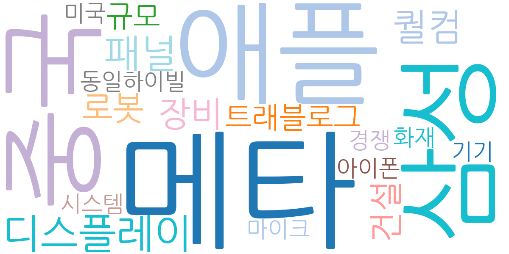
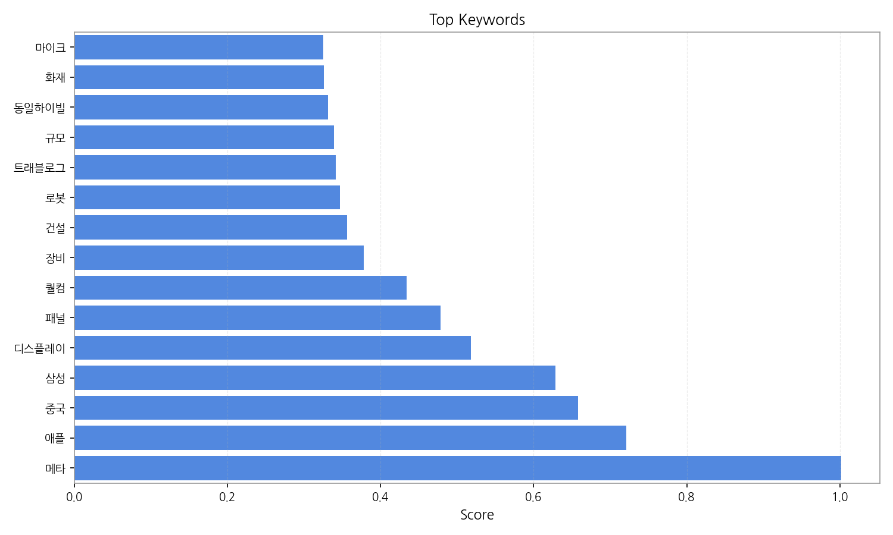
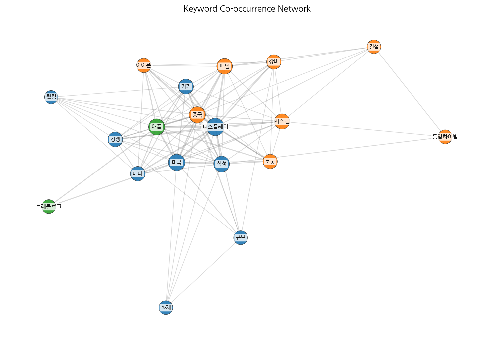
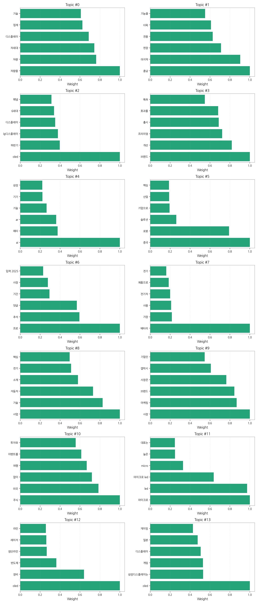
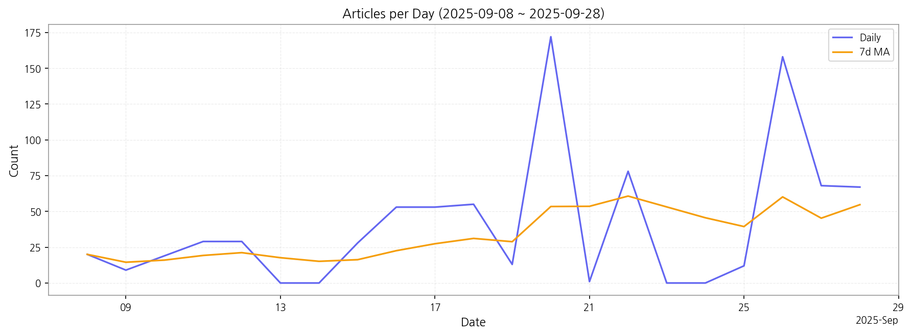

# Weekly/New Biz Report (2025-09-29)

## Executive Summary

- 이번 기간 핵심 토픽과 키워드, 주요 시사점을 요약합니다.

## 데일리 인텔리전스 브리핑

**1. 핵심 맥락:**

*   **OLED 기술 경쟁 심화 및 응용처 확대:** OLED는 여전히 디스플레이 산업의 핵심 기술로, LG디스플레이와 삼성디스플레이를 중심으로 기술 개발 및 투자가 활발하게 이루어지고 있으며, 특히 게이밍 디스플레이 시장을 중심으로 일본 도쿄게임쇼 등에서 경쟁이 심화되고 있습니다. 동시에 OLED 장비 및 생산라인 투자는 중국을 중심으로 지속적으로 확대되고 있습니다.
*   **차량용 디스플레이 시장 성장 가속화:** 차량용 디스플레이는 차세대 디스플레이 기술의 주요 응용처로 부상하고 있으며, 스마트폰 기술을 접목한 새로운 기술들이 최초로 차량용 시장에 적용되는 사례가 늘고 있습니다. 이는 자동차 산업의 전동화 및 자율주행 트렌드와 맞물려 더욱 가속화될 것으로 예상됩니다.
*   **AI/AR 기술과 디스플레이 융합:** AI와 AR 기술이 디스플레이와 융합되면서 새로운 기기 및 사용자 경험을 창출하려는 시도가 활발합니다. 특히 메타, 삼성 등 주요 기업들이 AI/AR 기술을 활용한 디스플레이 제품 개발에 집중하고 있습니다.

**2. 최근 변화/스파이크:**

*   **2025년 9월 20일, 26일 기사 수 급증:** 9월 20일과 26일에 기사 수가 급증한 것은 디스플레이, 패널, 장비 관련 이슈와 더불어 중국 시장 및 OLED 기술 관련 뉴스가 집중적으로 보도되었기 때문으로 추정됩니다. 특히 중국의 OLED 투자 확대 및 관련 장비 수요 증가가 주요 원인으로 작용한 것으로 보입니다.

**3. 실무 인사이트:**

*   **차량용 디스플레이 기술 경쟁력 강화:** 차량용 디스플레이 시장의 성장 가능성을 고려하여, 고해상도, 고휘도, 플렉서블 디스플레이 등 차세대 차량용 디스플레이 기술 개발에 집중하고, 관련 특허 확보 및 기술 표준화에 적극적으로 참여해야 합니다.
*   **OLED 기술 포트폴리오 다변화:** OLED 기술의 응용처 확대를 위해 게이밍, AR/VR, 차량용 등 다양한 분야에 특화된 OLED 기술 개발 및 제품 라인업 확대를 추진해야 합니다. 특히 중국 시장의 성장 가능성을 고려하여, 중국 시장에 최적화된 OLED 제품 개발 및 마케팅 전략을 수립해야 합니다.
*   **AI/AR 디스플레이 융합 기술 선점:** AI/AR 기술과 디스플레이 기술의 융합을 통해 새로운 사용자 경험을 제공하는 제품 개발에 투자하고, 관련 기술 스타트업과의 협력 및 M&A를 통해 기술 경쟁력을 강화해야 합니다. 특히 메타, 애플 등 주요 기업의 AI/AR 디스플레이 기술 개발 동향을 주시하고, 경쟁 우위를 확보할 수 있는 차별화된 기술 개발 전략을 수립해야 합니다.

## Key Metrics

- 기간: 2025-09-08 ~ 2025-09-28
- 총 기사 수: 864
- 문서 수: N/A
- 키워드 수(상위): 15
- 토픽 수: 14
- 시계열 데이터 일자 수: 21

## Top Keywords

| Rank | Keyword | Score |
|---:|---|---:|
| 1 | 메타 | 1.002 |
| 2 | 애플 | 0.721 |
| 3 | 중국 | 0.658 |
| 4 | 삼성 | 0.628 |
| 5 | 디스플레이 | 0.518 |
| 6 | 패널 | 0.478 |
| 7 | 퀄컴 | 0.434 |
| 8 | 장비 | 0.378 |
| 9 | 건설 | 0.356 |
| 10 | 로봇 | 0.347 |
| 11 | 트래블로그 | 0.341 |
| 12 | 규모 | 0.339 |
| 13 | 동일하이빌 | 0.331 |
| 14 | 화재 | 0.326 |
| 15 | 마이크 | 0.325 |

## Topics

- 차량용, 차량, 차세대 (#0)
  - 대표 단어: 차량용, 차량, 차세대, 디스플레이, 업계, 기술
- 충남, 마지막, 연장 (#1)
  - 대표 단어: 충남, 마지막, 연장, 전용, 더욱, 기능을
- oled, 하반기, lg디스플레이 (#2)
  - 대표 단어: oled, 하반기, lg디스플레이, 디스플레이, 6세대, 패널
- 브랜드, 개선, 프리미엄 (#3)
  - 대표 단어: 브랜드, 개선, 프리미엄, 출시, 효과를, 특허
- ai, 메타, ar (#4)
  - 대표 단어: ai, 메타, ar, 기술, 기기, 삼성
- 중국, 로봇, 솔루션 (#5)
  - 대표 단어: 중국, 로봇, 솔루션, 기업으로, 산업, 핵심
- 프로, 추석, 댓글 (#6)
  - 대표 단어: 프로, 추석, 댓글, 기간, 사장, 입력 2025
- 배터리, 가장, 사용 (#7)
  - 대표 단어: 배터리, 가장, 사용, 전기차, 제품으로, 전기
- 사업, 기술, 자동차 (#8)
  - 대표 단어: 사업, 기술, 자동차, 소재, 전기, 핵심
- 사장, 마케팅, 브랜드 (#9)
  - 대표 단어: 사장, 마케팅, 브랜드, 사장은, 갤럭시, 기업인
- 주식, 미국, 없이 (#10)
  - 대표 단어: 주식, 미국, 없이, 여행, 이벤트를, 투자와
- 마이크로, led, 마이크로 led (#11)
  - 대표 단어: 마이크로, led, 마이크로 led, micro, 높은, 대표는
- oled, 장비, 반도체 (#12)
  - 대표 단어: oled, 장비, 반도체, 생산라인, 레이저, 라인
- oled, 삼성디스플레이는, 게임 (#13)
  - 대표 단어: oled, 삼성디스플레이는, 게임, 디스플레이, 일본, 게이밍

## Trend

- 최근 14~30일 기사 수 추세와 7일 이동평균선을 제공합니다.

## Insights

## 데일리 인텔리전스 브리핑

**1. 핵심 맥락:**

*   **OLED 기술 경쟁 심화 및 응용처 확대:** OLED는 여전히 디스플레이 산업의 핵심 기술로, LG디스플레이와 삼성디스플레이를 중심으로 기술 개발 및 투자가 활발하게 이루어지고 있으며, 특히 게이밍 디스플레이 시장을 중심으로 일본 도쿄게임쇼 등에서 경쟁이 심화되고 있습니다. 동시에 OLED 장비 및 생산라인 투자는 중국을 중심으로 지속적으로 확대되고 있습니다.
*   **차량용 디스플레이 시장 성장 가속화:** 차량용 디스플레이는 차세대 디스플레이 기술의 주요 응용처로 부상하고 있으며, 스마트폰 기술을 접목한 새로운 기술들이 최초로 차량용 시장에 적용되는 사례가 늘고 있습니다. 이는 자동차 산업의 전동화 및 자율주행 트렌드와 맞물려 더욱 가속화될 것으로 예상됩니다.
*   **AI/AR 기술과 디스플레이 융합:** AI와 AR 기술이 디스플레이와 융합되면서 새로운 기기 및 사용자 경험을 창출하려는 시도가 활발합니다. 특히 메타, 삼성 등 주요 기업들이 AI/AR 기술을 활용한 디스플레이 제품 개발에 집중하고 있습니다.

**2. 최근 변화/스파이크:**

*   **2025년 9월 20일, 26일 기사 수 급증:** 9월 20일과 26일에 기사 수가 급증한 것은 디스플레이, 패널, 장비 관련 이슈와 더불어 중국 시장 및 OLED 기술 관련 뉴스가 집중적으로 보도되었기 때문으로 추정됩니다. 특히 중국의 OLED 투자 확대 및 관련 장비 수요 증가가 주요 원인으로 작용한 것으로 보입니다.

**3. 실무 인사이트:**

*   **차량용 디스플레이 기술 경쟁력 강화:** 차량용 디스플레이 시장의 성장 가능성을 고려하여, 고해상도, 고휘도, 플렉서블 디스플레이 등 차세대 차량용 디스플레이 기술 개발에 집중하고, 관련 특허 확보 및 기술 표준화에 적극적으로 참여해야 합니다.
*   **OLED 기술 포트폴리오 다변화:** OLED 기술의 응용처 확대를 위해 게이밍, AR/VR, 차량용 등 다양한 분야에 특화된 OLED 기술 개발 및 제품 라인업 확대를 추진해야 합니다. 특히 중국 시장의 성장 가능성을 고려하여, 중국 시장에 최적화된 OLED 제품 개발 및 마케팅 전략을 수립해야 합니다.
*   **AI/AR 디스플레이 융합 기술 선점:** AI/AR 기술과 디스플레이 기술의 융합을 통해 새로운 사용자 경험을 제공하는 제품 개발에 투자하고, 관련 기술 스타트업과의 협력 및 M&A를 통해 기술 경쟁력을 강화해야 합니다. 특히 메타, 애플 등 주요 기업의 AI/AR 디스플레이 기술 개발 동향을 주시하고, 경쟁 우위를 확보할 수 있는 차별화된 기술 개발 전략을 수립해야 합니다.

## Opportunities (Top 5)

| Idea | Target | Value Prop | Score |
|---|---|---|---:|
| 초경량/고해상도 마이크로 OLED 기반 AR 글래스용 디스플레이 모듈 | 북미 빅테크 기업 (AR/VR 기기 제조사) | 초경량/고해상도 마이크로 OLED 기술 기반 몰입감 있는 AR 경험 제공. 기존 LCD 대비 높은 명암비 및 빠른 응답 속도, 초소형/경량화 디자인으로 착용감 개선, 저전력 설계로 배터리 수명 연장. | 4.50 |
| AI 기반 디스플레이 공정 자동화 및 수율 예측 솔루션 | 국내외 디스플레이 제조사 (OLED, MicroLED) | AI 기반 실시간 데이터 분석 및 예측을 통해 디스플레이 제조 공정 효율성 극대화. 공정 이상 감지 및 예측, 최적 공정 조건 자동 설정, 수율 예측 및 개선 방안 제시, 불량 원인 분석 및 해결책 제시. | 4.30 |
| AI 기반 개인 맞춤형 차량용 디스플레이 솔루션 | 글로벌 완성차 OEM (프리미엄 브랜드 중심) | AI 기반 운전자 맞춤형 정보 제공 및 안전 운전 지원으로 운전 경험 극대화. 실시간 운전 패턴 분석 및 예측을 통한 최적화된 정보 제공, 운전자 상태 모니터링 및 경고 기능 제공, AR 내비게이션 연동으로 안전 운전 지원. | 4.20 |
| 차량용 디스플레이 일체형 스마트 윈도우 | 글로벌 완성차 OEM (자율주행차 개발 기업) | 윈도우를 디스플레이로 활용하여 차량 내 공간 활용도 극대화 및 새로운 사용자 경험 제공. 투명 디스플레이 기술 기반 운전 중 시야 확보, 터치 인터랙션 지원으로 다양한 기능 제어, 외부 환경 변화에 따른 디스플레이 밝기 자동 조절. | 4.00 |
| IT 기기용 스트레처블 OLED 패널 솔루션 | 글로벌 IT 기기 제조사 (스마트폰, 태블릿) | 자유로운 형태 변형이 가능한 스트레처블 OLED 패널로 차세대 IT 기기 디자인 혁신. 높은 신축성 및 내구성 확보, 다양한 곡률 디자인 구현 가능, 기존 OLED 대비 우수한 화질 및 색 재현율. | 3.80 |

## Appendix

- 데이터: keywords.json, topics.json, trend_timeseries.json, trend_insights.json, biz_opportunities.json