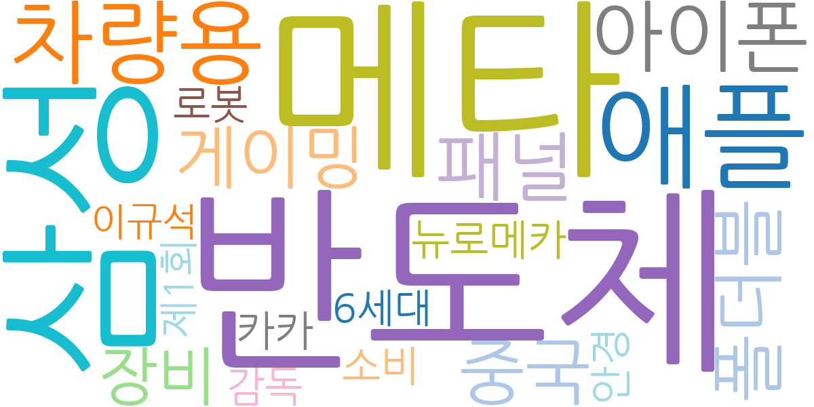
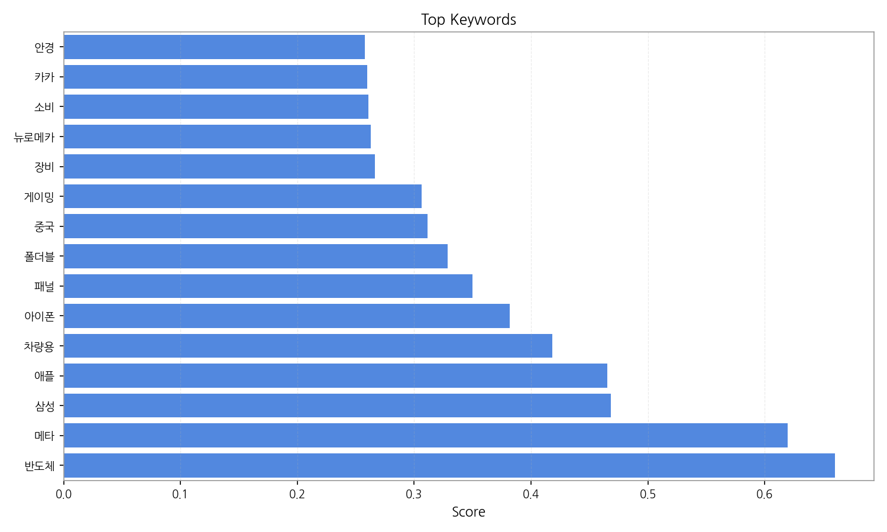
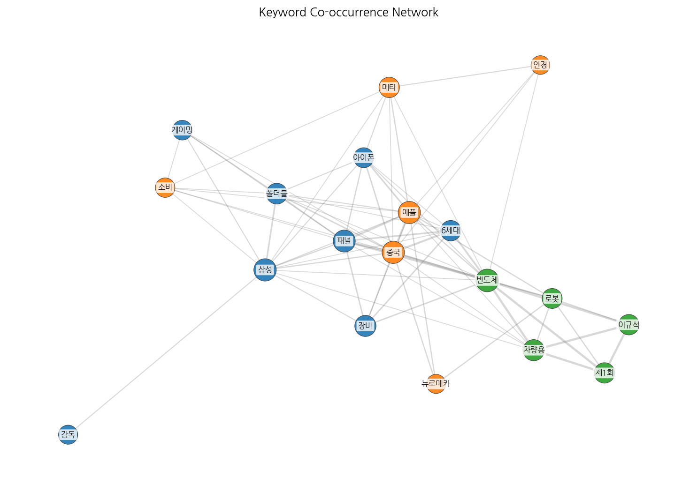
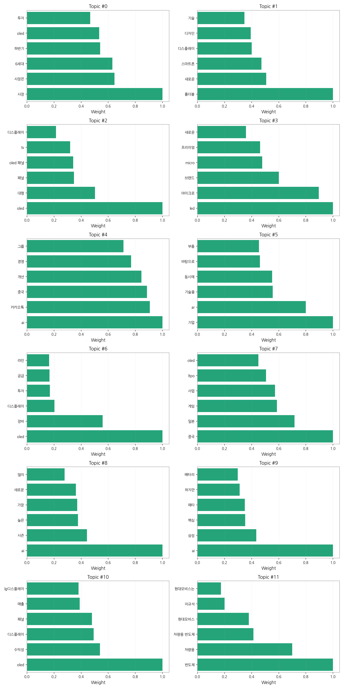
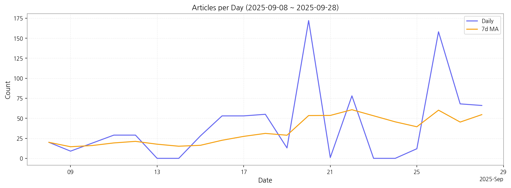

# Weekly/New Biz Report (2025-09-29)

## Executive Summary

- 이번 기간 핵심 토픽과 키워드, 주요 시사점을 요약합니다.

## 데일리 인텔리전스 브리핑

**1. 핵심 맥락:**

*   **OLED 투자 및 생산 경쟁 심화:** OLED 관련 토픽(0, 2, 6, 7, 10)에서 'OLED', '투자', '패널', '생산', '중국' 등의 키워드가 빈번하게 등장하며, 특히 '대형 OLED 패널', 'QD-OLED' 등의 세부 기술과 관련된 논의가 활발합니다. 이는 디스플레이 업체들이 차세대 디스플레이 시장 선점을 위해 OLED 기술 투자 및 생산 경쟁을 가속화하고 있음을 시사합니다. 특히 중국 시장에서의 경쟁 심화가 예상됩니다.
*   **폴더블 디스플레이 기술 혁신 및 시장 확대:** '폴더블', '스마트폰', '디스플레이', '디자인', '기술' 등의 키워드를 포함하는 토픽(1)은 폴더블 디스플레이 기술 혁신과 스마트폰을 넘어선 다양한 폼팩터 적용 가능성을 보여줍니다. 폴더블 디스플레이 기술이 성숙해짐에 따라, 스마트폰 외에 새로운 시장을 창출하려는 업계의 노력이 엿보입니다.
*   **AI 기술 융합 및 디스플레이 적용 확대:** 'AI' 키워드를 포함하는 토픽(4, 8, 9)은 디스플레이 산업 전반에 AI 기술이 융합되고 있음을 나타냅니다. AI는 화질 개선, 사용자 인터페이스 최적화, 생산 효율성 향상 등 다양한 분야에서 디스플레이 기술 혁신을 가속화할 것으로 예상됩니다.

**2. 최근 변화/스파이크:**

*   **2025년 9월 16일-18일, 20일, 22일, 26일 기사 수 급증:** 이 기간 동안 기사 수가 급증한 것은 디스플레이 산업 내 주요 이벤트 또는 발표가 있었음을 시사합니다. 특히 9월 20일과 26일의 급증은 '반도체', '메타', '삼성', '애플', '폴더블', '중국' 등의 키워드와 연관 지어 볼 때, 삼성과 애플의 신제품 출시, 폴더블폰 시장 경쟁 심화, 중국 디스플레이 업체의 기술 발전 등이 복합적으로 작용한 결과로 추론할 수 있습니다. 또한, 'AI' 관련 토픽의 비중이 높은 것으로 보아, AI 기술이 적용된 새로운 디스플레이 제품 또는 기술 발표가 있었을 가능성도 있습니다.

**3. 실무 인사이트:**

*   **OLED 기술 포트폴리오 다변화:** 사업 개발 담당자는 QD-OLED, WOLED 등 다양한 OLED 기술 포트폴리오를 구축하고, 각 기술의 장점을 활용한 차별화된 제품 전략을 수립해야 합니다. 특히, 중국 시장을 겨냥한 가격 경쟁력 있는 OLED 제품 개발에 집중해야 합니다.
*   **폴더블 디스플레이 적용 분야 확대:** 기술 기획 담당자는 폴더블 디스플레이 기술을 스마트폰 외에 태블릿, 노트북, 웨어러블 기기 등 다양한 분야에 적용할 수 있도록 연구 개발 투자를 확대해야 합니다. 특히, 사용자 경험을 극대화할 수 있는 폼팩터 및 인터페이스 개발에 집중해야 합니다.
*   **AI 기반 디스플레이 기술 혁신:** 기술 기획 담당자는 AI 기술을 활용하여 디스플레이 화질 개선, 전력 효율 향상, 사용자 맞춤형 인터페이스 제공 등 다양한 분야에서 혁신을 추진해야 합니다. 특히, AI 기반 화질 업스케일링, 객체 인식 기반 디스플레이 제어, 사용자 행동 분석 기반 콘텐츠 추천 등의 기술 개발에 집중해야 합니다.

## Key Metrics

- 기간: 2025-09-08 ~ 2025-09-28
- 총 기사 수: 863
- 문서 수: N/A
- 키워드 수(상위): 15
- 토픽 수: 12
- 시계열 데이터 일자 수: 21

## Top Keywords

| Rank | Keyword | Score |
|---:|---|---:|
| 1 | 반도체 | 0.660 |
| 2 | 메타 | 0.620 |
| 3 | 삼성 | 0.468 |
| 4 | 애플 | 0.465 |
| 5 | 차량용 | 0.418 |
| 6 | 아이폰 | 0.382 |
| 7 | 패널 | 0.350 |
| 8 | 폴더블 | 0.329 |
| 9 | 중국 | 0.311 |
| 10 | 게이밍 | 0.306 |
| 11 | 장비 | 0.266 |
| 12 | 뉴로메카 | 0.263 |
| 13 | 소비 | 0.261 |
| 14 | 카카 | 0.260 |
| 15 | 안경 | 0.258 |

## Topics

- 사장, 사장은, 6세대 (#0)
  - 대표 단어: 사장, 사장은, 6세대, 하반기, oled, 투자
- 폴더블, 새로운, 스마트폰 (#1)
  - 대표 단어: 폴더블, 새로운, 스마트폰, 디스플레이, 디자인, 기술
- oled, 대형, 패널 (#2)
  - 대표 단어: oled, 대형, 패널, oled 패널, tv, 디스플레이
- led, 마이크로, 브랜드 (#3)
  - 대표 단어: led, 마이크로, 브랜드, micro, 프리미엄, 새로운
- ai, 카카오톡, 중국 (#4)
  - 대표 단어: ai, 카카오톡, 중국, 개선, 경영, 그룹
- 기업, ar, 기술을 (#5)
  - 대표 단어: 기업, ar, 기술을, 동시에, 바탕으로, 부품
- oled, 장비, 디스플레이 (#6)
  - 대표 단어: oled, 장비, 디스플레이, 투자, 공급, 라인
- 중국, 일본, 게임 (#7)
  - 대표 단어: 중국, 일본, 게임, 사업, ltpo, oled
- ai, 시즌, 높은 (#8)
  - 대표 단어: ai, 시즌, 높은, 가장, 새로운, 많이
- ai, 삼성, 핵심 (#9)
  - 대표 단어: ai, 삼성, 핵심, 메타, 하지만, 배터리
- oled, 수익성, 디스플레이 (#10)
  - 대표 단어: oled, 수익성, 디스플레이, 패널, 매출, lg디스플레이
- 반도체, 차량용, 차량용 반도체 (#11)
  - 대표 단어: 반도체, 차량용, 차량용 반도체, 현대모비스, 이규석, 현대모비스는

## Trend

- 최근 14~30일 기사 수 추세와 7일 이동평균선을 제공합니다.

## Insights

## 데일리 인텔리전스 브리핑

**1. 핵심 맥락:**

*   **OLED 투자 및 생산 경쟁 심화:** OLED 관련 토픽(0, 2, 6, 7, 10)에서 'OLED', '투자', '패널', '생산', '중국' 등의 키워드가 빈번하게 등장하며, 특히 '대형 OLED 패널', 'QD-OLED' 등의 세부 기술과 관련된 논의가 활발합니다. 이는 디스플레이 업체들이 차세대 디스플레이 시장 선점을 위해 OLED 기술 투자 및 생산 경쟁을 가속화하고 있음을 시사합니다. 특히 중국 시장에서의 경쟁 심화가 예상됩니다.
*   **폴더블 디스플레이 기술 혁신 및 시장 확대:** '폴더블', '스마트폰', '디스플레이', '디자인', '기술' 등의 키워드를 포함하는 토픽(1)은 폴더블 디스플레이 기술 혁신과 스마트폰을 넘어선 다양한 폼팩터 적용 가능성을 보여줍니다. 폴더블 디스플레이 기술이 성숙해짐에 따라, 스마트폰 외에 새로운 시장을 창출하려는 업계의 노력이 엿보입니다.
*   **AI 기술 융합 및 디스플레이 적용 확대:** 'AI' 키워드를 포함하는 토픽(4, 8, 9)은 디스플레이 산업 전반에 AI 기술이 융합되고 있음을 나타냅니다. AI는 화질 개선, 사용자 인터페이스 최적화, 생산 효율성 향상 등 다양한 분야에서 디스플레이 기술 혁신을 가속화할 것으로 예상됩니다.

**2. 최근 변화/스파이크:**

*   **2025년 9월 16일-18일, 20일, 22일, 26일 기사 수 급증:** 이 기간 동안 기사 수가 급증한 것은 디스플레이 산업 내 주요 이벤트 또는 발표가 있었음을 시사합니다. 특히 9월 20일과 26일의 급증은 '반도체', '메타', '삼성', '애플', '폴더블', '중국' 등의 키워드와 연관 지어 볼 때, 삼성과 애플의 신제품 출시, 폴더블폰 시장 경쟁 심화, 중국 디스플레이 업체의 기술 발전 등이 복합적으로 작용한 결과로 추론할 수 있습니다. 또한, 'AI' 관련 토픽의 비중이 높은 것으로 보아, AI 기술이 적용된 새로운 디스플레이 제품 또는 기술 발표가 있었을 가능성도 있습니다.

**3. 실무 인사이트:**

*   **OLED 기술 포트폴리오 다변화:** 사업 개발 담당자는 QD-OLED, WOLED 등 다양한 OLED 기술 포트폴리오를 구축하고, 각 기술의 장점을 활용한 차별화된 제품 전략을 수립해야 합니다. 특히, 중국 시장을 겨냥한 가격 경쟁력 있는 OLED 제품 개발에 집중해야 합니다.
*   **폴더블 디스플레이 적용 분야 확대:** 기술 기획 담당자는 폴더블 디스플레이 기술을 스마트폰 외에 태블릿, 노트북, 웨어러블 기기 등 다양한 분야에 적용할 수 있도록 연구 개발 투자를 확대해야 합니다. 특히, 사용자 경험을 극대화할 수 있는 폼팩터 및 인터페이스 개발에 집중해야 합니다.
*   **AI 기반 디스플레이 기술 혁신:** 기술 기획 담당자는 AI 기술을 활용하여 디스플레이 화질 개선, 전력 효율 향상, 사용자 맞춤형 인터페이스 제공 등 다양한 분야에서 혁신을 추진해야 합니다. 특히, AI 기반 화질 업스케일링, 객체 인식 기반 디스플레이 제어, 사용자 행동 분석 기반 콘텐츠 추천 등의 기술 개발에 집중해야 합니다.

## Opportunities (Top 5)

| Idea | Target | Value Prop | Score |
|---|---|---|---:|
| 메타버스용 초고해상도 마이크로 OLED XR 디스플레이 | 북미 빅테크 기업 (메타, 애플 등) | 기존 디스플레이 대비 압도적인 해상도, 명암비, 응답속도를 제공하여 현실감 넘치는 몰입형 XR 경험 제공. 초소형, 초경량 폼팩터로 XR 기기 디자인 자유도 향상. | 4.50 |
| 차량용 AR HUD (Augmented Reality Head-Up Display) 솔루션 | 글로벌 완성차 OEM (프리미엄 브랜드 중심) | 기존 HUD 대비 넓은 시야각, 고해상도, 3D AR 정보 제공으로 운전 몰입도 및 안전성 극대화. AI 기반 실시간 객체 인식 및 예측 정보 제공으로 차세대 운전 경험 선사. | 4.20 |
| AI 기반 디스플레이 공정 자동화 및 수율 개선 솔루션 | 디스플레이 제조사 (자사 포함) | AI 기반 실시간 공정 데이터 분석 및 예측을 통해 불량 발생률 감소 및 수율 향상. 공정 최적화 및 자동화를 통해 생산 비용 절감. | 4.00 |
| IT 기기용 폴더블 OLED 패널 솔루션 | 글로벌 IT 기기 제조사 (삼성전자, LG전자, 레노버 등) | 기존 폴더블 패널 대비 향상된 내구성, 주름 개선, 터치 성능을 제공하여 사용자 경험 극대화. 다양한 힌지 디자인 및 폴딩 각도 지원으로 IT 기기 디자인 혁신. | 3.80 |
| 퀀텀닷 컬러 필터 기반 고색재현율 LCD | 중저가 TV 제조사, 게이밍 모니터 제조사 | OLED에 준하는 색재현율을 LCD 가격으로 제공. 기존 LCD 생산 라인 활용 가능하여 투자 비용 절감. | 3.50 |

## Appendix

- 데이터: keywords.json, topics.json, trend_timeseries.json, trend_insights.json, biz_opportunities.json