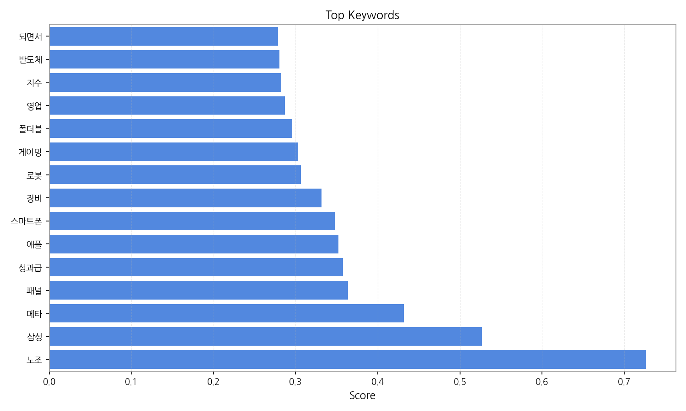
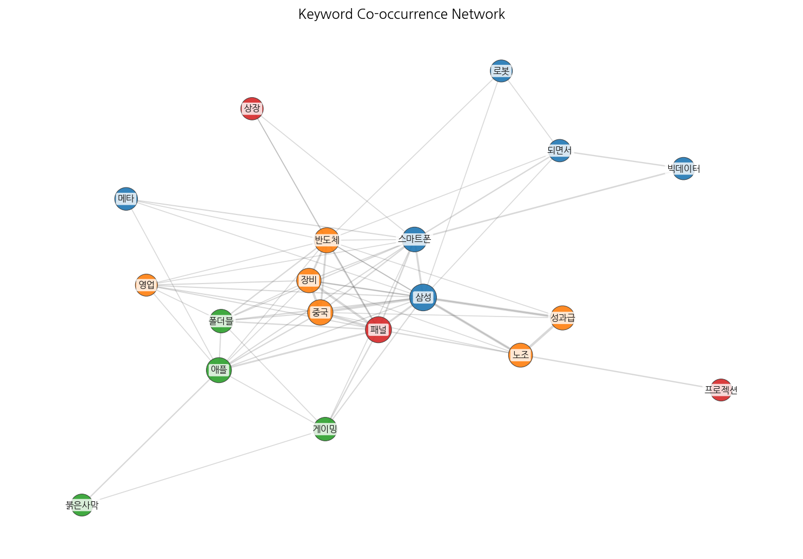
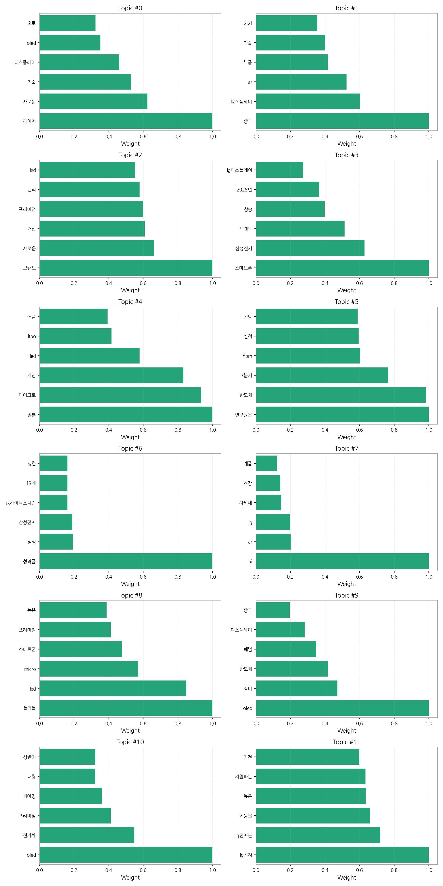

# Weekly/New Biz Report (2025-09-30)

## Executive Summary

- 이번 기간 핵심 토픽과 키워드, 주요 시사점을 요약합니다.

## 데일리 인텔리전스 브리핑 (디스플레이 산업)

**1. 핵심 맥락:**

*   **OLED & 프리미엄 디스플레이 시장 확대:** OLED는 전기차, 게이밍, 프리미엄 TV 등 고성능 디스플레이 수요 증가에 힘입어 시장을 확장하고 있으며, 특히 QD-OLED 기술이 주목받고 있습니다. 동시에, 폴더블 스마트폰과 같은 프리미엄 제품군에서도 OLED와 micro LED 기술의 경쟁이 심화되고 있습니다.
*   **중국 디스플레이 산업의 성장과 영향력 확대:** 중국은 디스플레이 부품, 기술, 장비 분야에서 빠르게 성장하며 시장 영향력을 확대하고 있습니다. 특히 AR 기기 관련 부품 및 모듈 시장에서 중국의 역할이 커지고 있으며, OLED 패널 생산 라인 증설에도 적극적입니다.
*   **AI & AR 기술 융합을 통한 디스플레이 혁신:** AI와 AR 기술은 디스플레이 산업 전반에 걸쳐 새로운 사용자 경험을 제공하고 있습니다. LG전자를 비롯한 주요 기업들은 AI 기반 화질 개선, AR 기반 인터페이스 등 차세대 디스플레이 기술 개발에 집중하고 있으며, 특히 게이밍 분야에서 AI와 AR 기술의 활용이 두드러집니다.

**2. 최근 변화/스파이크:**

*   **2025년 9월 20일, 26일 기사 수 급증:** 9월 20일과 26일에 기사 수가 급증한 것은 "게이밍" 키워드와 연관된 신제품 출시, 기술 발표, 또는 시장 분석 보고서 발표와 관련되었을 가능성이 높습니다. 특히, OLED, AI, AR 기술이 융합된 게이밍 디스플레이 제품에 대한 관심이 높아진 것으로 추정됩니다. 또한 "성과급" 키워드와 함께 삼성 관련 기사가 많은 것으로 보아, 디스플레이 관련 사업부의 실적 발표 및 그에 따른 성과급 지급 관련 이슈가 영향을 미쳤을 가능성도 있습니다.

**3. 실무 인사이트:**

*   **사업 개발:**
    *   **프리미엄 디스플레이 시장 공략 강화:** 폴더블, 전기차, 게이밍 등 고성능 디스플레이 수요가 높은 시장을 타겟으로 QD-OLED, micro LED 등 차세대 디스플레이 기술 기반의 프리미엄 제품 개발 및 마케팅 전략을 수립해야 합니다.
    *   **중국 시장 진출 전략 재검토:** 중국 디스플레이 산업의 성장과 경쟁 심화에 대응하기 위해 현지 파트너십 강화, 차별화된 기술 경쟁력 확보, 중국 시장 맞춤형 제품 개발 등 다각적인 전략을 모색해야 합니다.
*   **기술 기획:**
    *   **AI & AR 기술 융합 연구 개발 투자 확대:** AI 기반 화질 개선, AR 기반 인터페이스, 사용자 맞춤형 디스플레이 등 AI와 AR 기술을 융합한 차세대 디스플레이 기술 개발에 대한 투자를 확대하고, 관련 기술 경쟁력을 강화해야 합니다.

## Key Metrics

- 기간: 2025-09-08 ~ 2025-09-29
- 총 기사 수: 959
- 문서 수: N/A
- 키워드 수(상위): 15
- 토픽 수: 12
- 시계열 데이터 일자 수: 22

## Top Keywords

| Rank | Keyword | Score |
|---:|---|---:|
| 1 | 노조 | 0.726 |
| 2 | 삼성 | 0.527 |
| 3 | 메타 | 0.431 |
| 4 | 패널 | 0.364 |
| 5 | 성과급 | 0.358 |
| 6 | 애플 | 0.352 |
| 7 | 스마트폰 | 0.348 |
| 8 | 장비 | 0.331 |
| 9 | 로봇 | 0.306 |
| 10 | 게이밍 | 0.303 |
| 11 | 폴더블 | 0.296 |
| 12 | 영업 | 0.287 |
| 13 | 지수 | 0.283 |
| 14 | 반도체 | 0.280 |
| 15 | 되면서 | 0.279 |

## Topics

- 레이저, 새로운, 기술 (#0)
  - 대표 단어: 레이저, 새로운, 기술, 디스플레이, oled, 으로
- 중국, 디스플레이, ar (#1)
  - 대표 단어: 중국, 디스플레이, ar, 부품, 기술, 기기
- 브랜드, 새로운, 개선 (#2)
  - 대표 단어: 브랜드, 새로운, 개선, 프리미엄, 관리, led
- 스마트폰, 삼성전자, 브랜드 (#3)
  - 대표 단어: 스마트폰, 삼성전자, 브랜드, 상승, 2025년, lg디스플레이
- 일본, 마이크로, 게임 (#4)
  - 대표 단어: 일본, 마이크로, 게임, led, ltpo, 애플
- 연구원은, 반도체, 3분기 (#5)
  - 대표 단어: 연구원은, 반도체, 3분기, hbm, 실적, 전망
- 성과급, 삼성, 삼성전자 (#6)
  - 대표 단어: 성과급, 삼성, 삼성전자, sk하이닉스처럼, 13개, 상한
- ai, ar, lg (#7)
  - 대표 단어: ai, ar, lg, 차세대, 현장, 제품
- 폴더블, led, micro (#8)
  - 대표 단어: 폴더블, led, micro, 스마트폰, 프리미엄, 높은
- oled, 장비, 반도체 (#9)
  - 대표 단어: oled, 장비, 반도체, 패널, 디스플레이, 중국
- oled, 전기차, 프리미엄 (#10)
  - 대표 단어: oled, 전기차, 프리미엄, 게이밍, 대형, 상반기
- lg전자, lg전자는, 기능을 (#11)
  - 대표 단어: lg전자, lg전자는, 기능을, 높은, 지원하는, 가전

## Trend

- 최근 14~30일 기사 수 추세와 7일 이동평균선을 제공합니다.

## Insights

## 데일리 인텔리전스 브리핑 (디스플레이 산업)

**1. 핵심 맥락:**

*   **OLED & 프리미엄 디스플레이 시장 확대:** OLED는 전기차, 게이밍, 프리미엄 TV 등 고성능 디스플레이 수요 증가에 힘입어 시장을 확장하고 있으며, 특히 QD-OLED 기술이 주목받고 있습니다. 동시에, 폴더블 스마트폰과 같은 프리미엄 제품군에서도 OLED와 micro LED 기술의 경쟁이 심화되고 있습니다.
*   **중국 디스플레이 산업의 성장과 영향력 확대:** 중국은 디스플레이 부품, 기술, 장비 분야에서 빠르게 성장하며 시장 영향력을 확대하고 있습니다. 특히 AR 기기 관련 부품 및 모듈 시장에서 중국의 역할이 커지고 있으며, OLED 패널 생산 라인 증설에도 적극적입니다.
*   **AI & AR 기술 융합을 통한 디스플레이 혁신:** AI와 AR 기술은 디스플레이 산업 전반에 걸쳐 새로운 사용자 경험을 제공하고 있습니다. LG전자를 비롯한 주요 기업들은 AI 기반 화질 개선, AR 기반 인터페이스 등 차세대 디스플레이 기술 개발에 집중하고 있으며, 특히 게이밍 분야에서 AI와 AR 기술의 활용이 두드러집니다.

**2. 최근 변화/스파이크:**

*   **2025년 9월 20일, 26일 기사 수 급증:** 9월 20일과 26일에 기사 수가 급증한 것은 "게이밍" 키워드와 연관된 신제품 출시, 기술 발표, 또는 시장 분석 보고서 발표와 관련되었을 가능성이 높습니다. 특히, OLED, AI, AR 기술이 융합된 게이밍 디스플레이 제품에 대한 관심이 높아진 것으로 추정됩니다. 또한 "성과급" 키워드와 함께 삼성 관련 기사가 많은 것으로 보아, 디스플레이 관련 사업부의 실적 발표 및 그에 따른 성과급 지급 관련 이슈가 영향을 미쳤을 가능성도 있습니다.

**3. 실무 인사이트:**

*   **사업 개발:**
    *   **프리미엄 디스플레이 시장 공략 강화:** 폴더블, 전기차, 게이밍 등 고성능 디스플레이 수요가 높은 시장을 타겟으로 QD-OLED, micro LED 등 차세대 디스플레이 기술 기반의 프리미엄 제품 개발 및 마케팅 전략을 수립해야 합니다.
    *   **중국 시장 진출 전략 재검토:** 중국 디스플레이 산업의 성장과 경쟁 심화에 대응하기 위해 현지 파트너십 강화, 차별화된 기술 경쟁력 확보, 중국 시장 맞춤형 제품 개발 등 다각적인 전략을 모색해야 합니다.
*   **기술 기획:**
    *   **AI & AR 기술 융합 연구 개발 투자 확대:** AI 기반 화질 개선, AR 기반 인터페이스, 사용자 맞춤형 디스플레이 등 AI와 AR 기술을 융합한 차세대 디스플레이 기술 개발에 대한 투자를 확대하고, 관련 기술 경쟁력을 강화해야 합니다.

## Opportunities (Top 5)

| Idea | Target | Value Prop | Score |
|---|---|---|---:|
| AR 글라스용 초고해상도 MicroLED 모듈 개발 및 공급 | 북미 빅테크 기업 (AR/VR 기기 제조사) | 업계 최고 수준의 해상도, 밝기, 전력 효율을 제공하는 MicroLED 모듈을 통해 AR 글라스의 몰입감과 사용성을 극대화 (기존 대비 해상도 2배, 밝기 1.5배 향상) | 4.50 |
| AI 기반 개인 맞춤형 차량용 디스플레이 솔루션 | 글로벌 완성차 OEM (프리미엄 전기차 브랜드) | AI 기반 운전자 맞춤형 인터페이스, 안전 운전 지원 기능 강화, 개인화된 인포테인먼트 경험 제공으로 차별화된 가치 제공 (기존 디스플레이 대비 사용자 경험 30% 향상) | 4.20 |
| QD-Color Filter 개발 및 IT용 고색재현 OLED 패널 적용 | 글로벌 IT 기기 제조사 (노트북, 모니터) | QD-Color Filter를 적용한 OLED 패널을 통해 LCD 수준의 색재현율을 달성하고, OLED의 장점인 높은 명암비와 빠른 응답속도를 동시에 제공하여 최상의 화질 경험을 제공 (색재현율 DCI-P3 99% 달성) | 4.00 |
| IT 기기용 폴더블 OLED 패널 내재화 및 솔루션 제공 | 글로벌 스마트폰 제조사 | 내재화된 폴더블 OLED 패널 기술을 기반으로 차별화된 디자인, 내구성, 화질을 제공하여 폴더블 IT 기기의 혁신을 주도 (기존 대비 내구성 20% 향상, 주름 개선) | 3.80 |
| 차량용 디스플레이 공정 자동화 솔루션 개발 및 공급 | 디스플레이 패널 제조사 (차량용) | AI 기반 공정 자동화 솔루션을 통해 생산성 향상, 불량률 감소, 원가 절감 효과를 제공하여 고객사의 경쟁력 강화에 기여 (생산성 15% 향상, 불량률 10% 감소) | 3.50 |

## Appendix

- 데이터: keywords.json, topics.json, trend_timeseries.json, trend_insights.json, biz_opportunities.json