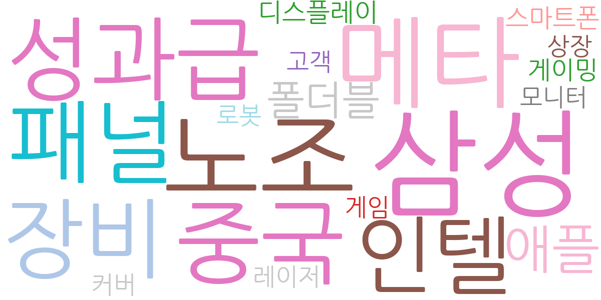
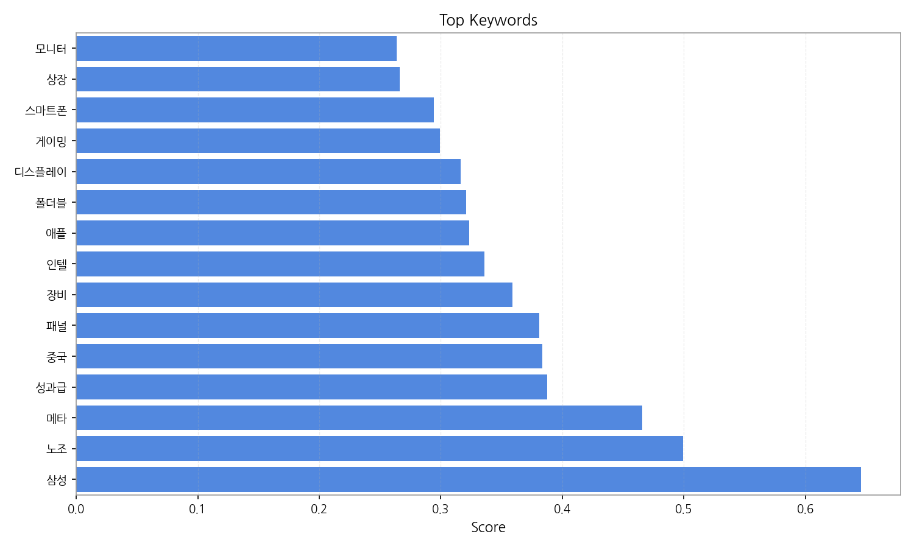
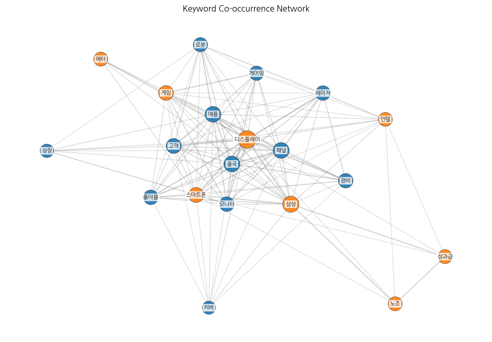
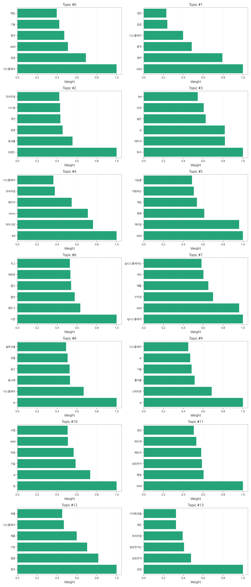
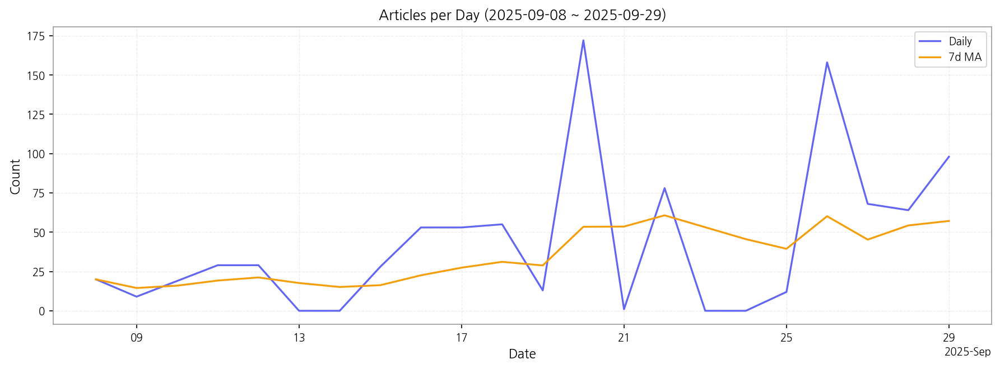

# Weekly/New Biz Report (2025-09-30)

## Executive Summary

- 이번 기간 핵심 토픽과 키워드, 주요 시사점을 요약합니다.

## 데일리 인텔리전스 브리핑 (디스플레이 산업)

**1. 핵심 맥락:**

*   **OLED 기술 경쟁 심화 및 시장 확대:** OLED는 여전히 디스플레이 산업의 핵심 키워드이며, 특히 게이밍, TV, 스마트폰, 폴더블 등 다양한 응용 분야에서 프리미엄 제품을 중심으로 시장이 확대되고 있습니다. LG디스플레이의 수익성 개선 노력과 삼성전자의 OLED 패널 생산 확대 움직임은 OLED 시장 경쟁이 더욱 치열해질 것임을 시사합니다.
*   **중국 디스플레이 산업의 성장과 영향력 확대:** 중국은 디스플레이, OLED 장비, 부품 시장에서 중요한 위치를 차지하며, 한국 기업과의 경쟁 심화 및 공급망 변화에 영향을 미치고 있습니다. 특히, 중국의 디스플레이 기술 투자는 한국 기업에게 위협 요인이 될 수 있습니다.
*   **AI, AR/VR 기술 융합 및 신규 디스플레이 응용:** AI 기술은 스마트폰, 폴더블폰 등 디스플레이 제품의 성능 향상에 기여하고 있으며, AR/VR 기술은 새로운 디스플레이 응용 분야를 창출하고 있습니다. 특히, AR/VR 디스플레이는 광고, 노트북, XR 등 다양한 분야에서 활용될 가능성이 높습니다.

**2. 최근 변화/스파이크:**

*   **2025년 9월 20일, 26일 기사 수 급증:** 9월 20일과 26일에 기사 수가 급증한 것은 "삼성", "노조", "메타", "성과급" 등의 키워드와 연관되어 있습니다. 이는 삼성의 노사 관계 이슈 및 메타버스 관련 디스플레이 기술 개발 동향이 시장의 높은 관심을 받고 있음을 의미합니다. 또한, "패널", "장비" 키워드와 함께 디스플레이 생산 관련 이슈가 복합적으로 작용한 것으로 추정됩니다.

**3. 실무 인사이트:**

*   **OLED 기술 포트폴리오 다변화 및 차세대 디스플레이 기술 확보:** OLED 시장 경쟁 심화에 대응하기 위해 고성능 게이밍 OLED, 폴더블 OLED 등 고부가가치 제품 개발에 집중하고, 마이크로 LED, AR/VR 디스플레이 등 차세대 디스플레이 기술 개발에 대한 투자를 확대해야 합니다.
*   **중국 시장 전략 재검토 및 공급망 다변화:** 중국 디스플레이 산업의 성장과 경쟁 심화에 대응하기 위해 중국 시장 전략을 재검토하고, 핵심 부품 및 장비 공급망을 다변화하여 안정적인 생산 기반을 확보해야 합니다.
*   **AI, AR/VR 기술 융합 및 신규 사업 기회 발굴:** AI, AR/VR 기술을 디스플레이 제품에 융합하여 새로운 사용자 경험을 제공하고, AR/VR 디스플레이를 활용한 광고, 교육, 엔터테인먼트 등 신규 사업 기회를 발굴해야 합니다.

## Key Metrics

- 기간: 2025-09-08 ~ 2025-09-29
- 총 기사 수: 959
- 문서 수: N/A
- 키워드 수(상위): 15
- 토픽 수: 14
- 시계열 데이터 일자 수: 22

## Top Keywords

| Rank | Keyword | Score |
|---:|---|---:|
| 1 | 삼성 | 0.646 |
| 2 | 노조 | 0.500 |
| 3 | 메타 | 0.466 |
| 4 | 성과급 | 0.388 |
| 5 | 중국 | 0.383 |
| 6 | 패널 | 0.381 |
| 7 | 장비 | 0.359 |
| 8 | 인텔 | 0.336 |
| 9 | 애플 | 0.324 |
| 10 | 폴더블 | 0.321 |
| 11 | 디스플레이 | 0.316 |
| 12 | 게이밍 | 0.300 |
| 13 | 스마트폰 | 0.294 |
| 14 | 상장 | 0.266 |
| 15 | 모니터 | 0.263 |

## Topics

- 디스플레이, 로봇, oled (#0)
  - 대표 단어: 디스플레이, 로봇, oled, 중국, 기술, 핵심
- oled, 장비, 중국 (#1)
  - 대표 단어: oled, 장비, 중국, 디스플레이, 공급, 생산
- 브랜드, 효과를, 로봇 (#2)
  - 대표 단어: 브랜드, 효과를, 로봇, 개선, 시스템, 프리미엄
- 투자, 레이저, ai (#3)
  - 대표 단어: 투자, 레이저, ai, 높은, 미국, led
- led, 마이크로, micro (#4)
  - 대표 단어: led, 마이크로, micro, 레이저, 프리미엄, 디스플레이
- oled, 게이밍, 화면 (#5)
  - 대표 단어: oled, 게이밍, 화면, 게임, 지원하는, 기능을
- 시즌, 앞두고, 많이 (#6)
  - 대표 단어: 시즌, 앞두고, 많이, 열고, 새로운, 리그
- lg디스플레이, oled, 수익성 (#7)
  - 대표 단어: lg디스플레이, oled, 수익성, 애플, 개선, lg디스플레이는
- ar, 디스플레이, 동시에 (#8)
  - 대표 단어: ar, 디스플레이, 동시에, 광고, 모듈, 솔루션을
- ai, 스마트폰, 폴더블 (#9)
  - 대표 단어: ai, 스마트폰, 폴더블, 기술, ar, 디스플레이
- lg, ai, 기술 (#10)
  - 대표 단어: lg, ai, 기술, 미래, oled, 사업
- oled, 패널, 삼성전자 (#11)
  - 대표 단어: oled, 패널, 삼성전자, 메모리, 반도체, 생산
- 중국, 일본, 가장 (#12)
  - 대표 단어: 중국, 일본, 가장, 제품, 디스플레이, 부품
- 삼성, 삼성전자, 삼성전자는 (#13)
  - 대표 단어: 삼성, 삼성전자, 삼성전자는, 프리미엄, 제도, 기자회견을

## Trend

- 최근 14~30일 기사 수 추세와 7일 이동평균선을 제공합니다.

## Insights

## 데일리 인텔리전스 브리핑 (디스플레이 산업)

**1. 핵심 맥락:**

*   **OLED 기술 경쟁 심화 및 시장 확대:** OLED는 여전히 디스플레이 산업의 핵심 키워드이며, 특히 게이밍, TV, 스마트폰, 폴더블 등 다양한 응용 분야에서 프리미엄 제품을 중심으로 시장이 확대되고 있습니다. LG디스플레이의 수익성 개선 노력과 삼성전자의 OLED 패널 생산 확대 움직임은 OLED 시장 경쟁이 더욱 치열해질 것임을 시사합니다.
*   **중국 디스플레이 산업의 성장과 영향력 확대:** 중국은 디스플레이, OLED 장비, 부품 시장에서 중요한 위치를 차지하며, 한국 기업과의 경쟁 심화 및 공급망 변화에 영향을 미치고 있습니다. 특히, 중국의 디스플레이 기술 투자는 한국 기업에게 위협 요인이 될 수 있습니다.
*   **AI, AR/VR 기술 융합 및 신규 디스플레이 응용:** AI 기술은 스마트폰, 폴더블폰 등 디스플레이 제품의 성능 향상에 기여하고 있으며, AR/VR 기술은 새로운 디스플레이 응용 분야를 창출하고 있습니다. 특히, AR/VR 디스플레이는 광고, 노트북, XR 등 다양한 분야에서 활용될 가능성이 높습니다.

**2. 최근 변화/스파이크:**

*   **2025년 9월 20일, 26일 기사 수 급증:** 9월 20일과 26일에 기사 수가 급증한 것은 "삼성", "노조", "메타", "성과급" 등의 키워드와 연관되어 있습니다. 이는 삼성의 노사 관계 이슈 및 메타버스 관련 디스플레이 기술 개발 동향이 시장의 높은 관심을 받고 있음을 의미합니다. 또한, "패널", "장비" 키워드와 함께 디스플레이 생산 관련 이슈가 복합적으로 작용한 것으로 추정됩니다.

**3. 실무 인사이트:**

*   **OLED 기술 포트폴리오 다변화 및 차세대 디스플레이 기술 확보:** OLED 시장 경쟁 심화에 대응하기 위해 고성능 게이밍 OLED, 폴더블 OLED 등 고부가가치 제품 개발에 집중하고, 마이크로 LED, AR/VR 디스플레이 등 차세대 디스플레이 기술 개발에 대한 투자를 확대해야 합니다.
*   **중국 시장 전략 재검토 및 공급망 다변화:** 중국 디스플레이 산업의 성장과 경쟁 심화에 대응하기 위해 중국 시장 전략을 재검토하고, 핵심 부품 및 장비 공급망을 다변화하여 안정적인 생산 기반을 확보해야 합니다.
*   **AI, AR/VR 기술 융합 및 신규 사업 기회 발굴:** AI, AR/VR 기술을 디스플레이 제품에 융합하여 새로운 사용자 경험을 제공하고, AR/VR 디스플레이를 활용한 광고, 교육, 엔터테인먼트 등 신규 사업 기회를 발굴해야 합니다.

## Opportunities (Top 5)

| Idea | Target | Value Prop | Score |
|---|---|---|---:|
| 메타버스용 초고해상도 마이크로 OLED 디스플레이 | 북미 빅테크 기업 (Meta, Apple, Google) | 기존 디스플레이 대비 압도적인 해상도와 명암비, 빠른 응답 속도를 제공하여 몰입감 넘치는 VR/AR 경험을 선사한다. 초소형, 초경량 디자인으로 장시간 사용에도 편안함을 제공하며, 저전력 소모로 기기 사용 시간을 극대화한다. | 4.50 |
| AI 기반 디스플레이 공정 자동화 및 수율 예측 솔루션 | 국내외 디스플레이 제조사 (Samsung Display, LG Display, BOE, CSOT) | AI 기반의 실시간 공정 데이터 분석 및 예측 모델을 통해 수율 저하 요인을 사전에 감지하고 최적의 공정 조건을 자동으로 설정하여 수율을 극대화한다. 또한, 불량 발생 원인을 신속하게 파악하고 개선 방안을 제시하여 생산 효율성을 향상시킨다. | 4.30 |
| 차량용 AR HUD (Head-Up Display) 솔루션 | 글로벌 완성차 OEM (Tier 1 부품사 포함) | 운전자 시야를 방해하지 않으면서도 증강현실 기반의 네비게이션, 안전 경고, 엔터테인먼트 정보를 제공하여 운전 경험을 혁신하고 안전성을 향상시킨다. MicroLED 기반의 고휘도, 고해상도 디스플레이를 통해 주간에도 선명한 AR 영상 제공. | 4.20 |
| 퀀텀닷 컬러 필터 기반의 고색재현 MicroLED 디스플레이 | 글로벌 TV 제조사 (Samsung, LG, Sony) | 퀀텀닷 컬러 필터를 MicroLED 디스플레이에 적용하여 기존 대비 향상된 색재현율과 색정확도를 제공한다. 단색 MicroLED 소자를 사용하여 생산 공정을 단순화하고 비용을 절감하며, 넓은 시야각과 높은 에너지 효율을 제공한다. | 4.00 |
| IT 기기용 벤더블 OLED 패널 솔루션 | 글로벌 IT 기기 제조사 (Samsung, LG, Lenovo, HP) | 완전한 폴딩 및 롤링이 가능한 혁신적인 폼팩터를 구현하여 휴대성과 사용성을 극대화한다. UTG (Ultra Thin Glass) 또는 CPI (Colorless Polyimide) 기반의 유연한 기판과 최적화된 박막 봉지 기술을 통해 뛰어난 내구성과 신뢰성을 제공한다. | 3.80 |

## Appendix

- 데이터: keywords.json, topics.json, trend_timeseries.json, trend_insights.json, biz_opportunities.json