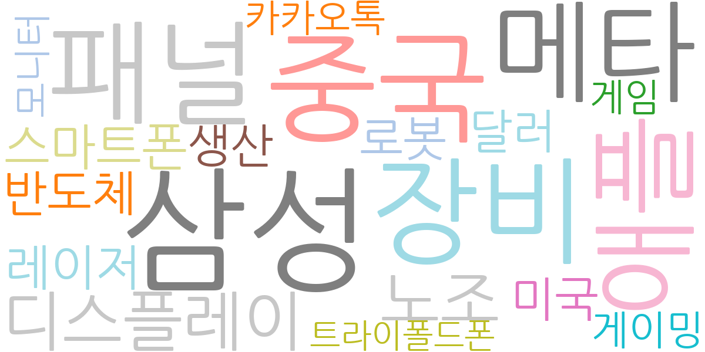
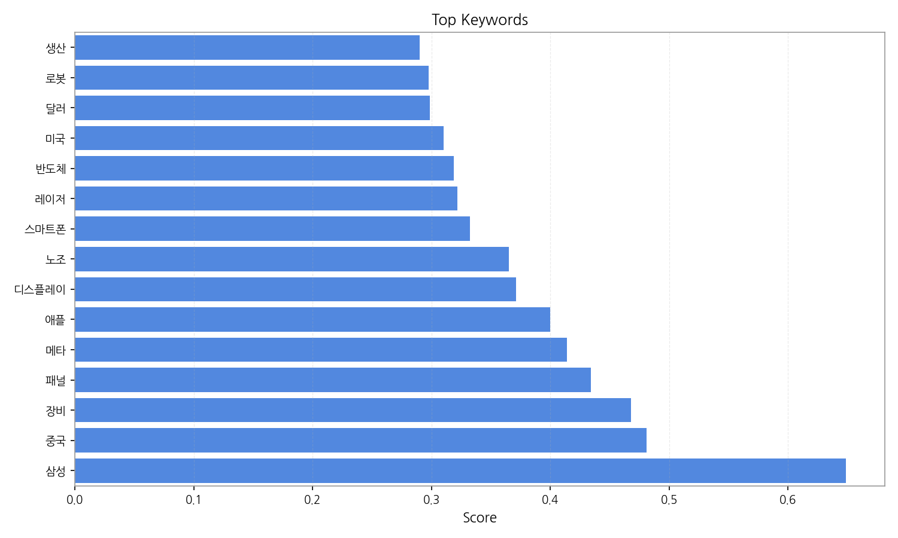
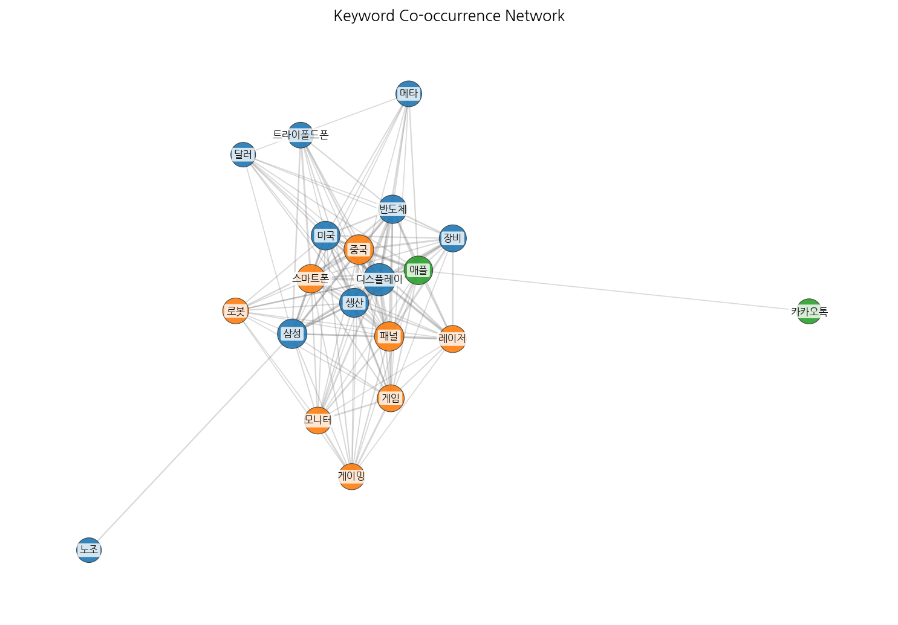
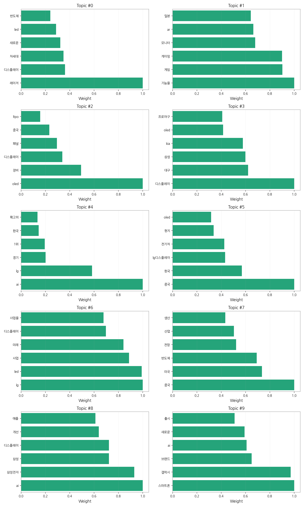
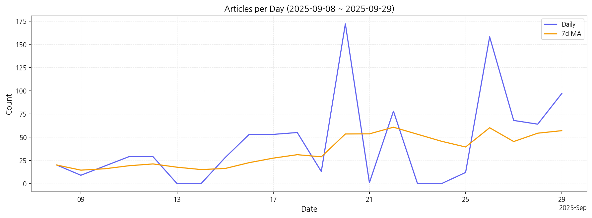

# Weekly/New Biz Report (2025-09-30)

## Executive Summary

- 이번 기간 핵심 토픽과 키워드, 주요 시사점을 요약합니다.

## 데일리 인텔리전스 브리핑

**1. 핵심 맥락:**

*   **AI 기반 디스플레이 기술 경쟁 심화:** 삼성, LG, 애플 등 주요 기업들이 AI 기술을 디스플레이에 접목하여 제품 경쟁력 강화에 집중하고 있으며, 특히 스마트폰과 프리미엄 디스플레이 시장에서 AI 기능이 핵심 차별화 요소로 부상하고 있습니다.
*   **OLED 기술 주도권 경쟁 및 중국 시장 공략:** OLED, 특히 LTPO OLED 패널 기술을 중심으로 디스플레이 업체들의 기술 경쟁이 치열하며, 중국 시장은 여전히 중요한 생산 및 소비 기지로 인식되어, 중국 시장 내 점유율 확대 및 공급망 구축을 위한 경쟁이 심화되고 있습니다.
*   **차세대 디스플레이 기술 개발 및 상용화 노력:** 레이저, Micro LED 등 차세대 디스플레이 기술 개발이 활발하게 진행 중이며, 자동차, 게이밍, AR 등 다양한 분야에서 새로운 디스플레이 기술 적용을 모색하고 있습니다.

**2. 최근 변화/스파이크:**

*   **2025년 9월 20일, 26일 기사 수 급증:** 이 시기에 디스플레이 관련 기사가 급증한 것은 삼성, 애플 등의 주요 기업들이 AI 기술을 접목한 새로운 스마트폰 출시 및 관련 투자 계획을 발표했거나, 중국 시장 내 OLED 생산 및 공급망 관련 이슈가 발생했을 가능성이 높습니다. 특히 "스마트폰", "갤럭시", "AI", "중국", "OLED" 등의 키워드가 복합적으로 작용한 결과로 추정됩니다.

**3. 실무 인사이트:**

*   **AI 기반 디스플레이 기술 개발 로드맵 구체화:** AI 알고리즘을 활용한 디스플레이 화질 개선, 전력 효율 향상, 사용자 인터페이스 최적화 등 구체적인 기술 개발 목표를 설정하고, 관련 연구 개발 투자를 확대해야 합니다.
*   **중국 시장 맞춤형 OLED 제품 전략 수립:** 중국 시장의 특성과 소비자 니즈를 반영한 OLED 제품 포트폴리오를 구축하고, 현지 파트너십 강화 및 공급망 안정화 노력을 통해 시장 경쟁력을 확보해야 합니다.
*   **차세대 디스플레이 기술 상용화 준비:** 레이저, Micro LED 등 차세대 디스플레이 기술의 상용화를 위한 기술적 난제를 해결하고, 초기 시장 진입을 위한 전략적 파트너십 구축 및 투자 유치를 적극적으로 추진해야 합니다.

## Key Metrics

- 기간: 2025-09-08 ~ 2025-09-29
- 총 기사 수: 958
- 문서 수: N/A
- 키워드 수(상위): 15
- 토픽 수: 10
- 시계열 데이터 일자 수: 22

## Top Keywords

| Rank | Keyword | Score |
|---:|---|---:|
| 1 | 삼성 | 0.649 |
| 2 | 중국 | 0.481 |
| 3 | 장비 | 0.468 |
| 4 | 패널 | 0.434 |
| 5 | 메타 | 0.414 |
| 6 | 애플 | 0.400 |
| 7 | 디스플레이 | 0.371 |
| 8 | 노조 | 0.365 |
| 9 | 스마트폰 | 0.332 |
| 10 | 레이저 | 0.322 |
| 11 | 반도체 | 0.319 |
| 12 | 미국 | 0.310 |
| 13 | 달러 | 0.299 |
| 14 | 로봇 | 0.298 |
| 15 | 생산 | 0.290 |

## Topics

- 레이저, 디스플레이, 차세대 (#0)
  - 대표 단어: 레이저, 디스플레이, 차세대, 새로운, led, 반도체
- 기능을, 게임, 게이밍 (#1)
  - 대표 단어: 기능을, 게임, 게이밍, 모니터, ar, 일본
- oled, 장비, 디스플레이 (#2)
  - 대표 단어: oled, 장비, 디스플레이, 패널, 중국, ltpo
- 디스플레이, 대구, 삼성 (#3)
  - 대표 단어: 디스플레이, 대구, 삼성, kia, oled, 프로야구
- ai, lg, 경기 (#4)
  - 대표 단어: ai, lg, 경기, 1위, 한국, 확고히
- 중국, 한국, lg디스플레이 (#5)
  - 대표 단어: 중국, 한국, lg디스플레이, 전기차, 현지, oled
- lg, led, 사업 (#6)
  - 대표 단어: lg, led, 사업, 미래, 디스플레이, 사업을
- 중국, 미국, 반도체 (#7)
  - 대표 단어: 중국, 미국, 반도체, 전망, 산업, 생산
- ai, 삼성전자, 삼성 (#8)
  - 대표 단어: ai, 삼성전자, 삼성, 디스플레이, 개선, 애플
- 스마트폰, 갤럭시, 브랜드 (#9)
  - 대표 단어: 스마트폰, 갤럭시, 브랜드, ai, 새로운, 출시

## Trend

- 최근 14~30일 기사 수 추세와 7일 이동평균선을 제공합니다.

## Insights

## 데일리 인텔리전스 브리핑

**1. 핵심 맥락:**

*   **AI 기반 디스플레이 기술 경쟁 심화:** 삼성, LG, 애플 등 주요 기업들이 AI 기술을 디스플레이에 접목하여 제품 경쟁력 강화에 집중하고 있으며, 특히 스마트폰과 프리미엄 디스플레이 시장에서 AI 기능이 핵심 차별화 요소로 부상하고 있습니다.
*   **OLED 기술 주도권 경쟁 및 중국 시장 공략:** OLED, 특히 LTPO OLED 패널 기술을 중심으로 디스플레이 업체들의 기술 경쟁이 치열하며, 중국 시장은 여전히 중요한 생산 및 소비 기지로 인식되어, 중국 시장 내 점유율 확대 및 공급망 구축을 위한 경쟁이 심화되고 있습니다.
*   **차세대 디스플레이 기술 개발 및 상용화 노력:** 레이저, Micro LED 등 차세대 디스플레이 기술 개발이 활발하게 진행 중이며, 자동차, 게이밍, AR 등 다양한 분야에서 새로운 디스플레이 기술 적용을 모색하고 있습니다.

**2. 최근 변화/스파이크:**

*   **2025년 9월 20일, 26일 기사 수 급증:** 이 시기에 디스플레이 관련 기사가 급증한 것은 삼성, 애플 등의 주요 기업들이 AI 기술을 접목한 새로운 스마트폰 출시 및 관련 투자 계획을 발표했거나, 중국 시장 내 OLED 생산 및 공급망 관련 이슈가 발생했을 가능성이 높습니다. 특히 "스마트폰", "갤럭시", "AI", "중국", "OLED" 등의 키워드가 복합적으로 작용한 결과로 추정됩니다.

**3. 실무 인사이트:**

*   **AI 기반 디스플레이 기술 개발 로드맵 구체화:** AI 알고리즘을 활용한 디스플레이 화질 개선, 전력 효율 향상, 사용자 인터페이스 최적화 등 구체적인 기술 개발 목표를 설정하고, 관련 연구 개발 투자를 확대해야 합니다.
*   **중국 시장 맞춤형 OLED 제품 전략 수립:** 중국 시장의 특성과 소비자 니즈를 반영한 OLED 제품 포트폴리오를 구축하고, 현지 파트너십 강화 및 공급망 안정화 노력을 통해 시장 경쟁력을 확보해야 합니다.
*   **차세대 디스플레이 기술 상용화 준비:** 레이저, Micro LED 등 차세대 디스플레이 기술의 상용화를 위한 기술적 난제를 해결하고, 초기 시장 진입을 위한 전략적 파트너십 구축 및 투자 유치를 적극적으로 추진해야 합니다.

## Opportunities (Top 5)

| Idea | Target | Value Prop | Score |
|---|---|---|---:|
| AR/VR/XR용 초고해상도 마이크로디스플레이 솔루션 | 북미 빅테크 기업, AR/VR/XR 기기 제조사 | 기존 LCD/OLED 대비 압도적인 해상도와 명암비, 응답 속도를 제공하는 MicroLED 마이크로디스플레이 솔루션. 몰입감 극대화 및 어지럼증 해소. | 4.50 |
| AI 기반 차량용 HUD 증강 현실 솔루션 | 글로벌 완성차 OEM, 자율주행 솔루션 개발 기업 | AI 기반 실시간 증강 현실 정보 제공으로 운전자의 인지 부하 감소 및 안전 운전 지원. 경쟁사 대비 높은 해상도와 밝기, 넓은 시야각을 제공하는 MicroLED HUD 기술 적용. | 4.20 |
| AI 기반 디스플레이 공정 자동화 및 수율 개선 솔루션 | 국내외 디스플레이 제조사 | AI 기반 실시간 공정 데이터 분석 및 예측을 통해 불량 발생 가능성을 사전에 감지하고, 공정 조건을 최적화하여 수율을 극대화하는 솔루션. 인건비 절감 및 생산성 향상. | 4.00 |
| IT 기기용 벤더블 OLED 패널 솔루션 | 글로벌 스마트폰 제조사, IT 기기 제조사 | 기존 폴더블 OLED 대비 향상된 내구성과 유연성을 제공하는 벤더블 OLED 패널 솔루션. 주름 문제 해결 및 다양한 폼팩터 디자인 구현 가능. | 3.80 |
| 퀀텀닷 컬러 필터 기반 LCD 고색재현율 솔루션 | 글로벌 TV 제조사, 모니터 제조사 | 기존 LCD 대비 향상된 색재현율과 명암비를 제공하는 퀀텀닷 컬러 필터 솔루션. OLED 대비 낮은 생산 비용으로 고화질 디스플레이 구현 가능. | 3.50 |

## Appendix

- 데이터: keywords.json, topics.json, trend_timeseries.json, trend_insights.json, biz_opportunities.json