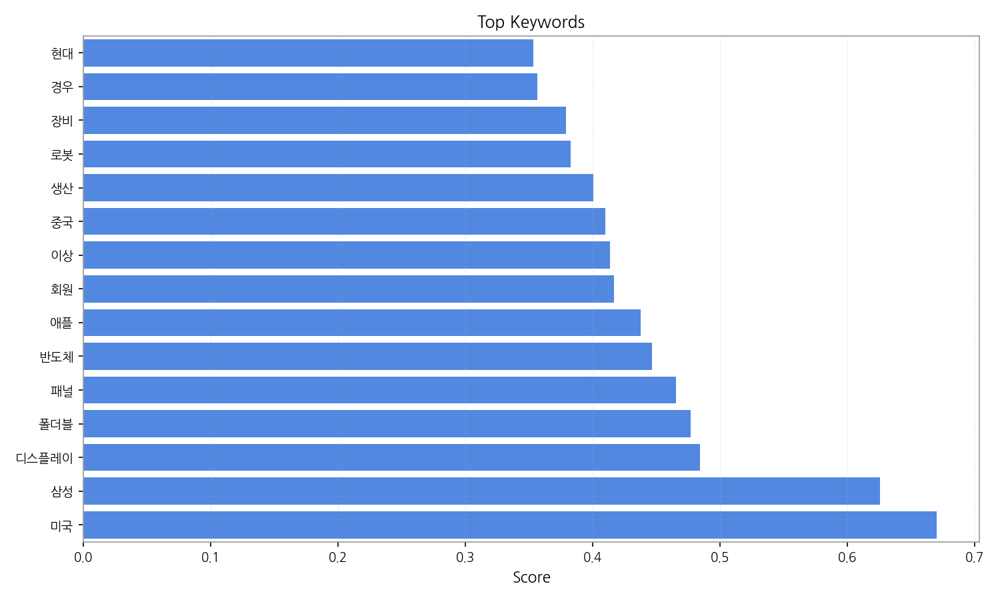
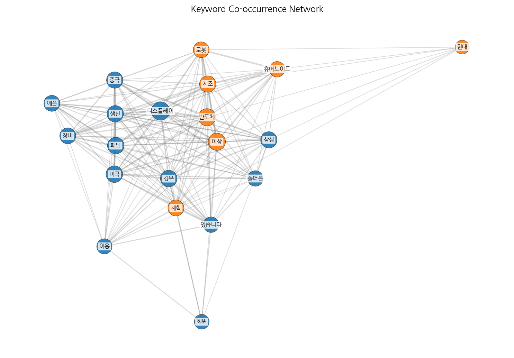
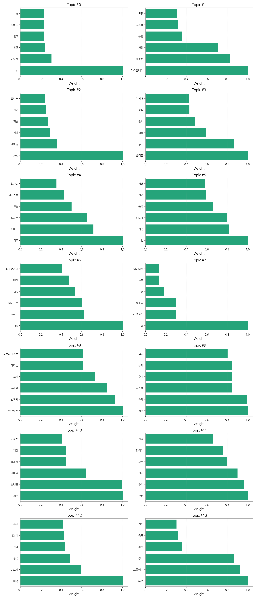
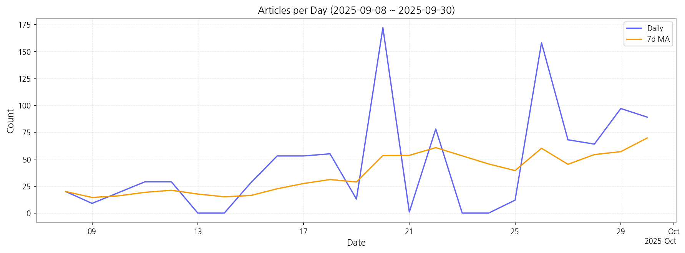

# Weekly/New Biz Report (2025-10-01)

## Executive Summary

- 이번 기간 핵심 토픽과 키워드, 주요 시사점을 요약합니다.

## 데일리 인텔리전스 브리핑

**1. 핵심 맥락:**

*   **OLED 기술 경쟁 심화 및 시장 확대:** OLED, QD-OLED, 폴더블 디스플레이 관련 뉴스가 꾸준히 발생하고 있으며, 특히 게이밍, 대형 패널, 차세대 제품 등 고부가 가치 시장을 중심으로 기술 혁신과 제품 출시 경쟁이 치열하게 전개되고 있습니다. 이는 디스플레이 업체들이 수익성 개선을 위해 프리미엄 시장 공략에 집중하고 있음을 시사합니다.
*   **AI 기술 융합 및 스마트 디스플레이 진화:** AI 기술이 디스플레이 산업 전반에 걸쳐 융합되고 있으며, 특히 AI 팩토리, 첨단 기술, VR/AR 등과 결합하여 새로운 사용자 경험을 제공하는 스마트 디스플레이 개발이 활발하게 이루어지고 있습니다. 이는 디스플레이가 단순한 정보 표시 장치를 넘어 AI 기반의 지능형 인터페이스로 진화하고 있음을 의미합니다.
*   **미-중 기술 패권 경쟁 속 디스플레이 산업 영향:** 미국과 중국 간의 반도체, 관세 관련 뉴스가 지속적으로 발생하며, 이는 디스플레이 산업에도 영향을 미치고 있습니다. 특히 중국의 OLED 투자 확대와 미국의 제재 가능성 등이 복합적으로 작용하며, 디스플레이 장비 공급망 및 시장 경쟁 구도에 불확실성을 더하고 있습니다.

**2. 최근 변화/스파이크:**

*   **2025년 9월 20일, 26일 기사 수 급증:** 9월 20일과 26일에 기사 수가 급증한 것은 폴더블, OLED, 디스플레이, 패널 등 관련 키워드와 연관되어 있습니다. 추석 시즌을 앞두고 폴더블폰 신제품 출시, OLED TV 신모델 발표, 대형 디스플레이 패널 공급 계약 등 시장의 이목을 끄는 이벤트들이 집중적으로 발생했을 가능성이 높습니다. 또한, 삼성, 애플 등 주요 기업의 신기술 발표 및 투자 계획 공개도 영향을 미쳤을 것으로 추정됩니다.

**3. 실무 인사이트:**

*   **사업 개발:**
    *   **AI 기반 스마트 디스플레이 솔루션 개발:** AI 기술을 활용하여 사용자 맞춤형 콘텐츠 추천, 자동 화면 조정, 음성 인식 제어 등 지능형 기능을 제공하는 스마트 디스플레이 솔루션 개발을 추진하고, VR/AR 기기, 차량용 디스플레이 등 틈새시장을 공략합니다.
    *   **폴더블 디스플레이 생태계 확장:** 폴더블 디스플레이의 내구성, 사용성, 디자인을 개선하고, 다양한 폼팩터(Foldable, Rollable, Stretchable)를 적용한 제품 개발을 통해 폴더블 디스플레이 시장을 선점합니다. 또한, 폴더블 디스플레이에 최적화된 콘텐츠 및 서비스 플랫폼 구축을 통해 생태계를 확장합니다.
*   **기술 기획:**
    *   **QD-OLED 기술 경쟁력 강화:** QD-OLED 기술의 색재현율, 시야각, 명암비 등 화질 성능을 향상시키고, 생산 비용 절감을 위한 기술 개발에 집중합니다. 또한, 차세대 디스플레이 기술인 Micro LED, 양자점 기술 개발에도 투자를 확대하여 기술 포트폴리오를 다변화합니다.
    *   **OLED 장비 국산화 및 공급망 다변화:** 중국 디스플레이 업체의 OLED 투자 확대에 대응하여 OLED 장비 국산화를 추진하고, 핵심 소재 및 부품의 공급망을 다변화하여 안정적인 생산 기반을 확보합니다. 또한, 미국, 유럽 등 신규 시장 진출을 모색하여 시장 다변화를 추진합니다.

## Key Metrics

- 기간: 2025-09-08 ~ 2025-09-30
- 총 기사 수: 1,047
- 문서 수: N/A
- 키워드 수(상위): 15
- 토픽 수: 14
- 시계열 데이터 일자 수: 23

## Top Keywords

| Rank | Keyword | Score |
|---:|---|---:|
| 1 | 미국 | 0.670 |
| 2 | 삼성 | 0.625 |
| 3 | 디스플레이 | 0.484 |
| 4 | 폴더블 | 0.477 |
| 5 | 패널 | 0.465 |
| 6 | 반도체 | 0.447 |
| 7 | 애플 | 0.438 |
| 8 | 회원 | 0.417 |
| 9 | 이상 | 0.413 |
| 10 | 중국 | 0.410 |
| 11 | 생산 | 0.400 |
| 12 | 로봇 | 0.383 |
| 13 | 장비 | 0.379 |
| 14 | 경우 | 0.357 |
| 15 | 현대 | 0.353 |

## Topics

- ai, 기술을, 첨단 (#0)
  - 대표 단어: ai, 기술을, 첨단, 않고, 모바일, vr
- 디스플레이, 새로운, 가장 (#1)
  - 대표 단어: 디스플레이, 새로운, 가장, 주행, 시스템, 모델
- oled, 게이밍, 게임 (#2)
  - 대표 단어: oled, 게이밍, 게임, 패널, 화면, 모니터
- 폴더블, pro, 더욱 (#3)
  - 대표 단어: 폴더블, pro, 더욱, 출시, 공식, 차세대
- 경우, 서비스, 회사는 (#4)
  - 대표 단어: 경우, 서비스, 회사는, 또는, 서비스를, 회사의
- lg, 미국, 반도체 (#5)
  - 대표 단어: lg, 미국, 반도체, 중국, 산업, 사용
- led, micro, 마이크로 (#6)
  - 대표 단어: led, micro, 마이크로, ceo, 에서, 삼성전자가
- ai, ai 팩토리, 팩토리 (#7)
  - 대표 단어: ai, ai 팩토리, 팩토리, ax, ai를, 데이터를
- 연구팀은, 반도체, 양자점 (#8)
  - 대표 단어: 연구팀은, 반도체, 양자점, 소자, 패터닝, 포토레지스트
- 실적, 소재, 시스템 (#9)
  - 대표 단어: 실적, 소재, 시스템, 주가, 투자, 역시
- 피부, 브랜드, 프리미엄 (#10)
  - 대표 단어: 피부, 브랜드, 프리미엄, 효과를, 개선, 단순히
- 것은, 추석, 먼저 (#11)
  - 대표 단어: 것은, 추석, 먼저, 오는, 것이다, 가장
- 미국, 반도체, 중국 (#12)
  - 대표 단어: 미국, 반도체, 중국, 전망, 3분기, 투자
- oled, 디스플레이, 장비 (#13)
  - 대표 단어: oled, 디스플레이, 장비, 패널, 중국, 개선

## Trend

- 최근 14~30일 기사 수 추세와 7일 이동평균선을 제공합니다.

## Insights

## 데일리 인텔리전스 브리핑

**1. 핵심 맥락:**

*   **OLED 기술 경쟁 심화 및 시장 확대:** OLED, QD-OLED, 폴더블 디스플레이 관련 뉴스가 꾸준히 발생하고 있으며, 특히 게이밍, 대형 패널, 차세대 제품 등 고부가 가치 시장을 중심으로 기술 혁신과 제품 출시 경쟁이 치열하게 전개되고 있습니다. 이는 디스플레이 업체들이 수익성 개선을 위해 프리미엄 시장 공략에 집중하고 있음을 시사합니다.
*   **AI 기술 융합 및 스마트 디스플레이 진화:** AI 기술이 디스플레이 산업 전반에 걸쳐 융합되고 있으며, 특히 AI 팩토리, 첨단 기술, VR/AR 등과 결합하여 새로운 사용자 경험을 제공하는 스마트 디스플레이 개발이 활발하게 이루어지고 있습니다. 이는 디스플레이가 단순한 정보 표시 장치를 넘어 AI 기반의 지능형 인터페이스로 진화하고 있음을 의미합니다.
*   **미-중 기술 패권 경쟁 속 디스플레이 산업 영향:** 미국과 중국 간의 반도체, 관세 관련 뉴스가 지속적으로 발생하며, 이는 디스플레이 산업에도 영향을 미치고 있습니다. 특히 중국의 OLED 투자 확대와 미국의 제재 가능성 등이 복합적으로 작용하며, 디스플레이 장비 공급망 및 시장 경쟁 구도에 불확실성을 더하고 있습니다.

**2. 최근 변화/스파이크:**

*   **2025년 9월 20일, 26일 기사 수 급증:** 9월 20일과 26일에 기사 수가 급증한 것은 폴더블, OLED, 디스플레이, 패널 등 관련 키워드와 연관되어 있습니다. 추석 시즌을 앞두고 폴더블폰 신제품 출시, OLED TV 신모델 발표, 대형 디스플레이 패널 공급 계약 등 시장의 이목을 끄는 이벤트들이 집중적으로 발생했을 가능성이 높습니다. 또한, 삼성, 애플 등 주요 기업의 신기술 발표 및 투자 계획 공개도 영향을 미쳤을 것으로 추정됩니다.

**3. 실무 인사이트:**

*   **사업 개발:**
    *   **AI 기반 스마트 디스플레이 솔루션 개발:** AI 기술을 활용하여 사용자 맞춤형 콘텐츠 추천, 자동 화면 조정, 음성 인식 제어 등 지능형 기능을 제공하는 스마트 디스플레이 솔루션 개발을 추진하고, VR/AR 기기, 차량용 디스플레이 등 틈새시장을 공략합니다.
    *   **폴더블 디스플레이 생태계 확장:** 폴더블 디스플레이의 내구성, 사용성, 디자인을 개선하고, 다양한 폼팩터(Foldable, Rollable, Stretchable)를 적용한 제품 개발을 통해 폴더블 디스플레이 시장을 선점합니다. 또한, 폴더블 디스플레이에 최적화된 콘텐츠 및 서비스 플랫폼 구축을 통해 생태계를 확장합니다.
*   **기술 기획:**
    *   **QD-OLED 기술 경쟁력 강화:** QD-OLED 기술의 색재현율, 시야각, 명암비 등 화질 성능을 향상시키고, 생산 비용 절감을 위한 기술 개발에 집중합니다. 또한, 차세대 디스플레이 기술인 Micro LED, 양자점 기술 개발에도 투자를 확대하여 기술 포트폴리오를 다변화합니다.
    *   **OLED 장비 국산화 및 공급망 다변화:** 중국 디스플레이 업체의 OLED 투자 확대에 대응하여 OLED 장비 국산화를 추진하고, 핵심 소재 및 부품의 공급망을 다변화하여 안정적인 생산 기반을 확보합니다. 또한, 미국, 유럽 등 신규 시장 진출을 모색하여 시장 다변화를 추진합니다.

## Opportunities (Top 5)

| Idea | Target | Value Prop | Score |
|---|---|---|---:|
| 메타버스 몰입형 경험을 위한 초고해상도 마이크로 OLED XR 디스플레이 | 북미 빅테크 기업 (Meta, Apple, Google 등) | 기존 LCD/OLED 대비 압도적인 해상도, 명암비, 응답속도를 제공하는 마이크로 OLED 디스플레이. 10,000 PPI 이상의 초고해상도, 1,000,000:1 이상의 명암비, 0.01ms 이하의 응답속도를 통해 현실과 구분하기 어려운 몰입형 VR/AR 경험 제공. | 4.50 |
| AI 기반 디스플레이 공정 자동화 및 수율 예측 솔루션 | 디스플레이 제조사 (자사 포함) | AI 기반 실시간 공정 데이터 분석 및 수율 예측, 이상 감지, 공정 최적화 기능을 제공하여 수율 향상 및 비용 절감. 기존 대비 10% 이상 수율 향상, 5% 이상 비용 절감 효과 기대. | 4.30 |
| 차량용 AR HUD (Augmented Reality Head-Up Display) 솔루션 | 글로벌 완성차 OEM (Tier 1 부품사 협력) | 운전자 시야에 자연스럽게 융합되는 AR 정보 제공, 차선 이탈 경고, 전방 차량과의 거리, 내비게이션 정보 등을 실시간으로 제공하여 안전 운전 지원 및 운전 경험 향상. 경쟁사 대비 넓은 시야각, 고해상도, 낮은 왜곡률을 제공하는 MicroLED 기반 HUD. | 4.20 |
| 퀀텀닷(QD) 기반 컬러 필터리스 MicroLED 디스플레이 | 프리미엄 TV 제조사, 디지털 사이니지 기업 | 컬러 필터 없이 퀀텀닷 자체 발광을 통해 높은 색재현율, 넓은 시야각, 뛰어난 에너지 효율을 제공하는 MicroLED 디스플레이. 기존 대비 50% 향상된 광효율, 150% 이상의 색재현율 (BT.2020 기준) 제공. | 4.00 |
| IT 기기용 초저전력, 고화질 폴더블 OLED 패널 | 글로벌 IT 기기 제조사 (Samsung, Lenovo, Dell 등) | 기존 OLED 대비 30% 낮은 전력 소비, 120Hz 고주사율, DCI-P3 100% 색 영역을 지원하는 폴더블 OLED 패널. UTG (Ultra Thin Glass) 적용으로 내구성을 강화하고, 얇고 가벼운 디자인 구현. | 3.80 |

## Appendix

- 데이터: keywords.json, topics.json, trend_timeseries.json, trend_insights.json, biz_opportunities.json