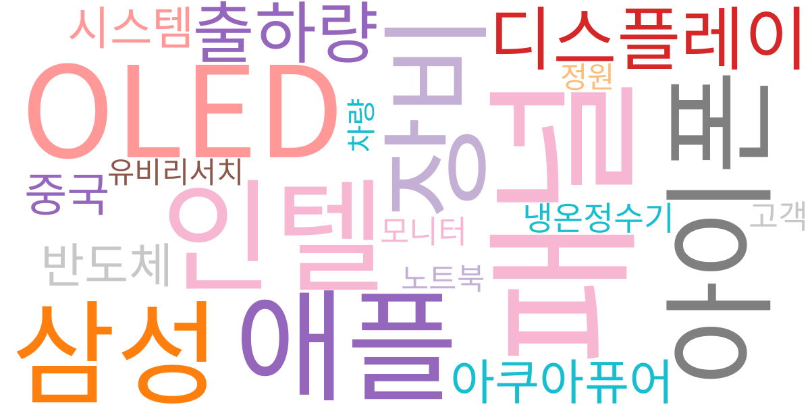
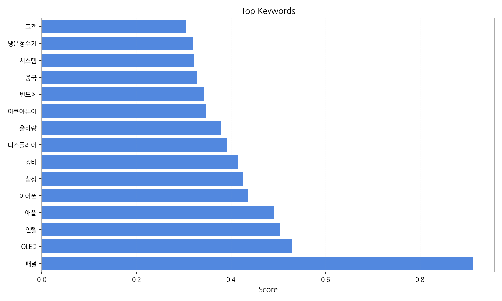
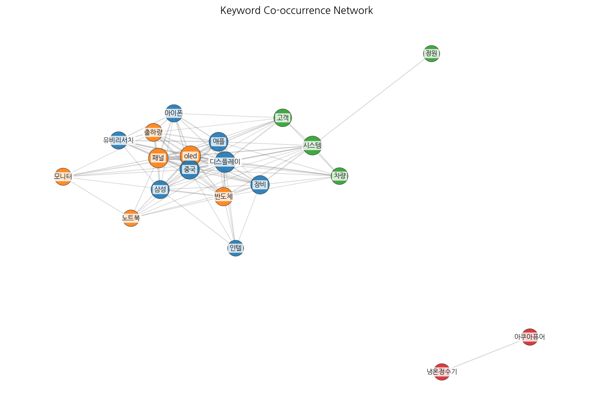
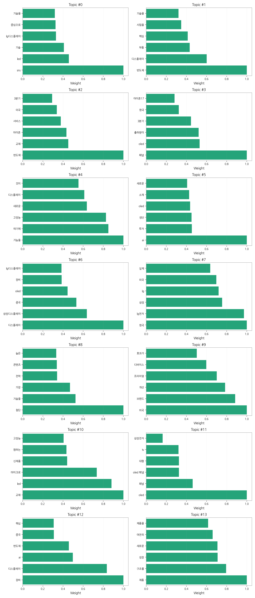
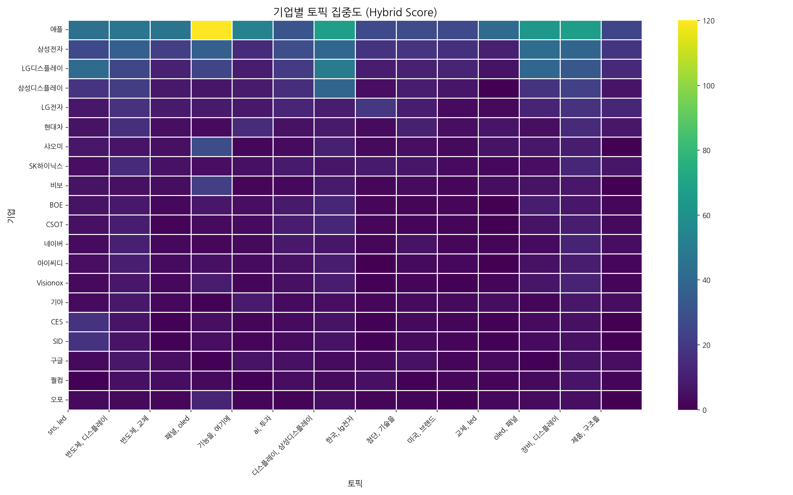
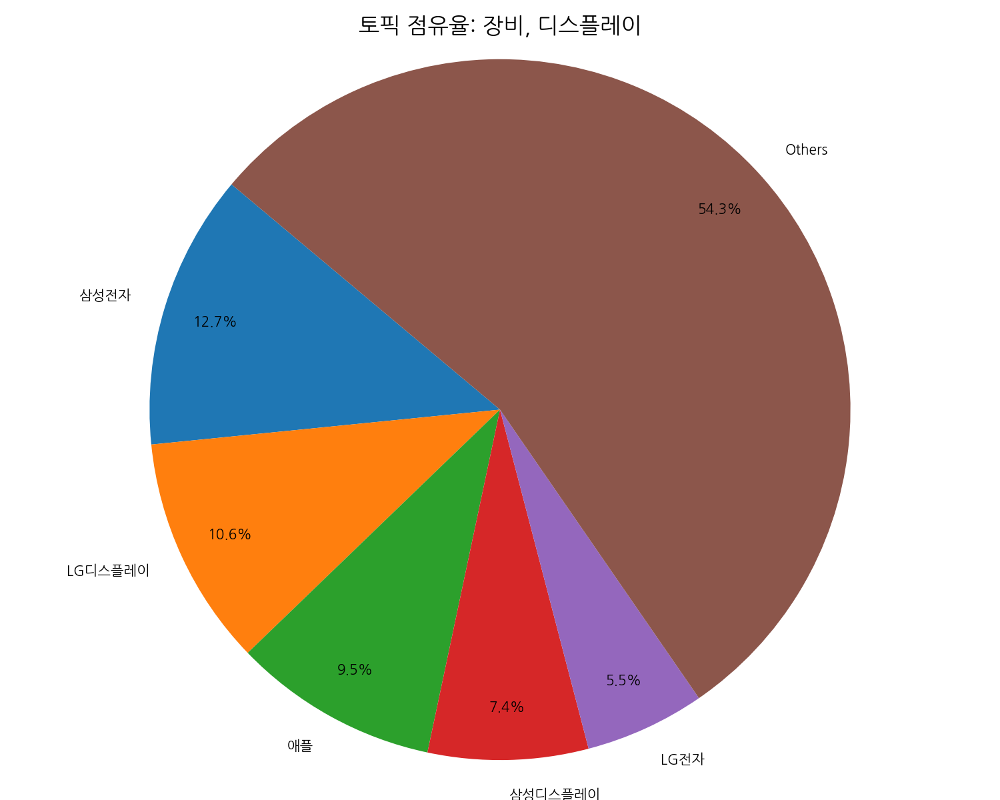
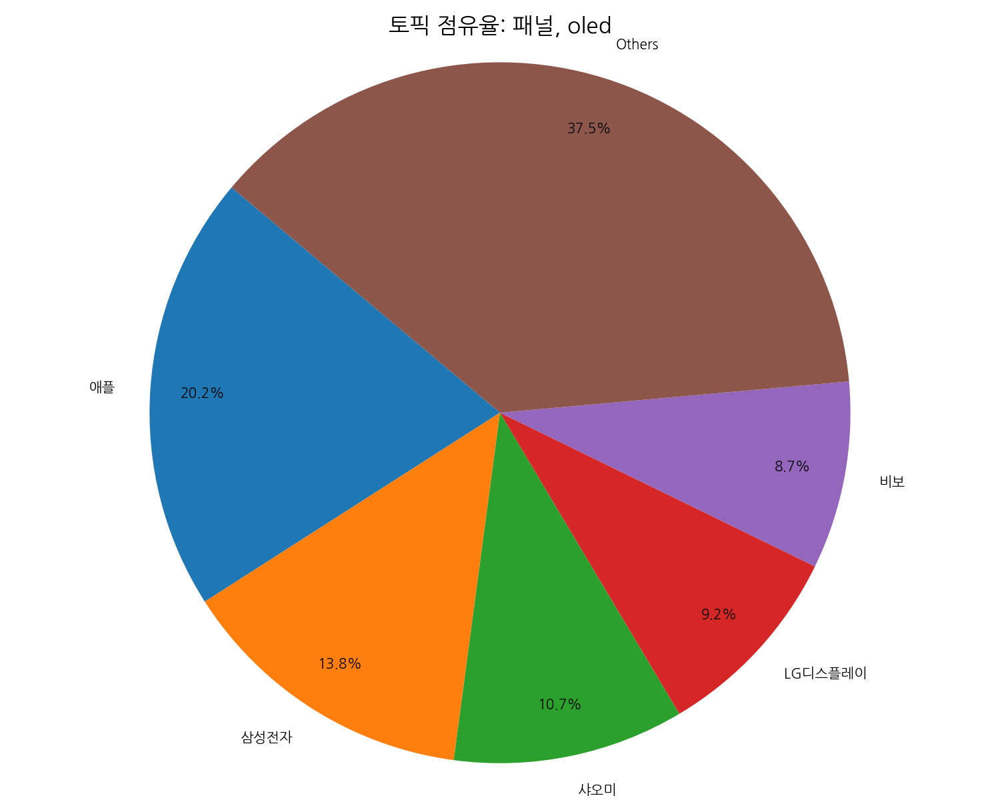
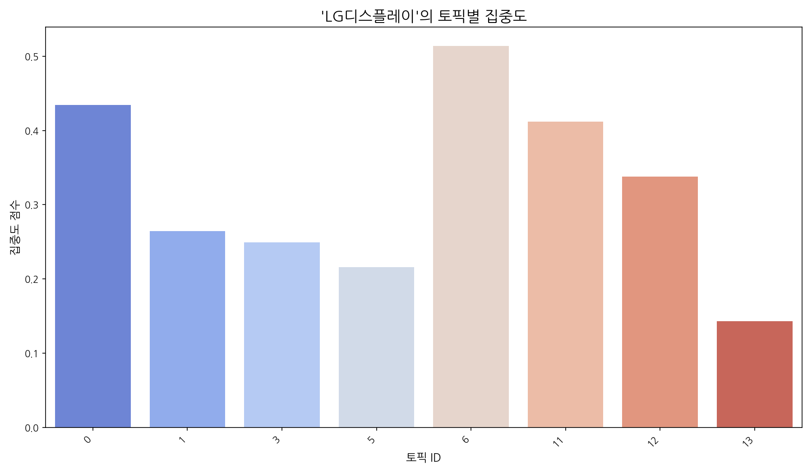
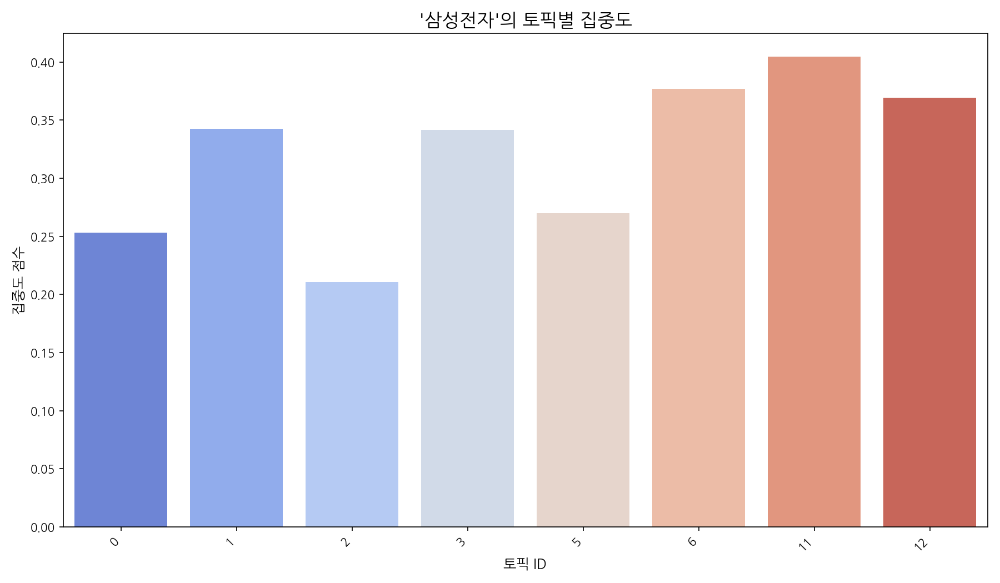
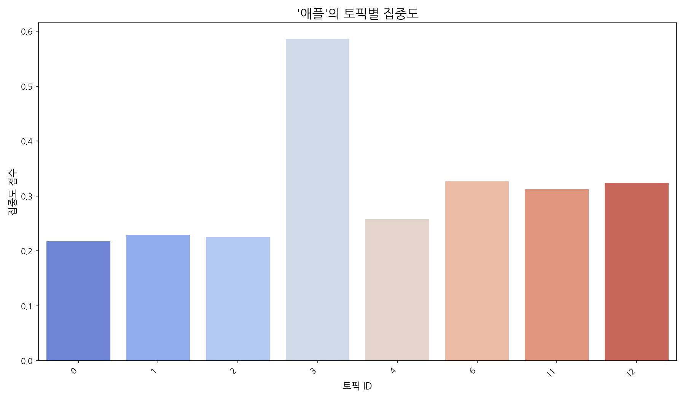

# Weekly/New Biz Report (2025-10-02)

## Executive Summary

- 이번 기간 핵심 토픽과 키워드, 주요 시사점을 요약합니다.

## 데일리 인텔리전스 브리핑 (디스플레이 산업)

**1. 핵심 맥락:**

*   **OLED 시장 경쟁 심화 및 기술 혁신 가속화:** OLED 패널 출하량 증가(Topic 3)와 삼성디스플레이, LG디스플레이 등 주요 기업들의 OLED 기술 개발 및 생산 경쟁(Topic 6)이 심화되고 있으며, AI 기술을 활용한 디스플레이 장비 개발(Topic 12) 및 새로운 OLED 소재 투자(Topic 5)를 통해 기술 혁신이 가속화되고 있습니다. 특히, 아이폰 등 프리미엄 디바이스 시장에서 OLED 채택이 확대되면서(Topic 3), 고성능 디스플레이에 대한 수요가 증가하고 있습니다(Topic 4).
*   **반도체-디스플레이 산업 연계 강화:** 반도체 부품이 디스플레이 산업의 핵심 요소로 자리매김하면서(Topic 1), 반도체-디스플레이 기업 간 협력 및 기술 융합이 중요해지고 있습니다. 특히, AI 기술 발전과 함께 고성능 디스플레이 구현을 위한 반도체 기술의 중요성이 더욱 부각되고 있습니다(Topic 12).
*   **미국 시장 공략 및 프리미엄 브랜드 경쟁:** 미국 시장에서 프리미엄 디바이스 브랜드 경쟁이 치열하며(Topic 9), 특허 기술 확보 및 브랜드 이미지 개선을 통해 시장 점유율을 확대하려는 노력이 중요합니다. 특히, 마이크로 LED 기술을 활용한 프리미엄 디스플레이 시장 진출이 활발해질 것으로 예상됩니다(Topic 10).

**2. 최근 변화/스파이크:**

*   **2025년 9월 20일, 9월 26일, 9월 30일, 10월 1일 기사 수 급증:** 이는 '패널', 'OLED', '아이폰', '삼성', '디스플레이', '출하량' 등의 키워드와 연관되어, 아이폰 신제품 출시 및 OLED 패널 수요 증가에 대한 시장 관심이 집중된 결과로 추론됩니다. 특히, 9월 30일과 10월 1일의 급격한 증가는 3분기 실적 발표 및 4분기 전망에 대한 분석 기사가 집중적으로 보도되었기 때문으로 판단됩니다.

**3. 실무 인사이트:**

*   **차세대 디스플레이 기술 개발 투자 확대:** 마이크로 LED, QD-OLED 등 차세대 디스플레이 기술 개발에 대한 투자를 확대하고, 관련 특허 확보 및 기술 표준 선점에 주력해야 합니다. 특히, AI 기술과 융합된 새로운 디스플레이 기술 개발을 통해 경쟁 우위를 확보해야 합니다.
*   **반도체-디스플레이 협력 강화 및 공급망 안정화:** 반도체 부품 수급 안정화를 위해 반도체 기업과의 전략적 제휴를 강화하고, 디스플레이 모듈 기술 개발 협력을 통해 시너지 효과를 창출해야 합니다. 또한, 핵심 소재 및 장비 공급망 다변화를 통해 외부 변수에 대한 대응력을 강화해야 합니다.
*   **프리미엄 브랜드 이미지 강화 및 고객 맞춤형 마케팅 전략 수립:** 미국 시장을 중심으로 프리미엄 브랜드 이미지를 강화하고, 고객 니즈에 맞는 맞춤형 마케팅 전략을 수립해야 합니다. 특히, 고성능 디스플레이를 선호하는 소비자층을 공략하기 위해 차별화된 제품 경험을 제공하는 데 집중해야 합니다.

## Key Metrics

- 기간: 2025-09-08 ~ 2025-10-01
- 총 기사 수: 2,141
- 문서 수: N/A
- 키워드 수(상위): 15
- 토픽 수: 14
- 시계열 데이터 일자 수: 24

## Top Keywords

| Rank | Keyword | Score |
|---:|---|---:|
| 1 | 패널 | 0.912 |
| 2 | OLED | 0.530 |
| 3 | 인텔 | 0.503 |
| 4 | 애플 | 0.491 |
| 5 | 아이폰 | 0.436 |
| 6 | 삼성 | 0.426 |
| 7 | 장비 | 0.414 |
| 8 | 디스플레이 | 0.392 |
| 9 | 출하량 | 0.378 |
| 10 | 아쿠아퓨어 | 0.348 |
| 11 | 반도체 | 0.343 |
| 12 | 중국 | 0.327 |
| 13 | 시스템 | 0.322 |
| 14 | 냉온정수기 | 0.320 |
| 15 | 고객 | 0.305 |

## Topics

- sns, led, 기술 (#0)
  - 대표 단어: sns, led, 기술, lg디스플레이, 중심으로, 기술을
- 반도체, 디스플레이, 부품 (#1)
  - 대표 단어: 반도체, 디스플레이, 부품, 핵심, 사업을, 기술을
- 반도체, 교체, 아이폰 (#2)
  - 대표 단어: 반도체, 교체, 아이폰, 서비스, 미국, 3분기
- 패널, oled, 출하량이 (#3)
  - 대표 단어: 패널, oled, 출하량이, 3분기, 한국, 아이폰17
- 기능을, 여기에, 고성능 (#4)
  - 대표 단어: 기능을, 여기에, 고성능, 새로운, 디스플레이, 것이
- ai, 투자, 생산 (#5)
  - 대표 단어: ai, 투자, 생산, oled, 소재, 새로운
- 디스플레이, 삼성디스플레이, 중국 (#6)
  - 대표 단어: 디스플레이, 삼성디스플레이, 중국, oled, 장비, lg디스플레이
- 한국, lg전자, 삼성 (#7)
  - 대표 단어: 한국, lg전자, 삼성, lg, 미국, 실제
- 첨단, 기술을, 가장 (#8)
  - 대표 단어: 첨단, 기술을, 가장, 전력, 콘텐츠, 높은
- 미국, 브랜드, 개선 (#9)
  - 대표 단어: 미국, 브랜드, 개선, 프리미엄, 디바이스, 효과가
- 교체, led, 마이크로 (#10)
  - 대표 단어: 교체, led, 마이크로, 신제품, 원하는, 고성능
- oled, 패널, oled 패널 (#11)
  - 대표 단어: oled, 패널, oled 패널, 대형, tv, 삼성전자
- 장비, 디스플레이, ai (#12)
  - 대표 단어: 장비, 디스플레이, ai, 반도체, 중국, 핵심
- 제품, 구조를, 성장 (#13)
  - 대표 단어: 제품, 구조를, 성장, 새로운, 여전히, 제품을

## 기업×토픽 집중도 매트릭스 (주간)

- (분석할 유효 데이터가 없습니다.)

## 기업×토픽 시각적 분석

### 전체 시장 구도 (Heatmap)

> 전체 기업과 토픽 간의 관계를 한눈에 보여줍니다. 색이 진할수록 연관성이 높습니다.

### 주요 토픽별 경쟁 구도 (Pie Charts)

> 가장 뜨거운 주제를 두고 어떤 기업들이 경쟁하는지 점유율을 보여줍니다.

### 주요 기업별 전략 분석 (Bar Charts)

> 시장을 주도하는 주요 기업들이 어떤 토픽에 집중하고 있는지 보여줍니다.

## Trend

- 최근 기사 수 추세와 7일 이동평균선을 제공합니다.

## Insights

## 데일리 인텔리전스 브리핑 (디스플레이 산업)

**1. 핵심 맥락:**

*   **OLED 시장 경쟁 심화 및 기술 혁신 가속화:** OLED 패널 출하량 증가(Topic 3)와 삼성디스플레이, LG디스플레이 등 주요 기업들의 OLED 기술 개발 및 생산 경쟁(Topic 6)이 심화되고 있으며, AI 기술을 활용한 디스플레이 장비 개발(Topic 12) 및 새로운 OLED 소재 투자(Topic 5)를 통해 기술 혁신이 가속화되고 있습니다. 특히, 아이폰 등 프리미엄 디바이스 시장에서 OLED 채택이 확대되면서(Topic 3), 고성능 디스플레이에 대한 수요가 증가하고 있습니다(Topic 4).
*   **반도체-디스플레이 산업 연계 강화:** 반도체 부품이 디스플레이 산업의 핵심 요소로 자리매김하면서(Topic 1), 반도체-디스플레이 기업 간 협력 및 기술 융합이 중요해지고 있습니다. 특히, AI 기술 발전과 함께 고성능 디스플레이 구현을 위한 반도체 기술의 중요성이 더욱 부각되고 있습니다(Topic 12).
*   **미국 시장 공략 및 프리미엄 브랜드 경쟁:** 미국 시장에서 프리미엄 디바이스 브랜드 경쟁이 치열하며(Topic 9), 특허 기술 확보 및 브랜드 이미지 개선을 통해 시장 점유율을 확대하려는 노력이 중요합니다. 특히, 마이크로 LED 기술을 활용한 프리미엄 디스플레이 시장 진출이 활발해질 것으로 예상됩니다(Topic 10).

**2. 최근 변화/스파이크:**

*   **2025년 9월 20일, 9월 26일, 9월 30일, 10월 1일 기사 수 급증:** 이는 '패널', 'OLED', '아이폰', '삼성', '디스플레이', '출하량' 등의 키워드와 연관되어, 아이폰 신제품 출시 및 OLED 패널 수요 증가에 대한 시장 관심이 집중된 결과로 추론됩니다. 특히, 9월 30일과 10월 1일의 급격한 증가는 3분기 실적 발표 및 4분기 전망에 대한 분석 기사가 집중적으로 보도되었기 때문으로 판단됩니다.

**3. 실무 인사이트:**

*   **차세대 디스플레이 기술 개발 투자 확대:** 마이크로 LED, QD-OLED 등 차세대 디스플레이 기술 개발에 대한 투자를 확대하고, 관련 특허 확보 및 기술 표준 선점에 주력해야 합니다. 특히, AI 기술과 융합된 새로운 디스플레이 기술 개발을 통해 경쟁 우위를 확보해야 합니다.
*   **반도체-디스플레이 협력 강화 및 공급망 안정화:** 반도체 부품 수급 안정화를 위해 반도체 기업과의 전략적 제휴를 강화하고, 디스플레이 모듈 기술 개발 협력을 통해 시너지 효과를 창출해야 합니다. 또한, 핵심 소재 및 장비 공급망 다변화를 통해 외부 변수에 대한 대응력을 강화해야 합니다.
*   **프리미엄 브랜드 이미지 강화 및 고객 맞춤형 마케팅 전략 수립:** 미국 시장을 중심으로 프리미엄 브랜드 이미지를 강화하고, 고객 니즈에 맞는 맞춤형 마케팅 전략을 수립해야 합니다. 특히, 고성능 디스플레이를 선호하는 소비자층을 공략하기 위해 차별화된 제품 경험을 제공하는 데 집중해야 합니다.

## Opportunities (Top 5)

| Idea | Target | Value Prop | Score |
|---|---|---|---:|
| 몰입형 XR 경험을 위한 초고해상도 마이크로 OLED 솔루션 | 북미 빅테크 기업 (VR/AR 기기 제조사) | 초고해상도, 고휘도, 초저전력 마이크로 OLED 기술로 몰입감 극대화, 경량화 및 배터리 효율 향상, 차세대 XR 기기 시장 선점 | 4.50 |
| AI 기반 차량용 HUD 증강 현실 솔루션 | 글로벌 완성차 OEM (프리미엄 브랜드 중심) | AI 기반 실시간 도로 정보 분석 및 증강 현실 융합으로 운전 안전성 극대화, 차별화된 프리미엄 운전 경험 제공 (예: 위험 예측, 차선 변경 지원, 보행자 경고) | 4.20 |
| AI 기반 디스플레이 공정 자동화 및 수율 개선 솔루션 | 디스플레이 패널 제조사 | AI 기반 실시간 공정 데이터 분석 및 예측, 자동 불량 검출 및 원인 분석, 공정 최적화 및 수율 향상, 생산 비용 절감 및 품질 경쟁력 강화 | 4.00 |
| IT 기기용 벤더블 OLED 패널 솔루션 | 글로벌 IT 기기 제조사 (프리미엄 노트북/태블릿) | 내구성과 유연성을 겸비한 벤더블 OLED 기술로 휴대성 및 사용성 극대화, 새로운 폼팩터 디자인 가능성 제시, 프리미엄 IT 기기 시장 차별화 | 3.80 |
| QD-OLED 양자점 소재 기반 필름 | 디스플레이 패널 제조사, TV 제조사 | 높은 색재현율, 넓은 시야각, 뛰어난 명암비, 낮은 소비전력, 기존 LCD 생산 라인에 적용 가능, 차세대 디스플레이 시장 경쟁력 확보 | 3.50 |

## Appendix

- 데이터: keywords.json, topics.json, trend_timeseries.json, trend_insights.json, biz_opportunities.json