# Weekly/New Biz Report (2025-10-02)

## Executive Summary

- 이번 기간 핵심 토픽과 키워드, 주요 시사점을 요약합니다.

## 데일리 인텔리전스 브리핑

**1. 핵심 맥락:**

*   **OLED 기술 경쟁 심화 및 프리미엄 시장 확대:** '패널', 'OLED', 'LTPO', '아이폰17' 키워드는 OLED 기술 경쟁이 심화되고 있으며, 특히 애플의 아이폰17에 LTPO 기술이 적용될 가능성이 높아지면서 프리미엄 디스플레이 시장이 확대될 것임을 시사합니다. 동시에 '삼성', '플랫폼', '프리미엄', '스마트폰' 키워드는 삼성 또한 프리미엄 스마트폰 시장에서 OLED 기술을 활용한 경쟁력 강화에 집중하고 있음을 나타냅니다.
*   **AI 기반 고성능 디스플레이 수요 증가:** 'AI', '반도체', '고성능', '데이터센터' 키워드는 AI 기술 발전과 데이터센터 확장에 따라 이를 지원하는 고성능 디스플레이 수요가 증가하고 있음을 보여줍니다. 특히 '전력', '높은', '지원하는' 키워드는 고성능 디스플레이의 전력 효율성이 중요한 요소로 부각되고 있음을 의미합니다.
*   **디스플레이 기술 유출 및 보안 강화 필요성 증대:** '삼성디스플레이', '유출', '기술', '중국' 키워드는 디스플레이 기술 유출 문제가 심각하며, 특히 중국으로의 기술 유출에 대한 우려가 크다는 것을 나타냅니다. 이는 디스플레이 산업 전반의 보안 강화 필요성을 강조합니다.

**2. 최근 변화/스파이크:**

*   **2025년 9월 20일, 9월 26일, 9월 30일, 10월 1일 기사 수 급증:** 9월 20일에는 추석 관련 키워드와 함께 게임 관련 언급이 늘어난 것으로 보아, 추석 연휴 기간 동안 디스플레이 관련 제품(TV, 게임 모니터 등)에 대한 관심이 높아진 것으로 추정됩니다. 9월 26일에는 기술 유출 관련 기사가 급증한 것으로 보아, 해당 시점에 기술 유출 사건 관련 수사 진행 상황이나 새로운 정보 공개가 있었을 가능성이 있습니다. 9월 30일과 10월 1일의 급증은 '패널', '디스플레이', '장비' 키워드와 연관되어, 3분기 실적 발표 및 향후 투자 계획 발표와 관련되었을 가능성이 높습니다. 특히, OLED 패널 시장의 성장과 관련된 긍정적인 전망이 발표되었을 가능성을 시사합니다.

**3. 실무 인사이트:**

*   **사업 개발:**
    *   **프리미엄 OLED 시장 공략 강화:** 폴더블, 롤러블 등 차세대 폼팩터를 적용한 프리미엄 OLED 제품 개발 및 마케팅을 강화하여 고가치 시장을 선점하고, LTPO 기술을 활용한 저전력, 고성능 디스플레이 개발에 투자하여 애플 등 주요 고객사와의 협력을 확대해야 합니다.
    *   **AI 기반 디스플레이 솔루션 개발:** AI 연산에 최적화된 고해상도, 고주사율 디스플레이 개발에 집중하고, 데이터센터용 디스플레이 솔루션 개발을 통해 새로운 시장 기회를 창출해야 합니다. 특히, 전력 효율성을 극대화하는 기술 개발에 집중해야 합니다.
*   **기술 기획:**
    *   **기술 유출 방지 시스템 구축 및 강화:** 핵심 기술에 대한 보안 시스템을 강화하고, 임직원 대상 보안 교육을 정기적으로 실시하여 기술 유출 위험을 최소화해야 합니다. 또한, 협력업체와의 기술 공유 시 NDA 체결 및 보안 감사를 강화해야 합니다.
    *   **차세대 디스플레이 기술 개발 투자 확대:** 마이크로 LED, 양자점(QD) 디스플레이 등 차세대 디스플레이 기술 개발에 대한 투자를 확대하고, 관련 특허 확보를 통해 기술 경쟁력을 강화해야 합니다. 또한, 새로운 디스플레이 소재 및 공정 기술 개발을 통해 원가 절감 및 성능 향상을 도모해야 합니다.

## Key Metrics

- 기간: 2025-09-08 ~ 2025-10-01
- 총 기사 수: 2,141
- 문서 수: N/A
- 키워드 수(상위): 15
- 토픽 수: 8
- 시계열 데이터 일자 수: 24

## Top Keywords

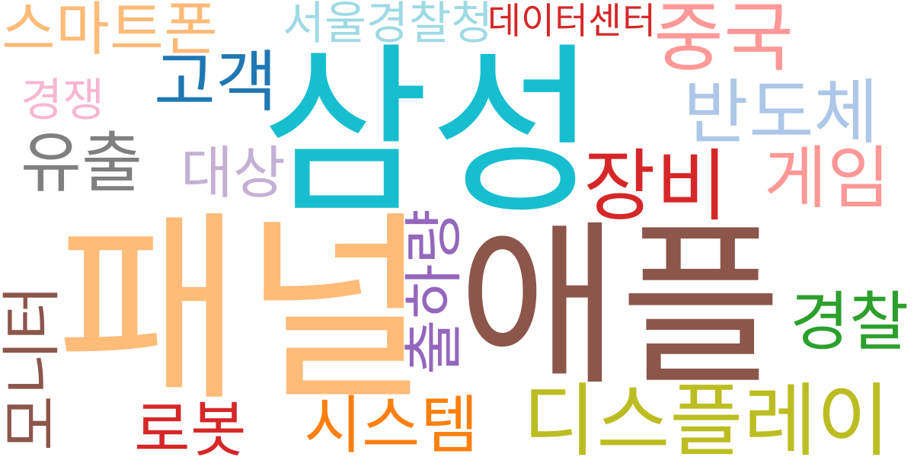

| Rank | Keyword | Score |
|---:|---|---:|
| 1 | 패널 | 0.818 |
| 2 | 삼성 | 0.660 |
| 3 | 애플 | 0.612 |
| 4 | 디스플레이 | 0.540 |
| 5 | 장비 | 0.515 |
| 6 | 중국 | 0.488 |
| 7 | 반도체 | 0.423 |
| 8 | 게임 | 0.399 |
| 9 | 고객 | 0.378 |
| 10 | 유출 | 0.368 |
| 11 | 경찰 | 0.350 |
| 12 | 시스템 | 0.331 |
| 13 | 로봇 | 0.307 |
| 14 | 모니터 | 0.298 |
| 15 | 출하량 | 0.296 |

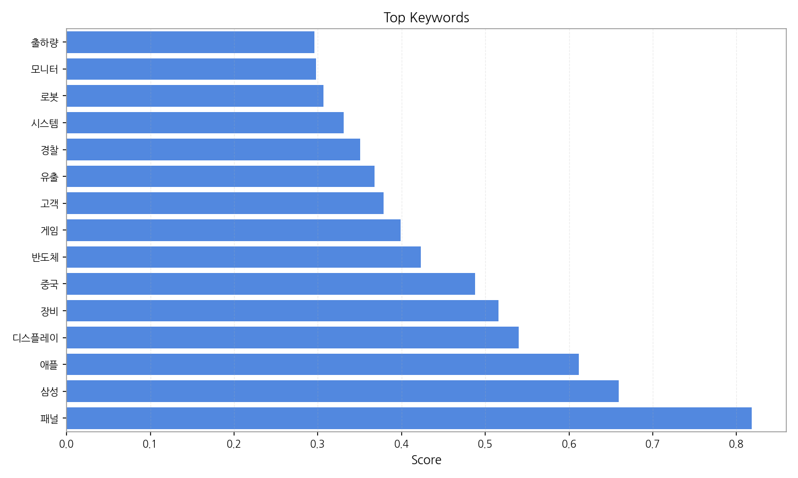

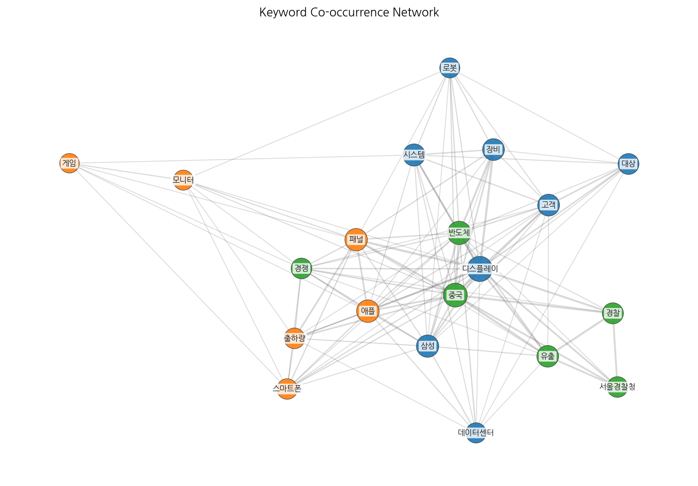

## Topics

- ai, 전력, 데이터센터 (#0)
  - 대표 단어: ai, 전력, 데이터센터, 첨단, 높은, 지원하는
- 플랫폼, 반도체, led (#1)
  - 대표 단어: 플랫폼, 반도체, led, 프리미엄, 스마트폰, ai
- 패널, oled, 3분기 (#2)
  - 대표 단어: 패널, oled, 3분기, 출하량이, ltpo, 디스플레이
- 디스플레이, 장비, oled (#3)
  - 대표 단어: 디스플레이, 장비, oled, sns, 공급, 기술
- 반도체, 기술, 자동차 (#4)
  - 대표 단어: 반도체, 기술, 자동차, 디스플레이, 기술을, 고객
- 삼성디스플레이, 유출, 기술 (#5)
  - 대표 단어: 삼성디스플레이, 유출, 기술, 중국, 디스플레이, 경찰
- 추석, 체험, 새로운 (#6)
  - 대표 단어: 추석, 체험, 새로운, 일본, 즐길, 서비스
- oled, tv, 대형 (#7)
  - 대표 단어: oled, tv, 대형, 패널, lcd, oled 패널

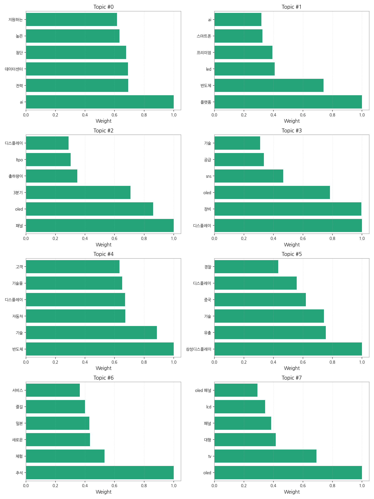

## 기업×토픽 집중도 매트릭스 (주간)

- (데이터 처리 중 예외 오류가 발생했습니다: Missing optional dependency 'tabulate'.  Use pip or conda to install tabulate.)

## 기업×토픽 시각적 분석

### 전체 시장 구도 (Heatmap)

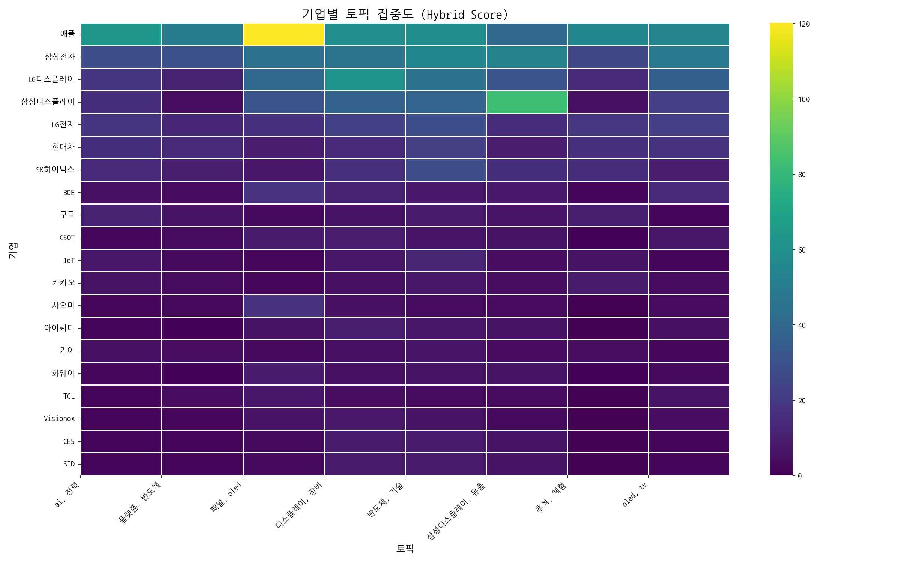

> 전체 기업과 토픽 간의 관계를 한눈에 보여줍니다. 색이 진할수록 연관성이 높습니다.

### 주요 토픽별 경쟁 구도 (Pie Charts)

> 가장 뜨거운 주제를 두고 어떤 기업들이 경쟁하는지 점유율을 보여줍니다.

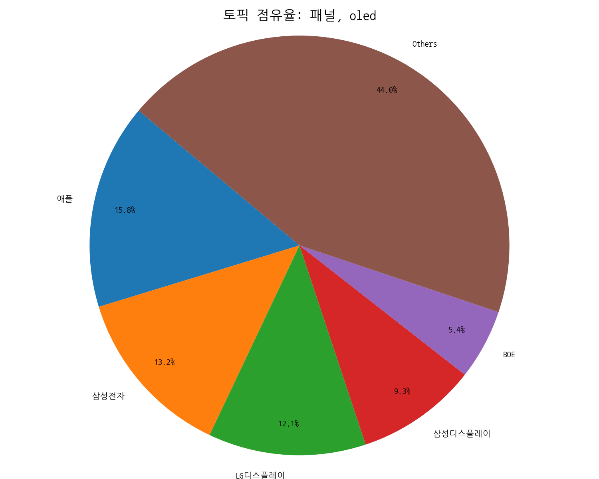
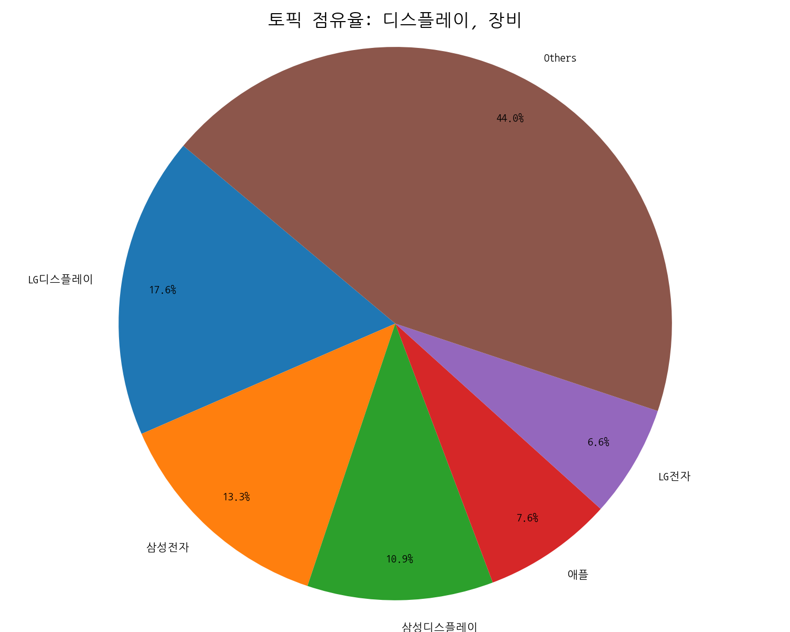
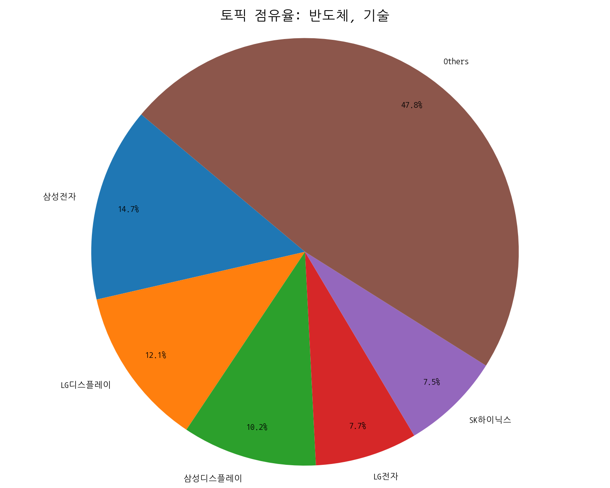

### 주요 기업별 전략 분석 (Bar Charts)

> 시장을 주도하는 주요 기업들이 어떤 토픽에 집중하고 있는지 보여줍니다.

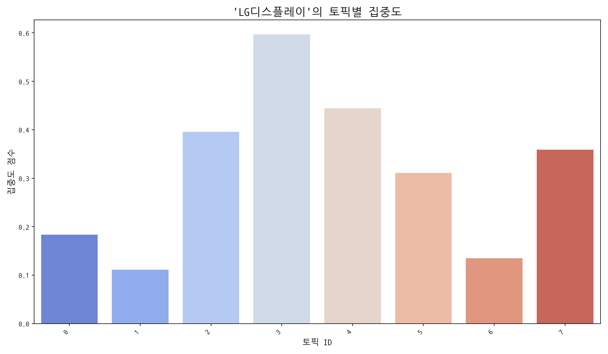
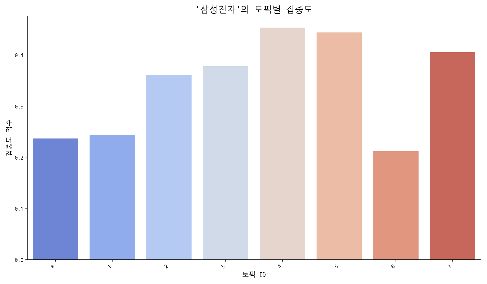
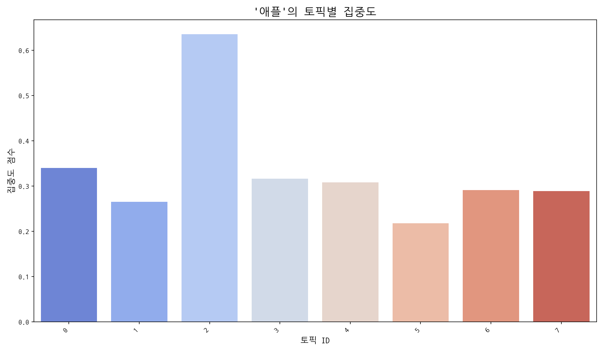

## Trend

- 최근 기사 수 추세와 7일 이동평균선을 제공합니다.

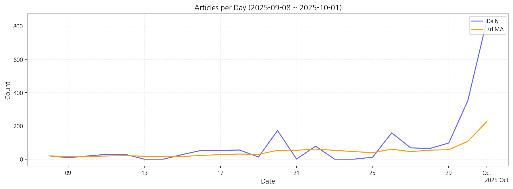

## Insights

## 데일리 인텔리전스 브리핑

**1. 핵심 맥락:**

*   **OLED 기술 경쟁 심화 및 프리미엄 시장 확대:** '패널', 'OLED', 'LTPO', '아이폰17' 키워드는 OLED 기술 경쟁이 심화되고 있으며, 특히 애플의 아이폰17에 LTPO 기술이 적용될 가능성이 높아지면서 프리미엄 디스플레이 시장이 확대될 것임을 시사합니다. 동시에 '삼성', '플랫폼', '프리미엄', '스마트폰' 키워드는 삼성 또한 프리미엄 스마트폰 시장에서 OLED 기술을 활용한 경쟁력 강화에 집중하고 있음을 나타냅니다.
*   **AI 기반 고성능 디스플레이 수요 증가:** 'AI', '반도체', '고성능', '데이터센터' 키워드는 AI 기술 발전과 데이터센터 확장에 따라 이를 지원하는 고성능 디스플레이 수요가 증가하고 있음을 보여줍니다. 특히 '전력', '높은', '지원하는' 키워드는 고성능 디스플레이의 전력 효율성이 중요한 요소로 부각되고 있음을 의미합니다.
*   **디스플레이 기술 유출 및 보안 강화 필요성 증대:** '삼성디스플레이', '유출', '기술', '중국' 키워드는 디스플레이 기술 유출 문제가 심각하며, 특히 중국으로의 기술 유출에 대한 우려가 크다는 것을 나타냅니다. 이는 디스플레이 산업 전반의 보안 강화 필요성을 강조합니다.

**2. 최근 변화/스파이크:**

*   **2025년 9월 20일, 9월 26일, 9월 30일, 10월 1일 기사 수 급증:** 9월 20일에는 추석 관련 키워드와 함께 게임 관련 언급이 늘어난 것으로 보아, 추석 연휴 기간 동안 디스플레이 관련 제품(TV, 게임 모니터 등)에 대한 관심이 높아진 것으로 추정됩니다. 9월 26일에는 기술 유출 관련 기사가 급증한 것으로 보아, 해당 시점에 기술 유출 사건 관련 수사 진행 상황이나 새로운 정보 공개가 있었을 가능성이 있습니다. 9월 30일과 10월 1일의 급증은 '패널', '디스플레이', '장비' 키워드와 연관되어, 3분기 실적 발표 및 향후 투자 계획 발표와 관련되었을 가능성이 높습니다. 특히, OLED 패널 시장의 성장과 관련된 긍정적인 전망이 발표되었을 가능성을 시사합니다.

**3. 실무 인사이트:**

*   **사업 개발:**
    *   **프리미엄 OLED 시장 공략 강화:** 폴더블, 롤러블 등 차세대 폼팩터를 적용한 프리미엄 OLED 제품 개발 및 마케팅을 강화하여 고가치 시장을 선점하고, LTPO 기술을 활용한 저전력, 고성능 디스플레이 개발에 투자하여 애플 등 주요 고객사와의 협력을 확대해야 합니다.
    *   **AI 기반 디스플레이 솔루션 개발:** AI 연산에 최적화된 고해상도, 고주사율 디스플레이 개발에 집중하고, 데이터센터용 디스플레이 솔루션 개발을 통해 새로운 시장 기회를 창출해야 합니다. 특히, 전력 효율성을 극대화하는 기술 개발에 집중해야 합니다.
*   **기술 기획:**
    *   **기술 유출 방지 시스템 구축 및 강화:** 핵심 기술에 대한 보안 시스템을 강화하고, 임직원 대상 보안 교육을 정기적으로 실시하여 기술 유출 위험을 최소화해야 합니다. 또한, 협력업체와의 기술 공유 시 NDA 체결 및 보안 감사를 강화해야 합니다.
    *   **차세대 디스플레이 기술 개발 투자 확대:** 마이크로 LED, 양자점(QD) 디스플레이 등 차세대 디스플레이 기술 개발에 대한 투자를 확대하고, 관련 특허 확보를 통해 기술 경쟁력을 강화해야 합니다. 또한, 새로운 디스플레이 소재 및 공정 기술 개발을 통해 원가 절감 및 성능 향상을 도모해야 합니다.

## Opportunities (Top 5)

| Idea | Target | Value Prop | Score |
|---|---|---|---:|
| 메타버스 협업용 초고해상도 마이크로 OLED XR 글래스 | 북미 빅테크 기업 (메타, 애플, 마이크로소프트 등) | 초고해상도 마이크로 OLED 디스플레이로 몰입감 극대화, 가볍고 편안한 착용감, 현실감 있는 아바타 표현 및 실시간 협업 기능 제공, 눈 피로 감소 기술 적용 | 4.50 |
| AI 기반 디스플레이 공정 자동화 및 수율 예측 솔루션 | 국내외 디스플레이 제조사 (삼성디스플레이, LG디스플레이, BOE 등) | AI 기반 실시간 공정 데이터 분석 및 이상 감지, 수율 저하 요인 예측 및 최적화, 공정 자동화 및 인력 효율성 향상, 기술 유출 방지 및 보안 강화 | 4.30 |
| AI 기반 차량용 HUD 증강 현실 솔루션 | 글로벌 완성차 OEM 및 Tier 1 부품사 | AI 기반 실시간 증강 현실 정보 제공으로 운전 안전성 극대화, 사용자 맞춤형 인터페이스, 경쟁사 대비 넓은 시야각 및 고해상도 제공, 첨단 운전자 보조 시스템(ADAS)과의 완벽한 통합 | 4.20 |
| IT 기기용 초저전력 가변 주사율 OLED 패널 | 글로벌 IT 기기 제조사 (삼성, LG, Dell, HP 등) | 기존 OLED 대비 30% 이상 전력 소비 감소, 가변 주사율 기술로 부드러운 화면 전환 및 배터리 효율 극대화, 뛰어난 화질 및 색 재현력, 얇고 가벼운 디자인 | 4.00 |
| 차세대 QD-MicroLED 기반 초대형 디스플레이 | 프리미엄 TV 제조사 및 상업용 디스플레이 시장 | 무한대 명암비 및 뛰어난 색 재현력, 높은 밝기 및 넓은 시야각, 긴 수명 및 번인 현상 없음, 초대형 디스플레이 구현 가능 | 3.80 |

## Appendix

- 데이터: keywords.json, topics.json, trend_timeseries.json, trend_insights.json, biz_opportunities.json