# Weekly/New Biz Report (2025-10-02)

## Executive Summary

- 이번 기간 핵심 토픽과 키워드, 주요 시사점을 요약합니다.

## 데일리 인텔리전스 브리핑

**1. 핵심 맥락:**

*   **프리미엄 디스플레이 시장 경쟁 심화:** 애플의 차세대 디스플레이 개발(Topic 1)과 프리미엄 브랜드 전략(Topic 0)이 맞물려 고성능 OLED 패널(Topic 5, 6)을 중심으로 한 디스플레이 기술 경쟁이 심화되고 있습니다. 특히, 폴더블 디스플레이와 같은 폼팩터 혁신을 통해 차별화된 사용자 경험을 제공하려는 움직임이 활발합니다.
*   **중국 디스플레이 산업의 성장과 기술 유출 우려:** 중국 디스플레이 산업은 정부 지원과 투자를 바탕으로 빠르게 성장하고 있으며, 특히 OLED 패널 생산 능력을 확대하고 있습니다(Topic 5, 6, 12). 하지만 삼성디스플레이 기술 유출 사건(Topic 9)에서 보듯, 기술 경쟁 심화와 함께 지식재산권 보호의 중요성이 더욱 부각되고 있습니다.
*   **AI 기술 융합과 디스플레이 활용 범위 확대:** AI 기술(Topic 2)이 디스플레이와 결합하여 새로운 사용자 경험을 창출하고 있습니다. 특히, 자동차(Topic 10, 12) 및 SNS 플랫폼(Topic 2)에서 AI 기반의 디스플레이 활용이 증가하면서 디스플레이의 적용 범위가 확대되고 있습니다.

**2. 최근 변화/스파이크:**

*   **2025년 09월 20일, 26일, 30일, 10월 01일 기사 수 급증:** 9월 20일에는 추석 연휴 관련 제품 출시(Topic 7)와 관련된 기사가 급증했고, 9월 26일에는 중국발 디스플레이 기술 유출 관련 기사(Topic 9)가 증가했습니다. 9월 30일과 10월 1일에는 반도체, AI 기술과 디스플레이의 융합(Topic 10, 11) 및 OLED 패널 시장 동향(Topic 5, 6) 관련 기사가 폭발적으로 증가했습니다. 이는 추석 연휴 특수, 기술 유출 이슈, 그리고 AI 기술 발전과 함께 디스플레이 산업의 성장 가능성에 대한 기대감이 반영된 결과로 해석됩니다.

**3. 실무 인사이트:**

*   **차세대 디스플레이 기술 확보 및 포트폴리오 확장:** 폴더블, 마이크로 LED 등 차세대 디스플레이 기술 개발에 투자를 확대하고, 다양한 폼팩터와 기능을 지원하는 디스플레이 포트폴리오를 구축하여 프리미엄 시장 경쟁력을 강화해야 합니다.
*   **지식재산권 보호 및 보안 강화:** 기술 유출 방지를 위한 보안 시스템을 강화하고, 핵심 기술에 대한 특허 확보 및 관리를 철저히 하여 지식재산권을 보호해야 합니다. 특히, 중국 시장 진출 시 기술 유출 위험에 대한 대비책을 마련해야 합니다.
*   **AI 기술 융합 및 신규 시장 발굴:** AI 기술을 디스플레이에 접목하여 새로운 사용자 경험을 제공하고, 자동차, 스마트홈, 메타버스 등 신규 시장을 적극적으로 공략해야 합니다. 특히, AI 기반의 디스플레이 제어, 개인 맞춤형 콘텐츠 제공, 몰입형 경험 제공 등 차별화된 가치를 창출해야 합니다.

## Key Metrics

- 기간: 2025-09-08 ~ 2025-10-01
- 총 기사 수: 2,141
- 문서 수: N/A
- 키워드 수(상위): 15
- 토픽 수: 14
- 시계열 데이터 일자 수: 24

## Top Keywords

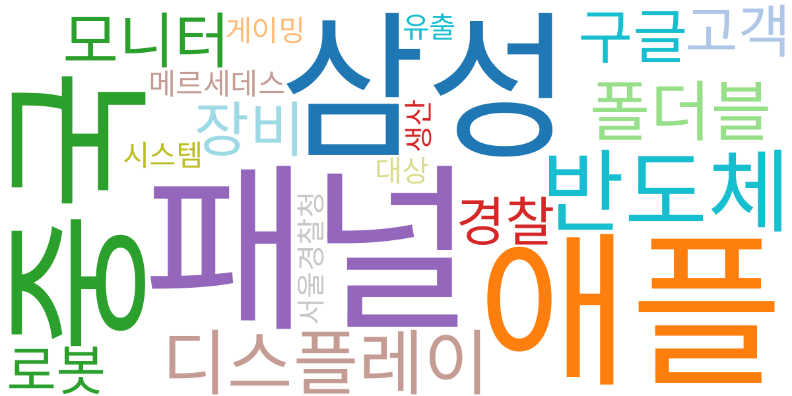

| Rank | Keyword | Score |
|---:|---|---:|
| 1 | 패널 | 0.866 |
| 2 | 애플 | 0.735 |
| 3 | 삼성 | 0.673 |
| 4 | 중국 | 0.641 |
| 5 | 반도체 | 0.564 |
| 6 | 디스플레이 | 0.538 |
| 7 | 폴더블 | 0.463 |
| 8 | 모니터 | 0.389 |
| 9 | 장비 | 0.377 |
| 10 | 구글 | 0.367 |
| 11 | 고객 | 0.339 |
| 12 | 로봇 | 0.331 |
| 13 | 경찰 | 0.326 |
| 14 | 메르세데스 | 0.323 |
| 15 | 대상 | 0.321 |

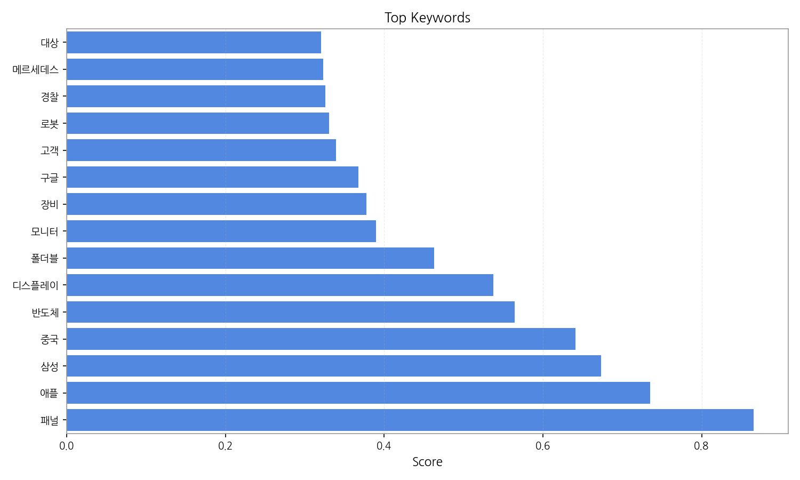

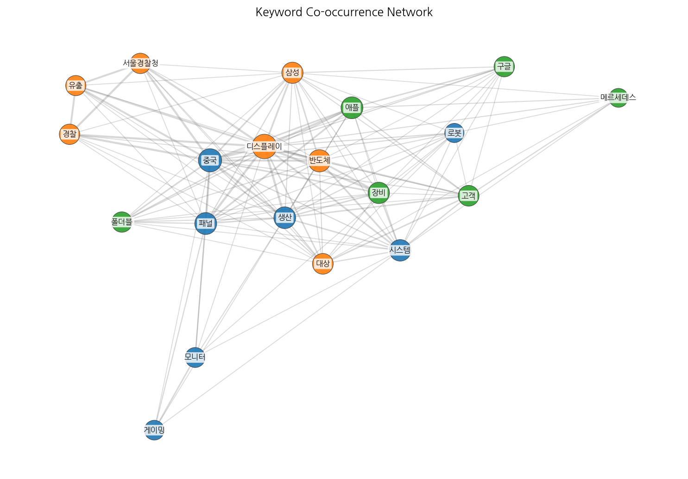

## Topics

- 브랜드, 프리미엄, 플랫폼 (#0)
  - 대표 단어: 브랜드, 프리미엄, 플랫폼, 새로운, 제품, 서비스
- 애플, 프로, 개발 (#1)
  - 대표 단어: 애플, 프로, 개발, 새로운, 디스플레이, 목표로
- ai, sns, 대한민국 (#2)
  - 대표 단어: ai, sns, 대한민국, 고객, lg, 기술
- 교수는, 플랫폼, 서비스 (#3)
  - 대표 단어: 교수는, 플랫폼, 서비스, 소비자, 지난달, 고성능
- 공식, 가장, 대형 (#4)
  - 대표 단어: 공식, 가장, 대형, 대한민국, 받을, 모두
- oled, 패널, led (#5)
  - 대표 단어: oled, 패널, led, ltpo, 출하량이, 중국
- oled, tv, 패널 (#6)
  - 대표 단어: oled, tv, 패널, 대형, lcd, oled 패널
- 추석, 연휴, 제품 (#7)
  - 대표 단어: 추석, 연휴, 제품, 고성능, 오는, 기간
- lg디스플레이의, lg디스플레이, 수익성 (#8)
  - 대표 단어: lg디스플레이의, lg디스플레이, 수익성, lg디스플레이는, 개선, 크게
- 중국, 삼성디스플레이, 유출 (#9)
  - 대표 단어: 중국, 삼성디스플레이, 유출, 디스플레이, 경찰, 기술
- 반도체, 기술, 디스플레이 (#10)
  - 대표 단어: 반도체, 기술, 디스플레이, 핵심, 장비, 자동차
- 반도체, ai, 메모리 (#11)
  - 대표 단어: 반도체, ai, 메모리, 실적, 3분기, 미국
- 디스플레이, 중국, 공급 (#12)
  - 대표 단어: 디스플레이, 중국, 공급, 전기차, 대형, 차량
- 장비, led, 디스플레이 (#13)
  - 대표 단어: 장비, led, 디스플레이, 첨단, micro, 마이크로

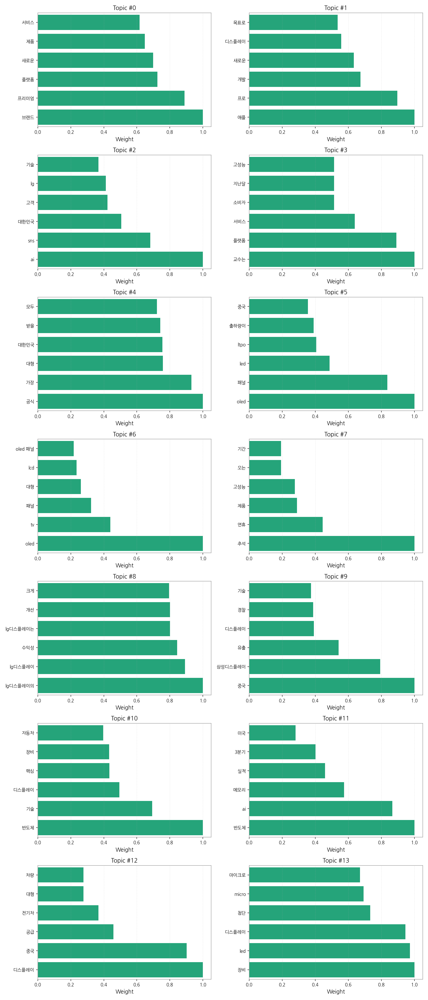

## 기업×토픽 집중도 매트릭스 (주간)

**핵심 요약:**

- **가장 경쟁이 치열한 토픽:** **반도체, 기술** (가장 많은 기업들이 주목)

- **가장 집중도가 높은 기업:** **애플** (다양한 토픽에 걸쳐 높은 관련성)

- **주목할 만한 조합:** **애플 @ topic_1** (가장 높은 단일 연관 점수 기록)

각 기업별 상위 8개 토픽의 연관 점수와 해당 토픽 내에서의 점유율(%)을 나타냅니다.

| org           | topic_0     | topic_1     | topic_10    | topic_11    | topic_12    | topic_13    | topic_2     | topic_3   | topic_4     | topic_5     | topic_6     | topic_7     | topic_8     | topic_9     |
|:--------------|:------------|:------------|:------------|:------------|:------------|:------------|:------------|:----------|:------------|:------------|:------------|:------------|:------------|:------------|
| AMD           | nan         | nan         | nan         | nan         | nan         | 0.73 (0%)   | nan         | nan       | nan         | 0.72 (0%)   | 0.79 (0%)   | nan         | nan         | nan         |
| ASUS          | 0.74 (1%)   | nan         | nan         | nan         | 0.74 (0%)   | nan         | 0.76 (0%)   | 0.74 (0%) | 2.15 (1%)   | 2.87 (1%)   | 1.58 (0%)   | 1.64 (1%)   | nan         | nan         |
| BMW           | nan         | 1.52 (1%)   | 2.15 (1%)   | 1.41 (1%)   | nan         | nan         | 4.55 (2%)   | 0.74 (0%) | 1.44 (1%)   | nan         | nan         | 0.82 (0%)   | nan         | 0.76 (0%)   |
| BOE           | nan         | 5.31 (2%)   | 7.90 (2%)   | nan         | 7.44 (3%)   | 5.12 (2%)   | nan         | nan       | nan         | 10.05 (4%)  | 15.77 (5%)  | nan         | 7.39 (4%)   | 6.07 (2%)   |
| CSOT          | nan         | nan         | 5.02 (1%)   | 2.82 (1%)   | 3.72 (1%)   | 2.92 (1%)   | nan         | nan       | nan         | 5.02 (2%)   | 8.67 (3%)   | nan         | 4.10 (2%)   | 4.55 (2%)   |
| IoT           | nan         | 3.79 (1%)   | 7.90 (2%)   | nan         | nan         | 5.12 (2%)   | 12.90 (5%)  | nan       | 5.02 (3%)   | nan         | 3.94 (1%)   | 4.10 (2%)   | 4.93 (3%)   | nan         |
| LG디스플레이       | nan         | nan         | 32.30 (8%)  | nan         | 25.31 (9%)  | 23.39 (11%) | 28.07 (11%) | nan       | 17.95 (9%)  | nan         | 48.10 (14%) | nan         | 38.59 (20%) | 20.48 (7%)  |
| LG전자          | 20.10 (14%) | nan         | 30.15 (8%)  | nan         | 20.10 (7%)  | nan         | 31.86 (13%) | nan       | 25.12 (13%) | nan         | 27.60 (8%)  | 19.70 (11%) | 18.06 (9%)  | nan         |
| LG화학          | 1.49 (1%)   | 3.03 (1%)   | 5.02 (1%)   | 2.82 (1%)   | 2.23 (1%)   | 1.46 (1%)   | 3.03 (1%)   | nan       | nan         | nan         | nan         | 1.64 (1%)   | nan         | nan         |
| SK하이닉스        | nan         | 11.38 (4%)  | 26.56 (7%)  | 19.75 (8%)  | 14.14 (5%)  | nan         | 18.20 (7%)  | nan       | 14.36 (7%)  | nan         | nan         | 12.31 (7%)  | nan         | 14.41 (5%)  |
| Semiconductor | nan         | nan         | 1.44 (0%)   | 1.41 (1%)   | nan         | 0.73 (0%)   | 1.52 (1%)   | 1.49 (1%) | nan         | 0.72 (0%)   | nan         | 2.46 (1%)   | nan         | nan         |
| TCL           | nan         | nan         | 4.31 (1%)   | 2.82 (1%)   | 4.47 (2%)   | 4.39 (2%)   | nan         | nan       | nan         | 7.18 (3%)   | 9.46 (3%)   | nan         | 4.10 (2%)   | 3.79 (1%)   |
| TSMC          | 3.72 (3%)   | nan         | 3.59 (1%)   | 11.28 (5%)  | nan         | nan         | 3.03 (1%)   | 3.72 (2%) | 5.74 (3%)   | nan         | nan         | 4.93 (3%)   | 2.46 (1%)   | nan         |
| Tianma        | nan         | nan         | 4.31 (1%)   | 1.41 (1%)   | 1.49 (1%)   | 1.46 (1%)   | 1.52 (1%)   | nan       | nan         | 2.87 (1%)   | 3.15 (1%)   | nan         | nan         | 1.52 (1%)   |
| Visionox      | nan         | 3.03 (1%)   | 6.46 (2%)   | 3.53 (1%)   | 2.98 (1%)   | 2.92 (1%)   | nan         | nan       | nan         | 7.18 (3%)   | 6.31 (2%)   | nan         | nan         | 3.79 (1%)   |
| 구글            | nan         | 16.69 (6%)  | 12.20 (3%)  | 7.05 (3%)   | 10.42 (4%)  | 7.31 (3%)   | 10.62 (4%)  | 8.93 (6%) | 7.90 (4%)   | nan         | nan         | nan         | nan         | nan         |
| 기아            | nan         | 4.55 (2%)   | 8.61 (2%)   | nan         | 8.93 (3%)   | 3.65 (2%)   | nan         | 4.47 (3%) | nan         | nan         | 3.94 (1%)   | 8.21 (5%)   | nan         | 4.55 (2%)   |
| 네이버           | nan         | 5.31 (2%)   | 8.61 (2%)   | 3.53 (1%)   | 7.44 (3%)   | nan         | 3.79 (2%)   | 4.47 (3%) | 3.59 (2%)   | nan         | nan         | nan         | nan         | 3.79 (1%)   |
| 마이크로소프트       | nan         | 0.76 (0%)   | 2.15 (1%)   | nan         | 2.23 (1%)   | 2.19 (1%)   | 2.28 (1%)   | nan       | 2.15 (1%)   | nan         | nan         | 0.82 (0%)   | nan         | 0.76 (0%)   |
| 메타            | nan         | 17.45 (7%)  | 9.33 (2%)   | 6.35 (3%)   | 4.47 (2%)   | 3.65 (2%)   | 10.62 (4%)  | 5.21 (3%) | nan         | nan         | nan         | 4.93 (3%)   | nan         | nan         |
| 벤츠            | 3.40 (2%)   | nan         | 4.10 (1%)   | nan         | 3.40 (1%)   | nan         | 6.94 (2%)   | 7.66 (4%) | 4.92 (2%)   | nan         | 2.70 (1%)   | 3.75 (2%)   | nan         | nan         |
| 비보            | nan         | 4.55 (2%)   | 4.31 (1%)   | 3.53 (1%)   | 2.98 (1%)   | nan         | nan         | nan       | nan         | 8.61 (4%)   | 6.31 (2%)   | nan         | 4.10 (2%)   | 3.79 (1%)   |
| 삼성디스플레이       | nan         | 17.45 (7%)  | 41.63 (10%) | nan         | 32.01 (11%) | 22.66 (11%) | 16.69 (7%)  | nan       | nan         | 20.82 (9%)  | 44.15 (13%) | nan         | nan         | 67.51 (24%) |
| 삼성전자          | nan         | 34.13 (13%) | 59.58 (15%) | 52.90 (22%) | 47.64 (17%) | 32.89 (15%) | nan         | nan       | nan         | 38.76 (16%) | 52.83 (16%) | nan         | nan         | 51.58 (18%) |
| 샤오미           | nan         | 7.59 (3%)   | 6.46 (2%)   | nan         | 4.47 (2%)   | 4.39 (2%)   | nan         | nan       | nan         | 13.64 (6%)  | 9.46 (3%)   | nan         | 5.75 (3%)   | 5.31 (2%)   |
| 소니            | nan         | 0.76 (0%)   | 2.15 (1%)   | nan         | 2.23 (1%)   | 2.92 (1%)   | 3.03 (1%)   | nan       | 2.15 (1%)   | 1.44 (1%)   | nan         | 0.82 (0%)   | nan         | nan         |
| 아마존           | nan         | 4.15 (1%)   | 4.71 (1%)   | 3.08 (1%)   | 2.44 (1%)   | nan         | 2.49 (1%)   | 2.44 (1%) | nan         | nan         | nan         | 3.59 (2%)   | 1.79 (1%)   | nan         |
| 아이씨디          | nan         | 1.93 (1%)   | 6.40 (1%)   | nan         | nan         | 2.79 (1%)   | 1.93 (1%)   | nan       | nan         | 2.74 (1%)   | 4.02 (1%)   | nan         | 2.09 (1%)   | 1.93 (1%)   |
| 애플            | nan         | 93.90 (15%) | 64.18 (7%)  | 48.50 (9%)  | 49.49 (8%)  | 43.56 (9%)  | nan         | nan       | nan         | 72.41 (13%) | 63.26 (8%)  | 39.52 (10%) | nan         | nan         |
| 엔비디아          | 0.74 (1%)   | nan         | 0.72 (0%)   | 4.23 (2%)   | nan         | nan         | nan         | 1.49 (1%) | 1.44 (1%)   | 0.72 (0%)   | nan         | nan         | 0.82 (0%)   | nan         |
| 오포            | nan         | 4.55 (2%)   | 5.02 (1%)   | 4.23 (2%)   | 3.72 (1%)   | nan         | nan         | nan       | nan         | 12.92 (5%)  | 8.67 (3%)   | nan         | 4.10 (2%)   | 4.55 (2%)   |
| 원익IPS         | 2.98 (2%)   | nan         | 2.87 (1%)   | 8.46 (3%)   | nan         | nan         | 1.52 (1%)   | 2.98 (2%) | 5.74 (3%)   | nan         | nan         | 4.93 (3%)   | 2.46 (1%)   | nan         |
| 인텔            | nan         | 3.68 (1%)   | 5.22 (1%)   | 3.42 (1%)   | 2.71 (1%)   | 1.77 (1%)   | 2.76 (1%)   | nan       | nan         | nan         | 0.96 (0%)   | 1.99 (1%)   | nan         | nan         |
| 카카오           | 8.93 (6%)   | 5.31 (2%)   | 10.77 (3%)  | nan         | 8.19 (3%)   | 6.58 (3%)   | 7.59 (3%)   | nan       | nan         | nan         | 5.52 (2%)   | 6.57 (4%)   | nan         | nan         |
| 퀄컴            | 2.98 (2%)   | 7.59 (3%)   | 5.74 (1%)   | 8.46 (3%)   | 2.98 (1%)   | 2.92 (1%)   | 4.55 (2%)   | nan       | nan         | nan         | nan         | 6.57 (4%)   | nan         | nan         |
| 폭스바겐          | 1.49 (1%)   | 2.28 (1%)   | 2.87 (1%)   | 2.82 (1%)   | nan         | 2.19 (1%)   | 3.03 (1%)   | 1.49 (1%) | 2.15 (1%)   | nan         | nan         | nan         | nan         | nan         |
| 하이센스          | nan         | 1.52 (1%)   | 2.15 (1%)   | nan         | 2.23 (1%)   | 2.92 (1%)   | nan         | nan       | nan         | 3.59 (1%)   | 4.73 (1%)   | nan         | 1.64 (1%)   | 2.28 (1%)   |
| 한미반도체         | 0.74 (1%)   | nan         | 0.72 (0%)   | 4.23 (2%)   | nan         | nan         | nan         | 1.49 (1%) | 1.44 (1%)   | 0.72 (0%)   | nan         | nan         | 0.82 (0%)   | nan         |
| 한화            | 1.46 (1%)   | nan         | nan         | 2.76 (1%)   | nan         | nan         | 2.97 (1%)   | 1.46 (0%) | 9.84 (3%)   | nan         | nan         | nan         | 1.61 (0%)   | nan         |
| 현대모비스         | nan         | 2.28 (1%)   | 7.18 (2%)   | nan         | 6.70 (2%)   | nan         | nan         | 2.23 (1%) | 2.87 (1%)   | nan         | 2.37 (1%)   | 2.46 (1%)   | nan         | 3.79 (1%)   |
| 현대차           | nan         | 16.67 (4%)  | 25.92 (4%)  | 11.07 (3%)  | 19.87 (5%)  | nan         | nan         | nan       | 10.14 (3%)  | nan         | 13.62 (3%)  | 15.47 (6%)  | nan         | 19.05 (4%)  |
| 화웨이           | nan         | 2.28 (1%)   | 5.02 (1%)   | 2.12 (1%)   | 1.49 (1%)   | 1.46 (1%)   | 1.52 (1%)   | nan       | nan         | nan         | 2.37 (1%)   | nan         | nan         | 6.83 (2%)   |

**코멘트 및 액션 힌트:**

> 특정 토픽에서 높은 점유율을 보이는 기업은 해당 분야의 '주도자(Leader)'일 가능성이 높습니다. 반면, 특정 기업이 소수의 토픽에 높은 점수를 집중하고 있다면, 이는 해당 기업의 '핵심 전략 분야'를 시사합니다. 경쟁사 및 파트너사의 집중 분야를 파악하여 우리의 전략을 점검해볼 수 있습니다.

## 기업×토픽 시각적 분석

### 전체 시장 구도 (Heatmap)

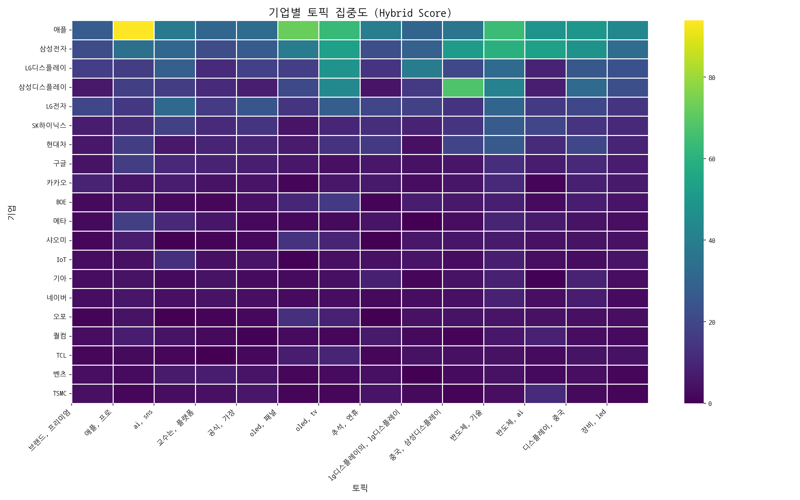

> 전체 기업과 토픽 간의 관계를 한눈에 보여줍니다. 색이 진할수록 연관성이 높습니다.

### 주요 토픽별 경쟁 구도 (Pie Charts)

> 가장 뜨거운 주제를 두고 어떤 기업들이 경쟁하는지 점유율을 보여줍니다.

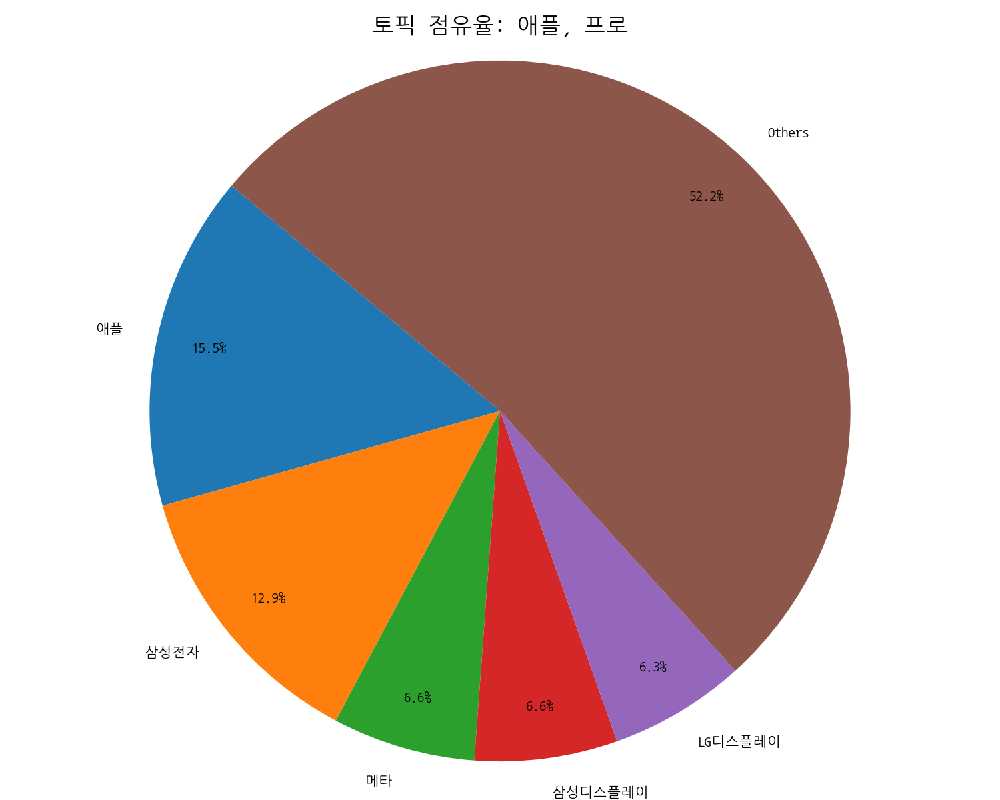
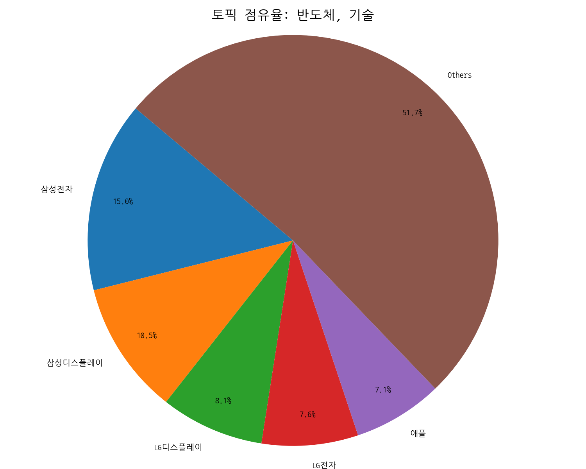
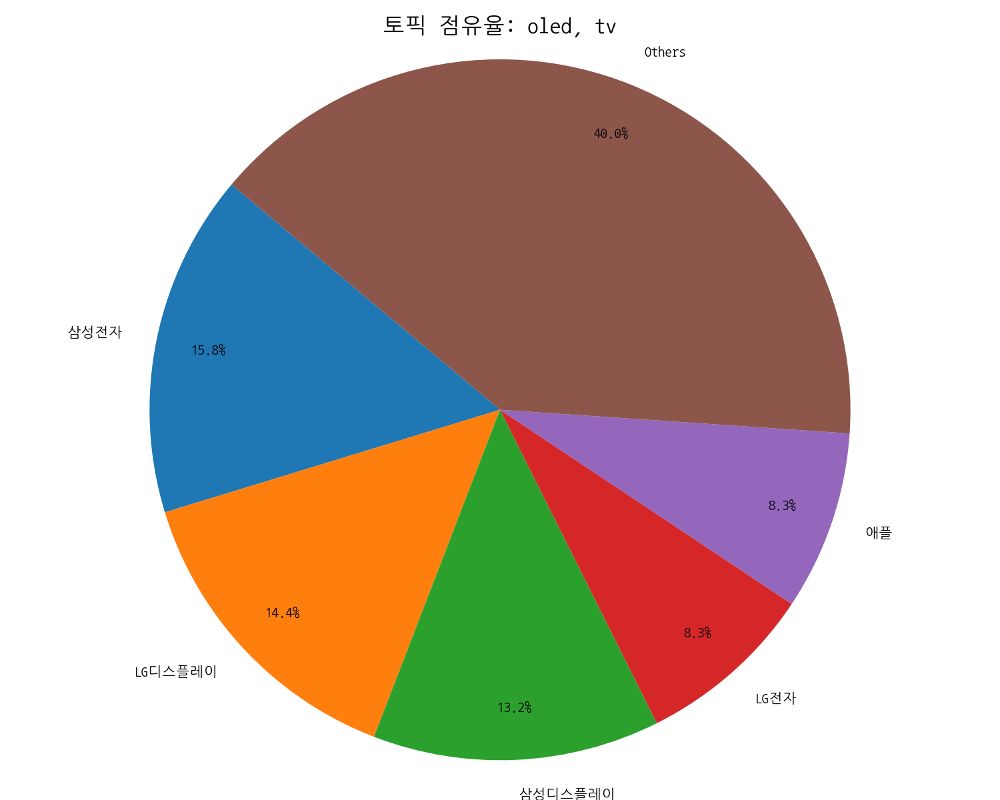

### 주요 기업별 전략 분석 (Bar Charts)

> 시장을 주도하는 주요 기업들이 어떤 토픽에 집중하고 있는지 보여줍니다.

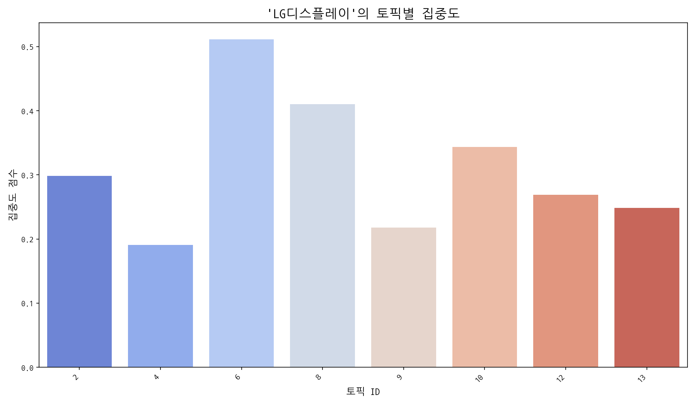
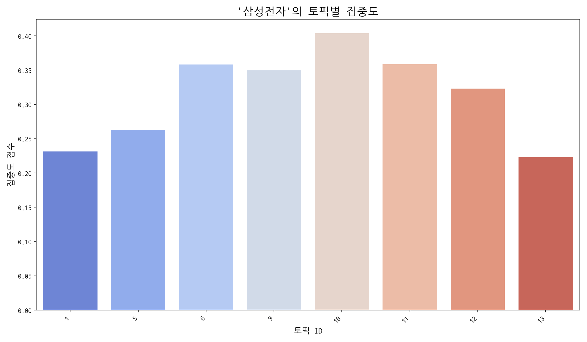
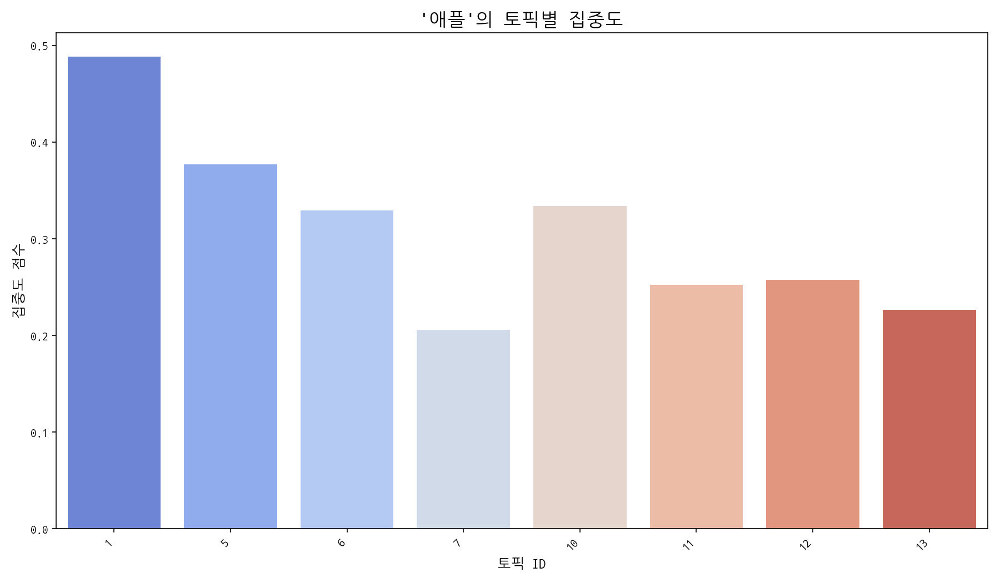

## Trend

- 최근 기사 수 추세와 7일 이동평균선을 제공합니다.

## Insights

## 데일리 인텔리전스 브리핑

**1. 핵심 맥락:**

*   **프리미엄 디스플레이 시장 경쟁 심화:** 애플의 차세대 디스플레이 개발(Topic 1)과 프리미엄 브랜드 전략(Topic 0)이 맞물려 고성능 OLED 패널(Topic 5, 6)을 중심으로 한 디스플레이 기술 경쟁이 심화되고 있습니다. 특히, 폴더블 디스플레이와 같은 폼팩터 혁신을 통해 차별화된 사용자 경험을 제공하려는 움직임이 활발합니다.
*   **중국 디스플레이 산업의 성장과 기술 유출 우려:** 중국 디스플레이 산업은 정부 지원과 투자를 바탕으로 빠르게 성장하고 있으며, 특히 OLED 패널 생산 능력을 확대하고 있습니다(Topic 5, 6, 12). 하지만 삼성디스플레이 기술 유출 사건(Topic 9)에서 보듯, 기술 경쟁 심화와 함께 지식재산권 보호의 중요성이 더욱 부각되고 있습니다.
*   **AI 기술 융합과 디스플레이 활용 범위 확대:** AI 기술(Topic 2)이 디스플레이와 결합하여 새로운 사용자 경험을 창출하고 있습니다. 특히, 자동차(Topic 10, 12) 및 SNS 플랫폼(Topic 2)에서 AI 기반의 디스플레이 활용이 증가하면서 디스플레이의 적용 범위가 확대되고 있습니다.

**2. 최근 변화/스파이크:**

*   **2025년 09월 20일, 26일, 30일, 10월 01일 기사 수 급증:** 9월 20일에는 추석 연휴 관련 제품 출시(Topic 7)와 관련된 기사가 급증했고, 9월 26일에는 중국발 디스플레이 기술 유출 관련 기사(Topic 9)가 증가했습니다. 9월 30일과 10월 1일에는 반도체, AI 기술과 디스플레이의 융합(Topic 10, 11) 및 OLED 패널 시장 동향(Topic 5, 6) 관련 기사가 폭발적으로 증가했습니다. 이는 추석 연휴 특수, 기술 유출 이슈, 그리고 AI 기술 발전과 함께 디스플레이 산업의 성장 가능성에 대한 기대감이 반영된 결과로 해석됩니다.

**3. 실무 인사이트:**

*   **차세대 디스플레이 기술 확보 및 포트폴리오 확장:** 폴더블, 마이크로 LED 등 차세대 디스플레이 기술 개발에 투자를 확대하고, 다양한 폼팩터와 기능을 지원하는 디스플레이 포트폴리오를 구축하여 프리미엄 시장 경쟁력을 강화해야 합니다.
*   **지식재산권 보호 및 보안 강화:** 기술 유출 방지를 위한 보안 시스템을 강화하고, 핵심 기술에 대한 특허 확보 및 관리를 철저히 하여 지식재산권을 보호해야 합니다. 특히, 중국 시장 진출 시 기술 유출 위험에 대한 대비책을 마련해야 합니다.
*   **AI 기술 융합 및 신규 시장 발굴:** AI 기술을 디스플레이에 접목하여 새로운 사용자 경험을 제공하고, 자동차, 스마트홈, 메타버스 등 신규 시장을 적극적으로 공략해야 합니다. 특히, AI 기반의 디스플레이 제어, 개인 맞춤형 콘텐츠 제공, 몰입형 경험 제공 등 차별화된 가치를 창출해야 합니다.

## Opportunities (Top 5)

| Idea | Target | Value Prop | Score |
|---|---|---|---:|
| 메타버스 협업용 초고해상도 XR 디스플레이 | 북미 빅테크 기업 (Meta, Google, Apple) | 초고해상도 마이크로 OLED 기반의 XR 디스플레이 솔루션으로, 뛰어난 몰입감과 선명한 화질을 제공하여 현실감 있는 메타버스 협업 환경 구축 지원. 초경량, 저전력 설계로 사용자 편의성 극대화. | 4.50 |
| AI 기반 디스플레이 공정 자동화 및 수율 개선 솔루션 | 자사 디스플레이 패널 사업부, 국내외 디스플레이 제조사 | AI 기반의 실시간 공정 모니터링 및 제어 시스템을 구축하여 디스플레이 수율을 획기적으로 개선하고, 불량 예측 및 원인 분석 기능을 제공하여 생산 효율성을 극대화. 데이터 기반의 의사 결정 지원. | 4.30 |
| 차량용 AR HUD (Augmented Reality Head-Up Display) 솔루션 | 글로벌 완성차 OEM (메르세데스-벤츠, BMW, 현대차 등) | 고휘도, 고해상도 마이크로 LED 기반의 AR HUD 솔루션으로, 넓은 시야각과 정확한 정보 제공을 통해 운전 안전성 극대화. AI 기반의 실시간 객체 인식 및 예측 기능을 통합하여 차별화된 사용자 경험 제공. | 4.20 |
| IT 기기용 폴더블 OLED 패널 솔루션 | 글로벌 IT 기기 제조사 (Apple, Samsung, Lenovo) | UTG (Ultra Thin Glass) 기반의 고내구성 폴더블 OLED 패널 솔루션으로, 얇고 가벼우면서도 뛰어난 내구성을 제공하여 폴더블 IT 기기의 사용성을 극대화. 힌지 기술 및 최적화된 소프트웨어 솔루션 제공. | 4.00 |
| 차세대 QD-LED (Quantum Dot LED) 소재 개발 및 상용화 | 자사 디스플레이 패널 사업부, 글로벌 디스플레이 제조사 | 고효율, 고색순도 QD-LED 소재를 자체 개발하여 디스플레이 성능을 획기적으로 향상시키고, 원가 경쟁력을 확보하여 차세대 디스플레이 시장을 선도. 친환경 소재 사용으로 ESG 경영 강화. | 3.80 |

## Appendix

- 데이터: keywords.json, topics.json, trend_timeseries.json, trend_insights.json, biz_opportunities.json