# Weekly/New Biz Report (2025-10-02)

## Executive Summary

- 이번 기간 핵심 토픽과 키워드, 주요 시사점을 요약합니다.

## 데일리 인텔리전스 브리핑 (디스플레이 산업)

**1. 핵심 맥락:**

*   **차량용 디스플레이 시장 확대 및 기술 경쟁 심화:** 디스플레이 산업은 차량용 디스플레이를 중심으로 성장하고 있으며, AI, 반도체 기술과의 융합을 통해 차세대 디스플레이 기술 경쟁이 심화되고 있습니다. 특히, 차량용 디스플레이와 관련된 AI 및 반도체 기술의 연관성이 높게 나타나고 있습니다.
*   **OLED 패널 시장 경쟁 심화 및 기술 유출 우려:** OLED 패널 시장은 중국 업체의 성장과 함께 경쟁이 심화되고 있으며, 삼성디스플레이의 OLED 기술 유출 관련 이슈가 지속적으로 발생하고 있습니다. 이는 기술 경쟁력 확보와 동시에 보안 강화의 필요성을 시사합니다.

**2. 최근 변화/스파이크:**

*   **2025년 9월 30일 및 10월 1일 기사 수 급증:** 9월 30일과 10월 1일에 기사 수가 급증한 것은 추석 연휴 이후 디스플레이, 반도체, AI 관련 기술 및 시장 동향에 대한 관심이 집중된 결과로 추정됩니다. 특히, 중국 시장 및 OLED 패널 관련 기사가 많은 것으로 보아, 추석 연휴 기간 동안 중국 시장의 변화와 OLED 기술 경쟁 상황에 대한 분석이 활발하게 이루어진 것으로 판단됩니다.

**3. 실무 인사이트:**

*   **차량용 디스플레이 기술 개발 로드맵 재검토:** AI 및 반도체 기술과의 융합을 고려하여 차량용 디스플레이 기술 개발 로드맵을 재검토하고, 관련 기술 확보를 위한 투자 및 협력 방안을 모색해야 합니다.
*   **OLED 기술 보안 강화 및 차세대 디스플레이 기술 개발:** OLED 기술 유출 방지를 위한 보안 시스템을 강화하고, 마이크로 LED 등 차세대 디스플레이 기술 개발에 대한 투자를 확대하여 기술 경쟁력을 확보해야 합니다.
*   **중국 시장 전략 재점검:** 중국 시장의 변화에 대한 지속적인 모니터링과 분석을 통해, 현지 시장 상황에 맞는 차별화된 제품 및 서비스 전략을 수립해야 합니다. 특히, 중국 업체의 OLED 패널 생산 능력 확대에 따른 시장 경쟁 심화에 대한 대비가 필요합니다.

## Key Metrics

- 기간: 2025-09-08 ~ 2025-10-02
- 총 기사 수: 2,372
- 문서 수: N/A
- 키워드 수(상위): 15
- 토픽 수: 8
- 시계열 데이터 일자 수: 25

## Top Keywords

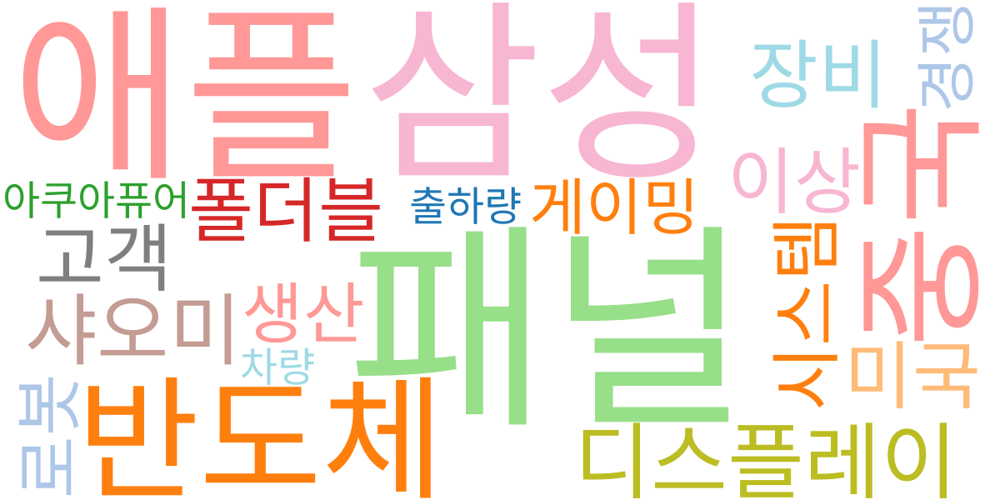

| Rank | Keyword | Score |
|---:|---|---:|
| 1 | 패널 | 0.851 |
| 2 | 삼성 | 0.656 |
| 3 | 애플 | 0.623 |
| 4 | 반도체 | 0.622 |
| 5 | 중국 | 0.620 |
| 6 | 디스플레이 | 0.493 |
| 7 | 샤오미 | 0.429 |
| 8 | 장비 | 0.396 |
| 9 | 미국 | 0.391 |
| 10 | 고객 | 0.390 |
| 11 | 이상 | 0.370 |
| 12 | 폴더블 | 0.353 |
| 13 | 시스템 | 0.352 |
| 14 | 로봇 | 0.318 |
| 15 | 생산 | 0.313 |

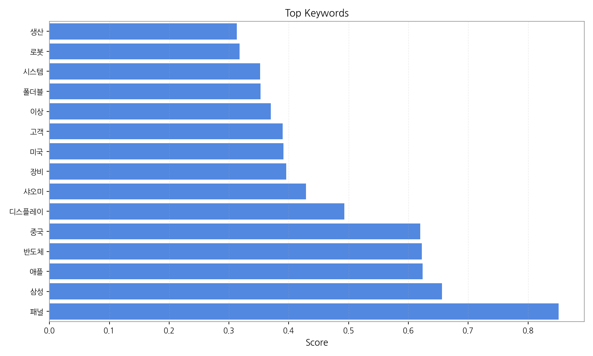

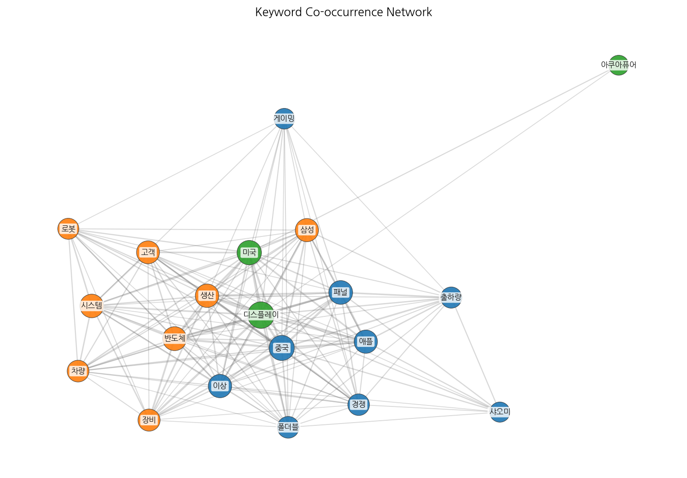

## Topics

- 추석, sns, 연휴 (#0)
  - 대표 단어: 추석, sns, 연휴, 고객, 대한민국, 추석 연휴
- ai, 로봇, 기술을 (#1)
  - 대표 단어: ai, 로봇, 기술을, 부품, 미래, 플랫폼
- 반도체, 장비, 사업을 (#2)
  - 대표 단어: 반도체, 장비, 사업을, 사업, 자동차, 전장
- 디스플레이, 차량용, 기술 (#3)
  - 대표 단어: 디스플레이, 차량용, 기술, 기술을, ai, 차세대
- oled, 미국, 패널 (#4)
  - 대표 단어: oled, 미국, 패널, 디스플레이, tv, 중국
- 중국, 패널, led (#5)
  - 대표 단어: 중국, 패널, led, oled, 3분기, 마이크로
- 피부, shot, pin shot (#6)
  - 대표 단어: 피부, shot, pin shot, pin, 브랜드, 클레녹스
- oled, 삼성디스플레이, 중국 (#7)
  - 대표 단어: oled, 삼성디스플레이, 중국, 장비, 기술, 유출

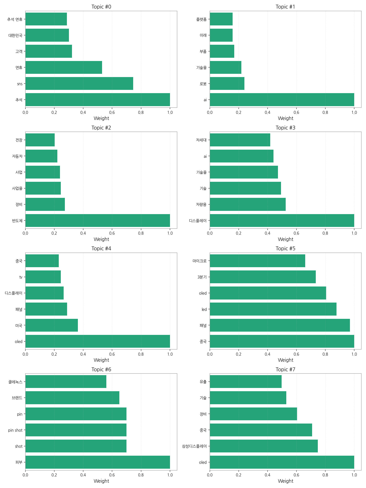

## 기업×토픽 집중도 매트릭스 (주간)

**핵심 요약:**

- **가장 경쟁이 치열한 토픽:** **디스플레이, 차량용** (가장 많은 기업들이 주목)

- **가장 집중도가 높은 기업:** **삼성디스플레이** (다양한 토픽에 걸쳐 높은 관련성)

- **주목할 만한 조합:** **삼성디스플레이 @ topic_7** (가장 높은 단일 연관 점수 기록)

각 기업별 상위 8개 토픽의 연관 점수와 해당 토픽 내에서의 점유율(%)을 나타냅니다.

| org           | topic_0     | topic_1     | topic_2     | topic_3      | topic_4      | topic_5     | topic_6     | topic_7      |
|:--------------|:------------|:------------|:------------|:-------------|:-------------|:------------|:------------|:-------------|
| AMD           | nan         | 1.43 (0%)   | 4.46 (1%)   | 1.37 (0%)    | 4.28 (1%)    | 3.42 (1%)   | nan         | 0.71 (0%)    |
| ASUS          | nan         | 1.43 (0%)   | nan         | 1.37 (0%)    | 2.85 (0%)    | 4.10 (1%)   | 1.02 (1%)   | 2.14 (0%)    |
| BMW           | nan         | 0.71 (0%)   | 0.74 (0%)   | 2.05 (0%)    | 0.71 (0%)    | 1.37 (0%)   | nan         | nan          |
| BOE           | 1.92 (1%)   | 4.99 (1%)   | 2.23 (0%)   | 15.04 (2%)   | 37.05 (5%)   | 22.57 (4%)  | 1.02 (1%)   | 20.66 (3%)   |
| CES           | 8.62 (3%)   | 4.28 (1%)   | nan         | 8.21 (1%)    | 4.28 (1%)    | 2.05 (0%)   | 3.05 (4%)   | 8.55 (1%)    |
| CSOT          | 1.92 (1%)   | 2.85 (1%)   | 4.46 (1%)   | 13.68 (2%)   | 26.36 (4%)   | 12.99 (2%)  | nan         | 17.10 (3%)   |
| HP            | nan         | 3.56 (1%)   | 0.74 (0%)   | 2.74 (0%)    | 4.28 (1%)    | 1.37 (0%)   | nan         | 3.56 (1%)    |
| Harman        | 1.92 (1%)   | 1.43 (0%)   | 0.74 (0%)   | 0.68 (0%)    | 1.43 (0%)    | 3.42 (1%)   | 2.04 (2%)   | 0.71 (0%)    |
| IoT           | 21.07 (8%)  | 17.10 (4%)  | 11.90 (3%)  | 18.46 (2%)   | 7.13 (1%)    | 8.21 (1%)   | 3.05 (4%)   | 7.13 (1%)    |
| LG디스플레이       | 44.06 (17%) | 35.63 (7%)  | 19.34 (4%)  | 57.44 (7%)   | 66.98 (9%)   | 48.55 (9%)  | 13.23 (15%) | 57.72 (9%)   |
| LG전자          | 33.52 (13%) | 42.04 (9%)  | 32.73 (7%)  | 45.82 (6%)   | 40.62 (6%)   | 27.35 (5%)  | 3.05 (4%)   | 32.78 (5%)   |
| LG화학          | 4.79 (2%)   | 3.56 (1%)   | 4.46 (1%)   | 6.84 (1%)    | 3.56 (0%)    | 4.10 (1%)   | nan         | 4.28 (1%)    |
| SID           | 8.62 (3%)   | 4.28 (1%)   | nan         | 8.21 (1%)    | 4.28 (1%)    | 2.05 (0%)   | 3.05 (4%)   | 8.55 (1%)    |
| SK하이닉스        | 33.52 (13%) | 39.90 (8%)  | 48.35 (10%) | 58.81 (8%)   | 29.93 (4%)   | 18.46 (3%)  | 3.05 (4%)   | 28.50 (4%)   |
| Semiconductor | nan         | 2.14 (0%)   | 0.74 (0%)   | 2.05 (0%)    | nan          | 0.68 (0%)   | nan         | nan          |
| TCL           | 0.96 (0%)   | 1.43 (0%)   | 1.49 (0%)   | 3.42 (0%)    | 8.55 (1%)    | 6.15 (1%)   | nan         | 4.99 (1%)    |
| TSMC          | nan         | 4.28 (1%)   | 2.98 (1%)   | 5.47 (1%)    | 5.70 (1%)    | 3.42 (1%)   | 1.02 (1%)   | 4.28 (1%)    |
| Tianma        | nan         | 0.71 (0%)   | 4.46 (1%)   | 6.15 (1%)    | 6.41 (1%)    | 4.10 (1%)   | nan         | 5.70 (1%)    |
| V2X           | 1.92 (1%)   | 6.41 (1%)   | 7.44 (2%)   | 8.89 (1%)    | 2.14 (0%)    | 1.37 (0%)   | nan         | 2.85 (0%)    |
| Visionox      | nan         | 1.43 (0%)   | 9.67 (2%)   | 13.68 (2%)   | 17.10 (2%)   | 11.63 (2%)  | nan         | 14.25 (2%)   |
| 구글            | 3.16 (1%)   | 18.01 (3%)  | 17.17 (3%)  | 20.29 (2%)   | 11.74 (1%)   | 15.78 (3%)  | 4.47 (5%)   | 10.96 (2%)   |
| 기아            | 7.66 (3%)   | 24.23 (5%)  | 30.50 (7%)  | 34.19 (4%)   | 20.66 (3%)   | 10.26 (2%)  | 2.04 (2%)   | 17.10 (3%)   |
| 네이버           | 3.83 (1%)   | 14.25 (3%)  | 14.13 (3%)  | 17.78 (2%)   | 11.40 (2%)   | 6.15 (1%)   | 2.04 (2%)   | 16.39 (3%)   |
| 마이크로소프트       | 0.96 (0%)   | 2.14 (0%)   | 2.23 (0%)   | 4.10 (1%)    | 2.14 (0%)    | 2.05 (0%)   | nan         | 1.43 (0%)    |
| 메타            | nan         | 4.99 (1%)   | 7.44 (2%)   | 5.47 (1%)    | 4.99 (1%)    | 6.15 (1%)   | nan         | 2.14 (0%)    |
| 미디어텍          | 3.83 (1%)   | 4.99 (1%)   | 7.44 (2%)   | 6.84 (1%)    | 3.56 (0%)    | 4.79 (1%)   | 2.04 (2%)   | 2.14 (0%)    |
| 벤츠            | 0.96 (0%)   | 3.56 (1%)   | 0.74 (0%)   | 1.37 (0%)    | 2.14 (0%)    | 0.68 (0%)   | 1.02 (1%)   | 0.71 (0%)    |
| 비보            | nan         | 0.71 (0%)   | nan         | 4.10 (1%)    | 9.26 (1%)    | 16.41 (3%)  | nan         | 7.13 (1%)    |
| 삼성디스플레이       | 15.15 (3%)  | 52.12 (5%)  | 17.65 (2%)  | 120.32 (8%)  | 139.47 (10%) | 81.12 (7%)  | 4.02 (2%)   | 193.00 (15%) |
| 삼성전자          | 19.16 (7%)  | 59.14 (12%) | 63.23 (14%) | 103.94 (13%) | 109.02 (15%) | 75.91 (13%) | 11.19 (13%) | 91.21 (14%)  |
| 샤오미           | 2.14 (1%)   | 2.39 (0%)   | 0.83 (0%)   | 7.65 (1%)    | 15.95 (2%)   | 29.84 (5%)  | 2.28 (2%)   | 11.96 (2%)   |
| 선익시스템         | nan         | 1.43 (0%)   | 0.74 (0%)   | 4.10 (1%)    | 7.84 (1%)    | 3.42 (1%)   | nan         | 6.41 (1%)    |
| 소니            | nan         | 2.14 (0%)   | 1.49 (0%)   | 2.74 (0%)    | nan          | 2.74 (0%)   | nan         | 1.43 (0%)    |
| 아마존           | 3.83 (1%)   | 3.56 (1%)   | 5.95 (1%)   | 4.79 (1%)    | 4.28 (1%)    | 7.52 (1%)   | 5.09 (6%)   | 2.14 (0%)    |
| 아이씨디          | nan         | 1.43 (0%)   | 2.98 (1%)   | 6.15 (1%)    | 4.99 (1%)    | 2.74 (0%)   | nan         | 5.70 (1%)    |
| 알파벳           | nan         | 1.43 (0%)   | 4.46 (1%)   | 1.37 (0%)    | 4.28 (1%)    | 3.42 (1%)   | nan         | nan          |
| 애플            | 5.33 (2%)   | 23.01 (4%)  | 18.23 (4%)  | 50.26 (6%)   | 80.14 (10%)  | 86.81 (14%) | 9.07 (10%)  | 51.58 (7%)   |
| 엔비디아          | 1.09 (0%)   | 5.70 (1%)   | 4.25 (1%)   | 7.82 (1%)    | 9.77 (1%)    | 4.69 (1%)   | 1.16 (1%)   | 5.70 (1%)    |
| 오포            | nan         | nan         | nan         | 4.10 (1%)    | 10.69 (1%)   | 15.73 (3%)  | nan         | 8.55 (1%)    |
| 인텔            | nan         | 6.41 (1%)   | 7.44 (2%)   | 8.89 (1%)    | 7.13 (1%)    | 6.15 (1%)   | 1.02 (1%)   | 5.70 (1%)    |
| 카카오           | 12.84 (4%)  | 22.29 (4%)  | 19.94 (4%)  | 21.39 (2%)   | 7.96 (1%)    | 2.29 (0%)   | 2.27 (2%)   | 9.55 (1%)    |
| 퀄컴            | 2.87 (1%)   | 7.84 (2%)   | 11.16 (2%)  | 12.31 (2%)   | 3.56 (0%)    | 5.47 (1%)   | 2.04 (2%)   | 4.28 (1%)    |
| 폭스바겐          | nan         | 3.56 (1%)   | 0.74 (0%)   | 4.10 (1%)    | nan          | 1.37 (0%)   | nan         | 1.43 (0%)    |
| 하이센스          | nan         | nan         | nan         | 1.37 (0%)    | 4.99 (1%)    | 4.10 (1%)   | nan         | 2.85 (0%)    |
| 하이얼           | 1.92 (1%)   | 4.99 (1%)   | 0.74 (0%)   | 2.74 (0%)    | 2.14 (0%)    | 2.05 (0%)   | 1.02 (1%)   | 2.14 (0%)    |
| 한미반도체         | 1.92 (1%)   | 3.56 (1%)   | 6.70 (1%)   | 6.15 (1%)    | 2.14 (0%)    | 2.05 (0%)   | nan         | 1.43 (0%)    |
| 한화            | nan         | nan         | 2.98 (1%)   | 2.74 (0%)    | 2.85 (0%)    | 2.74 (0%)   | nan         | 2.85 (0%)    |
| 한화솔루션         | 0.96 (0%)   | 4.28 (1%)   | 6.70 (1%)   | 5.47 (1%)    | 3.56 (0%)    | 0.68 (0%)   | 1.02 (1%)   | 2.85 (0%)    |
| 한화시스템         | nan         | 5.70 (1%)   | 6.70 (1%)   | 6.84 (1%)    | 2.85 (0%)    | 1.37 (0%)   | nan         | 2.85 (0%)    |
| 현대모비스         | 3.83 (1%)   | 19.95 (4%)  | 26.04 (6%)  | 30.09 (4%)   | 15.68 (2%)   | 8.89 (2%)   | 1.02 (1%)   | 12.83 (2%)   |
| 현대자동차         | 7.66 (3%)   | 9.98 (2%)   | 9.67 (2%)   | 8.89 (1%)    | 4.28 (1%)    | 1.37 (0%)   | 2.04 (2%)   | 4.28 (1%)    |
| 현대차           | 9.58 (4%)   | 20.66 (4%)  | 24.55 (5%)  | 36.93 (5%)   | 22.09 (3%)   | 11.63 (2%)  | 1.02 (1%)   | 19.95 (3%)   |
| 화웨이           | nan         | 0.71 (0%)   | 0.74 (0%)   | 5.47 (1%)    | 5.70 (1%)    | 6.15 (1%)   | nan         | 6.41 (1%)    |

**코멘트 및 액션 힌트:**

> 특정 토픽에서 높은 점유율을 보이는 기업은 해당 분야의 '주도자(Leader)'일 가능성이 높습니다. 반면, 특정 기업이 소수의 토픽에 높은 점수를 집중하고 있다면, 이는 해당 기업의 '핵심 전략 분야'를 시사합니다. 경쟁사 및 파트너사의 집중 분야를 파악하여 우리의 전략을 점검해볼 수 있습니다.

## 기업×토픽 시각적 분석

### 전체 시장 구도 (Heatmap)

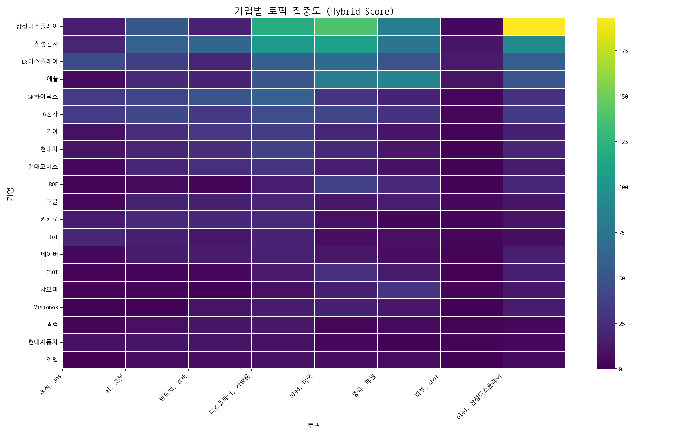

> 전체 기업과 토픽 간의 관계를 한눈에 보여줍니다. 색이 진할수록 연관성이 높습니다.

### 주요 토픽별 경쟁 구도 (Pie Charts)

> 가장 뜨거운 주제를 두고 어떤 기업들이 경쟁하는지 점유율을 보여줍니다.

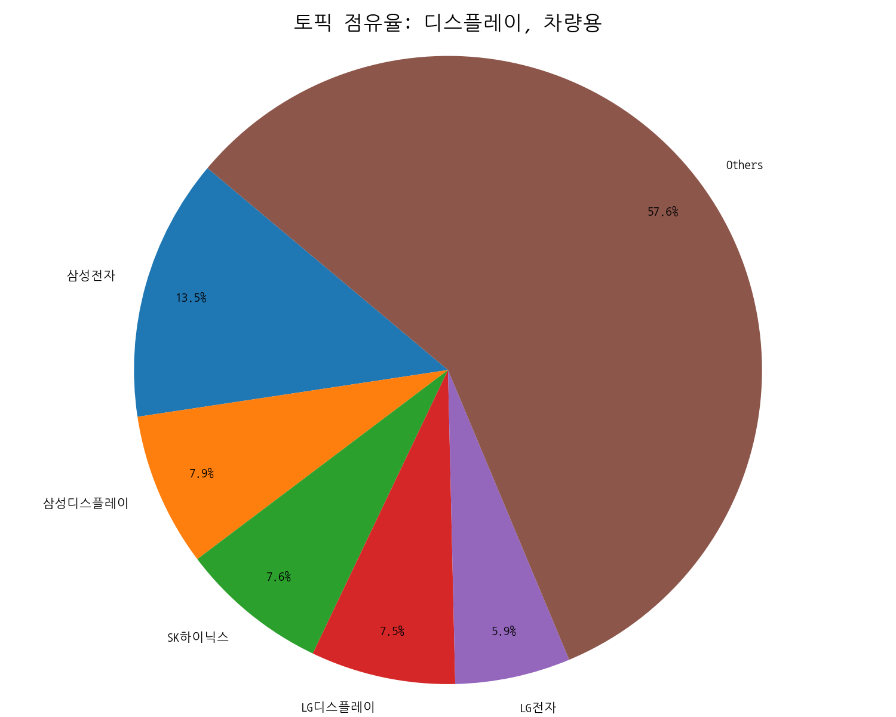
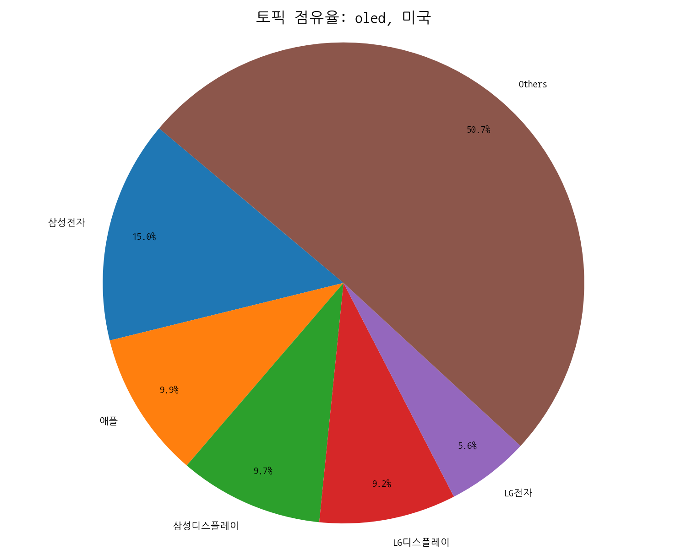
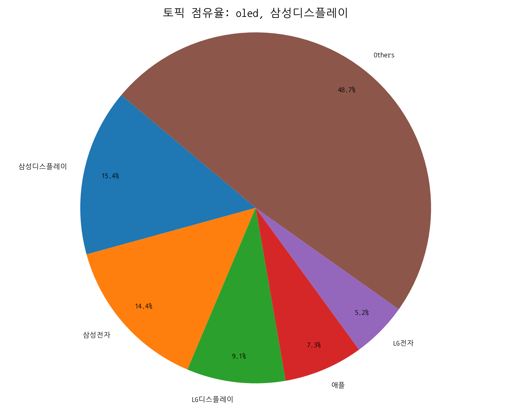

### 주요 기업별 전략 분석 (Bar Charts)

> 시장을 주도하는 주요 기업들이 어떤 토픽에 집중하고 있는지 보여줍니다.

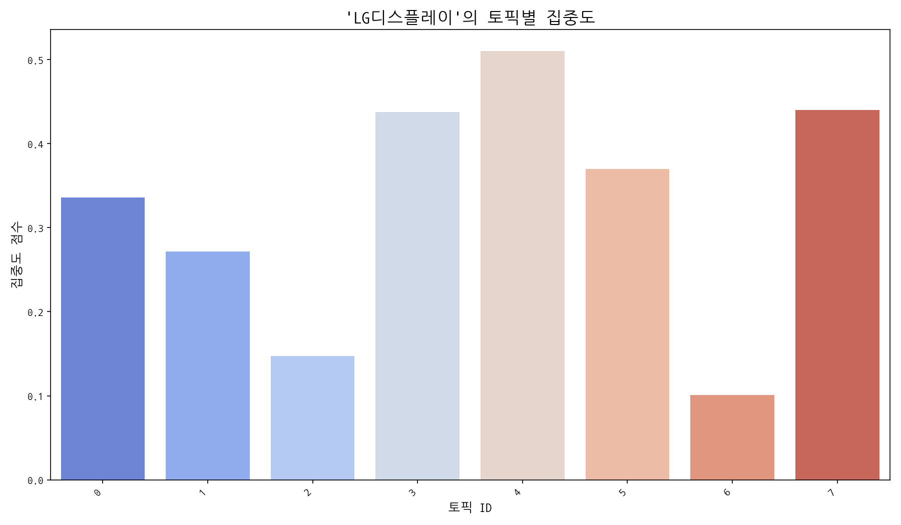
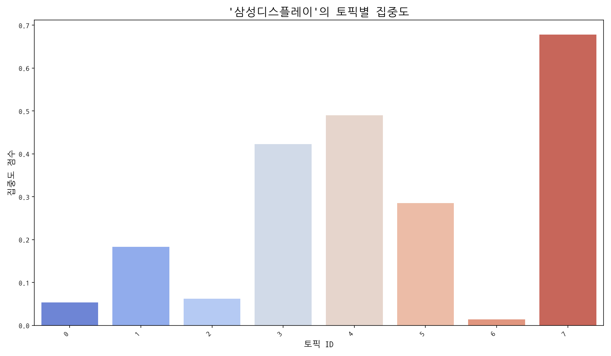
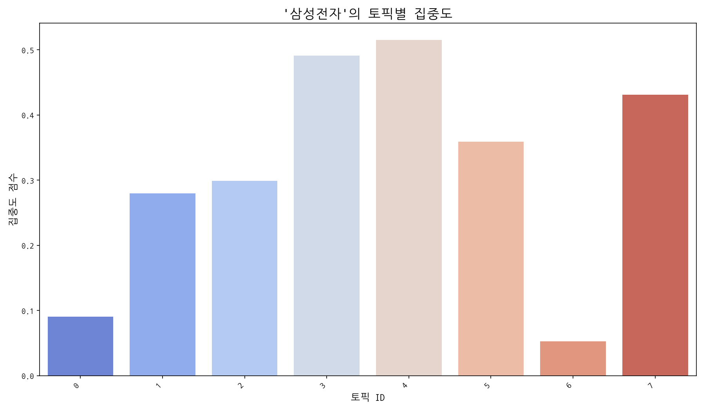

## Trend

- 최근 기사 수 추세와 7일 이동평균선을 제공합니다.

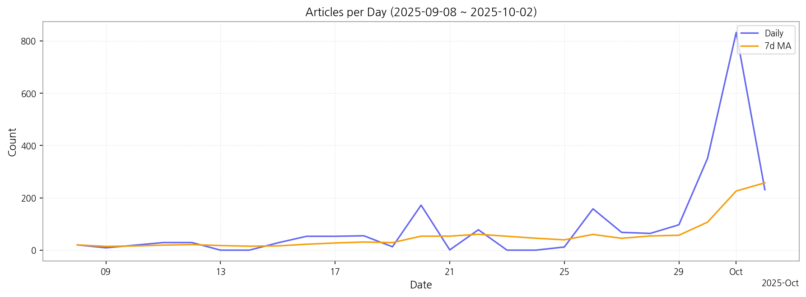

## Insights

## 데일리 인텔리전스 브리핑 (디스플레이 산업)

**1. 핵심 맥락:**

*   **차량용 디스플레이 시장 확대 및 기술 경쟁 심화:** 디스플레이 산업은 차량용 디스플레이를 중심으로 성장하고 있으며, AI, 반도체 기술과의 융합을 통해 차세대 디스플레이 기술 경쟁이 심화되고 있습니다. 특히, 차량용 디스플레이와 관련된 AI 및 반도체 기술의 연관성이 높게 나타나고 있습니다.
*   **OLED 패널 시장 경쟁 심화 및 기술 유출 우려:** OLED 패널 시장은 중국 업체의 성장과 함께 경쟁이 심화되고 있으며, 삼성디스플레이의 OLED 기술 유출 관련 이슈가 지속적으로 발생하고 있습니다. 이는 기술 경쟁력 확보와 동시에 보안 강화의 필요성을 시사합니다.

**2. 최근 변화/스파이크:**

*   **2025년 9월 30일 및 10월 1일 기사 수 급증:** 9월 30일과 10월 1일에 기사 수가 급증한 것은 추석 연휴 이후 디스플레이, 반도체, AI 관련 기술 및 시장 동향에 대한 관심이 집중된 결과로 추정됩니다. 특히, 중국 시장 및 OLED 패널 관련 기사가 많은 것으로 보아, 추석 연휴 기간 동안 중국 시장의 변화와 OLED 기술 경쟁 상황에 대한 분석이 활발하게 이루어진 것으로 판단됩니다.

**3. 실무 인사이트:**

*   **차량용 디스플레이 기술 개발 로드맵 재검토:** AI 및 반도체 기술과의 융합을 고려하여 차량용 디스플레이 기술 개발 로드맵을 재검토하고, 관련 기술 확보를 위한 투자 및 협력 방안을 모색해야 합니다.
*   **OLED 기술 보안 강화 및 차세대 디스플레이 기술 개발:** OLED 기술 유출 방지를 위한 보안 시스템을 강화하고, 마이크로 LED 등 차세대 디스플레이 기술 개발에 대한 투자를 확대하여 기술 경쟁력을 확보해야 합니다.
*   **중국 시장 전략 재점검:** 중국 시장의 변화에 대한 지속적인 모니터링과 분석을 통해, 현지 시장 상황에 맞는 차별화된 제품 및 서비스 전략을 수립해야 합니다. 특히, 중국 업체의 OLED 패널 생산 능력 확대에 따른 시장 경쟁 심화에 대한 대비가 필요합니다.

## Opportunities (Top 5)

| Idea | Target | Value Prop | Score |
|---|---|---|---:|
| AR/VR/XR용 초고해상도 마이크로 LED 디스플레이 모듈 | 북미 빅테크 기업 (Meta, Apple, Google 등) | 기존 대비 5배 높은 해상도와 밝기, 10배 긴 수명을 제공하는 초고해상도 마이크로 LED 디스플레이 모듈. 콤팩트한 사이즈와 저전력 설계로 XR 기기의 휴대성 및 사용 시간 극대화 (경쟁사 대비 20% 높은 에너지 효율) | 4.50 |
| AI 기반 차량용 디스플레이 품질 검사 솔루션 | 글로벌 완성차 OEM 및 1차 협력사 | AI 기반의 자동화된 검사 시스템으로 검사 시간 단축, 비용 절감, 불량 검출 정확도 향상. 데이터 기반의 품질 분석 및 예측 기능 제공하여 근본적인 품질 문제 해결 지원 (기존 대비 30% 비용 절감, 99% 정확도) | 4.20 |
| 디스플레이 제조 공정 자동화 및 수율 개선 솔루션 | 국내외 디스플레이 패널 제조사 | AI 기반의 실시간 공정 모니터링 및 제어 시스템을 통해 수율을 10% 이상 향상시키고, 자동화된 로봇 시스템을 통해 인건비 절감 및 생산 효율성 증대. 데이터 기반의 문제 예측 및 해결 기능 제공 (기존 대비 15% 생산 비용 절감) | 4.00 |
| IT 기기용 폴더블 OLED 패널 솔루션 | 글로벌 스마트폰 제조사 (삼성전자, 애플, 샤오미 등) | UTG(Ultra Thin Glass)를 적용하여 내구성을 강화하고, 최적화된 구조 설계로 주름을 최소화한 폴더블 OLED 패널. 뛰어난 색 재현율과 명암비로 몰입감 있는 시각 경험 제공 (경쟁사 대비 40% 향상된 내구성) | 3.80 |
| 차세대 퀀텀닷 컬러 필터 소재 | 글로벌 디스플레이 패널 제조사 | 기존 대비 30% 향상된 색 재현율과 15% 향상된 에너지 효율을 제공하는 차세대 퀀텀닷 컬러 필터 소재. 뛰어난 안정성과 내구성을 확보하여 디스플레이 수명 연장 (기존 대비 20% 향상된 수명) | 3.50 |

## Appendix

- 데이터: keywords.json, topics.json, trend_timeseries.json, trend_insights.json, biz_opportunities.json