# Weekly/New Biz Report (2025-10-03)

## Executive Summary

- 이번 기간 핵심 토픽과 키워드, 주요 시사점을 요약합니다.

## 데일리 인텔리전스 브리핑

**1. 핵심 맥락:**

*   **OLED 시장 경쟁 심화 및 기술 혁신 가속화:** OLED는 TV, 노트북, 폴더블 기기 등 다양한 제품군에서 핵심 디스플레이 기술로 자리매김하고 있으며, 특히 삼성전자와 LG디스플레이를 중심으로 기술 경쟁이 심화되고 있습니다. 동시에 QD-OLED와 같은 차세대 기술 개발과 더불어, AI 기술을 접목한 디스플레이 성능 개선 노력이 활발하게 이루어지고 있습니다.
*   **반도체 기술 발전과 디스플레이 산업의 융합:** 반도체 기술은 디스플레이 구동 칩, AI 기반 화질 개선 등 디스플레이 산업 전반에 걸쳐 중요한 역할을 수행하고 있습니다. 특히, 첨단 반도체 기술은 차세대 디스플레이 개발의 핵심 동력으로 작용하며, 디스플레이 기업들은 반도체 기술과의 융합을 통해 제품 경쟁력을 강화하고 있습니다.
*   **애플을 중심으로 한 프리미엄 디스플레이 시장 확대:** 애플은 OLED 패널을 적극적으로 채택하며 프리미엄 디스플레이 시장 성장을 견인하고 있습니다. 특히, 아이폰, 노트북 등 주요 제품군에 OLED 패널 적용을 확대하면서, 관련 시장 경쟁 또한 심화될 것으로 예상됩니다.

**2. 최근 변화/스파이크:**

*   **2025년 9월 30일 및 10월 1일 기사 수 급증:** 9월 30일과 10월 1일에 기사 수가 급증한 것은 '패널', '애플', '삼성', '반도체', '디스플레이' 등의 키워드를 통해 추론해 볼 때, 애플의 신제품 출시 및 관련 디스플레이 패널 공급망 변화, 삼성의 차세대 디스플레이 기술 발표 등 시장에 큰 영향을 미치는 이벤트가 발생했을 가능성이 높습니다. 특히, 'OLED', '폴더블' 키워드와 함께 고려하면 폴더블폰 신제품 출시와 관련된 내용일 수 있습니다.

**3. 실무 인사이트:**

*   **사업 개발:**
    *   **폴더블 디스플레이 시장 공략:** 폴더블 기기 시장의 성장 가능성에 주목하여, 폴더블 디스플레이 기술 경쟁력 강화 및 관련 부품/소재 공급망 확보 전략을 수립해야 합니다.
    *   **AI 기반 디스플레이 솔루션 개발:** AI 기술을 활용한 화질 개선, 전력 효율 향상 등 차별화된 디스플레이 솔루션 개발을 통해 프리미엄 시장 경쟁력을 확보해야 합니다.
*   **기술 기획:**
    *   **차세대 OLED 기술 개발 투자 확대:** QD-OLED, MicroLED 등 차세대 디스플레이 기술 개발 투자를 확대하고, 관련 특허 확보 및 기술 표준 선점에 주력해야 합니다.
    *   **반도체-디스플레이 융합 기술 연구 강화:** 디스플레이 구동 칩, AI 반도체 등 반도체 기술과의 융합 연구를 강화하여, 디스플레이 성능 향상 및 새로운 기능 구현을 위한 기술적 기반을 마련해야 합니다.

## Key Metrics

- 기간: 2025-09-08 ~ 2025-10-02
- 총 기사 수: 2,244
- 문서 수: N/A
- 키워드 수(상위): 15
- 토픽 수: 14
- 시계열 데이터 일자 수: 25

## Top Keywords

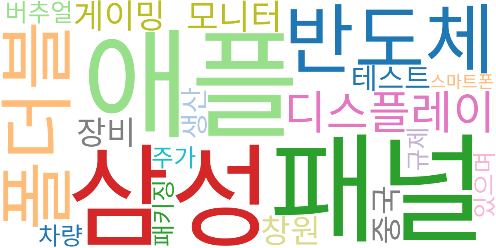

| Rank | Keyword | Score |
|---:|---|---:|
| 1 | 패널 | 0.726 |
| 2 | 애플 | 0.724 |
| 3 | 삼성 | 0.646 |
| 4 | 반도체 | 0.576 |
| 5 | 폴더블 | 0.570 |
| 6 | 디스플레이 | 0.366 |
| 7 | 모니터 | 0.330 |
| 8 | 게이밍 | 0.318 |
| 9 | 창원 | 0.306 |
| 10 | 장비 | 0.299 |
| 11 | 중국 | 0.292 |
| 12 | 테스트 | 0.270 |
| 13 | 생산 | 0.265 |
| 14 | 버추얼 | 0.264 |
| 15 | 주가 | 0.256 |

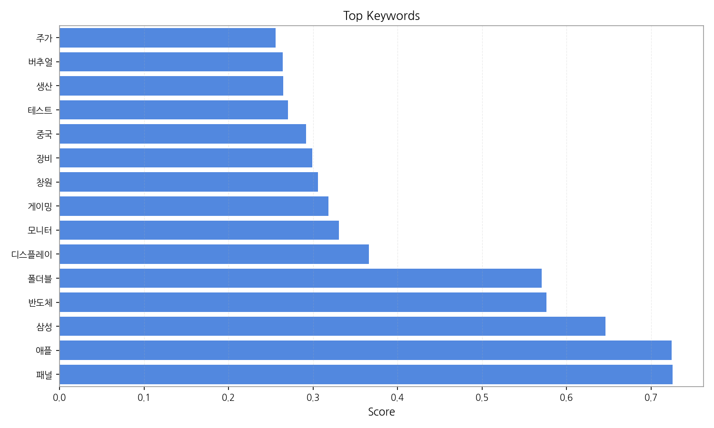

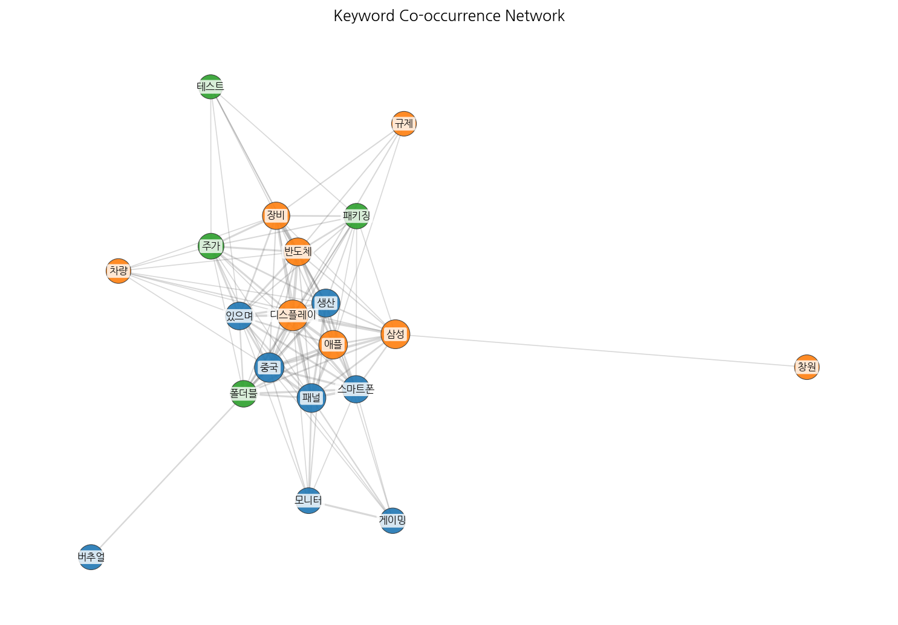

## Topics

- 기술, 기술을, 반도체 (#0)
  - 대표 단어: 기술, 기술을, 반도체, 디스플레이, 첨단, 자동차
- oled, 패널, tv (#1)
  - 대표 단어: oled, 패널, tv, 디스플레이, 대형, 폴더블
- 반도체, ai, 설계 (#2)
  - 대표 단어: 반도체, ai, 설계, 중이다, 사업을, 제품
- 애플, 갤럭시, 것이다 (#3)
  - 대표 단어: 애플, 갤럭시, 것이다, 것은, 삼성, 이미
- 기능을, oled, 노트북 (#4)
  - 대표 단어: 기능을, oled, 노트북, 여기에, 멀티, 제품을
- 추석, 연휴, 체험 (#5)
  - 대표 단어: 추석, 연휴, 체험, 스포츠, 한국, 모두
- oled, 미국, 투자 (#6)
  - 대표 단어: oled, 미국, 투자, 에서, 중국, 패널
- tv, 장비, 디스플레이 (#7)
  - 대표 단어: tv, 장비, 디스플레이, 것이다, lcd, ltpo
- led, micro, 마이크로 (#8)
  - 대표 단어: led, micro, 마이크로, 프리미엄, 개선, 브랜드
- 기술, 미래, 투자 (#9)
  - 대표 단어: 기술, 미래, 투자, 해외, 성장, 공동
- 점프볼, 기사, 분류 (#10)
  - 대표 단어: 점프볼, 기사, 분류, 섹션, 기사 섹션, kcc
- 새로운, ar, 콘텐츠를 (#11)
  - 대표 단어: 새로운, ar, 콘텐츠를, 기술, 중국, 삼성디스플레이
- 패널, 3분기, 한국 (#12)
  - 대표 단어: 패널, 3분기, 한국, 크게, oled, 가장
- 역시, 기술을, 이에 (#13)
  - 대표 단어: 역시, 기술을, 이에, 모든, 경기, 삼성디스플레이는

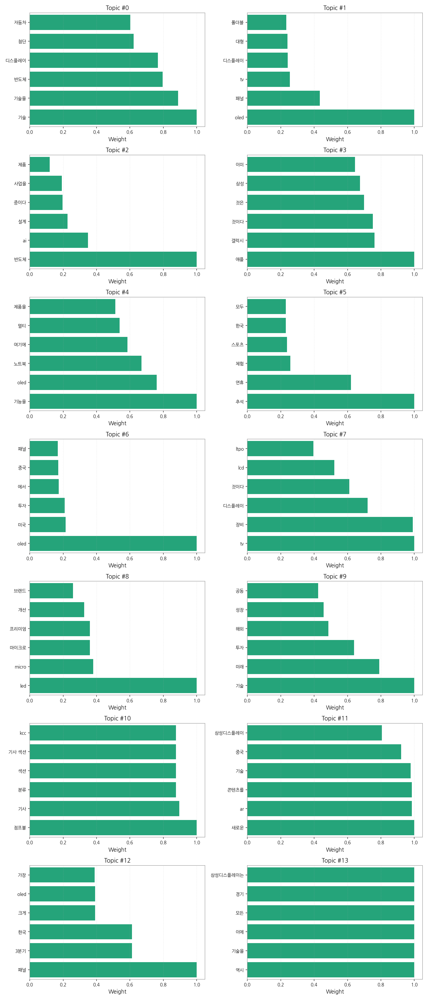

## 기업×토픽 집중도 매트릭스 (주간)

**핵심 요약:**

- **가장 경쟁이 치열한 토픽:** **기술, 기술을** (가장 많은 기업들이 주목)

- **가장 집중도가 높은 기업:** **삼성전자** (다양한 토픽에 걸쳐 높은 관련성)

- **주목할 만한 조합:** **LG전자 @ topic_10** (가장 높은 단일 연관 점수 기록)

각 기업별 상위 8개 토픽의 연관 점수와 해당 토픽 내에서의 점유율(%)을 나타냅니다.

| org           | topic_0     | topic_1     | topic_10    | topic_11    | topic_12    | topic_13    | topic_2     | topic_3     | topic_4    | topic_5     | topic_6     | topic_7     | topic_8     | topic_9     |
|:--------------|:------------|:------------|:------------|:------------|:------------|:------------|:------------|:------------|:-----------|:------------|:------------|:------------|:------------|:------------|
| AMD           | nan         | 0.77 (0%)   | nan         | 0.70 (0%)   | 0.74 (0%)   | 0.70 (0%)   | nan         | nan         | 0.78 (0%)  | nan         | 0.78 (0%)   | nan         | nan         | nan         |
| ASUS          | nan         | 1.54 (0%)   | nan         | 1.41 (1%)   | 1.48 (1%)   | 2.11 (1%)   | 1.60 (1%)   | nan         | 6.27 (4%)  | 1.73 (1%)   | 3.13 (1%)   | nan         | nan         | nan         |
| BOE           | 12.39 (3%)  | 23.84 (7%)  | nan         | 15.50 (6%)  | 16.32 (6%)  | 11.28 (5%)  | nan         | nan         | 9.40 (5%)  | nan         | 18.80 (7%)  | 16.92 (6%)  | nan         | nan         |
| CES           | 3.65 (1%)   | 1.54 (0%)   | nan         | 2.82 (1%)   | 0.74 (0%)   | 0.70 (0%)   | nan         | nan         | nan        | nan         | nan         | 0.77 (0%)   | 0.78 (0%)   | 2.23 (1%)   |
| CSOT          | 7.29 (2%)   | 10.77 (3%)  | nan         | 9.16 (3%)   | 8.90 (3%)   | 4.93 (2%)   | nan         | nan         | nan        | nan         | 10.97 (4%)  | 7.69 (3%)   | nan         | 5.19 (2%)   |
| IoT           | 6.56 (2%)   | nan         | nan         | nan         | 2.23 (1%)   | 2.11 (1%)   | 7.19 (3%)   | nan         | 2.35 (1%)  | nan         | 2.35 (1%)   | 2.31 (1%)   | nan         | 3.71 (1%)   |
| LG디스플레이       | 30.62 (8%)  | 50.76 (14%) | nan         | 31.71 (11%) | 27.45 (10%) | 24.66 (10%) | nan         | nan         | nan        | nan         | 27.42 (11%) | 32.30 (11%) | 19.59 (12%) | nan         |
| LG전자          | 21.14 (5%)  | 20.00 (6%)  | 67.60 (79%) | 17.62 (6%)  | nan         | 15.50 (6%)  | 15.97 (6%)  | nan         | nan        | 17.30 (11%) | nan         | nan         | nan         | 17.81 (7%)  |
| LG화학          | 2.19 (1%)   | 1.54 (0%)   | 1.61 (2%)   | nan         | nan         | 2.11 (1%)   | 3.19 (1%)   | 2.40 (1%)   | nan        | nan         | 1.57 (1%)   | nan         | 2.35 (1%)   | nan         |
| MWC           | nan         | nan         | nan         | 0.70 (0%)   | nan         | nan         | nan         | nan         | nan        | nan         | nan         | nan         | nan         | nan         |
| SID           | 3.65 (1%)   | 1.54 (0%)   | nan         | 2.82 (1%)   | 0.74 (0%)   | 0.70 (0%)   | nan         | nan         | nan        | nan         | nan         | 0.77 (0%)   | 0.78 (0%)   | 2.23 (1%)   |
| SK하이닉스        | 30.62 (8%)  | 12.31 (3%)  | nan         | nan         | nan         | 12.68 (5%)  | 27.15 (10%) | 9.58 (6%)   | 9.40 (5%)  | nan         | nan         | 13.08 (5%)  | nan         | 20.77 (8%)  |
| Semiconductor | 1.46 (0%)   | nan         | 1.61 (2%)   | nan         | nan         | 1.41 (1%)   | 1.60 (1%)   | nan         | nan        | nan         | nan         | 0.77 (0%)   | 0.78 (0%)   | nan         |
| TCL           | 3.65 (1%)   | 8.46 (2%)   | nan         | 5.64 (2%)   | 6.68 (2%)   | nan         | nan         | nan         | nan        | 3.46 (2%)   | 7.05 (3%)   | 7.69 (3%)   | 3.92 (2%)   | nan         |
| V2X           | 6.56 (2%)   | nan         | nan         | nan         | 2.23 (1%)   | 2.11 (1%)   | 7.19 (3%)   | nan         | 2.35 (1%)  | nan         | 2.35 (1%)   | 2.31 (1%)   | nan         | 3.71 (1%)   |
| Visionox      | nan         | 3.08 (1%)   | nan         | 2.82 (1%)   | 6.68 (2%)   | 2.11 (1%)   | nan         | 1.60 (1%)   | nan        | 1.73 (1%)   | 3.13 (1%)   | 3.08 (1%)   | nan         | nan         |
| 구글            | 13.85 (3%)  | 8.46 (2%)   | nan         | 11.28 (4%)  | nan         | nan         | 9.58 (3%)   | 12.78 (7%)  | 10.19 (6%) | nan         | nan         | nan         | 10.19 (6%)  | 9.65 (4%)   |
| 기아            | 21.87 (5%)  | 7.69 (2%)   | nan         | 7.75 (3%)   | nan         | 7.75 (3%)   | 15.97 (6%)  | nan         | 5.48 (3%)  | nan         | nan         | 9.23 (3%)   | nan         | 14.10 (6%)  |
| 네이버           | 7.29 (2%)   | 2.31 (1%)   | nan         | 2.82 (1%)   | nan         | nan         | 6.39 (2%)   | nan         | 1.57 (1%)  | nan         | 1.57 (1%)   | 2.31 (1%)   | nan         | 5.19 (2%)   |
| 마이크로소프트       | 2.92 (1%)   | nan         | nan         | 1.41 (1%)   | nan         | nan         | 0.80 (0%)   | 2.40 (1%)   | 1.57 (1%)  | 1.73 (1%)   | nan         | nan         | 0.78 (0%)   | 1.48 (1%)   |
| 메타            | 0.73 (0%)   | nan         | nan         | 1.41 (1%)   | 1.48 (1%)   | nan         | 0.80 (0%)   | 1.60 (1%)   | 1.57 (1%)  | nan         | 0.78 (0%)   | nan         | nan         | 0.74 (0%)   |
| 미디어텍          | 6.56 (2%)   | nan         | nan         | nan         | 2.23 (1%)   | 2.11 (1%)   | 7.19 (3%)   | nan         | 2.35 (1%)  | nan         | 2.35 (1%)   | 2.31 (1%)   | nan         | 3.71 (1%)   |
| 벤츠            | nan         | 3.08 (1%)   | nan         | nan         | 2.97 (1%)   | nan         | 2.40 (1%)   | 4.79 (3%)   | nan        | 6.92 (4%)   | 3.13 (1%)   | 2.31 (1%)   | 3.92 (2%)   | nan         |
| 비보            | nan         | 5.38 (1%)   | nan         | 4.93 (2%)   | 14.10 (5%)  | 2.82 (1%)   | nan         | 3.19 (2%)   | nan        | 4.32 (3%)   | 6.27 (2%)   | 5.38 (2%)   | nan         | nan         |
| 삼성디스플레이       | 46.22 (8%)  | 56.52 (11%) | nan         | 49.75 (12%) | 36.35 (9%)  | 36.55 (10%) | nan         | nan         | nan        | nan         | 33.87 (9%)  | 37.68 (9%)  | nan         | 25.66 (7%)  |
| 삼성전자          | 66.35 (16%) | 66.15 (18%) | nan         | 42.28 (15%) | nan         | 44.40 (18%) | 51.90 (19%) | nan         | nan        | nan         | 38.39 (15%) | 46.92 (17%) | nan         | 37.10 (15%) |
| 샤오미           | nan         | 5.38 (1%)   | nan         | 4.93 (2%)   | 14.10 (5%)  | 2.82 (1%)   | nan         | 3.19 (2%)   | nan        | 4.32 (3%)   | 6.27 (2%)   | 5.38 (2%)   | nan         | nan         |
| 소니            | 2.92 (1%)   | nan         | nan         | 1.41 (1%)   | nan         | 1.41 (1%)   | nan         | 2.40 (1%)   | 3.13 (2%)  | 2.59 (2%)   | nan         | nan         | 1.57 (1%)   | 1.48 (1%)   |
| 아이씨디          | 5.10 (1%)   | 2.31 (1%)   | nan         | 2.11 (1%)   | 2.23 (1%)   | 2.11 (1%)   | nan         | nan         | nan        | nan         | 2.35 (1%)   | 3.85 (1%)   | nan         | 2.23 (1%)   |
| 애플            | 23.33 (6%)  | 39.23 (11%) | nan         | 24.66 (9%)  | 48.97 (17%) | 26.78 (11%) | nan         | 27.15 (16%) | nan        | nan         | 32.12 (12%) | 27.69 (10%) | nan         | nan         |
| 엔비디아          | nan         | nan         | nan         | nan         | nan         | nan         | nan         | 0.80 (0%)   | nan        | nan         | nan         | nan         | nan         | 0.74 (0%)   |
| 오포            | nan         | 3.08 (1%)   | nan         | 2.82 (1%)   | 6.68 (2%)   | 2.11 (1%)   | nan         | 1.60 (1%)   | nan        | 1.73 (1%)   | 3.13 (1%)   | 3.08 (1%)   | nan         | nan         |
| 인텔            | 2.19 (1%)   | 1.54 (0%)   | 1.61 (2%)   | nan         | nan         | 2.11 (1%)   | 3.19 (1%)   | 2.40 (1%)   | nan        | nan         | 1.57 (1%)   | nan         | 2.35 (1%)   | nan         |
| 카카오           | 7.29 (2%)   | 2.31 (1%)   | nan         | 2.82 (1%)   | 2.23 (1%)   | nan         | 6.39 (2%)   | nan         | 2.35 (1%)  | nan         | nan         | 2.31 (1%)   | nan         | 5.94 (2%)   |
| 퀄컴            | 8.75 (2%)   | nan         | nan         | nan         | nan         | 4.23 (2%)   | 10.38 (4%)  | 3.99 (2%)   | nan        | nan         | 3.92 (2%)   | 3.85 (1%)   | 3.92 (2%)   | 5.19 (2%)   |
| 폭스바겐          | 2.92 (1%)   | nan         | nan         | 1.41 (1%)   | 2.23 (1%)   | nan         | 1.60 (1%)   | nan         | nan        | 1.73 (1%)   | nan         | 1.54 (1%)   | 1.57 (1%)   | 1.48 (1%)   |
| 하이센스          | 1.46 (0%)   | 4.61 (1%)   | nan         | 2.82 (1%)   | 2.23 (1%)   | nan         | nan         | 1.60 (1%)   | nan        | nan         | 4.70 (2%)   | 3.08 (1%)   | 3.13 (2%)   | nan         |
| 한미반도체         | 6.56 (2%)   | nan         | nan         | nan         | 2.23 (1%)   | 2.11 (1%)   | 7.19 (3%)   | nan         | 2.35 (1%)  | nan         | 2.35 (1%)   | 2.31 (1%)   | nan         | 3.71 (1%)   |
| 한화솔루션         | 7.29 (2%)   | 2.31 (1%)   | nan         | 2.82 (1%)   | nan         | nan         | 3.99 (1%)   | nan         | 2.35 (1%)  | nan         | nan         | 3.08 (1%)   | 2.35 (1%)   | 3.71 (1%)   |
| 한화시스템         | 7.29 (2%)   | 2.31 (1%)   | nan         | 2.82 (1%)   | nan         | nan         | 6.39 (2%)   | nan         | 1.57 (1%)  | nan         | 1.57 (1%)   | 2.31 (1%)   | nan         | 5.19 (2%)   |
| 현대모비스         | 14.58 (4%)  | 5.38 (1%)   | nan         | 4.93 (2%)   | nan         | 4.93 (2%)   | 11.98 (4%)  | nan         | 3.13 (2%)  | nan         | nan         | 6.15 (2%)   | nan         | 10.39 (4%)  |
| 현대자동차         | 7.29 (2%)   | 2.31 (1%)   | nan         | 2.82 (1%)   | nan         | nan         | 3.99 (1%)   | nan         | 2.35 (1%)  | nan         | nan         | 3.08 (1%)   | 2.35 (1%)   | 3.71 (1%)   |
| 현대차           | 16.04 (4%)  | 6.92 (2%)   | nan         | 4.93 (2%)   | nan         | 5.64 (2%)   | 11.98 (4%)  | nan         | nan        | 6.05 (4%)   | nan         | 6.15 (2%)   | nan         | 11.13 (4%)  |
| 화웨이           | nan         | 3.85 (1%)   | nan         | 2.11 (1%)   | nan         | 1.41 (1%)   | nan         | 1.60 (1%)   | nan        | 0.86 (1%)   | 1.57 (1%)   | 1.54 (1%)   | 1.57 (1%)   | nan         |

**코멘트 및 액션 힌트:**

> 특정 토픽에서 높은 점유율을 보이는 기업은 해당 분야의 '주도자(Leader)'일 가능성이 높습니다. 반면, 특정 기업이 소수의 토픽에 높은 점수를 집중하고 있다면, 이는 해당 기업의 '핵심 전략 분야'를 시사합니다. 경쟁사 및 파트너사의 집중 분야를 파악하여 우리의 전략을 점검해볼 수 있습니다.

## 기업×토픽 시각적 분석

### 전체 시장 구도 (Heatmap)

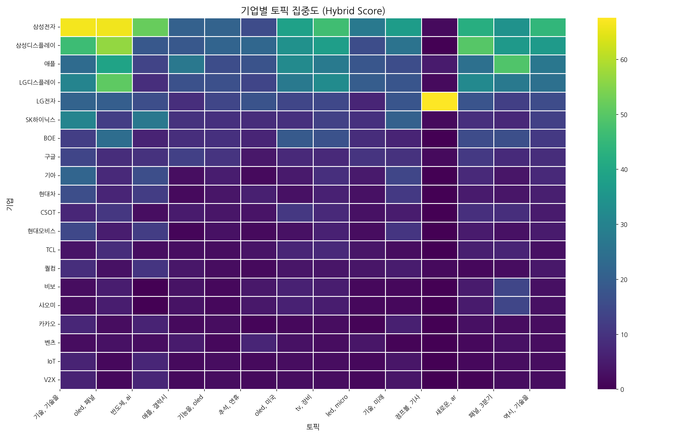

> 전체 기업과 토픽 간의 관계를 한눈에 보여줍니다. 색이 진할수록 연관성이 높습니다.

### 주요 토픽별 경쟁 구도 (Pie Charts)

> 가장 뜨거운 주제를 두고 어떤 기업들이 경쟁하는지 점유율을 보여줍니다.

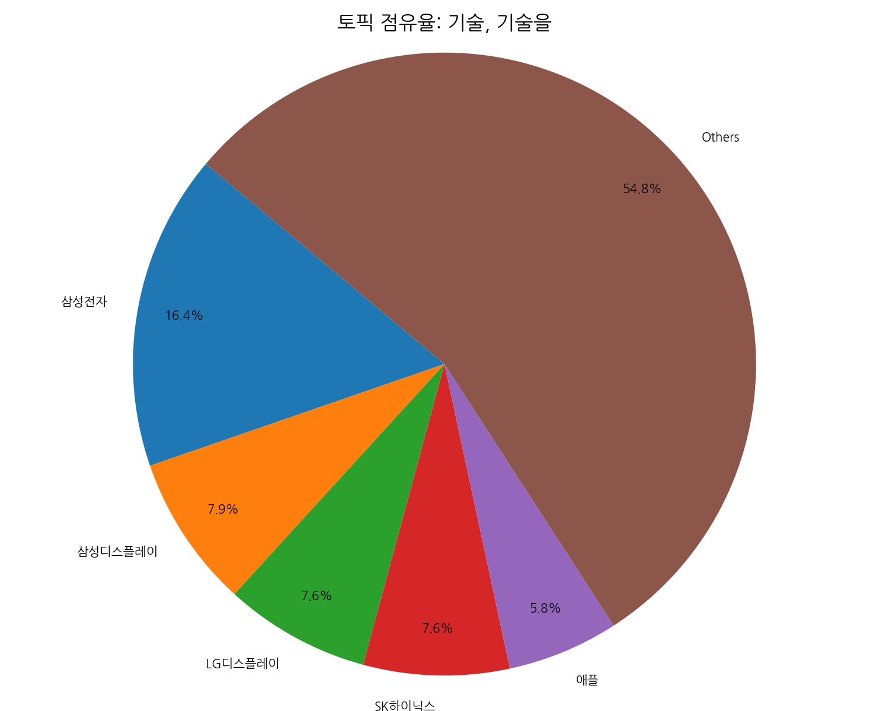
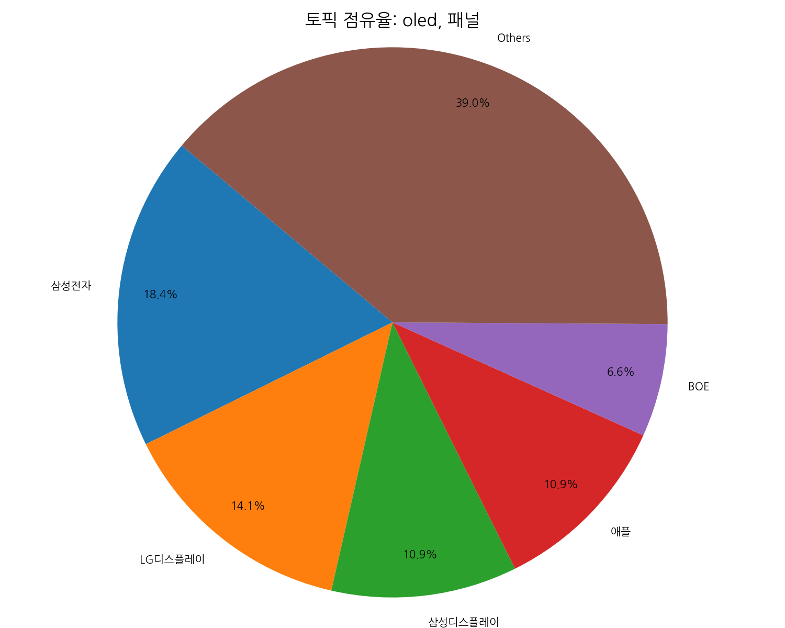
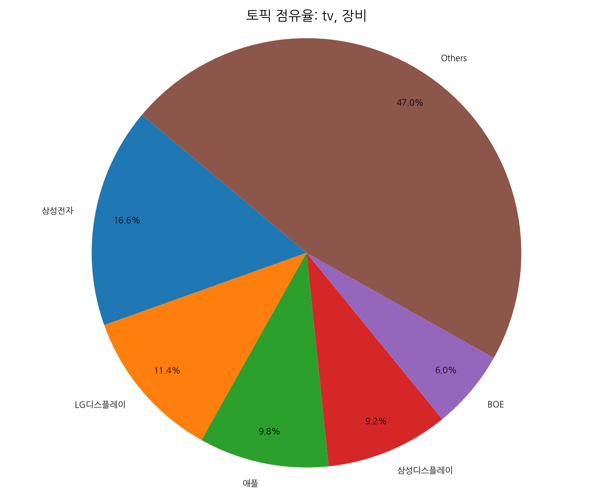

### 주요 기업별 전략 분석 (Bar Charts)

> 시장을 주도하는 주요 기업들이 어떤 토픽에 집중하고 있는지 보여줍니다.

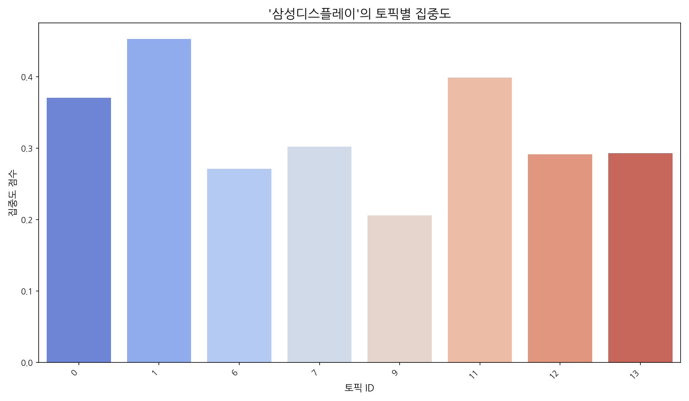
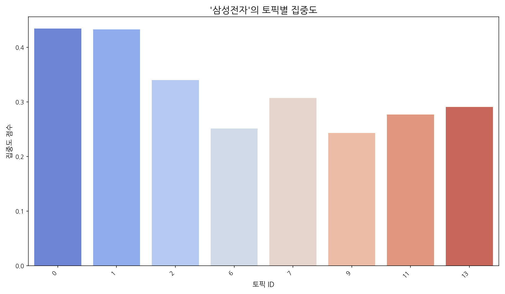
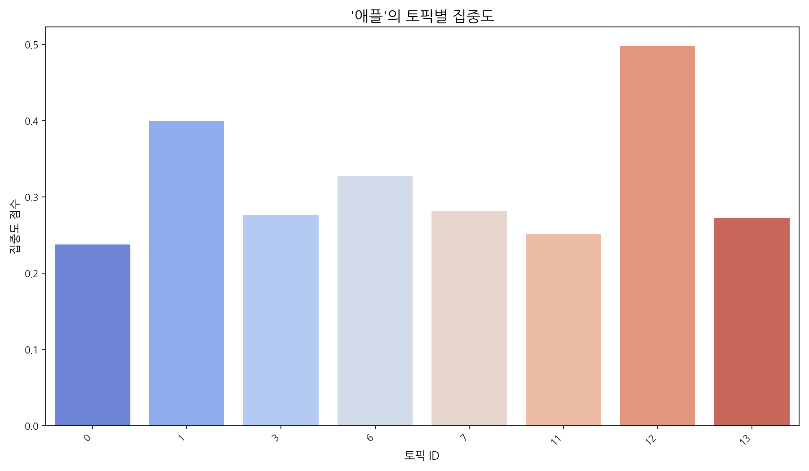

## Trend

- 최근 기사 수 추세와 7일 이동평균선을 제공합니다.

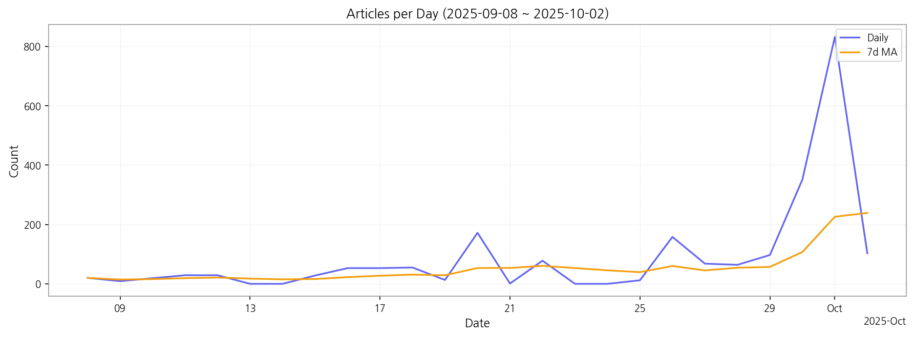

## Insights

## 데일리 인텔리전스 브리핑

**1. 핵심 맥락:**

*   **OLED 시장 경쟁 심화 및 기술 혁신 가속화:** OLED는 TV, 노트북, 폴더블 기기 등 다양한 제품군에서 핵심 디스플레이 기술로 자리매김하고 있으며, 특히 삼성전자와 LG디스플레이를 중심으로 기술 경쟁이 심화되고 있습니다. 동시에 QD-OLED와 같은 차세대 기술 개발과 더불어, AI 기술을 접목한 디스플레이 성능 개선 노력이 활발하게 이루어지고 있습니다.
*   **반도체 기술 발전과 디스플레이 산업의 융합:** 반도체 기술은 디스플레이 구동 칩, AI 기반 화질 개선 등 디스플레이 산업 전반에 걸쳐 중요한 역할을 수행하고 있습니다. 특히, 첨단 반도체 기술은 차세대 디스플레이 개발의 핵심 동력으로 작용하며, 디스플레이 기업들은 반도체 기술과의 융합을 통해 제품 경쟁력을 강화하고 있습니다.
*   **애플을 중심으로 한 프리미엄 디스플레이 시장 확대:** 애플은 OLED 패널을 적극적으로 채택하며 프리미엄 디스플레이 시장 성장을 견인하고 있습니다. 특히, 아이폰, 노트북 등 주요 제품군에 OLED 패널 적용을 확대하면서, 관련 시장 경쟁 또한 심화될 것으로 예상됩니다.

**2. 최근 변화/스파이크:**

*   **2025년 9월 30일 및 10월 1일 기사 수 급증:** 9월 30일과 10월 1일에 기사 수가 급증한 것은 '패널', '애플', '삼성', '반도체', '디스플레이' 등의 키워드를 통해 추론해 볼 때, 애플의 신제품 출시 및 관련 디스플레이 패널 공급망 변화, 삼성의 차세대 디스플레이 기술 발표 등 시장에 큰 영향을 미치는 이벤트가 발생했을 가능성이 높습니다. 특히, 'OLED', '폴더블' 키워드와 함께 고려하면 폴더블폰 신제품 출시와 관련된 내용일 수 있습니다.

**3. 실무 인사이트:**

*   **사업 개발:**
    *   **폴더블 디스플레이 시장 공략:** 폴더블 기기 시장의 성장 가능성에 주목하여, 폴더블 디스플레이 기술 경쟁력 강화 및 관련 부품/소재 공급망 확보 전략을 수립해야 합니다.
    *   **AI 기반 디스플레이 솔루션 개발:** AI 기술을 활용한 화질 개선, 전력 효율 향상 등 차별화된 디스플레이 솔루션 개발을 통해 프리미엄 시장 경쟁력을 확보해야 합니다.
*   **기술 기획:**
    *   **차세대 OLED 기술 개발 투자 확대:** QD-OLED, MicroLED 등 차세대 디스플레이 기술 개발 투자를 확대하고, 관련 특허 확보 및 기술 표준 선점에 주력해야 합니다.
    *   **반도체-디스플레이 융합 기술 연구 강화:** 디스플레이 구동 칩, AI 반도체 등 반도체 기술과의 융합 연구를 강화하여, 디스플레이 성능 향상 및 새로운 기능 구현을 위한 기술적 기반을 마련해야 합니다.

## Opportunities (Top 5)

| Idea | Target | Value Prop | Score (Market / Urgency / Feasibility / Risk) |
|---|---|---|---|
| 메타버스 몰입형 경험을 위한 초고해상도 마이크로 OLED XR 디스플레이 | 북미 빅테크 기업 (Apple, Meta, Microsoft 등) | 기존 LCD/OLED 대비 압도적인 해상도, 명암비, 응답속도를 제공하는 마이크로 OLED 디스플레이를 통해 현실과 구분하기 어려운 수준의 몰입형 XR 경험 제공. 초소형, 초경량 디자인으로 XR 기기의 착용감 개선. | 4.2 (0.65 / 0.3 / 0.5 / 0.15) |
| IT 기기용 벤더블 OLED 패널 솔루션 | 글로벌 스마트폰 제조사 (삼성전자, 화웨이, 샤오미 등) | 기존 폴더블 디스플레이 대비 얇고 가벼우며, 뛰어난 내구성을 제공하는 벤더블 OLED 패널 솔루션. 자유로운 디자인 구현 가능, 접힘/펼침 수명 극대화, 다양한 폼팩터 지원. | 3.8 (0.48 / 0.387 / 0.5 / 0.15) |
| AI 기반 디스플레이 공정 자동화 및 수율 개선 솔루션 | 디스플레이 패널 제조사 (삼성디스플레이, LG디스플레이, BOE 등) | AI 기반 실시간 공정 데이터 분석 및 예측 모델을 통해 불량 발생 가능성을 사전에 감지하고, 공정 변수를 자동 최적화하여 수율을 극대화. 인건비 절감, 생산성 향상, 품질 안정화. | 3.5 (0.43 / 0.3 / 0.55 / 0.15) |
| 차량용 AR HUD (증강현실 헤드업 디스플레이) 솔루션 | 글로벌 완성차 OEM (특히 프리미엄 브랜드) | 기존 HUD의 한계를 넘어, AR 기술을 통해 주행 경로, 위험 경고, 주변 차량 정보 등을 운전자 시야에 직접 투사하여 안전 운전 지원 및 몰입감 있는 정보 제공. 경쟁사 대비 넓은 시야각과 고해상도, 실시간 정보 처리 기술로 차별화. | 3.5 (0.42 / 0.3 / 0.55 / 0.15) |
| 차세대 디스플레이용 신소재 양자점(Quantum Dot) 개발 및 상용화 | 디스플레이 패널 제조사 (삼성디스플레이, LG디스플레이, BOE 등) | 기존 양자점 소재 대비 뛰어난 색 재현율, 휘도, 수명을 제공하는 차세대 양자점 소재. 카드뮴 프리 친환경 소재, 낮은 구동 전압, 높은 안정성. | 3.3 (0.4 / 0.3 / 0.5 / 0.15) |

### 📊 아이디어 점수 분포
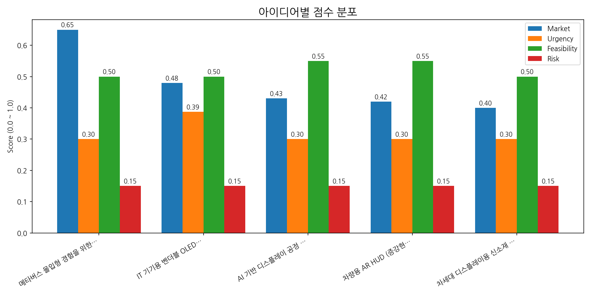

## Appendix

- 데이터: keywords.json, topics.json, trend_timeseries.json, trend_insights.json, biz_opportunities.json