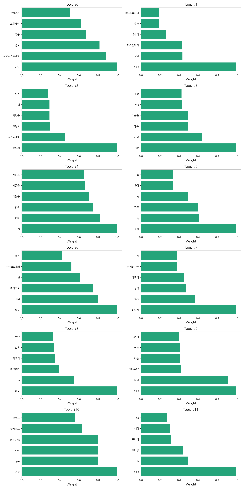
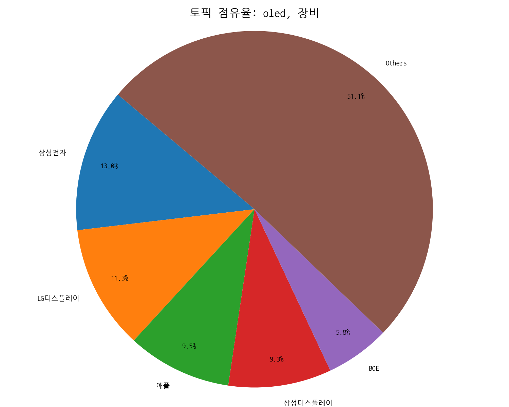
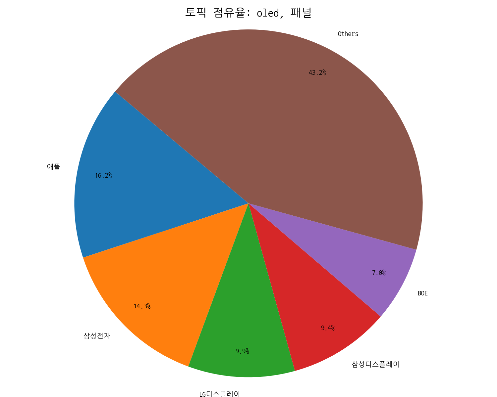
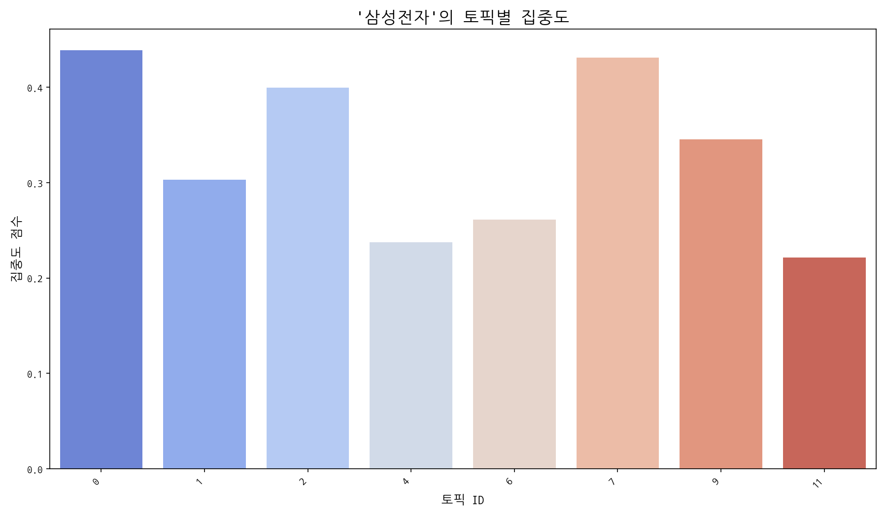
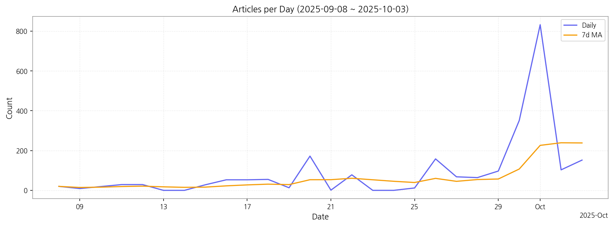

# Weekly/New Biz Report (2025-10-03)

## Executive Summary

- 이번 기간 핵심 토픽과 키워드, 주요 시사점을 요약합니다.

## 데일리 인텔리전스 브리핑

**1. 핵심 맥락:**

*   **OLED 시장 경쟁 심화 및 기술 혁신 가속화:** OLED 관련 토픽(1, 9, 11)에서 '애플', '패널', '폴더블', 'TV', '게이밍' 등의 키워드가 상위권을 차지하며, 아이폰을 비롯한 다양한 제품군에서 OLED 채택이 확대되고 있으며, 폴더블 디스플레이와 게이밍 TV 등 고부가 가치 제품을 중심으로 기술 경쟁이 심화되고 있음을 시사합니다. 특히, 'QD OLED' 키워드는 삼성디스플레이의 기술 경쟁력 강화 노력을 보여줍니다.
*   **중국의 디스플레이 산업 영향력 확대 및 기술 경쟁력 추격:** '중국' 키워드는 기술 유출(토픽 0), OLED 투자(토픽 1), LED 기술(토픽 6), 아이폰 OLED 패널(토픽 9) 등 다양한 토픽에서 높은 비중을 차지하며, 중국이 디스플레이 기술 확보에 적극적으로 나서고 있으며, 한국 기업과의 경쟁 심화를 예고합니다. 특히, '마이크로 LED' 관련 키워드는 중국이 차세대 디스플레이 기술 경쟁에서도 주도권을 확보하려는 움직임을 나타냅니다.

**2. 최근 변화/스파이크:**

*   **2025년 9월 30일 및 10월 1일 기사 수 급증:** 9월 30일과 10월 1일에 기사 수가 급증한 것은 '패널', '애플', '삼성', '반도체', '중국', '디스플레이', '폴더블' 등 주요 키워드와 관련된 이슈가 집중적으로 발생했음을 의미합니다. 특히, '아이폰', '폴더블', 'OLED' 키워드와 연관된 토픽들의 비중이 높을 것으로 예상되며, 이는 애플의 아이폰17 OLED 패널 채택 및 폴더블폰 시장 경쟁 심화와 관련된 뉴스가 집중적으로 보도되었기 때문으로 추론됩니다.

**3. 실무 인사이트:**

*   **차세대 디스플레이 기술 경쟁력 강화:** 마이크로 LED, QD-OLED 등 차세대 디스플레이 기술 개발에 대한 투자를 확대하고, 기술 로드맵을 구체화하여 중국과의 기술 격차를 유지해야 합니다. 특히, 게이밍, AR/VR 등 고성능 디스플레이 수요가 높은 분야를 중심으로 기술 개발을 집중해야 합니다.
*   **기술 유출 방지 시스템 강화:** 중국으로의 기술 유출은 기업의 경쟁력을 약화시키는 주요 요인이므로, 보안 시스템을 강화하고, 임직원 교육을 통해 기술 보안 의식을 고취해야 합니다. 또한, 기술 유출 발생 시 신속하게 대응할 수 있는 체계를 구축해야 합니다.
*   **애플과의 협력 강화 및 신규 고객 확보:** 애플의 OLED 패널 채택 확대는 디스플레이 기업에게 큰 기회 요인이므로, 애플과의 협력을 강화하고, 폴더블폰, IT 기기 등 다양한 제품군으로 OLED 패널 공급을 확대해야 합니다. 또한, 중국 시장 의존도를 낮추기 위해 신규 고객 확보 노력을 강화해야 합니다.

## Key Metrics

- 기간: 2025-09-08 ~ 2025-10-03
- 총 기사 수: 2,396
- 문서 수: N/A
- 키워드 수(상위): 15
- 토픽 수: 12
- 시계열 데이터 일자 수: 26

## Top Keywords

| Rank | Keyword | Score |
|---:|---|---:|
| 1 | 패널 | 0.774 |
| 2 | 애플 | 0.739 |
| 3 | 삼성 | 0.642 |
| 4 | 반도체 | 0.571 |
| 5 | 중국 | 0.489 |
| 6 | 디스플레이 | 0.470 |
| 7 | 폴더블 | 0.459 |
| 8 | 한화 | 0.416 |
| 9 | 장비 | 0.386 |
| 10 | 아이 | 0.371 |
| 11 | 생산 | 0.288 |
| 12 | 게이밍 | 0.279 |
| 13 | 고객 | 0.278 |
| 14 | 전장 | 0.274 |
| 15 | 시스템 | 0.272 |

## Topics

- 기술, 삼성디스플레이, 중국 (#0)
  - 대표 단어: 기술, 삼성디스플레이, 중국, 유출, 디스플레이, 삼성전자
- oled, 장비, 디스플레이 (#1)
  - 대표 단어: oled, 장비, 디스플레이, 6세대, 투자, lg디스플레이
- 반도체, 디스플레이, 자동차 (#2)
  - 대표 단어: 반도체, 디스플레이, 자동차, 사업을, ai, 모듈
- sns, 게임, 일본 (#3)
  - 대표 단어: sns, 게임, 일본, 기술을, 한국, 주행
- ai, 이미, 것이 (#4)
  - 대표 단어: ai, 이미, 것이, 기능을, 제품을, 서비스
- 추석, lg, 연휴 (#5)
  - 대표 단어: 추석, lg, 연휴, kt, 한화, sk
- 중국, led, 마이크로 (#6)
  - 대표 단어: 중국, led, 마이크로, ai, 마이크로 led, 높은
- 반도체, hbm, 실적 (#7)
  - 대표 단어: 반도체, hbm, 실적, 메모리, 삼성전자는, ai
- 미국, ai, 마감했다 (#8)
  - 대표 단어: 미국, ai, 마감했다, 샤오미, 오른, 반면
- oled, 패널, 아이폰17 (#9)
  - 대표 단어: oled, 패널, 아이폰17, 애플, 아이폰, 3분기
- 피부, pin, shot (#10)
  - 대표 단어: 피부, pin, shot, pin shot, 클레녹스, 브랜드
- oled, tv, 게이밍 (#11)
  - 대표 단어: oled, tv, 게이밍, 모니터, 대형, qd

## 기업×토픽 집중도 매트릭스 (주간)

**핵심 요약:**

- **가장 경쟁이 치열한 토픽:** **반도체, 디스플레이** (가장 많은 기업들이 주목)

- **가장 집중도가 높은 기업:** **삼성전자** (다양한 토픽에 걸쳐 높은 관련성)

- **주목할 만한 조합:** **애플 @ topic_9** (가장 높은 단일 연관 점수 기록)

각 기업별 상위 8개 토픽의 연관 점수와 해당 토픽 내에서의 점유율(%)을 나타냅니다.

| org           | topic_0      | topic_1     | topic_10   | topic_11    | topic_2      | topic_3     | topic_4     | topic_5     | topic_6     | topic_7      | topic_8     | topic_9      |
|:--------------|:-------------|:------------|:-----------|:------------|:-------------|:------------|:------------|:------------|:------------|:-------------|:------------|:-------------|
| AMD           | 1.46 (0%)    | 2.16 (0%)   | nan        | nan         | 2.11 (0%)    | nan         | 3.56 (1%)   | nan         | 3.47 (1%)   | 4.71 (1%)    | 1.48 (0%)   | 1.50 (0%)    |
| ASUS          | 1.46 (0%)    | 1.44 (0%)   | 1.95 (2%)  | 6.28 (2%)   | nan          | 2.11 (1%)   | 4.27 (1%)   | nan         | 1.39 (0%)   | nan          | nan         | 3.01 (0%)    |
| BMW           | 0.73 (0%)    | nan         | 0.97 (1%)  | 2.35 (1%)   | 1.40 (0%)    | 2.81 (1%)   | 2.85 (1%)   | nan         | 2.08 (0%)   | nan          | nan         | 0.75 (0%)    |
| BOE           | 29.97 (5%)   | 34.61 (6%)  | nan        | 21.97 (6%)  | 19.66 (3%)   | nan         | 12.81 (3%)  | nan         | 12.48 (3%)  | 12.55 (3%)   | nan         | 42.83 (7%)   |
| BYD           | nan          | nan         | 0.97 (1%)  | nan         | nan          | 0.70 (0%)   | 0.71 (0%)   | nan         | 1.39 (0%)   | nan          | nan         | nan          |
| CES           | 5.85 (1%)    | 5.77 (1%)   | nan        | nan         | 6.32 (1%)    | 9.13 (3%)   | 2.13 (0%)   | nan         | 2.77 (1%)   | nan          | 2.22 (1%)   | 3.76 (1%)    |
| CSOT          | 16.81 (3%)   | 23.07 (4%)  | nan        | 10.98 (3%)  | 11.24 (2%)   | nan         | 5.69 (1%)   | nan         | 5.55 (1%)   | nan          | 4.45 (1%)   | 18.79 (3%)   |
| HP            | 3.65 (1%)    | nan         | nan        | 3.14 (1%)   | 2.11 (0%)    | 3.51 (1%)   | 4.27 (1%)   | 2.81 (1%)   | 2.08 (0%)   | nan          | nan         | 3.01 (0%)    |
| Harman        | nan          | nan         | 1.95 (2%)  | 2.35 (1%)   | 1.40 (0%)    | nan         | 3.56 (1%)   | 2.81 (1%)   | 3.47 (1%)   | 1.57 (0%)    | 1.48 (0%)   | nan          |
| IoT           | nan          | nan         | nan        | 3.14 (1%)   | 7.72 (1%)    | 2.81 (1%)   | 7.11 (2%)   | 2.81 (1%)   | 6.24 (1%)   | 7.85 (2%)    | 4.45 (1%)   | nan          |
| LG디스플레이       | 54.82 (9%)   | 67.06 (11%) | nan        | 38.44 (11%) | 43.54 (7%)   | 32.30 (10%) | 27.04 (6%)  | nan         | 25.65 (6%)  | nan          | nan         | 60.86 (10%)  |
| LG전자          | 26.31 (4%)   | 29.56 (5%)  | nan        | 22.75 (6%)  | 38.62 (6%)   | nan         | 34.86 (7%)  | 62.86 (23%) | nan         | 24.32 (5%)   | nan         | 27.80 (5%)   |
| LG화학          | 5.85 (1%)    | 6.49 (1%)   | nan        | nan         | 14.04 (2%)   | 7.02 (2%)   | 7.83 (2%)   | 11.26 (4%)  | 9.01 (2%)   | 10.98 (2%)   | nan         | nan          |
| SID           | 5.85 (1%)    | 5.77 (1%)   | nan        | nan         | 6.32 (1%)    | 9.13 (3%)   | 2.13 (0%)   | nan         | 2.77 (1%)   | nan          | 2.22 (1%)   | 3.76 (1%)    |
| SK하이닉스        | 15.35 (3%)   | 20.19 (3%)  | nan        | nan         | 42.83 (6%)   | 13.34 (4%)  | 29.17 (6%)  | nan         | 22.87 (5%)  | 41.58 (8%)   | 20.01 (6%)  | nan          |
| Semiconductor | nan          | nan         | nan        | 0.78 (0%)   | 2.11 (0%)    | 0.70 (0%)   | 0.71 (0%)   | nan         | 2.77 (1%)   | 1.57 (0%)    | 0.74 (0%)   | nan          |
| TCL           | 5.12 (1%)    | 5.05 (1%)   | nan        | 6.28 (2%)   | 4.21 (1%)    | nan         | 2.13 (0%)   | nan         | 3.47 (1%)   | nan          | 2.22 (1%)   | 6.01 (1%)    |
| TSMC          | 1.46 (0%)    | 1.44 (0%)   | 0.97 (1%)  | nan         | 2.11 (0%)    | nan         | 2.13 (0%)   | nan         | 2.08 (0%)   | 6.28 (1%)    | 2.22 (1%)   | nan          |
| Tianma        | 3.65 (1%)    | 9.37 (2%)   | nan        | 3.14 (1%)   | 4.92 (1%)    | nan         | 1.42 (0%)   | nan         | 3.47 (1%)   | 3.92 (1%)    | nan         | 4.51 (1%)    |
| V2X           | 1.46 (0%)    | 1.44 (0%)   | nan        | nan         | 6.32 (1%)    | 2.11 (1%)   | 3.56 (1%)   | nan         | 2.77 (1%)   | 6.28 (1%)    | 2.96 (1%)   | nan          |
| Visionox      | 10.96 (2%)   | 21.63 (4%)  | nan        | 7.85 (2%)   | 13.34 (2%)   | nan         | nan         | nan         | 6.93 (2%)   | 7.85 (2%)    | 2.22 (1%)   | 15.03 (2%)   |
| 구글            | 12.43 (2%)   | 15.86 (3%)  | nan        | nan         | 25.28 (4%)   | nan         | 24.90 (5%)  | nan         | 23.57 (5%)  | 16.48 (3%)   | 18.53 (5%)  | 13.53 (2%)   |
| 기아            | 13.16 (2%)   | 15.14 (3%)  | nan        | nan         | 30.19 (5%)   | 10.53 (3%)  | 15.65 (3%)  | 9.38 (3%)   | 13.17 (3%)  | 10.98 (2%)   | nan         | nan          |
| 네이버           | 7.31 (1%)    | 9.37 (2%)   | nan        | nan         | 17.55 (3%)   | 6.32 (2%)   | 14.23 (3%)  | 8.44 (3%)   | 11.78 (3%)  | nan          | 8.15 (2%)   | nan          |
| 디지타임스         | 2.92 (0%)    | 3.61 (1%)   | nan        | 1.57 (0%)   | 1.40 (0%)    | 1.40 (0%)   | 1.42 (0%)   | nan         | nan         | nan          | 1.48 (0%)   | 5.26 (1%)    |
| 마이크로소프트       | 1.46 (0%)    | nan         | nan        | nan         | 4.21 (1%)    | 2.81 (1%)   | 7.11 (2%)   | nan         | 6.24 (1%)   | 5.49 (1%)    | 4.45 (1%)   | 1.50 (0%)    |
| 메타            | 0.77 (0%)    | 2.27 (0%)   | nan        | nan         | 3.69 (1%)    | nan         | 4.48 (1%)   | nan         | 3.64 (1%)   | 4.94 (1%)    | 13.23 (4%)  | 3.16 (0%)    |
| 미디어텍          | nan          | nan         | nan        | 3.14 (1%)   | 7.72 (1%)    | 2.81 (1%)   | 7.11 (2%)   | 2.81 (1%)   | 6.24 (1%)   | 7.85 (2%)    | 4.45 (1%)   | nan          |
| 벤츠            | nan          | nan         | 2.92 (3%)  | 3.92 (1%)   | 2.81 (0%)    | 4.92 (1%)   | 5.69 (1%)   | 2.81 (1%)   | 3.47 (1%)   | nan          | nan         | 2.25 (0%)    |
| 비보            | 7.31 (1%)    | 5.77 (1%)   | nan        | 4.71 (1%)   | 3.51 (1%)    | 2.11 (1%)   | nan         | nan         | nan         | 2.35 (0%)    | 2.22 (1%)   | 15.78 (3%)   |
| 삼성디스플레이       | 91.99 (14%)  | 60.24 (9%)  | nan        | 35.75 (9%)  | 43.43 (6%)   | 35.05 (10%) | nan         | nan         | 37.60 (8%)  | 30.65 (6%)   | nan         | 62.78 (9%)   |
| 삼성전자          | 111.83 (19%) | 77.15 (13%) | nan        | 56.49 (16%) | 101.82 (15%) | nan         | 60.48 (13%) | nan         | 66.54 (15%) | 109.84 (22%) | nan         | 87.92 (14%)  |
| 샤오미           | 13.16 (2%)   | 10.82 (2%)  | nan        | 8.63 (2%)   | 7.02 (1%)    | nan         | 7.83 (2%)   | nan         | 6.93 (2%)   | nan          | 5.93 (2%)   | 23.29 (4%)   |
| 선익시스템         | 5.85 (1%)    | 6.49 (1%)   | nan        | 3.92 (1%)   | 1.40 (0%)    | 2.11 (1%)   | nan         | 0.94 (0%)   | nan         | 0.78 (0%)    | nan         | 5.26 (1%)    |
| 소니            | 0.73 (0%)    | nan         | nan        | 0.78 (0%)   | 1.40 (0%)    | 2.11 (1%)   | 4.27 (1%)   | nan         | 4.16 (1%)   | nan          | nan         | nan          |
| 아마존           | nan          | nan         | 2.18 (2%)  | 2.63 (1%)   | 1.57 (0%)    | nan         | 3.98 (1%)   | 3.15 (1%)   | 3.88 (1%)   | 1.76 (0%)    | 1.66 (0%)   | nan          |
| 아이씨디          | 4.39 (1%)    | 6.49 (1%)   | nan        | 2.35 (1%)   | 4.21 (1%)    | 2.11 (1%)   | 2.13 (0%)   | nan         | nan         | 2.35 (0%)    | nan         | 3.76 (1%)    |
| 알파벳           | 0.73 (0%)    | 2.16 (0%)   | nan        | nan         | 2.81 (0%)    | 0.70 (0%)   | 2.13 (0%)   | nan         | nan         | 3.14 (1%)    | 11.12 (3%)  | 2.25 (0%)    |
| 애플            | 69.40 (9%)   | 74.17 (9%)  | nan        | 44.49 (10%) | 56.49 (6%)   | nan         | nan         | nan         | 46.62 (8%)  | 50.70 (8%)   | 70.36 (16%) | 130.81 (16%) |
| 엔비디아          | 4.29 (1%)    | 4.23 (1%)   | nan        | nan         | 6.60 (1%)    | nan         | 6.68 (1%)   | 6.61 (2%)   | 7.33 (1%)   | 14.74 (3%)   | 6.96 (2%)   | nan          |
| 오포            | 9.50 (2%)    | 8.65 (1%)   | nan        | 6.28 (2%)   | 4.21 (1%)    | nan         | nan         | nan         | 2.77 (1%)   | 3.92 (1%)    | 2.22 (1%)   | 20.29 (3%)   |
| 인텔            | 1.46 (0%)    | 1.44 (0%)   | 1.95 (2%)  | nan         | 3.51 (1%)    | nan         | 1.42 (0%)   | 1.88 (1%)   | 2.08 (0%)   | 3.92 (1%)    | nan         | nan          |
| 카카오           | 5.12 (1%)    | 7.93 (1%)   | nan        | nan         | 16.15 (2%)   | 6.32 (2%)   | 10.67 (2%)  | nan         | 7.62 (2%)   | 3.92 (1%)    | 5.19 (2%)   | nan          |
| 퀄컴            | 8.04 (1%)    | 5.77 (1%)   | nan        | nan         | 14.04 (2%)   | nan         | 11.38 (2%)  | nan         | 9.01 (2%)   | 19.61 (4%)   | 6.67 (2%)   | 6.76 (1%)    |
| 폭스바겐          | 0.73 (0%)    | nan         | nan        | nan         | 1.40 (0%)    | 1.40 (0%)   | 2.85 (1%)   | nan         | 3.47 (1%)   | 3.14 (1%)    | 1.48 (0%)   | 0.75 (0%)    |
| 하이센스          | 2.92 (0%)    | 2.88 (0%)   | nan        | 3.92 (1%)   | 0.70 (0%)    | 1.40 (0%)   | nan         | nan         | 2.08 (0%)   | nan          | 1.48 (0%)   | 3.01 (0%)    |
| 하이얼           | 1.46 (0%)    | nan         | 1.95 (2%)  | nan         | 2.81 (0%)    | 2.81 (1%)   | 5.69 (1%)   | 1.88 (1%)   | 4.16 (1%)   | 0.78 (0%)    | nan         | nan          |
| 한미반도체         | 1.46 (0%)    | 1.44 (0%)   | nan        | nan         | 6.32 (1%)    | 2.11 (1%)   | 3.56 (1%)   | nan         | 2.77 (1%)   | 6.28 (1%)    | 2.96 (1%)   | nan          |
| 한화            | 3.84 (1%)    | 5.30 (1%)   | nan        | nan         | 3.69 (1%)    | 5.16 (1%)   | 4.48 (1%)   | 24.63 (9%)  | 2.91 (1%)   | 2.47 (0%)    | nan         | nan          |
| 한화솔루션         | 2.19 (0%)    | 2.88 (0%)   | nan        | 1.57 (0%)   | 6.32 (1%)    | 2.11 (1%)   | 2.85 (1%)   | nan         | nan         | 1.57 (0%)    | 2.22 (1%)   | nan          |
| 한화시스템         | 2.19 (0%)    | 4.33 (1%)   | nan        | nan         | 10.53 (2%)   | nan         | 5.69 (1%)   | 2.81 (1%)   | 5.55 (1%)   | 4.71 (1%)    | 2.96 (1%)   | nan          |
| 현대모비스         | 8.04 (1%)    | 10.82 (2%)  | nan        | nan         | 24.58 (4%)   | 7.02 (2%)   | 12.81 (3%)  | nan         | 10.40 (2%)  | 9.41 (2%)    | nan         | 6.01 (1%)    |
| 현대자동차         | 2.19 (0%)    | 2.88 (0%)   | nan        | 1.57 (0%)   | 6.32 (1%)    | 2.11 (1%)   | 2.85 (1%)   | nan         | nan         | 1.57 (0%)    | 2.22 (1%)   | nan          |
| 현대차           | 12.43 (2%)   | 15.14 (3%)  | nan        | nan         | 25.98 (4%)   | nan         | 15.65 (3%)  | 15.01 (5%)  | 13.17 (3%)  | 11.77 (2%)   | 9.63 (3%)   | nan          |
| 화웨이           | 10.96 (2%)   | 6.49 (1%)   | nan        | 3.14 (1%)   | 4.92 (1%)    | nan         | 2.13 (0%)   | nan         | 4.16 (1%)   | 6.28 (1%)    | nan         | 12.02 (2%)   |

**코멘트 및 액션 힌트:**

> 특정 토픽에서 높은 점유율을 보이는 기업은 해당 분야의 '주도자(Leader)'일 가능성이 높습니다. 반면, 특정 기업이 소수의 토픽에 높은 점수를 집중하고 있다면, 이는 해당 기업의 '핵심 전략 분야'를 시사합니다. 경쟁사 및 파트너사의 집중 분야를 파악하여 우리의 전략을 점검해볼 수 있습니다.

## 기업×토픽 시각적 분석

### 전체 시장 구도 (Heatmap)

> 전체 기업과 토픽 간의 관계를 한눈에 보여줍니다. 색이 진할수록 연관성이 높습니다.

### 주요 토픽별 경쟁 구도 (Pie Charts)

> 가장 뜨거운 주제를 두고 어떤 기업들이 경쟁하는지 점유율을 보여줍니다.

### 주요 기업별 전략 분석 (Bar Charts)

> 시장을 주도하는 주요 기업들이 어떤 토픽에 집중하고 있는지 보여줍니다.

## Trend

- 최근 기사 수 추세와 7일 이동평균선을 제공합니다.

## Insights

## 데일리 인텔리전스 브리핑

**1. 핵심 맥락:**

*   **OLED 시장 경쟁 심화 및 기술 혁신 가속화:** OLED 관련 토픽(1, 9, 11)에서 '애플', '패널', '폴더블', 'TV', '게이밍' 등의 키워드가 상위권을 차지하며, 아이폰을 비롯한 다양한 제품군에서 OLED 채택이 확대되고 있으며, 폴더블 디스플레이와 게이밍 TV 등 고부가 가치 제품을 중심으로 기술 경쟁이 심화되고 있음을 시사합니다. 특히, 'QD OLED' 키워드는 삼성디스플레이의 기술 경쟁력 강화 노력을 보여줍니다.
*   **중국의 디스플레이 산업 영향력 확대 및 기술 경쟁력 추격:** '중국' 키워드는 기술 유출(토픽 0), OLED 투자(토픽 1), LED 기술(토픽 6), 아이폰 OLED 패널(토픽 9) 등 다양한 토픽에서 높은 비중을 차지하며, 중국이 디스플레이 기술 확보에 적극적으로 나서고 있으며, 한국 기업과의 경쟁 심화를 예고합니다. 특히, '마이크로 LED' 관련 키워드는 중국이 차세대 디스플레이 기술 경쟁에서도 주도권을 확보하려는 움직임을 나타냅니다.

**2. 최근 변화/스파이크:**

*   **2025년 9월 30일 및 10월 1일 기사 수 급증:** 9월 30일과 10월 1일에 기사 수가 급증한 것은 '패널', '애플', '삼성', '반도체', '중국', '디스플레이', '폴더블' 등 주요 키워드와 관련된 이슈가 집중적으로 발생했음을 의미합니다. 특히, '아이폰', '폴더블', 'OLED' 키워드와 연관된 토픽들의 비중이 높을 것으로 예상되며, 이는 애플의 아이폰17 OLED 패널 채택 및 폴더블폰 시장 경쟁 심화와 관련된 뉴스가 집중적으로 보도되었기 때문으로 추론됩니다.

**3. 실무 인사이트:**

*   **차세대 디스플레이 기술 경쟁력 강화:** 마이크로 LED, QD-OLED 등 차세대 디스플레이 기술 개발에 대한 투자를 확대하고, 기술 로드맵을 구체화하여 중국과의 기술 격차를 유지해야 합니다. 특히, 게이밍, AR/VR 등 고성능 디스플레이 수요가 높은 분야를 중심으로 기술 개발을 집중해야 합니다.
*   **기술 유출 방지 시스템 강화:** 중국으로의 기술 유출은 기업의 경쟁력을 약화시키는 주요 요인이므로, 보안 시스템을 강화하고, 임직원 교육을 통해 기술 보안 의식을 고취해야 합니다. 또한, 기술 유출 발생 시 신속하게 대응할 수 있는 체계를 구축해야 합니다.
*   **애플과의 협력 강화 및 신규 고객 확보:** 애플의 OLED 패널 채택 확대는 디스플레이 기업에게 큰 기회 요인이므로, 애플과의 협력을 강화하고, 폴더블폰, IT 기기 등 다양한 제품군으로 OLED 패널 공급을 확대해야 합니다. 또한, 중국 시장 의존도를 낮추기 위해 신규 고객 확보 노력을 강화해야 합니다.

## Opportunities (Top 5)

| Idea | Target | Value Prop | Score (Market / Urgency / Feasibility / Risk) |
|---|---|---|---|
| 메타버스 협업용 초고해상도 마이크로 OLED XR 글래스 | 북미 빅테크 기업 (메타버스 플랫폼 사업자), 글로벌 엔터프라이즈 기업 (R&D, 디자인 부서) | 초고해상도 마이크로 OLED 디스플레이를 통해 현실과 같은 선명한 화질을 제공하며, 초경량 디자인으로 장시간 사용에도 편안함을 제공합니다. 몰입감 높은 가상 협업 환경을 구축하여 생산성을 향상시키고, 새로운 비즈니스 기회를 창출합니다. | 4.2 (0.55 / 0.532 / 0.5 / 0.21) |
| IT 기기용 벤더블 OLED 패널 솔루션 | 글로벌 IT 기기 제조사 (노트북, 태블릿) | 사용 목적에 따라 자유롭게 구부리거나 펼쳐서 사용할 수 있는 벤더블 OLED 패널을 제공하여 휴대성과 사용성을 극대화합니다. 기존 IT 기기의 폼팩터 혁신을 통해 새로운 사용자 경험을 제공하고, 시장 경쟁력을 강화합니다. | 4.0 (0.48 / 0.532 / 0.5 / 0.21) |
| AI 기반 디스플레이 공정 자동화 및 수율 예측 솔루션 | 글로벌 디스플레이 제조사 | AI 기반의 실시간 공정 데이터 분석 및 예측 모델을 통해 불량 발생 가능성을 사전에 예측하고, 공정 조건을 최적화하여 수율을 극대화합니다. 공정 자동화를 통해 생산 효율성을 향상시키고, 인건비 절감 효과를 제공합니다. | 3.2 (0.4 / 0.3 / 0.55 / 0.21) |
| 차량용 AR HUD (Augmented Reality Head-Up Display) 솔루션 | 글로벌 완성차 OEM (프리미엄/럭셔리 브랜드) | 운전자의 시야를 방해하지 않으면서, 증강현실 기반의 직관적인 내비게이션, ADAS 정보, 위험 경고 등을 제공하여 안전 운전 경험을 극대화합니다. 기존 HUD 대비 넓은 시야각과 선명한 화질을 제공하며, 운전자 맞춤형 정보 표시 기능을 지원합니다. | 2.9 (0.42 / 0.3 / 0.5 / 0.27) |
| 퀀텀닷 컬러 필터 기반 고색재현율 LCD | 글로벌 TV 제조사, 게이밍 모니터 제조사 | 기존 LCD 대비 월등히 높은 색재현율과 넓은 시야각을 제공하여 더욱 생생하고 몰입감 넘치는 화질을 구현합니다. OLED 대비 낮은 생산 비용으로 가격 경쟁력을 확보하고, 번인 걱정 없이 장시간 사용할 수 있습니다. | 2.6 (0.35 / 0.3 / 0.45 / 0.27) |

### 📊 아이디어 점수 분포

## Appendix

- 데이터: keywords.json, topics.json, trend_timeseries.json, trend_insights.json, biz_opportunities.json