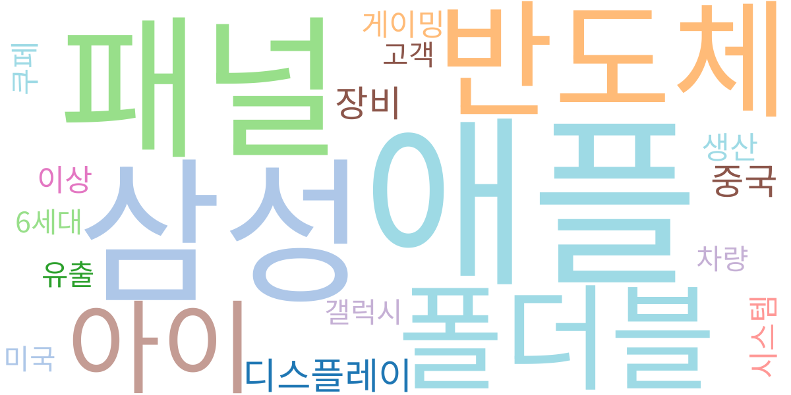
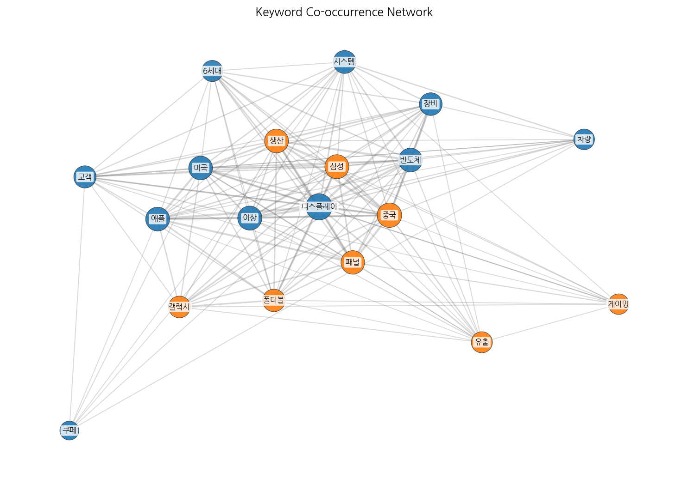
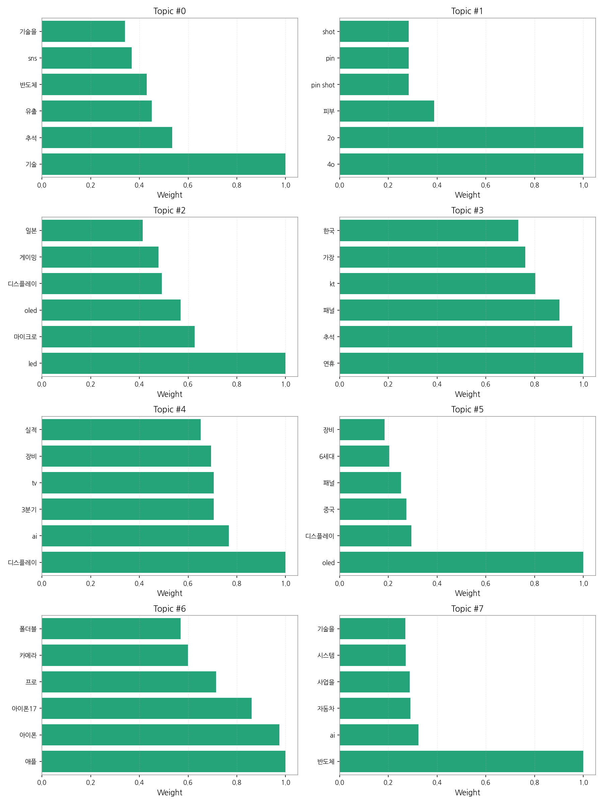
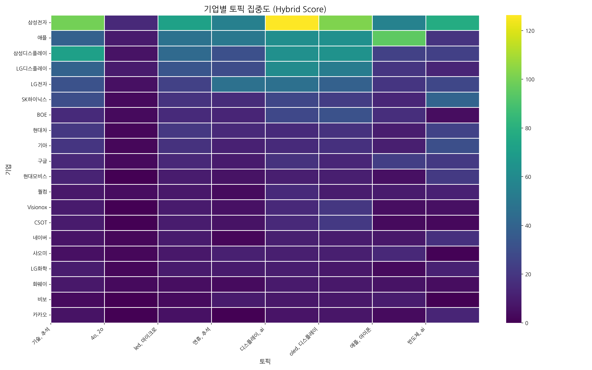
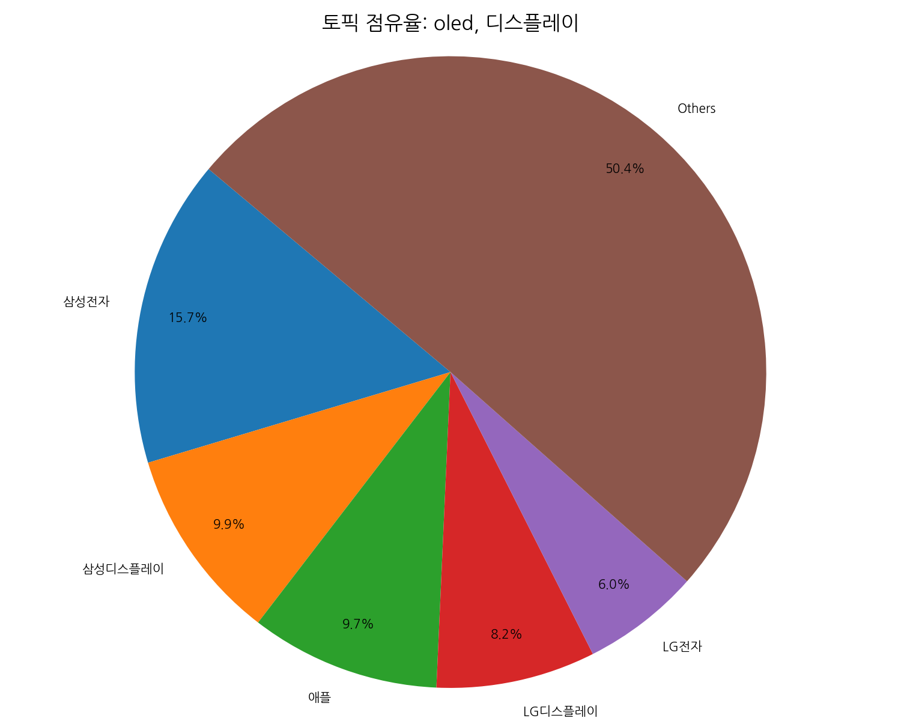
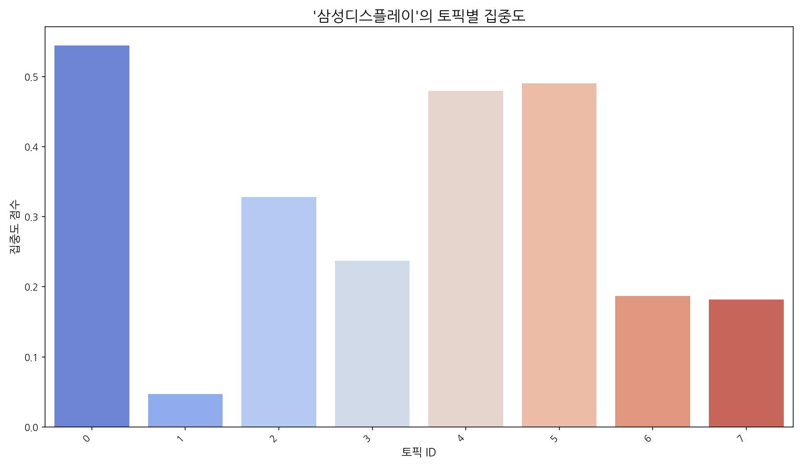
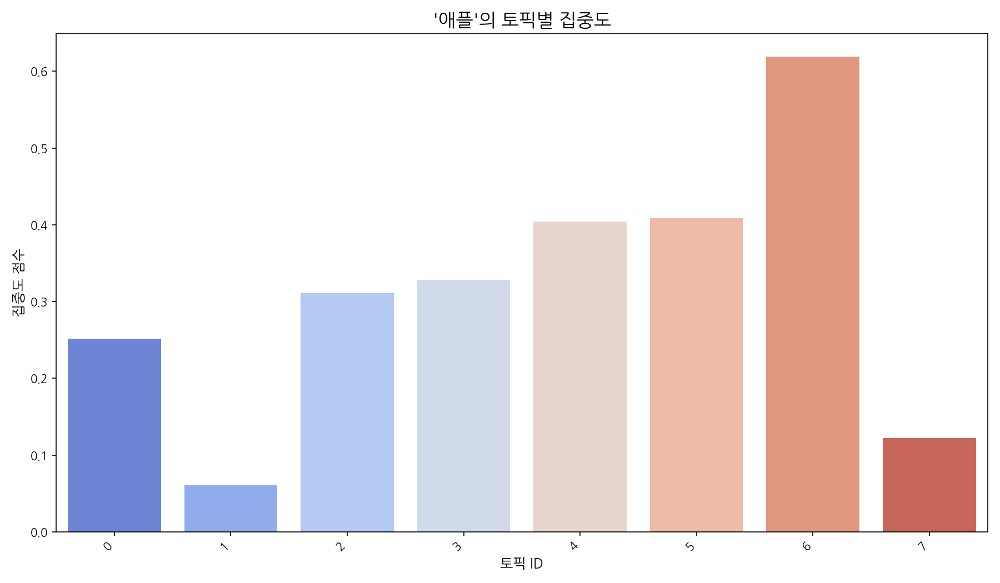
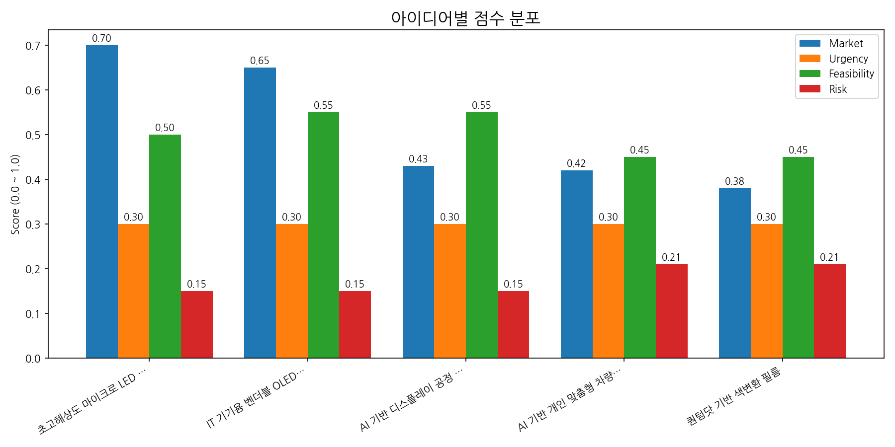

# Weekly/New Biz Report (2025-10-04)

## Executive Summary

- 이번 기간 핵심 토픽과 키워드, 주요 시사점을 요약합니다.

## 데일리 인텔리전스 브리핑

**1. 핵심 맥락:**

*   **OLED 기술 경쟁 심화 및 시장 확대:** '디스플레이', 'OLED', '마이크로 LED' 키워드를 중심으로, 차세대 디스플레이 기술 경쟁이 격화되고 있으며, 특히 '게이밍' 시장을 중심으로 고성능 디스플레이 수요가 증가하고 있습니다. 동시에 '중국' 시장에서의 OLED 패널 생산 및 투자가 활발하게 이루어지면서, 시장 경쟁 구도가 더욱 복잡해지고 있습니다.
*   **AI 기술 융합 및 디스플레이 산업 혁신:** 'AI', '디스플레이', '반도체' 키워드를 통해, AI 기술이 디스플레이 산업 전반에 걸쳐 융합되고 있음을 알 수 있습니다. 특히 'TV' 시장에서 AI 기반 화질 개선 및 사용자 경험 향상에 대한 관심이 높으며, '자동차' 분야에서도 AI 반도체를 활용한 디스플레이 기술 개발이 활발하게 진행되고 있습니다.
*   **폴더블 디스플레이 경쟁 본격화:** '애플', '아이폰', '폴더블' 키워드를 통해, 애플의 폴더블 디바이스 출시 가능성이 높아짐에 따라 폴더블 디스플레이 시장 경쟁이 본격화될 것으로 예상됩니다. 특히 '아이폰17' 관련 정보와 함께 '카메라' 기술에 대한 관심이 높은 것으로 보아, 폴더블 디바이스의 카메라 성능이 중요한 경쟁 요소가 될 것으로 판단됩니다.

**2. 최근 변화/스파이크:**

*   **2025년 9월 30일 및 10월 1일 기사 수 급증:** 9월 30일과 10월 1일에 기사 수가 급격히 증가한 것은 추석 '연휴'와 관련된 '패널' 수요 예측, '3분기' 실적 발표, 그리고 '애플'의 신제품 출시 임박 등의 요인이 복합적으로 작용한 결과로 추론됩니다. 특히, 연휴 기간 동안의 소비 심리 변화와 함께, 디스플레이 산업 전반의 실적 및 전망에 대한 관심이 집중된 것으로 보입니다.

**3. 실무 인사이트:**

*   **사업 개발:**
    *   **고성능 게이밍 디스플레이 시장 공략:** OLED 및 마이크로 LED 기술을 활용한 고주사율, 저지연 시간의 게이밍 디스플레이 개발 및 관련 시장 진출 전략을 수립합니다.
    *   **AI 기반 디스플레이 솔루션 확대:** AI 화질 개선, 맞춤형 콘텐츠 추천 등 AI 기술을 활용한 디스플레이 솔루션을 개발하고, TV, 자동차 등 다양한 분야에 적용할 수 있도록 사업 포트폴리오를 확장합니다.
*   **기술 기획:**
    *   **폴더블 디스플레이 기술 경쟁력 강화:** 폴더블 디스플레이의 내구성, 화면 주름 개선, 초박형 베젤 기술 등 핵심 기술 개발에 집중 투자하고, 폴더블 디바이스 시장 경쟁에 대비합니다.
    *   **차세대 디스플레이 기술 선점:** 마이크로 LED, QD-OLED 등 차세대 디스플레이 기술 개발 로드맵을 구체화하고, 관련 특허 확보 및 기술 표준화에 적극 참여합니다.

## Key Metrics

- 기간: 2025-09-08 ~ 2025-10-04
- 총 기사 수: 2,480
- 문서 수: N/A
- 키워드 수(상위): 15
- 토픽 수: 8
- 시계열 데이터 일자 수: 27

## Top Keywords

| Rank | Keyword | Score |
|---:|---|---:|
| 1 | 애플 | 0.889 |
| 2 | 삼성 | 0.639 |
| 3 | 패널 | 0.611 |
| 4 | 반도체 | 0.582 |
| 5 | 폴더블 | 0.467 |
| 6 | 아이 | 0.429 |
| 7 | 디스플레이 | 0.407 |
| 8 | 장비 | 0.397 |
| 9 | 중국 | 0.391 |
| 10 | 생산 | 0.278 |
| 11 | 게이밍 | 0.272 |
| 12 | 이상 | 0.269 |
| 13 | 시스템 | 0.268 |
| 14 | 쿠페 | 0.260 |
| 15 | 유출 | 0.255 |

## Topics

- 기술, 추석, 유출 (#0)
  - 대표 단어: 기술, 추석, 유출, 반도체, sns, 기술을
- 4o, 2o, 피부 (#1)
  - 대표 단어: 4o, 2o, 피부, pin shot, pin, shot
- led, 마이크로, oled (#2)
  - 대표 단어: led, 마이크로, oled, 디스플레이, 게이밍, 일본
- 연휴, 추석, 패널 (#3)
  - 대표 단어: 연휴, 추석, 패널, kt, 가장, 한국
- 디스플레이, ai, 3분기 (#4)
  - 대표 단어: 디스플레이, ai, 3분기, tv, 장비, 실적
- oled, 디스플레이, 중국 (#5)
  - 대표 단어: oled, 디스플레이, 중국, 패널, 6세대, 장비
- 애플, 아이폰, 아이폰17 (#6)
  - 대표 단어: 애플, 아이폰, 아이폰17, 프로, 카메라, 폴더블
- 반도체, ai, 자동차 (#7)
  - 대표 단어: 반도체, ai, 자동차, 사업을, 시스템, 기술을

## 기업×토픽 집중도 매트릭스 (주간)

**핵심 요약:**

- **가장 경쟁이 치열한 토픽:** **led, 마이크로** (가장 많은 기업들이 주목)

- **가장 집중도가 높은 기업:** **삼성전자** (다양한 토픽에 걸쳐 높은 관련성)

- **주목할 만한 조합:** **삼성전자 @ topic_4** (가장 높은 단일 연관 점수 기록)

각 기업별 상위 8개 토픽의 연관 점수와 해당 토픽 내에서의 점유율(%)을 나타냅니다.

| org      | topic_0     | topic_1     | topic_2     | topic_3     | topic_4      | topic_5      | topic_6     | topic_7     |
|:---------|:------------|:------------|:------------|:------------|:-------------|:-------------|:------------|:------------|
| AMD      | 2.97 (1%)   | nan         | 2.08 (0%)   | 2.33 (1%)   | 4.33 (1%)    | 2.89 (0%)    | 2.97 (1%)   | 2.17 (0%)   |
| ASUS     | 0.74 (0%)   | 1.03 (1%)   | 5.55 (1%)   | 3.11 (1%)   | 1.44 (0%)    | 2.89 (0%)    | 1.49 (0%)   | 0.72 (0%)   |
| BMW      | nan         | 1.03 (1%)   | 0.69 (0%)   | 1.55 (0%)   | 0.72 (0%)    | 2.17 (0%)    | 2.97 (1%)   | 2.17 (0%)   |
| BOE      | 14.86 (3%)  | 3.09 (3%)   | 15.25 (3%)  | 13.20 (3%)  | 27.44 (4%)   | 31.77 (5%)   | 16.34 (4%)  | 4.33 (1%)   |
| BYD      | nan         | 2.06 (2%)   | 0.69 (0%)   | 0.78 (0%)   | 0.72 (0%)    | 0.72 (0%)    | 4.46 (1%)   | 2.89 (1%)   |
| CES      | 4.46 (1%)   | 1.03 (1%)   | 2.08 (0%)   | nan         | 2.17 (0%)    | 2.17 (0%)    | nan         | 1.44 (0%)   |
| CSOT     | 8.91 (2%)   | nan         | 9.70 (2%)   | 6.21 (2%)   | 14.44 (2%)   | 20.94 (3%)   | 2.97 (1%)   | 2.89 (1%)   |
| HP       | 3.71 (1%)   | nan         | 4.85 (1%)   | 3.11 (1%)   | 1.44 (0%)    | 2.89 (0%)    | 2.23 (1%)   | 1.44 (0%)   |
| Harman   | nan         | 1.03 (1%)   | 2.08 (0%)   | 1.55 (0%)   | 1.44 (0%)    | 0.72 (0%)    | 2.97 (1%)   | 0.72 (0%)   |
| IoT      | 2.23 (0%)   | 1.03 (1%)   | 3.47 (1%)   | 3.11 (1%)   | 5.05 (1%)    | 3.61 (1%)    | 4.46 (1%)   | 7.22 (2%)   |
| LG디스플레이  | 39.37 (7%)  | 9.27 (10%)  | 33.27 (7%)  | 28.73 (7%)  | 60.66 (9%)   | 52.72 (8%)   | 19.32 (4%)  | 13.00 (3%)  |
| LG전자     | 31.95 (6%)  | 5.15 (6%)   | 24.26 (5%)  | 46.59 (11%) | 46.22 (7%)   | 39.00 (6%)   | 19.32 (4%)  | 26.72 (6%)  |
| LG화학     | 9.66 (2%)   | 2.06 (2%)   | 9.01 (2%)   | 9.32 (2%)   | 10.11 (1%)   | 7.94 (1%)    | 2.97 (1%)   | 11.55 (3%)  |
| SID      | 4.46 (1%)   | 1.03 (1%)   | 2.08 (0%)   | nan         | 2.17 (0%)    | 2.17 (0%)    | nan         | 1.44 (0%)   |
| SK하이닉스   | 29.72 (6%)  | 3.09 (3%)   | 18.71 (4%)  | 15.53 (4%)  | 26.72 (4%)   | 22.39 (3%)   | 13.37 (3%)  | 40.44 (9%)  |
| TCL      | 2.97 (1%)   | nan         | 4.16 (1%)   | 3.11 (1%)   | 7.22 (1%)    | 6.50 (1%)    | 1.49 (0%)   | 2.17 (0%)   |
| Tianma   | 3.71 (1%)   | nan         | 3.47 (1%)   | 1.55 (0%)   | 5.78 (1%)    | 7.94 (1%)    | 1.49 (0%)   | 2.17 (0%)   |
| V2X      | 2.23 (0%)   | nan         | 1.39 (0%)   | 1.55 (0%)   | 3.61 (1%)    | 2.89 (0%)    | 1.49 (0%)   | 6.50 (1%)   |
| Visionox | 8.91 (2%)   | nan         | 9.01 (2%)   | 5.44 (1%)   | 14.44 (2%)   | 20.22 (3%)   | 4.46 (1%)   | 5.05 (1%)   |
| 구글       | 14.12 (3%)  | 3.09 (3%)   | 13.86 (3%)  | 9.32 (2%)   | 18.05 (3%)   | 13.72 (2%)   | 23.03 (5%)  | 20.94 (5%)  |
| 기아       | 19.32 (4%)  | 2.06 (2%)   | 18.02 (4%)  | 11.65 (3%)  | 15.16 (2%)   | 17.33 (3%)   | 10.40 (2%)  | 30.33 (7%)  |
| 기아차      | nan         | nan         | 0.69 (0%)   | 1.55 (0%)   | nan          | 0.72 (0%)    | 0.74 (0%)   | 0.72 (0%)   |
| 네이버      | 6.69 (1%)   | 2.06 (2%)   | 9.01 (2%)   | 2.33 (1%)   | 10.83 (2%)   | 9.39 (1%)    | 8.17 (2%)   | 17.33 (4%)  |
| 디지타임스    | 1.49 (0%)   | nan         | 2.08 (0%)   | 2.33 (1%)   | 2.17 (0%)    | 4.33 (1%)    | 3.71 (1%)   | nan         |
| 마이크로소프트  | 1.49 (0%)   | nan         | 4.85 (1%)   | 1.55 (0%)   | nan          | nan          | 2.97 (1%)   | 1.44 (0%)   |
| 메타       | nan         | nan         | 0.69 (0%)   | nan         | 0.72 (0%)    | nan          | 2.97 (1%)   | 0.72 (0%)   |
| 미디어텍     | 2.23 (0%)   | 1.03 (1%)   | 3.47 (1%)   | 3.11 (1%)   | 5.05 (1%)    | 3.61 (1%)    | 4.46 (1%)   | 7.22 (2%)   |
| 벤츠       | 1.49 (0%)   | 3.09 (3%)   | 2.77 (1%)   | 3.11 (1%)   | 2.17 (0%)    | 3.61 (1%)    | 2.97 (1%)   | 2.89 (1%)   |
| 비보       | 3.71 (1%)   | nan         | 3.47 (1%)   | 9.32 (2%)   | 7.94 (1%)    | 7.94 (1%)    | 9.66 (2%)   | nan         |
| 삼성디스플레이  | 71.32 (13%) | 6.18 (7%)   | 42.98 (9%)  | 31.06 (8%)  | 62.83 (9%)   | 64.27 (10%)  | 24.52 (6%)  | 23.83 (5%)  |
| 삼성전자     | 99.55 (18%) | 14.41 (16%) | 72.09 (15%) | 54.36 (13%) | 126.37 (18%) | 101.82 (16%) | 55.72 (13%) | 77.99 (17%) |
| 샤오미      | 5.20 (1%)   | 2.06 (2%)   | 8.32 (2%)   | 10.87 (3%)  | 10.83 (2%)   | 10.83 (2%)   | 14.12 (3%)  | 0.72 (0%)   |
| 선익시스템    | 4.46 (1%)   | nan         | 4.16 (1%)   | 3.11 (1%)   | 7.22 (1%)    | 10.11 (2%)   | 0.74 (0%)   | 0.72 (0%)   |
| 소니       | 1.49 (0%)   | nan         | 3.47 (1%)   | 0.78 (0%)   | nan          | nan          | 1.49 (0%)   | 2.17 (0%)   |
| 아마존      | 2.97 (1%)   | 1.03 (1%)   | 3.47 (1%)   | 3.88 (1%)   | 5.05 (1%)    | 2.89 (0%)    | 5.94 (1%)   | 2.89 (1%)   |
| 아이씨디     | 4.46 (1%)   | nan         | 4.16 (1%)   | 1.55 (0%)   | 7.22 (1%)    | 8.67 (1%)    | 0.74 (0%)   | 2.17 (0%)   |
| 애플       | 38.63 (7%)  | 9.27 (10%)  | 47.83 (10%) | 50.47 (12%) | 62.10 (9%)   | 62.83 (10%)  | 95.09 (22%) | 18.78 (4%)  |
| 엔비디아     | 8.17 (2%)   | 1.03 (1%)   | 2.08 (0%)   | 6.21 (2%)   | 7.94 (1%)    | 5.05 (1%)    | 3.71 (1%)   | 3.61 (1%)   |
| 오포       | 2.23 (0%)   | nan         | 2.08 (0%)   | 5.44 (1%)   | 5.78 (1%)    | 5.05 (1%)    | 4.46 (1%)   | nan         |
| 원익IPS    | 0.74 (0%)   | nan         | 0.69 (0%)   | nan         | 2.17 (0%)    | 2.17 (0%)    | nan         | 0.72 (0%)   |
| 인텔       | 5.20 (1%)   | 2.06 (2%)   | 2.77 (1%)   | 3.88 (1%)   | 6.50 (1%)    | 4.33 (1%)    | 3.71 (1%)   | 5.05 (1%)   |
| 카카오      | 5.94 (1%)   | nan         | 5.55 (1%)   | nan         | 6.50 (1%)    | 7.22 (1%)    | 3.71 (1%)   | 13.00 (3%)  |
| 퀄컴       | 8.17 (2%)   | 4.12 (5%)   | 8.32 (2%)   | 3.88 (1%)   | 15.16 (2%)   | 9.39 (1%)    | 8.91 (2%)   | 11.55 (3%)  |
| 폭스바겐     | 1.49 (0%)   | nan         | 1.39 (0%)   | 1.55 (0%)   | 2.89 (0%)    | 0.72 (0%)    | 2.23 (1%)   | 2.17 (0%)   |
| 하이센스     | 1.49 (0%)   | nan         | 2.77 (1%)   | 1.55 (0%)   | 2.89 (0%)    | 3.61 (1%)    | nan         | 0.72 (0%)   |
| 한미반도체    | 2.23 (0%)   | nan         | 1.39 (0%)   | 1.55 (0%)   | 3.61 (1%)    | 2.89 (0%)    | 1.49 (0%)   | 6.50 (1%)   |
| 한화       | 6.69 (1%)   | nan         | 5.55 (1%)   | 10.09 (2%)  | 2.89 (0%)    | 4.33 (1%)    | 5.94 (1%)   | 1.44 (0%)   |
| 한화솔루션    | 2.97 (1%)   | 1.03 (1%)   | 3.47 (1%)   | nan         | 3.61 (1%)    | 3.61 (1%)    | nan         | 5.78 (1%)   |
| 한화시스템    | 2.97 (1%)   | nan         | 2.77 (1%)   | nan         | 3.61 (1%)    | 3.61 (1%)    | 1.49 (0%)   | 6.50 (1%)   |
| 현대모비스    | 11.89 (2%)  | nan         | 9.70 (2%)   | 6.21 (2%)   | 10.83 (2%)   | 10.83 (2%)   | 5.20 (1%)   | 21.66 (5%)  |
| 현대자동차    | 2.97 (1%)   | 1.03 (1%)   | 4.16 (1%)   | nan         | 6.50 (1%)    | 3.61 (1%)    | 1.49 (0%)   | 8.67 (2%)   |
| 현대차      | 20.28 (4%)  | 2.16 (2%)   | 20.38 (4%)  | 14.68 (3%)  | 15.16 (2%)   | 18.20 (3%)   | 10.14 (2%)  | 25.02 (5%)  |
| 화웨이      | 8.17 (2%)   | 3.09 (3%)   | 4.85 (1%)   | 3.88 (1%)   | 8.67 (1%)    | 7.94 (1%)    | 5.94 (1%)   | 4.33 (1%)   |

**코멘트 및 액션 힌트:**

> 특정 토픽에서 높은 점유율을 보이는 기업은 해당 분야의 '주도자(Leader)'일 가능성이 높습니다. 반면, 특정 기업이 소수의 토픽에 높은 점수를 집중하고 있다면, 이는 해당 기업의 '핵심 전략 분야'를 시사합니다. 경쟁사 및 파트너사의 집중 분야를 파악하여 우리의 전략을 점검해볼 수 있습니다.

## 기업×토픽 시각적 분석

### 전체 시장 구도 (Heatmap)

> 전체 기업과 토픽 간의 관계를 한눈에 보여줍니다. 색이 진할수록 연관성이 높습니다.

### 주요 토픽별 경쟁 구도 (Pie Charts)

> 가장 뜨거운 주제를 두고 어떤 기업들이 경쟁하는지 점유율을 보여줍니다.

### 주요 기업별 전략 분석 (Bar Charts)

> 시장을 주도하는 주요 기업들이 어떤 토픽에 집중하고 있는지 보여줍니다.

## Trend

- 최근 기사 수 추세와 7일 이동평균선을 제공합니다.

## Insights

## 데일리 인텔리전스 브리핑

**1. 핵심 맥락:**

*   **OLED 기술 경쟁 심화 및 시장 확대:** '디스플레이', 'OLED', '마이크로 LED' 키워드를 중심으로, 차세대 디스플레이 기술 경쟁이 격화되고 있으며, 특히 '게이밍' 시장을 중심으로 고성능 디스플레이 수요가 증가하고 있습니다. 동시에 '중국' 시장에서의 OLED 패널 생산 및 투자가 활발하게 이루어지면서, 시장 경쟁 구도가 더욱 복잡해지고 있습니다.
*   **AI 기술 융합 및 디스플레이 산업 혁신:** 'AI', '디스플레이', '반도체' 키워드를 통해, AI 기술이 디스플레이 산업 전반에 걸쳐 융합되고 있음을 알 수 있습니다. 특히 'TV' 시장에서 AI 기반 화질 개선 및 사용자 경험 향상에 대한 관심이 높으며, '자동차' 분야에서도 AI 반도체를 활용한 디스플레이 기술 개발이 활발하게 진행되고 있습니다.
*   **폴더블 디스플레이 경쟁 본격화:** '애플', '아이폰', '폴더블' 키워드를 통해, 애플의 폴더블 디바이스 출시 가능성이 높아짐에 따라 폴더블 디스플레이 시장 경쟁이 본격화될 것으로 예상됩니다. 특히 '아이폰17' 관련 정보와 함께 '카메라' 기술에 대한 관심이 높은 것으로 보아, 폴더블 디바이스의 카메라 성능이 중요한 경쟁 요소가 될 것으로 판단됩니다.

**2. 최근 변화/스파이크:**

*   **2025년 9월 30일 및 10월 1일 기사 수 급증:** 9월 30일과 10월 1일에 기사 수가 급격히 증가한 것은 추석 '연휴'와 관련된 '패널' 수요 예측, '3분기' 실적 발표, 그리고 '애플'의 신제품 출시 임박 등의 요인이 복합적으로 작용한 결과로 추론됩니다. 특히, 연휴 기간 동안의 소비 심리 변화와 함께, 디스플레이 산업 전반의 실적 및 전망에 대한 관심이 집중된 것으로 보입니다.

**3. 실무 인사이트:**

*   **사업 개발:**
    *   **고성능 게이밍 디스플레이 시장 공략:** OLED 및 마이크로 LED 기술을 활용한 고주사율, 저지연 시간의 게이밍 디스플레이 개발 및 관련 시장 진출 전략을 수립합니다.
    *   **AI 기반 디스플레이 솔루션 확대:** AI 화질 개선, 맞춤형 콘텐츠 추천 등 AI 기술을 활용한 디스플레이 솔루션을 개발하고, TV, 자동차 등 다양한 분야에 적용할 수 있도록 사업 포트폴리오를 확장합니다.
*   **기술 기획:**
    *   **폴더블 디스플레이 기술 경쟁력 강화:** 폴더블 디스플레이의 내구성, 화면 주름 개선, 초박형 베젤 기술 등 핵심 기술 개발에 집중 투자하고, 폴더블 디바이스 시장 경쟁에 대비합니다.
    *   **차세대 디스플레이 기술 선점:** 마이크로 LED, QD-OLED 등 차세대 디스플레이 기술 개발 로드맵을 구체화하고, 관련 특허 확보 및 기술 표준화에 적극 참여합니다.

## Opportunities (Top 5)

| Idea | Target | Value Prop | Score (Market / Urgency / Feasibility / Risk) |
|---|---|---|---|
| 초고해상도 마이크로 LED 기반 AR/VR 글래스용 디스플레이 모듈 | 북미 빅테크 기업 (AR/VR 디바이스 제조사), 메타버스 플랫폼 기업 | 현존 최고 수준의 해상도와 밝기를 제공하는 마이크로 LED 디스플레이 모듈. 초소형, 경량화 디자인으로 AR/VR 글래스의 착용감 향상. 저전력 설계로 배터리 사용 시간 극대화. | 4.3 (0.7 / 0.3 / 0.5 / 0.15) |
| IT 기기용 벤더블 OLED 패널 솔루션 | 글로벌 스마트폰 제조사, 태블릿 PC 제조사 | 최고 수준의 내구성과 유연성을 제공하는 벤더블 OLED 패널. 얇고 가벼운 디자인으로 휴대성 극대화. 다양한 폼팩터 디자인 적용 가능. | 4.3 (0.65 / 0.3 / 0.55 / 0.15) |
| AI 기반 디스플레이 공정 자동화 및 수율 개선 솔루션 | 국내외 디스플레이 제조사 | AI 기반 실시간 공정 데이터 분석 및 예측을 통해 수율 극대화. 자동화된 공정 제어 시스템으로 생산 효율성 향상. 불량 예측 및 원인 분석을 통한 품질 개선. | 3.5 (0.43 / 0.3 / 0.55 / 0.15) |
| AI 기반 개인 맞춤형 차량용 HUD 솔루션 | 글로벌 완성차 OEM, 프리미엄 자동차 브랜드 | AI 기반 운전자 맞춤형 정보 제공으로 운전 집중도 향상 및 안전 운전 지원. 실시간 도로 상황 분석 및 예측을 통해 최적의 주행 경로 및 경고 제공. AR/VR 기술 융합으로 몰입감 있는 정보 제공. | 3.0 (0.42 / 0.3 / 0.45 / 0.21) |
| 퀀텀닷 기반 색변환 필름 | 글로벌 TV 제조사, 모니터 제조사 | 높은 색재현율과 에너지 효율을 제공하는 퀀텀닷 기반 색변환 필름. 균일한 코팅 기술로 뛰어난 화질 구현. 내구성 강화로 제품 수명 연장. | 2.9 (0.38 / 0.3 / 0.45 / 0.21) |

### 📊 아이디어 점수 분포

## Appendix

- 데이터: keywords.json, topics.json, trend_timeseries.json, trend_insights.json, biz_opportunities.json