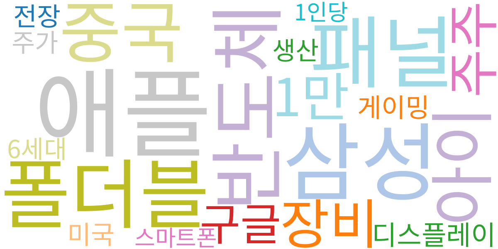
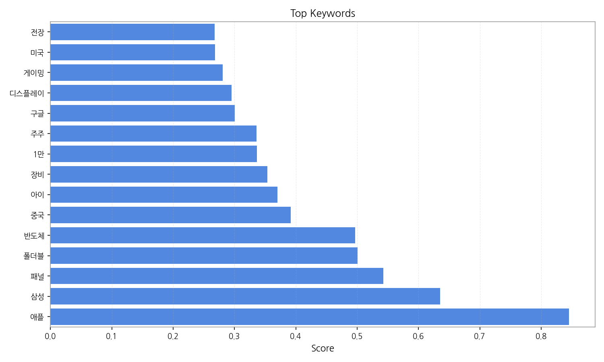
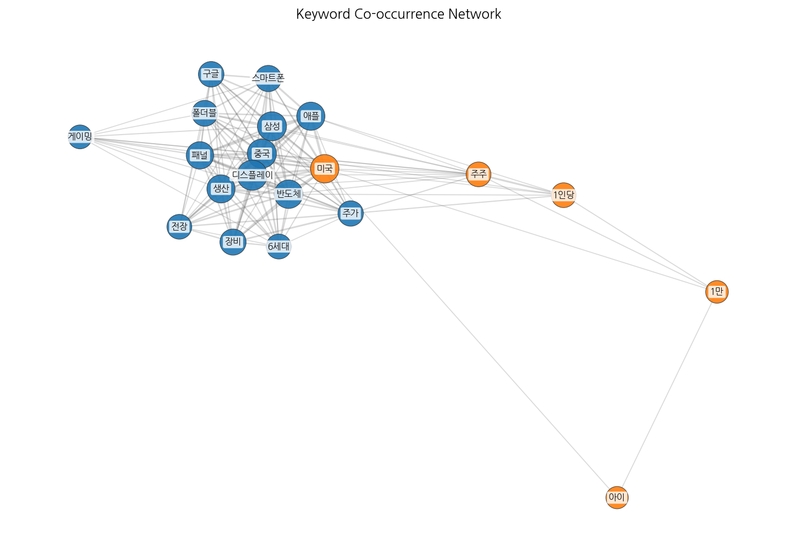
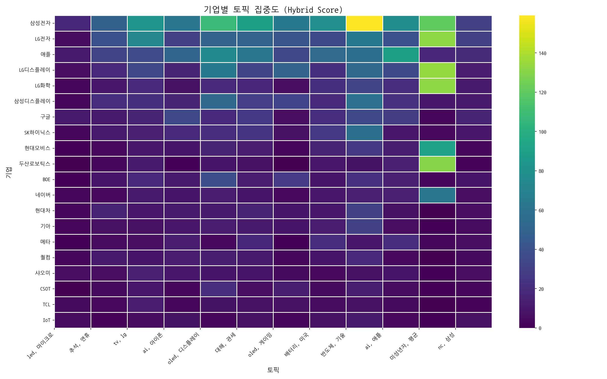
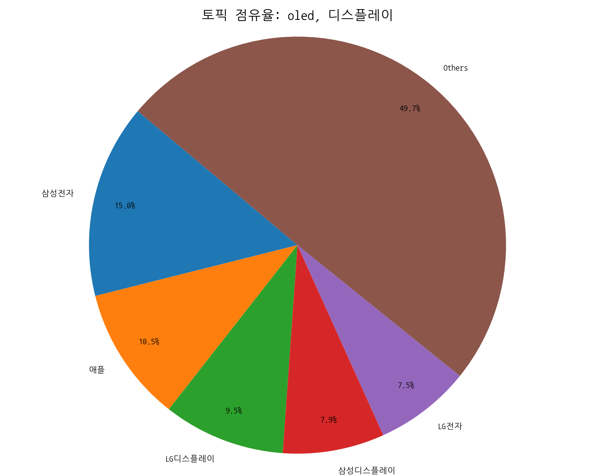
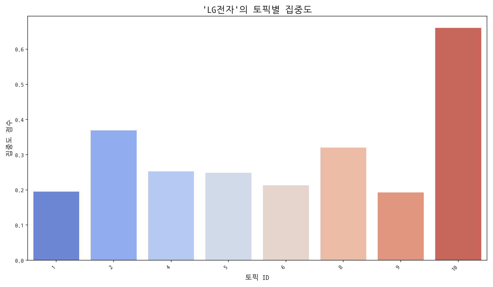
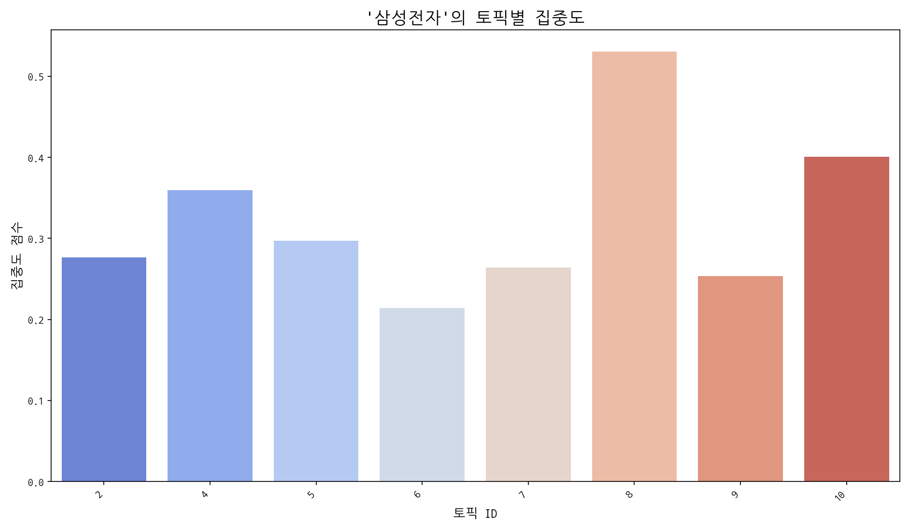
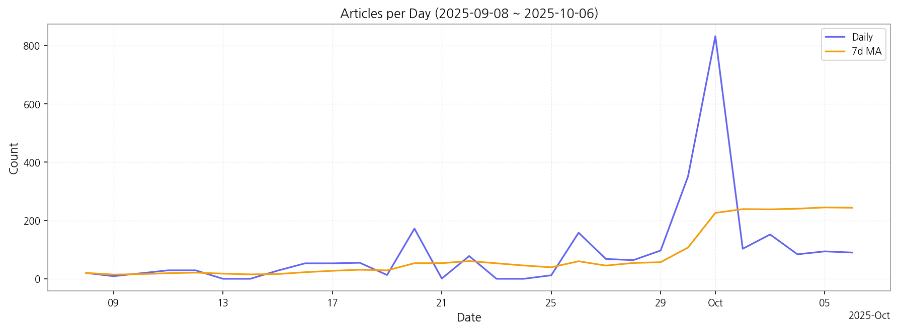

# Weekly/New Biz Report (2025-10-06)

## Executive Summary

- 이번 기간 핵심 토픽과 키워드, 주요 시사점을 요약합니다.

## 데일리 인텔리전스 브리핑

**1. 핵심 맥락:**

*   **OLED 기술 경쟁 심화 및 응용 분야 확대:** OLED 관련 토픽(4, 6)에서 디스플레이, 패널, 폴더블, 게이밍, TV 등의 키워드가 상위권을 차지하며, OLED 기술이 프리미엄 TV 시장뿐 아니라 게이밍 모니터, 폴더블 스마트폰 등 다양한 응용 분야로 확장되고 있음을 시사합니다. 특히 중국 시장에서의 경쟁 심화와 함께 QD-OLED와 같은 차세대 기술 개발 경쟁이 치열하게 전개되고 있습니다.
*   **AI 기술의 디스플레이 산업 접목 가속화:** AI 관련 토픽(3, 9)과 배터리/반도체 토픽(7, 8)에서 AI가 공통적으로 등장하며, AI 기술이 디스플레이 화질 개선, 전력 효율 향상, 생산 공정 최적화 등 다양한 영역에서 활용되고 있음을 보여줍니다. 특히 애플, 삼성 등 주요 기업들이 AI 기술을 자사 제품에 적극적으로 도입하면서 경쟁 우위를 확보하려는 움직임이 두드러집니다.

**2. 최근 변화/스파이크:**

*   **2025년 9월 30일 및 10월 1일 기사 수 급증:** 9월 30일과 10월 1일에 기사 수가 급증한 것은 추석 연휴(토픽 1) 이후 디스플레이 산업 전반에 걸쳐 새로운 기술 발표, 투자 계획 발표, 시장 전망 관련 보도가 집중되었기 때문으로 추정됩니다. 특히 OLED, AI, 반도체 관련 키워드가 동시에 부상한 것으로 보아, 이 시기에 차세대 디스플레이 기술과 AI 융합 관련 소식이 집중적으로 발표되었을 가능성이 높습니다.

**3. 실무 인사이트:**

*   **사업 개발:**
    *   **폴더블 및 롤러블 디스플레이 시장 선점:** 폴더블 스마트폰 시장의 성장과 함께 폴더블 및 롤러블 디스플레이 기술 개발 및 상용화에 집중하고, 관련 특허 확보 및 기술 표준화에 적극적으로 참여해야 합니다.
    *   **AI 기반 디스플레이 솔루션 개발:** AI 기반 화질 개선, 전력 효율 향상, 사용자 맞춤형 디스플레이 솔루션 개발에 투자하고, AI 반도체 기업과의 협력을 통해 경쟁 우위를 확보해야 합니다.
*   **기술 기획:**
    *   **QD-OLED 및 Micro LED 기술 경쟁력 강화:** QD-OLED, Micro LED 등 차세대 디스플레이 기술 개발에 집중하고, 생산 비용 절감 및 수율 향상을 위한 기술 혁신을 추진해야 합니다. 특히 Micro LED의 경우, 피부 관련 키워드와 함께 등장하는 것으로 보아, 뷰티/헬스케어 분야로의 응용 가능성을 고려하여 기술 개발 방향을 설정해야 합니다.

## Key Metrics

- 기간: 2025-09-08 ~ 2025-10-06
- 총 기사 수: 2,664
- 문서 수: N/A
- 키워드 수(상위): 15
- 토픽 수: 12
- 시계열 데이터 일자 수: 29

## Top Keywords

| Rank | Keyword | Score |
|---:|---|---:|
| 1 | 애플 | 0.845 |
| 2 | 삼성 | 0.636 |
| 3 | 패널 | 0.543 |
| 4 | 폴더블 | 0.501 |
| 5 | 반도체 | 0.497 |
| 6 | 중국 | 0.392 |
| 7 | 아이 | 0.370 |
| 8 | 장비 | 0.354 |
| 9 | 1만 | 0.337 |
| 10 | 주주 | 0.336 |
| 11 | 구글 | 0.301 |
| 12 | 디스플레이 | 0.295 |
| 13 | 게이밍 | 0.281 |
| 14 | 미국 | 0.268 |
| 15 | 전장 | 0.268 |

## Topics

- led, 마이크로, 피부 (#0)
  - 대표 단어: led, 마이크로, 피부, 마이크로 led, micro, shot
- 추석, 연휴, 추석 연휴 (#1)
  - 대표 단어: 추석, 연휴, 추석 연휴, 다른, 명절, 기간
- tv, lg, 중국 (#2)
  - 대표 단어: tv, lg, 중국, 삼성전자는, 주행, 실내
- ai, 아이폰, 카메라 (#3)
  - 대표 단어: ai, 아이폰, 카메라, 갤럭시, 삼성, 로봇
- oled, 디스플레이, 중국 (#4)
  - 대표 단어: oled, 디스플레이, 중국, 패널, 폴더블, 장비
- 대해, 관세, 제품을 (#5)
  - 대표 단어: 대해, 관세, 제품을, 이달, 인증, ai
- oled, 게이밍, tv (#6)
  - 대표 단어: oled, 게이밍, tv, 대형, 게임, 패널
- 배터리, 미국, 반도체 (#7)
  - 대표 단어: 배터리, 미국, 반도체, 마감했다, ai, 나스닥
- 반도체, 기술, 장비 (#8)
  - 대표 단어: 반도체, 기술, 장비, 디스플레이, 기술을, 핵심
- ai, 애플, 아이폰 (#9)
  - 대표 단어: ai, 애플, 아이폰, 가장, 것이다, 애플은
- 미성년자, 평균, 주주 (#10)
  - 대표 단어: 미성년자, 평균, 주주, 20세, 상장사, 1인당
- nc, 삼성, 와일드카드 (#11)
  - 대표 단어: nc, 삼성, 와일드카드, 기업, 한국, 기록했다

## 기업×토픽 집중도 매트릭스 (주간)

**핵심 요약:**

- **가장 경쟁이 치열한 토픽:** **대해, 관세** (가장 많은 기업들이 주목)

- **가장 집중도가 높은 기업:** **삼성전자** (다양한 토픽에 걸쳐 높은 관련성)

- **주목할 만한 조합:** **삼성전자 @ topic_8** (가장 높은 단일 연관 점수 기록)

각 기업별 상위 8개 토픽의 연관 점수와 해당 토픽 내에서의 점유율(%)을 나타냅니다.

| org           | topic_0   | topic_1     | topic_10     | topic_11   | topic_2     | topic_3     | topic_4      | topic_5     | topic_6     | topic_7     | topic_8      | topic_9     |
|:--------------|:----------|:------------|:-------------|:-----------|:------------|:------------|:-------------|:------------|:------------|:------------|:-------------|:------------|
| AMD           | nan       | 0.83 (0%)   | 1.11 (0%)    | 2.25 (1%)  | nan         | nan         | 2.13 (0%)    | 5.69 (1%)   | nan         | 13.01 (3%)  | 2.13 (0%)    | 3.51 (1%)   |
| ASUS          | nan       | nan         | nan          | nan        | 1.46 (0%)   | 2.05 (1%)   | 3.56 (1%)    | 2.13 (0%)   | 8.18 (2%)   | 1.37 (0%)   | 1.42 (0%)    | 1.40 (0%)   |
| BOE           | nan       | 8.31 (3%)   | nan          | nan        | 18.25 (4%)  | 11.64 (3%)  | 38.40 (6%)   | 12.09 (2%)  | 27.82 (7%)  | nan         | 22.76 (3%)   | 14.74 (3%)  |
| BYD           | 1.86 (2%) | nan         | nan          | nan        | 3.65 (1%)   | 0.68 (0%)   | 0.71 (0%)    | nan         | nan         | 2.05 (0%)   | 1.42 (0%)    | 2.11 (0%)   |
| CES           | nan       | 0.83 (0%)   | nan          | 1.50 (1%)  | 0.73 (0%)   | 0.68 (0%)   | 0.71 (0%)    | 2.13 (0%)   | nan         | 1.37 (0%)   | nan          | 0.70 (0%)   |
| CSOT          | nan       | 4.15 (1%)   | nan          | nan        | 9.49 (2%)   | nan         | 21.33 (3%)   | 5.69 (1%)   | 13.09 (3%)  | 4.11 (1%)   | 13.51 (2%)   | 4.91 (1%)   |
| HMI           | nan       | 0.83 (0%)   | nan          | 1.50 (1%)  | nan         | 2.74 (1%)   | nan          | 0.71 (0%)   | nan         | 0.68 (0%)   | 1.42 (0%)    | 0.70 (0%)   |
| HP            | nan       | 1.66 (1%)   | 3.33 (0%)    | 1.50 (1%)  | nan         | nan         | 4.27 (1%)    | 5.69 (1%)   | 4.09 (1%)   | 2.74 (1%)   | 4.27 (0%)    | nan         |
| Harman        | 2.80 (3%) | nan         | 1.11 (0%)    | 3.00 (1%)  | 2.19 (0%)   | 2.74 (1%)   | nan          | 2.13 (0%)   | 1.64 (0%)   | nan         | nan          | 2.11 (0%)   |
| IoT           | 4.66 (4%) | nan         | nan          | 6.75 (3%)  | 4.38 (1%)   | 7.53 (2%)   | nan          | 7.11 (1%)   | nan         | 6.84 (1%)   | 10.67 (1%)   | 3.51 (1%)   |
| JDI           | nan       | 0.83 (0%)   | 1.11 (0%)    | nan        | 0.73 (0%)   | 1.37 (0%)   | 2.13 (0%)    | 0.71 (0%)   | 1.64 (0%)   | nan         | 2.13 (0%)    | nan         |
| LG디스플레이       | nan       | nan         | 133.25 (16%) | nan        | 34.32 (7%)  | nan         | 64.00 (9%)   | 32.00 (6%)  | 50.74 (13%) | 21.90 (4%)  | 53.34 (6%)   | 35.80 (7%)  |
| LG전자          | nan       | 39.05 (13%) | 132.14 (16%) | nan        | 73.75 (15%) | nan         | 50.49 (7%)   | 49.78 (9%)  | 42.55 (11%) | nan         | 64.00 (7%)   | 38.61 (8%)  |
| LG화학          | nan       | nan         | 132.14 (16%) | 11.25 (4%) | 18.98 (4%)  | nan         | 19.20 (3%)   | 16.36 (3%)  | nan         | 21.90 (4%)  | 32.00 (4%)   | 21.06 (4%)  |
| SK하이닉스        | nan       | 10.80 (4%)  | nan          | nan        | 13.87 (3%)  | 19.17 (5%)  | 20.62 (3%)   | 24.18 (4%)  | nan         | 25.33 (5%)  | 57.60 (7%)   | 10.53 (2%)  |
| Semiconductor | 0.93 (1%) | nan         | nan          | nan        | nan         | 0.68 (0%)   | nan          | 0.71 (0%)   | nan         | 1.37 (0%)   | 1.42 (0%)    | 0.70 (0%)   |
| TCL           | 3.73 (3%) | nan         | nan          | nan        | 12.41 (3%)  | nan         | 7.82 (1%)    | 6.40 (1%)   | 6.55 (2%)   | 4.79 (1%)   | 6.40 (1%)    | 4.21 (1%)   |
| Tianma        | nan       | nan         | nan          | 0.75 (0%)  | 1.46 (0%)   | 2.05 (1%)   | 7.82 (1%)    | 0.71 (0%)   | 3.27 (1%)   | 2.05 (0%)   | 6.40 (1%)    | nan         |
| V2X           | nan       | 1.66 (1%)   | nan          | 2.25 (1%)  | 2.92 (1%)   | 2.74 (1%)   | 2.84 (0%)    | 4.27 (1%)   | nan         | 5.48 (1%)   | 9.96 (1%)    | nan         |
| Visionox      | nan       | nan         | nan          | 0.75 (0%)  | 2.92 (1%)   | 3.42 (1%)   | 16.36 (2%)   | 0.71 (0%)   | 6.55 (2%)   | 4.11 (1%)   | 14.93 (2%)   | nan         |
| 구글            | nan       | nan         | nan          | 15.74 (6%) | 16.08 (3%)  | 34.46 (8%)  | 18.65 (3%)   | 26.85 (5%)  | nan         | 20.82 (4%)  | 34.31 (4%)   | 27.98 (5%)  |
| 기아            | nan       | 6.65 (2%)   | nan          | nan        | 6.57 (1%)   | 9.58 (2%)   | 12.80 (2%)   | 11.38 (2%)  | 8.18 (2%)   | 12.32 (2%)  | 30.58 (4%)   | nan         |
| 네이버           | nan       | nan         | 62.19 (7%)   | nan        | 11.68 (2%)  | 8.90 (2%)   | 12.09 (2%)   | 9.25 (2%)   | nan         | 10.27 (2%)  | 14.22 (2%)   | 14.04 (3%)  |
| 두산로보틱스        | nan       | 2.49 (1%)   | 129.92 (15%) | nan        | 10.95 (2%)  | nan         | 8.53 (1%)    | 6.40 (1%)   | nan         | 9.58 (2%)   | 7.82 (1%)    | 14.74 (3%)  |
| 디지타임스         | nan       | nan         | nan          | 2.25 (1%)  | 1.46 (0%)   | 2.05 (1%)   | 4.98 (1%)    | 1.42 (0%)   | 1.64 (0%)   | nan         | 2.84 (0%)    | 2.11 (0%)   |
| 마이크로소프트       | 0.93 (1%) | nan         | nan          | 0.75 (0%)  | 1.46 (0%)   | 1.37 (0%)   | nan          | 3.56 (1%)   | nan         | 1.37 (0%)   | 3.56 (0%)    | 3.51 (1%)   |
| 메타            | nan       | 4.57 (1%)   | nan          | 5.77 (2%)  | 5.62 (1%)   | 12.03 (3%)  | nan          | 17.19 (3%)  | nan         | 21.06 (4%)  | 9.38 (1%)    | 20.06 (4%)  |
| 미디어텍          | 3.73 (3%) | nan         | nan          | 4.50 (2%)  | 2.92 (1%)   | 4.11 (1%)   | nan          | 4.98 (1%)   | nan         | 4.11 (1%)   | 6.40 (1%)    | 2.81 (1%)   |
| 비보            | nan       | 4.15 (1%)   | nan          | 2.25 (1%)  | 3.65 (1%)   | 4.11 (1%)   | 4.27 (1%)    | 1.42 (0%)   | 1.64 (0%)   | nan         | nan          | 4.21 (1%)   |
| 삼성디스플레이       | nan       | 20.77 (7%)  | nan          | nan        | 21.91 (4%)  | nan         | 53.34 (8%)   | 29.16 (5%)  | 31.10 (8%)  | 19.17 (4%)  | 59.03 (7%)   | 22.47 (5%)  |
| 삼성전자          | nan       | nan         | 120.02 (13%) | nan        | 82.79 (16%) | nan         | 107.76 (15%) | 88.92 (15%) | 64.16 (16%) | 79.06 (15%) | 159.00 (17%) | 75.88 (14%) |
| 샤오미           | nan       | 5.82 (2%)   | nan          | 6.00 (2%)  | 14.60 (3%)  | 10.27 (3%)  | 9.25 (1%)    | 8.53 (2%)   | nan         | nan         | 6.40 (1%)    | 9.13 (2%)   |
| 샤프            | nan       | 3.32 (1%)   | nan          | 3.75 (1%)  | 5.84 (1%)   | 2.74 (1%)   | 7.11 (1%)    | 2.13 (0%)   | 5.73 (1%)   | nan         | nan          | 3.51 (1%)   |
| 선익시스템         | nan       | 0.83 (0%)   | nan          | 0.75 (0%)  | 2.19 (0%)   | nan         | 7.11 (1%)    | 0.71 (0%)   | 4.91 (1%)   | 1.37 (0%)   | 7.82 (1%)    | nan         |
| 소니            | 2.80 (3%) | nan         | nan          | nan        | 2.19 (0%)   | 2.05 (1%)   | 2.13 (0%)    | 2.84 (1%)   | nan         | 1.37 (0%)   | 4.98 (1%)    | 2.11 (0%)   |
| 아마존           | 2.80 (3%) | nan         | nan          | 3.75 (1%)  | 2.19 (0%)   | 4.11 (1%)   | nan          | 4.27 (1%)   | 1.64 (0%)   | 2.05 (0%)   | nan          | 4.21 (1%)   |
| 아이씨디          | nan       | nan         | nan          | 0.75 (0%)  | nan         | 1.37 (0%)   | 7.82 (1%)    | nan         | 3.27 (1%)   | 2.74 (1%)   | 10.67 (1%)   | nan         |
| 알파벳           | nan       | nan         | 1.11 (0%)    | 3.75 (1%)  | nan         | 2.05 (1%)   | 2.13 (0%)    | 8.53 (2%)   | nan         | 16.43 (3%)  | 3.56 (0%)    | 6.32 (1%)   |
| 애플            | nan       | nan         | nan          | nan        | 36.03 (7%)  | 51.03 (12%) | 74.67 (10%)  | 62.72 (11%) | 34.37 (9%)  | 54.62 (10%) | 57.50 (6%)   | 89.19 (17%) |
| 엔비디아          | nan       | 1.66 (1%)   | nan          | 2.25 (1%)  | 2.19 (0%)   | 2.74 (1%)   | nan          | 5.69 (1%)   | nan         | 6.84 (1%)   | 4.98 (1%)    | 5.62 (1%)   |
| 오포            | nan       | 2.49 (1%)   | nan          | 1.50 (1%)  | 3.65 (1%)   | 4.11 (1%)   | 2.84 (0%)    | 1.42 (0%)   | nan         | nan         | 2.13 (0%)    | 2.81 (1%)   |
| 원익IPS         | nan       | nan         | nan          | nan        | nan         | 1.37 (0%)   | 3.56 (1%)    | nan         | 2.45 (1%)   | 2.05 (0%)   | 7.82 (1%)    | nan         |
| 인텔            | nan       | 0.83 (0%)   | nan          | 0.75 (0%)  | 2.19 (0%)   | 1.37 (0%)   | 1.42 (0%)    | 1.42 (0%)   | nan         | 2.05 (0%)   | 3.56 (0%)    | nan         |
| 카카오           | nan       | nan         | nan          | nan        | 2.19 (0%)   | 4.79 (1%)   | 5.69 (1%)    | 4.27 (1%)   | 1.64 (0%)   | 4.79 (1%)   | 12.80 (1%)   | 0.70 (0%)   |
| 퀄컴            | nan       | 10.80 (4%)  | nan          | 3.75 (1%)  | 8.76 (2%)   | 13.01 (3%)  | 13.51 (2%)   | 10.67 (2%)  | nan         | 8.90 (2%)   | 17.78 (2%)   | nan         |
| 텐센트           | nan       | 0.83 (0%)   | nan          | 1.50 (1%)  | 0.73 (0%)   | 0.68 (0%)   | 0.71 (0%)    | 2.13 (0%)   | nan         | 1.37 (0%)   | nan          | 0.70 (0%)   |
| 폭스바겐          | nan       | nan         | nan          | 0.75 (0%)  | 0.73 (0%)   | 0.68 (0%)   | 0.71 (0%)    | 1.42 (0%)   | nan         | 1.37 (0%)   | 2.84 (0%)    | 1.40 (0%)   |
| 하이센스          | 3.73 (3%) | nan         | nan          | nan        | 9.49 (2%)   | nan         | 4.98 (1%)    | 5.69 (1%)   | 4.09 (1%)   | 3.42 (1%)   | 4.98 (1%)    | 2.81 (1%)   |
| 하이얼           | 1.86 (2%) | nan         | nan          | nan        | 5.11 (1%)   | 1.37 (0%)   | 0.71 (0%)    | 2.84 (1%)   | 0.82 (0%)   | 1.37 (0%)   | nan          | 1.40 (0%)   |
| 한미반도체         | 0.93 (1%) | nan         | nan          | 1.50 (1%)  | nan         | 2.05 (1%)   | 3.56 (1%)    | 2.84 (1%)   | 2.45 (1%)   | 4.79 (1%)   | 11.38 (1%)   | nan         |
| 한화            | nan       | 2.49 (1%)   | nan          | 6.00 (2%)  | 2.19 (0%)   | 3.42 (1%)   | 4.27 (1%)    | nan         | 1.64 (0%)   | 2.05 (0%)   | 3.56 (0%)    | nan         |
| 한화솔루션         | nan       | nan         | 2.22 (0%)    | 3.00 (1%)  | 1.46 (0%)   | nan         | 2.84 (0%)    | 3.56 (1%)   | 1.64 (0%)   | 3.42 (1%)   | 6.40 (1%)    | nan         |
| 한화시스템         | nan       | nan         | nan          | nan        | 1.46 (0%)   | 2.74 (1%)   | 2.84 (0%)    | 2.84 (1%)   | 0.82 (0%)   | 2.74 (1%)   | 6.40 (1%)    | 0.70 (0%)   |
| 현대모비스         | nan       | nan         | 89.95 (11%)  | nan        | 10.22 (2%)  | 8.90 (2%)   | 14.93 (2%)   | 12.80 (2%)  | nan         | 15.06 (3%)  | 24.89 (3%)   | 13.34 (3%)  |
| 현대자동차         | nan       | 4.15 (1%)   | nan          | 2.25 (1%)  | 2.19 (0%)   | 2.74 (1%)   | 2.84 (0%)    | 7.11 (1%)   | nan         | 5.48 (1%)   | 9.96 (1%)    | nan         |
| 현대차           | nan       | 14.96 (5%)  | nan          | nan        | 9.49 (2%)   | 10.95 (3%)  | 11.38 (2%)   | 14.93 (3%)  | 9.00 (2%)   | 10.27 (2%)  | 30.58 (4%)   | nan         |
| 화웨이           | nan       | 5.70 (2%)   | nan          | 4.29 (1%)  | 8.35 (1%)   | 7.04 (2%)   | 7.32 (1%)    | 8.13 (1%)   | nan         | nan         | 3.25 (0%)    | 5.62 (1%)   |

**코멘트 및 액션 힌트:**

> 특정 토픽에서 높은 점유율을 보이는 기업은 해당 분야의 '주도자(Leader)'일 가능성이 높습니다. 반면, 특정 기업이 소수의 토픽에 높은 점수를 집중하고 있다면, 이는 해당 기업의 '핵심 전략 분야'를 시사합니다. 경쟁사 및 파트너사의 집중 분야를 파악하여 우리의 전략을 점검해볼 수 있습니다.

## 기업×토픽 시각적 분석

### 전체 시장 구도 (Heatmap)

> 전체 기업과 토픽 간의 관계를 한눈에 보여줍니다. 색이 진할수록 연관성이 높습니다.

### 주요 토픽별 경쟁 구도 (Pie Charts)

> 가장 뜨거운 주제를 두고 어떤 기업들이 경쟁하는지 점유율을 보여줍니다.

### 주요 기업별 전략 분석 (Bar Charts)

> 시장을 주도하는 주요 기업들이 어떤 토픽에 집중하고 있는지 보여줍니다.

## Trend

- 최근 기사 수 추세와 7일 이동평균선을 제공합니다.

## Insights

## 데일리 인텔리전스 브리핑

**1. 핵심 맥락:**

*   **OLED 기술 경쟁 심화 및 응용 분야 확대:** OLED 관련 토픽(4, 6)에서 디스플레이, 패널, 폴더블, 게이밍, TV 등의 키워드가 상위권을 차지하며, OLED 기술이 프리미엄 TV 시장뿐 아니라 게이밍 모니터, 폴더블 스마트폰 등 다양한 응용 분야로 확장되고 있음을 시사합니다. 특히 중국 시장에서의 경쟁 심화와 함께 QD-OLED와 같은 차세대 기술 개발 경쟁이 치열하게 전개되고 있습니다.
*   **AI 기술의 디스플레이 산업 접목 가속화:** AI 관련 토픽(3, 9)과 배터리/반도체 토픽(7, 8)에서 AI가 공통적으로 등장하며, AI 기술이 디스플레이 화질 개선, 전력 효율 향상, 생산 공정 최적화 등 다양한 영역에서 활용되고 있음을 보여줍니다. 특히 애플, 삼성 등 주요 기업들이 AI 기술을 자사 제품에 적극적으로 도입하면서 경쟁 우위를 확보하려는 움직임이 두드러집니다.

**2. 최근 변화/스파이크:**

*   **2025년 9월 30일 및 10월 1일 기사 수 급증:** 9월 30일과 10월 1일에 기사 수가 급증한 것은 추석 연휴(토픽 1) 이후 디스플레이 산업 전반에 걸쳐 새로운 기술 발표, 투자 계획 발표, 시장 전망 관련 보도가 집중되었기 때문으로 추정됩니다. 특히 OLED, AI, 반도체 관련 키워드가 동시에 부상한 것으로 보아, 이 시기에 차세대 디스플레이 기술과 AI 융합 관련 소식이 집중적으로 발표되었을 가능성이 높습니다.

**3. 실무 인사이트:**

*   **사업 개발:**
    *   **폴더블 및 롤러블 디스플레이 시장 선점:** 폴더블 스마트폰 시장의 성장과 함께 폴더블 및 롤러블 디스플레이 기술 개발 및 상용화에 집중하고, 관련 특허 확보 및 기술 표준화에 적극적으로 참여해야 합니다.
    *   **AI 기반 디스플레이 솔루션 개발:** AI 기반 화질 개선, 전력 효율 향상, 사용자 맞춤형 디스플레이 솔루션 개발에 투자하고, AI 반도체 기업과의 협력을 통해 경쟁 우위를 확보해야 합니다.
*   **기술 기획:**
    *   **QD-OLED 및 Micro LED 기술 경쟁력 강화:** QD-OLED, Micro LED 등 차세대 디스플레이 기술 개발에 집중하고, 생산 비용 절감 및 수율 향상을 위한 기술 혁신을 추진해야 합니다. 특히 Micro LED의 경우, 피부 관련 키워드와 함께 등장하는 것으로 보아, 뷰티/헬스케어 분야로의 응용 가능성을 고려하여 기술 개발 방향을 설정해야 합니다.

## Opportunities (Top 5)

| Idea | Target | Value Prop | Score (Market / Urgency / Feasibility / Risk) |
|---|---|---|---|
| IT 기기용 벤더블 OLED 패널 솔루션 | 글로벌 IT 제조사 (삼성, LG, Dell 등) | 힌지리스 디자인 구현 가능한 고내구성 벤더블 OLED 패널 제공. 다양한 폼팩터 디자인 가능. 경쟁사 대비 우수한 화질 및 내구성. | 4.0 (0.53 / 0.395 / 0.5 / 0.15) |
| AI 기반 디스플레이 공정 자동화 및 수율 개선 솔루션 | 글로벌 디스플레이 제조사 (한국, 중국, 일본) | AI 기반 공정 데이터 분석 및 최적화 솔루션 제공. 디스플레이 생산 수율 향상 및 비용 절감. 경쟁사 대비 높은 정확도 및 빠른 분석 속도. | 3.4 (0.4 / 0.3 / 0.55 / 0.15) |
| 개인 맞춤형 XR 글래스용 초고해상도 마이크로디스플레이 | 북미 빅테크 기업 (메타, 애플 등) | 개인 맞춤형 광학 설계 및 초고해상도 마이크로디스플레이 기술을 통해 몰입감 극대화. 시력 교정 및 IPD 자동 조절 기능 제공. 경쟁사 대비 뛰어난 화질 및 저전력 소모. | 3.1 (0.45 / 0.3 / 0.45 / 0.21) |
| AI 기반 차량용 HUD 증강 현실 솔루션 | 글로벌 완성차 OEM (프리미엄 브랜드 중심) | AI 기반 실시간 증강 현실 정보 제공으로 운전 안전성 및 편의성 극대화. 차별화된 사용자 경험을 통해 브랜드 이미지 제고. 경쟁사 대비 월등한 시인성 및 정보 처리 속도 제공. | 3.0 (0.42 / 0.3 / 0.45 / 0.21) |
| 퀀텀닷 기반 색변환 필름 | 글로벌 디스플레이 제조사 (중국 BOE, CSOT 등) | 균일한 코팅 및 높은 내구성을 가진 퀀텀닷 색변환 필름 제공. LCD 디스플레이의 색재현율 및 명암비 향상. 경쟁사 대비 낮은 생산 비용 및 높은 수율. | 2.8 (0.35 / 0.3 / 0.45 / 0.21) |

### 📊 아이디어 점수 분포

## Appendix

- 데이터: keywords.json, topics.json, trend_timeseries.json, trend_insights.json, biz_opportunities.json