# Weekly/New Biz Report (2025-10-07)

## Executive Summary

- 이번 기간 핵심 토픽과 키워드, 주요 시사점을 요약합니다.

## 데일리 인텔리전스 브리핑

**1. 핵심 맥락:**

*   **OLED 패널 시장 경쟁 심화 및 프리미엄화 가속:** 애플의 아이폰17을 중심으로 폴더블폰 시장에서 OLED 패널 수요가 증가하고 있으며, 삼성디스플레이와 LG디스플레이 간의 기술 경쟁이 심화되고 있습니다. 동시에 Micro LED 기술이 프리미엄 TV 시장을 중심으로 부상하며, OLED와의 경쟁 구도를 형성하고 있습니다.
*   **디스플레이 산업의 기술 혁신 및 투자 확대:** 디스플레이 장비, 반도체 기술, AI 기술을 융합한 차세대 디스플레이 기술 개발 경쟁이 치열하게 전개되고 있습니다. 특히 차량용 디스플레이 시장을 중심으로 배터리 기술과 연계한 투자가 활발하게 이루어지고 있습니다.

**2. 최근 변화/스파이크:**

*   **2025년 9월 30일, 10월 1일 기사 수 급증:** 해당 시점에 기사 수가 급증한 것은 추석 연휴 이후 디스플레이, 반도체, AI 기술 관련 투자 및 사업 확장 소식이 집중적으로 보도되었기 때문으로 추정됩니다. 특히, 애플, 삼성 등 주요 기업의 차세대 디스플레이 기술 개발 및 폴더블폰 시장 경쟁 관련 뉴스가 증가한 것으로 보입니다.

**3. 실무 인사이트:**

*   **사업 개발:** 폴더블폰 시장 확대를 고려하여, 폴더블 디스플레이 기술 경쟁력 강화 및 관련 특허 확보 전략을 수립해야 합니다. 특히, 힌지 기술, 내구성 강화 기술, 초박막 강화유리(UTG) 기술 확보에 집중해야 합니다.
*   **기술 기획:** Micro LED 기술의 상용화 가능성을 주시하고, OLED 기술과의 시너지 효과를 창출할 수 있는 방안을 모색해야 합니다. Micro LED의 대량 생산 기술 확보, 비용 절감 방안 마련, 화질 개선 연구에 투자해야 합니다.
*   **사업 개발:** 차량용 디스플레이 시장 진출을 위한 기술 개발 및 사업 협력 기회를 적극적으로 모색해야 합니다. 특히, 배터리 기술과의 융합, 안전성 강화 기술, 증강현실(AR) 기술 연계 등을 고려하여 차별화된 경쟁력을 확보해야 합니다.

## Key Metrics

- 기간: 2025-09-08 ~ 2025-10-06
- 총 기사 수: 2,453
- 문서 수: N/A
- 키워드 수(상위): 15
- 토픽 수: 14
- 시계열 데이터 일자 수: 29

## Top Keywords

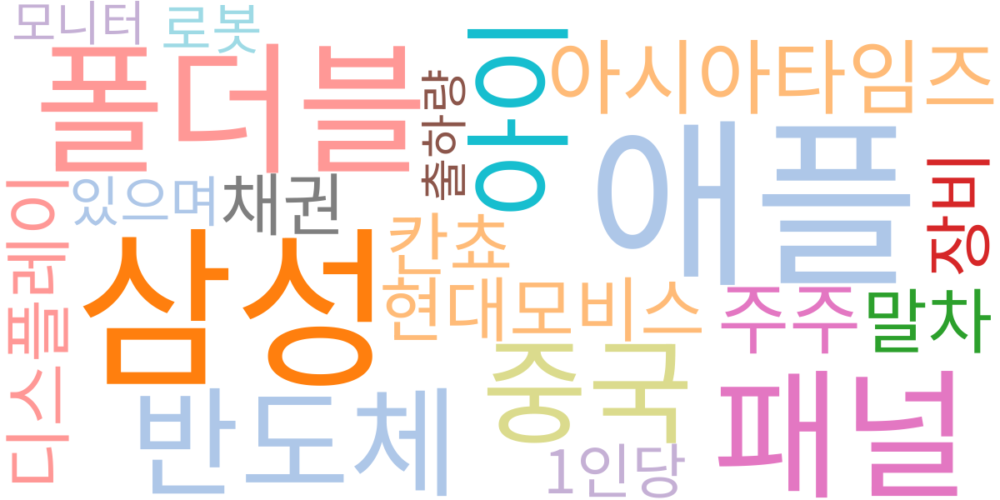

| Rank | Keyword | Score |
|---:|---|---:|
| 1 | 애플 | 0.963 |
| 2 | 삼성 | 0.880 |
| 3 | 폴더블 | 0.569 |
| 4 | 패널 | 0.549 |
| 5 | 반도체 | 0.384 |
| 6 | 중국 | 0.356 |
| 7 | 아이 | 0.330 |
| 8 | 아시아타임즈 | 0.312 |
| 9 | 주주 | 0.289 |
| 10 | 현대모비스 | 0.289 |
| 11 | 말차 | 0.287 |
| 12 | 디스플레이 | 0.271 |
| 13 | 칸쵸 | 0.270 |
| 14 | 장비 | 0.268 |
| 15 | 채권 | 0.265 |

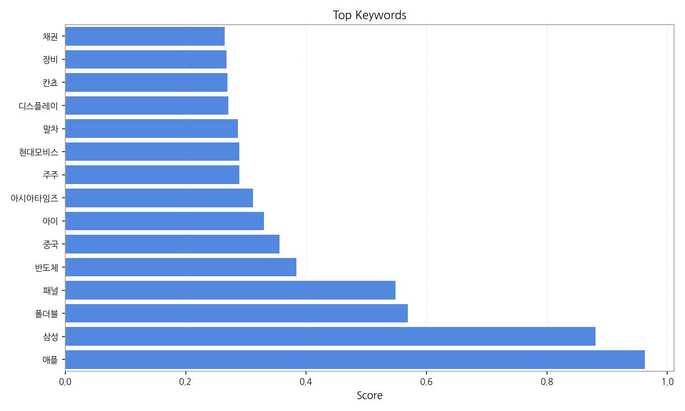

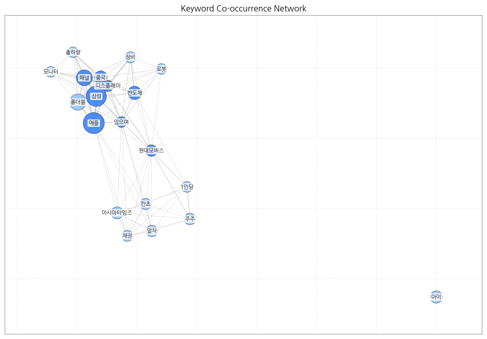

## Topics

- oled, 패널, 애플 (#0)
  - 대표 단어: oled, 패널, 애플, 폴더블, 아이폰, 디스플레이
- 디스플레이, 장비, 반도체 (#1)
  - 대표 단어: 디스플레이, 장비, 반도체, 해외, 핵심, 기술
- kt, ai, lg디스플레이 (#2)
  - 대표 단어: kt, ai, lg디스플레이, 모두, 경기, kt는
- 디스플레이, 장비, oled (#3)
  - 대표 단어: 디스플레이, 장비, oled, 핵심, 차세대, 기술
- 추석, 연휴, 배터리 (#4)
  - 대표 단어: 추석, 연휴, 배터리, kt는, 경기, 다시
- 삼성, 대구, 연휴 (#5)
  - 대표 단어: 삼성, 대구, 연휴, 프로, 금융, 경기
- led, 마이크로, micro (#6)
  - 대표 단어: led, 마이크로, micro, 프리미엄, 향후, 시장에
- 중국, 삼성전자는, 프리미엄 (#7)
  - 대표 단어: 중국, 삼성전자는, 프리미엄, 갤럭시, 폴더블폰, 스마트폰
- 반도체, 기술을, 사업을 (#8)
  - 대표 단어: 반도체, 기술을, 사업을, 자동차, ai, 전장
- ai, 새로운, 인프라 (#9)
  - 대표 단어: ai, 새로운, 인프라, 산업, 사용자, 실시간
- oled, 평균, 미만 (#10)
  - 대표 단어: oled, 평균, 미만, 대형, 전년, lg디스플레이
- 삼성은, 삼성, nc (#11)
  - 대표 단어: 삼성은, 삼성, nc, 공식, 1사, 모니터
- tv, oled, 중국 (#12)
  - 대표 단어: tv, oled, 중국, lg, 패널, led
- ai를, ai, 가장 (#13)
  - 대표 단어: ai를, ai, 가장, 새로운, ai가, 것이

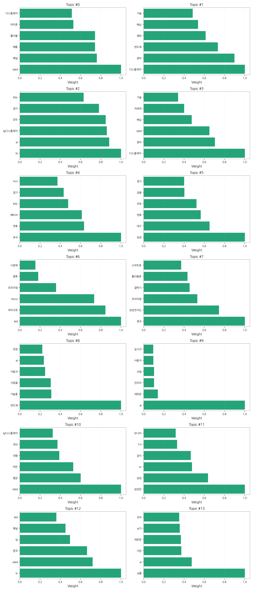

## 기업×토픽 집중도 매트릭스 (주간)

**핵심 요약:**

- **가장 경쟁이 치열한 토픽:** **디스플레이, 장비** (가장 많은 기업들이 주목)

- **가장 집중도가 높은 기업:** **삼성전자** (다양한 토픽에 걸쳐 높은 관련성)

- **주목할 만한 조합:** **애플 @ topic_0** (가장 높은 단일 연관 점수 기록)

각 기업별 상위 8개 토픽의 연관 점수와 해당 토픽 내에서의 점유율(%)을 나타냅니다.

| org     | topic_0     | topic_1     | topic_10    | topic_11   | topic_12    | topic_13    | topic_2     | topic_3     | topic_4     | topic_5   | topic_6     | topic_7     | topic_8     | topic_9     |
|:--------|:------------|:------------|:------------|:-----------|:------------|:------------|:------------|:------------|:------------|:----------|:------------|:------------|:------------|:------------|
| AMD     | 8.08 (3%)   | nan         | 2.87 (1%)   | nan        | 2.37 (1%)   | 3.73 (1%)   | nan         | nan         | 2.47 (2%)   | nan       | nan         | 3.10 (1%)   | 2.87 (1%)   | 5.85 (2%)   |
| BOE     | 21.80 (7%)  | 13.17 (3%)  | 15.81 (4%)  | nan        | 13.45 (5%)  | nan         | nan         | 15.81 (4%)  | nan         | nan       | 11.93 (5%)  | 9.30 (4%)   | nan         | 8.78 (3%)   |
| CSOT    | 4.85 (2%)   | 5.12 (1%)   | 7.18 (2%)   | nan        | 5.54 (2%)   | 2.98 (1%)   | nan         | 7.18 (2%)   | nan         | nan       | 4.47 (2%)   | 2.33 (1%)   | nan         | nan         |
| IoT     | nan         | 13.17 (3%)  | nan         | nan        | 3.16 (1%)   | 9.70 (3%)   | 7.90 (3%)   | 10.78 (3%)  | nan         | nan       | 3.73 (1%)   | nan         | 12.21 (4%)  | 11.71 (4%)  |
| JDI     | 2.42 (1%)   | 3.66 (1%)   | 2.16 (1%)   | nan        | 1.58 (1%)   | nan         | 2.16 (1%)   | 3.59 (1%)   | nan         | nan       | 1.49 (1%)   | nan         | 2.16 (1%)   | nan         |
| LG디스플레이 | 51.68 (17%) | 30.74 (8%)  | 59.63 (17%) | nan        | 36.39 (12%) | 25.36 (8%)  | nan         | 38.80 (9%)  | nan         | nan       | 30.58 (12%) | 22.49 (9%)  | nan         | nan         |
| LG전자    | nan         | 34.40 (8%)  | 35.20 (10%) | nan        | 38.77 (13%) | 42.51 (14%) | 56.76 (24%) | 38.08 (9%)  | 35.46 (22%) | nan       | nan         | nan         | nan         | 32.93 (11%) |
| LG화학    | nan         | 10.25 (3%)  | 23.71 (7%)  | 6.47 (5%)  | nan         | 14.92 (5%)  | 7.18 (3%)   | 13.65 (3%)  | nan         | nan       | nan         | nan         | 7.90 (2%)   | 8.78 (3%)   |
| SK하이닉스  | nan         | 34.40 (8%)  | nan         | nan        | nan         | 12.68 (4%)  | nan         | 29.46 (7%)  | 9.07 (6%)   | nan       | 8.95 (3%)   | 11.63 (4%)  | 28.74 (9%)  | 16.83 (6%)  |
| TCL     | 3.23 (1%)   | nan         | 3.59 (1%)   | nan        | 10.28 (4%)  | 2.98 (1%)   | 2.87 (1%)   | nan         | nan         | nan       | 8.95 (3%)   | 3.88 (1%)   | nan         | 3.66 (1%)   |
| V2X     | nan         | 6.59 (2%)   | nan         | 0.92 (1%)  | nan         | 2.24 (1%)   | 2.16 (1%)   | 4.31 (1%)   | nan         | nan       | nan         | 1.55 (1%)   | 6.47 (2%)   | 2.20 (1%)   |
| 구글      | 11.31 (4%)  | 14.64 (4%)  | nan         | nan        | nan         | 20.14 (6%)  | nan         | 15.81 (4%)  | nan         | nan       | 10.44 (4%)  | 13.96 (5%)  | 15.09 (5%)  | 21.96 (7%)  |
| 기아      | nan         | 12.44 (3%)  | nan         | nan        | nan         | 6.71 (2%)   | nan         | 11.50 (3%)  | 3.30 (2%)   | nan       | 5.97 (2%)   | 4.65 (2%)   | 12.93 (4%)  | 6.59 (2%)   |
| 네이버     | nan         | 6.59 (2%)   | nan         | nan        | nan         | 5.22 (2%)   | 2.16 (1%)   | 6.47 (2%)   | nan         | 1.94 (1%) | nan         | 2.33 (1%)   | 8.62 (3%)   | 5.85 (2%)   |
| 두산로보틱스  | nan         | nan         | 20.84 (6%)  | 4.62 (4%)  | nan         | 8.95 (3%)   | 4.31 (2%)   | 2.87 (1%)   | 3.30 (2%)   | nan       | nan         | 0.78 (0%)   | nan         | 1.46 (0%)   |
| 디지타임스   | 6.46 (2%)   | 4.39 (1%)   | nan         | nan        | 2.37 (1%)   | 2.24 (1%)   | nan         | 5.03 (1%)   | nan         | nan       | 2.98 (1%)   | 1.55 (1%)   | nan         | 1.46 (0%)   |
| 마이크로소프트 | 0.81 (0%)   | nan         | nan         | nan        | nan         | nan         | nan         | nan         | nan         | nan       | nan         | nan         | nan         | nan         |
| 메타      | nan         | 1.46 (0%)   | nan         | nan        | nan         | 2.98 (1%)   | 2.16 (1%)   | 2.16 (1%)   | 1.65 (1%)   | nan       | 2.24 (1%)   | nan         | 1.44 (0%)   | 2.93 (1%)   |
| 미디어텍    | nan         | 6.59 (2%)   | nan         | 0.92 (1%)  | nan         | 2.24 (1%)   | 2.16 (1%)   | 4.31 (1%)   | nan         | nan       | nan         | 1.55 (1%)   | 6.47 (2%)   | 2.20 (1%)   |
| 삼성디스플레이 | 28.26 (9%)  | 21.96 (5%)  | 18.68 (5%)  | nan        | 14.24 (5%)  | nan         | nan         | 25.15 (6%)  | nan         | nan       | 15.66 (6%)  | 16.28 (6%)  | 12.21 (4%)  | nan         |
| 삼성전자    | 40.38 (13%) | 59.28 (15%) | 52.45 (15%) | nan        | 57.75 (20%) | nan         | nan         | 56.04 (13%) | nan         | nan       | 45.49 (17%) | 51.95 (20%) | 45.26 (14%) | nan         |
| 샤오미     | nan         | nan         | 2.16 (1%)   | nan        | 6.33 (2%)   | 3.73 (1%)   | 2.16 (1%)   | nan         | nan         | nan       | 6.71 (3%)   | 6.20 (2%)   | 2.16 (1%)   | 2.93 (1%)   |
| 샤프      | 4.85 (2%)   | 2.93 (1%)   | 7.90 (2%)   | 1.85 (1%)  | 6.33 (2%)   | nan         | nan         | 4.31 (1%)   | nan         | nan       | 3.73 (1%)   | 2.33 (1%)   | nan         | nan         |
| 선익시스템   | 0.81 (0%)   | 3.66 (1%)   | nan         | nan        | nan         | nan         | 0.72 (0%)   | 4.31 (1%)   | 0.82 (1%)   | nan       | 0.75 (0%)   | nan         | 0.72 (0%)   | nan         |
| 소니      | 2.42 (1%)   | 2.93 (1%)   | nan         | nan        | 6.33 (2%)   | nan         | 2.16 (1%)   | nan         | nan         | 2.91 (2%) | 2.98 (1%)   | 3.88 (1%)   | nan         | 5.12 (2%)   |
| 아마존     | 0.81 (0%)   | nan         | nan         | nan        | nan         | nan         | nan         | nan         | nan         | nan       | nan         | nan         | nan         | nan         |
| 아이씨디    | 3.23 (1%)   | 8.78 (2%)   | 1.44 (0%)   | nan        | 1.58 (1%)   | nan         | 1.44 (1%)   | 9.34 (2%)   | nan         | nan       | 2.98 (1%)   | nan         | 3.59 (1%)   | nan         |
| 애플      | 70.26 (23%) | nan         | 31.61 (9%)  | nan        | 28.48 (10%) | 30.58 (10%) | nan         | 30.18 (7%)  | nan         | nan       | 26.10 (10%) | 30.24 (12%) | nan         | 33.67 (11%) |
| 엔비디아    | 1.62 (1%)   | nan         | 0.72 (0%)   | nan        | nan         | 2.24 (1%)   | 0.72 (0%)   | nan         | 1.65 (1%)   | nan       | nan         | nan         | 1.44 (0%)   | 4.39 (1%)   |
| 오포      | nan         | 0.73 (0%)   | 0.72 (0%)   | nan        | 1.58 (1%)   | 0.75 (0%)   | nan         | 0.72 (0%)   | nan         | nan       | 1.49 (1%)   | 3.88 (1%)   | nan         | 0.73 (0%)   |
| 원익IPS   | 2.42 (1%)   | 9.51 (2%)   | 1.44 (0%)   | nan        | nan         | nan         | 1.44 (1%)   | 8.62 (2%)   | 0.82 (1%)   | nan       | 2.24 (1%)   | nan         | 2.16 (1%)   | nan         |
| 카카오     | nan         | 6.59 (2%)   | nan         | nan        | nan         | 5.22 (2%)   | 2.16 (1%)   | 6.47 (2%)   | nan         | 1.94 (1%) | nan         | 2.33 (1%)   | 8.62 (3%)   | 5.85 (2%)   |
| 퀄컴      | nan         | 6.59 (2%)   | nan         | 1.85 (1%)  | nan         | 3.73 (1%)   | 2.16 (1%)   | 4.31 (1%)   | nan         | nan       | nan         | 5.43 (2%)   | 6.47 (2%)   | 2.20 (1%)   |
| 하이센스    | 3.23 (1%)   | nan         | 3.59 (1%)   | nan        | 10.28 (4%)  | 2.98 (1%)   | 2.87 (1%)   | nan         | nan         | nan       | 8.95 (3%)   | 3.88 (1%)   | nan         | 3.66 (1%)   |
| 하이얼     | nan         | nan         | 1.44 (0%)   | nan        | 4.75 (2%)   | 2.98 (1%)   | 2.16 (1%)   | nan         | nan         | nan       | 5.22 (2%)   | 2.33 (1%)   | 2.16 (1%)   | 2.20 (1%)   |
| 한미반도체   | nan         | 12.44 (3%)  | 2.16 (1%)   | nan        | nan         | 2.24 (1%)   | 2.87 (1%)   | 8.62 (2%)   | nan         | nan       | 2.24 (1%)   | nan         | 7.90 (2%)   | 2.20 (1%)   |
| 한화시스템   | nan         | 5.85 (1%)   | nan         | nan        | nan         | 2.98 (1%)   | 1.44 (1%)   | 5.75 (1%)   | 1.65 (1%)   | nan       | nan         | 1.55 (1%)   | 6.47 (2%)   | 2.93 (1%)   |
| 현대모비스   | nan         | 12.44 (3%)  | 20.12 (6%)  | nan        | nan         | 15.66 (5%)  | 10.78 (5%)  | 14.37 (3%)  | 10.72 (7%)  | nan       | nan         | nan         | 13.65 (4%)  | 8.05 (3%)   |
| 현대자동차   | nan         | 3.66 (1%)   | nan         | 2.77 (2%)  | 3.16 (1%)   | nan         | nan         | 3.59 (1%)   | 4.12 (3%)   | 3.88 (3%) | nan         | nan         | 2.87 (1%)   | 3.66 (1%)   |
| 현대차     | nan         | 18.30 (5%)  | nan         | nan        | nan         | 10.44 (3%)  | nan         | 18.68 (4%)  | 7.42 (5%)   | nan       | 5.97 (2%)   | 6.98 (3%)   | 15.81 (5%)  | 10.98 (4%)  |
| 화웨이     | 1.62 (1%)   | nan         | nan         | nan        | 1.58 (1%)   | 2.24 (1%)   | nan         | nan         | nan         | 0.97 (1%) | 2.24 (1%)   | 3.10 (1%)   | 2.16 (1%)   | 2.93 (1%)   |

**코멘트 및 액션 힌트:**

> 특정 토픽에서 높은 점유율을 보이는 기업은 해당 분야의 '주도자(Leader)'일 가능성이 높습니다. 반면, 특정 기업이 소수의 토픽에 높은 점수를 집중하고 있다면, 이는 해당 기업의 '핵심 전략 분야'를 시사합니다. 경쟁사 및 파트너사의 집중 분야를 파악하여 우리의 전략을 점검해볼 수 있습니다.

## 기업×토픽 시각적 분석

### 전체 시장 구도 (Heatmap)

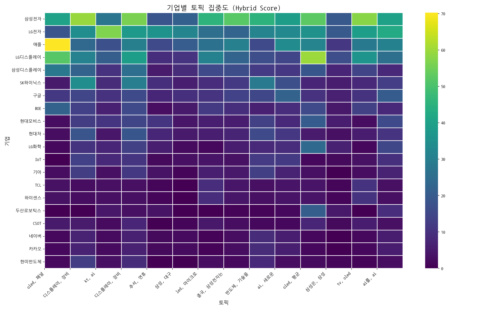

> 전체 기업과 토픽 간의 관계를 한눈에 보여줍니다. 색이 진할수록 연관성이 높습니다.

### 주요 토픽별 경쟁 구도 (Pie Charts)

> 가장 뜨거운 주제를 두고 어떤 기업들이 경쟁하는지 점유율을 보여줍니다.

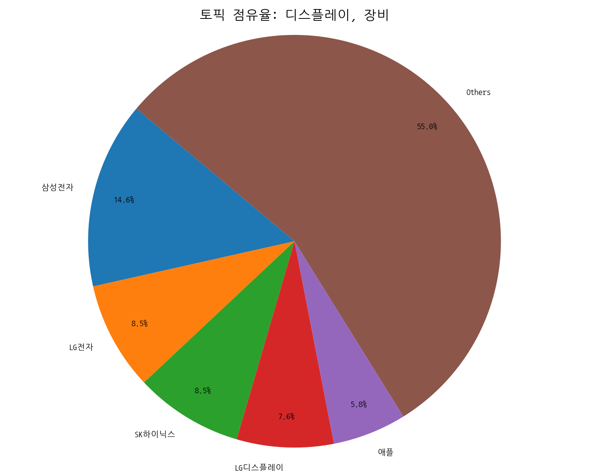
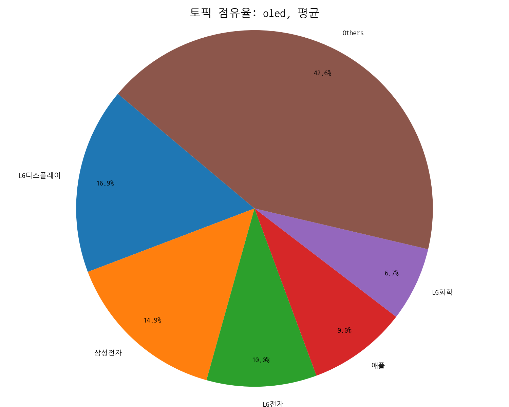
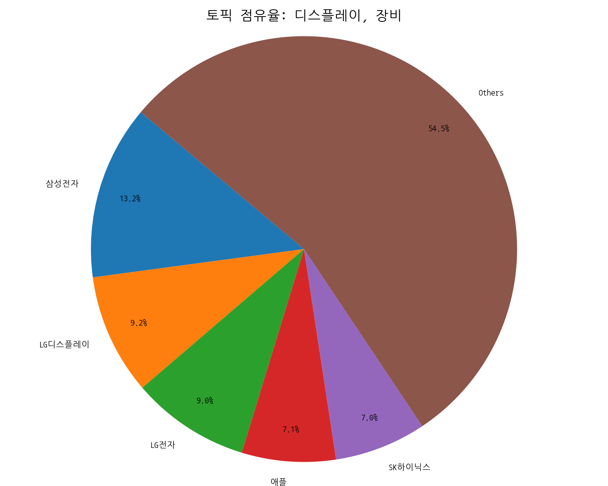

### 주요 기업별 전략 분석 (Bar Charts)

> 시장을 주도하는 주요 기업들이 어떤 토픽에 집중하고 있는지 보여줍니다.

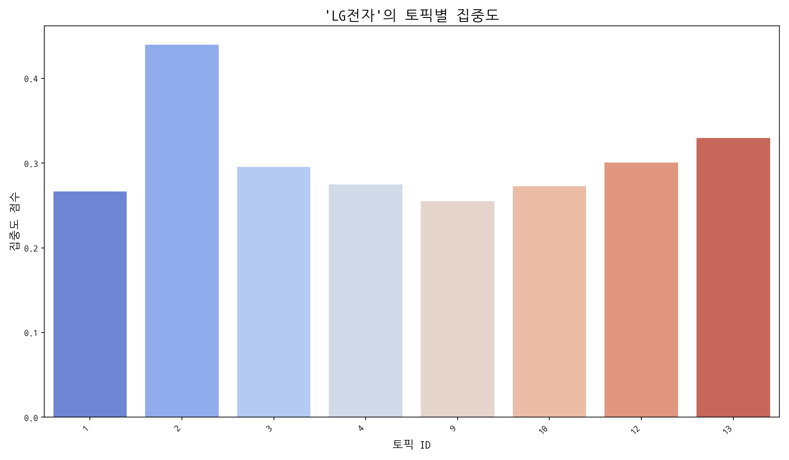
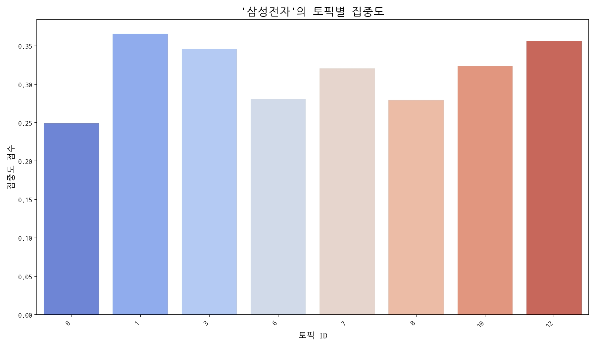
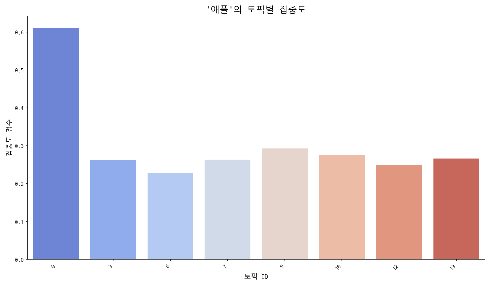

## 관계·경쟁 심화 분석

**핵심 요약**

- **관계망 규모:** 노드 30개 / 엣지 35개

- **가장 강한 관계:** 삼성전자 ↔ 애플 (가중치 12, 유형 rivalry)

- **허브 후보:** 삼성전자 (Degree 0.5517)

- **브로커 후보:** 삼성전자 (Betweenness 0.2875)

### 상위 관계쌍(Edge)

> 동일 문서/문장 내에서 함께 언급된 기업 쌍이며, 가중치는 동시출현 빈도입니다. 값이 높을수록 상호 관련성이 강하고, 유형은 키워드 규칙으로 경쟁/협력/중립을 추정합니다.

| Source   | Target   |   Weight | Type    |
|:---------|:---------|---------:|:--------|
| 삼성전자     | 애플       |       12 | rivalry |
| 삼성디스플레이  | 삼성전자     |       12 | rivalry |
| 삼성디스플레이  | 애플       |        9 | rivalry |
| 삼성전자     | 현대모비스    |        6 | rivalry |
| LG전자     | 삼성전자     |        6 | rivalry |
| 삼성전자     | 화웨이      |        5 | neutral |
| 구글       | 애플       |        5 | rivalry |
| 구글       | 삼성전자     |        5 | rivalry |
| 현대자동차    | 현대차      |        4 | neutral |
| 두산로보틱스   | 현대모비스    |        4 | neutral |

### 중심성 상위(연결 허브)

> Degree 중심성은 한 노드가 연결된 상대 수의 비율로, 값이 높을수록 다수의 기업과 직접 연결된 허브 성격을 가집니다. 허브는 이슈 확산과 정보 접근성이 높습니다.

| Org     |   DegreeCentrality |
|:--------|-------------------:|
| 삼성전자    |             0.5517 |
| 애플      |             0.2414 |
| 현대모비스   |             0.2069 |
| LG전자    |             0.1379 |
| 기아      |             0.1379 |
| 삼성디스플레이 |             0.1379 |
| 현대차     |             0.1379 |
| 구글      |             0.1034 |
| 현대자동차   |             0.1034 |
| 화웨이     |             0.1034 |

### 매개 중심성 상위(정보 브로커)

> Betweenness는 네트워크 경로의 ‘다리’ 역할 정도를 의미합니다. 값이 높을수록 서로 다른 집단을 연결하는 중개자(브로커)로 해석되며, 거래·협상력과 정보 흐름 장악력이 큽니다.

| Org     |   Betweenness |
|:--------|--------------:|
| 삼성전자    |        0.2875 |
| 애플      |        0.0688 |
| 삼성디스플레이 |        0.0158 |
| 현대모비스   |        0.0107 |
| LG전자    |        0.0039 |
| 구글      |        0.0021 |
| 화웨이     |        0.0012 |
| 기아      |        0.0008 |
| 현대차     |        0.0008 |
| 네이버     |        0      |

### 커뮤니티(관계 클러스터)

> 모듈러리티 기반으로 자동 추출한 관계 집단입니다. 같은 집단 내 기업들은 유사 주제나 공급망 활동을 공유할 가능성이 높습니다.

- C0: LG전자, 구글, 삼성디스플레이, 삼성전자, 샤오미, 샤프 | 해석: LG전자 중심의 연관 클러스터
- C1: 기아, 두산로보틱스, 현대모비스, 현대자동차, 현대차 | 해석: 기아 중심의 연관 클러스터
- C2: 오포, 퀄컴, 화웨이 | 해석: 오포 중심의 연관 클러스터
- C3: 네이버, 카카오 | 해석: 네이버 중심의 연관 클러스터
- C4: 디지타임스 | 해석: 디지타임스 중심의 연관 클러스터

### 네트워크 시각화

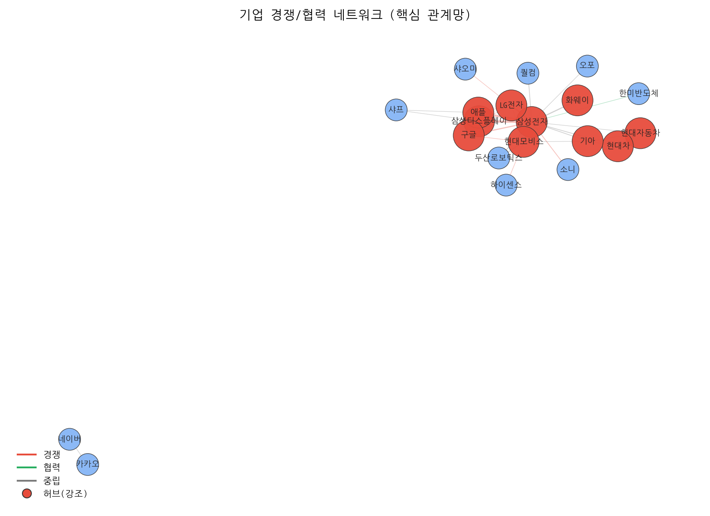

> 동시출현이 높은 쌍은 직접 경쟁 또는 공급망 핵심 협력 가능성을 시사하며, 허브/브로커는 시장 영향력 및 중개 포지션을 의미합니다. 커뮤니티는 전략·밸류체인 단위의 동조 클러스터일 수 있습니다.

## Trend

- 최근 기사 수 추세와 7일 이동평균선을 제공합니다.

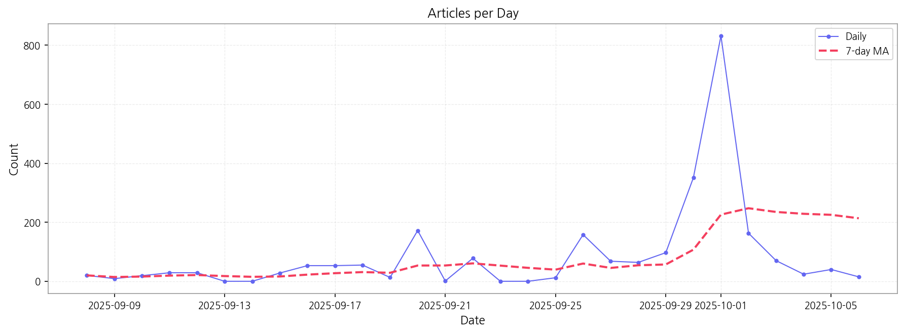

## Insights

## 데일리 인텔리전스 브리핑

**1. 핵심 맥락:**

*   **OLED 패널 시장 경쟁 심화 및 프리미엄화 가속:** 애플의 아이폰17을 중심으로 폴더블폰 시장에서 OLED 패널 수요가 증가하고 있으며, 삼성디스플레이와 LG디스플레이 간의 기술 경쟁이 심화되고 있습니다. 동시에 Micro LED 기술이 프리미엄 TV 시장을 중심으로 부상하며, OLED와의 경쟁 구도를 형성하고 있습니다.
*   **디스플레이 산업의 기술 혁신 및 투자 확대:** 디스플레이 장비, 반도체 기술, AI 기술을 융합한 차세대 디스플레이 기술 개발 경쟁이 치열하게 전개되고 있습니다. 특히 차량용 디스플레이 시장을 중심으로 배터리 기술과 연계한 투자가 활발하게 이루어지고 있습니다.

**2. 최근 변화/스파이크:**

*   **2025년 9월 30일, 10월 1일 기사 수 급증:** 해당 시점에 기사 수가 급증한 것은 추석 연휴 이후 디스플레이, 반도체, AI 기술 관련 투자 및 사업 확장 소식이 집중적으로 보도되었기 때문으로 추정됩니다. 특히, 애플, 삼성 등 주요 기업의 차세대 디스플레이 기술 개발 및 폴더블폰 시장 경쟁 관련 뉴스가 증가한 것으로 보입니다.

**3. 실무 인사이트:**

*   **사업 개발:** 폴더블폰 시장 확대를 고려하여, 폴더블 디스플레이 기술 경쟁력 강화 및 관련 특허 확보 전략을 수립해야 합니다. 특히, 힌지 기술, 내구성 강화 기술, 초박막 강화유리(UTG) 기술 확보에 집중해야 합니다.
*   **기술 기획:** Micro LED 기술의 상용화 가능성을 주시하고, OLED 기술과의 시너지 효과를 창출할 수 있는 방안을 모색해야 합니다. Micro LED의 대량 생산 기술 확보, 비용 절감 방안 마련, 화질 개선 연구에 투자해야 합니다.
*   **사업 개발:** 차량용 디스플레이 시장 진출을 위한 기술 개발 및 사업 협력 기회를 적극적으로 모색해야 합니다. 특히, 배터리 기술과의 융합, 안전성 강화 기술, 증강현실(AR) 기술 연계 등을 고려하여 차별화된 경쟁력을 확보해야 합니다.

## Opportunities (Top 5)

| Idea | Target | Value Prop | Score (Market / Urgency / Feasibility / Risk) |
|---|---|---|---|
| IT 기기용 벤더블 OLED 패널 솔루션 | 글로벌 IT 기기 제조사 (노트북, 태블릿, 모니터) | 자유로운 곡률 조정으로 다양한 폼팩터 구현 가능, 뛰어난 화질과 얇고 가벼운 디자인, 내구성 강화 기술 적용으로 폴더블 디스플레이의 단점 보완, 사용자 경험 극대화를 위한 맞춤형 소프트웨어 솔루션 제공 | 3.9 (0.48 / 0.415 / 0.5 / 0.15) |
| 메타버스 협업용 초고해상도 Micro-OLED XR 글래스 | 북미 빅테크 기업 (메타버스 플랫폼 사업자), 글로벌 엔터프라이즈 (설계, 디자인, 교육 분야) | 초고해상도 Micro-OLED 디스플레이로 현실과 같은 몰입감 제공, 경량화 디자인으로 장시간 착용 편의성 극대화, 실시간 3D 렌더링 및 공간 컴퓨팅 기술 지원, 사용자 맞춤형 인터페이스 및 제스처 인식 기능 제공 | 3.6 (0.5 / 0.415 / 0.45 / 0.21) |
| AI 기반 디스플레이 공정 자동화 및 수율 예측 시스템 | 디스플레이 제조사, 반도체 제조사, 스마트 팩토리 솔루션 기업 | AI 기반 실시간 공정 데이터 분석 및 이상 감지, 머신러닝 기반 수율 예측 모델 제공, 자동화된 공정 제어 및 최적화, 생산 비용 절감 및 수율 향상, 숙련된 엔지니어의 의존도 감소 | 3.5 (0.43 / 0.3 / 0.55 / 0.15) |
| 차량용 AR HUD & e-Mirror 통합 디스플레이 솔루션 | 글로벌 완성차 OEM (특히 전기차 제조사), Tier 1 자동차 부품 공급사 | AR HUD와 e-Mirror를 통합하여 운전자에게 직관적이고 풍부한 정보 제공, 넓은 시야각과 고화질 영상으로 안전 운전 지원, 저전력 기술 적용으로 전기차 배터리 효율 향상, 차세대 차량 디자인에 최적화된 폼팩터 제공 | 3.4 (0.42 / 0.3 / 0.5 / 0.15) |
| 퀀텀닷 컬러 필터 기반 고색재현 MicroLED 디스플레이 | 프리미엄 TV 제조사, 디지털 사이니지 기업, 영화 제작사 | 퀀텀닷 컬러 필터 적용으로 색재현율 및 색정확도 극대화, MicroLED의 높은 휘도 및 명암비와 결합하여 최고의 화질 제공, 넓은 시야각 및 균일한 색 표현, 에너지 효율 향상 및 수명 연장 | 3.0 (0.4 / 0.3 / 0.45 / 0.21) |

### 📊 아이디어 점수 분포
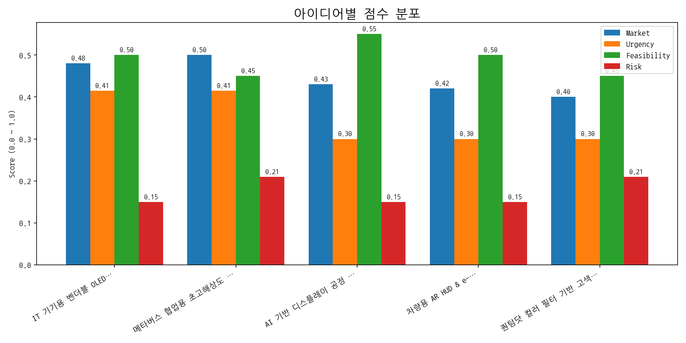

## Appendix

- 데이터: keywords.json, topics.json, trend_timeseries.json, trend_insights.json, biz_opportunities.json