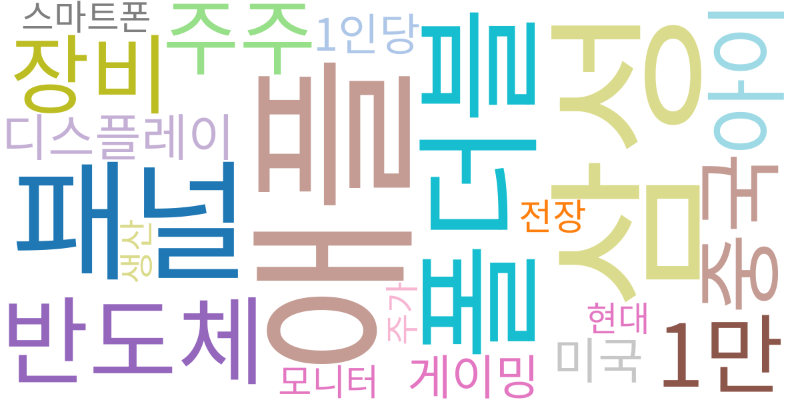
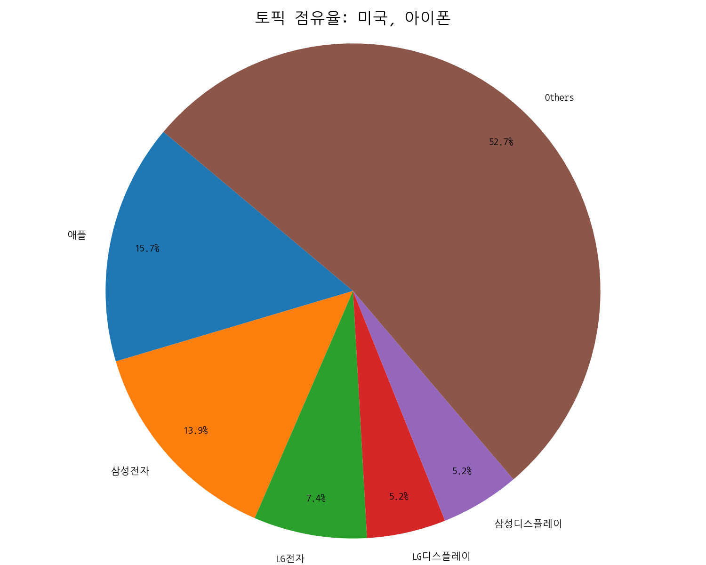
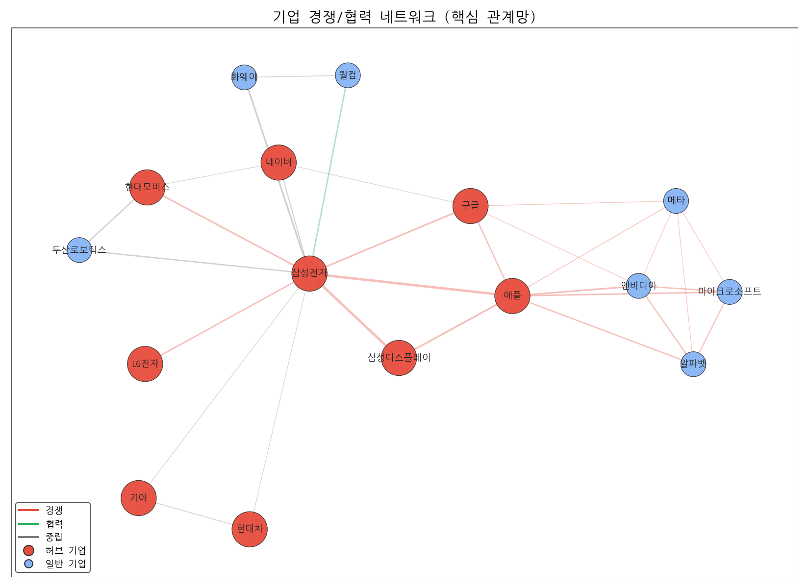
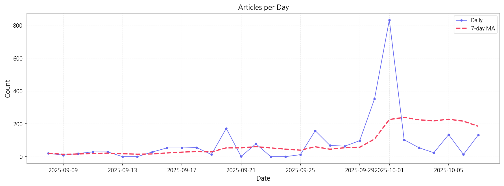
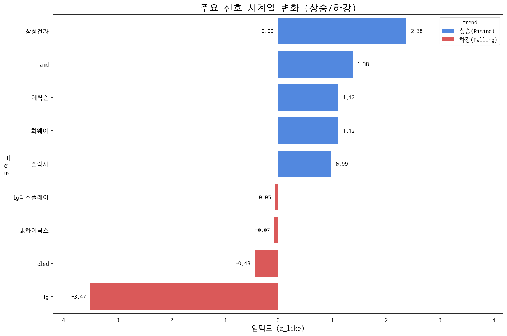
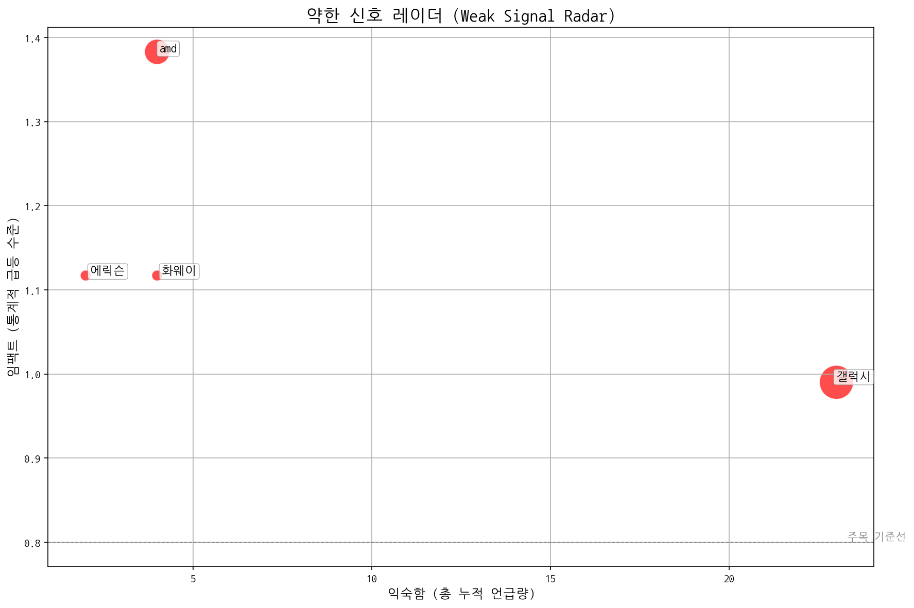
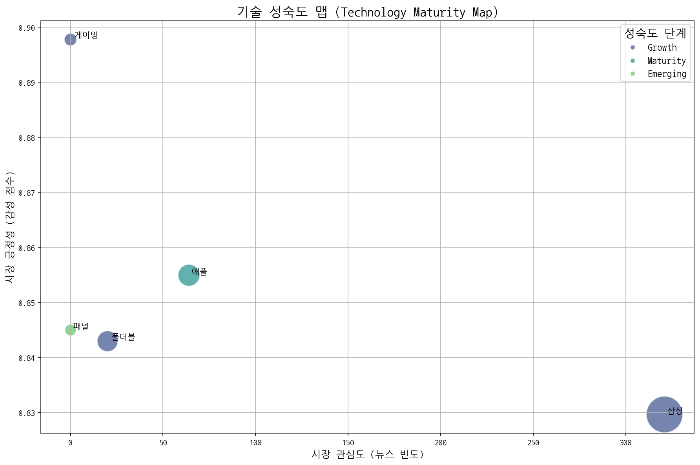
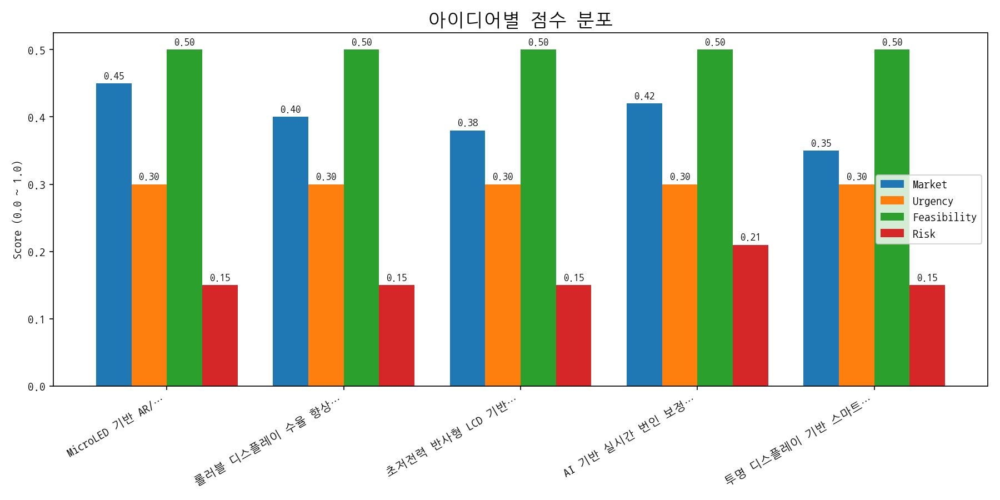

# Weekly/New Biz Report (2025-10-07)

## Executive Summary

- 이번 기간 핵심 토픽과 키워드, 주요 시사점을 요약합니다.

## 데일리 인텔리전스 브리핑 (디스플레이 산업)

**1. 핵심 맥락:**

*   **AI 기반 디스플레이 기술 경쟁 심화:** AI 기술이 디스플레이 산업 전반에 걸쳐 중요해지고 있으며, 특히 TV, 스마트폰 등 최종 제품의 성능 향상에 기여하고 있습니다. 삼성, 애플 등 주요 기업들이 AI를 활용한 디스플레이 기술 개발 및 제품 적용에 적극적으로 나서면서 경쟁이 심화될 것으로 예상됩니다 (Topic 4, 12, 13).
*   **OLED 기술 주도권 경쟁 및 폴더블 디스플레이 성장:** OLED 기술은 여전히 디스플레이 시장의 핵심이며, 특히 폴더블 디스플레이를 중심으로 기술 혁신이 가속화되고 있습니다. 중국 기업들의 OLED 기술 추격이 거세지는 가운데, 삼성과 LG디스플레이는 차세대 OLED 기술 (LTPO 등) 및 폴더블 디스플레이 기술을 통해 시장 우위를 확보하려는 전략을 추진 중입니다 (Topic 6, 7, 9).

**2. 최근 변화/스파이크:**

*   **2025년 9월 30일 및 10월 1일 기사 수 급증:** 이 기간 동안 기사 수가 급격히 증가한 것은 "애플", "삼성", "패널" 등의 키워드와 연관되어 있습니다. 이는 아이폰 17 출시 관련 정보, 삼성의 새로운 디스플레이 기술 발표, 또는 양사 간의 패널 공급 계약 관련 소식 등, 디스플레이 시장에 큰 영향을 미치는 이벤트가 발생했을 가능성을 시사합니다. 특히 10월 1일의 압도적인 증가는 신제품 발표와 같은 구체적인 이벤트가 있었을 가능성이 높습니다.

**3. 실무 인사이트:**

*   **AI 기반 디스플레이 기술 개발 로드맵 구체화:** AI 기술을 활용한 디스플레이 화질 개선, 전력 효율 향상, 사용자 인터페이스 최적화 등 구체적인 목표를 설정하고, 관련 기술 개발 로드맵을 수립해야 합니다. 특히 생성형 AI를 활용한 새로운 디스플레이 기능 개발에 집중할 필요가 있습니다.
*   **폴더블 디스플레이 기술 경쟁력 강화:** 폴더블 디스플레이의 내구성, 화면 주름 개선, 폼팩터 다양화 등 기술적 난제를 해결하고, 차별화된 사용자 경험을 제공할 수 있는 폴더블 디스플레이 기술 개발에 투자를 확대해야 합니다. 중국 기업과의 기술 격차를 유지하기 위한 전략적 투자가 필요합니다.
*   **차세대 디스플레이 기술 투자 및 협력 강화:** 마이크로 LED, QD-OLED 등 차세대 디스플레이 기술 개발에 대한 투자를 확대하고, 관련 기술을 보유한 기업과의 협력을 강화해야 합니다. 특히 웨어러블 기기, 자동차 전장 등 새로운 시장을 타겟으로 하는 차세대 디스플레이 기술 개발에 집중할 필요가 있습니다.

## Key Metrics

- 기간: 2025-09-08 ~ 2025-10-07
- 총 기사 수: 2,601
- 문서 수: N/A
- 키워드 수(상위): 15
- 토픽 수: 14
- 시계열 데이터 일자 수: 30

## Top Keywords

| Rank | Keyword | Score |
|---:|---|---:|
| 1 | 애플 | 0.987 |
| 2 | 삼성 | 0.885 |
| 3 | 패널 | 0.501 |
| 4 | 폴더블 | 0.490 |
| 5 | 반도체 | 0.430 |
| 6 | 중국 | 0.357 |
| 7 | 1만 | 0.344 |
| 8 | 장비 | 0.342 |
| 9 | 아이 | 0.319 |
| 10 | 주주 | 0.314 |
| 11 | 디스플레이 | 0.289 |
| 12 | 미국 | 0.276 |
| 13 | 게이밍 | 0.271 |
| 14 | 1인당 | 0.251 |
| 15 | 모니터 | 0.249 |

## Topics

- 장비, 디스플레이, oled (#0)
  - 대표 단어: 장비, 디스플레이, oled, 반도체, 기술, ai
- 반도체, ai, 삼성전자 (#1)
  - 대표 단어: 반도체, ai, 삼성전자, 패키징, hbm, 메모리
- ai를, 됐다, ai가 (#2)
  - 대표 단어: ai를, 됐다, ai가, 것이다, 반면, 유럽
- 기능을, 삼성, 가장 (#3)
  - 대표 단어: 기능을, 삼성, 가장, 배터리, 충전, 화면
- ai, 보안, 업무 (#4)
  - 대표 단어: ai, 보안, 업무, ai가, 이를, ai를
- 반도체, 자동차, 사업을 (#5)
  - 대표 단어: 반도체, 자동차, 사업을, 거래일, 전장, 기술을
- oled, 패널, oled 패널 (#6)
  - 대표 단어: oled, 패널, oled 패널, 디스플레이, tv, 대형
- oled, 추석, ltpo (#7)
  - 대표 단어: oled, 추석, ltpo, 3분기, lg디스플레이, 수익성
- led, 마이크로, 마이크로 led (#8)
  - 대표 단어: led, 마이크로, 마이크로 led, micro, 웨어러블, 대규모
- 기술, 중국, 폴더블 (#9)
  - 대표 단어: 기술, 중국, 폴더블, 디스플레이, 폴더블폰, 갤럭시
- 피부, 미국, pin (#10)
  - 대표 단어: 피부, 미국, pin, pin shot, shot, 클레녹스
- 미성년자, 평균, 20세 (#11)
  - 대표 단어: 미성년자, 평균, 20세, 주주, 1인당, 상장사
- ai, tv, 디스플레이 (#12)
  - 대표 단어: ai, tv, 디스플레이, 아이폰, 애플, 새로운
- 미국, 아이폰, 한국 (#13)
  - 대표 단어: 미국, 아이폰, 한국, ai, 애플의, 애플

## 기업×토픽 집중도 매트릭스 (주간)

**핵심 요약:**

- **가장 경쟁이 치열한 토픽:** **장비, 디스플레이** (가장 많은 기업들이 주목)

- **가장 집중도가 높은 기업:** **삼성전자** (다양한 토픽에 걸쳐 높은 관련성)

- **주목할 만한 조합:** **삼성전자 @ topic_0** (가장 높은 단일 연관 점수 기록)

각 기업별 상위 8개 토픽의 연관 점수와 해당 토픽 내에서의 점유율(%)을 나타냅니다.

| org           | topic_0      | topic_1      | topic_10   | topic_11     | topic_12     | topic_13     | topic_2   | topic_3    | topic_4     | topic_5    | topic_6      | topic_7      | topic_8   | topic_9      |
|:--------------|:-------------|:-------------|:-----------|:-------------|:-------------|:-------------|:----------|:-----------|:------------|:-----------|:-------------|:-------------|:----------|:-------------|
| AMD           | 15.44 (2%)   | 7.11 (1%)    | 6.00 (3%)  | nan          | 12.32 (2%)   | 19.72 (3%)   | nan       | nan        | 12.76 (3%)  | 10.48 (2%) | nan          | nan          | nan       | 9.01 (1%)    |
| ASUS          | 2.81 (0%)    | nan          | 1.71 (1%)  | nan          | nan          | nan          | 0.81 (0%) | 7.93 (2%)  | nan         | nan        | 6.09 (1%)    | 2.38 (1%)    | 2.25 (1%) | 2.08 (0%)    |
| BMW           | 2.81 (0%)    | 0.71 (0%)    | nan        | nan          | 0.68 (0%)    | 0.73 (0%)    | nan       | 1.44 (0%)  | 1.50 (0%)   | nan        | nan          | 0.79 (0%)    | 0.75 (0%) | nan          |
| BOE           | 26.68 (3%)   | nan          | 7.72 (4%)  | nan          | 26.01 (4%)   | 23.37 (4%)   | nan       | nan        | 9.00 (2%)   | nan        | 37.28 (7%)   | 28.59 (6%)   | nan       | 22.87 (4%)   |
| BYD           | 1.40 (0%)    | nan          | 1.71 (1%)  | nan          | 2.05 (0%)    | nan          | 4.03 (1%) | 5.76 (1%)  | nan         | 0.81 (0%)  | 1.52 (0%)    | nan          | 1.50 (1%) | nan          |
| CES           | 0.70 (0%)    | nan          | nan        | nan          | 0.68 (0%)    | nan          | nan       | nan        | nan         | 0.81 (0%)  | 0.76 (0%)    | nan          | nan       | 1.39 (0%)    |
| CSOT          | 10.53 (1%)   | 2.13 (0%)    | nan        | nan          | 5.48 (1%)    | 2.92 (0%)    | nan       | 2.16 (1%)  | nan         | nan        | 11.41 (2%)   | 6.35 (1%)    | nan       | 5.55 (1%)    |
| HP            | 3.51 (0%)    | nan          | nan        | nan          | 2.05 (0%)    | 1.46 (0%)    | 4.84 (2%) | nan        | 4.50 (1%)   | nan        | 3.80 (1%)    | nan          | 1.50 (1%) | 2.77 (0%)    |
| Harman        | 1.40 (0%)    | 1.42 (0%)    | 1.71 (1%)  | nan          | nan          | 2.19 (0%)    | nan       | 3.60 (1%)  | 2.25 (0%)   | nan        | 1.52 (0%)    | nan          | 3.75 (2%) | nan          |
| IoT           | 14.74 (2%)   | 12.09 (2%)   | nan        | nan          | nan          | 8.76 (1%)    | 7.25 (3%) | 12.25 (3%) | 16.51 (4%)  | 10.48 (2%) | nan          | nan          | 7.50 (3%) | nan          |
| JDI           | 3.51 (0%)    | nan          | 1.71 (1%)  | 1.16 (0%)    | 1.37 (0%)    | nan          | nan       | nan        | 3.00 (1%)   | nan        | 3.04 (1%)    | 4.77 (1%)    | nan       | 1.39 (0%)    |
| LG디스플레이       | 67.40 (7%)   | nan          | nan        | 117.24 (15%) | 44.49 (8%)   | 33.59 (5%)   | nan       | nan        | 27.76 (6%)  | nan        | 74.56 (14%)  | 71.48 (16%)  | nan       | 46.44 (8%)   |
| LG전자          | 68.80 (7%)   | 42.67 (7%)   | nan        | 117.24 (15%) | 56.81 (10%)  | 48.19 (7%)   | nan       | nan        | 45.77 (10%) | nan        | 43.37 (8%)   | nan          | nan       | 45.05 (7%)   |
| LG화학          | 31.59 (3%)   | 23.47 (4%)   | nan        | 116.07 (15%) | nan          | nan          | nan       | 16.57 (4%) | 15.76 (3%)  | 18.54 (4%) | nan          | 17.47 (4%)   | nan       | 15.25 (2%)   |
| SID           | 0.70 (0%)    | nan          | nan        | nan          | 0.68 (0%)    | nan          | nan       | nan        | nan         | 0.81 (0%)  | 0.76 (0%)    | nan          | nan       | 1.39 (0%)    |
| SK하이닉스        | 55.46 (6%)   | 46.23 (8%)   | nan        | nan          | 23.27 (4%)   | 27.02 (4%)   | nan       | nan        | 22.51 (5%)  | 44.33 (9%) | 14.46 (3%)   | nan          | nan       | 29.81 (5%)   |
| Semiconductor | 2.11 (0%)    | 1.42 (0%)    | nan        | nan          | nan          | 0.73 (0%)    | nan       | nan        | 0.75 (0%)   | 1.61 (0%)  | nan          | 0.79 (0%)    | 0.75 (0%) | 0.69 (0%)    |
| TCL           | 3.51 (0%)    | nan          | nan        | nan          | 4.79 (1%)    | 5.11 (1%)    | 4.03 (1%) | nan        | 3.75 (1%)   | nan        | 5.33 (1%)    | nan          | 3.00 (1%) | 4.16 (1%)    |
| TSMC          | 3.51 (0%)    | 4.27 (1%)    | 1.71 (1%)  | nan          | 2.05 (0%)    | 3.65 (1%)    | 2.42 (1%) | nan        | 3.00 (1%)   | 2.42 (0%)  | nan          | nan          | nan       | nan          |
| Tianma        | 8.42 (1%)    | 2.84 (0%)    | nan        | nan          | 2.05 (0%)    | 1.46 (0%)    | nan       | nan        | nan         | 1.61 (0%)  | 4.56 (1%)    | 4.77 (1%)    | nan       | 2.08 (0%)    |
| V2X           | 7.72 (1%)    | 10.67 (2%)   | nan        | nan          | 2.74 (0%)    | 3.65 (1%)    | nan       | 2.88 (1%)  | 4.50 (1%)   | 10.48 (2%) | nan          | nan          | nan       | 3.47 (1%)    |
| Visionox      | 18.25 (2%)   | 7.11 (1%)    | nan        | nan          | 4.79 (1%)    | 2.92 (0%)    | nan       | nan        | nan         | 4.84 (1%)  | 10.65 (2%)   | 7.94 (2%)    | nan       | 5.55 (1%)    |
| 구글            | 37.58 (3%)   | 19.45 (3%)   | nan        | nan          | 25.24 (4%)   | 32.13 (4%)   | nan       | 26.57 (6%) | 23.20 (4%)  | 26.85 (5%) | nan          | nan          | nan       | 32.15 (4%)   |
| 기아            | 21.06 (2%)   | 7.82 (1%)    | nan        | nan          | 9.58 (2%)    | 9.49 (1%)    | nan       | 12.97 (3%) | nan         | 24.18 (5%) | 9.89 (2%)    | nan          | nan       | 13.86 (2%)   |
| 네이버           | 20.36 (2%)   | 7.11 (1%)    | nan        | 42.95 (6%)   | 6.84 (1%)    | nan          | nan       | 10.09 (3%) | 7.50 (2%)   | 15.32 (3%) | nan          | nan          | nan       | 7.62 (1%)    |
| 두산로보틱스        | 7.02 (1%)    | 6.40 (1%)    | nan        | 114.91 (15%) | nan          | nan          | 5.64 (2%) | 7.93 (2%)  | 4.50 (1%)   | nan        | nan          | 9.53 (2%)    | 1.50 (1%) | nan          |
| 디지타임스         | 4.91 (1%)    | nan          | 0.86 (0%)  | nan          | 3.42 (1%)    | 5.11 (1%)    | nan       | 1.44 (0%)  | nan         | nan        | 3.80 (1%)    | 1.59 (0%)    | nan       | 3.47 (1%)    |
| 마이크로소프트       | 16.85 (2%)   | 13.51 (2%)   | 9.43 (5%)  | 4.64 (1%)    | 10.27 (2%)   | 17.52 (3%)   | nan       | nan        | 13.51 (3%)  | 8.06 (2%)  | nan          | nan          | nan       | nan          |
| 메타            | 11.93 (1%)   | 7.11 (1%)    | nan        | nan          | 8.21 (1%)    | 11.68 (2%)   | 5.64 (2%) | 5.04 (1%)  | 11.25 (2%)  | 6.45 (1%)  | nan          | nan          | nan       | nan          |
| 미디어텍          | 6.32 (1%)    | 7.82 (1%)    | nan        | nan          | nan          | 4.38 (1%)    | nan       | 5.04 (1%)  | 5.25 (1%)   | 6.45 (1%)  | 3.04 (1%)    | nan          | 4.50 (2%) | nan          |
| 비보            | nan          | 1.42 (0%)    | 0.86 (0%)  | nan          | 2.05 (0%)    | 5.11 (1%)    | 0.81 (0%) | 1.44 (0%)  | 0.75 (0%)   | nan        | nan          | nan          | nan       | 3.47 (1%)    |
| 삼성디스플레이       | 56.86 (6%)   | 22.05 (4%)   | nan        | nan          | 35.59 (6%)   | 33.59 (5%)   | nan       | 16.57 (4%) | nan         | nan        | 47.17 (9%)   | 36.54 (8%)   | nan       | 48.52 (8%)   |
| 삼성전자          | 192.76 (14%) | 177.91 (20%) | nan        | 145.19 (13%) | 126.34 (14%) | 138.11 (14%) | nan       | nan        | nan         | nan        | 128.82 (16%) | 111.46 (16%) | nan       | 170.23 (18%) |
| 샤오미           | nan          | 5.69 (1%)    | nan        | nan          | 7.53 (1%)    | 11.68 (2%)   | 4.03 (1%) | 6.48 (2%)  | 6.75 (1%)   | nan        | nan          | nan          | 6.00 (3%) | 9.01 (1%)    |
| 샤프            | 3.51 (0%)    | nan          | nan        | nan          | 6.84 (1%)    | 8.03 (1%)    | 2.42 (1%) | 2.88 (1%)  | nan         | nan        | 9.13 (2%)    | 5.56 (1%)    | nan       | 6.93 (1%)    |
| 선익시스템         | 7.02 (1%)    | 2.13 (0%)    | nan        | nan          | 1.37 (0%)    | nan          | nan       | 0.72 (0%)  | nan         | 0.81 (0%)  | 3.80 (1%)    | 0.79 (0%)    | nan       | 2.77 (0%)    |
| 소니            | 7.02 (1%)    | 3.56 (1%)    | nan        | nan          | 5.48 (1%)    | 5.11 (1%)    | nan       | 5.04 (1%)  | nan         | nan        | 4.56 (1%)    | nan          | 3.00 (1%) | 5.55 (1%)    |
| 아마존           | 2.11 (0%)    | 2.13 (0%)    | 3.43 (2%)  | 3.48 (0%)    | nan          | 2.92 (0%)    | nan       | 4.32 (1%)  | 3.00 (1%)   | nan        | nan          | nan          | 4.50 (2%) | nan          |
| 아이씨디          | 12.64 (1%)   | 3.56 (1%)    | nan        | nan          | 2.05 (0%)    | nan          | nan       | nan        | nan         | 2.42 (0%)  | 6.85 (1%)    | 3.18 (1%)    | 1.50 (1%) | 4.85 (1%)    |
| 알파벳           | 14.74 (2%)   | 11.38 (2%)   | 8.57 (4%)  | nan          | 10.27 (2%)   | 16.79 (3%)   | 4.84 (2%) | nan        | 13.51 (3%)  | 8.06 (2%)  | nan          | nan          | nan       | nan          |
| 애플            | 88.72 (8%)   | 48.40 (7%)   | nan        | nan          | 98.15 (14%)  | 124.23 (16%) | nan       | nan        | 66.56 (12%) | nan        | 61.02 (9%)   | 56.94 (10%)  | nan       | 74.12 (10%)  |
| 엔비디아          | 20.61 (2%)   | 15.87 (2%)   | 11.08 (5%) | 6.82 (1%)    | 11.25 (2%)   | 20.58 (3%)   | nan       | nan        | 16.74 (3%)  | 12.31 (2%) | nan          | nan          | nan       | nan          |
| 오포            | nan          | 2.84 (0%)    | 0.86 (0%)  | nan          | 2.74 (0%)    | 6.57 (1%)    | 0.81 (0%) | 2.16 (1%)  | 0.75 (0%)   | nan        | nan          | nan          | nan       | 6.24 (1%)    |
| 원익IPS         | 8.42 (1%)    | 3.56 (1%)    | nan        | nan          | 1.37 (0%)    | nan          | nan       | 0.72 (0%)  | 0.75 (0%)   | 2.42 (0%)  | 5.33 (1%)    | nan          | nan       | 2.77 (0%)    |
| 인텔            | 2.81 (0%)    | 4.27 (1%)    | nan        | nan          | 2.05 (0%)    | 1.46 (0%)    | nan       | 1.44 (0%)  | 1.50 (0%)   | 4.03 (1%)  | nan          | 1.59 (0%)    | nan       | nan          |
| 카카오           | 11.93 (1%)   | 3.56 (1%)    | nan        | nan          | 5.48 (1%)    | 4.38 (1%)    | nan       | nan        | 3.75 (1%)   | 15.32 (3%) | 3.04 (1%)    | nan          | nan       | 6.24 (1%)    |
| 퀄컴            | 16.85 (2%)   | 24.39 (4%)   | nan        | nan          | 9.39 (1%)    | 12.52 (2%)   | nan       | 10.71 (2%) | nan         | 13.82 (2%) | nan          | 10.89 (2%)   | nan       | 24.56 (3%)   |
| 폭스바겐          | 3.51 (0%)    | 2.84 (0%)    | nan        | nan          | nan          | 1.46 (0%)    | nan       | 2.88 (1%)  | 1.50 (0%)   | nan        | nan          | 1.59 (0%)    | 1.50 (1%) | 1.39 (0%)    |
| 하이센스          | 3.51 (0%)    | nan          | nan        | nan          | 4.79 (1%)    | 5.11 (1%)    | 4.03 (1%) | nan        | 3.75 (1%)   | nan        | 5.33 (1%)    | nan          | 3.00 (1%) | 4.16 (1%)    |
| 하이얼           | nan          | 1.42 (0%)    | nan        | nan          | 2.74 (0%)    | 2.92 (0%)    | 2.42 (1%) | nan        | 3.75 (1%)   | nan        | 1.52 (0%)    | nan          | 1.50 (1%) | 2.08 (0%)    |
| 한미반도체         | 9.83 (1%)    | 8.53 (1%)    | nan        | nan          | nan          | 2.19 (0%)    | nan       | 1.44 (0%)  | 3.75 (1%)   | 8.06 (2%)  | 5.33 (1%)    | nan          | nan       | 3.47 (1%)    |
| 한화            | 4.21 (0%)    | 1.42 (0%)    | nan        | 1.16 (0%)    | 1.37 (0%)    | nan          | nan       | nan        | nan         | 0.81 (0%)  | 2.28 (0%)    | 3.18 (1%)    | nan       | 1.39 (0%)    |
| 한화시스템         | 6.32 (1%)    | 2.13 (0%)    | nan        | nan          | 2.74 (0%)    | 2.19 (0%)    | nan       | nan        | 2.25 (0%)   | 7.25 (1%)  | 1.52 (0%)    | nan          | nan       | 3.47 (1%)    |
| 현대모비스         | 24.57 (3%)   | 12.09 (2%)   | nan        | 94.02 (12%)  | nan          | nan          | nan       | 10.09 (3%) | 9.75 (2%)   | 23.38 (5%) | nan          | 9.53 (2%)    | nan       | 11.78 (2%)   |
| 현대자동차         | 2.81 (0%)    | 4.27 (1%)    | 1.71 (1%)  | nan          | 3.42 (1%)    | 5.11 (1%)    | nan       | 2.16 (1%)  | nan         | 2.42 (0%)  | nan          | 2.38 (1%)    | nan       | nan          |
| 현대차           | 27.38 (3%)   | nan          | nan        | nan          | 12.32 (2%)   | 15.33 (2%)   | nan       | 11.53 (3%) | nan         | 24.99 (5%) | 12.17 (2%)   | 11.12 (2%)   | nan       | 15.94 (3%)   |
| 화웨이           | nan          | 4.53 (1%)    | 1.09 (0%)  | nan          | 3.49 (0%)    | 8.37 (1%)    | 2.05 (1%) | 3.67 (1%)  | 1.91 (0%)   | nan        | nan          | nan          | nan       | 11.47 (1%)   |

**코멘트 및 액션 힌트:**

> 특정 토픽에서 높은 점유율을 보이는 기업은 해당 분야의 '주도자(Leader)'일 가능성이 높습니다. 반면, 특정 기업이 소수의 토픽에 높은 점수를 집중하고 있다면, 이는 해당 기업의 '핵심 전략 분야'를 시사합니다. 경쟁사 및 파트너사의 집중 분야를 파악하여 우리의 전략을 점검해볼 수 있습니다.

## 기업×토픽 시각적 분석

### 전체 시장 구도 (Heatmap)

> 전체 기업과 토픽 간의 관계를 한눈에 보여줍니다. 색이 진할수록 연관성이 높습니다.

### 주요 토픽별 경쟁 구도 (Pie Charts)

> 가장 뜨거운 주제를 두고 어떤 기업들이 경쟁하는지 점유율을 보여줍니다.

### 주요 기업별 전략 분석 (Bar Charts)

> 시장을 주도하는 주요 기업들이 어떤 토픽에 집중하고 있는지 보여줍니다.

## 관계·경쟁 심화 분석

**핵심 요약**

- **관계망 규모:** 노드 35개 / 엣지 81개

- **가장 강한 관계:** 삼성전자 ↔ 애플 (가중치 24, 유형 rivalry)

- **허브 후보:** 삼성전자 (Degree 0.6176)

- **브로커 후보:** 삼성전자 (Betweenness 0.2212)

### 상위 관계쌍(Edge)

> 동일 문서/문장 내에서 함께 언급된 기업 쌍이며, 가중치는 동시출현 빈도입니다. 값이 높을수록 상호 관련성이 강하고, 유형은 키워드 규칙으로 경쟁/협력/중립을 추정합니다.

| Source   | Target   |   Weight | Type        |
|:---------|:---------|---------:|:------------|
| 삼성전자     | 애플       |       24 | rivalry     |
| 삼성디스플레이  | 삼성전자     |       19 | rivalry     |
| 삼성디스플레이  | 애플       |       12 | rivalry     |
| 애플       | 엔비디아     |       11 | rivalry     |
| 삼성전자     | 화웨이      |       11 | neutral     |
| 삼성전자     | 현대모비스    |       11 | rivalry     |
| 구글       | 삼성전자     |       11 | rivalry     |
| 삼성전자     | 퀄컴       |       10 | partnership |
| 마이크로소프트  | 애플       |       10 | rivalry     |
| LG전자     | 삼성전자     |       10 | rivalry     |

### 중심성 상위(연결 허브)

> Degree 중심성은 한 노드가 연결된 상대 수의 비율로, 값이 높을수록 다수의 기업과 직접 연결된 허브 성격을 가집니다. 허브는 이슈 확산과 정보 접근성이 높습니다.

| Org     |   DegreeCentrality |
|:--------|-------------------:|
| 삼성전자    |             0.6176 |
| 구글      |             0.4706 |
| 애플      |             0.4118 |
| 네이버     |             0.2647 |
| 기아      |             0.2353 |
| 현대모비스   |             0.2353 |
| 현대차     |             0.2353 |
| LG전자    |             0.2059 |
| 샤오미     |             0.2059 |
| 삼성디스플레이 |             0.1765 |

### 매개 중심성 상위(정보 브로커)

> Betweenness는 네트워크 경로의 ‘다리’ 역할 정도를 의미합니다. 값이 높을수록 서로 다른 집단을 연결하는 중개자(브로커)로 해석되며, 거래·협상력과 정보 흐름 장악력이 큽니다.

| Org     |   Betweenness |
|:--------|--------------:|
| 삼성전자    |        0.2212 |
| 구글      |        0.0827 |
| 애플      |        0.063  |
| 네이버     |        0.0101 |
| 엔비디아    |        0.0088 |
| LG전자    |        0.0069 |
| 현대모비스   |        0.0058 |
| 기아      |        0.0051 |
| 현대차     |        0.0051 |
| 삼성디스플레이 |        0.004  |

### 커뮤니티(관계 클러스터)

> 모듈러리티 기반으로 자동 추출한 관계 집단입니다. 같은 집단 내 기업들은 유사 주제나 공급망 활동을 공유할 가능성이 높습니다.

- C0: LG전자, 삼성디스플레이, 삼성전자, 샤오미, 샤프, 소니 | 해석: LG전자 중심의 연관 클러스터
- C1: 기아, 네이버, 두산로보틱스, 카카오, 현대모비스, 현대자동차 | 해석: 기아 중심의 연관 클러스터
- C2: 구글, 마이크로소프트, 메타, 알파벳, 엔비디아 | 해석: 구글 중심의 연관 클러스터
- C3: 선익시스템, 아이씨디 | 해석: 선익시스템 중심의 연관 클러스터
- C4: 디지타임스 | 해석: 디지타임스 중심의 연관 클러스터

### 네트워크 시각화

> 동시출현이 높은 쌍은 직접 경쟁 또는 공급망 핵심 협력 가능성을 시사하며, 허브/브로커는 시장 영향력 및 중개 포지션을 의미합니다. 커뮤니티는 전략·밸류체인 단위의 동조 클러스터일 수 있습니다.

## Trend

- 최근 기사 수 추세와 7일 이동평균선을 제공합니다.

## Insights

## 데일리 인텔리전스 브리핑 (디스플레이 산업)

**1. 핵심 맥락:**

*   **AI 기반 디스플레이 기술 경쟁 심화:** AI 기술이 디스플레이 산업 전반에 걸쳐 중요해지고 있으며, 특히 TV, 스마트폰 등 최종 제품의 성능 향상에 기여하고 있습니다. 삼성, 애플 등 주요 기업들이 AI를 활용한 디스플레이 기술 개발 및 제품 적용에 적극적으로 나서면서 경쟁이 심화될 것으로 예상됩니다 (Topic 4, 12, 13).
*   **OLED 기술 주도권 경쟁 및 폴더블 디스플레이 성장:** OLED 기술은 여전히 디스플레이 시장의 핵심이며, 특히 폴더블 디스플레이를 중심으로 기술 혁신이 가속화되고 있습니다. 중국 기업들의 OLED 기술 추격이 거세지는 가운데, 삼성과 LG디스플레이는 차세대 OLED 기술 (LTPO 등) 및 폴더블 디스플레이 기술을 통해 시장 우위를 확보하려는 전략을 추진 중입니다 (Topic 6, 7, 9).

**2. 최근 변화/스파이크:**

*   **2025년 9월 30일 및 10월 1일 기사 수 급증:** 이 기간 동안 기사 수가 급격히 증가한 것은 "애플", "삼성", "패널" 등의 키워드와 연관되어 있습니다. 이는 아이폰 17 출시 관련 정보, 삼성의 새로운 디스플레이 기술 발표, 또는 양사 간의 패널 공급 계약 관련 소식 등, 디스플레이 시장에 큰 영향을 미치는 이벤트가 발생했을 가능성을 시사합니다. 특히 10월 1일의 압도적인 증가는 신제품 발표와 같은 구체적인 이벤트가 있었을 가능성이 높습니다.

**3. 실무 인사이트:**

*   **AI 기반 디스플레이 기술 개발 로드맵 구체화:** AI 기술을 활용한 디스플레이 화질 개선, 전력 효율 향상, 사용자 인터페이스 최적화 등 구체적인 목표를 설정하고, 관련 기술 개발 로드맵을 수립해야 합니다. 특히 생성형 AI를 활용한 새로운 디스플레이 기능 개발에 집중할 필요가 있습니다.
*   **폴더블 디스플레이 기술 경쟁력 강화:** 폴더블 디스플레이의 내구성, 화면 주름 개선, 폼팩터 다양화 등 기술적 난제를 해결하고, 차별화된 사용자 경험을 제공할 수 있는 폴더블 디스플레이 기술 개발에 투자를 확대해야 합니다. 중국 기업과의 기술 격차를 유지하기 위한 전략적 투자가 필요합니다.
*   **차세대 디스플레이 기술 투자 및 협력 강화:** 마이크로 LED, QD-OLED 등 차세대 디스플레이 기술 개발에 대한 투자를 확대하고, 관련 기술을 보유한 기업과의 협력을 강화해야 합니다. 특히 웨어러블 기기, 자동차 전장 등 새로운 시장을 타겟으로 하는 차세대 디스플레이 기술 개발에 집중할 필요가 있습니다.

## 주요 시그널 분석 (Key Signal Analysis)

### 강한 신호 (Strong Signals)

> 최근 뉴스에서 가장 주목받은 상위 키워드들입니다.

|   순위 | 강한 신호 (Term)   |   최근 언급량 (cur) |   임팩트 (z_like) |
|-----:|:---------------|---------------:|---------------:|
|    1 | 삼성전자           |              8 |          2.377 |
|    2 | amd            |              3 |          1.383 |
|    3 | 에릭슨            |              2 |          1.117 |
|    4 | 화웨이            |              2 |          1.117 |
|    5 | 갤럭시            |              4 |          0.99  |
|    6 | 애플             |             11 |          0.826 |
|    7 | boe            |              2 |          0.814 |
|    8 | 폴더블            |              4 |          0.754 |
|    9 | 구글             |              2 |          0.697 |
|   10 | 엔비디아           |              1 |          0.622 |

### 약한 신호 (Weak Signals)

> 총 언급량은 적지만 최근 급부상하여 미래가 기대되는 '틈새 키워드'들입니다.

| 약한 신호 (Signal)   | 지표 (cur / z_like)   | LLM의 1줄 요약 (Interpretation)                                                                                                                                |
|:-----------------|:--------------------|:-----------------------------------------------------------------------------------------------------------------------------------------------------------|
| amd              | 3 / 1.38            | 제공된 정보가 없어 'amd'가 무엇을 의미하는지, 어떤 맥락에서 등장했는지, 그리고 미래 잠재력에 대해 구체적으로 요약할 수 없습니다.                                                                               |
| 에릭슨              | 2 / 1.12            | 스웨덴 통신장비 회사 에릭슨은 에어버스 생산 시설에 프라이빗 5G 네트워크를 구축하며, 이는 산업용 IoT 통합, 설비 관리, 품질 제어, 로보틱스 등 고부가가치 산업용 사례를 지원하는 핵심 기술로 미래 스마트 공장 및 디지털 전환 시장에서 중요한 역할을 할 잠재력을 가진다. |
| 화웨이              | 2 / 1.12            | 화웨이는 중국 폴더블폰 시장을 독점하고 있으며, 삼성전자의 새로운 폴더블폰 출시에도 불구하고 여전히 높은 시장 점유율을 유지하며 미래 시장 경쟁에서 중요한 변수가 될 수 있다.                                                         |
| 갤럭시              | 4 / 0.99            | -                                                                                                                                                          |

## 기술 성숙도 분석 (Technology Maturity Analysis)

> 각 기술의 시장 내 위치(X축: 관심도, Y축: 긍정성)와 사업 활발도(버블 크기)를 보여줍니다.

| 기술 (Technology) | 성숙도 단계 (Stage) | 판단 근거 (Rationale) |
|:---|:---|:---|
| 폴더블 | **Growth** | 폴더블 기술은 비교적 높은 시장 감성 점수와 꾸준한 출시 및 투자 건수를 보이며 성장기에 진입한 것으로 판단됩니다. |
| 삼성 | **Growth** | 높은 뉴스 언급 빈도와 긍정적인 시장 감성 점수, 그리고 활발한 출시 활동은 삼성 기술이 성장 단계에 있음을 시사합니다. |
| 게이밍 | **Growth** | 뉴스 언급은 없지만 높은 시장 감성 점수와 투자 및 출시 이벤트가 발생한 것으로 보아 성장기에 진입한 기술로 판단됩니다. |
| 애플 | **Maturity** | 높은 시장 감성 점수와 안정적인 이벤트 발생 비율은 애플 기술이 성숙 단계에 진입했음을 시사합니다. |
| 패널 | **Emerging** | 뉴스 언급은 없지만 긍정적 시장 감성과 소규모 투자 및 출시 이벤트가 발생한 것으로 보아 초기 시장 형성 단계로 판단됩니다. |

## 포착된 약한 신호 및 해석 (Emerging Signals & Interpretation)

- **amd**
  - **해석:** 제공된 정보가 없어 'amd'가 무엇을 의미하는지, 어떤 맥락에서 등장했는지, 그리고 미래 잠재력에 대해 구체적으로 요약할 수 없습니다.
- **에릭슨**
  - **해석:** 스웨덴 통신장비 회사 에릭슨은 에어버스 생산 시설에 프라이빗 5G 네트워크를 구축하며, 이는 산업용 IoT 통합, 설비 관리, 품질 제어, 로보틱스 등 고부가가치 산업용 사례를 지원하는 핵심 기술로 미래 스마트 공장 및 디지털 전환 시장에서 중요한 역할을 할 잠재력을 가진다.
- **화웨이**
  - **해석:** 화웨이는 중국 폴더블폰 시장을 독점하고 있으며, 삼성전자의 새로운 폴더블폰 출시에도 불구하고 여전히 높은 시장 점유율을 유지하며 미래 시장 경쟁에서 중요한 변수가 될 수 있다.

## Opportunities (Top 5)

| Idea | Target | Value Prop | Score (Market / Urgency / Feasibility / Risk) |
|---|---|---|---|
| MicroLED 기반 AR/VR 글래스용 초소형 고휘도 디스플레이 | 북미 빅테크 기업 (Apple, Meta, Google 등) | 기존 OLED 대비 10배 높은 휘도 및 5배 긴 수명 제공. 초소형 MicroLED 소자 구현 기술 확보. AR/VR 글래스 몰입감 극대화 및 차세대 디스플레이 시장 선점. | 3.5 (0.45 / 0.3 / 0.5 / 0.15) |
| 롤러블 디스플레이 수율 향상을 위한 AI 공정 모니터링 서비스 | 국내외 디스플레이 패널 제조사 (삼성디스플레이, LG디스플레이, BOE 등) | AI 기반 실시간 공정 데이터 분석 및 불량 예측. 롤러블 디스플레이 수율 20% 향상 및 생산 비용 절감. 공정 최적화 컨설팅 및 맞춤형 솔루션 제공. | 3.3 (0.4 / 0.3 / 0.5 / 0.15) |
| 초저전력 반사형 LCD 기반 전자책 전용 디스플레이 | 글로벌 전자책 단말기 제조사 (Amazon, Kobo 등) | E-ink 대비 5배 빠른 응답 속도 및 3배 높은 색 재현율 제공. 초저전력 설계로 배터리 수명 극대화. 컬러 전자책 시장을 선도하는 차세대 디스플레이 솔루션. | 3.2 (0.38 / 0.3 / 0.5 / 0.15) |
| AI 기반 실시간 번인 보정 OLED 패널 | 글로벌 완성차 OEM (Tier 1 부품사 포함) | AI 기반 실시간 번인 보정 알고리즘을 통해 OLED 패널 수명 2배 연장 및 균일한 화질 유지. 경쟁사 대비 월등한 번인 방지 성능으로 차량용 디스플레이 시장 선점. | 3.1 (0.42 / 0.3 / 0.5 / 0.21) |
| 투명 디스플레이 기반 스마트 윈도우 (광고/정보 표시) | 글로벌 리테일 기업 (백화점, 쇼핑몰), 대중교통 운영사 (지하철, 버스) | 높은 투명도 및 선명한 화질 제공. 다양한 콘텐츠 표시 및 인터랙티브 기능 지원. 광고 효과 극대화 및 새로운 사용자 경험 제공. | 3.1 (0.35 / 0.3 / 0.5 / 0.15) |

### 📊 아이디어 점수 분포

## Appendix

- 데이터: keywords.json, topics.json, trend_timeseries.json, trend_insights.json, biz_opportunities.json