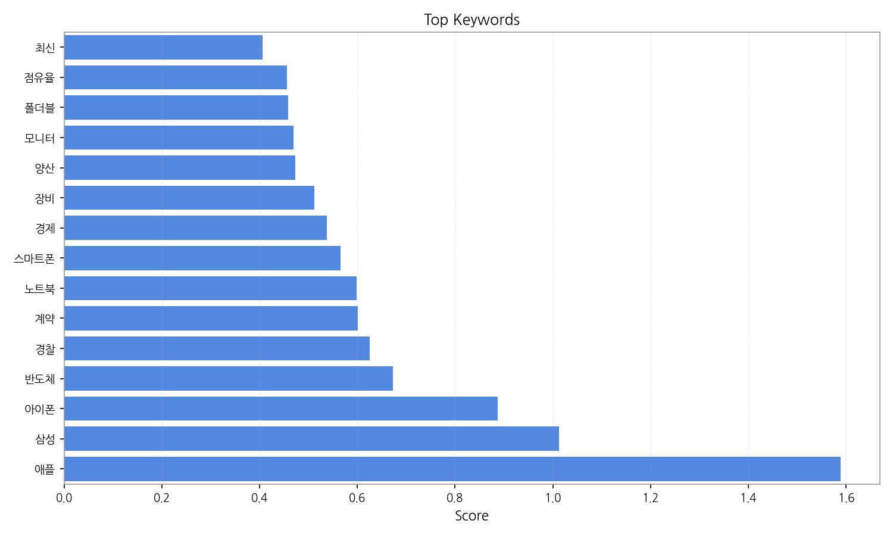
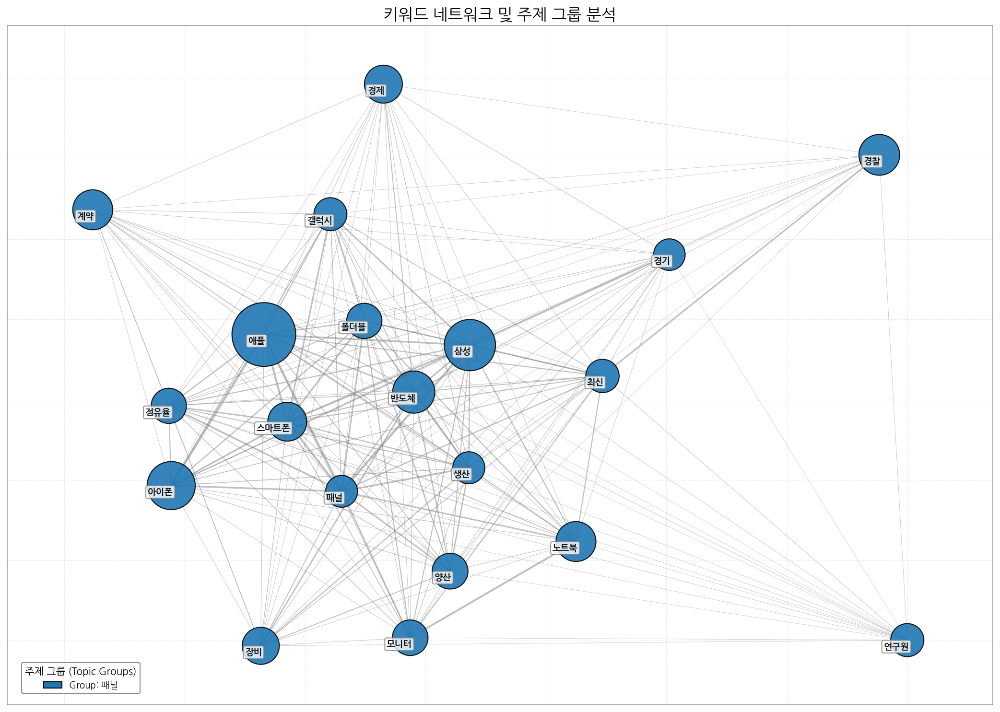

# Weekly/New Biz Report (2025-10-08)

## Executive Summary

- 이번 기간 핵심 토픽과 키워드, 주요 시사점을 요약합니다.

## 데일리 인텔리전스 브리핑 (디스플레이 산업)

**1. 핵심 맥락:**

*   **AI 기반 디스플레이 기술 경쟁 심화:** OLED, RGB, 마이크로 LED 등 차세대 디스플레이 기술에 AI를 접목하여 화질 개선, 전력 효율 향상, 사용자 경험 최적화 등 다양한 분야에서 경쟁이 가속화되고 있습니다. 특히, AI 제트 청소기 관련 토픽에서 보듯이, 디스플레이 외 가전 제품에도 AI 기술이 융합되면서 디스플레이의 역할이 더욱 중요해지고 있습니다.
*   **중국 디스플레이 산업의 성장과 견제:** 중국은 OLED 기술을 중심으로 디스플레이 산업에서 빠르게 성장하고 있으며, 미국을 포함한 글로벌 기업들과의 경쟁이 심화되고 있습니다. 이는 디스플레이 기술 패권 경쟁으로 이어질 가능성이 높습니다.

**2. 최근 변화/스파이크:**

*   **2025년 9월 30일 및 10월 1일 기사 수 급증:** 이 기간 동안 기사 수가 급격히 증가한 것은 애플, 삼성, 아이폰, 스마트폰 등 키워드를 통해 유추해 볼 때, 새로운 스마트폰 모델 출시와 관련된 대규모 발표 또는 시장 반응 때문일 가능성이 높습니다. 특히, 새로운 디스플레이 기술(OLED, RGB 등)이 적용된 스마트폰 출시와 관련된 내용일 가능성이 높으며, 반도체 수급 관련 이슈도 함께 부각되었을 수 있습니다. 10월 7일 또한 기사수가 급증했는데, 이는 스마트폰 출시 이후 시장 반응 및 판매량 관련 기사가 증가했기 때문으로 추정됩니다.

**3. 실무 인사이트:**

*   **AI 기반 디스플레이 기술 개발 로드맵 구체화:** AI 알고리즘을 활용한 화질 개선, 전력 효율 최적화, 사용자 맞춤형 디스플레이 기술 개발에 집중하고, 관련 특허 확보 및 기술 표준 선점을 위한 노력을 강화해야 합니다.
*   **중국 시장 진출 전략 재검토:** 중국 디스플레이 시장의 경쟁 환경 변화에 대한 지속적인 모니터링과 함께, 현지 기업과의 협력, 차별화된 기술 및 제품 개발, 지적 재산권 보호 강화 등 다각적인 전략을 수립해야 합니다.
*   **스마트폰 외 다양한 디바이스로의 디스플레이 확장:** AI 기술이 융합된 가전 제품, 차량용 디스플레이, AR/VR 기기 등 새로운 시장 기회를 발굴하고, 해당 시장에 적합한 디스플레이 기술 및 제품 개발에 투자해야 합니다.

## Key Metrics

- 기간: 2025-09-08 ~ 2025-10-07
- 총 기사 수: 2,743
- 문서 수: N/A
- 키워드 수(상위): 15
- 토픽 수: 9
- 시계열 데이터 일자 수: 30

## Top Keywords

| Rank | Keyword | Score |
|---:|---|---:|
| 1 | 애플 | 1.589 |
| 2 | 삼성 | 1.012 |
| 3 | 아이폰 | 0.887 |
| 4 | 반도체 | 0.673 |
| 5 | 경찰 | 0.626 |
| 6 | 계약 | 0.601 |
| 7 | 노트북 | 0.598 |
| 8 | 스마트폰 | 0.566 |
| 9 | 경제 | 0.538 |
| 10 | 장비 | 0.512 |
| 11 | 양산 | 0.473 |
| 12 | 모니터 | 0.469 |
| 13 | 폴더블 | 0.459 |
| 14 | 점유율 | 0.456 |
| 15 | 최신 | 0.406 |

## Topics

- ai, oled, rgb (#0)
  - 대표 단어: ai, oled, rgb, tv, 디스플레이, 마이크로
- oled, ai, 디스플레이 (#1)
  - 대표 단어: oled, ai, 디스플레이, 기술, 반도체, rgb
- 추석, kt, 인사를 (#2)
  - 대표 단어: 추석, kt, 인사를, will, 인사, said
- 청소기, 무선, 청소 (#3)
  - 대표 단어: 청소기, 무선, 청소, 제트, 비스포크, ai 제트
- nc, 삼성은, 삼성 (#4)
  - 대표 단어: nc, 삼성은, 삼성, 시즌, 와일드카드, 선발
- 괴수, 스팀, 8호 (#5)
  - 대표 단어: 괴수, 스팀, 8호, 괴수 8호, 게임, 정식
- 주주, 평균, 상장사 (#6)
  - 대표 단어: 주주, 평균, 상장사, 1인당, 미만, 시가총액
- race, vision, 추적 (#7)
  - 대표 단어: race, vision, 추적, 말을, 경주, ai는
- 최고, 충남, 전용 (#8)
  - 대표 단어: 최고, 충남, 전용, 0대, 1을, 인근

## 기업×토픽 집중도 매트릭스 (주간)

**핵심 요약:**

- **가장 경쟁이 치열한 토픽:** **ai, oled** (가장 많은 기업들이 주목)

- **가장 집중도가 높은 기업:** **삼성전자** (다양한 토픽에 걸쳐 높은 관련성)

- **주목할 만한 조합:** **삼성전자 @ topic_1** (가장 높은 단일 연관 점수 기록)

각 기업별 상위 8개 토픽의 연관 점수와 해당 토픽 내에서의 점유율(%)을 나타냅니다.

| org           | topic_0       | topic_1       | topic_2      | topic_3      | topic_4      | topic_5     | topic_6      | topic_7      | topic_8      |
|:--------------|:--------------|:--------------|:-------------|:-------------|:-------------|:------------|:-------------|:-------------|:-------------|
| AMD           | 85.20 (1%)    | 95.51 (1%)    | 9.35 (1%)    | 26.85 (2%)   | nan          | 11.46 (2%)  | 22.29 (2%)   | 3.88 (1%)    | 11.52 (1%)   |
| ASUS          | 51.53 (1%)    | 69.40 (1%)    | nan          | 8.95 (1%)    | 2.71 (0%)    | 11.46 (2%)  | 1.78 (0%)    | 3.10 (1%)    | 11.52 (1%)   |
| Acer          | 41.23 (1%)    | 59.78 (1%)    | nan          | 8.95 (1%)    | 1.80 (0%)    | 8.81 (1%)   | 0.89 (0%)    | 3.10 (1%)    | 9.21 (1%)    |
| BMW           | 22.67 (0%)    | 28.86 (0%)    | 1.87 (0%)    | 5.97 (0%)    | 0.90 (0%)    | 5.29 (1%)   | nan          | 3.88 (1%)    | 4.61 (0%)    |
| BOE           | 285.15 (4%)   | 290.65 (4%)   | 14.96 (2%)   | 9.70 (1%)    | 9.92 (1%)    | nan         | 15.15 (1%)   | 11.63 (2%)   | 23.03 (2%)   |
| BYD           | 43.97 (1%)    | 46.72 (1%)    | nan          | 8.20 (1%)    | nan          | 4.41 (1%)   | 11.59 (1%)   | 6.20 (1%)    | 10.75 (1%)   |
| CES           | 127.80 (2%)   | 151.85 (2%)   | 3.74 (0%)    | 9.70 (1%)    | 7.22 (1%)    | 6.17 (1%)   | nan          | 6.20 (1%)    | 23.03 (2%)   |
| CSOT          | 90.01 (1%)    | 87.95 (1%)    | 1.87 (0%)    | 2.24 (0%)    | 0.90 (0%)    | nan         | 1.78 (0%)    | 3.10 (1%)    | 7.68 (1%)    |
| Counterpoint  | 3.44 (0%)     | 3.44 (0%)     | 1.87 (0%)    | 1.49 (0%)    | 0.90 (0%)    | nan         | nan          | nan          | nan          |
| Dell          | 42.60 (1%)    | 59.09 (1%)    | 2.80 (0%)    | 8.20 (1%)    | 1.80 (0%)    | 8.81 (1%)   | nan          | 3.10 (1%)    | 9.21 (1%)    |
| ETRI          | 19.93 (0%)    | 27.48 (0%)    | 4.67 (1%)    | nan          | nan          | nan         | nan          | 0.78 (0%)    | 0.77 (0%)    |
| HMI           | 0.69 (0%)     | 1.37 (0%)     | nan          | 0.75 (0%)    | nan          | 0.88 (0%)   | nan          | 0.78 (0%)    | 0.77 (0%)    |
| HP            | 86.58 (1%)    | 126.43 (2%)   | 2.80 (0%)    | 13.42 (1%)   | 9.02 (1%)    | 17.62 (3%)  | nan          | 5.43 (1%)    | 16.89 (2%)   |
| Harman        | 11.68 (0%)    | 17.86 (0%)    | nan          | 4.47 (0%)    | 0.90 (0%)    | 3.52 (1%)   | 4.46 (0%)    | nan          | 1.54 (0%)    |
| IEC           | 2.75 (0%)     | 2.06 (0%)     | nan          | nan          | nan          | nan         | nan          | nan          | nan          |
| IMID          | 45.35 (1%)    | 50.85 (1%)    | 7.48 (1%)    | 3.73 (0%)    | nan          | nan         | nan          | 0.78 (0%)    | 1.54 (0%)    |
| ITU           | 54.28 (1%)    | 46.04 (1%)    | 3.74 (0%)    | 8.95 (1%)    | 1.80 (0%)    | nan         | nan          | 2.33 (0%)    | 0.77 (0%)    |
| IoT           | 60.47 (1%)    | 71.46 (1%)    | nan          | 23.12 (2%)   | 5.41 (1%)    | 10.57 (2%)  | 7.13 (1%)    | 9.30 (2%)    | 16.12 (2%)   |
| JDI           | 19.93 (0%)    | 26.11 (0%)    | 0.93 (0%)    | 2.98 (0%)    | nan          | nan         | 0.89 (0%)    | 0.78 (0%)    | 3.07 (0%)    |
| KAIST         | 26.11 (0%)    | 33.67 (0%)    | 3.74 (0%)    | 4.47 (0%)    | nan          | 3.52 (1%)   | 1.78 (0%)    | 3.88 (1%)    | 7.68 (1%)    |
| LG디스플레이       | 600.53 (9%)   | 667.87 (9%)   | 40.20 (5%)   | 36.54 (3%)   | 17.14 (2%)   | nan         | 141.74 (11%) | 37.22 (7%)   | 64.49 (7%)   |
| LG전자          | 485.10 (7%)   | 508.46 (7%)   | 144.92 (19%) | 96.21 (7%)   | 267.86 (31%) | 53.75 (8%)  | 159.56 (12%) | nan          | 61.42 (7%)   |
| LG화학          | 46.72 (1%)    | 57.03 (1%)    | 19.63 (3%)   | 11.19 (1%)   | 2.71 (0%)    | nan         | 119.45 (9%)  | 4.65 (1%)    | 4.61 (0%)    |
| MWC           | 6.18 (0%)     | 5.50 (0%)     | nan          | 0.75 (0%)    | 1.80 (0%)    | 0.88 (0%)   | nan          | 0.78 (0%)    | 1.54 (0%)    |
| Merck         | 3.44 (0%)     | 4.12 (0%)     | 4.67 (1%)    | nan          | nan          | nan         | nan          | 0.78 (0%)    | 0.77 (0%)    |
| SEMI          | 1.37 (0%)     | 2.06 (0%)     | nan          | 0.75 (0%)    | nan          | nan         | 0.89 (0%)    | nan          | nan          |
| SID           | 72.83 (1%)    | 98.94 (1%)    | nan          | nan          | 0.90 (0%)    | 1.76 (0%)   | nan          | 0.78 (0%)    | 19.96 (2%)   |
| SK하이닉스        | 133.99 (2%)   | 177.96 (2%)   | 32.72 (4%)   | 34.31 (3%)   | 18.04 (2%)   | 14.98 (2%)  | 20.50 (2%)   | nan          | 21.50 (2%)   |
| Semiconductor | 10.99 (0%)    | 15.80 (0%)    | 1.87 (0%)    | 2.24 (0%)    | 1.80 (0%)    | 0.88 (0%)   | 5.35 (0%)    | nan          | 0.77 (0%)    |
| TCL           | 112.00 (2%)   | 97.57 (1%)    | 6.54 (1%)    | 12.68 (1%)   | 6.31 (1%)    | nan         | 1.78 (0%)    | 7.75 (1%)    | 2.30 (0%)    |
| TSMC          | 30.23 (0%)    | 35.73 (0%)    | nan          | 11.93 (1%)   | 3.61 (0%)    | 3.52 (1%)   | 15.15 (1%)   | 3.88 (1%)    | 4.61 (0%)    |
| Tianma        | 24.05 (0%)    | 21.30 (0%)    | 1.87 (0%)    | 0.75 (0%)    | nan          | nan         | nan          | nan          | nan          |
| UDC           | 8.93 (0%)     | 7.56 (0%)     | nan          | nan          | nan          | nan         | nan          | 1.55 (0%)    | nan          |
| UL            | 64.59 (1%)    | 59.09 (1%)    | 4.67 (1%)    | 11.19 (1%)   | 1.80 (0%)    | nan         | 2.67 (0%)    | 2.33 (0%)    | 2.30 (0%)    |
| V2X           | 22.67 (0%)    | 26.80 (0%)    | nan          | 5.22 (0%)    | 2.71 (0%)    | 0.88 (0%)   | 0.89 (0%)    | 4.65 (1%)    | 0.77 (0%)    |
| Visionox      | 20.61 (0%)    | 27.48 (0%)    | 0.93 (0%)    | 0.75 (0%)    | nan          | nan         | nan          | nan          | 2.30 (0%)    |
| 구글            | 190.65 (2%)   | 202.95 (2%)   | 51.61 (5%)   | 70.09 (4%)   | 37.67 (3%)   | 39.44 (4%)  | nan          | 45.11 (5%)   | 32.07 (2%)   |
| 기아            | 69.40 (1%)    | 85.20 (1%)    | 12.15 (2%)   | 9.70 (1%)    | 6.31 (1%)    | nan         | 7.13 (1%)    | 17.06 (3%)   | 13.05 (1%)   |
| 기아차           | 2.06 (0%)     | 1.37 (0%)     | nan          | nan          | nan          | nan         | nan          | nan          | nan          |
| 네이버           | 124.37 (2%)   | 133.99 (2%)   | 36.46 (5%)   | 39.53 (3%)   | 13.53 (2%)   | 26.44 (4%)  | 50.81 (4%)   | nan          | 17.66 (2%)   |
| 두산로보틱스        | 17.18 (0%)    | 21.99 (0%)    | 0.93 (0%)    | 5.97 (0%)    | nan          | 4.41 (1%)   | 119.45 (9%)  | 4.65 (1%)    | 4.61 (0%)    |
| 디지타임스         | 8.93 (0%)     | 8.93 (0%)     | 0.93 (0%)    | 0.75 (0%)    | nan          | nan         | nan          | nan          | 1.54 (0%)    |
| 딥엑스           | 0.69 (0%)     | 1.37 (0%)     | nan          | 0.75 (0%)    | 0.90 (0%)    | nan         | nan          | nan          | nan          |
| 레노버           | 11.68 (0%)    | 13.05 (0%)    | nan          | nan          | nan          | nan         | nan          | 0.78 (0%)    | 3.07 (0%)    |
| 리벨리온          | 5.50 (0%)     | 7.56 (0%)     | 0.93 (0%)    | 1.49 (0%)    | nan          | nan         | nan          | 1.55 (0%)    | 0.77 (0%)    |
| 리오토           | 6.18 (0%)     | 6.18 (0%)     | nan          | 0.75 (0%)    | nan          | nan         | nan          | 0.78 (0%)    | 0.77 (0%)    |
| 마이크로소프트       | 56.34 (1%)    | 57.03 (1%)    | 4.67 (1%)    | 20.88 (2%)   | nan          | 13.22 (2%)  | 18.72 (1%)   | 3.10 (1%)    | 9.21 (1%)    |
| 메타            | 81.77 (1%)    | 83.83 (1%)    | 7.48 (1%)    | 30.58 (2%)   | nan          | 14.10 (2%)  | 16.05 (1%)   | 17.83 (3%)   | 13.82 (1%)   |
| 미디어텍          | 15.12 (0%)    | 13.05 (0%)    | nan          | 4.47 (0%)    | 1.80 (0%)    | nan         | 0.89 (0%)    | 1.55 (0%)    | 3.07 (0%)    |
| 바이두           | 5.50 (0%)     | 5.50 (0%)     | nan          | 1.49 (0%)    | nan          | 0.88 (0%)   | 0.89 (0%)    | 0.78 (0%)    | nan          |
| 벤츠            | 15.12 (0%)    | 20.61 (0%)    | 2.80 (0%)    | 2.24 (0%)    | 2.71 (0%)    | 4.41 (1%)   | nan          | 2.33 (0%)    | 6.14 (1%)    |
| 비보            | 32.98 (0%)    | 35.73 (0%)    | nan          | 1.49 (0%)    | 1.80 (0%)    | nan         | nan          | 0.78 (0%)    | 0.77 (0%)    |
| 삼성디스플레이       | 764.75 (11%)  | 937.21 (12%)  | 31.79 (4%)   | 60.41 (5%)   | 44.19 (5%)   | 81.07 (13%) | 31.20 (2%)   | nan          | 161.23 (17%) |
| 삼성전자          | 1822.63 (16%) | 1883.60 (15%) | 134.82 (11%) | 579.07 (27%) | 228.66 (17%) | nan         | 368.68 (18%) | 152.36 (17%) | 192.22 (13%) |
| 샤오미           | 97.64 (1%)    | 90.38 (1%)    | 2.20 (0%)    | 12.26 (1%)   | 7.41 (1%)    | nan         | 4.19 (0%)    | 7.28 (1%)    | 7.21 (1%)    |
| 샤오펑           | 7.56 (0%)     | 9.62 (0%)     | nan          | 1.49 (0%)    | nan          | 0.88 (0%)   | nan          | 1.55 (0%)    | 3.07 (0%)    |
| 샤프            | 12.37 (0%)    | 10.99 (0%)    | nan          | 0.75 (0%)    | 1.80 (0%)    | 1.76 (0%)   | nan          | 0.78 (0%)    | 3.07 (0%)    |
| 선익시스템         | 12.37 (0%)    | 17.18 (0%)    | nan          | nan          | nan          | nan         | nan          | nan          | nan          |
| 세미파이브         | 4.12 (0%)     | 3.44 (0%)     | 1.87 (0%)    | 1.49 (0%)    | nan          | 0.88 (0%)   | nan          | 0.78 (0%)    | nan          |
| 소니            | 26.80 (0%)    | 28.17 (0%)    | 1.87 (0%)    | 3.73 (0%)    | 1.80 (0%)    | 0.88 (0%)   | nan          | 1.55 (0%)    | 1.54 (0%)    |
| 아마존           | 32.98 (0%)    | 28.86 (0%)    | 3.74 (0%)    | 10.44 (1%)   | 1.80 (0%)    | 4.41 (1%)   | 8.91 (1%)    | nan          | 6.14 (1%)    |
| 아이씨디          | 19.24 (0%)    | 28.17 (0%)    | nan          | 1.49 (0%)    | nan          | nan         | nan          | nan          | 1.54 (0%)    |
| 알파벳           | 29.55 (0%)    | 28.86 (0%)    | 2.80 (0%)    | 13.42 (1%)   | nan          | 5.29 (1%)   | 16.05 (1%)   | 0.78 (0%)    | 7.68 (1%)    |
| 애플            | 1356.49 (9%)  | 1318.10 (8%)  | 114.16 (7%)  | 250.02 (9%)  | nan          | 125.83 (9%) | 151.27 (6%)  | 109.11 (9%)  | 141.40 (7%)  |
| 엔비디아          | 145.86 (2%)   | 163.63 (2%)   | 16.54 (2%)   | 46.68 (3%)   | nan          | 21.58 (2%)  | 50.95 (3%)   | 12.66 (2%)   | 24.03 (2%)   |
| 오포            | 32.29 (0%)    | 35.73 (0%)    | nan          | 3.73 (0%)    | 1.80 (0%)    | 0.88 (0%)   | 0.89 (0%)    | 1.55 (0%)    | 3.07 (0%)    |
| 원익IPS         | 17.18 (0%)    | 26.80 (0%)    | nan          | 1.49 (0%)    | nan          | nan         | 0.89 (0%)    | 3.10 (1%)    | 0.77 (0%)    |
| 인텔            | 102.38 (1%)   | 142.23 (2%)   | nan          | 19.39 (1%)   | 10.82 (1%)   | 18.51 (3%)  | 5.35 (0%)    | 7.75 (1%)    | 22.26 (2%)   |
| 카카오           | 37.79 (1%)    | 47.41 (1%)    | 14.96 (2%)   | 14.17 (1%)   | nan          | 12.34 (2%)  | 8.02 (1%)    | 3.88 (1%)    | 6.14 (1%)    |
| 퀄컴            | 94.57 (1%)    | 103.95 (1%)   | 10.43 (1%)   | 26.82 (2%)   | 14.54 (1%)   | 12.02 (2%)  | nan          | 18.27 (3%)   | 8.57 (1%)    |
| 텐센트           | 7.56 (0%)     | 6.87 (0%)     | nan          | 2.24 (0%)    | nan          | 0.88 (0%)   | 0.89 (0%)    | 0.78 (0%)    | nan          |
| 폭스바겐          | 15.12 (0%)    | 21.99 (0%)    | nan          | 2.98 (0%)    | 2.71 (0%)    | 3.52 (1%)   | 1.78 (0%)    | 1.55 (0%)    | 3.84 (0%)    |
| 하이센스          | 78.33 (1%)    | 71.46 (1%)    | 1.87 (0%)    | 9.70 (1%)    | 7.22 (1%)    | nan         | 1.78 (0%)    | 6.98 (1%)    | 3.07 (0%)    |
| 하이얼           | 20.61 (0%)    | 17.86 (0%)    | nan          | 4.47 (0%)    | 0.90 (0%)    | 0.88 (0%)   | nan          | 3.10 (1%)    | 0.77 (0%)    |
| 한미반도체         | 21.30 (0%)    | 32.29 (0%)    | nan          | 5.22 (0%)    | nan          | 2.64 (0%)   | 2.67 (0%)    | 4.65 (1%)    | 1.54 (0%)    |
| 한화            | 58.40 (1%)    | 61.15 (1%)    | 41.14 (5%)   | 11.93 (1%)   | 96.50 (11%)  | 32.60 (5%)  | 4.46 (0%)    | nan          | 7.68 (1%)    |
| 한화솔루션         | 4.81 (0%)     | 5.50 (0%)     | nan          | nan          | nan          | nan         | 0.89 (0%)    | nan          | nan          |
| 한화시스템         | 28.86 (0%)    | 40.54 (1%)    | 1.87 (0%)    | 13.42 (1%)   | 2.71 (0%)    | nan         | 3.57 (0%)    | 5.43 (1%)    | 3.07 (0%)    |
| 현대모비스         | 70.74 (1%)    | 105.57 (1%)   | 28.14 (2%)   | 14.18 (1%)   | 32.86 (2%)   | nan         | 145.44 (7%)  | 12.28 (1%)   | 19.46 (1%)   |
| 현대자동차         | 46.04 (1%)    | 58.40 (1%)    | 10.28 (1%)   | 18.64 (1%)   | nan          | 4.41 (1%)   | 6.24 (0%)    | 4.65 (1%)    | 7.68 (1%)    |
| 현대차           | 112.00 (2%)   | 136.05 (2%)   | 30.85 (4%)   | 25.36 (2%)   | nan          | 9.69 (2%)   | 11.59 (1%)   | 20.94 (4%)   | 19.19 (2%)   |
| 화웨이           | 73.50 (1%)    | 63.00 (1%)    | nan          | 8.55 (1%)    | 14.93 (1%)   | 7.85 (1%)   | 1.14 (0%)    | 3.95 (1%)    | 5.87 (0%)    |

**코멘트 및 액션 힌트:**

> 특정 토픽에서 높은 점유율을 보이는 기업은 해당 분야의 '주도자(Leader)'일 가능성이 높습니다. 반면, 특정 기업이 소수의 토픽에 높은 점수를 집중하고 있다면, 이는 해당 기업의 '핵심 전략 분야'를 시사합니다. 경쟁사 및 파트너사의 집중 분야를 파악하여 우리의 전략을 점검해볼 수 있습니다.

## 기업×토픽 시각적 분석

### 전체 시장 구도 (Heatmap)

> 전체 기업과 토픽 간의 관계를 한눈에 보여줍니다. 색이 진할수록 연관성이 높습니다.

### 주요 토픽별 경쟁 구도 (Pie Charts)

> 가장 뜨거운 주제를 두고 어떤 기업들이 경쟁하는지 점유율을 보여줍니다.

### 주요 기업별 전략 분석 (Bar Charts)

> 시장을 주도하는 주요 기업들이 어떤 토픽에 집중하고 있는지 보여줍니다.

## 관계·경쟁 심화 분석

**핵심 요약**

- **관계망 규모:** 노드 46개 / 엣지 241개

- **가장 강한 관계:** 삼성디스플레이 ↔ 삼성전자 (가중치 166, 유형 rivalry)

- **허브 후보:** 삼성전자 (Degree 0.7333)

- **브로커 후보:** 삼성전자 (Betweenness 0.1742)

### 상위 관계쌍(Edge)

> 동일 문서/문장 내에서 함께 언급된 기업 쌍이며, 가중치는 동시출현 빈도입니다. 값이 높을수록 상호 관련성이 강하고, 유형은 키워드 규칙으로 경쟁/협력/중립을 추정합니다.

| Source   | Target   |   Weight | Type    |
|:---------|:---------|---------:|:--------|
| 삼성디스플레이  | 삼성전자     |      166 | rivalry |
| 삼성전자     | 애플       |      165 | rivalry |
| 삼성디스플레이  | 애플       |      141 | rivalry |
| 구글       | 애플       |       80 | rivalry |
| 애플       | 엔비디아     |       79 | neutral |
| LG전자     | 삼성전자     |       72 | rivalry |
| 메타       | 애플       |       52 | rivalry |
| 삼성전자     | 현대차      |       50 | rivalry |
| 알파벳      | 애플       |       47 | rivalry |
| 알파벳      | 엔비디아     |       44 | rivalry |

### 중심성 상위(연결 허브)

> Degree 중심성은 한 노드가 연결된 상대 수의 비율로, 값이 높을수록 다수의 기업과 직접 연결된 허브 성격을 가집니다. 허브는 이슈 확산과 정보 접근성이 높습니다.

| Org     |   DegreeCentrality |
|:--------|-------------------:|
| 삼성전자    |             0.7333 |
| 애플      |             0.6444 |
| 삼성디스플레이 |             0.6    |
| 구글      |             0.5333 |
| 현대차     |             0.5111 |
| LG전자    |             0.4889 |
| 네이버     |             0.4889 |
| 기아      |             0.4667 |
| 샤오미     |             0.4444 |
| 마이크로소프트 |             0.4222 |

### 매개 중심성 상위(정보 브로커)

> Betweenness는 네트워크 경로의 ‘다리’ 역할 정도를 의미합니다. 값이 높을수록 서로 다른 집단을 연결하는 중개자(브로커)로 해석되며, 거래·협상력과 정보 흐름 장악력이 큽니다.

| Org     |   Betweenness |
|:--------|--------------:|
| 삼성전자    |        0.1742 |
| 삼성디스플레이 |        0.1556 |
| 애플      |        0.0816 |
| 마이크로소프트 |        0.053  |
| 현대차     |        0.0522 |
| 샤오미     |        0.0499 |
| 기아      |        0.0417 |
| 구글      |        0.0327 |
| LG전자    |        0.0301 |
| 퀄컴      |        0.0191 |

### 커뮤니티(관계 클러스터)

> 모듈러리티 기반으로 자동 추출한 관계 집단입니다. 같은 집단 내 기업들은 유사 주제나 공급망 활동을 공유할 가능성이 높습니다.

- C0: LG전자, 디지타임스, 레노버, 리벨리온, 미디어텍, 비보 | 해석: LG전자 중심의 연관 클러스터
- C1: 기아, 기아차, 네이버, 두산로보틱스, 리오토, 벤츠 | 해석: 기아 중심의 연관 클러스터
- C2: 구글, 마이크로소프트, 메타, 바이두, 아마존, 알파벳 | 해석: 구글 중심의 연관 클러스터
- C3: 선익시스템, 아이씨디 | 해석: 선익시스템 중심의 연관 클러스터
- C4: 딥엑스 | 해석: 딥엑스 중심의 연관 클러스터

### 네트워크 시각화

> 동시출현이 높은 쌍은 직접 경쟁 또는 공급망 핵심 협력 가능성을 시사하며, 허브/브로커는 시장 영향력 및 중개 포지션을 의미합니다. 커뮤니티는 전략·밸류체인 단위의 동조 클러스터일 수 있습니다.

## Trend

- 최근 기사 수 추세와 7일 이동평균선을 제공합니다.

## Insights

## 데일리 인텔리전스 브리핑 (디스플레이 산업)

**1. 핵심 맥락:**

*   **AI 기반 디스플레이 기술 경쟁 심화:** OLED, RGB, 마이크로 LED 등 차세대 디스플레이 기술에 AI를 접목하여 화질 개선, 전력 효율 향상, 사용자 경험 최적화 등 다양한 분야에서 경쟁이 가속화되고 있습니다. 특히, AI 제트 청소기 관련 토픽에서 보듯이, 디스플레이 외 가전 제품에도 AI 기술이 융합되면서 디스플레이의 역할이 더욱 중요해지고 있습니다.
*   **중국 디스플레이 산업의 성장과 견제:** 중국은 OLED 기술을 중심으로 디스플레이 산업에서 빠르게 성장하고 있으며, 미국을 포함한 글로벌 기업들과의 경쟁이 심화되고 있습니다. 이는 디스플레이 기술 패권 경쟁으로 이어질 가능성이 높습니다.

**2. 최근 변화/스파이크:**

*   **2025년 9월 30일 및 10월 1일 기사 수 급증:** 이 기간 동안 기사 수가 급격히 증가한 것은 애플, 삼성, 아이폰, 스마트폰 등 키워드를 통해 유추해 볼 때, 새로운 스마트폰 모델 출시와 관련된 대규모 발표 또는 시장 반응 때문일 가능성이 높습니다. 특히, 새로운 디스플레이 기술(OLED, RGB 등)이 적용된 스마트폰 출시와 관련된 내용일 가능성이 높으며, 반도체 수급 관련 이슈도 함께 부각되었을 수 있습니다. 10월 7일 또한 기사수가 급증했는데, 이는 스마트폰 출시 이후 시장 반응 및 판매량 관련 기사가 증가했기 때문으로 추정됩니다.

**3. 실무 인사이트:**

*   **AI 기반 디스플레이 기술 개발 로드맵 구체화:** AI 알고리즘을 활용한 화질 개선, 전력 효율 최적화, 사용자 맞춤형 디스플레이 기술 개발에 집중하고, 관련 특허 확보 및 기술 표준 선점을 위한 노력을 강화해야 합니다.
*   **중국 시장 진출 전략 재검토:** 중국 디스플레이 시장의 경쟁 환경 변화에 대한 지속적인 모니터링과 함께, 현지 기업과의 협력, 차별화된 기술 및 제품 개발, 지적 재산권 보호 강화 등 다각적인 전략을 수립해야 합니다.
*   **스마트폰 외 다양한 디바이스로의 디스플레이 확장:** AI 기술이 융합된 가전 제품, 차량용 디스플레이, AR/VR 기기 등 새로운 시장 기회를 발굴하고, 해당 시장에 적합한 디스플레이 기술 및 제품 개발에 투자해야 합니다.

## 주요 시그널 분석 (Key Signal Analysis)

### 강한 신호 (Strong Signals)

> 최근 뉴스에서 가장 주목받은 상위 키워드들입니다.

|   순위 | 강한 신호 (Term)   |   최근 언급량 (cur) |   임팩트 (z_like) |
|-----:|:---------------|---------------:|---------------:|
|    1 | amd            |             28 |          7.86  |
|    2 | 애플             |             33 |          5.097 |
|    3 | 삼성전자           |              9 |          2.673 |
|    4 | 현대모비스          |              6 |          2.67  |
|    5 | 구글             |              6 |          2.209 |
|    6 | 엔비디아           |              3 |          1.554 |
|    7 | 에릭슨            |              2 |          1.117 |
|    8 | 화웨이            |              2 |          1.117 |
|    9 | 갤럭시            |              4 |          0.99  |
|   10 | 퀄컴             |              2 |          0.95  |

### 약한 신호 (Weak Signals)

> 총 언급량은 적지만 최근 급부상하여 미래가 기대되는 '틈새 키워드'들입니다.

| 약한 신호 (Signal)   | 지표 (cur / z_like)   | LLM의 1줄 요약 (Interpretation)                                                                                                                  |
|:-----------------|:--------------------|:---------------------------------------------------------------------------------------------------------------------------------------------|
| amd              | 28 / 7.86           | 제공된 참고 문장이 없어 'amd'가 무엇을 의미하는지, 어떤 맥락에서 등장했는지, 미래 잠재력이 무엇인지 정확히 파악할 수 없지만, 추가 정보가 있다면 더 자세한 분석이 가능합니다.                                       |
| 현대모비스            | 6 / 2.67            | 현대모비스는 차량용 반도체 부족 및 해외 의존도 심화에 대응하여 민간 주도 차량용 반도체 협력 기구 'ASK'를 출범, 팹리스 역할 수행을 통해 차량용 반도체 국산화 및 공급망 안정화, 미래 시장 선점의 잠재력을 모색하고 있다.              |
| 구글               | 6 / 2.21            | 삼성전자 XR 기기 개발 협력, 제미나이 LLM 기반 AI 에이전트 탑재 가능성, 그리고 안드로이드 기반 UI 업데이트 등을 고려할 때, '구글'은 삼성전자 제품 및 서비스에 구글의 기술 및 플랫폼이 광범위하게 통합되고 있음을 나타내는 약한 신호이다. |
| 엔비디아             | 3 / 1.55            | -                                                                                                                                            |
| 에릭슨              | 2 / 1.12            | -                                                                                                                                            |
| 화웨이              | 2 / 1.12            | -                                                                                                                                            |
| 갤럭시              | 4 / 0.99            | -                                                                                                                                            |
| 퀄컴               | 2 / 0.95            | -                                                                                                                                            |

## 기술 성숙도 분석 (Technology Maturity Analysis)

> 각 기술의 시장 내 위치(X축: 관심도, Y축: 긍정성)와 사업 활발도(버블 크기)를 보여줍니다.

| 기술 (Technology) | 성숙도 단계 (Stage) | 판단 근거 (Rationale) |
|:---|:---|:---|
| 양산 | **Growth** | 높은 시장 감성 점수와 투자, 출시, 수주 이벤트가 꾸준히 발생하고 있는 것으로 보아 성장기에 접어든 기술로 판단됩니다. |
| 폴더블 | **Growth** | 높은 시장 감성 점수와 활발한 출시 및 투자 활동은 폴더블 기술이 성장기에 진입했음을 시사합니다. |
| 삼성 | **Growth** | 높은 뉴스 언급 빈도, 긍정적인 시장 감성, 그리고 활발한 출시와 투자 활동이 삼성 기술이 성장기에 있음을 시사합니다. |
| 애플 | **Maturity** | 높은 뉴스 언급 빈도와 긍정적인 시장 감성, 그리고 출시 이벤트의 압도적인 비율로 보아 애플 기술은 성숙 단계에 접어든 것으로 판단됩니다. |
| 패널 | **Growth** | 뉴스 언급은 적지만 긍정적인 시장 감성과 출시 및 투자 이벤트가 활발한 것으로 보아 성장기에 해당한다고 판단됩니다. |

## 포착된 약한 신호 및 해석 (Emerging Signals & Interpretation)

- **amd**
  - **해석:** 제공된 참고 문장이 없어 'amd'가 무엇을 의미하는지, 어떤 맥락에서 등장했는지, 미래 잠재력이 무엇인지 정확히 파악할 수 없지만, 추가 정보가 있다면 더 자세한 분석이 가능합니다.
- **현대모비스**
  - **해석:** 현대모비스는 차량용 반도체 부족 및 해외 의존도 심화에 대응하여 민간 주도 차량용 반도체 협력 기구 'ASK'를 출범, 팹리스 역할 수행을 통해 차량용 반도체 국산화 및 공급망 안정화, 미래 시장 선점의 잠재력을 모색하고 있다.
- **구글**
  - **해석:** 삼성전자 XR 기기 개발 협력, 제미나이 LLM 기반 AI 에이전트 탑재 가능성, 그리고 안드로이드 기반 UI 업데이트 등을 고려할 때, '구글'은 삼성전자 제품 및 서비스에 구글의 기술 및 플랫폼이 광범위하게 통합되고 있음을 나타내는 약한 신호이다.

## Opportunities (Top 5)

| Idea | Target | Value Prop | Score (Market / Urgency / Feasibility / Risk) |
|---|---|---|---|
| 애플 | 기업(B2B) | 애플 도입으로 비용/품질/경험을 개선. | 60.0 (0.5 / 0.5 / 0.6 / 0.0) |
| AR/VR 글래스용 초경량·초저전력 Micro-OLED 패널 | 글로벌 AR/VR 기기 제조사 (메타, 애플, 소니 등), 메타버스 플랫폼 기업 | 초경량, 초저전력으로 AR/VR 글래스의 휴대성 및 사용 시간 극대화. 고해상도, 고주사율, 넓은 시야각으로 몰입감 넘치는 AR/VR 경험 제공. 경쟁사 대비 차별화된 디스플레이 기술력 확보 및 AR/VR 디스플레이 시장 선점. | 7.3 (0.95 / 1.0 / 0.5 / 0.15) |
| AI 기반 능동형 번인 보정 알고리즘 | 글로벌 스마트폰 OEM (삼성전자, 애플 등), 프리미엄 TV 제조사 (LG전자, 소니 등), 글로벌 완성차 OEM | 번인 현상 최소화로 디스플레이 수명 연장 및 사용자 경험 극대화. 경쟁사 대비 차별화된 화질 유지 기술 확보 및 프리미엄 제품 이미지 강화. AI 기반의 능동적 보정으로 최적의 디스플레이 성능 유지. | 4.4 (0.62 / 0.551 / 0.45 / 0.21) |
| 차량용 HUD (Head-Up Display)용 초고휘도 MicroLED 패널 | 글로벌 완성차 OEM (BMW, 메르세데스-벤츠, 현대자동차 등), 차량용 전장 부품 제조사 (보쉬, 콘티넨탈 등) | 기존 HUD 대비 월등한 시인성 및 넓은 시야각 제공. 악천후 및 야간 환경에서도 선명한 정보 제공으로 안전 운전 지원. 경쟁사 대비 차별화된 디스플레이 기술력 확보 및 프리미엄 차량용 디스플레이 시장 선점. | 3.3 (0.39 / 0.3 / 0.5 / 0.15) |
| 롤러블 디스플레이 수율 향상을 위한 AI 공정 모니터링 서비스 | 디스플레이 패널 제조사 (삼성디스플레이, LG디스플레이, BOE 등) | AI 기반의 실시간 공정 모니터링 및 결함 예측으로 롤러블 디스플레이 수율 향상 및 생산 비용 절감. 불량 발생 원인 분석 및 공정 최적화를 통해 생산 효율성 극대화. 경쟁사 대비 차별화된 생산 기술력 확보 및 롤러블 디스플레이 시장 경쟁력 강화. | 3.2 (0.4 / 0.3 / 0.55 / 0.21) |

### 📊 아이디어 점수 분포

## Appendix

- 데이터: keywords.json, topics.json, trend_timeseries.json, trend_insights.json, biz_opportunities.json