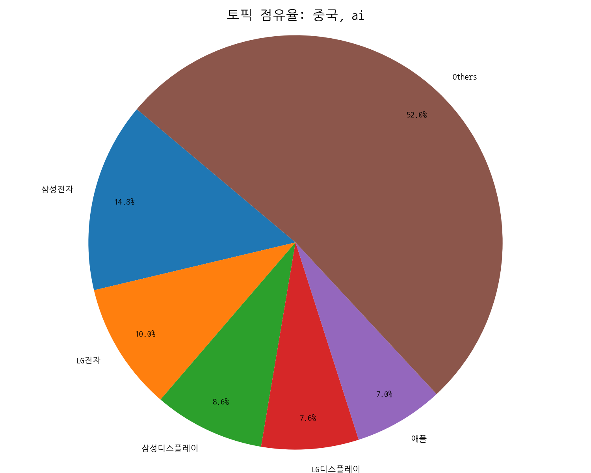

# Weekly/New Biz Report (2025-10-09)

## Executive Summary

- 이번 기간 핵심 토픽과 키워드, 주요 시사점을 요약합니다.

## 데일리 인텔리전스 브리핑

**1. 핵심 맥락:**

*   **OLED 기술 경쟁 심화 및 적용 분야 확대:** OLED는 디스플레이 시장의 핵심 기술로 자리매김하고 있으며, 삼성디스플레이를 중심으로 사이니지, 차량용 디스플레이, 게이밍 등 다양한 분야로 적용이 확대되고 있습니다. 특히 미국 시장에서 OLED와 AI 기술의 결합이 차량용 디스플레이 및 모빌리티 분야에서 중요한 트렌드로 부상하고 있습니다.
*   **AI 기술 경쟁 심화 및 디스플레이 융합 가속화:** AI는 디스플레이 산업 전반에 걸쳐 중요한 역할을 수행하고 있으며, 특히 중국 시장에서 AI와 반도체 기술을 결합한 디스플레이 기술 개발 경쟁이 치열합니다. 또한, AI는 새로운 디스플레이 기능 개발, 시니어 맞춤형 TV, SNS 마케팅 등 다양한 분야에서 활용되고 있습니다.

**2. 최근 변화/스파이크:**

*   **2025년 09월 20일, 09월 26일, 09월 30일, 10월 01일, 10월 08일 기사 수 급증:** 해당 날짜에 기사 수가 급증한 것은 AI 기술과 디스플레이 기술의 융합, 특히 OLED와 Micro LED 기술 관련 발표 및 시장 경쟁 심화와 관련된 것으로 추론됩니다. 10월 1일과 8일의 급증은 특정 기술 발표 또는 대규모 계약 발표와 관련되었을 가능성이 높습니다.

**3. 실무 인사이트:**

*   **OLED 기술 포트폴리오 다변화:** 차량용, 사이니지, 게이밍 등 특정 시장에 특화된 OLED 기술 개발 및 사업 확대를 추진하고, AI 기술과의 융합을 통해 차별화된 사용자 경험을 제공하는 제품 개발에 집중해야 합니다.
*   **AI 기반 디스플레이 기술 경쟁력 강화:** AI 기반 화질 개선, 사용자 인터페이스 최적화, 콘텐츠 추천 등 다양한 분야에서 AI 기술을 활용하여 디스플레이 경쟁력을 강화하고, 중국 시장의 AI 기반 디스플레이 기술 개발 동향을 지속적으로 모니터링해야 합니다.
*   **Micro LED 기술 상용화 준비:** Micro LED 기술은 차세대 디스플레이 기술로 주목받고 있으며, 특히 RGB Micro LED TV 시장의 성장 가능성에 주목해야 합니다. Micro LED 기술의 상용화를 위한 기술 개발 및 생산 인프라 구축에 투자하고, 삼성전자 등 주요 기업과의 협력을 통해 시장 선점을 위한 전략을 수립해야 합니다.

## Key Metrics

- 기간: 2025-09-08 ~ 2025-10-08
- 총 기사 수: 3,905
- 문서 수: N/A
- 키워드 수(상위): 15
- 토픽 수: 8
- 시계열 데이터 일자 수: 31

## Top Keywords

| Rank | Keyword | Score |
|---:|---|---:|
| 1 | 삼성 | 0.853 |
| 2 | 애플 | 0.729 |
| 3 | 중국 | 0.426 |
| 4 | 패널 | 0.361 |
| 5 | 디스플레이 | 0.346 |
| 6 | 미국 | 0.325 |
| 7 | 고객 | 0.285 |
| 8 | 폴더블 | 0.265 |
| 9 | 아이 | 0.264 |
| 10 | 반도체 | 0.259 |
| 11 | 하이 | 0.258 |
| 12 | 사이니지 | 0.237 |
| 13 | 경쟁 | 0.190 |
| 14 | 전자 | 0.187 |
| 15 | 단지 | 0.182 |

## Topics

- oled, 패널, 삼성디스플레이 (#0)
  - 대표 단어: oled, 패널, 삼성디스플레이, 디스플레이, 사이니지, 6세대
- 미국, oled, ai (#1)
  - 대표 단어: 미국, oled, ai, 차량용, 삼성디스플레이는, 단지
- 중국, ai, 반도체 (#2)
  - 대표 단어: 중국, ai, 반도체, 디스플레이, 기술, tv
- ai, 새로운, 가장 (#3)
  - 대표 단어: ai, 새로운, 가장, 기능을, 애플, 아이폰17
- 디자인, 갤럭시, 삼성전자 (#4)
  - 대표 단어: 디자인, 갤럭시, 삼성전자, 히어로, lg, tv
- 시니어, tv, lg (#5)
  - 대표 단어: 시니어, tv, lg, 이지, lg 이지, lg전자는
- sns, ai, 청소기 (#6)
  - 대표 단어: sns, ai, 청소기, 무선, 청소, 대한민국
- rgb, 마이크로, ai (#7)
  - 대표 단어: rgb, 마이크로, ai, tv, 마이크로 rgb, led

## 기업×토픽 집중도 매트릭스 (주간)

**핵심 요약:**

- **가장 경쟁이 치열한 토픽:** **ai, 새로운** (가장 많은 기업들이 주목)

- **가장 집중도가 높은 기업:** **삼성전자** (다양한 토픽에 걸쳐 높은 관련성)

- **주목할 만한 조합:** **삼성전자 @ topic_2** (가장 높은 단일 연관 점수 기록)

각 기업별 상위 8개 토픽의 연관 점수와 해당 토픽 내에서의 점유율(%)을 나타냅니다.

| org           | topic_0       | topic_1       | topic_2       | topic_3       | topic_4       | topic_5       | topic_6       | topic_7       |
|:--------------|:--------------|:--------------|:--------------|:--------------|:--------------|:--------------|:--------------|:--------------|
| AMD           | 40.53 (0%)    | 78.33 (1%)    | 132.39 (1%)   | 79.76 (1%)    | 26.69 (1%)    | 11.63 (0%)    | 32.95 (1%)    | 51.01 (1%)    |
| ASUS          | 49.62 (1%)    | 48.52 (1%)    | 74.17 (1%)    | 30.94 (0%)    | 6.67 (0%)     | 5.43 (0%)     | 10.75 (0%)    | 13.28 (0%)    |
| AUO           | 5.59 (0%)     | 1.39 (0%)     | 6.93 (0%)     | 2.06 (0%)     | 2.97 (0%)     | 2.33 (0%)     | 0.72 (0%)     | 5.59 (0%)     |
| Acer          | 44.03 (1%)    | 38.82 (1%)    | 67.24 (0%)    | 23.38 (0%)    | 2.97 (0%)     | 1.55 (0%)     | 10.03 (0%)    | 9.78 (0%)     |
| BMW           | 33.54 (0%)    | 49.21 (1%)    | 52.68 (0%)    | 43.32 (1%)    | 8.90 (0%)     | 5.43 (0%)     | 16.48 (0%)    | 16.77 (0%)    |
| BOE           | 524.11 (6%)   | 310.53 (5%)   | 726.42 (5%)   | 237.90 (3%)   | 120.10 (3%)   | 96.13 (2%)    | 53.01 (2%)    | 143.26 (2%)   |
| BYD           | 34.24 (0%)    | 31.88 (0%)    | 79.02 (1%)    | 41.25 (1%)    | 14.09 (0%)    | 3.88 (0%)     | 17.91 (1%)    | 11.88 (0%)    |
| Bosch         | nan           | 0.69 (0%)     | 1.39 (0%)     | 0.69 (0%)     | 1.48 (0%)     | 1.55 (0%)     | 0.72 (0%)     | 2.10 (0%)     |
| CES           | 96.44 (1%)    | 76.94 (1%)    | 208.64 (1%)   | 66.69 (1%)    | 46.71 (1%)    | 62.79 (2%)    | 113.19 (3%)   | 85.95 (1%)    |
| CSOT          | 322.85 (4%)   | 180.22 (3%)   | 432.52 (3%)   | 121.01 (2%)   | 77.84 (2%)    | 72.09 (2%)    | 26.51 (1%)    | 97.83 (2%)    |
| Corning       | 0.70 (0%)     | 0.69 (0%)     | 2.08 (0%)     | 1.38 (0%)     | 0.74 (0%)     | nan           | nan           | 0.70 (0%)     |
| Counterpoint  | 2.10 (0%)     | 2.08 (0%)     | 4.85 (0%)     | 5.50 (0%)     | 4.45 (0%)     | 1.55 (0%)     | 1.43 (0%)     | 3.49 (0%)     |
| DELL          | nan           | 0.69 (0%)     | 1.39 (0%)     | 0.69 (0%)     | nan           | nan           | 0.72 (0%)     | 0.70 (0%)     |
| DSCC          | 2.80 (0%)     | 2.08 (0%)     | 4.85 (0%)     | 0.69 (0%)     | 1.48 (0%)     | 1.55 (0%)     | 0.72 (0%)     | 1.40 (0%)     |
| Dell          | 43.33 (1%)    | 39.51 (1%)    | 69.31 (0%)    | 25.44 (0%)    | 4.45 (0%)     | 3.10 (0%)     | 10.75 (0%)    | 11.18 (0%)    |
| ETRI          | 18.87 (0%)    | 8.32 (0%)     | 29.81 (0%)    | 6.19 (0%)     | 2.22 (0%)     | 3.88 (0%)     | 2.15 (0%)     | 6.29 (0%)     |
| HMI           | 4.89 (0%)     | 3.47 (0%)     | 10.40 (0%)    | 1.38 (0%)     | 0.74 (0%)     | nan           | 0.72 (0%)     | 1.40 (0%)     |
| HP            | 129.98 (2%)   | 95.65 (1%)    | 140.02 (1%)   | 53.63 (1%)    | 12.60 (0%)    | 5.43 (0%)     | 17.19 (1%)    | 23.76 (0%)    |
| Harman        | 5.59 (0%)     | 4.16 (0%)     | 16.64 (0%)    | 7.56 (0%)     | 4.45 (0%)     | 0.78 (0%)     | 5.01 (0%)     | 9.08 (0%)     |
| IEC           | 17.47 (0%)    | 16.64 (0%)    | 29.11 (0%)    | 29.57 (0%)    | 11.86 (0%)    | 5.43 (0%)     | 16.48 (0%)    | 31.45 (1%)    |
| IEEE          | 0.70 (0%)     | 1.39 (0%)     | 3.47 (0%)     | 4.81 (0%)     | nan           | nan           | 2.87 (0%)     | 2.80 (0%)     |
| IMID          | 39.13 (0%)    | 20.79 (0%)    | 54.07 (0%)    | 21.31 (0%)    | 6.67 (0%)     | 6.20 (0%)     | 7.88 (0%)     | 17.47 (0%)    |
| ITU           | 13.28 (0%)    | 18.02 (0%)    | 43.67 (0%)    | 22.69 (0%)    | 19.28 (0%)    | 11.63 (0%)    | 10.03 (0%)    | 58.00 (1%)    |
| IoT           | 78.97 (1%)    | 83.87 (1%)    | 194.08 (1%)   | 125.14 (2%)   | 76.36 (2%)    | 79.07 (2%)    | 87.40 (3%)    | 120.89 (2%)   |
| JDI           | 22.36 (0%)    | 13.86 (0%)    | 30.50 (0%)    | 17.19 (0%)    | 8.90 (0%)     | 3.88 (0%)     | 4.30 (0%)     | 7.69 (0%)     |
| KAIST         | 17.47 (0%)    | 18.71 (0%)    | 38.82 (0%)    | 17.19 (0%)    | 8.15 (0%)     | 5.43 (0%)     | 13.61 (0%)    | 13.28 (0%)    |
| LG디스플레이       | 758.21 (9%)   | 447.77 (7%)   | 1107.65 (8%)  | 340.35 (5%)   | 195.72 (4%)   | 164.34 (4%)   | 206.32 (6%)   | 245.98 (4%)   |
| LG전자          | 613.56 (7%)   | 627.30 (9%)   | 1459.07 (10%) | 796.21 (11%)  | 800.66 (17%)  | 1582.98 (39%) | 451.33 (13%)  | 879.11 (15%)  |
| LG화학          | 47.52 (1%)    | 56.84 (1%)    | 169.82 (1%)   | 74.95 (1%)    | 42.26 (1%)    | 47.29 (1%)    | 35.10 (1%)    | 41.93 (1%)    |
| MWC           | 6.29 (0%)     | 4.85 (0%)     | 12.48 (0%)    | 11.00 (0%)    | 6.67 (0%)     | 0.78 (0%)     | 4.30 (0%)     | 4.19 (0%)     |
| Merck         | 2.80 (0%)     | 2.08 (0%)     | 3.47 (0%)     | 0.69 (0%)     | nan           | nan           | nan           | 0.70 (0%)     |
| SID           | 67.78 (1%)    | 32.58 (0%)    | 126.15 (1%)   | 11.00 (0%)    | 3.71 (0%)     | 3.10 (0%)     | 85.97 (3%)    | 8.39 (0%)     |
| SK하이닉스        | 136.97 (2%)   | 130.31 (2%)   | 374.30 (3%)   | 152.64 (2%)   | 86.00 (2%)    | 52.71 (1%)    | 80.24 (2%)    | 109.71 (2%)   |
| Semiconductor | 13.28 (0%)    | 9.01 (0%)     | 29.11 (0%)    | 11.00 (0%)    | 3.71 (0%)     | 3.10 (0%)     | 5.73 (0%)     | 7.69 (0%)     |
| TCL           | 198.46 (2%)   | 153.88 (2%)   | 480.35 (3%)   | 185.65 (3%)   | 169.03 (4%)   | 243.42 (6%)   | 68.77 (2%)    | 262.05 (4%)   |
| TSMC          | 18.17 (0%)    | 27.73 (0%)    | 64.46 (0%)    | 37.13 (1%)    | 10.38 (0%)    | 1.55 (0%)     | 16.48 (0%)    | 17.47 (0%)    |
| Tianma        | 25.16 (0%)    | 15.94 (0%)    | 40.20 (0%)    | 3.44 (0%)     | 4.45 (0%)     | 3.10 (0%)     | 2.87 (0%)     | 4.19 (0%)     |
| Toray         | 4.19 (0%)     | 2.77 (0%)     | 7.62 (0%)     | 4.13 (0%)     | 2.22 (0%)     | nan           | 1.43 (0%)     | 0.70 (0%)     |
| UDC           | 11.88 (0%)    | 9.70 (0%)     | 14.56 (0%)    | 1.38 (0%)     | 2.22 (0%)     | 1.55 (0%)     | nan           | 1.40 (0%)     |
| UL            | 28.65 (0%)    | 24.95 (0%)    | 58.22 (0%)    | 28.88 (0%)    | 24.46 (1%)    | 17.83 (0%)    | 12.18 (0%)    | 52.41 (1%)    |
| V2X           | 41.23 (0%)    | 27.03 (0%)    | 87.34 (1%)    | 22.00 (0%)    | 14.83 (0%)    | 12.40 (0%)    | 10.03 (0%)    | 19.57 (0%)    |
| Visionox      | 49.62 (1%)    | 29.11 (0%)    | 78.33 (1%)    | 24.07 (0%)    | 8.15 (0%)     | 2.33 (0%)     | 5.73 (0%)     | 11.18 (0%)    |
| 구글            | 101.60 (1%)   | 165.99 (2%)   | 335.92 (2%)   | 329.30 (3%)   | 107.79 (2%)   | 34.25 (1%)    | 126.62 (3%)   | 153.40 (2%)   |
| 기아            | 101.77 (1%)   | 100.94 (1%)   | 166.06 (1%)   | 92.86 (1%)    | 46.14 (1%)    | 19.12 (0%)    | 42.07 (1%)    | 45.96 (1%)    |
| 기아차           | 0.82 (0%)     | 0.81 (0%)     | nan           | 2.42 (0%)     | nan           | nan           | 0.84 (0%)     | nan           |
| 네이버           | 109.71 (1%)   | 117.14 (2%)   | 228.05 (2%)   | 173.27 (2%)   | 75.62 (2%)    | 50.39 (1%)    | 79.52 (2%)    | 102.03 (2%)   |
| 니오            | 1.40 (0%)     | nan           | 0.69 (0%)     | 0.69 (0%)     | nan           | nan           | nan           | 0.70 (0%)     |
| 도우인시스         | 0.70 (0%)     | 0.69 (0%)     | 2.08 (0%)     | 1.38 (0%)     | 0.74 (0%)     | nan           | nan           | 0.70 (0%)     |
| 두산로보틱스        | 10.48 (0%)    | 11.78 (0%)    | 28.42 (0%)    | 18.56 (0%)    | 10.38 (0%)    | 12.40 (0%)    | 8.60 (0%)     | 12.58 (0%)    |
| 디지타임스         | 6.99 (0%)     | 3.47 (0%)     | 10.40 (0%)    | 6.19 (0%)     | nan           | nan           | 0.72 (0%)     | 0.70 (0%)     |
| 레노버           | 21.66 (0%)    | 18.02 (0%)    | 27.73 (0%)    | 12.38 (0%)    | 5.19 (0%)     | 3.10 (0%)     | 2.87 (0%)     | 4.89 (0%)     |
| 리벨리온          | 9.08 (0%)     | 7.62 (0%)     | 11.09 (0%)    | 6.19 (0%)     | 5.93 (0%)     | 2.33 (0%)     | 4.30 (0%)     | 5.59 (0%)     |
| 리오토           | 6.29 (0%)     | 6.24 (0%)     | 5.55 (0%)     | 1.38 (0%)     | 0.74 (0%)     | 0.78 (0%)     | 0.72 (0%)     | 1.40 (0%)     |
| 마이크로소프트       | 23.06 (0%)    | 78.33 (1%)    | 124.77 (1%)   | 73.57 (1%)    | 8.15 (0%)     | 13.95 (0%)    | 36.54 (1%)    | 41.23 (1%)    |
| 메타            | 44.32 (0%)    | 80.59 (1%)    | 172.57 (1%)   | 127.58 (1%)   | 26.99 (0%)    | 7.28 (0%)     | 56.37 (1%)    | 76.32 (1%)    |
| 미디어텍          | 6.99 (0%)     | 8.32 (0%)     | 15.94 (0%)    | 14.44 (0%)    | 7.41 (0%)     | 3.88 (0%)     | 10.03 (0%)    | 11.88 (0%)    |
| 바이두           | 2.10 (0%)     | 4.16 (0%)     | 10.40 (0%)    | 4.13 (0%)     | 1.48 (0%)     | nan           | 2.15 (0%)     | 2.80 (0%)     |
| 벤츠            | 14.68 (0%)    | 19.41 (0%)    | 22.87 (0%)    | 15.81 (0%)    | 5.93 (0%)     | 1.55 (0%)     | 4.30 (0%)     | 4.89 (0%)     |
| 비보            | 40.53 (0%)    | 20.79 (0%)    | 54.76 (0%)    | 58.44 (1%)    | 20.76 (0%)    | 3.10 (0%)     | 3.58 (0%)     | 8.39 (0%)     |
| 삼성디스플레이       | 1320.76 (15%) | 754.01 (11%)  | 1323.15 (9%)  | 453.39 (6%)   | 272.45 (5%)   | 104.19 (2%)   | 127.13 (4%)   | 303.77 (5%)   |
| 삼성전자          | 3157.06 (17%) | 2198.69 (15%) | 4724.46 (15%) | 2684.21 (17%) | 3132.21 (30%) | 1192.24 (13%) | 1654.26 (22%) | 3572.31 (27%) |
| 샤오미           | 116.81 (1%)   | 80.92 (1%)    | 250.11 (1%)   | 182.43 (2%)   | 101.30 (2%)   | 84.33 (2%)    | 52.27 (1%)    | 104.76 (1%)   |
| 샤오펑           | 6.29 (0%)     | 6.93 (0%)     | 12.48 (0%)    | 5.50 (0%)     | 3.71 (0%)     | 3.88 (0%)     | 2.15 (0%)     | 6.99 (0%)     |
| 샤프            | 23.76 (0%)    | 11.09 (0%)    | 35.35 (0%)    | 11.00 (0%)    | 11.86 (0%)    | 12.40 (0%)    | 0.72 (0%)     | 13.28 (0%)    |
| 선익시스템         | 26.55 (0%)    | 11.78 (0%)    | 39.51 (0%)    | 5.50 (0%)     | 1.48 (0%)     | 4.65 (0%)     | 2.87 (0%)     | 5.59 (0%)     |
| 세미파이브         | 3.49 (0%)     | 4.16 (0%)     | 4.85 (0%)     | 1.38 (0%)     | 0.74 (0%)     | 0.78 (0%)     | 1.43 (0%)     | 2.10 (0%)     |
| 소니            | 35.64 (0%)    | 23.57 (0%)    | 58.22 (0%)    | 37.13 (1%)    | 24.46 (1%)    | 25.58 (1%)    | 7.16 (0%)     | 30.05 (1%)    |
| 아마존           | 18.06 (0%)    | 43.14 (1%)    | 80.59 (0%)    | 50.06 (1%)    | 6.97 (0%)     | 6.37 (0%)     | 24.40 (1%)    | 27.08 (0%)    |
| 아이씨디          | 15.37 (0%)    | 5.55 (0%)     | 31.19 (0%)    | 2.06 (0%)     | nan           | 3.10 (0%)     | 3.58 (0%)     | 1.40 (0%)     |
| 알파벳           | 0.70 (0%)     | 20.10 (0%)    | 33.96 (0%)    | 20.63 (0%)    | nan           | nan           | 10.03 (0%)    | 9.78 (0%)     |
| 애플            | 1266.44 (7%)  | 1020.64 (7%)  | 2102.66 (7%)  | 1932.83 (13%) | 606.11 (6%)   | 212.33 (3%)   | 401.30 (6%)   | 592.92 (5%)   |
| 엔비디아          | 201.80 (1%)   | 358.44 (2%)   | 643.95 (2%)   | 378.65 (2%)   | 97.92 (1%)    | 52.06 (1%)    | 173.20 (2%)   | 233.09 (2%)   |
| 오포            | 45.42 (1%)    | 22.87 (0%)    | 56.14 (0%)    | 55.01 (1%)    | 22.24 (0%)    | 3.88 (0%)     | 6.45 (0%)     | 12.58 (0%)    |
| 원익IPS         | 11.88 (0%)    | 6.24 (0%)     | 42.28 (0%)    | 4.81 (0%)     | 5.93 (0%)     | 3.88 (0%)     | 7.16 (0%)     | 11.88 (0%)    |
| 인텔            | 158.39 (2%)   | 123.73 (2%)   | 237.70 (1%)   | 99.32 (1%)    | 33.08 (1%)    | 20.03 (0%)    | 39.54 (1%)    | 48.42 (1%)    |
| 카카오           | 31.28 (0%)    | 44.21 (1%)    | 101.61 (1%)   | 72.32 (1%)    | 37.33 (1%)    | 47.71 (1%)    | 40.88 (1%)    | 38.32 (1%)    |
| 퀄컴            | 104.16 (1%)   | 93.42 (1%)    | 213.22 (1%)   | 160.26 (1%)   | 86.99 (1%)    | 36.88 (1%)    | 64.75 (1%)    | 87.53 (1%)    |
| 텐센트           | 2.10 (0%)     | 8.32 (0%)     | 18.02 (0%)    | 8.94 (0%)     | 1.48 (0%)     | nan           | 4.30 (0%)     | 4.19 (0%)     |
| 폭스바겐          | 19.57 (0%)    | 38.12 (1%)    | 35.35 (0%)    | 26.82 (0%)    | 9.64 (0%)     | 12.40 (0%)    | 13.61 (0%)    | 12.58 (0%)    |
| 하이센스          | 124.39 (1%)   | 83.18 (1%)    | 304.29 (2%)   | 121.70 (2%)   | 124.55 (3%)   | 201.56 (5%)   | 51.58 (2%)    | 206.85 (3%)   |
| 하이얼           | 23.06 (0%)    | 22.18 (0%)    | 81.10 (1%)    | 37.82 (1%)    | 20.76 (0%)    | 39.54 (1%)    | 17.91 (1%)    | 36.34 (1%)    |
| 한미반도체         | 14.68 (0%)    | 13.86 (0%)    | 54.07 (0%)    | 11.69 (0%)    | 9.64 (0%)     | 1.55 (0%)     | 12.18 (0%)    | 20.27 (0%)    |
| 한화            | 85.51 (1%)    | 147.93 (2%)   | 218.94 (1%)   | 74.35 (1%)    | 24.26 (0%)    | 161.03 (3%)   | 30.58 (1%)    | 35.79 (0%)    |
| 한화솔루션         | 5.59 (0%)     | 4.85 (0%)     | 16.64 (0%)    | 1.38 (0%)     | nan           | nan           | 2.15 (0%)     | nan           |
| 한화시스템         | 21.34 (0%)    | 17.09 (0%)    | 54.54 (0%)    | 17.76 (0%)    | 8.71 (0%)     | 2.73 (0%)     | 11.78 (0%)    | 17.23 (0%)    |
| 현대모비스         | 36.34 (0%)    | 38.82 (1%)    | 83.87 (1%)    | 39.19 (1%)    | 21.50 (0%)    | 18.61 (0%)    | 12.18 (0%)    | 20.27 (0%)    |
| 현대자동차         | 41.23 (0%)    | 43.67 (1%)    | 81.10 (1%)    | 39.19 (1%)    | 23.72 (0%)    | 13.18 (0%)    | 25.79 (1%)    | 29.35 (0%)    |
| 현대차           | 239.51 (2%)   | 227.92 (2%)   | 425.70 (2%)   | 264.37 (2%)   | 126.40 (2%)   | 56.65 (1%)    | 104.70 (2%)   | 179.94 (2%)   |
| 화웨이           | 70.22 (1%)    | 48.90 (1%)    | 122.26 (1%)   | 80.85 (1%)    | 37.25 (1%)    | 8.29 (0%)     | 16.08 (0%)    | 24.65 (0%)    |

**코멘트 및 액션 힌트:**

> 특정 토픽에서 높은 점유율을 보이는 기업은 해당 분야의 '주도자(Leader)'일 가능성이 높습니다. 반면, 특정 기업이 소수의 토픽에 높은 점수를 집중하고 있다면, 이는 해당 기업의 '핵심 전략 분야'를 시사합니다. 경쟁사 및 파트너사의 집중 분야를 파악하여 우리의 전략을 점검해볼 수 있습니다.

## 기업×토픽 시각적 분석

### 전체 시장 구도 (Heatmap)

> 전체 기업과 토픽 간의 관계를 한눈에 보여줍니다. 색이 진할수록 연관성이 높습니다.

### 주요 토픽별 경쟁 구도 (Pie Charts)

> 가장 뜨거운 주제를 두고 어떤 기업들이 경쟁하는지 점유율을 보여줍니다.

### 주요 기업별 전략 분석 (Bar Charts)

> 시장을 주도하는 주요 기업들이 어떤 토픽에 집중하고 있는지 보여줍니다.

## 관계·경쟁 심화 분석

**핵심 요약**

- **관계망 규모:** 노드 47개 / 엣지 308개

- **가장 강한 관계:** 삼성전자 ↔ 애플 (가중치 237, 유형 rivalry)

- **허브 후보:** 삼성전자 (Degree 0.8043)

- **브로커 후보:** 삼성전자 (Betweenness 0.1404)

### 상위 관계쌍(Edge)

> 동일 문서/문장 내에서 함께 언급된 기업 쌍이며, 가중치는 동시출현 빈도입니다. 값이 높을수록 상호 관련성이 강하고, 유형은 키워드 규칙으로 경쟁/협력/중립을 추정합니다.

| Source   | Target   |   Weight | Type    |
|:---------|:---------|---------:|:--------|
| 삼성전자     | 애플       |      237 | rivalry |
| 삼성디스플레이  | 삼성전자     |      228 | rivalry |
| 삼성디스플레이  | 애플       |      198 | rivalry |
| LG전자     | 삼성전자     |      176 | rivalry |
| 삼성전자     | 하이센스     |      112 | rivalry |
| 구글       | 애플       |       90 | rivalry |
| 삼성전자     | 현대차      |       86 | neutral |
| 애플       | 엔비디아     |       68 | rivalry |
| 삼성전자     | 샤오미      |       63 | rivalry |
| 기아       | 현대차      |       62 | neutral |

### 중심성 상위(연결 허브)

> Degree 중심성은 한 노드가 연결된 상대 수의 비율로, 값이 높을수록 다수의 기업과 직접 연결된 허브 성격을 가집니다. 허브는 이슈 확산과 정보 접근성이 높습니다.

| Org     |   DegreeCentrality |
|:--------|-------------------:|
| 삼성전자    |             0.8043 |
| 애플      |             0.7174 |
| 삼성디스플레이 |             0.6087 |
| 구글      |             0.587  |
| 현대차     |             0.587  |
| LG전자    |             0.5435 |
| 샤오미     |             0.5435 |
| 퀄컴      |             0.5435 |
| 네이버     |             0.5217 |
| 마이크로소프트 |             0.5217 |

### 매개 중심성 상위(정보 브로커)

> Betweenness는 네트워크 경로의 ‘다리’ 역할 정도를 의미합니다. 값이 높을수록 서로 다른 집단을 연결하는 중개자(브로커)로 해석되며, 거래·협상력과 정보 흐름 장악력이 큽니다.

| Org     |   Betweenness |
|:--------|--------------:|
| 삼성전자    |        0.1404 |
| 애플      |        0.0841 |
| 현대차     |        0.0557 |
| 삼성디스플레이 |        0.0524 |
| 기아      |        0.0383 |
| 샤오미     |        0.0345 |
| 구글      |        0.0319 |
| 퀄컴      |        0.031  |
| 마이크로소프트 |        0.0253 |
| 엔비디아    |        0.0216 |

### 커뮤니티(관계 클러스터)

> 모듈러리티 기반으로 자동 추출한 관계 집단입니다. 같은 집단 내 기업들은 유사 주제나 공급망 활동을 공유할 가능성이 높습니다.

- C0: LG전자, 디지타임스, 레노버, 리벨리온, 미디어텍, 비보 | 해석: LG전자 중심의 연관 클러스터
- C1: 기아, 기아차, 네이버, 두산로보틱스, 리오토, 벤츠 | 해석: 기아 중심의 연관 클러스터
- C2: 구글, 마이크로소프트, 메타, 바이두, 아마존, 알파벳 | 해석: 구글 중심의 연관 클러스터
- C3: 선익시스템, 아이씨디 | 해석: 선익시스템 중심의 연관 클러스터
- C4: 니오 | 해석: 니오 중심의 연관 클러스터

### 네트워크 시각화

> 동시출현이 높은 쌍은 직접 경쟁 또는 공급망 핵심 협력 가능성을 시사하며, 허브/브로커는 시장 영향력 및 중개 포지션을 의미합니다. 커뮤니티는 전략·밸류체인 단위의 동조 클러스터일 수 있습니다.

## Trend

- 최근 기사 수 추세와 7일 이동평균선을 제공합니다.

## Insights

## 데일리 인텔리전스 브리핑

**1. 핵심 맥락:**

*   **OLED 기술 경쟁 심화 및 적용 분야 확대:** OLED는 디스플레이 시장의 핵심 기술로 자리매김하고 있으며, 삼성디스플레이를 중심으로 사이니지, 차량용 디스플레이, 게이밍 등 다양한 분야로 적용이 확대되고 있습니다. 특히 미국 시장에서 OLED와 AI 기술의 결합이 차량용 디스플레이 및 모빌리티 분야에서 중요한 트렌드로 부상하고 있습니다.
*   **AI 기술 경쟁 심화 및 디스플레이 융합 가속화:** AI는 디스플레이 산업 전반에 걸쳐 중요한 역할을 수행하고 있으며, 특히 중국 시장에서 AI와 반도체 기술을 결합한 디스플레이 기술 개발 경쟁이 치열합니다. 또한, AI는 새로운 디스플레이 기능 개발, 시니어 맞춤형 TV, SNS 마케팅 등 다양한 분야에서 활용되고 있습니다.

**2. 최근 변화/스파이크:**

*   **2025년 09월 20일, 09월 26일, 09월 30일, 10월 01일, 10월 08일 기사 수 급증:** 해당 날짜에 기사 수가 급증한 것은 AI 기술과 디스플레이 기술의 융합, 특히 OLED와 Micro LED 기술 관련 발표 및 시장 경쟁 심화와 관련된 것으로 추론됩니다. 10월 1일과 8일의 급증은 특정 기술 발표 또는 대규모 계약 발표와 관련되었을 가능성이 높습니다.

**3. 실무 인사이트:**

*   **OLED 기술 포트폴리오 다변화:** 차량용, 사이니지, 게이밍 등 특정 시장에 특화된 OLED 기술 개발 및 사업 확대를 추진하고, AI 기술과의 융합을 통해 차별화된 사용자 경험을 제공하는 제품 개발에 집중해야 합니다.
*   **AI 기반 디스플레이 기술 경쟁력 강화:** AI 기반 화질 개선, 사용자 인터페이스 최적화, 콘텐츠 추천 등 다양한 분야에서 AI 기술을 활용하여 디스플레이 경쟁력을 강화하고, 중국 시장의 AI 기반 디스플레이 기술 개발 동향을 지속적으로 모니터링해야 합니다.
*   **Micro LED 기술 상용화 준비:** Micro LED 기술은 차세대 디스플레이 기술로 주목받고 있으며, 특히 RGB Micro LED TV 시장의 성장 가능성에 주목해야 합니다. Micro LED 기술의 상용화를 위한 기술 개발 및 생산 인프라 구축에 투자하고, 삼성전자 등 주요 기업과의 협력을 통해 시장 선점을 위한 전략을 수립해야 합니다.

## 주요 시그널 분석 (Key Signal Analysis)

### 강한 신호 (Strong Signals)

> 최근 뉴스에서 가장 주목받은 상위 키워드들입니다.

|   순위 | 강한 신호 (Term)   |   최근 언급량 (cur) |   임팩트 (z_like) |
|-----:|:---------------|---------------:|---------------:|
|    1 | 삼성             |             91 |         11.899 |
|    2 | lg             |             31 |          6.327 |
|    3 | 엔비디아           |             20 |          5.943 |
|    4 | 삼성전자           |             24 |          5.673 |
|    5 | 애플             |             36 |          5.047 |
|    6 | lg전자           |             17 |          4.759 |
|    7 | 현대차            |              9 |          3.449 |
|    8 | 갤럭시            |             11 |          3.35  |
|    9 | 차세대            |              8 |          2.722 |
|   10 | 퀄컴             |              7 |          2.678 |

### 약한 신호 (Weak Signals)

> 총 언급량은 적지만 최근 급부상하여 미래가 기대되는 '틈새 키워드'들입니다.

| 약한 신호 (Signal)   | 지표 (cur / z_like)   | LLM의 1줄 요약 (Interpretation)                                                                                                              |
|:-----------------|:--------------------|:-----------------------------------------------------------------------------------------------------------------------------------------|
| 엔비디아             | 20 / 5.94           | AI 반도체 선두 기업 엔비디아는 삼성 HBM 탑재, SK하이닉스 HBM 완판, 차세대 제품 공개 등을 통해 디스플레이, AI 팩토리, HBM 시장 등 다양한 산업 분야에서 핵심적인 영향력을 행사하며 미래 기술 트렌드를 주도할 잠재력을 보인다. |
| lg전자             | 17 / 4.76           | LG전자는 가전 및 IT 기술 분야의 혁신을 지속하며 미래 시장에서 더욱 스마트하고 연결된 경험을 제공하는 데 주력할 것으로 예상된다.                                                              |
| 현대차              | 9 / 3.45            | 현대차는 자동차 판매 호조와 증권가의 목표 주가 상향 조정으로 인해 긍정적인 미래 잠재력을 보이는 약한 신호이다.                                                                          |
| 퀄컴               | 7 / 2.68            | -                                                                                                                                        |
| sk하이닉스           | 6 / 2.21            | -                                                                                                                                        |
| 한화               | 5 / 1.86            | -                                                                                                                                        |
| 에어팟              | 4 / 1.78            | -                                                                                                                                        |
| ar               | 4 / 1.63            | -                                                                                                                                        |
| 샤오미              | 3 / 1.38            | -                                                                                                                                        |
| 4k               | 2 / 1.12            | -                                                                                                                                        |
| 올레드              | 2 / 1.12            | -                                                                                                                                        |
| byd              | 2 / 1.12            | -                                                                                                                                        |
| sk온              | 2 / 0.95            | -                                                                                                                                        |

## 기술 성숙도 분석 (Technology Maturity Analysis)

> 각 기술의 시장 내 위치(X축: 관심도, Y축: 긍정성)와 사업 활발도(버블 크기)를 보여줍니다.

| 기술 (Technology) | 성숙도 단계 (Stage) | 판단 근거 (Rationale) |
|:---|:---|:---|
| 패널 | **Growth** | 뉴스 언급은 없지만, 높은 시장 감성 점수와 투자, 출시 이벤트가 빈번하게 발생하는 것으로 보아 성장기에 진입한 기술로 판단됩니다. |
| 폴더블 | **Growth** | 높은 시장 감성 점수와 출시 이벤트의 높은 빈도는 폴더블 기술이 시장 성장기에 진입했음을 시사합니다. |
| 삼성 | **Growth** | 높은 뉴스 언급 빈도, 긍정적인 시장 감성, 그리고 특히 출시 이벤트가 투자를 훨씬 상회하는 점을 고려할 때 삼성 기술은 성장 단계에 있다고 판단됩니다. |
| 애플 | **Maturity** | 높은 뉴스 언급 빈도, 긍정적인 시장 감성, 그리고 출시 이벤트의 높은 비율은 애플 기술이 성숙기에 진입했음을 시사합니다. |

## 포착된 약한 신호 및 해석 (Emerging Signals & Interpretation)

- **엔비디아**
  - **해석:** AI 반도체 선두 기업 엔비디아는 삼성 HBM 탑재, SK하이닉스 HBM 완판, 차세대 제품 공개 등을 통해 디스플레이, AI 팩토리, HBM 시장 등 다양한 산업 분야에서 핵심적인 영향력을 행사하며 미래 기술 트렌드를 주도할 잠재력을 보인다.
- **lg전자**
  - **해석:** LG전자는 가전 및 IT 기술 분야의 혁신을 지속하며 미래 시장에서 더욱 스마트하고 연결된 경험을 제공하는 데 주력할 것으로 예상된다.
- **현대차**
  - **해석:** 현대차는 자동차 판매 호조와 증권가의 목표 주가 상향 조정으로 인해 긍정적인 미래 잠재력을 보이는 약한 신호이다.

## Opportunities (Top 5)

| Idea | Target | Value Prop | Score (Market / Urgency / Feasibility / Risk) |
|---|---|---|---|
| 롤러블 디스플레이 수율 향상을 위한 AI 공정 모니터링 서비스 | 롤러블 디스플레이 제조사 | AI 기반 실시간 공정 데이터 분석 및 불량 예측. 공정 이상 감지 및 자동 알림 기능 제공. 수율 향상을 위한 최적 공정 조건 제시. 생산 비용 절감 및 제품 경쟁력 강화. | 3.8 (0.5 / 0.3 / 0.55 / 0.15) |
| 차량용 HUD (Head-Up Display) 증강현실 (AR) 글라스 일체형 솔루션 | 글로벌 완성차 OEM (Tier 1 공급사) | HUD와 AR 글라스의 장점을 결합, 넓은 시야각과 풍부한 정보 제공, 운전 환경에 최적화된 AR 내비게이션 및 안전 경고 기능 제공. 경쟁사 대비 몰입감과 편의성 극대화. | 3.4 (0.42 / 0.3 / 0.5 / 0.15) |
| 메타버스 환경을 위한 벤더블(Bendable) OLED VR 헤드셋 디스플레이 | 글로벌 VR 헤드셋 제조사 | 벤더블 OLED 기술 기반 사용자 맞춤형 몰입 경험 제공. 고해상도 및 넓은 시야각 구현. 경량화 및 착용감 개선. 기존 VR 헤드셋 대비 압도적인 몰입감 제공. | 3.3 (0.4 / 0.3 / 0.5 / 0.15) |
| 초저전력 ePaper 기반 스마트 윈도우 | 건설사, 건축 설계사, 건물 관리 회사 | 초저전력 ePaper 기술 기반 에너지 효율 극대화. 외부 온도 및 날씨 정보 표시 기능 제공. 건물 디자인과 조화를 이루는 다양한 디자인 옵션 제공. 냉난방 비용 절감 및 건물 가치 향상. | 3.1 (0.35 / 0.3 / 0.5 / 0.15) |
| AI 기반 노안 맞춤형 개인화 TV | 국내외 실버 세대 대상 TV 제조사 | AI 기반 시력 측정 및 분석을 통해 개인 맞춤형 화질 설정 제공. 노안 시청자를 위한 글자 크기, 색상 대비, 화면 밝기 자동 조절 기능 제공. 사용 편의성을 높인 직관적인 UI/UX 디자인. | 2.9 (0.38 / 0.3 / 0.45 / 0.21) |

### 📊 아이디어 점수 분포

## Appendix

- 데이터: keywords.json, topics.json, trend_timeseries.json, trend_insights.json, biz_opportunities.json