## Weekly/New Biz Dashboard (2025-10-11)

**핵심 요약**
- 기간: 2025-09-08 ~ 2025-10-10
- 기사 수: 2,858
- 토픽 수: 10 | 상위 키워드: 20

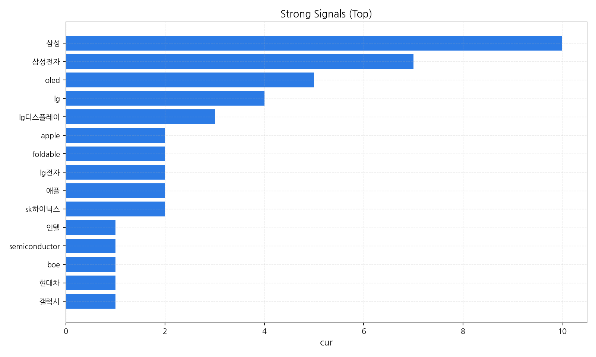

**이번 주 하이라이트**
- ## 데일리 인텔리전스 브리핑 (디스플레이 산업)
- **[핵심맥락]**
- *   **OLED 시장 경쟁 심화 및 기술 주도권 경쟁:** OLED 패널 시장은 중국의 성장과 폴더블폰 수요 증가로 경쟁이 심화되고 있습니다 (Topic 4). 한국은 발광 재료 기술력을 바탕으로 OLED 초격차를 유지하려 노력하고 있지만 (Topic 5), 중국은 차세대 OLED 디스플레이 기술, 특히 자동차용 핵심 디스플레이 생산 장비 분야에서 빠르게 추격하고 있습니다 (Topic 8).
- *   **차세대 디스플레이 기술 경쟁 가속화:** 삼성과 애플을 중심으로 LED, Micro LED, OLED, AR/XR 등 차세대 디스플레이 기술 경쟁이 치열하게 전개되고 있습니다 (Topic 7). 이는 스마트폰, TV뿐만 아니라 AR/XR 기기 등 다양한 분야에서 디스플레이 기술 혁신이 요구되고 있음을 시사합니다.
- *   **미중 기술 분쟁의 영향:** 미중 무역 기술 분쟁은 반도체, AI 등 핵심 기술 분야에서 경쟁을 더욱 심화시키고 있습니다 (Topic 1, Topic 2). 특히, 중국의 디스플레이 산업 성장은 미국의 견제 속에서 자체 기술 확보를 위한 노력을 가속화할 것으로 예상됩니다.
- *   **TV 시장 경쟁 심화:** 중국 TCL의 프리미엄 TV 시장 공략과 미국 시장 내 삼성 갤럭시 LCD TV 경쟁 심화는 TV 시장의 경쟁이 더욱 치열해지고 있음을 보여줍니다 (Topic 9). 이는 디스플레이 기술 경쟁뿐만 아니라 가격 경쟁, 브랜드 경쟁 등 다양한 측면에서 경쟁 우위를 확보해야 함을 의미합니다.
- **[인사이트]**
- *   **기회:**
- *   **폴더블 및 AR/XR 시장 성장:** 폴더블폰과 AR/XR 기기 시장의 성장은 OLED 및 차세대 디스플레이 기술 수요를 견인할 것입니다.
- *   **프리미엄 TV 시장 확대:** 프리미엄 TV 시장은 고화질, 고성능 디스플레이 기술을 통해 차별화된 가치를 제공할 수 있는 기회를 제공합니다.
- *   **자동차용 디스플레이 시장 성장:** 자동차용 디스플레이 시장은 안전, 편의, 인포테인먼트 기능 강화에 따라 지속적으로 성장할 것으로 예상됩니다.
- *   **위험:**
- *   **중국의 기술 추격:** 중국의 OLED 기술 추격은 한국 디스플레이 산업의 경쟁 우위를 약화시킬 수 있습니다.
- *   **미중 기술 분쟁:** 미중 기술 분쟁은 핵심 부품 및 장비 수급에 어려움을 초래하고, 시장 불확실성을 증대시킬 수 있습니다.
- *   **LCD 패널 가격 하락:** LCD 패널 가격 하락은 OLED 패널의 수익성을 악화시키고, 투자 여력을 감소시킬 수 있습니다.
- *   **경쟁 구도:**
- *   **한국 vs. 중국:** OLED 기술 경쟁, 시장 점유율 경쟁 심화
- *   **삼성 vs. 애플:** 차세대 디스플레이 기술 경쟁, 프리미엄 시장 경쟁
- *   **TCL vs. 삼성:** TV 시장 경쟁, 가격 경쟁
- **[Action Items]**
- 1.  **차세대 디스플레이 기술 개발 로드맵 재검토 및 투자 확대:** Micro LED, AR/XR 디스플레이 등 차세대 디스플레이 기술 개발 로드맵을 재검토하고, 핵심 기술 확보를 위한 투자 확대 및 전략적 제휴 추진.
- 2.  **OLED 발광 재료 기술 경쟁력 강화:** OLED 발광 재료 기술 경쟁력 강화를 위한 연구 개발 투자 확대 및 핵심 특허 확보. 중국과의 기술 격차를 유지하기 위한 차별화된 기술 개발 전략 수립.
- 3.  **자동차용 디스플레이 시장 진출 전략 수립:** 자동차용 디스플레이 시장 진출을 위한 기술 개발, 파트너십 구축, 시장 조사 등을 추진하고, 미래 자동차 시장을 위한 디스플레이 솔루션 개발.

## 모니터링 스냅샷

### 기사 하이라이트(상위 5)
| 제목                                        | 링크                                                                 |
|:------------------------------------------|:-------------------------------------------------------------------|
| 폴더블 부품 강자 비에이치, 북미 신제품 효과로 3분기 깜짝 성장      | https://www.pinpointnews.co.kr/news/articleView.html?idxno=383850  |
| [초점] 중국 TV 업계, 미니LED 앞세워 삼성 20년 아성 위협     | https://www.g-enews.com/view.php?ud=202510111014189046e8b8a793f7_1 |
| 대전을 뜨겁게 달군 ‘이터널 리턴 시즌8 파이널’ 대회에 사용된 모니... | https://www.cnet.co.kr/view/?no=20251010163313                     |
| OLED  출하량 껑충…삼성D·LGD 3분기 실적 훈풍 기대         | http://www.newstomato.com/ReadNews.aspx?no=1277288&inflow=N        |
| 적자 늪 탈출한 LG디스플레이,  OLED 로 부활 신호탄 쏘다       | https://www.pinpointnews.co.kr/news/articleView.html?idxno=383671  |

## 핵심 지표 보드

| 기간                      |   총 기사 수 |   문서 수 |   상위 키워드 수 |   토픽 수 |   시계열 일수 |
|:------------------------|---------:|-------:|-----------:|-------:|---------:|
| 2025-09-08 ~ 2025-10-10 |     2858 |      0 |         20 |     10 |       33 |

> 해석 가이드: 전주 대비 증감률을 함께 보아야 변화를 정확히 해석할 수 있습니다.
> 그래서: 문서/기사 수가 급증하면 키워드/토픽 점유 구조가 바뀔 가능성이 큽니다.
> 다음 액션: 이상값이 보이면 타임라인 섹션의 변곡점 주석과 함께 원인을 추적하세요.

## 키워드 인텔리전스

**핵심 요약**
- 상위 키워드 분포와 클러스터를 통해 테마 맥락을 파악합니다.
- 점수 상승과 긍정 감성 결합은 유망 신호입니다.

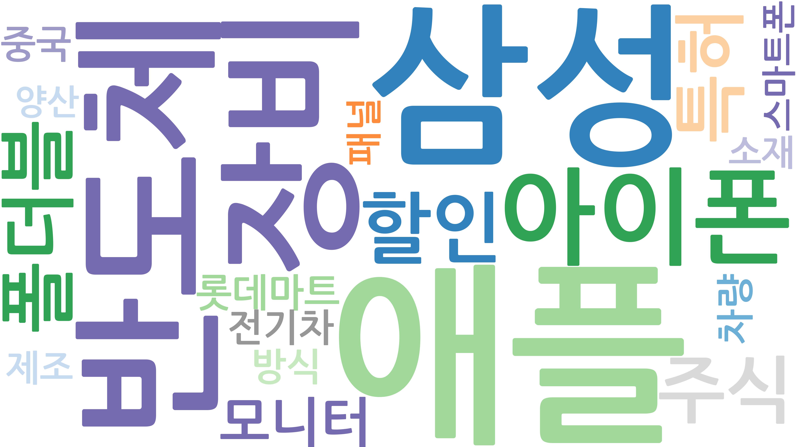
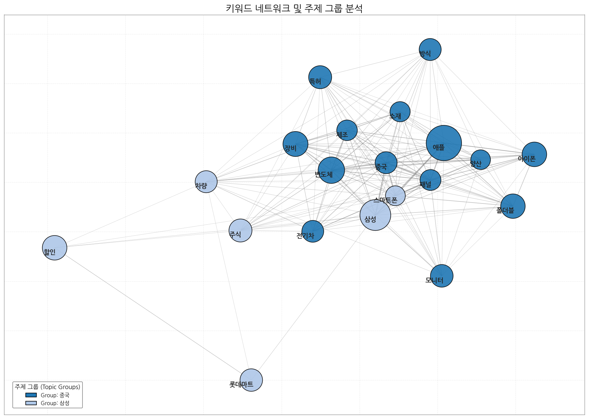
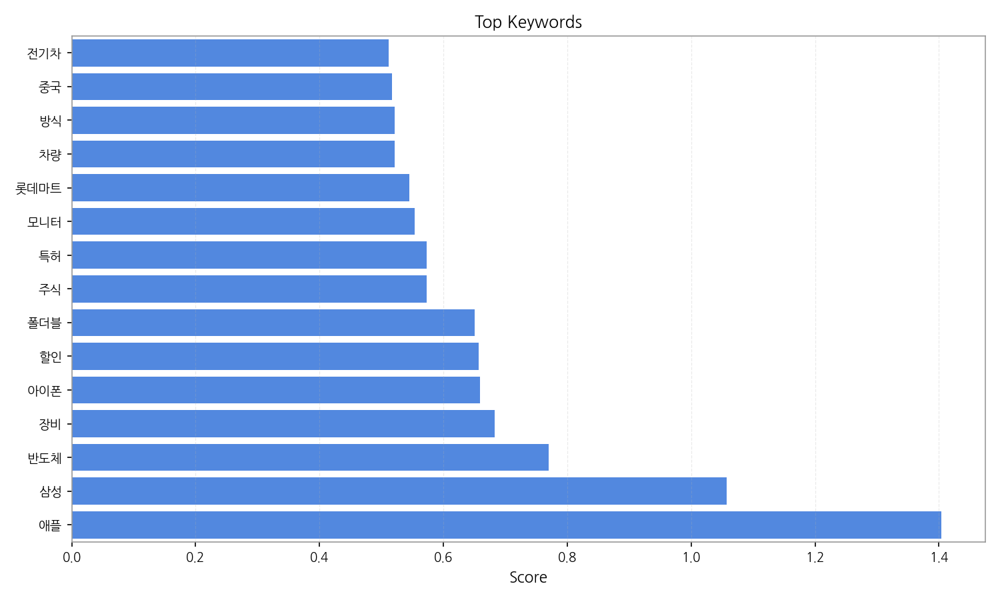

### 상위 키워드 Top 20
|   순위 | 키워드   |    점수 | 변화(참고)   |
|-----:|:------|------:|:---------|
|    1 | 애플    | 1.404 |          |
|    2 | 삼성    | 1.057 |          |
|    3 | 반도체   | 0.77  |          |
|    4 | 장비    | 0.683 |          |
|    5 | 아이폰   | 0.659 |          |
|    6 | 할인    | 0.657 |          |
|    7 | 폴더블   | 0.651 |          |
|    8 | 주식    | 0.573 |          |
|    9 | 특허    | 0.573 |          |
|   10 | 모니터   | 0.553 |          |
|   11 | 롯데마트  | 0.545 |          |
|   12 | 차량    | 0.521 |          |
|   13 | 방식    | 0.521 |          |
|   14 | 중국    | 0.517 |          |
|   15 | 전기차   | 0.512 |          |
|   16 | 패널    | 0.464 |          |
|   17 | 제조    | 0.45  |          |
|   18 | 소재    | 0.432 |          |
|   19 | 스마트폰  | 0.415 |          |
|   20 | 양산    | 0.408 |          |

> 해석 가이드: 클러스터는 규제/정책, 공급망, 수요/고객 등 테마로 해석하면 빠릅니다.
> 그래서: 상위 키워드가 네트워크 허브와 겹치면 시장 영향력이 높은 신호일 가능성이 큽니다.
> 다음 액션: 해당 키워드를 포함한 토픽과 기업 교차점(매트릭스 섹션)을 확인하세요.

## 토픽 레이더

**핵심 요약**
- 관심도(X), 긍정성(Y), 성장률(색상)로 토픽 지형을 한눈에 파악합니다.
- 상위 토픽의 미니 시계열로 모멘텀을 점검합니다.

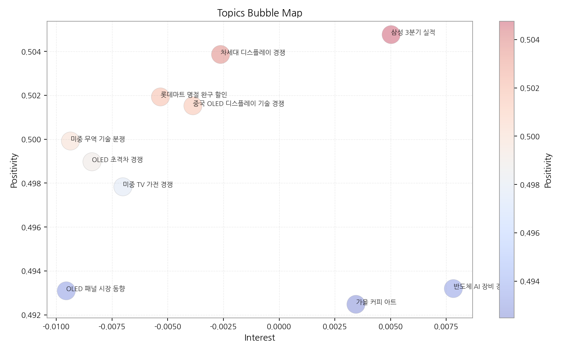
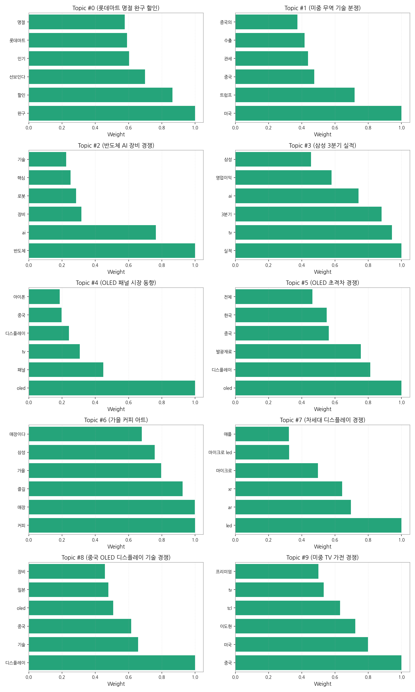

### 토픽 개요
|   topic_id | topic_summary                                                                                                     |
|-----------:|:------------------------------------------------------------------------------------------------------------------|
|          0 | 롯데마트가 명절 연휴를 맞아 인기 캐릭터 완구 상품을 할인 판매한다.                                                                            |
|          1 | 미국 트럼프 정부의 대중국 관세 부과, AI 및 희토류 기술 관련 수출 제한 등 무역 및 기술 분야에서의 미중 갈등 심화 상황을 다룬 뉴스.                                    |
|          2 | 삼성전자를 포함한 기업들이 미국 시장에서 반도체, AI 기술, 로봇 장비 등의 핵심 기술 사업 경쟁을 벌이는 상황을 다룬 뉴스입니다. 메모리 반도체 분야도 주요 경쟁 영역입니다.               |
|          3 | 삼성전자의 3분기 실적 발표 관련 내용으로, TV, AI, 프리미엄 제품 수요, 구독 서비스, 매출 및 영업이익 변화 등이 주요하게 다뤄지고 있음을 알 수 있습니다.                      |
|          4 | 중국 디스플레이 산업 성장과 아이폰 폴더블폰 등 OLED 패널 수요 증가, LCD와의 경쟁 심화 등 OLED 패널 시장 전반의 3분기 동향 분석.                                 |
|          5 | 한국이 스마트폰용 OLED 디스플레이 시장에서 중국과의 경쟁 속에서 발광 재료 기술력을 바탕으로 초격차를 유지하려 노력하고 있다는 내용입니다.                                   |
|          6 | 가을, 추석 시즌에 삼성과 스타벅스 매장에서 즐길 수 있는 커피 관련 아트 행사 또는 신제품 출시 소식. 감독 관련 내용도 일부 포함.                                       |
|          7 | 한국(삼성)과 애플을 중심으로 LED, Micro LED, OLED, AR/XR 등 차세대 디스플레이 기술 경쟁 및 관련 시장 동향을 다룸.                                    |
|          8 | 중국이 차세대 OLED 디스플레이 기술, 특히 자동차용 핵심 디스플레이 생산 장비 분야에서 일본을 비롯한 경쟁국과의 기술 경쟁력을 확보하려는 움직임을 다루고 있습니다.                     |
|          9 | 중국 TCL의 프리미엄 TV 시장 공략과 미국 시장 내 삼성 갤럭시 LCD TV 경쟁 심화 등, 미중 가전 기업 간 경쟁 상황을 다룬 뉴스. 이도현 관련 내용은 광고 모델 등 부가 정보일 가능성이 높음. |

> 해석 가이드: 성장률이 높고 긍정성이 유지되는 토픽은 우선 탐색 대상입니다.
> 그래서: 토픽 성장과 기업 진입 변화가 동시에 보이면 시장 전환점일 가능성이 있습니다.
> 다음 액션: 상위 토픽을 기업×토픽 매트릭스에서 교차 확인하고, 기회/리스크로 분기하세요.

## 기업×토픽 매트릭스/히트맵

**핵심 요약**
- 가장 경쟁 치열 토픽: 반도체, ai
- 가장 집중도 높은 기업: 삼성전자
- 최고 단일 조합: 삼성전자 × 반도체, ai

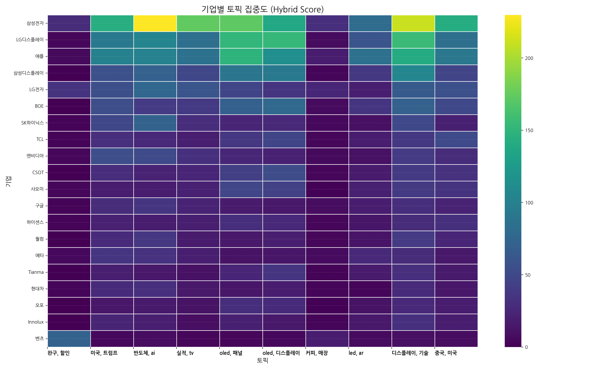

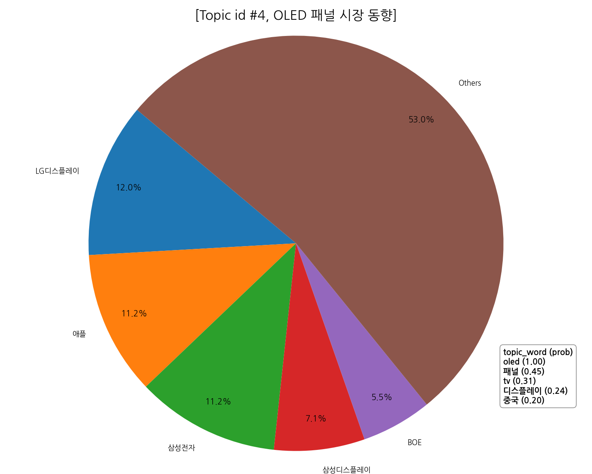

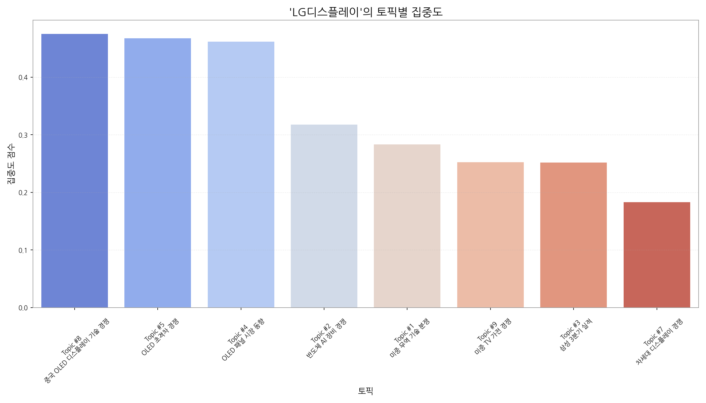
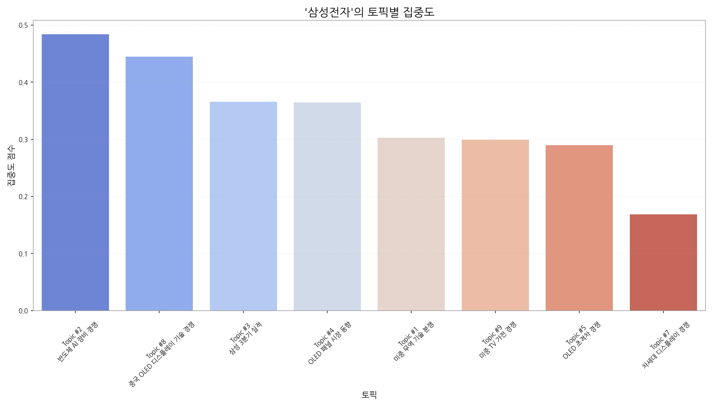
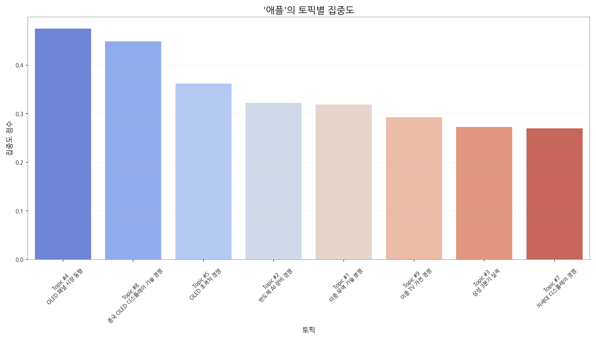

### 매트릭스 표(미리보기)
| org          | topic_0     | topic_1    | topic_2     | topic_3    | topic_4      | topic_5      | topic_6   | topic_7     | topic_8      | topic_9    |
|:-------------|:------------|:-----------|:------------|:-----------|:-------------|:-------------|:----------|:------------|:-------------|:-----------|
| AMD          | nan         | 27.03 (2%) | 20.58 (1%)  | 14.71 (2%) | 9.21 (1%)    | 9.11 (1%)    | nan       | 11.58 (2%)  | 20.10 (1%)   | 10.25 (1%) |
| AUO          | nan         | 18.02 (1%) | 16.46 (1%)  | 10.51 (1%) | 19.12 (2%)   | 13.31 (1%)   | nan       | 13.75 (2%)  | 26.34 (2%)   | 13.91 (1%) |
| BMW          | nan         | 5.55 (0%)  | 9.60 (1%)   | 5.60 (1%)  | 2.12 (0%)    | 5.60 (0%)    | nan       | 1.45 (0%)   | 11.78 (1%)   | 5.86 (1%)  |
| BOE          | nan         | 54.07 (4%) | 39.78 (3%)  | 37.83 (4%) | 69.40 (6%)   | 77.06 (6%)   | nan       | 35.47 (6%)  | 70.01 (4%)   | 49.78 (5%) |
| BYD          | nan         | 8.32 (1%)  | 5.49 (0%)   | 4.20 (0%)  | 8.50 (1%)    | 7.71 (1%)    | nan       | 1.45 (0%)   | 9.70 (1%)    | 8.78 (1%)  |
| CES          | nan         | 2.08 (0%)  | 3.43 (0%)   | 3.50 (0%)  | 3.54 (0%)    | 0.70 (0%)    | nan       | 0.72 (0%)   | 1.39 (0%)    | 2.93 (0%)  |
| CSOT         | nan         | 29.11 (2%) | 21.95 (2%)  | 23.82 (3%) | 42.49 (3%)   | 52.54 (4%)   | nan       | 16.65 (3%)  | 38.82 (2%)   | 32.94 (3%) |
| Counterpoint | nan         | 0.69 (0%)  | 0.69 (0%)   | 0.70 (0%)  | nan          | nan          | nan       | 0.72 (0%)   | nan          | nan        |
| HMI          | nan         | 0.69 (0%)  | 2.06 (0%)   | 0.70 (0%)  | nan          | 0.70 (0%)    | nan       | 0.72 (0%)   | 3.47 (0%)    | 1.46 (0%)  |
| Harman       | nan         | 1.39 (0%)  | 4.12 (0%)   | 1.40 (0%)  | 2.12 (0%)    | 0.70 (0%)    | nan       | nan         | 0.69 (0%)    | 0.73 (0%)  |
| IMID         | nan         | 1.39 (0%)  | 1.37 (0%)   | 0.70 (0%)  | 0.71 (0%)    | 1.40 (0%)    | nan       | 0.72 (0%)   | 1.39 (0%)    | 0.73 (0%)  |
| Innolux      | nan         | 22.87 (2%) | 19.20 (1%)  | 8.41 (1%)  | 20.54 (2%)   | 14.71 (1%)   | nan       | 15.20 (2%)  | 31.88 (2%)   | 17.57 (2%) |
| IoT          | nan         | 7.62 (1%)  | 17.15 (1%)  | 7.71 (1%)  | 6.37 (1%)    | 7.71 (1%)    | nan       | 0.72 (0%)   | 18.02 (1%)   | 7.32 (1%)  |
| JDI          | nan         | 4.85 (0%)  | 8.92 (1%)   | 5.60 (1%)  | 9.91 (1%)    | 4.90 (0%)    | nan       | 2.90 (0%)   | 12.48 (1%)   | 3.66 (0%)  |
| KAIST        | nan         | 1.39 (0%)  | 2.74 (0%)   | 0.70 (0%)  | nan          | nan          | nan       | nan         | 1.39 (0%)    | nan        |
| LG디스플레이      | nan         | 92.88 (8%) | 104.25 (7%) | 82.67 (9%) | 151.55 (12%) | 153.43 (13%) | nan       | 60.09 (10%) | 155.96 (10%) | 82.72 (8%) |
| LG전자         | 33.59 (19%) | 55.45 (5%) | 74.76 (5%)  | 60.95 (6%) | 47.45 (4%)   | 35.03 (3%)   | nan       | nan         | 64.46 (4%)   | 56.37 (6%) |
| LG화학         | 1.34 (1%)   | 4.85 (0%)  | 15.09 (1%)  | 9.11 (1%)  | 5.67 (0%)    | 5.60 (0%)    | nan       | 2.17 (0%)   | 11.78 (1%)   | nan        |
| MWC          | nan         | 3.47 (0%)  | 4.12 (0%)   | 2.10 (0%)  | 1.42 (0%)    | nan          | 1.96 (1%) | 3.62 (1%)   | 2.77 (0%)    | 2.93 (0%)  |
| SID          | nan         | 2.77 (0%)  | 3.43 (0%)   | nan        | 2.12 (0%)    | 2.10 (0%)    | 0.98 (0%) | 2.90 (0%)   | 3.47 (0%)    | 1.46 (0%)  |

> 해석 가이드: 히트맵에서 진한 교차지점은 전략 초점을 의미합니다. 점수는 소스 커버리지에 민감합니다.
> 그래서: 경쟁 치열 토픽에서의 점유율 변화는 공격/수비 전략 신호일 수 있습니다.
> 다음 액션: 상위 기업과 토픽 교차를 기회 섹션으로 연결하고, 파트너/경쟁사 움직임을 추적하세요.

## 관계·경쟁 네트워크

**핵심 요약**
- 관계망 규모: 노드 38개 / 엣지 114개
- 가장 강한 관계: 삼성전자 ↔ 애플 (가중치 43, 유형 rivalry)
- 허브 후보: 삼성전자 (Degree 0.7568)
- 브로커 후보: 삼성전자 (Betweenness 0.3032)

### 상위 관계쌍(Edge)
동일 문서/문장에서 함께 언급된 기업 쌍이며, 가중치는 동시출현 빈도입니다. 유형은 규칙 기반 추정입니다.

| Source   | Target   |   Weight | Type    |
|:---------|:---------|---------:|:--------|
| 삼성전자     | 애플       |       43 | rivalry |
| 삼성디스플레이  | 삼성전자     |       29 | rivalry |
| 삼성디스플레이  | 애플       |       26 | rivalry |
| 구글       | 애플       |       21 | rivalry |
| 삼성전자     | 퀄컴       |       17 | rivalry |
| 메타       | 애플       |       17 | neutral |
| 샤오미      | 애플       |       15 | rivalry |
| 애플       | 퀄컴       |       14 | rivalry |
| 삼성전자     | 샤오미      |       14 | neutral |
| 구글       | 메타       |       13 | neutral |

### 중심성 상위(연결 허브)
Degree 중심성은 연결된 상대 수의 비율입니다. 높을수록 허브 성격.

| Org     |   DegreeCentrality |
|:--------|-------------------:|
| 삼성전자    |             0.7568 |
| 애플      |             0.4865 |
| 샤오미     |             0.3784 |
| 엔비디아    |             0.3784 |
| 퀄컴      |             0.3514 |
| 현대차     |             0.3243 |
| 삼성디스플레이 |             0.2703 |
| 기아      |             0.2432 |
| 메타      |             0.2432 |
| 비보      |             0.2432 |

### 매개 중심성 상위(정보 브로커)
Betweenness는 집단 간 ‘다리’ 역할 정도입니다. 높을수록 중개자 성격.

| Org     |   Betweenness |
|:--------|--------------:|
| 삼성전자    |        0.3032 |
| 애플      |        0.0767 |
| 엔비디아    |        0.0351 |
| 퀄컴      |        0.0323 |
| 샤오미     |        0.0322 |
| 현대차     |        0.0249 |
| 삼성디스플레이 |        0.0193 |
| 기아      |        0.0087 |
| 메타      |        0.0083 |
| 아마존     |        0.0083 |

### 커뮤니티(관계 클러스터)
> 모듈러리티 기반 자동 추출 집단. 같은 집단 내 기업은 유사 주제/밸류체인 공유 가능성.
- C0: 디지타임스, 비보, 삼성디스플레이, 삼성전자, 샤오미, 샤오펑 | 해석: 디지타임스 중심의 연관 클러스터
- C1: 기아, 네이버, 벤츠, 카카오, 한미반도체, 현대모비스 | 해석: 기아 중심의 연관 클러스터
- C2: 구글, 마이크로소프트, 메타, 아마존, 알파벳, 엔비디아 | 해석: 구글 중심의 연관 클러스터
- C3: 미디어텍, 퀄컴, 한화, 한화시스템 | 해석: 미디어텍 중심의 연관 클러스터
- C4: 기아자동차 | 해석: 기아자동차 중심의 연관 클러스터

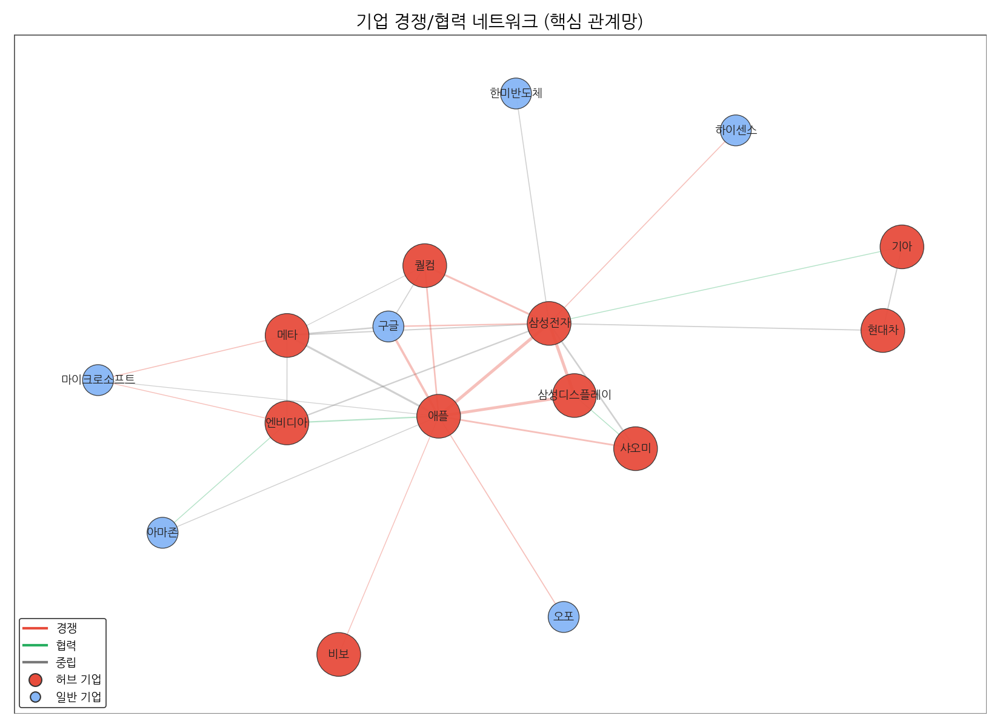

> 해석 가이드: 동시출현이 높은 쌍은 경쟁/협력 가능성을 시사합니다.
> 그래서: 허브/브로커 포지션은 영향력/협상력을 가리킵니다.
> 다음 액션: 커뮤니티별 주요 토픽/키워드와 교차하여 전략 단위를 정의하세요.

## 트렌드 타임라인

**핵심 요약**
- 기간: 2025-09-08 ~ 2025-10-10
- 총 기사 수: 2,858
- 일별 기사 수와 7일 이동평균, 변곡점을 주석으로 표시합니다.

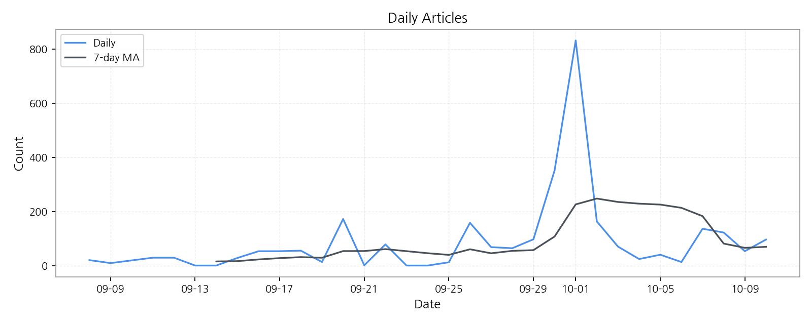

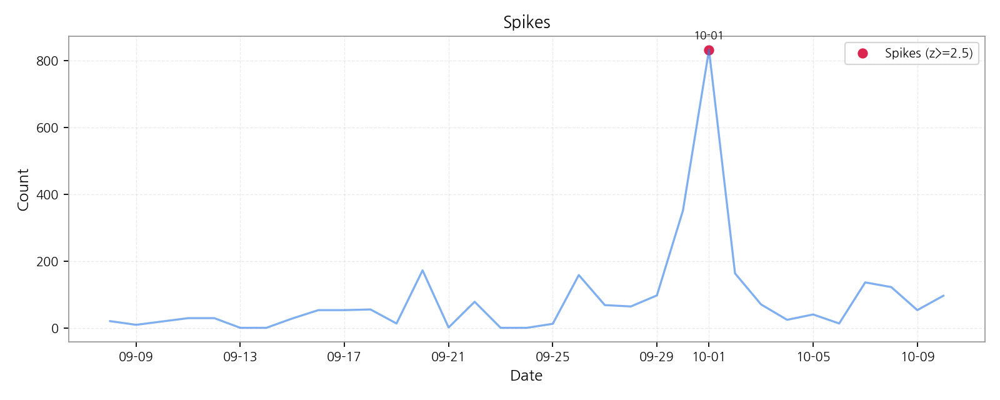

### 스파이크/이벤트 목록
| date       |   count |       z |
|:-----------|--------:|--------:|
| 2025-10-01 |     832 | 4.90782 |

> 해석 가이드: 단기 급등은 이벤트성 가능성이 있으니 2주 추세를 함께 보세요.
> 그래서: 스파이크 이후 토픽/신호 방향을 교차 확인하면 원인 파악이 빨라집니다.
> 다음 액션: 스파이크 날짜의 주요 기사와 키워드 변동을 키워드/토픽 섹션에서 재확인하세요.

## 시그널 보드(강한/약한 신호)

### 강한 신호(Strong Signals)

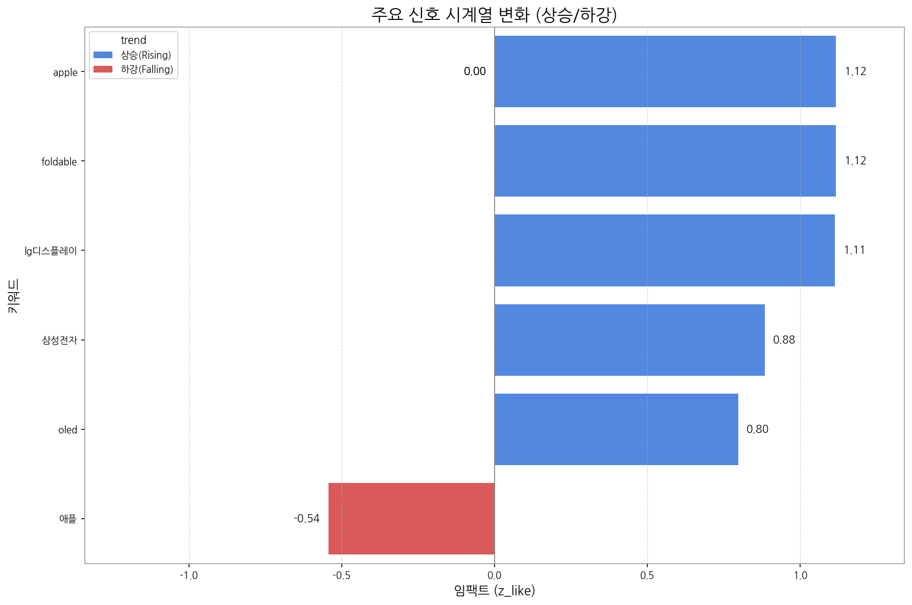

| term          |   cur |   z_like |   prev |   diff |   ma7 |   total |
|:--------------|------:|---------:|-------:|-------:|------:|--------:|
| apple         |     2 |    1.117 |      0 |      2 | 0.286 |       3 |
| foldable      |     2 |    1.117 |      0 |      2 | 0.286 |       2 |
| lg디스플레이       |     3 |    1.113 |      1 |      2 | 0.857 |      73 |
| 삼성전자          |     7 |    0.884 |      3 |      4 | 4.286 |      85 |
| oled          |     5 |    0.797 |      4 |      1 | 2.857 |     137 |
| 삼성            |    10 |    0.778 |      5 |      5 | 7.143 |     322 |
| sk하이닉스        |     2 |    0.697 |      1 |      1 | 0.714 |      21 |
| semiconductor |     1 |    0.622 |      0 |      1 | 0.143 |       1 |
| udc           |     1 |    0.622 |      0 |      1 | 0.143 |       1 |
| 인텔            |     1 |    0.622 |      0 |      1 | 0.143 |       8 |
| lg            |     4 |    0.486 |      6 |     -2 | 2.714 |     254 |
| boe           |     1 |    0.465 |      0 |      1 | 0.286 |      16 |
| 현대차           |     1 |    0.155 |      0 |      1 | 0.714 |      22 |
| 갤럭시           |     1 |    0.074 |      0 |      1 | 0.857 |      24 |
| 아이폰           |     1 |    0.074 |      0 |      1 | 0.857 |      14 |
| lg전자          |     2 |    0.06  |      3 |     -1 | 1.857 |      35 |
| 애플            |     2 |   -0.544 |      0 |      2 | 3.571 |      65 |

### 약한 신호(Weak/Emerging Signals)
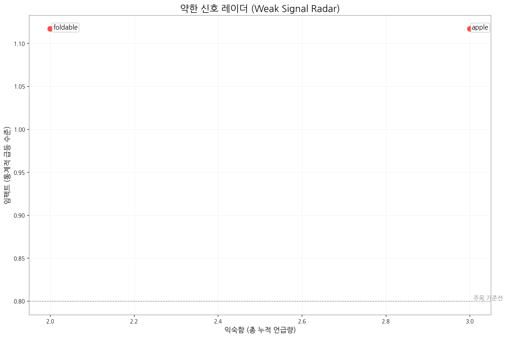

| 약한 신호    | 지표(cur / z_like)   | 해석(1줄)                                                                                                                                                                                  |
|:---------|:-------------------|:----------------------------------------------------------------------------------------------------------------------------------------------------------------------------------------|
| foldable | 2 / 1.117          | 'foldable'은 모토로라, 애플 등 경쟁사들이 시장에 진입하면서 삼성전자가 주도하는 폴더블 스마트폰 시장의 경쟁 심화를 예고하는 새로운 트렌드이며, 향후 폴더블 기기 시장의 성장과 혁신을 촉진할 잠재력을 지닌다.                                                               |
| apple    | 2 / 1.117          | Error: 429 You exceeded your current quota, please check your plan and billing details. For more information on this error, head to: https://ai.google.dev/gemini-api/docs/rate-limits. |
|          |                    | * Quota exceeded for metric: generativelanguage.googleapis.com/generate_content_free_tier_requests, limit: 15                                                                           |
|          |                    | Please retry in 6.394277927s. [violations {                                                                                                                                             |
|          |                    |   quota_metric: "generativelanguage.googleapis.com/generate_content_free_tier_requests"                                                                                                 |
|          |                    |   quota_id: "GenerateRequestsPerMinutePerProjectPerModel-FreeTier"                                                                                                                      |
|          |                    |   quota_dimensions {                                                                                                                                                                    |
|          |                    |     key: "model"                                                                                                                                                                        |
|          |                    |     value: "gemini-2.0-flash"                                                                                                                                                           |
|          |                    |   }                                                                                                                                                                                     |
|          |                    |   quota_dimensions {                                                                                                                                                                    |
|          |                    |     key: "location"                                                                                                                                                                     |
|          |                    |     value: "global"                                                                                                                                                                     |
|          |                    |   }                                                                                                                                                                                     |
|          |                    |   quota_value: 15                                                                                                                                                                       |
|          |                    | }                                                                                                                                                                                       |
|          |                    | , links {                                                                                                                                                                               |
|          |                    |   description: "Learn more about Gemini API quotas"                                                                                                                                     |
|          |                    |   url: "https://ai.google.dev/gemini-api/docs/rate-limits"                                                                                                                              |
|          |                    | }                                                                                                                                                                                       |
|          |                    | , retry_delay {                                                                                                                                                                         |
|          |                    |   seconds: 6                                                                                                                                                                            |
|          |                    | }                                                                                                                                                                                       |
|          |                    | ]                                                                                                                                                                                       |

> 해석 가이드: 약한 신호는 가속도·이례성이 핵심이고, 강한 신호는 현재 주목도의 절대값입니다.
> 그래서: 약한→강한 신호로 전환하는 구간이 가장 좋은 기회가 됩니다.
> 다음 액션: 상위 신호 5개를 2주간 추적하고, 토픽/기업 매트릭스와 교차 검증하세요.

## 기술 성숙도 맵

**핵심 요약**
- 관심도(X), 긍정성(Y), 버블(사업 활발도)로 기술의 위치를 표현합니다.
- 단계: Seed/Early/Growth/Mature/Legacy

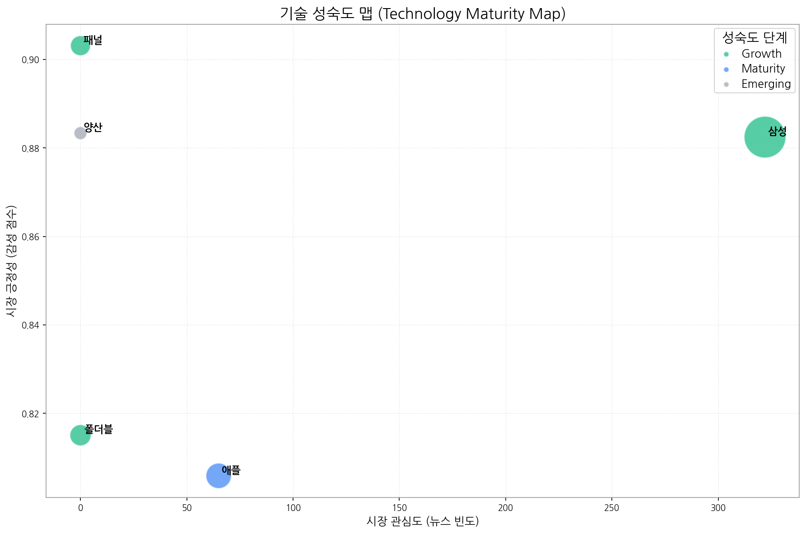

| 기술   | 단계       | 판단 근거                                                                                                        |
|:-----|:---------|:-------------------------------------------------------------------------------------------------------------|
| 삼성   | Growth   | 높은 시장 감성 점수와 꾸준한 출시 및 투자 이벤트 발생은 삼성이 성장 단계에 있음을 시사합니다.                                                       |
| 애플   | Maturity | 높은 시장 감성 점수와 꾸준한 출시 및 투자 활동은 애플 기술이 성숙기에 접어들었음을 나타낸다.                                                        |
| 패널   | Growth   | 뉴스 언급은 없지만 긍정적인 시장 감성과 출시 이벤트가 다수 발생한 것으로 보아 성장기에 진입한 기술로 판단됩니다.                                             |
| 폴더블  | Growth   | 비교적 높은 시장 감성 점수와 꾸준한 출시 및 투자 이벤트 발생으로 보아 폴더블 기술은 성장기에 있다고 판단됩니다.                                             |
| 양산   | Emerging | 뉴스 언급이 없고 투자, 출시, 수주 이벤트가 없는 반면 시장 감성 점수가 높은 것은 양산 기술에 대한 관심은 잠재적으로 존재하지만 아직 시장에서 본격적인 움직임이 시작되지 않았음을 시사합니다. |

> 해석 가이드: Growth 구간이면서 강한 신호 결합 시 유망합니다.
> 그래서: Early라도 약한 신호가 누적되면 전환 후보입니다.
> 다음 액션: 상위 기술 3개를 기회 섹션과 연결하고 파일럿 과제를 정의하세요.

## 비즈니스 기회(Top 5)

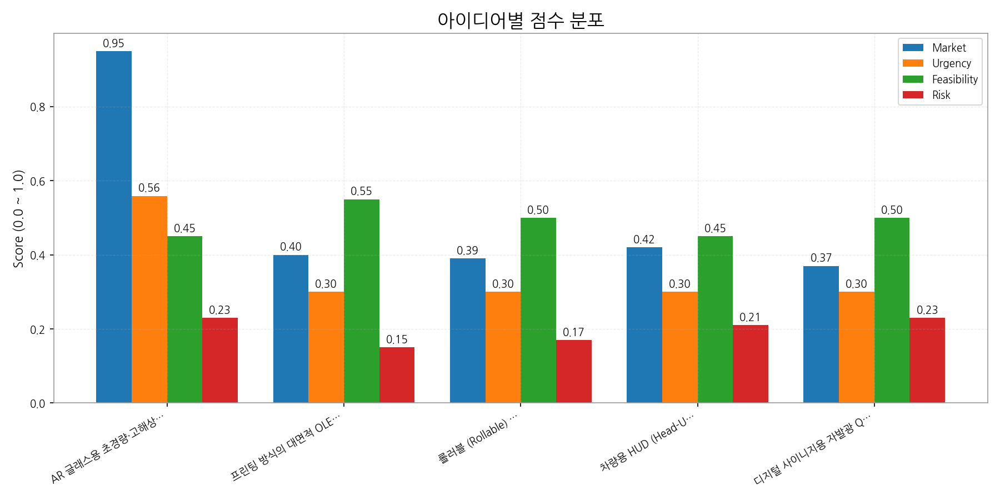

| 아이디어                                          | 타깃                          | 가치제안                                                                                                                                    | 점수(시장/긴급/실행/리스크)           |
|:----------------------------------------------|:----------------------------|:----------------------------------------------------------------------------------------------------------------------------------------|:---------------------------|
| AR 글래스용 초경량·고해상도 Micro-OLED 패널                | 북미 빅테크 기업 (AR/VR 기기 제조사)    | 기존 OLED 대비 50% 가벼운 무게, 2배 높은 해상도 (4K 이상)를 제공하여 착용감과 몰입도를 극대화합니다. 저전력 설계로 AR 글래스 사용 시간 연장에 기여합니다. (Growth 단계 기술 응용)                      | 5.4 (0.95/0.559/0.45/0.23) |
| 프린팅 방식의 대면적 OLED 생산 기술                        | OLED 패널 제조사                 | 기존 증착 방식 대비 40% 낮은 생산 비용, 2배 빠른 생산 속도를 제공합니다. 대면적 OLED 패널 생산에 용이하며, 다양한 기판 소재 적용이 가능합니다. (Emerging 단계 기술 개발)                            | 3.4 (0.4/0.3/0.55/0.15)    |
| 롤러블 (Rollable) 디스플레이 수율 향상을 위한 AI 공정 모니터링 서비스 | 국내외 롤러블 디스플레이 패널 제조사        | AI 기반 실시간 공정 데이터 분석 및 결함 예측 모델을 통해 롤러블 디스플레이 수율을 20% 향상시킵니다. 불량 발생 가능성이 높은 공정 단계를 사전에 예측하여 선제적인 대응을 가능하게 합니다. (Growth 단계 기술 활용)         | 3.2 (0.39/0.3/0.5/0.17)    |
| 차량용 HUD (Head-Up Display) 투명 MicroLED 패널      | 글로벌 완성차 OEM (Tier 1 부품사 포함) | 기존 LCD 대비 10배 높은 밝기, 5배 넓은 시야각, 80% 투명도를 제공하여 몰입감 있는 AR/VR HUD 경험을 제공합니다. MicroLED의 뛰어난 내구성과 수명으로 차량 안전성 향상에 기여합니다. (Emerging 단계 기술 선점) | 3.1 (0.42/0.3/0.45/0.21)   |
| 디지털 사이니지용 자발광 QLED 플렉서블 디스플레이                 | 글로벌 옥외 광고 대행사, 리테일 기업       | 자유로운 형태 구현이 가능한 플렉서블 디스플레이로 차별화된 광고 디자인을 제공합니다. 높은 밝기와 넓은 시야각으로 뛰어난 시인성을 확보하여 광고 효과를 극대화합니다. (Emerging 단계 기술 적용)                        | 2.9 (0.37/0.3/0.5/0.23)    |

> 해석 가이드: 점수는 내부 가중치 기반(예: Market 0.35, Urgency 0.25, Feasibility 0.25, Risk -0.15).
> 그래서: 상위안은 단기 임팩트/실행 가능성이 높은 편입니다.
> 다음 액션: 각 아이디어에 대해 2주 파일럿(가설·대상·KPI)을 정의하고 담당 오너를 배정하세요.

## 리스크/이슈 관측소

- (리스크/이슈 데이터 없음)

> 해석 가이드: 부정 감성 급등은 PR·컴플라이언스·조달과 연계가 필요합니다.
> 그래서: 공급망 키워드와 동반 급등 시 실제 운영 리스크로 이어질 수 있습니다.
> 다음 액션: 영향범위가 큰 이슈는 즉시 리스크 레지스터에 등록하고 완화 액션을 실행하세요.

## 결론: So What & Next Steps

### 다음 2주 실행안(템플릿)
| hypothesis          | target         | kpi               | owner   | due        |
|:--------------------|:---------------|:------------------|:--------|:-----------|
| 토픽 A 관심도↑는 고객 니즈 증가 | SMB 고객 20명 인터뷰 | 응답률 30%/신규 리드 10건 | 사업개발팀   | 2025-10-25 |

> 해석 가이드: 데이터-인사이트-액션의 연결을 표준 템플릿으로 기록하세요.
> 그래서: 우선순위 상위 안건부터 빠르게 실험해야 기회를 놓치지 않습니다.
> 다음 액션: 오너/기한/KPI가 명확한 항목부터 킥오프하세요.

## 부록(Appendix)

분석의 투명성을 확보하고, 다음 단계 분석을 위한 원천 자료를 제공합니다.

### 데이터 메타
| 파일                             | 수정시각                |   크기(bytes) |
|:-------------------------------|:--------------------|------------:|
| outputs/keywords.json          | 2025-10-11 08:00:45 |        1527 |
| outputs/topics.json            | 2025-10-11 08:01:04 |       11889 |
| outputs/trend_timeseries.json  | 2025-10-11 08:00:47 |        1967 |
| outputs/trend_insights.json    | 2025-10-11 08:01:11 |        8026 |
| outputs/biz_opportunities.json | 2025-10-11 08:02:14 |       24939 |
| outputs/tech_maturity.json     | 2025-10-11 08:01:52 |        2564 |
| outputs/company_network.json   | 2025-10-11 08:01:59 |       20755 |

> 해석 가이드: 재현성과 감사추적을 위해 생성일, 버전, 파라미터를 함께 보관하세요.
> 그래서: 데이터 출처와 가공 과정을 명확히 남기면 신뢰성이 높아집니다.
> 다음 액션: 주요 이미지/표 생성 실패 로그도 추적 테이블로 남겨두세요.
