## Intellegence Report (2025-10-14)

**핵심 요약**
- 기간: 2025-09-08 ~ 2025-10-13
- 기사 수: 2,970
- 토픽 수: 12 | 상위 키워드: 20

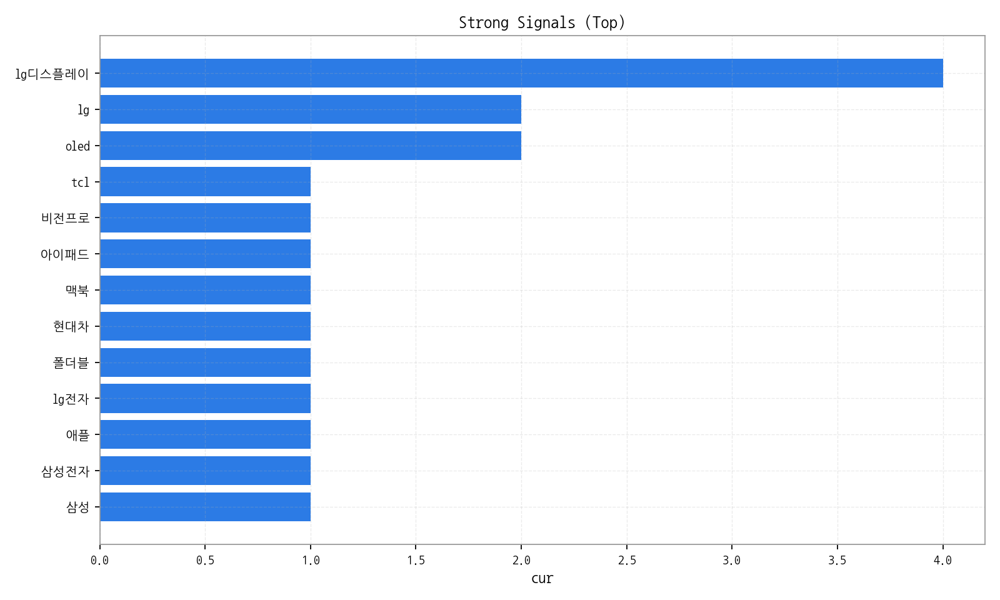

**이번 주 하이라이트**
- ## 데일리 인텔리전스 브리핑 (디스플레이 산업)
- **1. 핵심 맥락**
- *   **OLED 시장 경쟁 심화 및 프리미엄화 가속:** OLED TV 경쟁 심화 (Topic 1)와 LG디스플레이의 OLED 실적 (Topic 5), 그리고 OLED 수출 호조 (Topic 11)는 OLED 시장의 성장과 경쟁 심화를 동시에 보여줍니다. 특히, 중국 기업들의 OLED 기술 추격과 삼성의 QD
- OLED 진입은 경쟁 구도를 더욱 복잡하게 만들고 있습니다. 동시에, 4K, AG, AW 등 디스플레이 품질 향상 관련 키워드는 OLED 기술이 프리미엄 TV 시장을 중심으로 발전하고 있음을 시사합니다.
- *   **차세대 디스플레이 기술 투자 확대 및 경쟁:** 마이크로 LED (Topic 7)와 AR/XR (Topic 9) 관련 투자가 미국, 대만, 일본 등에서 활발하게 이루어지고 있습니다. 이는 OLED 이후 차세대 디스플레이 기술 주도권을 확보하기 위한 경쟁이 본격화되고 있음을 의미합니다. 특히, 스마트폰 연계 AR/XR 기술은 폴더블 디스플레이와 함께 모바일 디스플레이 시장의 새로운 성장 동력이 될 가능성이 높습니다.
- *   **반도체 산업과의 연계 강화:** 인도 반도체 AI 산업 (Topic 2), 삼성전자 3분기 실적 (Topic 3), AI 반도체 투자 경쟁 (Topic 6)은 디스플레이 산업이 반도체 산업과 더욱 밀접하게 연관되고 있음을 보여줍니다. 특히, AI 반도체는 고성능 디스플레이 구동 및 AR/XR 기기 성능 향상에 필수적인 요소이며, 디스플레이 패널 생산에도 반도체 기술이 중요하게 작용합니다.
- **2. 인사이트**
- *   **기회:**
- *   OLED 시장의 지속적인 성장: 프리미엄 TV 시장을 중심으로 OLED 수요가 증가할 것으로 예상됩니다.
- *   AR/XR 시장의 성장 잠재력: 스마트폰, AI 기술과의 융합을 통해 AR/XR 시장이 빠르게 성장할 가능성이 높습니다.
- *   반도체 기술과의 시너지: AI 반도체 기술 발전은 디스플레이 성능 향상 및 새로운 디스플레이 기술 개발에 기여할 수 있습니다.
- *   **위험:**
- *   OLED 기술 경쟁 심화: 중국 기업들의 기술 추격과 삼성의 QD
- OLED 진입은 시장 경쟁을 더욱 치열하게 만들 수 있습니다.
- *   차세대 디스플레이 기술 경쟁: 마이크로 LED, AR/XR 등 차세대 디스플레이 기술 개발 경쟁에서 뒤쳐질 경우 시장 주도권을 잃을 수 있습니다.
- *   글로벌 경제 불확실성: 반도체 시장 침체 및 글로벌 경기 둔화는 디스플레이 수요 감소로 이어질 수 있습니다.
- *   **경쟁 구도:**
- *   한국 (LG디스플레이, 삼성), 중국 (BOE, CSOT), 일본 (JDI) 등 주요 디스플레이 제조사 간 경쟁 심화
- *   엔비디아, 퀄컴 등 AI 반도체 기업의 영향력 확대
- *   애플, 삼성 등 스마트폰 제조사의 디스플레이 기술 내재화 시도
- **3. Action Items**
- *   **전략:**
- *   **OLED 기술 리더십 강화:** 고해상도, 고휘도, 저전력 등 OLED 기술 경쟁력 확보를 위한 R&D 투자 확대. 특히, 차세대 OLED 기술 (예: Micro Lens Array) 개발에 집중.
- *   **사업 개발:**
- *   **AR/XR 시장 진출:** AR/XR 기기용 디스플레이 개발 및 관련 기업과의 협력 강화. 폴더블 디스플레이 기술을 활용한 새로운 폼팩터 개발 고려.
- *   **기술 기획:**
- *   **AI 반도체 기술 협력:** AI 반도체 기업과의 협력을 통해 디스플레이 구동 성능 향상 및 새로운 디스플레이 기술 개발. AI 기반 화질 개선 기술 개발 투자.

## 모니터링 스냅샷

### 기사 하이라이트(상위 5)
| 제목                                           | 링크                                                                  |
|:---------------------------------------------|:--------------------------------------------------------------------|
| 삼성전자의 부활… 역대 최대 분기 매출로 영업익 12조원 돌파           | https://www.greenpostkorea.co.kr/news/articleView.html?idxno=304363 |
| LGD·에코프로비엠·호텔신라…3분기 실적 개선 기대株 뜬다             | https://www.hankyung.com/article/2025101481961                      |
| 9월 ICT 수출, 반도체 호조세에 역대 최대 실적 달성···14.0%↑     | http://www.todaykorea.co.kr/news/articleView.html?idxno=335341      |
| 삼성전자는 '깜짝실적'·LG전자는 '주춤'…희비 엇갈린 3분기 실적        | https://it.chosun.com/news/articleView.html?idxno=2023092148850     |
| 9월 ICT 수출, 254억달러 '사상 최대'···반도체 2개월 연속 역대 실적 | http://www.enewstoday.co.kr/news/articleView.html?idxno=2339751     |

## 핵심 지표 보드

| 기간                      |   총 기사 수 |   문서 수 |   상위 키워드 수 |   토픽 수 |   시계열 일수 |
|:------------------------|---------:|-------:|-----------:|-------:|---------:|
| 2025-09-08 ~ 2025-10-13 |     2970 |      0 |         20 |     12 |       36 |

> 해석 가이드: 전주 대비 증감률을 함께 보아야 변화를 정확히 해석할 수 있습니다.
> 그래서: 문서/기사 수가 급증하면 키워드/토픽 점유 구조가 바뀔 가능성이 큽니다.
> 다음 액션: 이상값이 보이면 타임라인 섹션의 변곡점 주석과 함께 원인을 추적하세요.

## 키워드 인텔리전스

**핵심 요약**
- 상위 키워드 분포와 클러스터를 통해 테마 맥락을 파악합니다.
- 점수 상승과 긍정 감성 결합은 유망 신호입니다.

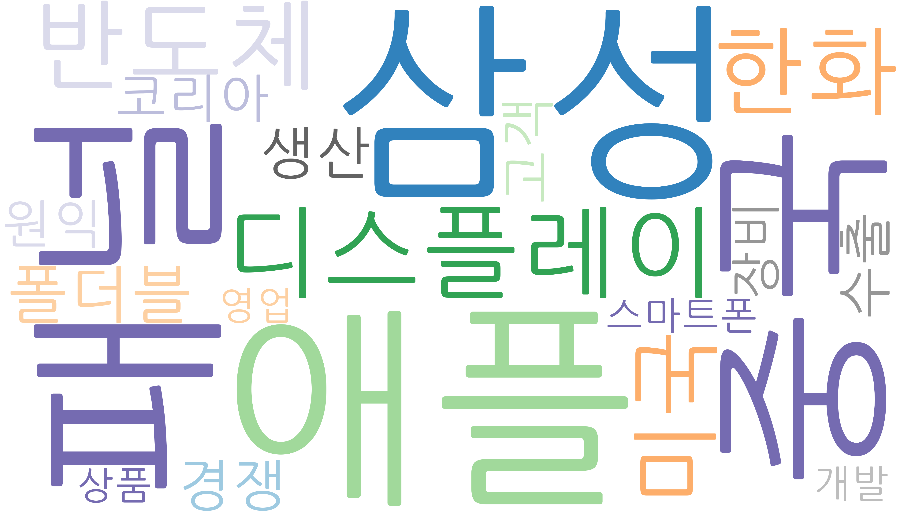

### 상위 키워드 Top 20
|   순위 | 키워드   |    점수 | 변화(참고)   |
|-----:|:------|------:|:---------|
|    1 | 애플    | 0.894 |          |
|    2 | 삼성    | 0.876 |          |
|    3 | 패널    | 0.809 |          |
|    4 | 중국    | 0.609 |          |
|    5 | 디스플레이 | 0.551 |          |
|    6 | 반도체   | 0.516 |          |
|    7 | 한화    | 0.483 |          |
|    8 | 미국    | 0.417 |          |
|    9 | 폴더블   | 0.412 |          |
|   10 | 생산    | 0.316 |          |
|   11 | 경쟁    | 0.299 |          |
|   12 | 고객    | 0.293 |          |
|   13 | 수출    | 0.289 |          |
|   14 | 코리아   | 0.279 |          |
|   15 | 원익    | 0.268 |          |
|   16 | 장비    | 0.26  |          |
|   17 | 스마트폰  | 0.257 |          |
|   18 | 영업    | 0.255 |          |
|   19 | 개발    | 0.253 |          |
|   20 | 상품    | 0.253 |          |

> 해석 가이드: 클러스터는 규제/정책, 공급망, 수요/고객 등 테마로 해석하면 빠릅니다.
> 그래서: 상위 키워드가 네트워크 허브와 겹치면 시장 영향력이 높은 신호일 가능성이 큽니다.
> 다음 액션: 해당 키워드를 포함한 토픽과 기업 교차점(매트릭스 섹션)을 확인하세요.

## 토픽 레이더

**핵심 요약**
- 관심도(X), 긍정성(Y), 성장률(색상)로 토픽 지형을 한눈에 파악합니다.
- 상위 토픽의 미니 시계열로 모멘텀을 점검합니다.

### 토픽 개요
|   topic_id | topic_summary                                                                                                            |
|-----------:|:-------------------------------------------------------------------------------------------------------------------------|
|          0 | 가을을 맞아 패션, 식품 등 인기 상품을 매일 최저가로 판매하는 특별 할인 행사.                                                                            |
|          1 | 한국과 중국을 중심으로 OLED TV 패널 기술 경쟁이 심화되고 있으며, LCD 기술과 함께 프리미엄 TV 시장의 디스플레이 기술 트렌드를 주도하고 있다.                                   |
|          2 | 인도에서 반도체 장비, 소재, 기술, 디스플레이 등 핵심 산업과 AI 관련 사업 동향을 다룹니다.                                                                   |
|          3 | 삼성전자 3분기 실적 발표 내용으로, 반도체 (특히 메모리) 및 AI 관련 실적과 영업이익, 매출 등이 주요 내용으로 다뤄질 것으로 예상됩니다.                                         |
|          4 | 한화가 APEC CEO 서밋의 스폰서로 참여하며, 정상회의와 더불어 방산 관련 논의도 이루어질 것으로 예상됨.                                                            |
|          5 | LG디스플레이의 OLED 패널, 특히 대형 OLED 실적 및 LCD 관련 매출 변화에 대한 내용.                                                                   |
|          6 | 미국의 AI 산업 투자가 활발한 가운데, 엔비디아를 중심으로 반도체 산업 경쟁이 심화될 것으로 예상되며, 트럼프 관련 정책도 영향을 미칠 것이다.                                        |
|          7 | 미국, 대만, 일본 등에서 차세대 디스플레이 기술인 마이크로 LED 기술에 대한 투자가 활발하게 이루어지고 있으며, 해당 기술이 디스플레이 산업의 핵심 기술로 부상하고 있음을 나타냅니다.                 |
|          8 | 홍콩 브랜드가 한국에서 할인 행사를 진행하며 한국 고객의 구매를 유도하는 내용입니다.                                                                          |
|          9 | 2024년 스마트폰과 연계된 AR/XR 등 차세대 디스플레이 및 광학 기술 동향, AI 기술 접목 및 대표이사 관련 이슈를 다룸.                                                 |
|         10 | LG전자가 중국과 미국 시장을 중심으로 프리미엄 가전, 특히 전기차 관련 가전 수출을 확대하고 있으며, 이는 TV 등 주요 제품군을 통해 가장 큰 성과를 내고 있음을 시사합니다.                      |
|         11 | OLED와 반도체, 그리고 관련 장비 수출이 ICT 분야 전반의 성장을 이끌며 역대 최고 수준을 기록하고 있음을 나타냅니다. 4K, AG, AW 등의 기술 키워드를 통해 디스플레이 품질 향상과 관련된 내용도 포함하… |

> 해석 가이드: 성장률이 높고 긍정성이 유지되는 토픽은 우선 탐색 대상입니다.
> 그래서: 토픽 성장과 기업 진입 변화가 동시에 보이면 시장 전환점일 가능성이 있습니다.
> 다음 액션: 상위 토픽을 기업×토픽 매트릭스에서 교차 확인하고, 기회/리스크로 분기하세요.

## 기업×토픽 매트릭스/히트맵

**핵심 요약**
- 가장 경쟁 치열 토픽: 반도체, 장비
- 가장 집중도 높은 기업: 삼성전자
- 최고 단일 조합: 삼성전자 × 3분기, 반도체

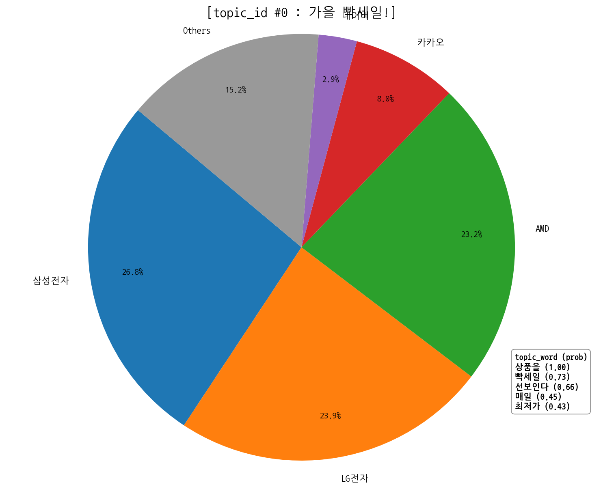

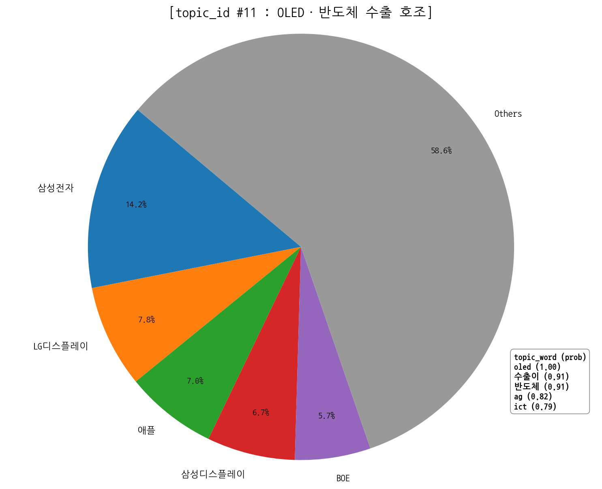
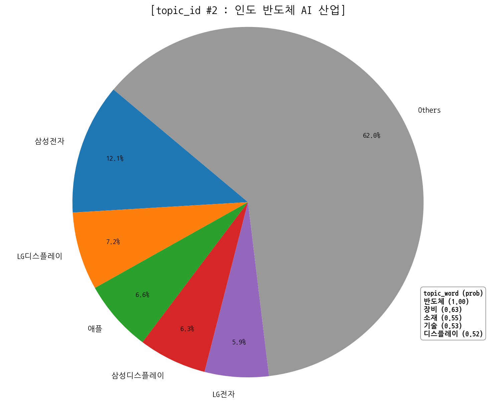

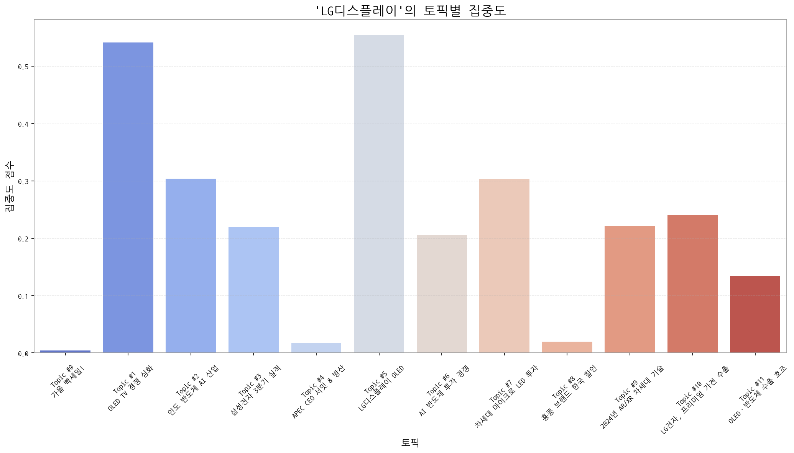
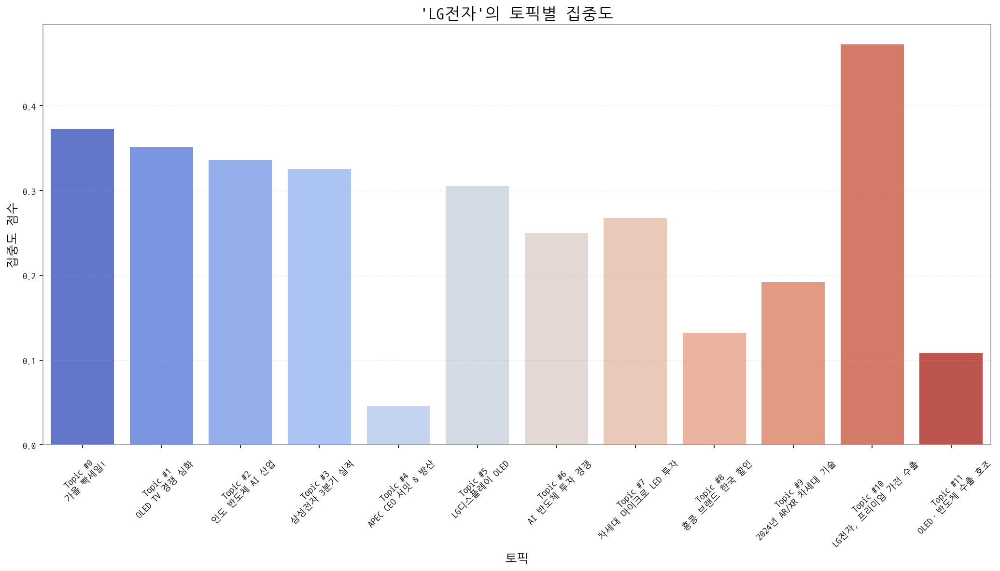
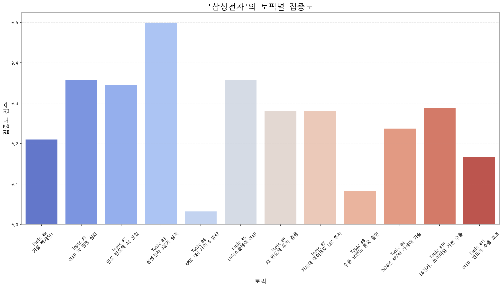

### 매트릭스 표(미리보기)
| org          | topic_0     | topic_1      | topic_10     | topic_11   | topic_2    | topic_3    |   topic_4 | topic_5      | topic_6    | topic_7    | topic_8    | topic_9    |
|:-------------|:------------|:-------------|:-------------|:-----------|:-----------|:-----------|----------:|:-------------|:-----------|:-----------|:-----------|:-----------|
| AMD          | 82.25 (23%) | nan          | 17.18 (2%)   | nan        | 21.02 (2%) | 31.48 (3%) |       nan | nan          | 31.19 (3%) | 17.18 (1%) | 19.75 (7%) | 12.48 (1%) |
| AUO          | nan         | 25.92 (2%)   | 10.74 (1%)   | nan        | 21.72 (2%) | 8.78 (1%)  |       nan | 17.00 (1%)   | 15.94 (1%) | 30.07 (2%) | nan        | 18.02 (2%) |
| BMW          | nan         | 7.01 (0%)    | 8.59 (1%)    | nan        | 7.71 (1%)  | nan        |       nan | 6.37 (1%)    | 7.62 (1%)  | 11.46 (1%) | 6.01 (2%)  | 7.62 (1%)  |
| BOE          | nan         | 91.08 (6%)   | 55.13 (6%)   | nan        | 59.55 (5%) | 38.07 (4%) |       nan | 76.48 (6%)   | 60.30 (6%) | 63.72 (5%) | nan        | 45.75 (5%) |
| BYD          | nan         | 11.21 (1%)   | 12.17 (1%)   | nan        | 7.01 (1%)  | nan        |       nan | 4.96 (0%)    | 8.32 (1%)  | 7.88 (1%)  | 5.15 (2%)  | 5.55 (1%)  |
| CES          | 1.29 (0%)   | 2.10 (0%)    | nan          | nan        | 2.10 (0%)  | nan        |       nan | 2.12 (0%)    | 1.39 (0%)  | 2.15 (0%)  | 0.86 (0%)  | 1.39 (0%)  |
| CSOT         | nan         | 53.24 (4%)   | 30.07 (3%)   | nan        | 24.52 (2%) | 19.03 (2%) |       nan | 46.03 (4%)   | 18.71 (2%) | 23.63 (2%) | nan        | 18.02 (2%) |
| Counterpoint | nan         | nan          | nan          | nan        | 0.70 (0%)  | 0.73 (0%)  |       nan | nan          | 0.69 (0%)  | nan        | 2.58 (1%)  | 0.69 (0%)  |
| ETRI         | nan         | nan          | nan          | nan        | 0.70 (0%)  | nan        |       nan | nan          | 0.69 (0%)  | 0.72 (0%)  | nan        | 1.39 (0%)  |
| HP           | nan         | 0.70 (0%)    | 1.43 (0%)    | 0.72 (0%)  | nan        | 1.46 (0%)  |       nan | nan          | nan        | nan        | nan        | 0.69 (0%)  |
| IEC          | nan         | 3.50 (0%)    | nan          | 0.72 (0%)  | 7.71 (1%)  | 2.20 (0%)  |       nan | 2.12 (0%)    | 4.85 (0%)  | 3.58 (0%)  | nan        | 4.85 (1%)  |
| IEEE         | nan         | 1.40 (0%)    | 2.15 (0%)    | 0.72 (0%)  | 1.40 (0%)  | 1.46 (0%)  |       nan | nan          | 2.08 (0%)  | 1.43 (0%)  | nan        | 1.39 (0%)  |
| ITU          | nan         | 3.50 (0%)    | nan          | 0.72 (0%)  | 7.71 (1%)  | 2.20 (0%)  |       nan | 2.12 (0%)    | 4.85 (0%)  | 3.58 (0%)  | nan        | 4.85 (1%)  |
| Innolux      | nan         | 27.32 (2%)   | 17.18 (2%)   | 10.86 (2%) | 25.22 (2%) | nan        |       nan | 19.12 (2%)   | 20.79 (2%) | 40.09 (3%) | nan        | 19.41 (2%) |
| IoT          | nan         | 18.92 (1%)   | 19.33 (2%)   | nan        | 16.11 (1%) | 8.78 (1%)  |       nan | 9.91 (1%)    | 12.48 (1%) | 17.90 (1%) | nan        | 13.86 (1%) |
| JDI          | nan         | 13.31 (1%)   | nan          | 5.79 (1%)  | 12.61 (1%) | 8.78 (1%)  |       nan | 14.87 (1%)   | 10.40 (1%) | 12.89 (1%) | nan        | 6.93 (1%)  |
| KAIST        | nan         | 3.50 (0%)    | nan          | 0.72 (0%)  | 7.71 (1%)  | 2.20 (0%)  |       nan | 2.12 (0%)    | 4.85 (0%)  | 3.58 (0%)  | nan        | 4.85 (1%)  |
| LG디스플레이      | nan         | 166.04 (11%) | 73.74 (7%)   | nan        | 93.18 (7%) | 67.35 (6%) |       nan | 169.96 (14%) | 63.08 (6%) | 93.08 (8%) | nan        | 67.93 (7%) |
| LG전자         | 84.82 (24%) | 79.87 (5%)   | 107.39 (11%) | nan        | 76.36 (6%) | 73.94 (7%) |       nan | 69.40 (6%)   | 56.84 (5%) | 60.86 (5%) | nan        | nan        |
| LG화학         | nan         | 9.11 (1%)    | 8.59 (1%)    | nan        | 19.62 (2%) | 7.32 (1%)  |       nan | 7.79 (1%)    | 10.40 (1%) | 14.32 (1%) | nan        | 7.62 (1%)  |

> 해석 가이드: 히트맵에서 진한 교차지점은 전략 초점을 의미합니다. 점수는 소스 커버리지에 민감합니다.
> 그래서: 경쟁 치열 토픽에서의 점유율 변화는 공격/수비 전략 신호일 수 있습니다.
> 다음 액션: 상위 기업과 토픽 교차를 기회 섹션으로 연결하고, 파트너/경쟁사 움직임을 추적하세요.

## 관계·경쟁 네트워크

**핵심 요약**
- 관계망 규모: 노드 38개 / 엣지 81개
- 가장 강한 관계: 삼성전자 ↔ 애플 (가중치 30, 유형 neutral)
- 허브 후보: 삼성전자 (Degree 0.6216)
- 브로커 후보: 삼성전자 (Betweenness 0.3048)

### 상위 관계쌍(Edge)
동일 문서/문장에서 함께 언급된 기업 쌍이며, 가중치는 동시출현 빈도입니다. 유형은 규칙 기반 추정입니다.

| Source   | Target   |   Weight | Type        |
|:---------|:---------|---------:|:------------|
| 삼성전자     | 애플       |       30 | neutral     |
| 삼성디스플레이  | 삼성전자     |       25 | rivalry     |
| 삼성디스플레이  | 애플       |       20 | rivalry     |
| 샤오미      | 애플       |       12 | partnership |
| 삼성전자     | 샤오미      |       12 | rivalry     |
| 삼성전자     | 엔비디아     |       11 | partnership |
| 마이크로소프트  | 한화       |       11 | partnership |
| 구글       | 애플       |       11 | neutral     |
| 한화       | 한화시스템    |       10 | partnership |
| 마이크로소프트  | 한화시스템    |       10 | partnership |

### 중심성 상위(연결 허브)
Degree 중심성은 연결된 상대 수의 비율입니다. 높을수록 허브 성격.

| Org     |   DegreeCentrality |
|:--------|-------------------:|
| 삼성전자    |             0.6216 |
| 애플      |             0.4595 |
| 샤오미     |             0.3784 |
| 삼성디스플레이 |             0.2703 |
| 메타      |             0.2432 |
| 엔비디아    |             0.2162 |
| 마이크로소프트 |             0.1892 |
| 구글      |             0.1622 |
| 오포      |             0.1622 |
| 비보      |             0.1351 |

### 매개 중심성 상위(정보 브로커)
Betweenness는 집단 간 ‘다리’ 역할 정도입니다. 높을수록 중개자 성격.

| Org     |   Betweenness |
|:--------|--------------:|
| 삼성전자    |        0.3048 |
| 애플      |        0.096  |
| 샤오미     |        0.0378 |
| 메타      |        0.0304 |
| 마이크로소프트 |        0.0286 |
| 엔비디아    |        0.0244 |
| 한화      |        0.0216 |
| 삼성디스플레이 |        0.0183 |
| 퀄컴      |        0.0055 |
| 구글      |        0.0053 |

### 커뮤니티(관계 클러스터)
> 모듈러리티 기반 자동 추출 집단. 같은 집단 내 기업은 유사 주제/밸류체인 공유 가능성.
- C0: 기아자동차, 디지타임스, 미디어텍, 비보, 삼성디스플레이, 삼성전자 | 해석: 기아자동차 중심의 연관 클러스터
- C1: 마이크로소프트, 아마존, 알파벳, 엔비디아, 인텔, 한화 | 해석: 마이크로소프트 중심의 연관 클러스터
- C2: 구글, 메타, 샤오미, 샤오펑, 선익시스템 | 해석: 구글 중심의 연관 클러스터
- C3: 기아, 퀄컴, 현대자동차, 현대차 | 해석: 기아 중심의 연관 클러스터
- C4: 네이버 | 해석: 네이버 중심의 연관 클러스터

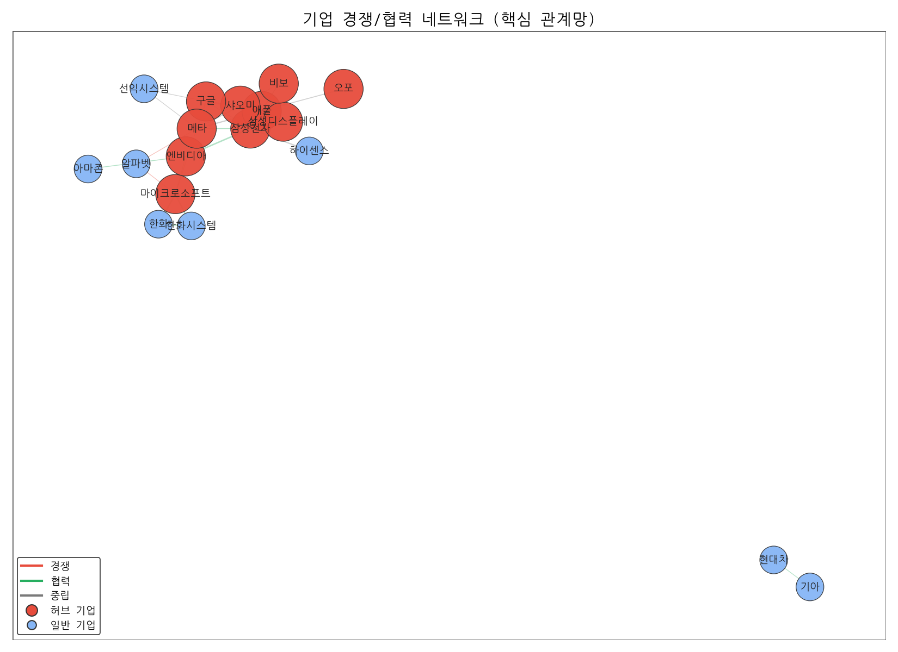

> 해석 가이드: 동시출현이 높은 쌍은 경쟁/협력 가능성을 시사합니다.
> 그래서: 허브/브로커 포지션은 영향력/협상력을 가리킵니다.
> 다음 액션: 커뮤니티별 주요 토픽/키워드와 교차하여 전략 단위를 정의하세요.

## 트렌드 타임라인

**핵심 요약**
- 기간: 2025-09-08 ~ 2025-10-13
- 총 기사 수: 2,970
- 일별 기사 수와 7일 이동평균, 변곡점을 주석으로 표시합니다.

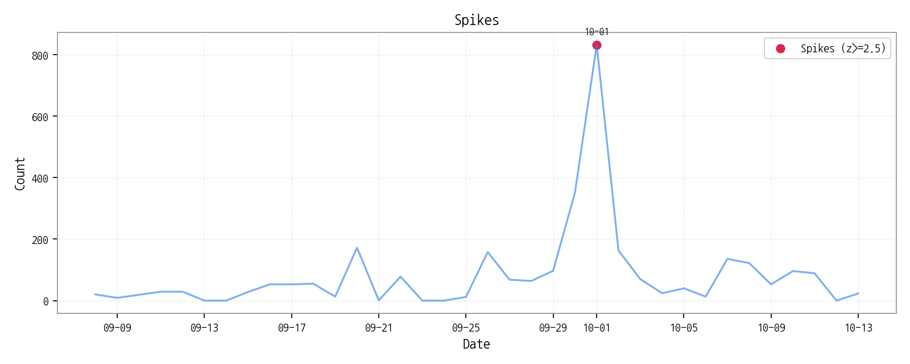

### 스파이크/이벤트 목록
| date       |   count |       z |
|:-----------|--------:|--------:|
| 2025-10-01 |     832 | 5.12315 |

> 해석 가이드: 단기 급등은 이벤트성 가능성이 있으니 2주 추세를 함께 보세요.
> 그래서: 스파이크 이후 토픽/신호 방향을 교차 확인하면 원인 파악이 빨라집니다.
> 다음 액션: 스파이크 날짜의 주요 기사와 키워드 변동을 키워드/토픽 섹션에서 재확인하세요.

## 시그널 보드(강한/약한 신호)

### 강한 신호(Strong Signals)

| term    |   cur |   z_like |   prev |   diff |   ma7 |   total |
|:--------|------:|---------:|-------:|-------:|------:|--------:|
| lg디스플레이 |     4 |    1.171 |      0 |      4 | 1.429 |      77 |
| tcl     |     1 |    0.622 |      0 |      1 | 0.143 |       1 |
| 비전프로    |     1 |    0.622 |      0 |      1 | 0.143 |       2 |
| 아이패드    |     1 |    0.622 |      0 |      1 | 0.143 |       5 |
| 맥북      |     1 |    0.465 |      0 |      1 | 0.286 |       8 |
| 현대차     |     1 |    0.074 |      1 |      0 | 0.857 |      24 |
| 폴더블     |     1 |   -0.195 |      3 |     -2 | 1.429 |      22 |
| lg      |     2 |   -0.366 |      0 |      2 | 3     |     255 |
| oled    |     2 |   -0.366 |      0 |      2 | 3     |     136 |
| lg전자    |     1 |   -0.464 |      1 |      0 | 2.143 |      37 |
| 애플      |     1 |   -0.773 |      2 |     -1 | 3.143 |      68 |
| 삼성전자    |     1 |   -1.299 |      8 |     -7 | 5.286 |      93 |
| 삼성      |     1 |   -1.673 |      6 |     -5 | 7.143 |     329 |

> 해석 가이드: 약한 신호는 가속도·이례성이 핵심이고, 강한 신호는 현재 주목도의 절대값입니다.
> 그래서: 약한→강한 신호로 전환하는 구간이 가장 좋은 기회가 됩니다.
> 다음 액션: 상위 신호 5개를 2주간 추적하고, 토픽/기업 매트릭스와 교차 검증하세요.

## 기술 성숙도 맵

**핵심 요약**
- 관심도(X), 긍정성(Y), 버블(사업 활발도)로 기술의 위치를 표현합니다.
- 단계: Seed/Early/Growth/Mature/Legacy

| 기술   | 단계       | 판단 근거                                                                                            |
|:-----|:---------|:-------------------------------------------------------------------------------------------------|
| 삼성   | Growth   | 높은 뉴스 언급 빈도, 긍정적인 시장 감성, 그리고 활발한 출시 및 투자 활동은 삼성 기술이 성장 단계에 있음을 시사합니다.                            |
| 패널   | Growth   | 뉴스 언급은 없지만 투자 및 출시 이벤트가 비교적 활발하게 발생하고 시장 감성 점수가 중간 수준을 보여 성장기에 진입한 것으로 판단됩니다.                    |
| 애플   | Maturity | 애플은 꾸준한 출시와 투자가 이루어지지만, 뉴스 언급 빈도와 시장 감성 점수가 중간 수준에 머물러 성숙기에 접어든 기술로 판단됩니다.                       |
| 폴더블  | Growth   | 비교적 낮은 뉴스 언급 빈도와 중간 정도의 시장 감성 점수, 그리고 출시 및 수주 이벤트 발생 비율이 투자 이벤트보다 높아 폴더블 기술이 성장 단계에 진입했음을 시사합니다. |

> 해석 가이드: Growth 구간이면서 강한 신호 결합 시 유망합니다.
> 그래서: Early라도 약한 신호가 누적되면 전환 후보입니다.
> 다음 액션: 상위 기술 3개를 기회 섹션과 연결하고 파일럿 과제를 정의하세요.

## 비즈니스 기회(Top 5)

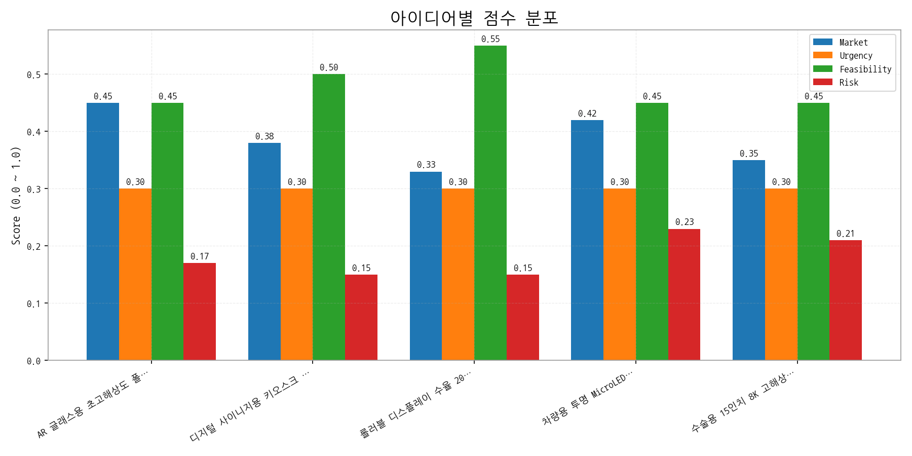

| 아이디어                                     | 타깃                                 | 가치제안                                                                                                            | 점수(시장/긴급/실행/리스크)         |
|:-----------------------------------------|:-----------------------------------|:----------------------------------------------------------------------------------------------------------------|:-------------------------|
| AR 글래스용 초고해상도 폴더블 OLED 개발                | 북미 빅테크 기업 (AR/VR 기기 제조사)           | 기존 AR 글래스 대비 월등한 해상도, 명암비, 색재현율을 제공하여 몰입감 극대화. 폴더블 디자인으로 휴대성 및 착용감 향상. 저전력 설계로 배터리 사용 시간 증대.                    | 3.3 (0.45/0.3/0.45/0.17) |
| 디지털 사이니지용 키오스크 번인 방지 AI 솔루션              | 글로벌 디지털 사이니지 제조사, 키오스크 운영사         | AI 기반 실시간 번인 예측 및 방지 알고리즘 제공. 화면 밝기 자동 조절, 픽셀 시프팅, 콘텐츠 최적화 등 다양한 기능 제공. 번인 발생률 감소 및 디스플레이 수명 연장으로 유지보수 비용 절감.   | 3.3 (0.38/0.3/0.5/0.15)  |
| 롤러블 디스플레이 수율 20% 향상을 위한 AI 공정 모니터링 서비스   | 국내외 디스플레이 패널 제조사 (롤러블 디스플레이 생산 라인) | AI 기반 실시간 공정 데이터 분석 및 불량 예측. 불량 발생 원인 분석 및 공정 최적화 솔루션 제공. 수율 향상 및 생산 비용 절감. 롤러블 디스플레이 시장 경쟁력 강화.                | 3.2 (0.33/0.3/0.55/0.15) |
| 차량용 투명 MicroLED HUD (Head-Up Display) 개발 | 글로벌 완성차 OEM (Tier 1 부품사 협력)        | 기존 HUD 대비 월등한 투명도, 넓은 시야각, 고해상도, AR/VR 콘텐츠 연동으로 안전하고 몰입감 있는 운전 경험 제공. MicroLED의 긴 수명과 높은 신뢰성으로 유지보수 비용 절감.      | 3.0 (0.42/0.3/0.45/0.23) |
| 수술용 15인치 8K 고해상도 MicroLED 패널 개발          | 글로벌 의료기기 제조사 (수술용 장비)              | 기존 LCD 대비 월등한 해상도, 명암비, 색재현율을 제공하여 수술 시야 확보 및 정확도 향상. MicroLED의 긴 수명과 낮은 발열로 안정적인 수술 환경 제공. 멸균 및 소독에 강한 내구성 설계. | 2.8 (0.35/0.3/0.45/0.21) |

> 해석 가이드: 점수는 내부 가중치 기반(예: Market 0.35, Urgency 0.25, Feasibility 0.25, Risk -0.15).
> 그래서: 상위안은 단기 임팩트/실행 가능성이 높은 편입니다.
> 다음 액션: 각 아이디어에 대해 2주 파일럿(가설·대상·KPI)을 정의하고 담당 오너를 배정하세요.

## 리스크/이슈 관측소

- (리스크/이슈 데이터 없음)

> 해석 가이드: 부정 감성 급등은 PR·컴플라이언스·조달과 연계가 필요합니다.
> 그래서: 공급망 키워드와 동반 급등 시 실제 운영 리스크로 이어질 수 있습니다.
> 다음 액션: 영향범위가 큰 이슈는 즉시 리스크 레지스터에 등록하고 완화 액션을 실행하세요.

## 결론: So What & Next Steps

### 다음 2주 실행안(템플릿)
| hypothesis          | target         | kpi               | owner   | due        |
|:--------------------|:---------------|:------------------|:--------|:-----------|
| 토픽 A 관심도↑는 고객 니즈 증가 | SMB 고객 20명 인터뷰 | 응답률 30%/신규 리드 10건 | 사업개발팀   | 2025-10-28 |

> 해석 가이드: 데이터-인사이트-액션의 연결을 표준 템플릿으로 기록하세요.
> 그래서: 우선순위 상위 안건부터 빠르게 실험해야 기회를 놓치지 않습니다.
> 다음 액션: 오너/기한/KPI가 명확한 항목부터 킥오프하세요.

## 부록(Appendix)

분석의 투명성을 확보하고, 다음 단계 분석을 위한 원천 자료를 제공합니다.

### 데이터 메타
| 파일                             | 수정시각                |   크기(bytes) |
|:-------------------------------|:--------------------|------------:|
| outputs/keywords.json          | 2025-10-14 14:29:45 |        1533 |
| outputs/topics.json            | 2025-10-14 14:30:15 |       14107 |
| outputs/trend_timeseries.json  | 2025-10-14 14:29:47 |        2143 |
| outputs/trend_insights.json    | 2025-10-14 14:30:23 |        8569 |
| outputs/biz_opportunities.json | 2025-10-14 14:31:24 |       26738 |
| outputs/tech_maturity.json     | 2025-10-14 14:31:00 |        2234 |
| outputs/company_network.json   | 2025-10-14 14:31:05 |       17244 |

> 해석 가이드: 재현성과 감사추적을 위해 생성일, 버전, 파라미터를 함께 보관하세요.
> 그래서: 데이터 출처와 가공 과정을 명확히 남기면 신뢰성이 높아집니다.
> 다음 액션: 주요 이미지/표 생성 실패 로그도 추적 테이블로 남겨두세요.
