## Intellegence Report (2025-10-14)

**핵심 요약**
- 기간: 2025-09-08 ~ 2025-10-14
- 기사 수: 3,323
- 토픽 수: 10 | 상위 키워드: 20

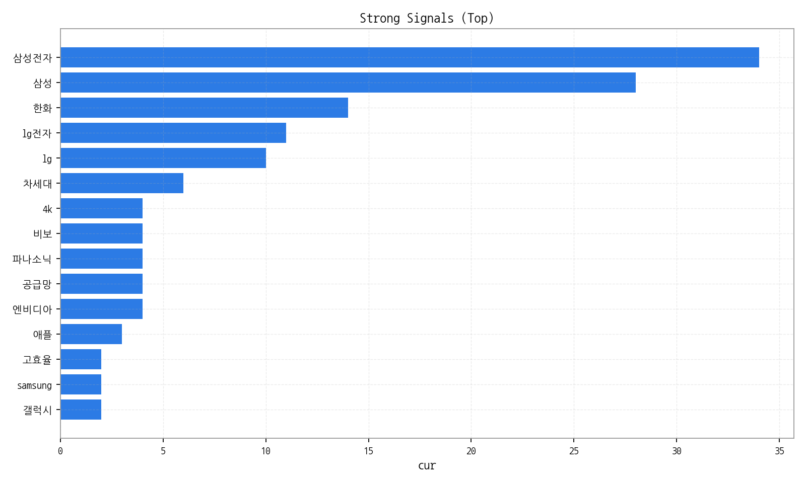

**이번 주 하이라이트**
- ## 데일리 인텔리전스 브리핑 (디스플레이 산업)
- **1. 핵심 맥락**
- *   **중국 디스플레이 기술 성장과 OLED 경쟁 심화:** 중국의 디스플레이 기술력이 빠르게 성장하면서 OLED 시장 경쟁이 심화되고 있습니다. 특히 TV, 자동차, 전기차 등 다양한 분야에서 OLED 기술이 핵심으로 부상하면서, 중국 기업들의 생산 능력 확대와 가격 경쟁력 강화가 국내 디스플레이 업체들에게 위협 요인으로 작용하고 있습니다. (Topic 0, 3, Keywords: 디스플레이, OLED, 중국, 생산)
- *   **AI 융합 OLED 스마트 기기 시장 확대 및 기술 경쟁:** AI 기술이 융합된 OLED 패널 기반 스마트폰, 게이밍 기기 시장이 확대되고 있습니다. 안전, 에너지 효율, 산업용 통합 시스템 관련 기술 경쟁이 치열해지고 있으며, 특히 삼성과 애플 등 주요 기업들이 폴더블 기기를 중심으로 OLED 기술 혁신을 주도하고 있습니다. (Topic 2, 5, 8, Keywords: AI, OLED, 스마트폰, 폴더블, 삼성, 애플)
- *   **OLED 패널 실적 변동성과 인도 투자 확대:** LG디스플레이의 OLED 패널 3분기 실적에서 나타나듯, TV용 OLED 패널 출하량 및 영업이익은 시장 상황에 따라 변동성이 큰 편입니다. 이러한 상황에서 애플은 폴더블 기기용 6세대 OLED 생산라인 구축을 위해 인도에 투자를 확대하고 있으며, 이는 중국 외 생산 기지 확보 및 공급망 다변화 전략의 일환으로 해석됩니다. (Topic 4, 5, Keywords: OLED, 패널, 실적, 인도, 폴더블)
- **2. 인사이트**
- *   **기회:**
- *   **AI 융합 디스플레이 시장 선점:** AI 기술과 OLED의 결합은 새로운 사용자 경험을 창출하고 고부가가치 시장을 형성할 기회를 제공합니다. 특히 스마트폰, 게이밍 기기, 자동차 등 다양한 분야에서 혁신적인 디스플레이 솔루션을 제공할 수 있습니다.
- *   **인도 시장 진출 확대:** 애플의 인도 투자 확대는 디스플레이 및 관련 부품 시장의 성장 가능성을 시사합니다. 인도 시장에 대한 선제적인 투자와 현지화 전략을 통해 새로운 성장 동력을 확보할 수 있습니다.
- *   **위험:**
- *   **중국 디스플레이 기업의 기술 추격 및 가격 경쟁:** 중국 기업들의 기술력이 빠르게 향상되면서 OLED 시장에서 가격 경쟁이 심화될 가능성이 높습니다. 기술 우위를 유지하고 차별화된 제품을 개발하는 것이 중요합니다.
- *   **OLED 패널 실적 변동성 확대:** 글로벌 경기 침체 및 수요 감소로 인해 OLED 패널 실적 변동성이 확대될 수 있습니다. 안정적인 수익 확보를 위해 고부가가치 제품 개발 및 시장 다변화 노력이 필요합니다.
- *   **경쟁 구도:**
- *   **삼성 vs 애플:** 폴더블 디스플레이 시장을 중심으로 삼성과 애플의 경쟁이 더욱 심화될 것으로 예상됩니다. 기술 혁신과 차별화된 디자인을 통해 시장 주도권을 확보하는 것이 중요합니다.
- *   **한국 vs 중국:** OLED 시장에서 한국과 중국 기업 간의 경쟁이 더욱 치열해질 것으로 예상됩니다. 기술 우위를 유지하고 고부가가치 제품 개발에 집중하는 것이 중요합니다.
- **3. Action Items**
- *   **전략:**
- *   **AI 융합 디스플레이 기술 로드맵 구축:** AI 기술과 OLED의 결합을 통해 새로운 사용자 경험을 창출할 수 있는 기술 로드맵을 구축하고, 관련 기술 개발에 집중 투자합니다.
- *   **사업 개발:**
- *   **인도 시장 진출 전략 수립:** 애플의 인도 투자 확대에 발맞춰 인도 시장 진출 전략을 수립하고, 현지 파트너십 구축 및 투자 기회를 모색합니다.
- *   **기술 기획:**
- *   **차세대 디스플레이 기술 개발:** 폴더블, 스트레처블, 롤러블 등 차세대 디스플레이 기술 개발에 집중 투자하고, 경쟁 우위를 확보합니다.

## 모니터링 스냅샷

### 기사 하이라이트(상위 5)
| 제목                                       | 링크                                                                  |
|:-----------------------------------------|:--------------------------------------------------------------------|
| 10월 3주 주요 제조업 전망                         | https://www.laborplus.co.kr/news/articleView.html?idxno=36385       |
| 삼성전자의 부활… 역대 최대 분기 매출로 영업익 12조원 돌파       | https://www.greenpostkorea.co.kr/news/articleView.html?idxno=304363 |
| LGD·에코프로비엠·호텔신라…3분기 실적 개선 기대株 뜬다         | https://www.hankyung.com/article/2025101481961                      |
| 9월 ICT 수출, 반도체 호조세에 역대 최대 실적 달성···14.0%↑ | http://www.todaykorea.co.kr/news/articleView.html?idxno=335341      |
| 삼성전자는 '깜짝실적'·LG전자는 '주춤'…희비 엇갈린 3분기 실적    | https://it.chosun.com/news/articleView.html?idxno=2023092148850     |

## 핵심 지표 보드

| 기간                      |   총 기사 수 |   문서 수 |   상위 키워드 수 |   토픽 수 |   시계열 일수 |
|:------------------------|---------:|-------:|-----------:|-------:|---------:|
| 2025-09-08 ~ 2025-10-14 |     3323 |      0 |         20 |     10 |       37 |

> 해석 가이드: 전주 대비 증감률을 함께 보아야 변화를 정확히 해석할 수 있습니다.
> 그래서: 문서/기사 수가 급증하면 키워드/토픽 점유 구조가 바뀔 가능성이 큽니다.
> 다음 액션: 이상값이 보이면 타임라인 섹션의 변곡점 주석과 함께 원인을 추적하세요.

## 키워드 인텔리전스

**핵심 요약**
- 상위 키워드 분포와 클러스터를 통해 테마 맥락을 파악합니다.
- 점수 상승과 긍정 감성 결합은 유망 신호입니다.

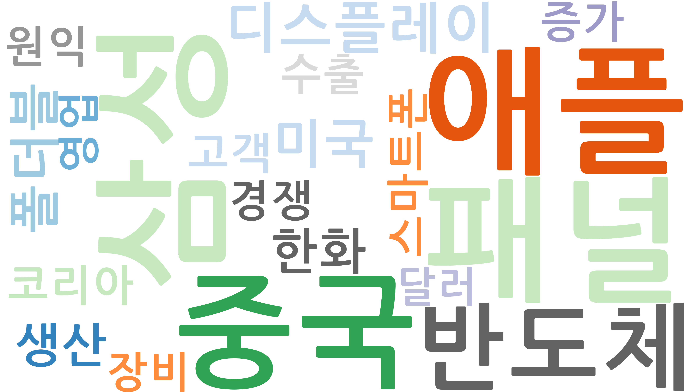
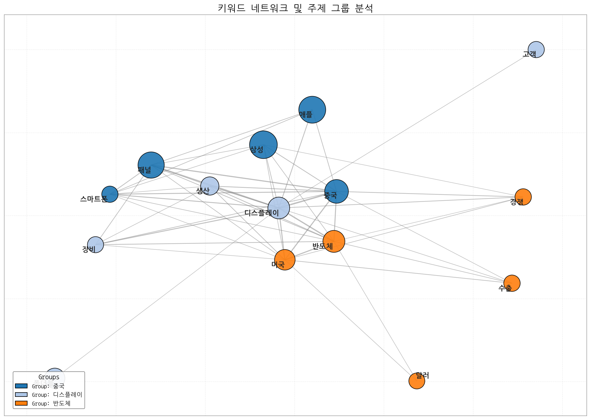
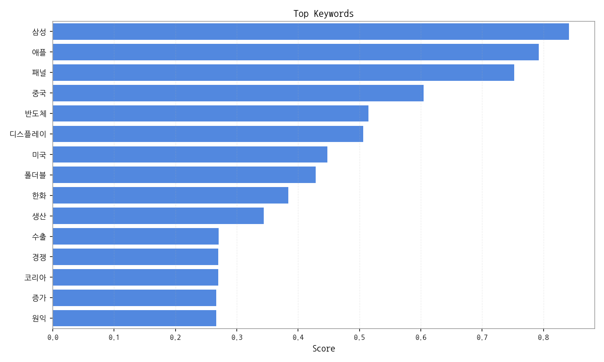

### 상위 키워드 Top 20
|   순위 | 키워드   |    점수 | 변화(참고)   |
|-----:|:------|------:|:---------|
|    1 | 삼성    | 0.842 |          |
|    2 | 애플    | 0.792 |          |
|    3 | 패널    | 0.752 |          |
|    4 | 중국    | 0.604 |          |
|    5 | 반도체   | 0.515 |          |
|    6 | 디스플레이 | 0.506 |          |
|    7 | 미국    | 0.448 |          |
|    8 | 폴더블   | 0.429 |          |
|    9 | 한화    | 0.384 |          |
|   10 | 생산    | 0.344 |          |
|   11 | 수출    | 0.27  |          |
|   12 | 경쟁    | 0.27  |          |
|   13 | 코리아   | 0.27  |          |
|   14 | 증가    | 0.267 |          |
|   15 | 원익    | 0.266 |          |
|   16 | 스마트폰  | 0.265 |          |
|   17 | 고객    | 0.264 |          |
|   18 | 장비    | 0.26  |          |
|   19 | 영업    | 0.257 |          |
|   20 | 달러    | 0.254 |          |

> 해석 가이드: 클러스터는 규제/정책, 공급망, 수요/고객 등 테마로 해석하면 빠릅니다.
> 그래서: 상위 키워드가 네트워크 허브와 겹치면 시장 영향력이 높은 신호일 가능성이 큽니다.
> 다음 액션: 해당 키워드를 포함한 토픽과 기업 교차점(매트릭스 섹션)을 확인하세요.

## 토픽 레이더

**핵심 요약**
- 관심도(X), 긍정성(Y), 성장률(색상)로 토픽 지형을 한눈에 파악합니다.
- 상위 토픽의 미니 시계열로 모멘텀을 점검합니다.

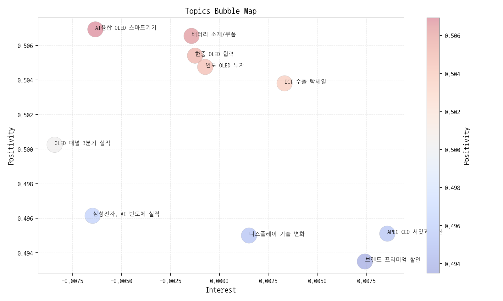
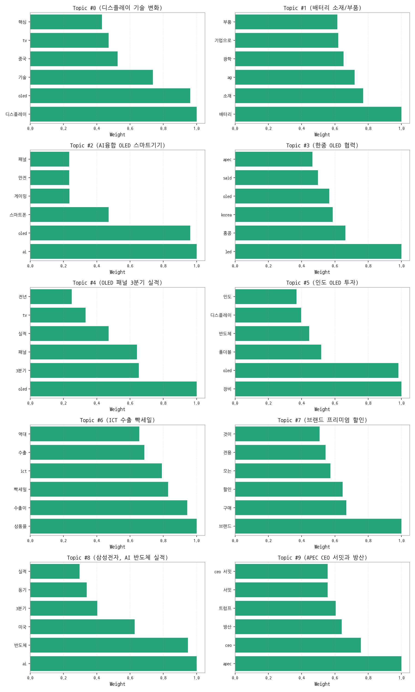

### 토픽 개요
|   topic_id | topic_summary                                                                                             |
|-----------:|:----------------------------------------------------------------------------------------------------------|
|          0 | 중국의 디스플레이 기술 성장과 함께 OLED, LCD 등 디스플레이 기술이 TV, 자동차, 전기차 등 다양한 분야에서 핵심 기술로 부상하며 생산 경쟁 심화되는 상황을 다룬 뉴스 토픽입니다. |
|          1 | 배터리, 광학, 친환경 관련 소재 및 부품 사업을 하는 기업들의 거래 및 사업 동향 (Ag, AW 포함)                                                |
|          2 | AI 기술이 융합된 OLED 패널 기반 스마트폰 및 게이밍 기기의 안전, 에너지 효율, 산업용 통합 시스템 관련 기술 동향.                                     |
|          3 | 한국과 중국의 LED/OLED 발광 재료 협력 및 홍콩 APEC 관련 경제 동향 분석.                                                          |
|          4 | LG디스플레이의 OLED 패널 3분기 실적, 특히 TV용 OLED 패널 출하량과 영업이익의 전년 대비 변화에 대한 내용입니다.                                    |
|          5 | 애플의 폴더블 기기용 6세대 OLED 생산라인 구축을 위해 인도에 디스플레이 및 반도체 장비 투자가 이루어지고 있음을 나타낸다. ELA 기술도 관련된 것으로 보인다.              |
|          6 | 반도체를 포함한 ICT 상품 수출을 촉진하기 위한 역대 최저가 빡세일 행사가 매일 열리는 것을 알리는 뉴스.                                              |
|          7 | 브랜드에서 고객 전용 프리미엄 상품을 할인된 가격으로 구매할 수 있는 기회를 제공하는 내용.                                                       |
|          8 | 삼성전자의 AI 반도체 메모리 수출 증가와 함께 3분기 실적에 대한 기대감 및 미국 시장에서의 경쟁 상황을 다루는 뉴스 토픽입니다. 전년 동기 대비 실적 변화에 주목하고 있습니다.      |
|          9 | APEC CEO 서밋, 정상회의, 트럼프 관련 소식과 함께 방산 관련 논의 및 미국 증시 마감 현황 등을 다루는 뉴스 토픽.                                     |

> 해석 가이드: 성장률이 높고 긍정성이 유지되는 토픽은 우선 탐색 대상입니다.
> 그래서: 토픽 성장과 기업 진입 변화가 동시에 보이면 시장 전환점일 가능성이 있습니다.
> 다음 액션: 상위 토픽을 기업×토픽 매트릭스에서 교차 확인하고, 기회/리스크로 분기하세요.

## 기업×토픽 매트릭스/히트맵

**핵심 요약**
- 가장 경쟁 치열 토픽: ai, oled
- 가장 집중도 높은 기업: 삼성전자
- 최고 단일 조합: 삼성전자 × ai, 반도체

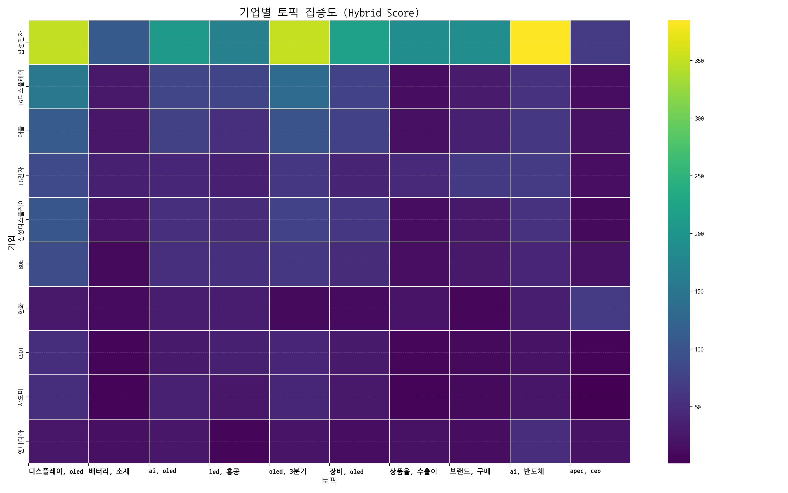
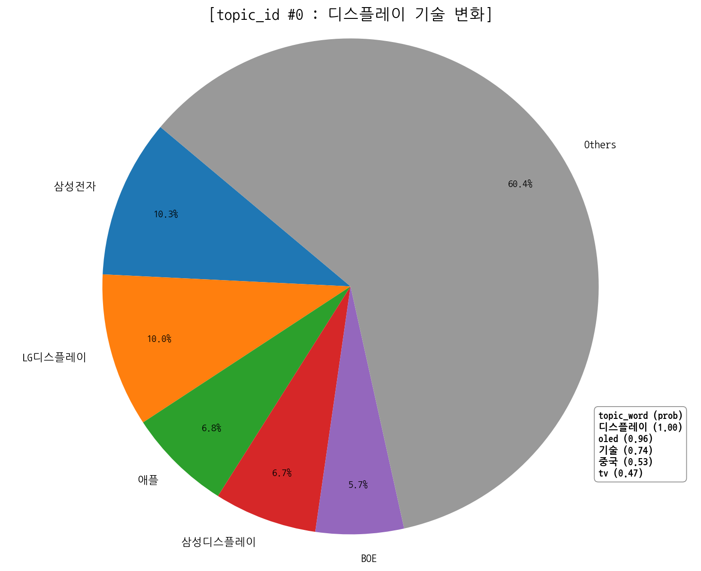
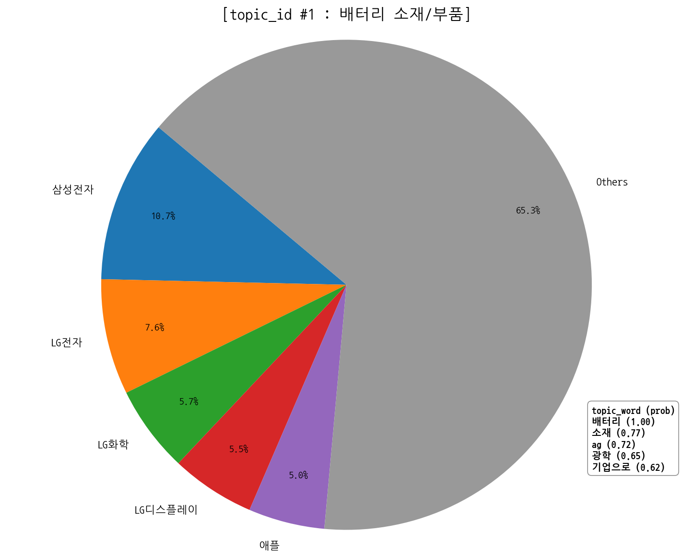

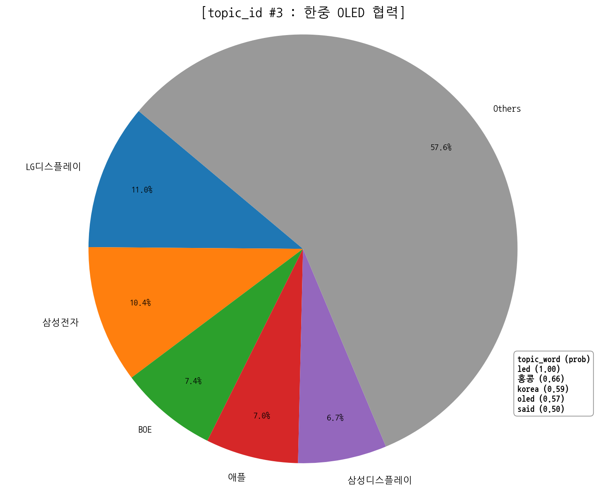
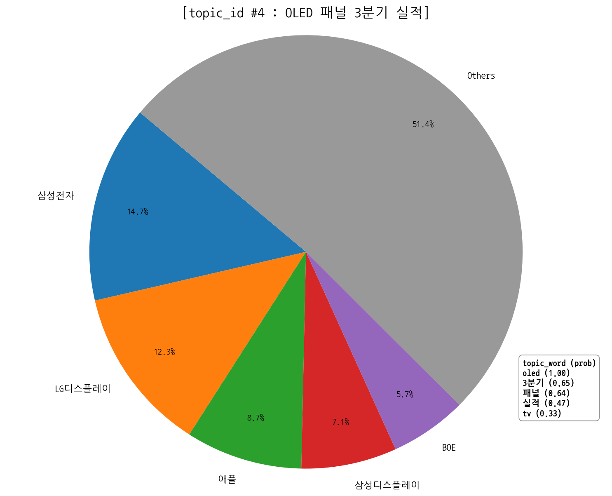
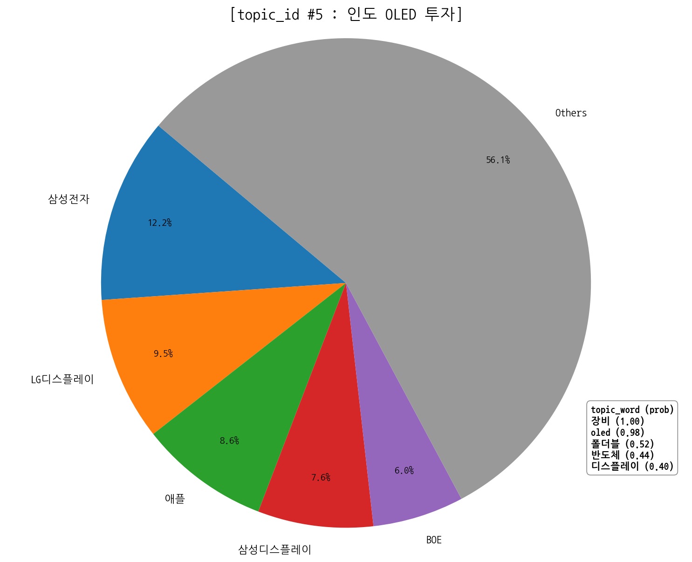
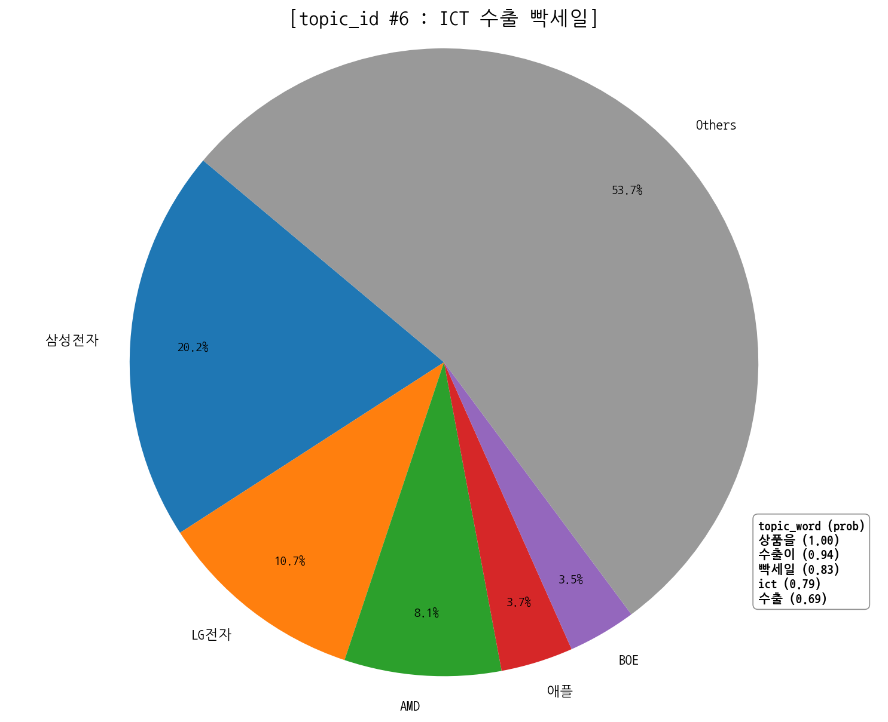
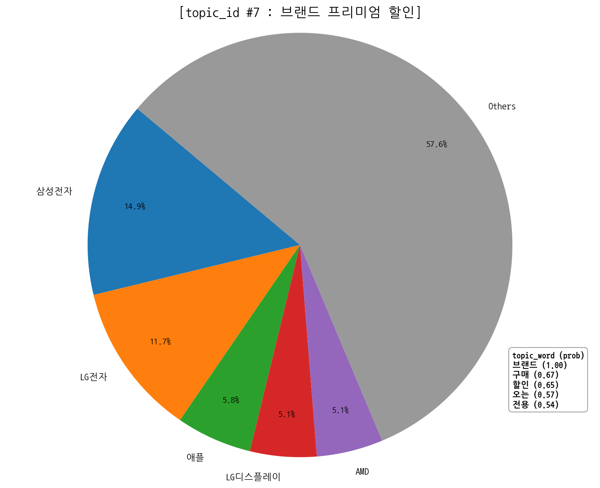

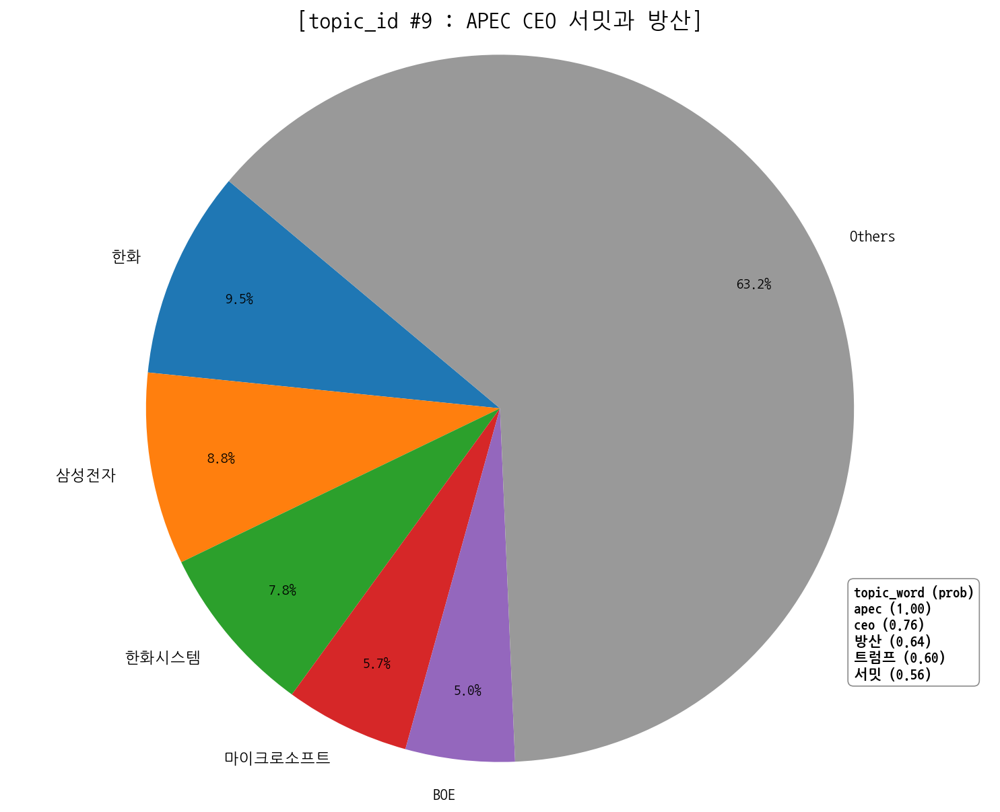

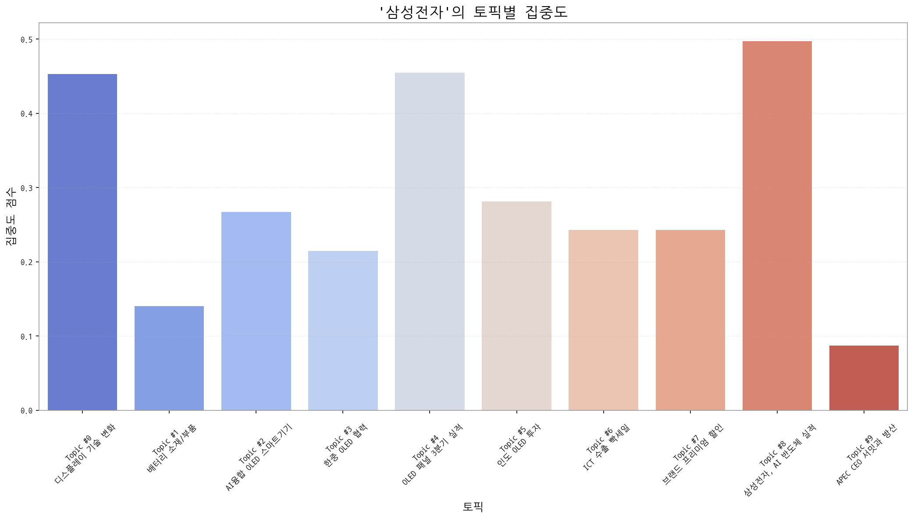
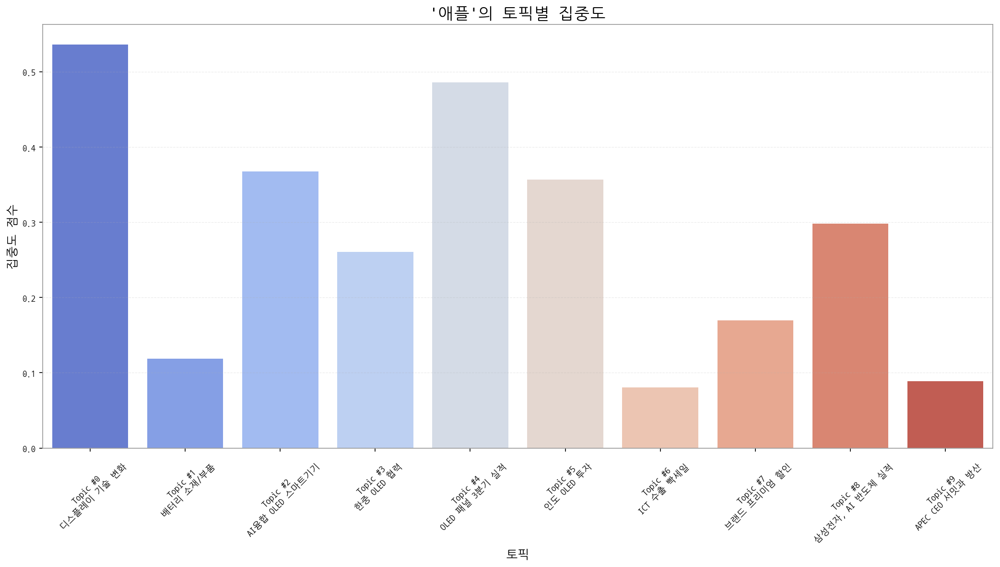

### 매트릭스 표(미리보기)
| org          | topic_0      | topic_1    | topic_2    | topic_3     | topic_4      | topic_5    | topic_6     | topic_7     | topic_8    | topic_9    |
|:-------------|:-------------|:-----------|:-----------|:------------|:-------------|:-----------|:------------|:------------|:-----------|:-----------|
| AMD          | 9.81 (1%)    | nan        | 10.51 (1%) | 6.52 (1%)   | 11.46 (1%)   | nan        | 33.94 (8%)  | 28.97 (5%)  | 26.49 (3%) | 8.25 (2%)  |
| AUO          | 26.62 (2%)   | nan        | 13.31 (1%) | 9.41 (1%)   | 8.59 (1%)    | 12.17 (2%) | 5.22 (1%)   | 10.46 (2%)  | 8.59 (1%)  | nan        |
| BMW          | 12.61 (1%)   | 5.56 (1%)  | 3.50 (0%)  | 2.90 (0%)   | 3.58 (0%)    | 3.58 (0%)  | nan         | 9.66 (2%)   | nan        | 2.48 (1%)  |
| BOE          | 88.27 (6%)   | nan        | 52.54 (6%) | 53.57 (7%)  | 62.29 (6%)   | 48.69 (6%) | nan         | 25.76 (4%)  | 40.81 (4%) | 17.34 (5%) |
| BYD          | 11.21 (1%)   | 3.18 (1%)  | 4.20 (0%)  | 2.90 (0%)   | 2.86 (0%)    | 2.86 (0%)  | nan         | 4.02 (1%)   | 3.58 (0%)  | nan        |
| CES          | 2.10 (0%)    | nan        | nan        | nan         | 1.43 (0%)    | 0.72 (0%)  | nan         | 1.61 (0%)   | 0.72 (0%)  | nan        |
| CSOT         | 51.14 (3%)   | nan        | 27.32 (3%) | 34.02 (5%)  | 40.09 (4%)   | 26.49 (3%) | 7.83 (2%)   | 11.27 (2%)  | 20.05 (2%) | nan        |
| Counterpoint | nan          | nan        | 0.70 (0%)  | 0.72 (0%)   | nan          | nan        | nan         | nan         | 0.72 (0%)  | nan        |
| ETRI         | 0.70 (0%)    | 0.79 (0%)  | nan        | nan         | nan          | nan        | nan         | nan         | nan        | nan        |
| HP           | 0.70 (0%)    | nan        | 0.70 (0%)  | 0.72 (0%)   | nan          | nan        | nan         | nan         | 0.72 (0%)  | nan        |
| IEC          | 4.20 (0%)    | nan        | 2.80 (0%)  | 0.72 (0%)   | 0.72 (0%)    | 2.15 (0%)  | nan         | nan         | 2.15 (0%)  | nan        |
| IEEE         | 1.40 (0%)    | nan        | 1.40 (0%)  | 1.45 (0%)   | 0.72 (0%)    | 0.72 (0%)  | nan         | nan         | 2.15 (0%)  | 0.83 (0%)  |
| ITU          | 4.20 (0%)    | nan        | 2.80 (0%)  | 0.72 (0%)   | 0.72 (0%)    | 2.15 (0%)  | nan         | nan         | 2.15 (0%)  | nan        |
| Innolux      | 31.53 (2%)   | 8.74 (2%)  | 11.91 (1%) | 13.03 (2%)  | 9.31 (1%)    | 15.75 (2%) | nan         | 11.27 (2%)  | 11.46 (1%) | nan        |
| IoT          | 19.62 (1%)   | 10.33 (2%) | 9.81 (1%)  | 7.24 (1%)   | 4.30 (0%)    | 5.01 (1%)  | nan         | 12.88 (2%)  | 6.44 (1%)  | nan        |
| JDI          | 14.01 (1%)   | 6.36 (1%)  | 7.01 (1%)  | 3.62 (0%)   | 13.60 (1%)   | 7.88 (1%)  | 3.48 (1%)   | nan         | 7.16 (1%)  | nan        |
| KAIST        | 4.20 (0%)    | nan        | 2.80 (0%)  | 0.72 (0%)   | 0.72 (0%)    | 2.15 (0%)  | nan         | nan         | 2.15 (0%)  | nan        |
| LG디스플레이      | 154.13 (10%) | 25.44 (6%) | 81.27 (9%) | 79.63 (11%) | 133.88 (12%) | 76.61 (9%) | nan         | 28.97 (5%)  | 55.85 (6%) | nan        |
| LG전자         | 87.57 (6%)   | 34.98 (8%) | 41.33 (5%) | nan         | 62.29 (6%)   | 38.66 (5%) | 45.26 (11%) | 66.80 (12%) | 68.02 (7%) | nan        |
| LG화학         | 28.02 (2%)   | 26.23 (6%) | 13.31 (1%) | 7.24 (1%)   | 5.73 (1%)    | 12.89 (2%) | 6.96 (2%)   | nan         | 14.32 (1%) | nan        |

> 해석 가이드: 히트맵에서 진한 교차지점은 전략 초점을 의미합니다. 점수는 소스 커버리지에 민감합니다.
> 그래서: 경쟁 치열 토픽에서의 점유율 변화는 공격/수비 전략 신호일 수 있습니다.
> 다음 액션: 상위 기업과 토픽 교차를 기회 섹션으로 연결하고, 파트너/경쟁사 움직임을 추적하세요.

## 관계·경쟁 네트워크

**핵심 요약**
- 관계망 규모: 노드 37개 / 엣지 93개
- 가장 강한 관계: 삼성전자 ↔ 애플 (가중치 32, 유형 neutral)
- 허브 후보: 삼성전자 (Degree 0.6667)
- 브로커 후보: 삼성전자 (Betweenness 0.3777)

### 상위 관계쌍(Edge)
동일 문서/문장에서 함께 언급된 기업 쌍이며, 가중치는 동시출현 빈도입니다. 유형은 규칙 기반 추정입니다.

| Source   | Target   |   Weight | Type        |
|:---------|:---------|---------:|:------------|
| 삼성전자     | 애플       |       32 | neutral     |
| 삼성디스플레이  | 삼성전자     |       26 | rivalry     |
| 삼성디스플레이  | 애플       |       20 | rivalry     |
| 샤오미      | 애플       |       12 | partnership |
| 삼성전자     | 샤오미      |       11 | rivalry     |
| 메타       | 애플       |       11 | neutral     |
| 구글       | 애플       |       11 | neutral     |
| 삼성전자     | 엔비디아     |       10 | partnership |
| 애플       | 엔비디아     |        9 | partnership |
| 삼성전자     | 하이센스     |        9 | neutral     |

### 중심성 상위(연결 허브)
Degree 중심성은 연결된 상대 수의 비율입니다. 높을수록 허브 성격.

| Org     |   DegreeCentrality |
|:--------|-------------------:|
| 삼성전자    |             0.6667 |
| 애플      |             0.5    |
| 샤오미     |             0.3611 |
| 구글      |             0.2778 |
| 메타      |             0.2778 |
| 삼성디스플레이 |             0.2778 |
| 엔비디아    |             0.25   |
| 마이크로소프트 |             0.2222 |
| 아마존     |             0.1944 |
| 현대차     |             0.1944 |

### 매개 중심성 상위(정보 브로커)
Betweenness는 집단 간 ‘다리’ 역할 정도입니다. 높을수록 중개자 성격.

| Org     |   Betweenness |
|:--------|--------------:|
| 삼성전자    |        0.3777 |
| 애플      |        0.1081 |
| 현대차     |        0.0454 |
| 샤오미     |        0.0324 |
| 마이크로소프트 |        0.0253 |
| 삼성디스플레이 |        0.0206 |
| 구글      |        0.0188 |
| 기아      |        0.0175 |
| 메타      |        0.0167 |
| 엔비디아    |        0.0153 |

### 커뮤니티(관계 클러스터)
> 모듈러리티 기반 자동 추출 집단. 같은 집단 내 기업은 유사 주제/밸류체인 공유 가능성.
- C0: 기아자동차, 디지타임스, 미디어텍, 비보, 삼성디스플레이, 삼성전자 | 해석: 기아자동차 중심의 연관 클러스터
- C1: 구글, 마이크로소프트, 메타, 선익시스템, 아마존, 알파벳 | 해석: 구글 중심의 연관 클러스터
- C2: 기아, 네이버, 카카오, 퀄컴, 현대모비스, 현대자동차 | 해석: 기아 중심의 연관 클러스터
- C3: 레노버 | 해석: 레노버 중심의 연관 클러스터
- C4: 벤츠 | 해석: 벤츠 중심의 연관 클러스터

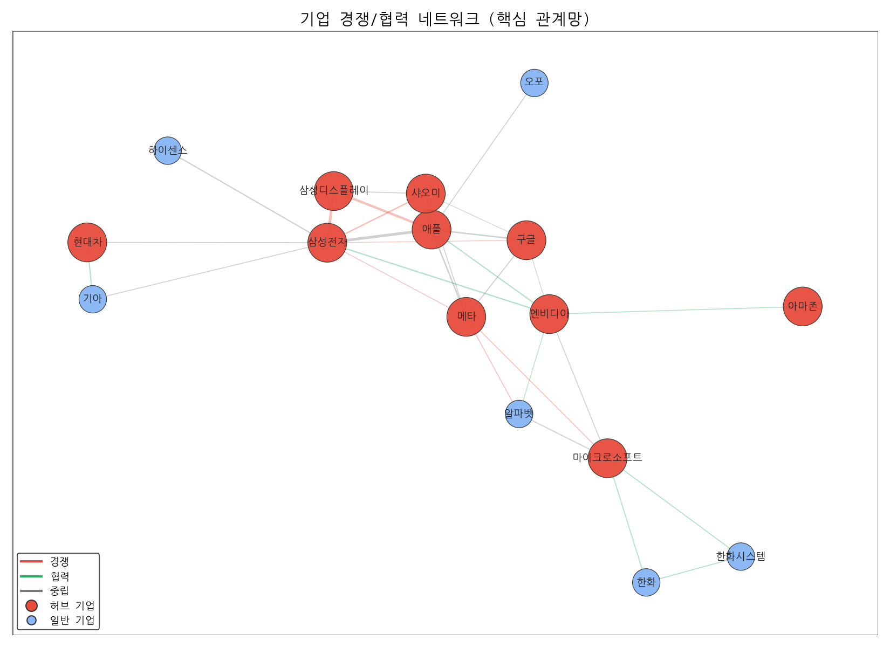

> 해석 가이드: 동시출현이 높은 쌍은 경쟁/협력 가능성을 시사합니다.
> 그래서: 허브/브로커 포지션은 영향력/협상력을 가리킵니다.
> 다음 액션: 커뮤니티별 주요 토픽/키워드와 교차하여 전략 단위를 정의하세요.

## 트렌드 타임라인

**핵심 요약**
- 기간: 2025-09-08 ~ 2025-10-14
- 총 기사 수: 3,323
- 일별 기사 수와 7일 이동평균, 변곡점을 주석으로 표시합니다.

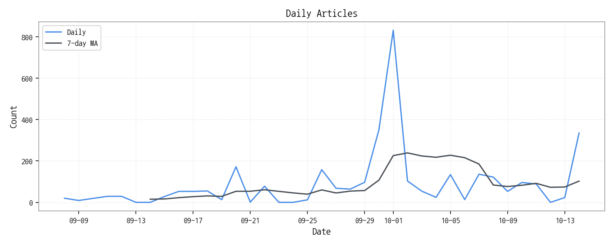

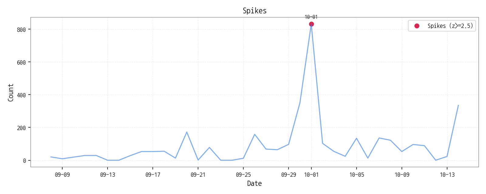

### 스파이크/이벤트 목록
| date       |   count |       z |
|:-----------|--------:|--------:|
| 2025-10-01 |     832 | 4.95922 |

> 해석 가이드: 단기 급등은 이벤트성 가능성이 있으니 2주 추세를 함께 보세요.
> 그래서: 스파이크 이후 토픽/신호 방향을 교차 확인하면 원인 파악이 빨라집니다.
> 다음 액션: 스파이크 날짜의 주요 기사와 키워드 변동을 키워드/토픽 섹션에서 재확인하세요.

## 시그널 보드(강한/약한 신호)

### 강한 신호(Strong Signals)

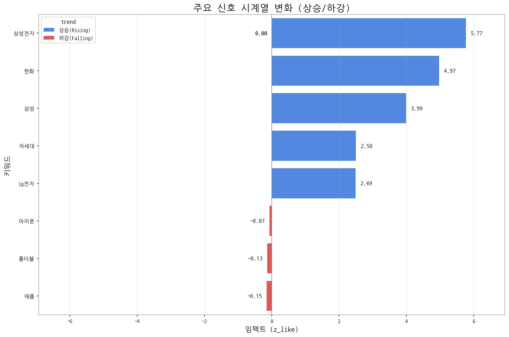

| term    |   cur |   z_like |   prev |   diff |    ma7 |   total |
|:--------|------:|---------:|-------:|-------:|-------:|--------:|
| 삼성전자    |    34 |    5.766 |      1 |     33 | 10     |     125 |
| 한화      |    14 |    4.971 |      0 |     14 |  2     |      43 |
| 삼성      |    28 |    3.991 |      1 |     27 | 10.857 |     368 |
| 차세대     |     6 |    2.5   |      0 |      6 |  1     |      43 |
| lg전자    |    11 |    2.489 |      1 |     10 |  3.714 |      47 |
| 4k      |     4 |    1.953 |      0 |      4 |  0.571 |       4 |
| 비보      |     4 |    1.953 |      0 |      4 |  0.571 |       4 |
| 파나소닉    |     4 |    1.953 |      0 |      4 |  0.571 |       4 |
| lg      |    10 |    1.861 |      2 |      8 |  4.286 |     265 |
| 공급망     |     4 |    1.781 |      0 |      4 |  0.714 |       9 |
| 엔비디아    |     4 |    1.5   |      0 |      4 |  1     |      13 |
| samsung |     2 |    1.117 |      0 |      2 |  0.286 |       3 |
| 고효율     |     2 |    1.117 |      0 |      2 |  0.286 |       2 |
| vr      |     1 |    0.622 |      0 |      1 |  0.143 |      10 |
| 고성능     |     1 |    0.622 |      0 |      1 |  0.143 |      11 |
| 기아      |     1 |    0.622 |      0 |      1 |  0.143 |       4 |
| 갤럭시     |     2 |    0.5   |      0 |      2 |  1     |      26 |
| sk하이닉스  |     2 |    0.414 |      0 |      2 |  1.143 |      25 |
| boe     |     1 |    0.345 |      0 |      1 |  0.429 |      17 |
| 구글      |     1 |    0.244 |      0 |      1 |  0.571 |      13 |

### 약한 신호(Weak/Emerging Signals)
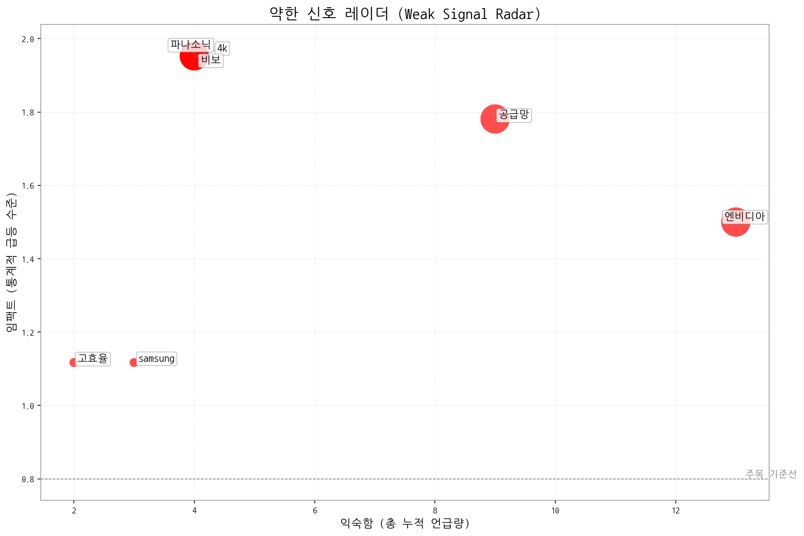

| 약한 신호   | 지표(cur / z_like)   | 해석(1줄)                                                                                                                                                                                  |
|:--------|:-------------------|:----------------------------------------------------------------------------------------------------------------------------------------------------------------------------------------|
| 4k      | 4 / 1.953          | 4k는 높은 해상도와 관련된 기술 또는 콘텐츠를 지칭하며, 시각적 경험의 질을 향상시키고 다양한 산업 분야에서 몰입감과 현실감을 높이는 데 기여할 잠재력을 가진다.                                                                                             |
| 비보      | 4 / 1.953          | Error: 429 You exceeded your current quota, please check your plan and billing details. For more information on this error, head to: https://ai.google.dev/gemini-api/docs/rate-limits. |
|         |                    | * Quota exceeded for metric: generativelanguage.googleapis.com/generate_content_free_tier_requests, limit: 15                                                                           |
|         |                    | Please retry in 45.145206516s. [violations {                                                                                                                                            |
|         |                    |   quota_metric: "generativelanguage.googleapis.com/generate_content_free_tier_requests"                                                                                                 |
|         |                    |   quota_id: "GenerateRequestsPerMinutePerProjectPerModel-FreeTier"                                                                                                                      |
|         |                    |   quota_dimensions {                                                                                                                                                                    |
|         |                    |     key: "model"                                                                                                                                                                        |
|         |                    |     value: "gemini-2.0-flash"                                                                                                                                                           |
|         |                    |   }                                                                                                                                                                                     |
|         |                    |   quota_dimensions {                                                                                                                                                                    |
|         |                    |     key: "location"                                                                                                                                                                     |
|         |                    |     value: "global"                                                                                                                                                                     |
|         |                    |   }                                                                                                                                                                                     |
|         |                    |   quota_value: 15                                                                                                                                                                       |
|         |                    | }                                                                                                                                                                                       |
|         |                    | , links {                                                                                                                                                                               |
|         |                    |   description: "Learn more about Gemini API quotas"                                                                                                                                     |
|         |                    |   url: "https://ai.google.dev/gemini-api/docs/rate-limits"                                                                                                                              |
|         |                    | }                                                                                                                                                                                       |
|         |                    | , retry_delay {                                                                                                                                                                         |
|         |                    |   seconds: 45                                                                                                                                                                           |
|         |                    | }                                                                                                                                                                                       |
|         |                    | ]                                                                                                                                                                                       |
| 파나소닉    | 4 / 1.953          | Error: 429 You exceeded your current quota, please check your plan and billing details. For more information on this error, head to: https://ai.google.dev/gemini-api/docs/rate-limits. |
|         |                    | * Quota exceeded for metric: generativelanguage.googleapis.com/generate_content_free_tier_requests, limit: 15                                                                           |
|         |                    | Please retry in 44.981387622s. [violations {                                                                                                                                            |
|         |                    |   quota_metric: "generativelanguage.googleapis.com/generate_content_free_tier_requests"                                                                                                 |
|         |                    |   quota_id: "GenerateRequestsPerMinutePerProjectPerModel-FreeTier"                                                                                                                      |
|         |                    |   quota_dimensions {                                                                                                                                                                    |
|         |                    |     key: "model"                                                                                                                                                                        |
|         |                    |     value: "gemini-2.0-flash"                                                                                                                                                           |
|         |                    |   }                                                                                                                                                                                     |
|         |                    |   quota_dimensions {                                                                                                                                                                    |
|         |                    |     key: "location"                                                                                                                                                                     |
|         |                    |     value: "global"                                                                                                                                                                     |
|         |                    |   }                                                                                                                                                                                     |
|         |                    |   quota_value: 15                                                                                                                                                                       |
|         |                    | }                                                                                                                                                                                       |
|         |                    | , links {                                                                                                                                                                               |
|         |                    |   description: "Learn more about Gemini API quotas"                                                                                                                                     |
|         |                    |   url: "https://ai.google.dev/gemini-api/docs/rate-limits"                                                                                                                              |
|         |                    | }                                                                                                                                                                                       |
|         |                    | , retry_delay {                                                                                                                                                                         |
|         |                    |   seconds: 44                                                                                                                                                                           |
|         |                    | }                                                                                                                                                                                       |
|         |                    | ]                                                                                                                                                                                       |
| 공급망     | 4 / 1.781          | -                                                                                                                                                                                       |
| 엔비디아    | 4 / 1.5            | -                                                                                                                                                                                       |
| 고효율     | 2 / 1.117          | -                                                                                                                                                                                       |
| samsung | 2 / 1.117          | -                                                                                                                                                                                       |

> 해석 가이드: 약한 신호는 가속도·이례성이 핵심이고, 강한 신호는 현재 주목도의 절대값입니다.
> 그래서: 약한→강한 신호로 전환하는 구간이 가장 좋은 기회가 됩니다.
> 다음 액션: 상위 신호 5개를 2주간 추적하고, 토픽/기업 매트릭스와 교차 검증하세요.

## 기술 성숙도 맵

**핵심 요약**
- 관심도(X), 긍정성(Y), 버블(사업 활발도)로 기술의 위치를 표현합니다.
- 단계: Seed/Early/Growth/Mature/Legacy

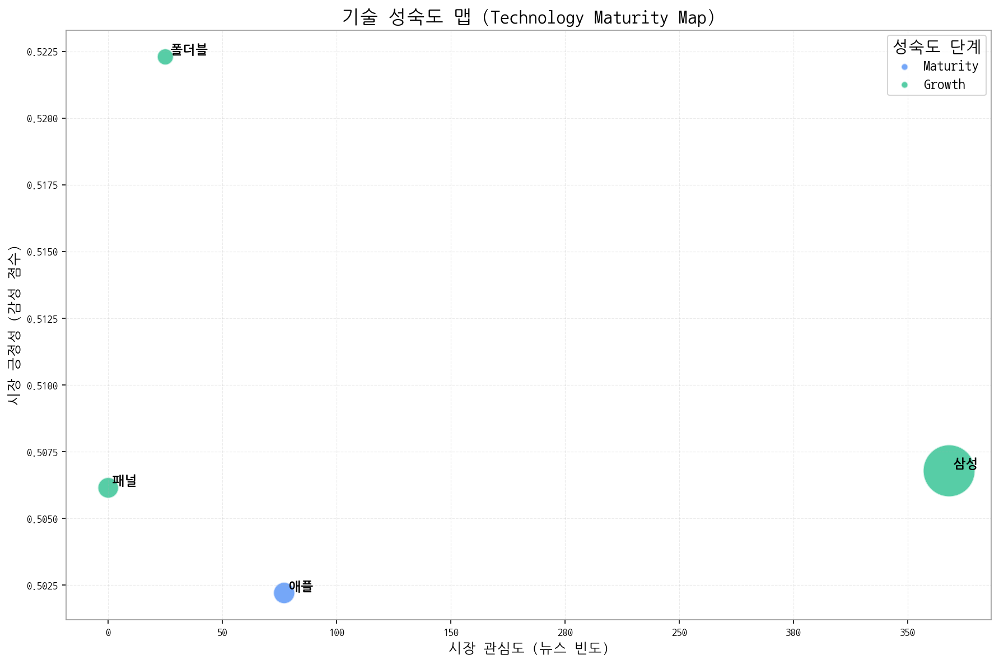

| 기술   | 단계       | 판단 근거                                                                               |
|:-----|:---------|:------------------------------------------------------------------------------------|
| 애플   | Maturity | 애플은 뉴스 언급 빈도와 시장 감성 점수가 중간 수준이고, 투자보다는 출시 및 수주 이벤트가 많은 점을 고려할 때 성숙기에 접어든 기술로 판단됩니다. |
| 패널   | Growth   | 뉴스 언급은 적지만, 투자 및 출시 이벤트가 꾸준히 발생하고 있어 성장기에 진입한 것으로 판단됩니다.                            |
| 삼성   | Growth   | 뉴스 언급 빈도가 높고, 투자 및 출시 이벤트가 활발히 발생하는 것으로 보아 성장기에 있다고 판단됩니다.                          |
| 폴더블  | Growth   | 뉴스 언급 빈도와 시장 감성 점수가 중간 정도이고, 투자, 출시, 수주 이벤트가 꾸준히 발생하고 있어 성장 단계로 판단됩니다.              |

> 해석 가이드: Growth 구간이면서 강한 신호 결합 시 유망합니다.
> 그래서: Early라도 약한 신호가 누적되면 전환 후보입니다.
> 다음 액션: 상위 기술 3개를 기회 섹션과 연결하고 파일럿 과제를 정의하세요.

## 비즈니스 기회(Top 5)

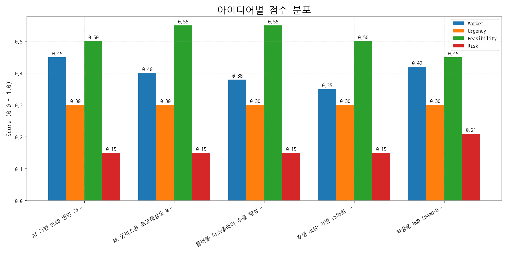

| 아이디어                                     | 타깃                            | 가치제안                                                                                                                        | 점수(시장/긴급/실행/리스크)         |
|:-----------------------------------------|:------------------------------|:----------------------------------------------------------------------------------------------------------------------------|:-------------------------|
| AI 기반 OLED 번인 자동 보정 알고리즘                 | 글로벌 스마트폰 제조사, OLED TV 제조사     | AI 기반의 실시간 번인 예측 및 보정 알고리즘을 통해 OLED 패널의 수명을 최대 50% 연장하고, 사용자 불편을 최소화합니다. 경쟁사 대비 뛰어난 번인 보정 성능과 낮은 전력 소모를 제공합니다.              | 3.5 (0.45/0.3/0.5/0.15)  |
| AR 글라스용 초고해상도 Micro-OLED 패널              | 북미 빅테크 기업 (AR 글라스 개발 부서)      | 기존 디스플레이 대비 압도적인 해상도, 명암비, 저전력 특성을 제공하여 몰입감 있는 AR 경험을 제공하고, AR 글라스의 배터리 사용 시간을 늘립니다. 경쟁사 대비 뛰어난 화질과 소형화 기술로 차별화된 가치를 제공합니다. | 3.4 (0.4/0.3/0.55/0.15)  |
| 롤러블 디스플레이 수율 향상을 위한 AI 공정 모니터링 서비스       | 롤러블 디스플레이 제조사                 | AI 기반의 실시간 공정 모니터링 및 분석을 통해 롤러블 디스플레이 수율을 20% 이상 향상시키고, 생산 비용을 절감합니다. 경쟁사 대비 뛰어난 예측 정확도와 빠른 분석 속도를 제공합니다.                   | 3.4 (0.38/0.3/0.55/0.15) |
| 투명 OLED 기반 스마트 윈도우                       | 글로벌 건설사, 상업용 건물 관리 회사         | 기존 스마트 윈도우 대비 뛰어난 투명도, 화질, 디자인을 제공하고, 정보 제공, 광고, 엔터테인먼트 등 다양한 기능을 제공하여 건물 가치를 향상시킵니다. 경쟁사 대비 뛰어난 에너지 효율과 사용자 편의성을 제공합니다.    | 3.2 (0.35/0.3/0.5/0.15)  |
| 차량용 HUD (Head-Up Display) 투명 MicroLED 패널 | 글로벌 완성차 OEM (특히 프리미엄 전기차 브랜드) | 기존 HUD 대비 압도적인 밝기, 명암비, 투명도를 제공하여 AR 기반의 몰입감 있는 운전 경험을 제공하고, 안전성을 향상시킵니다. 경쟁사 대비 뛰어난 화질과 내구성으로 차별화된 가치를 제공합니다.              | 3.1 (0.42/0.3/0.45/0.21) |

> 해석 가이드: 점수는 내부 가중치 기반(예: Market 0.35, Urgency 0.25, Feasibility 0.25, Risk -0.15).
> 그래서: 상위안은 단기 임팩트/실행 가능성이 높은 편입니다.
> 다음 액션: 각 아이디어에 대해 2주 파일럿(가설·대상·KPI)을 정의하고 담당 오너를 배정하세요.

## 리스크/이슈 관측소

- (리스크/이슈 데이터 없음)

> 해석 가이드: 부정 감성 급등은 PR·컴플라이언스·조달과 연계가 필요합니다.
> 그래서: 공급망 키워드와 동반 급등 시 실제 운영 리스크로 이어질 수 있습니다.
> 다음 액션: 영향범위가 큰 이슈는 즉시 리스크 레지스터에 등록하고 완화 액션을 실행하세요.

## 결론: So What & Next Steps

### 다음 2주 실행안(템플릿)
| hypothesis          | target         | kpi               | owner   | due        |
|:--------------------|:---------------|:------------------|:--------|:-----------|
| 토픽 A 관심도↑는 고객 니즈 증가 | SMB 고객 20명 인터뷰 | 응답률 30%/신규 리드 10건 | 사업개발팀   | 2025-10-28 |

> 해석 가이드: 데이터-인사이트-액션의 연결을 표준 템플릿으로 기록하세요.
> 그래서: 우선순위 상위 안건부터 빠르게 실험해야 기회를 놓치지 않습니다.
> 다음 액션: 오너/기한/KPI가 명확한 항목부터 킥오프하세요.

## 부록(Appendix)

분석의 투명성을 확보하고, 다음 단계 분석을 위한 원천 자료를 제공합니다.

### 데이터 메타
| 파일                             | 수정시각                |   크기(bytes) |
|:-------------------------------|:--------------------|------------:|
| outputs/keywords.json          | 2025-10-14 21:42:07 |        1532 |
| outputs/topics.json            | 2025-10-14 21:42:27 |       11620 |
| outputs/trend_timeseries.json  | 2025-10-14 21:42:10 |        2204 |
| outputs/trend_insights.json    | 2025-10-14 21:42:34 |        8027 |
| outputs/biz_opportunities.json | 2025-10-14 21:43:34 |       27767 |
| outputs/tech_maturity.json     | 2025-10-14 21:43:13 |        2110 |
| outputs/company_network.json   | 2025-10-14 21:43:20 |       18135 |

> 해석 가이드: 재현성과 감사추적을 위해 생성일, 버전, 파라미터를 함께 보관하세요.
> 그래서: 데이터 출처와 가공 과정을 명확히 남기면 신뢰성이 높아집니다.
> 다음 액션: 주요 이미지/표 생성 실패 로그도 추적 테이블로 남겨두세요.
