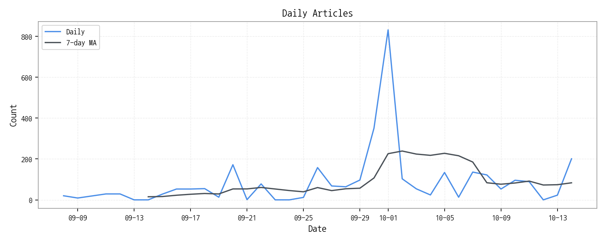
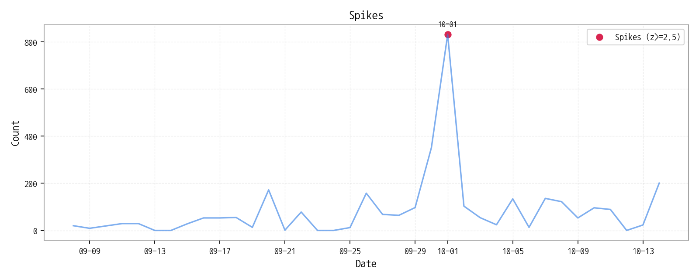

# Daily Briefing (2025-10-15)

## 1. 시장 활동량 및 이상 징후

- **기간:** 2025-09-08 ~ 2025-10-14
- **총 기사 수:** 3,189
> 일별 기사 수와 7일 이동평균, 통계적 이상치(Spike)를 통해 시장의 양적 변화를 확인합니다.

### 스파이크 상세
| date       |   count |       z |
|:-----------|--------:|--------:|
| 2025-10-01 |     832 | 5.13953 |

## 2. 핵심 모멘텀 토픽 Top 3

| 모멘텀 토픽   |   z_like 점수 |   금일 언급량 |
|:---------|------------:|---------:|
| 삼성전자     |        3.54 |       22 |
| 한화       |        3.31 |        8 |
| 차세대      |        2.15 |        5 |

## 3. 경쟁사 주요 활동

| 날짜         | 유형                | 제목                                          |
|:-----------|:------------------|:--------------------------------------------|
| 2025-10-15 | LAUNCH            | "슬림폰 경쟁 뜨겁다"…모토로라, 모토 X70 에어 공개             |
| 2025-10-15 | LAUNCH            | 원플러스, 100W 충전 지원 7800mAh 배터리폰 출시하나          |
| 2025-10-15 | INVEST            | 승부처는 ‘8.6세대 수율’… 韓中  OLED , 2026년 전환 경쟁 본격화 |
| 2025-10-15 | INVEST            | "애플 역대 최고 3분기"…韓 부품업계 깜짝 실적 기대감 증폭          |
| 2025-10-15 | CERT,INVEST,ORDER | LG디스플레이, 차세대  OLED 용 전환투자 본격화               |

## 4. 주요 기사

| 제목                                                                                                      |
|:--------------------------------------------------------------------------------------------------------|
| [삼성전자, ‘프로젝트 무한’ 22일 공개…AI 결합한 차세대 XR 헤드셋 출...](https://www.kukinews.com/article/view/kuk202510150087)  |
| [작지만 강한 칩…사피엔반도체, 차세대 디스플레이 숨은 주역](https://www.pinpointnews.co.kr/news/articleView.html?idxno=381606)   |
| ["애플 비전 프로 비켜"…카운트다운 '삼성 XR 무한' 괴물스펙 '역습' 통...](https://www.ddaily.co.kr/page/view/2025101510213606512) |
