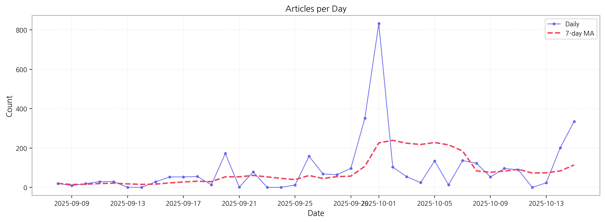

# Daily Briefing (2025-10-15)

## 1. 시장 활동량 및 이상 징후

- **기간:** 2025-09-08 ~ 2025-10-15
- **총 기사 수:** 3,524

## 2. 핵심 모멘텀 토픽 Top 3

| 모멘텀 토픽   |   z_like 점수 |   금일 언급량 |
|:---------|------------:|---------:|
| lg       |        3.48 |       17 |
| 애플       |        3.08 |       13 |
| 삼성전자     |        3.06 |       24 |

## 3. 경쟁사 주요 활동

| 날짜         | 유형                | 제목                                          |
|:-----------|:------------------|:--------------------------------------------|
| 2025-10-15 | LAUNCH            | "슬림폰 경쟁 뜨겁다"…모토로라, 모토 X70 에어 공개             |
| 2025-10-15 | LAUNCH            | 원플러스, 100W 충전 지원 7800mAh 배터리폰 출시하나          |
| 2025-10-15 | INVEST            | 승부처는 ‘8.6세대 수율’… 韓中  OLED , 2026년 전환 경쟁 본격화 |
| 2025-10-15 | INVEST            | "애플 역대 최고 3분기"…韓 부품업계 깜짝 실적 기대감 증폭          |
| 2025-10-15 | CERT,INVEST,ORDER | LG디스플레이, 차세대  OLED 용 전환투자 본격화               |

## 4. 주요 기사

| 제목                                                                                                               |
|:-----------------------------------------------------------------------------------------------------------------|
| [정철동 LG디스플레이 사장이 말하는 '기술리더십', 투자는 무슨 돈으로...](http://www.financialreview.co.kr/news/articleView.html?idxno=37455) |
| [삼성 XR 기기 '무한' 내달 공개…업계 "AR이 진짜 승부처"](https://www.greened.kr/news/articleView.html?idxno=331559)                 |
| [반도체·디스플레이 업계, 3분기 ‘실적 훈풍’ 기대](https://www.etoday.co.kr/news/view/2512118)                                       |
