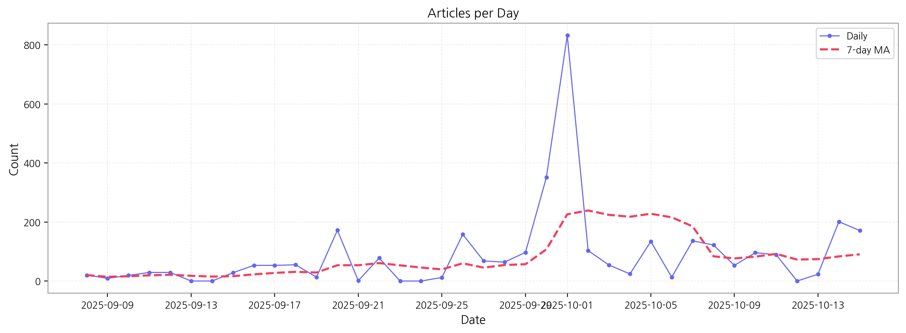

# Daily Briefing (2025-10-16)

## 1. 시장 활동량 및 이상 징후

- **기간:** 2025-09-08 ~ 2025-10-15
- **총 기사 수:** 3,360

## 2. 핵심 모멘텀 토픽 Top 3

| 모멘텀 토픽   |   z_like 점수 |   금일 언급량 |
|:---------|------------:|---------:|
| 구글       |        2.35 |        6 |
| oled     |        1.6  |        8 |
| lg       |        1.53 |        9 |

## 3. 경쟁사 주요 활동

| 날짜         | 유형                             | 제목                                                |
|:-----------|:-------------------------------|:--------------------------------------------------|
| 2025-10-16 | CERT,LAUNCH                    | LG전자, 올레드 게이밍 모니터 신제품 ‘울트라기어 32GX870A’ 선보여        |
| 2025-10-16 | LAUNCH                         | 인하대, 이정환 교수 연구실 소속 학생들 국제학술대회서 성과 인정              |
| 2025-10-16 | INVEST,LAUNCH                  | 올 3분기 글로벌 스마트폰 시장 3%↑…애플, 역대 최고 3분기 실적 기록         |
| 2025-10-16 | CERT,INVEST,LAUNCH,PARTNERSHIP | 케이시스, 부산시와 MOU 맺어…총 350억 투자로 ‘스마트  LED  제조 클러스... |
| 2025-10-16 | CERT,REGUL                     | 삼성전자 마이크로 RGB TV 등 3종, 美 타임지 선정 ‘2025 최고의 발명품...  |

## 4. 주요 기사

| 제목                                                                                                 |
|:---------------------------------------------------------------------------------------------------|
| [[영상] 현대차의 한 수…제네시스 GV90에 ' 롤러블  OLED' 탑재된다](https://www.theguru.co.kr/news/article.html?no=92847) |
| [LG전자, 올레드 게이밍 모니터 신제품 ‘울트라기어 32GX870A’ 선보여](https://www.cnet.co.kr/view/?no=20251016093130)       |
| [사피엔반도체 "AR 글래스 시장, 2027년 이후 레도스가 주류될 것"](http://www.thelec.kr/news/articleView.html?idxno=42054)  |
