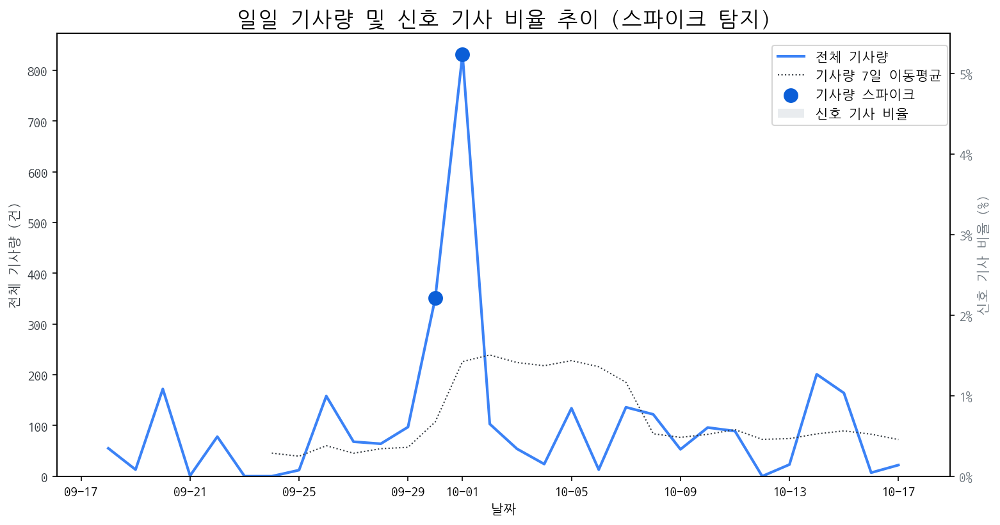

# Daily Briefing (2025-10-18)

## 1. 시장 활동량 및 이상 징후

- **분석 기간:** 2025-09-18 ~ 2025-10-17 (최근 30일)
- **최근 30일 평균 신호 기사 비율:** 0.00%

### 📈 전체 기사량 스파이크
| 날짜         | 기사량   |   Z-Score |
|:-----------|:------|----------:|
| 2025-09-30 | 351건  |      2.04 |
| 2025-10-01 | 832건  |      2.1  |

## 2. 핵심 모멘텀 토픽 Top 3

| 모멘텀 토픽   |   z_like 점수 |   금일 언급량 |
|:---------|------------:|---------:|
| 맥북       |        0.47 |        1 |
| 아이패드     |        0.47 |        1 |
| 차세대      |        0.34 |        2 |

## 3. 경쟁사 주요 활동

| 날짜         | 유형                | 제목                                          |
|:-----------|:------------------|:--------------------------------------------|
| 2025-10-18 | LAUNCH            | 엔비디아 슈퍼칩 품은 '델 프로 맥스', 로컬 LLM 시대 본격화 [PC마켓] |
| 2025-10-16 | LAUNCH            | 인하대, 이정환 교수 연구실 소속 학생들 국제학술대회서 성과 인정        |
| 2025-10-18 | INVEST,LAUNCH     | '캐시카우' 마크곤잘레스·브롬톤 런던···더네이쳐 홀딩스 전년比 실...    |
| 2025-10-18 | PARTNERSHIP,REGUL | ‘2025 코스메틱 360’이 보여준 뷰티의 미래                 |
| 2025-10-16 | CERT,LAUNCH       | 삼성전자, 타임 '2025 최고의 발명품' 3관왕                 |

## 4. 주요 기사

| 제목                                                                                              |
|:------------------------------------------------------------------------------------------------|
| [뉴욕증시, 그래도 기댈 곳은 트럼프의 입 '강세'...WTI 강보합](https://www.asiatime.co.kr/article/20251018500003)      |
| [위기에서 빛난 구광모...유연하고 과감한 리더십 주목](https://www.asiatime.co.kr/article/20251017500155)              |
| [中 추격 거세지는데…삼성·LG, 디스플레이 기술 유출에 '몸살'](http://www.srtimes.kr/news/articleView.html?idxno=187653) |
