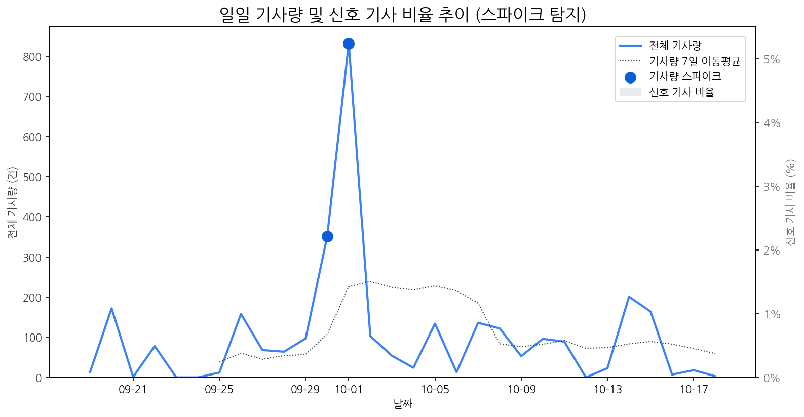

# Daily Briefing (2025-10-19)

## 1. 시장 활동량 및 이상 징후

- **분석 기간:** 2025-09-19 ~ 2025-10-18 (최근 30일)
- **최근 30일 평균 신호 기사 비율:** 0.00%

### 📈 전체 기사량 스파이크
| 날짜         | 기사량   |   Z-Score |
|:-----------|:------|----------:|
| 2025-09-30 | 351건  |      2.04 |
| 2025-10-01 | 832건  |      2.1  |

## 2. 핵심 모멘텀 토픽 Top 3

| 모멘텀 토픽   |   z_like 점수 |   금일 언급량 |
|:---------|------------:|---------:|
| 삼성       |       -1.27 |        1 |

## 3. 경쟁사 주요 활동

| 날짜         | 유형                 | 제목                                           |
|:-----------|:-------------------|:---------------------------------------------|
| 2025-10-16 | LAUNCH             | 인하대, 이정환 교수 연구실 소속 학생들 국제학술대회서 성과 인정         |
| 2025-10-19 | LAUNCH             | "신제품 출시 효과"  폴더블  장악하는 中 기업… 삼성전자 위협하나       |
| 2025-10-18 | LAUNCH             | 5천 달러 저렴한 테슬라 모델 Y 스탠다드, 디자인·옵션 구성 이렇게 달...  |
| 2025-10-19 | LAUNCH             | [주간 대형마트 할인템] "가을은 소풍의 계절"…대형마트 3社, 3色 할인... |
| 2025-10-19 | LAUNCH,PARTNERSHIP | e커머스, '풍성한 가을세일' 경쟁 점화…쿠팡·SSG닷컴·G마켓·옥션 대...  |

## 4. 주요 기사

| 제목                                                                                                |
|:--------------------------------------------------------------------------------------------------|
| [젊은 총수가 재계 핵심으로…진화하는 구광모 리더십](https://www.asiatime.co.kr/article/20251017500212)                  |
| [사피엔반도체 "AR 글래스 시장, 2027년 이후 레도스가 주류될 것"](http://www.thelec.kr/news/articleView.html?idxno=42054) |
| ["1억으로 한 달 만에 3000만원 벌었다"…주가 불붙은 회사 [종목+]](https://www.hankyung.com/article/2025101012606)        |
