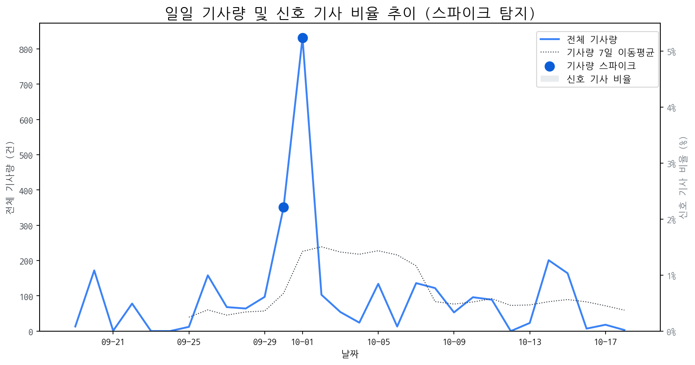

# Daily Briefing (2025-10-19)

## 1. 시장 활동량 및 이상 징후

- **분석 기간:** 2025-09-19 ~ 2025-10-18 (최근 30일)
- **최근 30일 평균 신호 기사 비율:** 0.00%

### 📈 전체 기사량 스파이크
| 날짜         | 기사량   |   Z-Score |
|:-----------|:------|----------:|
| 2025-09-30 | 351건  |      2.04 |
| 2025-10-01 | 832건  |      2.1  |

## 2. 핵심 모멘텀 토픽 Top 3

| 모멘텀 토픽   |   z_like 점수 |   금일 언급량 |
|:---------|------------:|---------:|
| 삼성       |       -1.27 |        1 |

## 3. 경쟁사 주요 활동

| 날짜         | 유형                 | 제목                                          |
|:-----------|:-------------------|:--------------------------------------------|
| 2025-10-16 | LAUNCH             | 인하대, 이정환 교수 연구실 소속 학생들 국제학술대회서 성과 인정        |
| 2025-10-19 | CERT,LAUNCH        | "삼성 밀어냈다?"  폴더블 폰 판도 바꾼 모토로라의 진격 [IT+]      |
| 2025-10-18 | LAUNCH             | 5천 달러 저렴한 테슬라 모델 Y 스탠다드, 디자인·옵션 구성 이렇게 달... |
| 2025-10-19 | CERT,PARTNERSHIP   | [Daily New유통] 쿠팡, 세븐일레븐, 놀유니버스 外            |
| 2025-10-19 | LAUNCH,PARTNERSHIP | e커머스, '풍성한 가을세일' 경쟁 점화…쿠팡·SSG닷컴·G마켓·옥션 대... |

## 4. 주요 기사

| 제목                                                                                                      |
|:--------------------------------------------------------------------------------------------------------|
| [젊은 총수가 재계 핵심으로…진화하는 구광모 리더십](https://www.asiatime.co.kr/article/20251017500212)                        |
| [[기업기상도] 가을걷이 풍성한 기업 vs 가을비에 젖은 기업](http://www.yonhapnewstv.co.kr/MYH20251018154613VwJ)                 |
| ["삼성 밀어냈다?"  폴더블 폰 판도 바꾼 모토로라의 진격 [IT+]](https://www.thescoop.co.kr/news/articleView.html?idxno=307667) |
