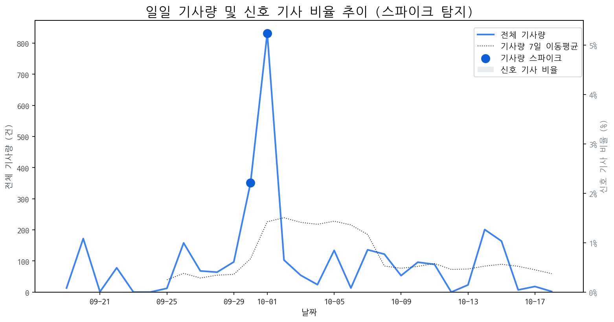

# Daily Briefing (2025-10-19)

## 1. 시장 활동량 및 이상 징후

- **분석 기간:** 2025-09-19 ~ 2025-10-18 (최근 30일)
- **최근 30일 평균 신호 기사 비율:** 0.00%

### 📈 전체 기사량 스파이크
| 날짜         | 기사량   |   Z-Score |
|:-----------|:------|----------:|
| 2025-09-30 | 351건  |      2.04 |
| 2025-10-01 | 832건  |      2.1  |

## 2. 핵심 모멘텀 토픽 Top 3

| 모멘텀 토픽   |   z_like 점수 |   금일 언급량 |
|:---------|------------:|---------:|
| 삼성       |       -1.27 |        1 |

## 3. 경쟁사 주요 활동

| 날짜         | 유형               | 제목                                          |
|:-----------|:-----------------|:--------------------------------------------|
| 2025-10-19 | INVEST,LAUNCH    | OLED  중심 체질 개선 성공한 LGD, 4년 만에 연간 흑자 전망      |
| 2025-10-16 | LAUNCH           | 인하대, 이정환 교수 연구실 소속 학생들 국제학술대회서 성과 인정        |
| 2025-10-19 | CERT,LAUNCH      | "삼성 밀어냈다?"  폴더블 폰 판도 바꾼 모토로라의 진격 [IT+]      |
| 2025-10-18 | LAUNCH           | 5천 달러 저렴한 테슬라 모델 Y 스탠다드, 디자인·옵션 구성 이렇게 달... |
| 2025-10-19 | CERT,PARTNERSHIP | [Daily New유통] 쿠팡, 세븐일레븐, 놀유니버스 外            |

## 4. 주요 기사

| 제목                                                                                                            |
|:--------------------------------------------------------------------------------------------------------------|
| [OLED  중심 체질 개선 성공한 LGD, 4년 만에 연간 흑자 전망](https://www.hellot.net/news/article.html?no=106322)                  |
| [[증시 주간 전망대] 코스피 3800 앞두고 방향성 탐색...미중 마찰 '변수...](http://www.seoulwire.com/news/articleView.html?idxno=675600) |
| [“노트북·모니터 OLED 광풍 분다”…삼성·LGD, OLED 새 활로 찾았다](https://www.ceoscoredaily.com/page/view/2025101716384446299)     |
