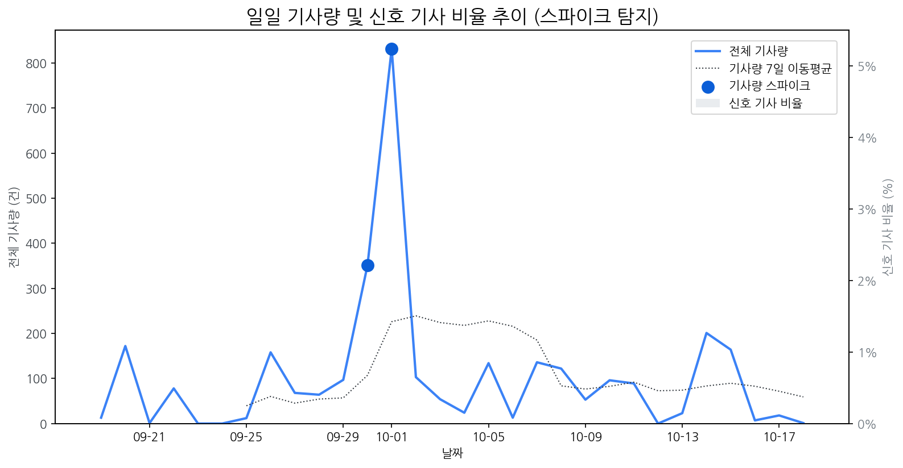

# Daily Briefing (2025-10-19)

## 1. 시장 활동량 및 이상 징후

- **분석 기간:** 2025-09-19 ~ 2025-10-18 (최근 30일)
- **최근 30일 평균 신호 기사 비율:** 0.00%

### 📈 전체 기사량 스파이크
| 날짜         | 기사량   |   Z-Score |
|:-----------|:------|----------:|
| 2025-09-30 | 351건  |      2.04 |
| 2025-10-01 | 832건  |      2.1  |

## 2. 오늘의 급등 신호 (Today's Hot Signals)

- (데이터 없음)

## 참고: 최근 30일 누적 강한 신호 Top 5

| 모멘텀 토픽   |   z_like 점수 |   누적 언급량 |
|:---------|------------:|---------:|
| 삼성       |       -1.27 |      349 |

## 3. 경쟁사 주요 활동

| 날짜         | 유형               | 제목                                     |
|:-----------|:-----------------|:---------------------------------------|
| 2025-10-19 | INVEST,LAUNCH    | OLED  중심 체질 개선 성공한 LGD, 4년 만에 연간 흑자 전망 |
| 2025-10-16 | LAUNCH           | 인하대, 이정환 교수 연구실 소속 학생들 국제학술대회서 성과 인정   |
| 2025-10-19 | LAUNCH           | “기술로 리더십 잡는다”...테크포럼·기술전 여는 삼성         |
| 2025-10-19 | INVEST,LAUNCH    | 中 JBD “1만PPI  마이크로 LED  패널 내년 양산”      |
| 2025-10-19 | CERT,PARTNERSHIP | [Daily New유통] 쿠팡, 세븐일레븐, 놀유니버스 外       |

## 4. 주요 기사

| 제목                                                                                                        |
|:----------------------------------------------------------------------------------------------------------|
| [OLED  중심 체질 개선 성공한 LGD, 4년 만에 연간 흑자 전망](https://www.hellot.net/news/article.html?no=106322)              |
| [‘확장현실 안경’ 피지컬AI 경쟁 뜨겁다…선수 친 메타](https://www.dt.co.kr/article/12023693?ref=naver)                         |
| [“노트북·모니터 OLED 광풍 분다”…삼성·LGD, OLED 새 활로 찾았다](https://www.ceoscoredaily.com/page/view/2025101716384446299) |
