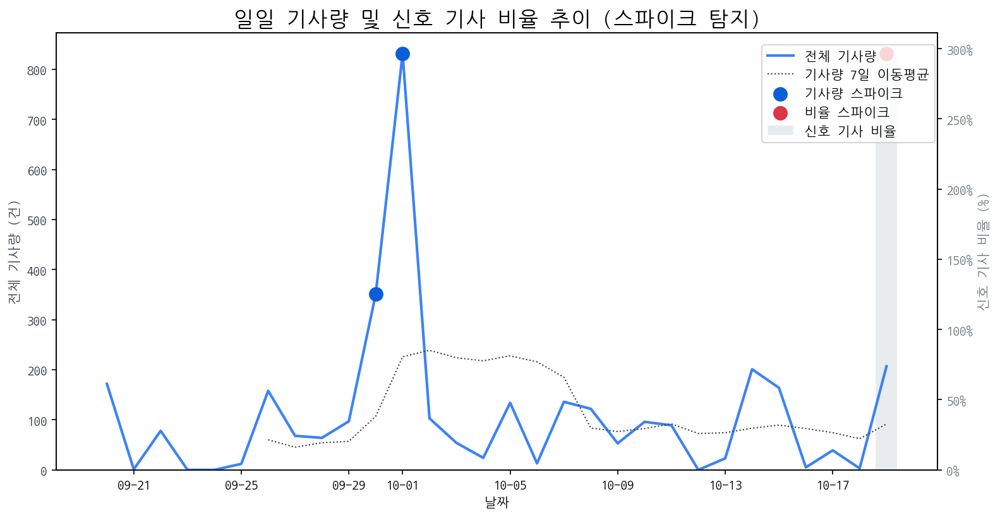

# Daily Briefing (2025-10-19)

## 1. 시장 활동량 및 이상 징후

- **분석 기간:** 2025-09-20 ~ 2025-10-19 (최근 30일)
- **최근 30일 평균 신호 기사 비율:** 9.89%

### 📈 전체 기사량 스파이크
| 날짜         | 기사량   |   Z-Score |
|:-----------|:------|----------:|
| 2025-09-30 | 351건  |      2.04 |
| 2025-10-01 | 832건  |      2.1  |

### 신호 기사 비율 스파이크
| 날짜         | 비율      |   Z-Score |
|:-----------|:--------|----------:|
| 2025-10-19 | 296.62% |      2.27 |

## 2. 오늘의 급등 신호 (Today's Hot Signals)

| 급등 신호   |   오늘 언급량 |   어제 대비 증가 |   모멘텀(z_like) |
|:--------|---------:|-----------:|--------------:|
| qled    |       16 |         16 |          5.46 |
| 삼성전자    |       29 |         29 |          4.68 |
| 삼성      |       17 |         16 |          2.74 |
| 아이폰     |        4 |          4 |          1.95 |
| 기아      |        3 |          3 |          1.55 |

## 참고: 최근 30일 누적 강한 신호 Top 5

| 모멘텀 토픽   |   z_like 점수 |   누적 언급량 |
|:---------|------------:|---------:|
| qled     |        5.46 |       16 |
| 삼성전자     |        4.68 |      154 |
| 삼성       |        2.74 |      367 |
| 아이폰      |        1.95 |       25 |
| 기아       |        1.55 |        5 |

## 3. 경쟁사 주요 활동

| 날짜         | 유형            | 제목                                             |
|:-----------|:--------------|:-----------------------------------------------|
| 2025-10-19 | INVEST,LAUNCH | 中 추월당한 '스마트폰  OLED '⋯ K디스플레이 주도권 위기'           |
| 2025-10-19 | INVEST,LAUNCH | OLED  중심 체질 개선 성공한 LGD, 4년 만에 연간 흑자 전망         |
| 2025-10-19 | INVEST        | “노트북·모니터  OLED  광풍 분다”…삼성·LGD,  OLED  새 활로 찾았다 |
| 2025-10-19 | LAUNCH        | 캐논코리아, 고속∙고품질 잉크젯 복합기 'PIXMA TS' 시리즈 출시        |
| 2025-10-19 | LAUNCH,REGUL  | LGD, 체질 개선·조직 효율화에 4년만 연간 흑자 전환 눈앞             |

## 4. 주요 기사

| 제목                                                                                                                        |
|:--------------------------------------------------------------------------------------------------------------------------|
| [10월 3주 주요 제조업 전망](https://www.laborplus.co.kr/news/articleView.html?idxno=36385)                                         |
| [미쓰비시 전기차 수탁 생산하는 애플 파트너 홍하이 | 설계-제조 분리,...](http://monthly.chosun.com/client/news/viw.asp?ctcd=B&nNewsNumb=202505100043) |
| [삼성, 中 TV업체 ‘가짜  QLED ’ 저격…직접 만든 풍자 영상 화제](https://www.sedaily.com/NewsView/2GZ8OC2CRA)                                   |
