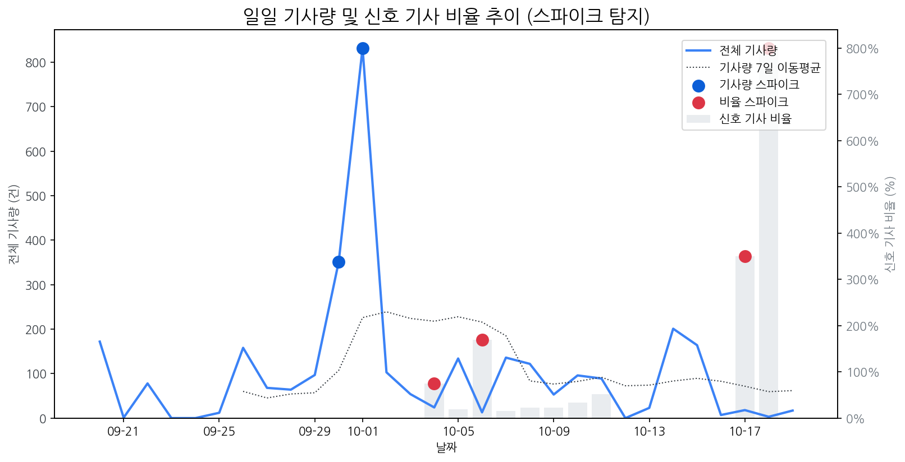

# Daily Briefing (2025-10-20)

## 1. 시장 활동량 및 이상 징후

- **분석 기간:** 2025-09-20 ~ 2025-10-19 (최근 30일)
- **최근 30일 평균 신호 기사 비율:** 51.96%

### 📈 전체 기사량 스파이크
| 날짜         | 기사량   |   Z-Score |
|:-----------|:------|----------:|
| 2025-09-30 | 351건  |      2.04 |
| 2025-10-01 | 832건  |      2.1  |

### 신호 기사 비율 스파이크
| 날짜         | 비율      |   Z-Score |
|:-----------|:--------|----------:|
| 2025-10-04 | 75.00%  |      2.27 |
| 2025-10-06 | 169.23% |      2.05 |
| 2025-10-17 | 350.00% |      2.24 |
| 2025-10-18 | 800.00% |      2.06 |

## 2. 오늘의 급등 신호 (Today's Hot Signals)

- (데이터 없음)

## 참고: 최근 30일 누적 강한 신호 Top 5

| 모멘텀 토픽   |   z_like 점수 |   누적 언급량 |
|:---------|------------:|---------:|
| qled     |        0.62 |        1 |
| 기아       |        0.62 |        3 |
| 아이폰      |        0.62 |       22 |
| 양산       |        0.62 |       21 |
| 패널       |        0.62 |        9 |

## 3. 경쟁사 주요 활동

| 날짜         | 유형                | 제목                                           |
|:-----------|:------------------|:---------------------------------------------|
| 2025-10-20 | LAUNCH            | 갤럭시 S26 울트라, 역대급 디스플레이 탑재 예고                 |
| 2025-10-20 | LAUNCH            | 인하대학교 이정환 교수 연구실 소속 학생들, 국제학술대회서 성과 인정       |
| 2025-10-20 | CERT,LAUNCH,REGUL | “거실이 영화관으로” LG, 136인치 ‘능동형  마이크로 LED ’ TV 출시 |
| 2025-10-20 | INVEST            | 中 모니터 시장도 '양보다 질'…SDC·LGD 수혜 기대              |
| 2025-10-20 | LAUNCH            | 11번가, '그랜드십일절' 앞두고 사전 프로모션 진행…할인쿠폰 발급        |

## 4. 주요 기사

| 제목                                                                                          |
|:--------------------------------------------------------------------------------------------|
| [OLED 중심 체질 개선 성공한 LGD, 4년 만에 연간 흑자 전망](https://www.hellot.net/news/article.html?no=106322) |
| [갤럭시 S26 울트라, 역대급 디스플레이 탑재 예고](https://www.etoday.co.kr/news/view/2516196)                  |
| [中 JBD “1만PPI 마이크로 LED 패널 내년 양산”](https://www.etnews.com/20251017000196)                    |
