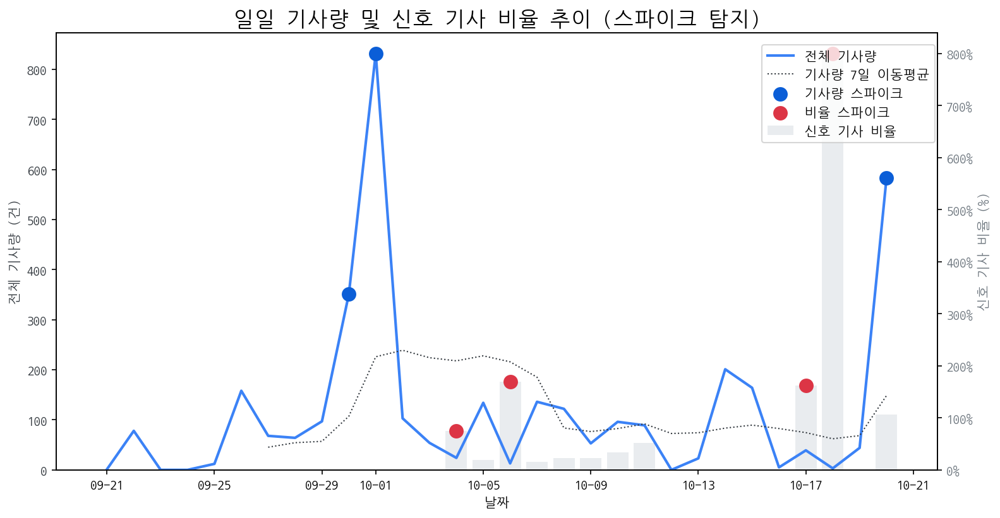

# Daily Briefing (2025-10-20)

## 1. 시장 활동량 및 이상 징후

- **분석 기간:** 2025-09-21 ~ 2025-10-20 (최근 30일)
- **최근 30일 평균 신호 기사 비율:** 49.21%

### 📈 전체 기사량 스파이크
| 날짜         | 기사량   |   Z-Score |
|:-----------|:------|----------:|
| 2025-09-30 | 351건  |      2.04 |
| 2025-10-01 | 832건  |      2.1  |
| 2025-10-20 | 583건  |      2.1  |

### 신호 기사 비율 스파이크
| 날짜         | 비율      |   Z-Score |
|:-----------|:--------|----------:|
| 2025-10-04 | 75.00%  |      2.27 |
| 2025-10-06 | 169.23% |      2.05 |
| 2025-10-17 | 161.54% |      2.15 |
| 2025-10-18 | 800.00% |      2.22 |

## 2. 오늘의 급등 신호 (Today's Hot Signals)

| 급등 신호   |   오늘 언급량 |   어제 대비 증가 |   모멘텀(z_like) |
|:--------|---------:|-----------:|--------------:|
| 삼성      |       64 |         58 |         10.33 |
| lg      |       41 |         41 |          8.43 |
| lg전자    |       42 |         41 |          8.42 |
| 애플      |       35 |         34 |          7.98 |
| 삼성전자    |       36 |         25 |          5.32 |
| oled    |       17 |         12 |          3.96 |
| 현대차     |        7 |          7 |          2.83 |
| 맥북      |        6 |          6 |          2.5  |
| 갤럭시     |        6 |          6 |          2.35 |
| 아이폰     |        5 |          3 |          2    |

## 참고: 최근 30일 누적 강한 신호 Top 5

| 모멘텀 토픽   |   z_like 점수 |   누적 언급량 |
|:---------|------------:|---------:|
| 삼성       |       10.33 |      413 |
| lg       |        8.44 |      297 |
| lg전자     |        8.42 |       88 |
| 애플       |        7.98 |      118 |
| 삼성전자     |        5.32 |      168 |

## 3. 경쟁사 주요 활동

| 날짜         | 유형     | 제목                                       |
|:-----------|:-------|:-----------------------------------------|
| 2025-10-15 | LAUNCH | 인하대, 이정환 교수 연구실 학생들 'iMiD 국제학술대회'서 성과 인정 |
| 2025-10-20 | INVEST | 아이폰17 판매 호조에 3.9%↑…애플, 올해 첫 최고가 경신(종합)   |
| 2025-10-15 | LAUNCH | 인하대, 이정환 교수 연구실 소속 학생들 국제학술대회서 성과 인정받아   |
| 2025-10-20 | LAUNCH | 삼성 '듀얼 인폴딩' 中아너 '로봇폰'… 스마트폰 변해야 산다       |
| 2025-10-15 | LAUNCH | 인하대, 국제학술대회서 학생 연구 성과 인정                 |

## 4. 주요 기사

| 제목                                                                                                             |
|:---------------------------------------------------------------------------------------------------------------|
| [[브리프] 삼성전자 현대차 LG전자 SKT LG에너지솔루션 한컴라이프케어 ...](http://www.biztribune.co.kr/news/articleView.html?idxno=341879) |
| [삼성전자·LG전자, 中 TV '가격' 공세 돌파 카드는?](https://www.techm.kr/news/articleView.html?idxno=145495)                     |
| [OLED 출하량 껑충…삼성D·LGD 3분기 실적 훈풍 기대](http://www.newstomato.com/ReadNews.aspx?no=1277288&inflow=N)                |
