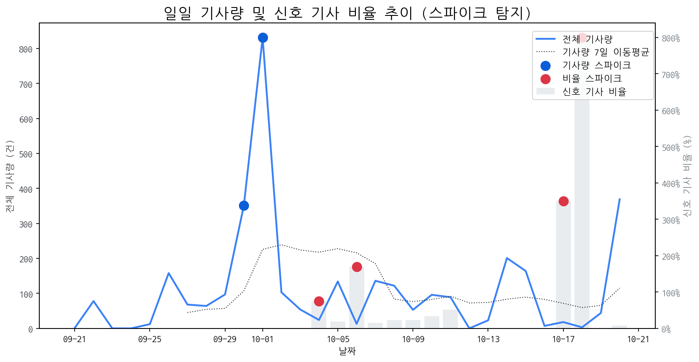

# Daily Briefing (2025-10-21)

## 1. 시장 활동량 및 이상 징후

- **분석 기간:** 2025-09-21 ~ 2025-10-20 (최근 30일)
- **최근 30일 평균 신호 기사 비율:** 52.24%

### 📈 전체 기사량 스파이크
| 날짜         | 기사량   |   Z-Score |
|:-----------|:------|----------:|
| 2025-09-30 | 351건  |      2.04 |
| 2025-10-01 | 832건  |      2.1  |

### 신호 기사 비율 스파이크
| 날짜         | 비율      |   Z-Score |
|:-----------|:--------|----------:|
| 2025-10-04 | 75.00%  |      2.27 |
| 2025-10-06 | 169.23% |      2.05 |
| 2025-10-17 | 350.00% |      2.24 |
| 2025-10-18 | 800.00% |      2.06 |

## 2. 오늘의 급등 신호 (Today's Hot Signals)

| 급등 신호   |   오늘 언급량 |   어제 대비 증가 |   모멘텀(z_like) |
|:--------|---------:|-----------:|--------------:|
| 삼성      |       45 |         39 |          7.66 |
| lg      |       25 |         25 |          5.78 |
| lg전자    |       25 |         24 |          5.6  |
| 삼성전자    |       34 |         23 |          4.87 |
| 애플      |       14 |         13 |          3.81 |
| oled    |       15 |         10 |          3.49 |
| 맥북      |        6 |          6 |          2.5  |
| 현대차     |        6 |          6 |          2.5  |
| 갤럭시     |        5 |          5 |          2    |
| 아이폰     |        4 |          2 |          1.63 |

## 참고: 최근 30일 누적 강한 신호 Top 5

| 모멘텀 토픽   |   z_like 점수 |   누적 언급량 |
|:---------|------------:|---------:|
| 삼성       |        7.66 |      392 |
| lg       |        5.78 |      278 |
| lg전자     |        5.6  |       68 |
| 삼성전자     |        4.87 |      168 |
| 애플       |        3.81 |       95 |

## 3. 경쟁사 주요 활동

| 날짜         | 유형     | 제목                                          |
|:-----------|:-------|:--------------------------------------------|
| 2025-10-21 | LAUNCH | 삼성, 22일 '무한 XR' 공개…애플·메타와 'XR 삼국지' 서막       |
| 2025-10-21 | LAUNCH | LG디스플레이, 4년만에 ‘적자수렁’ 탈출하나…“LCD 철수·뼈 아픈 구... |
| 2025-10-15 | LAUNCH | 인하대, 이정환 교수 연구실 소속 학생들 국제학술대회서 성과 인정        |
| 2025-10-20 | LAUNCH | 인하대학교 이정환 교수 연구실 소속 학생들, 국제학술대회서 성과 인정      |
| 2025-10-21 | LAUNCH | [단독] LG전자, '차세대 격전지' RGB TV 상표 출원…제품 출시 임박  |

## 4. 주요 기사

#### [삼성·LG전자 '한국전자전' 참가… 미래 가전·AI 기술 격돌](https://www.newscj.com/news/articleView.html?idxno=3330356)
- (기사 본문을 찾을 수 없어 요약을 생성하지 못했습니다.)
---
#### [[브리프] 삼성전자 현대차 LG전자 SKT LG에너지솔루션 한컴라이프케어 ...](http://www.biztribune.co.kr/news/articleView.html?idxno=341879)
- (기사 본문을 찾을 수 없어 요약을 생성하지 못했습니다.)
---
#### [삼성전자, 삼성 아트 스토어에 '아트 바젤 파리 컬렉션' 공개](https://www.siminilbo.co.kr/news/newsview.php?ncode=1160290919580845)
- (기사 본문을 찾을 수 없어 요약을 생성하지 못했습니다.)
---