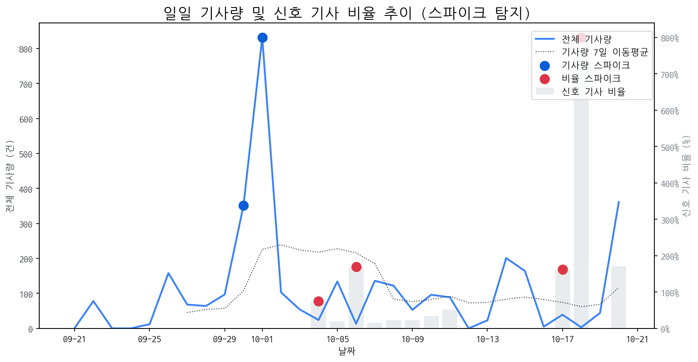

# Daily Briefing (2025-10-21)

## 1. 시장 활동량 및 이상 징후

- **분석 기간:** 2025-09-21 ~ 2025-10-20 (최근 30일)
- **최근 30일 평균 신호 기사 비율:** 51.38%

### 📈 전체 기사량 스파이크
| 날짜         | 기사량   |   Z-Score |
|:-----------|:------|----------:|
| 2025-09-30 | 351건  |      2.04 |
| 2025-10-01 | 832건  |      2.1  |

### 신호 기사 비율 스파이크
| 날짜         | 비율      |   Z-Score |
|:-----------|:--------|----------:|
| 2025-10-04 | 75.00%  |      2.27 |
| 2025-10-06 | 169.23% |      2.05 |
| 2025-10-17 | 161.54% |      2.15 |
| 2025-10-18 | 800.00% |      2.22 |

## 2. 오늘의 급등 신호 (Today's Hot Signals)

| 급등 신호   |   오늘 언급량 |   어제 대비 증가 |   모멘텀(z_like) |
|:--------|---------:|-----------:|--------------:|
| 삼성      |       43 |         37 |          7.21 |
| lg      |       25 |         25 |          5.51 |
| lg전자    |       24 |         23 |          5.13 |
| 삼성전자    |       33 |         22 |          4.81 |
| 애플      |       14 |         13 |          3.61 |
| oled    |       15 |         10 |          3.49 |
| 맥북      |        6 |          6 |          2.5  |
| 현대차     |        5 |          5 |          2.15 |
| 갤럭시     |        4 |          4 |          1.63 |
| 아이폰     |        4 |          2 |          1.63 |

## 참고: 최근 30일 누적 강한 신호 Top 5

| 모멘텀 토픽   |   z_like 점수 |   누적 언급량 |
|:---------|------------:|---------:|
| 삼성       |        7.21 |      392 |
| lg       |        5.51 |      281 |
| lg전자     |        5.13 |       70 |
| 삼성전자     |        4.81 |      165 |
| 애플       |        3.61 |       97 |

## 3. 경쟁사 주요 활동

| 날짜         | 유형     | 제목                                       |
|:-----------|:-------|:-----------------------------------------|
| 2025-10-15 | LAUNCH | 인하대, 이정환 교수 연구실 소속 학생들 국제학술대회서 성과 인정받아   |
| 2025-10-15 | LAUNCH | 인하대, 이정환 교수 연구실 소속 학생들 국제학술대회서 성과 인정     |
| 2025-10-20 | INVEST | 中 모니터 시장도 '양보다 질'…SDC·LGD 수혜 기대          |
| 2025-10-21 | INVEST | 中, 8.6세대  OLED 에 투자 공세…2029년 '공급과잉' 불러온다 |
| 2025-10-21 | LAUNCH | 삼성, 22일 '무한 XR' 공개…애플·메타와 'XR 삼국지' 서막    |

## 4. 주요 기사

| 제목                                                                                                                                   |
|:-------------------------------------------------------------------------------------------------------------------------------------|
| [[브리프] 삼성전자 현대차 LG전자 SKT LG에너지솔루션 한컴라이프케어 ...](http://www.biztribune.co.kr/news/articleView.html?idxno=341879)                       |
| [[기획] 삼성전자 반도체, 노동자 직업병‧하청노동자 권리 침해 논란](http://www.rightknow.co.kr/news/articleView.html?idxno=32320)                                |
| [[더벨][인디아 드림 리플레이]삼성전자, 인도 접점 확대 추진 'AI홈 전면...](https://www.thebell.co.kr/free/content/ArticleView.asp?key=202510011612558240106394) |
