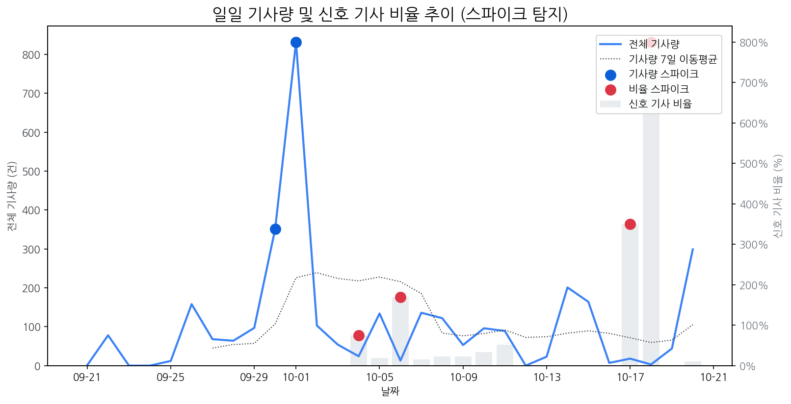

# Daily Briefing (2025-10-21)

## 1. 시장 활동량 및 이상 징후

- **분석 기간:** 2025-09-21 ~ 2025-10-20 (최근 30일)
- **최근 30일 평균 신호 기사 비율:** 52.30%

### 📈 전체 기사량 스파이크
| 날짜         | 기사량   |   Z-Score |
|:-----------|:------|----------:|
| 2025-09-30 | 351건  |      2.04 |
| 2025-10-01 | 832건  |      2.1  |

### 신호 기사 비율 스파이크
| 날짜         | 비율      |   Z-Score |
|:-----------|:--------|----------:|
| 2025-10-04 | 75.00%  |      2.27 |
| 2025-10-06 | 169.23% |      2.05 |
| 2025-10-17 | 350.00% |      2.24 |
| 2025-10-18 | 800.00% |      2.06 |

## 2. 오늘의 급등 신호 (Today's Hot Signals)

| 급등 신호   |   오늘 언급량 |   어제 대비 증가 |   모멘텀(z_like) |
|:--------|---------:|-----------:|--------------:|
| 삼성      |       31 |         25 |          5.3  |
| lg      |       22 |         22 |          5.16 |
| lg전자    |       20 |         19 |          4.55 |
| 애플      |       10 |          9 |          2.75 |
| 삼성전자    |       21 |         10 |          2.55 |
| oled    |        9 |          4 |          1.95 |
| 현대차     |        4 |          4 |          1.78 |

## 참고: 최근 30일 누적 강한 신호 Top 5

| 모멘텀 토픽   |   z_like 점수 |   누적 언급량 |
|:---------|------------:|---------:|
| 삼성       |        5.3  |      378 |
| lg       |        5.16 |      275 |
| lg전자     |        4.55 |       63 |
| 애플       |        2.75 |       91 |
| 삼성전자     |        2.55 |      155 |

## 3. 경쟁사 주요 활동

| 날짜         | 유형            | 제목                                               |
|:-----------|:--------------|:-------------------------------------------------|
| 2025-10-21 | INVEST,ORDER  | OLED  대형  패널  시장 확대…선익시스템 성장 기대감↑                |
| 2025-10-21 | INVEST        | “K-디스플레이, 지금 투자 안하면  OLED 마저 中에 내줄 것”            |
| 2025-10-21 | LAUNCH        | 삼성, 22일 '무한 XR' 공개…애플·메타와 'XR 삼국지' 서막            |
| 2025-10-21 | INVEST        | 中, ‘한국의 LCD 악몽’ 재현 노린다… IT용  OLED  투자서 ‘4대 1′ 공세 |
| 2025-10-21 | INVEST,LAUNCH | SDC, 신형 맥북에 8.6세대  OLED 패널  독점 공급                |

## 4. 주요 기사

#### [이러다 정말 영화관 다 망하겠네...LG전자 거실을 극장으로 바꿔 놓다](https://www.polinews.co.kr/news/articleView.html?idxno=710850)
- 다음은 기사 본문의 핵심 내용 3가지 요약입니다.
- 
- -   LG전자는 능동형 매트릭스 기술을 적용한 'LG 매그니트 액티브 마이크로 LED'를 출시, 픽셀 단위 제어를 통해 OLED급 화질과 LED급 밝기를 동시에 구현하며 프리미엄 홈 시네마 시장의 새로운 기준을 제시합니다.
- -   webOS 기반의 다양한 콘텐츠(LG채널, OTT, 갤러리 플러스 등) 연동, Dolby Vision, 144Hz 고주사율, 100W 입체음향 등을 통해 '거실 속 극장' 경험을 제공하며, 단순한 가전 판매를 넘어 프리미엄 콘텐츠 소비 생태계 구축을 목표합니다.
- -   가정용 인증 획득 및 각종 안전/품질 인증을 통해 초고가 시장에서 신뢰도를 높이고, 향후 B2B 시장으로 확장하여 시각 경험 공간의 수익 다각화를 추구하며, '정밀 제어 + 가정용 안정성'이라는 차별점으로 프리미엄 마이크로 LED 시장 경쟁에서 우위를 확보하려 합니다.
---
#### [판 커지는 XR 전쟁 … 中, 핵심기술 '올레도스' 주도권 쥐나](https://biz.newdaily.co.kr/site/data/html/2025/10/21/2025102100120.html)
- XR 헤드셋 시장 확대로 고해상도 올레도스(OLEDoS) 디스플레이 기술 경쟁이 본격화될 것으로 예상되는 가운데, 글로벌 브랜드들이 잇따라 채택하며 시장 개화가 가시화되고 있다.
- 중국은 정부 보조금을 바탕으로 10개 이상의 12인치 올레도스 생산 라인을 구축하며 공격적인 투자를 통해 시장 점유율 확대를 노리는 '패널 굴기' 2라운드를 시작했다.
- 한국은 올레도스 기술을 보유하고 있지만, 높은 초기 투자비, 원가 부담, 불확실한 시장 수요 등으로 인해 OLED에 '선택과 집중' 전략을 취하며 기술 신뢰성과 수율 경쟁력 강화에 주력하고 있다.
---
#### [[단독] LG전자, '차세대 격전지' RGB TV 상표 출원…제품 출시 임박](https://www.bizhankook.com/bk/article/30542)
- LG전자가 '하이퍼 래디언트 RGB' 상표권 출원을 통해 내년 상반기 RGB TV 출시를 예고하며, LCD TV의 최종 진화형으로 불리는 RGB TV 시장 경쟁에 본격적으로 뛰어들었다.
- 중국 제조사들이 RGB 미니 LED TV 시장을 확장하는 가운데, 삼성전자는 이미 마이크로 RGB TV를 출시하며 프리미엄 RGB TV 시장에서 선점 우위를 확보하려 하고 있다.
- 국내 기업들은 중국산 RGB TV의 추격에 맞서 기술력으로 차별화된 고급형 RGB TV를 통해 프리미엄 TV 시장에서의 주도권을 유지하고, '보급형' 이미지로 선을 그으려는 전략을 취하고 있다.
---