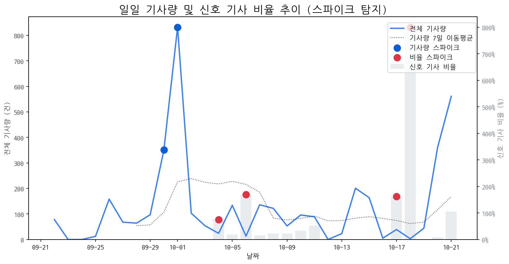

# Daily Briefing (2025-10-21)

## 1. 시장 활동량 및 이상 징후

- **분석 기간:** 2025-09-22 ~ 2025-10-21 (최근 30일)
- **최근 30일 평균 신호 기사 비율:** 49.47%

### 📈 전체 기사량 스파이크
| 날짜         | 기사량   |   Z-Score |
|:-----------|:------|----------:|
| 2025-09-30 | 351건  |      2.04 |
| 2025-10-01 | 832건  |      2.1  |

### 신호 기사 비율 스파이크
| 날짜         | 비율      |   Z-Score |
|:-----------|:--------|----------:|
| 2025-10-04 | 75.00%  |      2.27 |
| 2025-10-06 | 169.23% |      2.05 |
| 2025-10-17 | 161.54% |      2.15 |
| 2025-10-18 | 800.00% |      2.22 |

## 2. 오늘의 급등 신호 (Today's Hot Signals)

| 급등 신호   |   오늘 언급량 |   어제 대비 증가 |   모멘텀(z_like) |
|:--------|---------:|-----------:|--------------:|
| 삼성      |       46 |          3 |          6.05 |
| lg전자    |       29 |          5 |          4.87 |
| lg      |       29 |          4 |          4.75 |
| 차세대     |       10 |          9 |          3.31 |
| ar      |        6 |          5 |          2.35 |
| ces     |        5 |          5 |          2.32 |
| 패널      |        6 |          4 |          2.21 |
| 아이폰     |        7 |          3 |          2.18 |
| 갤럭시     |        6 |          3 |          2.08 |
| 백플레인    |        4 |          4 |          1.95 |

## 참고: 최근 30일 누적 강한 신호 Top 5

| 모멘텀 토픽   |   z_like 점수 |   누적 언급량 |
|:---------|------------:|---------:|
| 삼성       |        6.05 |      438 |
| lg전자     |        4.87 |       99 |
| lg       |        4.75 |      310 |
| 삼성전자     |        3.35 |      194 |
| 차세대      |        3.31 |       49 |

## 3. 경쟁사 주요 활동

| 날짜         | 유형                                         | 제목                                       |
|:-----------|:-------------------------------------------|:-----------------------------------------|
| 2025-10-20 | LAUNCH                                     | 인하대학교 이정환 교수 연구실 소속 학생들, 국제학술대회서 성과 인정   |
| 2025-10-21 | CERT,INVEST,LAUNCH,ORDER,PARTNERSHIP,REGUL | 10월 4주 주요 제조업 전망                         |
| 2025-10-21 | INVEST,ORDER                               | OLED  대형  패널  시장 확대…선익시스템 성장 기대감↑        |
| 2025-10-15 | LAUNCH                                     | 인하대, 이정환 교수 연구실 학생들 'iMiD 국제학술대회'서 성과 인정 |
| 2025-10-15 | LAUNCH                                     | 인하대, 국제학술대회서 학생 연구 성과 인정                 |

## 4. 주요 기사

### ['매출 비중 61% 눈앞'…LG디스플레이, 어엿한 'OLED' 기업됐다](https://www.newsway.co.kr/news/view?ud=2025093016372693269)
> LG디스플레이의 OLED 매출 비중은 올해 말 61%에 이를 것으로 전망된다.        OLED 매출 비중은 올해 말 61%에 이를 것으로 전망된다.
---
### [10월 4주 주요 제조업 전망](https://www.laborplus.co.kr/news/articleView.html?idxno=36432)
> 로컬 요약 모델 실행 중 오류가 발생했습니다.
---
### [[더벨][인디아 드림 리플레이]삼성전자, 인도 접점 확대 추진 'AI홈 전면...](https://www.thebell.co.kr/free/content/ArticleView.asp?key=202510011612558240106394)
> 로컬 요약 모델 실행 중 오류가 발생했습니다.
---