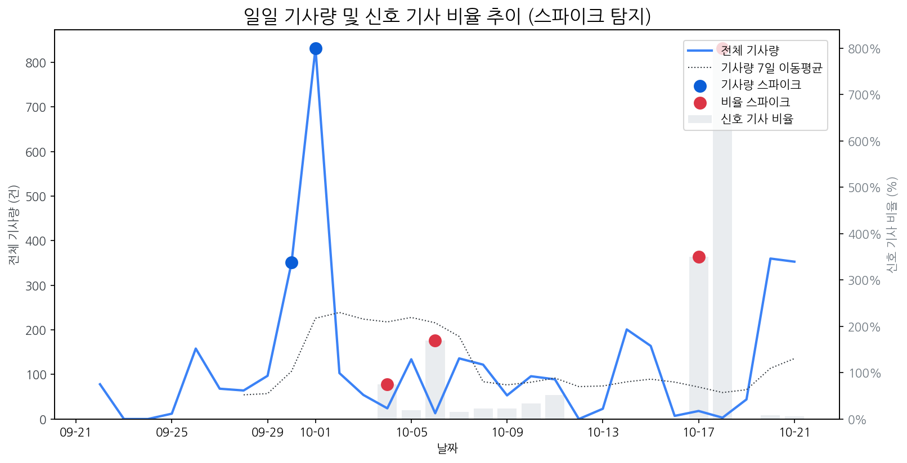

# Daily Briefing (2025-10-22)

## 1. 시장 활동량 및 이상 징후

- **분석 기간:** 2025-09-22 ~ 2025-10-21 (최근 30일)
- **최근 30일 평균 신호 기사 비율:** 52.43%

### 📈 전체 기사량 스파이크
| 날짜         | 기사량   |   Z-Score |
|:-----------|:------|----------:|
| 2025-09-30 | 351건  |      2.04 |
| 2025-10-01 | 832건  |      2.1  |

### 신호 기사 비율 스파이크
| 날짜         | 비율      |   Z-Score |
|:-----------|:--------|----------:|
| 2025-10-04 | 75.00%  |      2.27 |
| 2025-10-06 | 169.23% |      2.05 |
| 2025-10-17 | 350.00% |      2.24 |
| 2025-10-18 | 800.00% |      2.06 |

## 2. 오늘의 급등 신호 (Today's Hot Signals)

| 급등 신호   |   오늘 언급량 |   어제 대비 증가 |   모멘텀(z_like) |
|:--------|---------:|-----------:|--------------:|
| ar      |        5 |          4 |          2    |
| 백플레인    |        4 |          4 |          1.95 |
| 패널      |        5 |          3 |          1.86 |
| 차세대     |        6 |          5 |          1.86 |
| lg디스플레이 |        5 |          5 |          1.74 |

## 참고: 최근 30일 누적 강한 신호 Top 5

| 모멘텀 토픽   |   z_like 점수 |   누적 언급량 |
|:---------|------------:|---------:|
| 삼성       |        2.73 |      415 |
| lg       |        2.36 |      294 |
| lg전자     |        2.03 |       81 |
| ar       |        2    |       34 |
| 백플레인     |        1.95 |        4 |

## 3. 경쟁사 주요 활동

| 날짜         | 유형            | 제목                                          |
|:-----------|:--------------|:--------------------------------------------|
| 2025-10-15 | LAUNCH        | 인하대, 이정환 교수 연구실 소속 학생들 국제학술대회서 성과 인정        |
| 2025-10-22 | INVEST,LAUNCH | [IPO레이더]장석준 이노테크 대표 "복합 신뢰성 장비로 글로벌 시장 도... |
| 2025-10-22 | INVEST,LAUNCH | 삼성·LGD, 다음 격전지는 '차량용 디스플레이'… OLED  기술로 맞붙는다 |
| 2025-10-22 | REGUL         | 수원지법 "톱텍, 삼성D에 116억원 지급하라" 판결...삼성D 부분 승소   |
| 2025-10-22 | ORDER         | S&P, 3년 만에 LG전자 신용등급 전망 상향                  |

## 4. 주요 기사

### [로봇·산업용·협동로봇 관련주, '함박웃음' 코닉오토메이션·로보스타...](http://www.finomy.com/news/articleView.html?idxno=241175)
> 로컬 요약 모델 실행 중 오류가 발생했습니다.
---
### [“중국 기술 추격 이렇게 따돌린다”...삼성·LG, 초프리미엄 TV 전략은](https://www.mk.co.kr/article/11446098)
> 로컬 요약 모델 실행 중 오류가 발생했습니다.
---
### [작지만 강한 칩…사피엔반도체, 차세대 디스플레이 숨은 주역](https://www.pinpointnews.co.kr/news/articleView.html?idxno=381606)
> 사피엔반도체가 디스플레이 시장의 차세대 기술로 꼽히는 LEDoS(Light Emitting Diode on Silicon) 디스플레이용 구동칩(DDIC)을 개발해 주가에 훈풍을 불어 넣고 있는 것으로 해석된다.
---