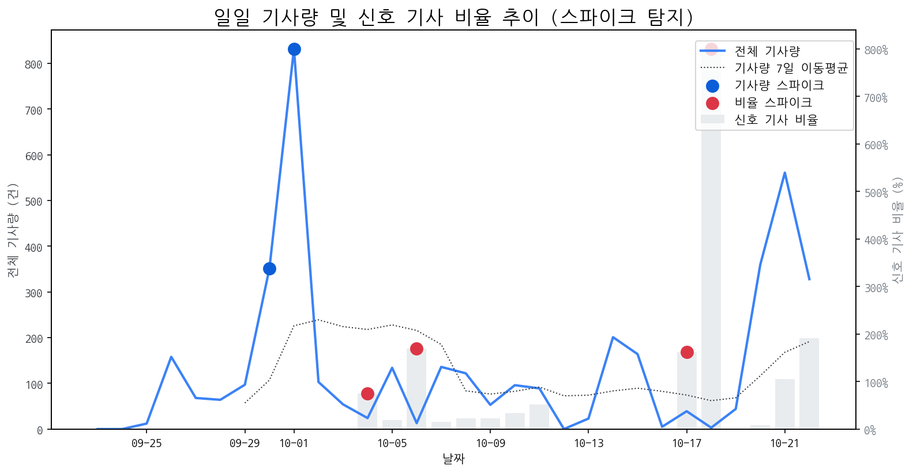

# Daily Briefing (2025-10-22)

## 1. 시장 활동량 및 이상 징후

- **분석 기간:** 2025-09-23 ~ 2025-10-22 (최근 30일)
- **최근 30일 평균 신호 기사 비율:** 55.84%

### 📈 전체 기사량 스파이크
| 날짜         | 기사량   |   Z-Score |
|:-----------|:------|----------:|
| 2025-09-30 | 351건  |      2.04 |
| 2025-10-01 | 832건  |      2.1  |

### 신호 기사 비율 스파이크
| 날짜         | 비율      |   Z-Score |
|:-----------|:--------|----------:|
| 2025-10-04 | 75.00%  |      2.27 |
| 2025-10-06 | 169.23% |      2.05 |
| 2025-10-17 | 161.54% |      2.15 |
| 2025-10-18 | 800.00% |      2.22 |

## 2. 오늘의 급등 신호 (Today's Hot Signals)

| 급등 신호   |   오늘 언급량 |   어제 대비 증가 |   모멘텀(z_like) |
|:--------|---------:|-----------:|--------------:|
| 갤럭시     |       15 |          9 |          4.06 |
| 삼성전자    |       34 |          6 |          3.73 |
| 게이밍     |        8 |          5 |          2.6  |
| 폴더블     |        8 |          2 |          2.18 |
| 아이패드    |        5 |          5 |          2    |
| 메타      |        4 |          4 |          1.78 |

## 참고: 최근 30일 누적 강한 신호 Top 5

| 모멘텀 토픽   |   z_like 점수 |   누적 언급량 |
|:---------|------------:|---------:|
| 갤럭시      |        4.06 |       46 |
| 삼성전자     |        3.73 |      224 |
| 게이밍      |        2.6  |       21 |
| 폴더블      |        2.18 |       43 |
| 아이패드     |        2    |       13 |

## 3. 경쟁사 주요 활동

| 날짜         | 유형            | 제목                                           |
|:-----------|:--------------|:---------------------------------------------|
| 2025-10-15 | LAUNCH        | 인하대, 이정환 교수 연구실 소속 학생들 국제학술대회서 성과 인정         |
| 2025-10-22 | INVEST        | 이노테크 "코스닥 상장으로 글로벌 복합 신뢰성 환경시험 장비 기업 도...    |
| 2025-10-20 | LAUNCH        | 인하대학교 이정환 교수 연구실 소속 학생들, 국제학술대회서 성과 인정       |
| 2025-10-22 | INVEST,LAUNCH | '삼성전자 수율 개선에 주목'…유진證 "경쟁사 앞설 시기, 목표 주가 14... |
| 2025-10-22 | INVEST,LAUNCH | “헤드셋에 이런 기능이”...삼성 ‘갤럭시 XR’로 확장현실 경험 넓힌...   |

## 4. 주요 기사

### [[테크서밋] 스톤파트너스 “2028년 플립 형태 폴더블 아이폰 등장”](https://www.etnews.com/20251021000358)
> 2028년에는 클램셸 타입 폴더블 아이폰을 내놓을 것이라는 전망이 나왔으며 2028년에는 클램셸 타입 폴더블 아이폰이 등장할 것이라고 밝혔다.
---
### [[WIKI 현장] 삼성전자, SEDEX 2025서 HBM4 실물 첫 공개…AI 메모리 대결...](http://www.wikileaks-kr.org/news/articleView.html?idxno=176464)
> SEDEX 2025는 '한계를 넘어, 연결된 혁신'(Beyond Limits, Connected Innected Innovation)'을 주제로 열렸으며, 삼성전자는 공개한 HBM4 메모리는 12단 적층 구조를 갖춰 초당 2테라바이트(TB/s) 이상의 데이터 전송 속도를 자랑한다.
---
### [스마트폰, 스펙 경쟁 끝…초슬림이 대세](https://www.ziksir.com/news/articleView.html?idxno=107133)
> 스마트폰에 '두께와 그립감, 휴대성이 브랜드 차별화의 중심으로 떠올라 스마트폰 시장 경쟁의 축이 성능에서 디자인으로 옮겨가는 흐름도 뚜렷이 일어나며 스마트폰은 두께와 그립감, 휴대성이 브랜드 차별화의 중심으로 떠올랐다.
---