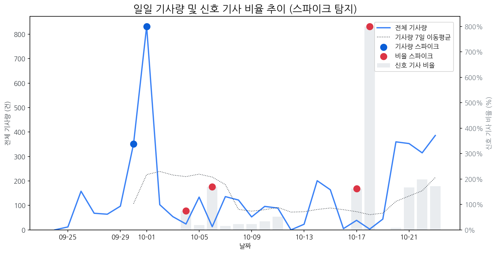

# Daily Briefing (2025-10-23)

## 1. 시장 활동량 및 이상 징후

- **분석 기간:** 2025-09-24 ~ 2025-10-23 (최근 30일)
- **최근 30일 평균 신호 기사 비율:** 63.88%

### 📈 전체 기사량 스파이크
| 날짜         | 기사량   |   Z-Score |
|:-----------|:------|----------:|
| 2025-09-30 | 351건  |      2.04 |
| 2025-10-01 | 832건  |      2.1  |

### 신호 기사 비율 스파이크
| 날짜         | 비율      |   Z-Score |
|:-----------|:--------|----------:|
| 2025-10-04 | 75.00%  |      2.27 |
| 2025-10-06 | 169.23% |      2.05 |
| 2025-10-17 | 161.54% |      2.15 |
| 2025-10-18 | 800.00% |      2.22 |

## 2. 오늘의 리스크 신호 (Risk Signals)

- (감성 급락 토픽 없음)

## 3. 오늘의 급등 신호 (Today's Hot Signals)

| 급등 신호   |   오늘 언급량 |   어제 대비 증가 |   모멘텀(z_like) |
|:--------|---------:|-----------:|--------------:|
| lg      |       28 |         14 |          3.44 |
| 게이밍     |       10 |          5 |          2.66 |
| 현대모비스   |        5 |          5 |          2.32 |
| 애플      |       15 |          5 |          2.25 |
| tsmc    |        5 |          5 |          2    |
| 삼성      |       29 |          4 |          1.87 |
| 삼성디스플레이 |        4 |          4 |          1.63 |
| samsung |        3 |          3 |          1.55 |

## 참고: 최근 30일 누적 강한 신호 Top 5

| 모멘텀 토픽   |   z_like 점수 |   누적 언급량 |
|:---------|------------:|---------:|
| lg       |        3.44 |      335 |
| 게이밍      |        2.65 |       28 |
| 현대모비스    |        2.32 |       25 |
| 애플       |        2.25 |      126 |
| tsmc     |        2    |       19 |

## 4. 경쟁사 주요 활동

| 날짜         | 유형           | 제목                                                            |
|:-----------|:-------------|:--------------------------------------------------------------|
| 2025-10-23 | LAUNCH       | LG, APEC 정상회의 전면 지원…구광모 회장 비롯 CEO 총출동                         |
| 2025-10-20 | INVEST,ORDER | 中 모니터 시장도 '양보다 질'…SDC·LGD 수혜 기대                               |
| 2025-10-22 | LAUNCH       | MSI, 500Hz 초고주사율과 DP2.1을 탑재한 게이밍 모니터 'MPG 271QR QD- OLED  ... |
| 2025-10-20 | LAUNCH       | 인하대학교 이정환 교수 연구실 소속 학생들, 국제학술대회서 성과 인정                        |
| 2025-10-23 | LAUNCH       | 애플  폴더블  제품 출시 연기… 시장 진입 타이밍 놓치나                              |

## 5. 주요 기사

### ['매출 비중 61% 눈앞'…LG디스플레이, 어엿한 'OLED' 기업됐다](https://www.newsway.co.kr/news/view?ud=2025093016372693269)
> LG디스플레이의 OLED 매출 비중은 올해 말 61%에 이를 것으로 전망된다.        OLED 매출 비중은 올해 말 61%에 이를 것으로 전망된다.
---
### [삼성디스플레이, IT  OLED  '초격차' 성공…노트북·모니터 싹쓸이](http://datanews.co.kr/news/article.html?no=141316)
> 삼성디스플레이가 노트북과 모니터용 OLED 분야에 선제적인 기술 개발과 생산 투자를 통해 '초격차' 기술 주도권을 잡아가고 있는 가운데, 23일 데이터뉴스가 카운터포인트리서치의 최신 OLED 출하량 보고서를 분석한 결과, 전세계 OLED 시장에서 모니터, 노트북용 제품이 가장 높은 성장세를 보인 것으로 나타났다.
---
### [로봇·산업용·협동로봇 관련주, '함박웃음' 코닉오토메이션·로보스타...](http://www.finomy.com/news/articleView.html?idxno=241175)
> 로컬 요약 모델 실행 중 오류가 발생했습니다.
---