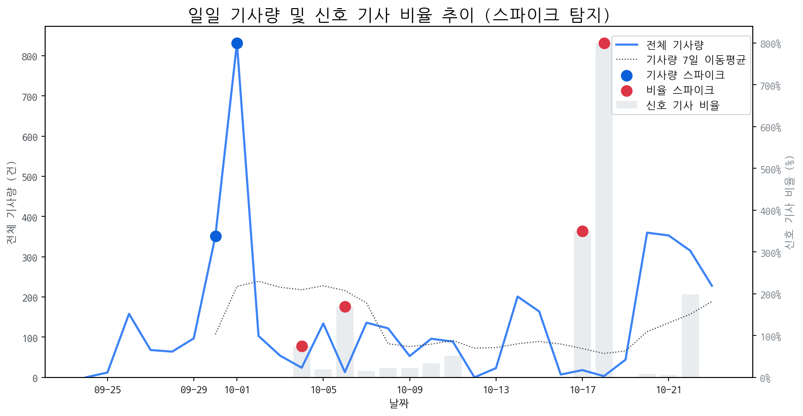

# Daily Briefing (2025-10-24)

## 1. 시장 활동량 및 이상 징후

- **분석 기간:** 2025-09-24 ~ 2025-10-23 (최근 30일)
- **최근 30일 평균 신호 기사 비율:** 59.06%

### 📈 전체 기사량 스파이크
| 날짜         | 기사량   |   Z-Score |
|:-----------|:------|----------:|
| 2025-09-30 | 351건  |      2.04 |
| 2025-10-01 | 832건  |      2.1  |

### 신호 기사 비율 스파이크
| 날짜         | 비율      |   Z-Score |
|:-----------|:--------|----------:|
| 2025-10-04 | 75.00%  |      2.27 |
| 2025-10-06 | 169.23% |      2.05 |
| 2025-10-17 | 350.00% |      2.24 |
| 2025-10-18 | 800.00% |      2.06 |

## 2. 오늘의 리스크 신호 (Risk Signals)

- (감성 급락 토픽 없음)

## 3. 오늘의 급등 신호 (Today's Hot Signals)

| 급등 신호   |   오늘 언급량 |   어제 대비 증가 |   모멘텀(z_like) |
|:--------|---------:|-----------:|--------------:|
| amd     |       12 |         12 |          4.45 |
| 게이밍     |       12 |          7 |          3.19 |
| samsung |        3 |          3 |          1.55 |

## 참고: 최근 30일 누적 강한 신호 Top 5

| 모멘텀 토픽   |   z_like 점수 |   누적 언급량 |
|:---------|------------:|---------:|
| amd      |        4.45 |       18 |
| 게이밍      |        3.19 |       30 |
| 폴더블      |        2.03 |       49 |
| samsung  |        1.55 |        6 |
| asus     |        1.12 |        2 |

## 4. 경쟁사 주요 활동

| 날짜         | 유형                        | 제목                                   |
|:-----------|:--------------------------|:-------------------------------------|
| 2025-10-24 | LAUNCH                    | SK온 CEO, 美 조지아 주지사→페라리 CEO 연쇄 회동     |
| 2025-10-24 | LAUNCH,REGUL              | 저출생·고령화 해법, 디자인에서 찾는다…공공디자인 페스티벌     |
| 2025-10-24 | LAUNCH,REGUL              | 공공디자인 페스티벌 개최…저출생·고령화 해법, 디자인에서 찾는다  |
| 2025-10-24 | INVEST,LAUNCH,PARTNERSHIP | 이석희 SK온 대표, 미국 조지아 주지사·페라리 CEO 연쇄 회동 |
| 2025-10-24 | LAUNCH,REGUL              | 세대 공존 위한 디자인 해법 총집합, 공공디자인 페스티벌 2025 |

## 5. 주요 기사

### [Xbox, "차세대 콘솔은 현재 프로토타입 및 디자인 단계"](https://www.inven.co.kr/webzine/news/?news=310575)
> 마이크로소프트가 버라이어티와 협력하여 ROG Xbox Ally 및 Ally X 핸드헬드 기기를 출시한 직후에 나온 인터뷰에서, 버라이어티와 버라이어티와 ROG Xbox Ally 관련 인터뷰 중 차세대 Xbox 콘솔에 대해 언급했다.
---
### [펄어비스, 홍대에 '붉은사막 X AMD' 팝업스토어 오픈](https://www.pinpointnews.co.kr/news/articleView.html?idxno=387898)
> 펄어비스는 23일 글로벌 반도체 기업 AMD와 함께 ‘붉은사막 X AMD 팝업스토어 2025’를 서울 홍익대학교 인근 ‘DRC 홍대’에서 10월 30일부터 11월 1일까지 운영한다고 밝혔다.
---
### [‘붉은사막’ 광활한 오픈월드와 실감나는 전투 직접 체험한다…홍대서...](https://www.kukinews.com/article/view/kuk202510230156)
> 펄어어비스가 글로벌 고성능 컴퓨팅의 선두 주자 AMD와 손잡고 오는 30일부터 11월1일까지 ‘DRC 홍대’에서 최상의 게이밍 경험을 직접 선보이기 위해 마련한 체험형 이벤트 공간인 ‘붉은사막 X AMD 팝업스토어 2025를 연다.
---