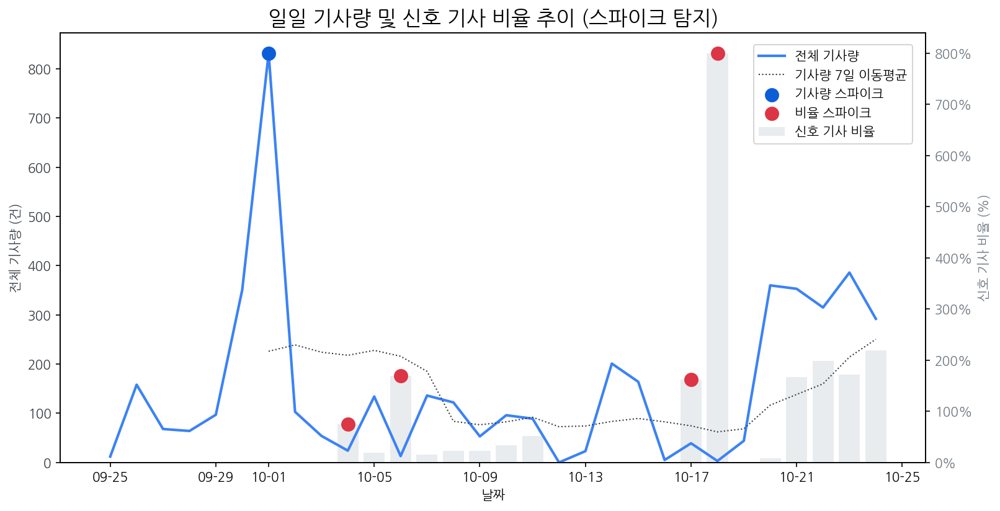

# Daily Briefing (2025-10-24)

## 1. 시장 활동량 및 이상 징후

- **분석 기간:** 2025-09-25 ~ 2025-10-24 (최근 30일)
- **최근 30일 평균 신호 기사 비율:** 71.19%

### 📈 전체 기사량 스파이크
| 날짜         | 기사량   |   Z-Score |
|:-----------|:------|----------:|
| 2025-10-01 | 832건  |       2.1 |

### 신호 기사 비율 스파이크
| 날짜         | 비율      |   Z-Score |
|:-----------|:--------|----------:|
| 2025-10-04 | 75.00%  |      2.27 |
| 2025-10-06 | 169.23% |      2.05 |
| 2025-10-17 | 161.54% |      2.15 |
| 2025-10-18 | 800.00% |      2.22 |

## 2. 오늘의 리스크 신호 (Risk Signals)

- (감성 급락 토픽 없음)

## 3. 오늘의 급등 신호 (Today's Hot Signals)

| 급등 신호   |   오늘 언급량 |   어제 대비 증가 |   모멘텀(z_like) |
|:--------|---------:|-----------:|--------------:|
| sk온     |        9 |          9 |          3.62 |
| 애플      |       24 |          9 |          3.42 |
| 고성능     |        5 |          5 |          2.32 |
| 아이패드    |        7 |          2 |          1.62 |

## 참고: 최근 30일 누적 강한 신호 Top 5

| 모멘텀 토픽   |   z_like 점수 |   누적 언급량 |
|:---------|------------:|---------:|
| sk온      |        3.62 |       10 |
| 애플       |        3.42 |      150 |
| 고성능      |        2.32 |       15 |
| 아이패드     |        1.62 |       25 |
| oled     |        1.17 |      189 |

## 4. 경쟁사 주요 활동

| 날짜         | 유형                  | 제목                                                  |
|:-----------|:--------------------|:----------------------------------------------------|
| 2025-10-15 | LAUNCH              | 인하대, 이정환 교수 연구실 소속 학생들 국제학술대회서 성과 인정받아              |
| 2025-10-24 | INVEST,LAUNCH       | [이승훈 특파원의 일본열도 통신] TV 대신 콘텐츠 기업으로… 가전 상징...         |
| 2025-10-20 | INVEST,ORDER        | 中 모니터 시장도 '양보다 질'…SDC·LGD 수혜 기대                     |
| 2025-10-20 | LAUNCH              | 인하대학교 이정환 교수 연구실 소속 학생들, 국제학술대회서 성과 인정              |
| 2025-10-24 | INVEST,LAUNCH,ORDER | [더벨][삼성 인사 풍향계]이청 사장 취임 1년, 'IT  OLED ' 조기 안정화 미... |

## 5. 주요 기사

### [[뉴스줌인] 삼성 갤럭시 XR 출시, 애플 비전 프로 넘을까?](https://it.donga.com/107737/)
> 로컬 요약 모델 실행 중 오류가 발생했습니다.
---
### [SDC, 신형 맥북에 8.6세대 OLED 패널 독점 공급](https://www.newstopkorea.com/news/articleView.html?idxno=40472)
> 삼성디스플레이플레이는 충청남도 아산시 아산캠퍼스에 8.6세대 OLED 패널 생산 라인을 새롭게 만들기로 결정하고 삼성디스플레이 8.6세대 OLED 패널 공장(팹)에서 빠르면 내년 2분기, 늦으면 3분기 정도부터 패널을 공급 받기 시작할 것이라고 진단하고 삼성디스플레이는 충청남도 아산시 아산캠퍼스에 8.6세대 OLED 패널 생산 라인(A2)을 구축하고 있다.
---
### [반등에도 웃을 수만은 없는 패널사…中 격차 확대 '우려'](https://www.dailian.co.kr/news/view/1555337/?sc=Naver)
> 애플 아이폰17 시리즈 신제품 효과와 고부가가치 제품 비중 확대가 그 배경인데 특히 LG디스플레이는 약 4년 만의 흑자 전환이 가시화되고 있는 가운데 중국의 점유율 확대와 정부 지원을 업은 기술력 추격은 경계해야 한다는 목소리도 높아진다.
---