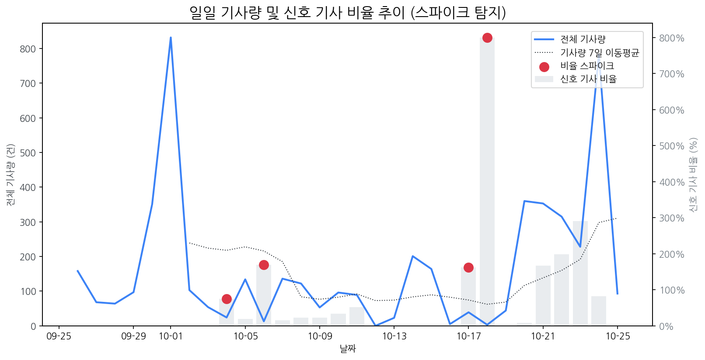

# Daily Briefing (2025-10-26)

## 1. 시장 활동량 및 이상 징후

- **분석 기간:** 2025-09-26 ~ 2025-10-25 (최근 30일)
- **최근 30일 평균 신호 기사 비율:** 70.57%

### 신호 기사 비율 스파이크
| 날짜         | 비율      |   Z-Score |
|:-----------|:--------|----------:|
| 2025-10-04 | 75.00%  |      2.27 |
| 2025-10-06 | 169.23% |      2.05 |
| 2025-10-17 | 161.54% |      2.15 |
| 2025-10-18 | 800.00% |      2.22 |

## 2. 오늘의 리스크 신호 (Risk Signals)

- (감성 급락 토픽 없음)

## 3. 오늘의 급등 신호 (Today's Hot Signals)

- (데이터 없음)

## 참고: 최근 30일 누적 강한 신호 Top 5

| 모멘텀 토픽   |   z_like 점수 |   누적 언급량 |
|:---------|------------:|---------:|
| 인텔       |        0.59 |       12 |
| 비전프로     |        0.34 |        6 |
| 퀄컴       |        0.34 |       18 |
| 구글       |        0.26 |       26 |
| 양산       |        0.24 |       24 |

## 4. 경쟁사 주요 활동

| 날짜         | 유형                  | 제목                                                  |
|:-----------|:--------------------|:----------------------------------------------------|
| 2025-10-26 | LAUNCH              | 삼성전자, 호주서 '가장 사랑받는 가전브랜드' 선정                        |
| 2025-10-26 | LAUNCH              | 삼성전자, 호주서 ‘가장 사랑받는 가전브랜드’ 선정                        |
| 2025-10-26 | LAUNCH              | 삼성전자, 호주서 소비자로부터 가장 사랑받는 가전브랜드 선정                   |
| 2025-10-24 | INVEST,LAUNCH,ORDER | [더벨][삼성 인사 풍향계]이청 사장 취임 1년, 'IT  OLED ' 조기 안정화 미... |
| 2025-10-24 | INVEST,ORDER        | [IPO] ‘복합 환경시험 장비’ 이노테크, 공모가 상단 1만4700원 확정…기...     |

## 5. 주요 기사

### [갤럭시XR vs 애플 비전프로: 누가 더 나은가](https://www.betanews.net/article/view/beta202510250010)
> 갤럭시XR은 삼성 갤럭시XR보다 더 무겁고, 머리 스트랩이 덜 무겁고 더 무겁고 더 무겁고 더 불편하다는 평가를 받으며 삼성 갤럭시XR은 삼성 갤럭시XR과 비슷한 사양을 보여준다.
---
### [반도체 장비 관련주, '맑음' 로보스타·에프에스티·신성이엔지·디아이](http://www.finomy.com/news/articleView.html?idxno=241570)
> 로컬 요약 모델 실행 중 오류가 발생했습니다.
---
### ['갤럭시 XR'은 삼성 확장현실 로드맵 서막…안드로이드 생태계로 승부수](https://www.ddaily.co.kr/page/view/2025102318034619692)
> 지난 22일 공개된 첫 XR 헤드셋 ‘갤럭시 XR(Galaxy XR)’이 그 서막인 ‘갤럭시 XR(Galaxy XR)’은 메타 독주 체제인 컴퓨팅 시장에 삼성도 첫 발을 들인 것이다.
---