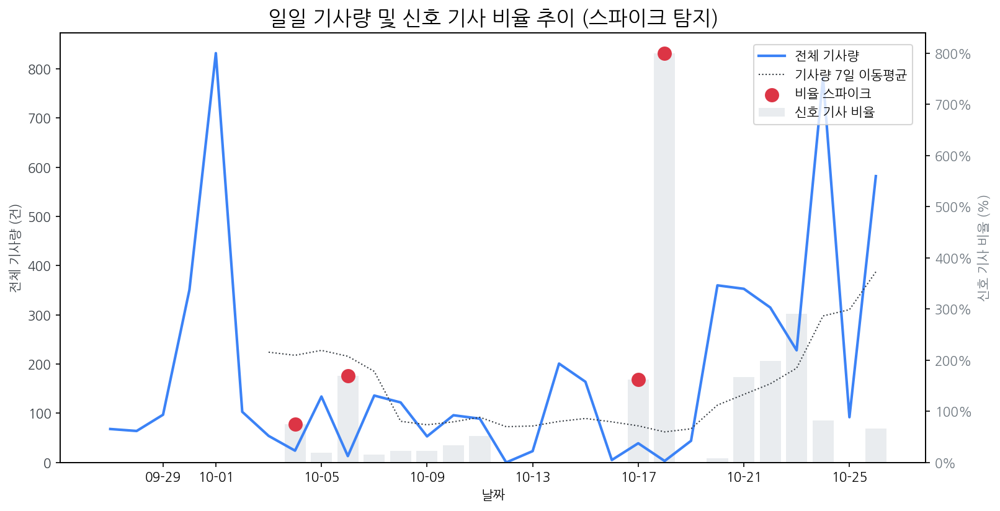

# Daily Briefing (2025-10-26)

## 1. 시장 활동량 및 이상 징후

- **분석 기간:** 2025-09-27 ~ 2025-10-26 (최근 30일)
- **최근 30일 평균 신호 기사 비율:** 72.77%

### 신호 기사 비율 스파이크
| 날짜         | 비율      |   Z-Score |
|:-----------|:--------|----------:|
| 2025-10-04 | 75.00%  |      2.27 |
| 2025-10-06 | 169.23% |      2.05 |
| 2025-10-17 | 161.54% |      2.15 |
| 2025-10-18 | 800.00% |      2.22 |

## 2. 오늘의 리스크 신호 (Risk Signals)

- (감성 급락 토픽 없음)

## 3. 오늘의 급등 신호 (Today's Hot Signals)

| 급등 신호   |   오늘 언급량 |   어제 대비 증가 |   모멘텀(z_like) |
|:--------|---------:|-----------:|--------------:|
| 삼성전자    |       67 |         65 |          5.51 |
| lg전자    |       34 |         32 |          4.61 |
| 아마존     |        3 |          3 |          1.55 |

## 참고: 최근 30일 누적 강한 신호 Top 5

| 모멘텀 토픽   |   z_like 점수 |   누적 언급량 |
|:---------|------------:|---------:|
| 삼성전자     |        5.51 |      344 |
| lg전자     |        4.61 |      136 |
| 아마존      |        1.55 |        5 |
| 디스플레이    |        1.26 |      116 |
| bmw      |        1.12 |        4 |

## 4. 경쟁사 주요 활동

| 날짜         | 유형                              | 제목                                              |
|:-----------|:--------------------------------|:------------------------------------------------|
| 2025-10-26 | LAUNCH                          | 샤넬, 디올, 구찌, 발렌시아가, 보테가 베네타에 새로운 바람이 불다          |
| 2025-10-26 | INVEST                          | 삼성디스플레이, 최근 5년간 순이익률 12.19%                     |
| 2025-10-25 | LAUNCH,PARTNERSHIP              | LG전자, '한국항공우주산업(KAI)'과 'LG 매그니트' 차세대 비행 시뮬레이... |
| 2025-10-26 | PARTNERSHIP                     | 우리금융그룹, 금융권 유일 공식 홍보 후원사… 재무-구조 개혁 장관회...       |
| 2025-10-25 | INVEST,LAUNCH,ORDER,PARTNERSHIP | 2차전지 관련주, '덩실덩실' 강원에너지·케이이엠텍·애경케미칼·유일...        |

## 5. 주요 기사

### [로봇·산업용·협동로봇 관련주, '함박웃음' 로보스타·현대무벡스·삼...](http://www.finomy.com/news/articleView.html?idxno=241588)
> 로컬 요약 모델 실행 중 오류가 발생했습니다.
---
### [전기차 관련주, '룰루랄라 콧노래' 엠플러스·삼성SDI·코스모신소재·신...](http://www.finomy.com/news/articleView.html?idxno=241578)
> 로컬 요약 모델 실행 중 오류가 발생했습니다.
---
### [美·中·日 정상에 젠슨 황까지 온다…韓서 달아오른 APEC, 관전 포인트...](https://zdnet.co.kr/view/?no=20251026122344)
> 로컬 요약 모델 실행 중 오류가 발생했습니다.
---