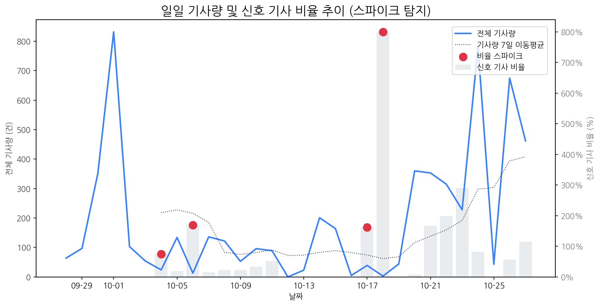

# 일간 상세 해설 리포트

Date: 2025-10-27 | Generated by Market Intelligence Team

## Executive Summary

레노버 주가가 눈에 띄게 상승했지만, 전반적인 시장에 특이 징후는 감지되지 않았습니다. 삼성전자는 OLED TV를 통해 닌텐도 스위치2 사용 환경을 제공하며 경쟁 우위를 확보하려는 움직임을 보이고 있습니다. 이는 콘솔 게임 시장에서의 TV 활용도 증가를 시사하며, 레노버의 급등과 함께 향후 시장 경쟁 구도에 영향을 미칠 수 있는 중요한 변수로 작용할 수 있습니다. 따라서, 삼성전자의 전략과 레노버의 주가 상승 원인을 면밀히 분석하여 시장 변화에 대한 대응 전략을 수립해야 합니다.

## 1. 시장 활동량 및 이상 징후

> 최근 30일간의 기사량 변화와 금일 발생한 이상 급등(Spike) 현황 및 원인을 분석합니다.

> 금일 유의미한 스파이크는 포착되지 않았습니다.

### 1.5 오늘의 리스크 신호 (감성 급락)

> 토픽별 일일 감성 점수의 급락 패턴을 탐지하고 그 원인을 분석합니다.

> 금일 감성 급락으로 인한 리스크 신호는 포착되지 않았습니다.

### 2. 오늘의 급등 신호

> 전일 및 주간 평균 대비 언급량이 급증하고 모멘텀이 높은 신호를 분석합니다.

| 급등 신호   |   금일 언급량 |   전일 대비 증가 |   모멘텀 | 해설                                                     |
|:--------|---------:|-----------:|------:|:-------------------------------------------------------|
| 레노버     |       18 |         18 |  5.36 | 레노버, 엔비디아 GB10 탑재 AI 워크스테이션 '씽크스테이션 PGX' 출시로 시장 관심 집중. |
| 엔비디아    |       15 |         14 |  5.06 | 퀄컴의 AI 칩 도전과 레노버의 엔비디아 칩 탑재 AI 워크스테이션 출시 영향.           |
| 퀄컴      |        8 |          8 |  2.99 | 퀄컴, AI 반도체 출시로 엔비디아에 도전하며 주가 급등, 시장 관심 집중.             |
| oled    |       20 |         14 |  1.75 | 삼성 OLED TV와 닌텐도 스위치2 협력, OLED TV 대중화 및 특허 분쟁 이슈 부각.    |

## 3. 경쟁사 주요 활동

> 금일 발생한 경쟁사의 주요 이벤트(신제품, 파트너십, 투자 등)를 추적합니다.

| date       | types                                | title                                               | url                                                                                                                                                 |
|:-----------|:-------------------------------------|:----------------------------------------------------|:----------------------------------------------------------------------------------------------------------------------------------------------------|
| 2025-10-27 | CERT                                 | 삼성전자, 삼성  OLED  TV로 닌텐도 스위치2 즐긴다                    | https://www.m-economynews.com/news/article.html?no=61116                                                                                            |
| 2025-10-27 | LAUNCH                               | 홍성군 기업들, 충남도 기업인대상 빛냈다                              | https://weekly.hankooki.com/news/articleView.html?idxno=7133730                                                                                     |
| 2025-10-26 | LAUNCH                               | 대중화 속도내는  OLED  TV                                  | https://www.hankyung.com/article/2025102627621                                                                                                      |
| 2025-10-27 | INVEST,LAUNCH                        | 트럼프·시진핑·다카이치 등 方韓...APEC 외교 '슈퍼위크' 개막               | https://www.newswhoplus.com/news/articleView.html?idxno=44199                                                                                       |
| 2025-10-27 | INVEST,LAUNCH                        | 지구촌 재계 거물들 '혁신 성장' 머리 맞댄다                           | https://www.kyongbuk.co.kr/news/articleView.html?idxno=4055158                                                                                      |
| 2025-10-27 | CERT,LAUNCH                          | 티엔마, LGD의 미국 OLED 특허 상대 무효심판 청구                     | http://www.thelec.kr/news/articleView.html?idxno=42738                                                                                              |
| 2025-10-27 | CERT,INVEST,LAUNCH                   | 저가 공세 펼친 中 디스플레이, 수익률은 수년째 저조                       | https://www.startuptoday.co.kr/news/articleView.html?idxno=529137                                                                                   |
| 2025-10-27 | CERT,LAUNCH,REGUL                    | 서울시교육청, 2026학년도 대학수학능력시험 세부 시행계획 발표                 | http://www.ftoday.co.kr/news/articleView.html?idxno=349727                                                                                          |
| 2025-10-27 | LAUNCH                               | '기업하기 좋은 도시 홍성', 충남도 기업인대상 빛냈다                      | https://www.gukjenews.com/news/articleView.html?idxno=3411104                                                                                       |
| 2025-10-27 | LAUNCH                               | 화면 안쪽은 샹들리에 바깥엔 은하수…LG '투명  OLED ' 28개, 경주를 빛내...   | https://www.hankyung.com/article/2025102754071                                                                                                      |
| 2025-10-27 | INVEST,LAUNCH                        | “AI 황제부터 재계 총수까지”…에이펙서 공급망 해법 찾는다 [경주 AP...         | https://www.kukinews.com/article/view/kuk202510270270                                                                                               |
| 2025-10-27 | INVEST,LAUNCH                        | ‘AI 기반 산업혁신’ 충북·충남테크노파크, 지역 미래성장 이끈다                | https://cc.newdaily.co.kr/site/data/html/2025/10/27/2025102700422.html                                                                              |
| 2025-10-27 | INVEST,PARTNERSHIP                   | [기업분석_삼성 편 ④삼성디스플레이] 이청 대표, 가격 경쟁과 설비투자...          | http://www.newsworker.co.kr/news/articleView.html?idxno=399921                                                                                      |
| 2025-10-27 | CERT,INVEST,ORDER,PARTNERSHIP,REGUL  | 수소차 관련주, '봄날의 햇살' 유일에너테크·한화솔루션·한온시스템·...            | http://www.finomy.com/news/articleView.html?idxno=241594                                                                                            |
| 2025-10-27 | LAUNCH                               | [르포] "어서오세요"…APEC 앞둔 경주, 손님 맞을 채비 끝                 | https://zdnet.co.kr/view/?no=20251027181100                                                                                                         |
| 2025-10-27 | INVEST                               | LG디스플레이, 8.6세대 투자 미온적 태도 왜                          | https://news.dealsitetv.com/articles/160435                                                                                                         |
| 2025-10-27 | PARTNERSHIP                          | 우리금융그룹, 금융권 유일 공식 홍보 후원사… 재무-구조 개혁 장관회...           | https://www.donga.com/news/Economy/article/all/20251025/132630889/2                                                                                 |
| 2025-10-27 | CERT,INVEST,LAUNCH                   | "삼성스토어에서  OLED  TV로 닌텐도 스위치2 즐긴다"                   | https://www.itbiznews.com/news/articleView.html?idxno=184797                                                                                        |
| 2025-10-27 | LAUNCH                               | 자율 주행 버스·AI 통역기… 첨단 기술 펼쳐진 경주                       | https://www.chosun.com/economy/tech_it/2025/10/28/GVJGMYCEGVBV5E7QCZLDOLBEFE/?utm_source=naver&utm_medium=referral&utm_campaign=naver-news          |
| 2025-10-27 | INVEST,LAUNCH                        | [공모주 현황] 이노테크 1일차 청약 종료, 균등·비례 경쟁률은?                | https://www.cbci.co.kr/news/articleView.html?idxno=537684                                                                                           |
| 2025-10-27 | CERT                                 | 삼성스토어에서 '삼성  OLED ' TV로 닌텐도 스위치2 체험                 | https://www.ekoreanews.co.kr/news/articleView.html?idxno=82745                                                                                      |
| 2025-10-27 | INVEST                               | OLED 시대, 두 갈래 길에 선 韓 디스플레이···삼성D '질주' LGD '정체'      | http://www.enewstoday.co.kr/news/articleView.html?idxno=2345531                                                                                     |
| 2025-10-27 | INVEST,LAUNCH                        | 막 오른 전자업계 3분기 실적발표 시즌… 관전 포인트는                      | https://www.moneys.co.kr/article/2025102714191527131                                                                                                |
| 2025-10-27 | CERT,INVEST,LAUNCH                   | [시승기] BYD 아토 3, 가성비 생애 첫 전기차로 '적격'                  | http://www.bizwnews.com/news/articleView.html?idxno=114463                                                                                          |
| 2025-10-27 | CERT,INVEST,LAUNCH,ORDER,PARTNERSHIP | 반도체 재료·부품 관련주, '맑음' 후성·레이크머티리얼즈... '흐림' 샘...        | http://www.finomy.com/news/articleView.html?idxno=241662                                                                                            |
| 2025-10-27 | PARTNERSHIP                          | 성공 비결? ‘적자생존’… 최악은 ‘NATO’                           | https://www.chosun.com/economy/industry-company/2025/10/28/CGTRGXOPLNHSLGBXGVKKNL3Z4A/?utm_source=naver&utm_medium=referral&utm_campaign=naver-news |
| 2025-10-27 | CERT,INVEST                          | 메모리, 성숙 공정 제품 中 공세에 '대만 지위 흔들'                      | http://www.joseilbo.com/news/news_read.php?uid=555408&class=78&grp=                                                                                 |
| 2025-10-27 | LAUNCH                               | "내부 온도 균일하게"⋯LG전자, ‘디오스 오브제컬렉션 김치톡톡’ 신제...          | https://www.etoday.co.kr/news/view/2518591                                                                                                          |
| 2025-10-27 | CERT                                 | '삼성  OLED ' TV로 체험하는 '닌텐도 스위치2'의 맛                  | https://www.joongboo.com/news/articleView.html?idxno=363706976                                                                                      |
| 2025-10-27 | PARTNERSHIP                          | 권영수 전 LG엔솔 부회장 '45년 현장'에서 얻은 깨달음..."결국 사람이 ...      | https://www.theguru.co.kr/news/article.html?no=93405                                                                                                |
| 2025-10-27 | CERT,LAUNCH                          | 벤츠코리아, '드림카 라인업' 완성… 고성능 AMG CLE 쿠페 출시              | https://www.dailian.co.kr/news/view/1564205/?sc=Naver                                                                                               |
| 2025-10-27 | LAUNCH                               | 홍성 기업의 저력 빛났다…충남 기업인대상서 4곳 '수상 쾌거'                  | http://www.newstnt.com/news/articleView.html?idxno=546752                                                                                           |
| 2025-10-27 | INVEST                               | '반등의 3분기' LG디스플레이…4년 만 연간 흑자 가시권                    | https://www.newsway.co.kr/news/view?ud=2025102713424091921                                                                                          |
| 2025-10-27 | INVEST                               | 낙관 리포트 쏟아지는데 공매도 몰린다…LG디스플레이·삼성생명 30% 넘...          | https://www.ajunews.com/view/20251027150734823                                                                                                      |
| 2025-10-27 | INVEST                               | 이재용·최태원·정의선 등 총출동…젠슨 황 등과 ‘韓·美 AI 동맹’ 기...          | https://www.dt.co.kr/article/12025403?ref=naver                                                                                                     |
| 2025-10-27 | INVEST,LAUNCH,PARTNERSHIP            | [현장 르뽀] 대만, 글로벌 AI 생태계의 새 중심지로 부상                   | https://www.epnc.co.kr/news/articleView.html?idxno=323919                                                                                           |
| 2025-10-27 | INVEST                               | "中 허페이市 따라 주식 사라"…5.5배 수익 낸 지방정부 실력 [창간 60년...      | https://www.joongang.co.kr/article/25376884                                                                                                         |
| 2025-10-27 | INVEST                               | [주식마감기사] 코스피 사상 첫 '4000대 돌파'... 메타랩스, 삼익제약, 에...    | https://www.ggilbo.com/news/articleView.html?idxno=1120441                                                                                          |
| 2025-10-27 | INVEST                               | 삼성D·LGD, OLED 생산축 이동···IT용 패널로 스마트폰·TV 대체           | https://www.sisajournal-e.com/news/articleView.html?idxno=416320                                                                                    |
| 2025-10-27 | INVEST                               | 글로벌 경제리더 경주로… AI·조선·방산 'K-기술' 알린다                   | https://www.asiatoday.co.kr/view.php?key=20251028010010890                                                                                          |
| 2025-10-27 | LAUNCH                               | 후지필름, 고성능 콤팩트 미러리스 카메라 'X-T30 Ⅲ' 등 출시               | http://www.econonews.co.kr/news/articleView.html?idxno=410687                                                                                       |
| 2025-10-27 | CERT                                 | 삼성  OLED  TV로 '닌텐도 스위치2' 즐긴다                        | http://www.finomy.com/news/articleView.html?idxno=241652                                                                                            |
| 2025-10-26 | LAUNCH                               | OLED  TV 대중화 빨라진다…판매 비중, 올해 처음으로 30% 전망             | https://www.hankyung.com/article/202510262461i                                                                                                      |
| 2025-10-27 | CERT,LAUNCH,PARTNERSHIP              | [브리프] 삼성전자 SKT LG유플러스 LG헬로비전 네이버 한컴 外               | http://www.biztribune.co.kr/news/articleView.html?idxno=342286                                                                                      |
| 2025-10-27 | INVEST                               | 예선테크 주가, 급등세... 이유는?                                | https://www.ggilbo.com/news/articleView.html?idxno=1120185                                                                                          |
| 2025-10-27 | LAUNCH                               | ‘아이패드 효과’, 태블릿  OLED  출하량 반등…삼성·LG, 중대형  OLED  실... | https://www.ceoscoredaily.com/page/view/2025102716515673199                                                                                         |
| 2025-10-27 | LAUNCH                               | 마우저, 퀄컴·ST 듀얼 브레인 탑재 ‘우노 Q’로 머신비전·사운드 AI 구...       | https://www.ddaily.co.kr/page/view/2025102711383770686                                                                                              |
| 2025-10-27 | LAUNCH                               | [뷰티디바이스①/시장성]2030년 시장 규모 '1조원'…홈케어 뷰티시장 주...        | https://www.businessplus.kr/news/articleView.html?idxno=100093                                                                                      |
| 2025-10-27 | LAUNCH                               | “기술에 생존 달려있어”…미래 먹거리 담은 삼성기술전 개최                    | https://biz.heraldcorp.com/article/10601776?ref=naver                                                                                               |
| 2025-10-27 | PARTNERSHIP                          | 한화그룹, 정상회의 만찬에서 5만 발 불꽃-2000대 드론쇼                   | https://www.donga.com/news/Economy/article/all/20251025/132630830/2                                                                                 |

### 4. 주요 기사

> 오늘의 핵심 이슈와 가장 관련성이 높은 기사 목록과 요약입니다.

### [XR시장 다시 열린다…韓 부품사, 공급망 호재 주목](https://www.newsis.com/view/NISX20251027_0003377954)
> 삼성전자와 구글, 퀄컴이 공동 개발한 '안드로이드 XR(Android XR) 플랫폼을 최초로 탑재한 제품으로 물리적 제한없이 확장된 3차원의 공간에서 음성, 시선, 제스처 등으로 콘텐츠와 자연스럽고 직관적인 상호작용을 할 수 있다.

---

### ["K기업, APEC을 넘어 세계로"…AI·에너지·투자 무대 '경주'에 집결](http://www.metroseoul.co.kr/article/20251027500251)
> 산업통상부는 27일 APEC 정상회의 주간에 대한상공회의소, 코트라 등 유관기관과 협업해 APEC CEO 서밋(Summit)과 부대행사, 수출/투자 연계행사 등 다양한 경제인 행사를 개최한다고 밝혔다.

---

### [트럼프·시진핑·다카이치 등 方韓...APEC 외교 '슈퍼위크' 개막](https://www.newswhoplus.com/news/articleView.html?idxno=44199)
> 로컬 요약 모델 실행 중 오류 발생: index out of range in self

---

### 참고: 최근 30일 누적 강한 신호 Top 5

> 장기적 관점의 시장 핵심 키워드입니다.

| 누적 신호   |   30일 누적 언급량 |   현재 모멘텀 |
|:--------|-------------:|---------:|
| 삼성전자    |          354 |   -0.933 |
| oled    |          193 |    1.752 |
| 애플      |          176 |   -1.947 |
| lg전자    |          123 |   -0.952 |
| 디스플레이   |          116 |   -0.722 |
