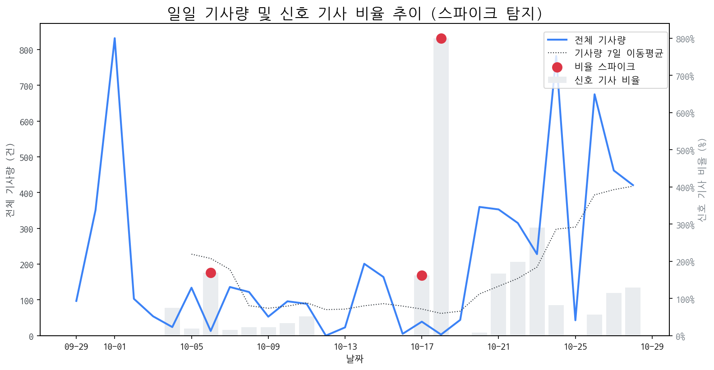

# 일간 상세 해설 리포트

Date: 2025-10-28 | Generated by Market Intelligence Team

## Executive Summary

오늘 시장에서 특이한 이상 징후는 관찰되지 않았으나, OLED 관련주가 두드러진 상승세를 보였습니다. 주요 경쟁사들은 2차 전지 관련 기술 투자, 신제품 출시, 대규모 수주, 규제 대응 등 활발한 움직임을 보이며 시장 경쟁이 심화되고 있습니다. 따라서 경영진은 OLED 시장 성장 가능성에 주목하고, 2차 전지 분야 경쟁사들의 동향을 면밀히 분석하여 전략적인 의사 결정을 내릴 필요가 있습니다. 특히, 경쟁사들의 투자 및 기술 개발 방향을 주시하며 자사의 경쟁 우위를 확보할 방안을 모색해야 할 것입니다.

## 1. 시장 활동량 및 이상 징후

> 최근 30일간의 기사량 변화와 금일 발생한 이상 급등(Spike) 현황 및 원인을 분석합니다.

> 금일 유의미한 스파이크는 포착되지 않았습니다.

### 1.5 오늘의 리스크 신호 (감성 급락)

> 토픽별 일일 감성 점수의 급락 패턴을 탐지하고 그 원인을 분석합니다.

> 금일 감성 급락으로 인한 리스크 신호는 포착되지 않았습니다.

### 2. 오늘의 급등 신호

> 전일 및 주간 평균 대비 언급량이 급증하고 모멘텀이 높은 신호를 분석합니다.

| 급등 신호   |   금일 언급량 |   전일 대비 증가 |   모멘텀 | 해설                                                                    |
|:--------|---------:|-----------:|------:|:----------------------------------------------------------------------|
| 올레드     |        7 |          7 |  2.41 | LG전자가 APEC 행사에서 올레드 TV를 활용한 샹들리에를 선보이며 기술력을 과시했기 때문입니다.               |
| tv      |       17 |         12 |  2.1  | 삼성 OLED TV 호평과 LG OLED TV 점유율 확대 등 국내 TV 기술력이 시장을 주도하며 관심이 집중되고 있습니다. |
| 현대차     |        6 |          4 |  1.86 | 삼성과의 협력, 로봇·수소차 등 미래 기술 공개, 엔비디아 협력 기대감 등이 복합적으로 작용한 결과입니다.           |
| 스마트폰    |        6 |          5 |  1.75 | 삼성의 폴더블폰 혁신(트라이폴드), AI 기술 강화 등 K-테크의 스마트폰 분야 선전 기대감 고조.               |

## 3. 경쟁사 주요 활동

> 금일 발생한 경쟁사의 주요 이벤트(신제품, 파트너십, 투자 등)를 추적합니다.

| date       | types                                      | title                                               | url                                                                                                                                                 |
|:-----------|:-------------------------------------------|:----------------------------------------------------|:----------------------------------------------------------------------------------------------------------------------------------------------------|
| 2025-10-28 | INVEST,LAUNCH,ORDER,REGUL                  | 2차전지 관련주, '봄꽃만개' 후성·민테크·나인테크,·엘앤에프·에코프...           | http://www.finomy.com/news/articleView.html?idxno=241784                                                                                            |
| 2025-10-28 | LAUNCH                                     | 두 번 접히는 갤럭시...‘트리폴드폰’ 실물 APEC서 첫 공개                 | https://www.dt.co.kr/article/12025675?ref=naver                                                                                                     |
| 2025-10-28 | LAUNCH                                     | K테크 경연장… APEC에서 뽐내는 첨단 기술                           | https://www.busan.com/view/busan/view.php?code=2025102818342487567                                                                                  |
| 2025-10-28 | LAUNCH                                     | 두 번 접는 폰부터 투명TV 샹들리에까지…APEC은 ‘K-테크’ 전시장             | https://www.hani.co.kr/arti/economy/economy_general/1225944.html                                                                                    |
| 2025-10-27 | INVEST                                     | [주식마감기사] 코스피 사상 첫 '4000대 돌파'... 메타랩스, 삼익제약, 에...    | https://www.ggilbo.com/news/articleView.html?idxno=1120441                                                                                          |
| 2025-10-28 | LAUNCH                                     | 두 번 접는 스마트폰·투명 TV…‘K-테크’ 총출동                        | https://www.ichannela.com/news/main/news_detailPage.do?publishId=000000498200                                                                       |
| 2025-10-28 | LAUNCH                                     | 삼성, 2번 접는 트라이폴드폰…현대차, 로봇·수소차 'K테크 과시'               | https://www.hankyung.com/article/2025102879411                                                                                                      |
| 2025-10-28 | LAUNCH,REGUL                               | '수능 D-15' 스마트워치 등 전자기기 반입 금지                        | https://www.inews365.com/news/article.html?no=891714                                                                                                |
| 2025-10-27 | INVEST,PARTNERSHIP                         | [기업분석_삼성 편 ④삼성디스플레이] 이청 대표, 가격 경쟁과 설비투자...          | http://www.newsworker.co.kr/news/articleView.html?idxno=399921                                                                                      |
| 2025-10-28 | INVEST,LAUNCH,ORDER                        | 유리기판 관련주, '함박웃음' 한빛레이저·나인테크·피아이이·켐트로...             | http://www.finomy.com/news/articleView.html?idxno=241769                                                                                            |
| 2025-10-28 | INVEST,LAUNCH                              | 트라이폴드폰·올레드 샹들리에 떴다…K테크 ‘기술 외교’                      | https://www.joongang.co.kr/article/25377495                                                                                                         |
| 2025-10-28 | CERT,INVEST,ORDER,PARTNERSHIP,REGUL        | 수소차 관련주, '덩실덩실' 두산퓨얼셀·범한퓨얼셀·한화솔루션... '시...          | http://www.finomy.com/news/articleView.html?idxno=241777                                                                                            |
| 2025-10-28 | INVEST,LAUNCH,ORDER                        | 예선테크, 돌연 14% 급등…'공시 無 급등주'에 투자자 촉각                  | https://www.pointdaily.co.kr/news/articleView.html?idxno=276517                                                                                     |
| 2025-10-28 | INVEST                                     | 예선테크 주가, 급등세... 왜?                                  | https://www.ggilbo.com/news/articleView.html?idxno=1120481                                                                                          |
| 2025-10-28 | INVEST,LAUNCH                              | "삼성 트라이폴드폰부터 SK HBM4까지"…글로벌 정상 맞는 경주, K-기술로...      | http://www.fnnews.com/news/202510281530036532                                                                                                       |
| 2025-10-28 | LAUNCH                                     | 두 번 접는 폰, 초대형 샹들리에…'K테크' 열기                         | https://news.sbs.co.kr/news/endPage.do?news_id=N1008309350&plink=ORI&cooper=NAVER                                                                   |
| 2025-10-27 | INVEST,LAUNCH                              | [공모주 현황] 이노테크 1일차 청약 종료, 균등·비례 경쟁률은?                | https://www.cbci.co.kr/news/articleView.html?idxno=537684                                                                                           |
| 2025-10-28 | CERT                                       | OLED TV 30% 돌파 전망, 삼성·LG '반전 기회'…中 추격 따돌리나          | https://www.news1.kr/industry/general-industry/5955130                                                                                              |
| 2025-10-28 | INVEST                                     | [fn이사람] " OLED  제조 AX 성공… 생산성·수율 다 잡아"              | http://www.fnnews.com/news/202510281825455574                                                                                                       |
| 2025-10-28 | INVEST                                     | [LG 변곡점]② 비핵심 접고 미래로, LG의 구조조정이 시작됐다                | http://www.press9.kr/news/articleView.html?idxno=68259                                                                                              |
| 2025-10-28 | INVEST,LAUNCH                              | 전자업계 3분기 실적시즌…삼성·SK하닉, 역대급 전망                       | https://www.newsis.com/view/NISX20251027_0003378664                                                                                                 |
| 2025-10-28 | LAUNCH                                     | 선상 호텔 등장한 영일만…글로벌 CEO 맞이에 분주한 경주                    | http://www.mbn.co.kr/pages/news/newsView.php?news_seq_no=5150411                                                                                    |
| 2025-10-28 | PARTNERSHIP                                | 성공 비결? ‘적자생존’… 최악은 ‘NATO’                           | https://www.chosun.com/economy/industry-company/2025/10/28/CGTRGXOPLNHSLGBXGVKKNL3Z4A/?utm_source=naver&utm_medium=referral&utm_campaign=naver-news |
| 2025-10-28 | CERT,INVEST,LAUNCH,REGUL                   | [영상] "세상에 없던 기술, 경주서 개봉"…놀라움 자아낸 삼성·현대차 ...         | https://zdnet.co.kr/view/?no=20251028221546                                                                                                         |
| 2025-10-28 | INVEST                                     | 보급형 OLED 30% 눈앞… 삼성·LG, 원가 절감·생산 혁신 '투트랙' 가속        | https://www.thepublic.kr/news/articleView.html?idxno=281369                                                                                         |
| 2025-10-28 | LAUNCH                                     | 아이폰 사랑에 힘입어?…패널·카메라 공급하는 LGD·LG이노텍 하반기 실...         | https://biz.heraldcorp.com/article/10603114?ref=naver                                                                                               |
| 2025-10-27 | CERT,LAUNCH,REGUL                          | 서울시교육청, 2026학년도 대학수학능력시험 세부 시행계획 발표                 | http://www.ftoday.co.kr/news/articleView.html?idxno=349727                                                                                          |
| 2025-10-27 | LAUNCH                                     | "내부 온도 균일하게"⋯LG전자, ‘디오스 오브제컬렉션 김치톡톡’ 신제...          | https://www.etoday.co.kr/news/view/2518591                                                                                                          |
| 2025-10-28 | INVEST,LAUNCH                              | [GAM]中 기술국산화 기대감, 자금유입 확대② '포토레지스트 테마 A주'           | https://www.newspim.com/news/view/20251027001175                                                                                                    |
| 2025-10-28 | CERT,INVEST,LAUNCH,ORDER,PARTNERSHIP,REGUL | 10월 5주 주요 제조업 전망                                    | https://www.laborplus.co.kr/news/articleView.html?idxno=36483                                                                                       |
| 2025-10-28 | LAUNCH                                     | 코스피 ‘불장’ 주역 반도체 대장주들, 3분기 실적 개봉박두                   | https://www.hani.co.kr/arti/economy/economy_general/1225893.html                                                                                    |
| 2025-10-28 | INVEST,PARTNERSHIP,REGUL                   | [중국 탐구 3] 지방에서도 세계 1등 전략 '클러스터+AI'로 세계 석권 야...      | http://www.hellodd.com/news/articleView.html?idxno=109671                                                                                           |
| 2025-10-28 | CERT                                       | 동국대, ‘D-ESG’ 경영으로 지속가능발전 대학 도약                      | https://www.donga.com/news/Society/article/all/20251028/132645092/2                                                                                 |
| 2025-10-28 | LAUNCH                                     | [경주 APEC] 두번 접는 폰부터 HBM-용접 로봇까지···삼성·SK·LG 'K-테크... | https://www.ajunews.com/view/20251028134000590                                                                                                      |
| 2025-10-28 | REGUL                                      | 충북교육청, D-16일 수능 수험생 유의사항 '설명회' 개최                   | https://www.ccreview.co.kr/news/articleView.html?idxno=337346                                                                                       |
| 2025-10-28 | INVEST,LAUNCH                              | [경주 APEC] K-예술, K-뷰티, K-테크..'한국 산업 박람회' 변모한 천년고...  | http://www.4th.kr/news/articleView.html?idxno=2098591                                                                                               |
| 2025-10-28 | INVEST                                     | 재계 '2026 경영전략' 새 판 짠다…'생존+성장+미래' 키워드                | https://www.ebn.co.kr/news/articleView.html?idxno=1683909                                                                                           |
| 2025-10-28 | INVEST,LAUNCH                              | [경주 APEC] 1700명 CEO 모인다 "글로벌 비즈니스 허브"               | https://www.econovill.com/news/articleView.html?idxno=716303                                                                                        |
| 2025-10-28 | INVEST,LAUNCH                              | 경주에 뜬 트라이폴드폰·올레드 샹들리에·HBM...전 세계에 K-테크 뽐낸...        | https://www.joongang.co.kr/article/25377421                                                                                                         |
| 2025-10-28 | LAUNCH                                     | ‘글로벌 큰손’ 잡아라… K-테크 쇼케이스장 된 경주                       | https://www.kmib.co.kr/article/view.asp?arcid=1761641760&code=11151400&cp=nv                                                                        |
| 2025-10-28 | INVEST,LAUNCH                              | 삼성 트라이폴드폰 첫선…LG는 ' OLED  샹들리에'                      | https://www.sedaily.com/NewsView/2GZCRI9Z9O                                                                                                         |
| 2025-10-28 | LAUNCH                                     | AI·OLED·친환경…2025년이 노트북 시장의 ‘가장 흥미로운 해’인 이유          | https://www.itworld.co.kr/article/4079912/ai·oled·친환경2025년이-노트북-시장의-가장-흥미로운-해.html                                                                  |
| 2025-10-28 | LAUNCH                                     | 별빛 내리는 LG전자 올레드 샹들리에…베일 벗은 삼성 '트라이폴드폰'              | https://www.ddaily.co.kr/page/view/2025102819484527493                                                                                              |
| 2025-10-28 | LAUNCH                                     | '세일즈 코리아' 시동...한국 미래 기술 한자리에                        | https://www.tbc.co.kr/news/view?pno=20251028162324AE01777&id=200319                                                                                 |
| 2025-10-28 | CERT,LAUNCH                                | [헬로즈업] 한국전자전·반도체대전 2025, 기술이 산업을 움직이다               | https://www.hellot.net/news/article.html?no=106610                                                                                                  |
| 2025-10-28 | INVEST                                     | ‘젠슨 황 입국출국’ 포항경주공항, 글로벌 CEO 맞이 준비 완료                | https://www.kbmaeil.com/article/20251028500383                                                                                                      |
| 2025-10-28 | CERT,INVEST,LAUNCH,ORDER,PARTNERSHIP,REGUL | [의료기기업계 소식] 10월 28일                                 | http://www.doctorstimes.com/news/articleView.html?idxno=235058                                                                                      |
| 2025-10-28 | LAUNCH                                     | [APEC 2025]“우리가 세계 1등”…K테크 쇼케이스                     | https://www.etnews.com/20251028000414                                                                                                               |
| 2025-10-28 | INVEST                                     | 트라이폴드 첫선에 “와”…경주 물들인 K테크 열기 [르포]                    | https://www.sedaily.com/NewsView/2GZCR8B283                                                                                                         |
| 2025-10-28 | LAUNCH                                     | 삼성, 트라이폴드폰 첫 공개 … APEC서 '폴더블 종주국' 기술력 과시            | https://biz.newdaily.co.kr/site/data/html/2025/10/28/2025102800317.html                                                                             |

### 4. 주요 기사

> 오늘의 핵심 이슈와 가장 관련성이 높은 기사 목록과 요약입니다.

### [[영상] "세상에 없던 기술, 경주서 개봉"…놀라움 자아낸 삼성·현대차 ...](https://zdnet.co.kr/view/?no=20251028221546)
> 로컬 요약 모델 실행 중 오류 발생: index out of range in self

---

### [[2025 APEC]'AI·반도체·스마트폰' 신기술의 대향연…경제효과 '10조'](https://www.newsway.co.kr/news/view?ud=2025102815014603634)
> 로컬 요약 모델 실행 중 오류 발생: index out of range in self

---

### [10월 5주 주요 제조업 전망](https://www.laborplus.co.kr/news/articleView.html?idxno=36483)
> 로컬 요약 모델 실행 중 오류 발생: index out of range in self

---

### 참고: 최근 30일 누적 강한 신호 Top 5

> 장기적 관점의 시장 핵심 키워드입니다.

| 누적 신호   |   30일 누적 언급량 |   현재 모멘텀 |
|:--------|-------------:|---------:|
| 삼성전자    |          358 |   -2.761 |
| oled    |          202 |   -0.224 |
| 애플      |          185 |   -0.672 |
| lg전자    |          132 |    0.592 |
| 디스플레이   |          122 |    0.823 |
