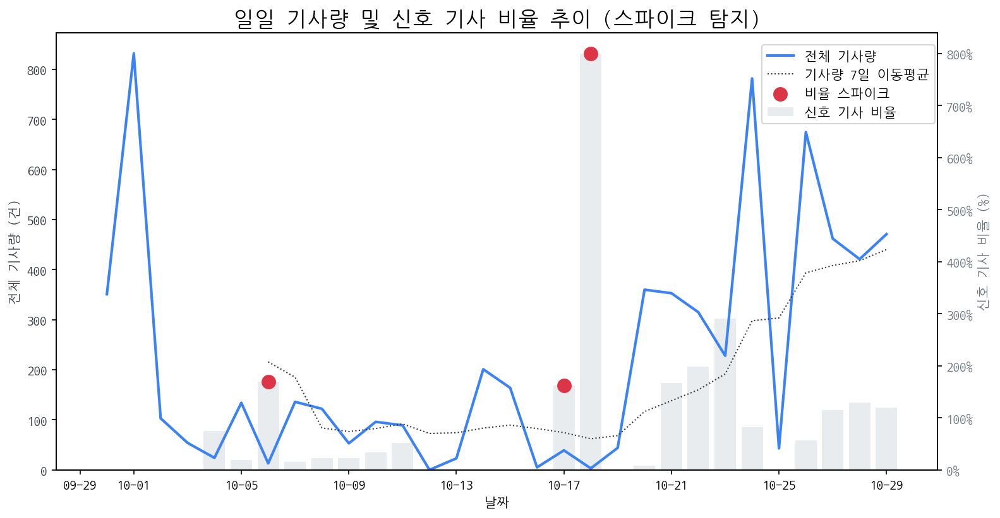

# 일간 상세 해설 리포트

Date: 2025-10-29 | Generated by Market Intelligence Team

## Executive Summary

오늘 시장은 특이사항 없이 안정적인 흐름을 보였습니다. 다만, 인텔 주가가 눈에 띄게 상승하며 시장의 관심을 집중시켰습니다. 한편, 주요 경쟁사인 크레아폼이 휴대용 3D 스캐너 라인업을 강화하며 시장 경쟁이 더욱 치열해질 것으로 예상됩니다. 따라서, 인텔 주가 상승 원인을 분석하고 크레아폼의 신제품 출시가 시장에 미칠 영향에 대한 면밀한 검토가 필요합니다.

## 1. 시장 활동량 및 이상 징후

> 최근 30일간의 기사량 변화와 금일 발생한 이상 급등(Spike) 현황 및 원인을 분석합니다.

> 금일 유의미한 스파이크는 포착되지 않았습니다.

### 1.5 오늘의 리스크 신호 (감성 급락)

> 토픽별 일일 감성 점수의 급락 패턴을 탐지하고 그 원인을 분석합니다.

> 금일 감성 급락으로 인한 리스크 신호는 포착되지 않았습니다.

### 2. 오늘의 급등 신호

> 전일 및 주간 평균 대비 언급량이 급증하고 모멘텀이 높은 신호를 분석합니다.

| 급등 신호   |   금일 언급량 |   전일 대비 증가 |   모멘텀 | 해설                                                     |
|:--------|---------:|-----------:|------:|:-------------------------------------------------------|
| 인텔      |       31 |         30 |  8.03 | 인텔, AI PC 체험 팝업 스토어 서울 오픈으로 시장 관심 급증.                  |
| 엔비디아    |       15 |          2 |  2.48 | AI 수요 폭발 속, 엔비디아가 사상 최초 시총 5조 달러를 돌파하며 시장을 견인했기 때문입니다. |
| 아마존     |        6 |          4 |  2.08 | 아마존의 한국 투자 확대 및 글로벌 시장 진출 가속화 기대감 고조.                  |
| 기아      |        4 |          4 |  1.95 | 기아가 PV5 일본 진출, 나달과의 우정, 디즈니 협업 등 긍정적 이슈로 주목받고 있습니다.    |

## 3. 경쟁사 주요 활동

> 금일 발생한 경쟁사의 주요 이벤트(신제품, 파트너십, 투자 등)를 추적합니다.

| date       | types                                | title                                                | url                                                                     |
|:-----------|:-------------------------------------|:-----------------------------------------------------|:------------------------------------------------------------------------|
| 2025-10-29 | LAUNCH                               | 크레아폼, 휴대용 3D 스캐너 라인업 강화... HandySCAN 3D|PRO 시리즈™... | https://www.itbiznews.com/news/articleView.html?idxno=185122            |
| 2025-10-29 | INVEST                               | 올해 中企 5만 곳 지원… 걸그룹 기획사에 제작비                          | https://www.donga.com/news/Economy/article/all/20251029/132654642/2     |
| 2025-10-29 | INVEST,LAUNCH                        | [R]APEC, 정상회의에 버금가는 경제 교류 '플랫폼'으로 주목                 | http://andongmbc.co.kr/adboard/NewsView78762                            |
| 2025-10-29 | INVEST,LAUNCH                        | LG디스플레이, 3분기 흑자전환 기대…3년 적자서 탈출하나                     | https://news.einfomax.co.kr/news/articleView.html?idxno=4380744         |
| 2025-10-29 | LAUNCH,PARTNERSHIP                   | [Opinion] 2025 프리즈 런던에서 미술계를 살펴보다 [미술/전시]            | https://www.artinsight.co.kr/news/view.php?no=78142                     |
| 2025-10-29 | INVEST,LAUNCH                        | APEC, 정상회의에 버금가는 경제 교류 '플랫폼'으로 주목                    | http://www.phmbc.co.kr/www/news/desk_news?idx=198359&mode=view          |
| 2025-10-29 | CERT                                 | 동국대, ‘D-ESG’ 경영으로 지속가능발전 대학 도약                       | https://www.donga.com/news/Society/article/all/20251028/132645092/2     |
| 2025-10-29 | LAUNCH                               | 11번가 '2025 그랜드십일절'...1000만개 특가 상품 준비                 | https://www.startuptoday.co.kr/news/articleView.html?idxno=531255       |
| 2025-10-29 | LAUNCH                               | 서린씨앤아이, 일체형 수랭 쿨러 리안리 하이드로시프트 II  LCD -C 360 6종 ...  | http://www.technoa.co.kr/news/articleView.html?idxno=100027             |
| 2025-10-29 | CERT                                 | 10000mAh 배터리폰 '아너 파워2' 중국서 3C 인증 통과                  | https://kbench.com/?q=node/272667                                       |
| 2025-10-28 | CERT,INVEST,ORDER,PARTNERSHIP,REGUL  | 수소차 관련주, '덩실덩실' 두산퓨얼셀·범한퓨얼셀·한화솔루션... '시...           | http://www.finomy.com/news/articleView.html?idxno=241777                |
| 2025-10-29 | LAUNCH                               | "애플, OLED 시대 선도한다…내년 아이패드 미니부터"                      | https://zdnet.co.kr/view/?no=20251029083407                             |
| 2025-10-29 | LAUNCH                               | 특가 상품 1000만개 쏟아진다...11번가, '2025 그랜드십일절' 개막           | https://www.mt.co.kr/living/2025/10/29/2025102915423244487              |
| 2025-10-29 | INVEST,LAUNCH,REGUL                  | 한국 대기업 30년 지도 : IMF 칼바람에서 AI 초격차까지                   | https://magazine.hankyung.com/business/article/202510225935b            |
| 2025-10-29 | LAUNCH                               | [APEC 2025] 두 번 접는 폰부터 로봇·수소차까지…경주 달군 'K-테크', 첨...   | http://www.paxetv.com/news/articleView.html?idxno=250414                |
| 2025-10-29 | LAUNCH                               | 크레아폼, 휴대용 3D 스캐너 라인업 강화…HandySCAN 3D|PRO 시리즈™ 출...   | https://www.etnews.com/20251029000172                                   |
| 2025-10-29 | INVEST,LAUNCH                        | [사설] K테크 경연장 된 경주 APEC, 기업이 곧 국력이다                   | https://www.hankyung.com/article/2025102908721                          |
| 2025-10-29 | CERT,INVEST,LAUNCH,ORDER,PARTNERSHIP | 통신장비 관련주, '훨훨 날아올라' 빛과전자·이노인스트루먼트·기가레...             | http://www.finomy.com/news/articleView.html?idxno=241888                |
| 2025-10-29 | INVEST,LAUNCH                        | 블룸버그 "애플 맥북과 아이패드 올레드로 전환 검토", 가격 상승 불가...           | https://www.businesspost.co.kr/BP?command=article_view&num=417484       |
| 2025-10-29 | REGUL                                | 전장 디스플레이 출하량 5% 증가…클러스터 두 자릿수 성장세                    | https://www.itbiznews.com/news/articleView.html?idxno=185035            |
| 2025-10-29 | LAUNCH                               | 삼성전자·SK하이닉스·LG전자, APEC서 첨단 기술 공개                     | http://www.wsobi.com/news/articleView.html?idxno=294054                 |
| 2025-10-29 | INVEST,LAUNCH,PARTNERSHIP            | 경주에서 피어나는 미래 산업 지도…재계 총수들 전략 살펴보니                    | http://www.sisaon.co.kr/news/articleView.html?idxno=176880              |
| 2025-10-29 | CERT,INVEST,LAUNCH                   | [Who Is ?] 옥경석 도우인시스 대표이사                            | https://www.businesspost.co.kr/BP?command=article_view&num=417399       |
| 2025-10-29 | LAUNCH                               | 차세대 맥북·아이패드 ‘OLED 탑재’ 전망…아이패드 미니 가격 오를까...           | http://www.edaily.co.kr/news/newspath.asp?newsid=03240646642337840      |
| 2025-10-29 | INVEST,REGUL                         | [단독] ‘집단해고’ 옵티칼 본사, 1년간 버티다 이제서야 ‘한국 분쟁...           | https://www.khan.co.kr/article/202510291717001                          |
| 2025-10-29 | LAUNCH                               | 크레아폼, 휴대용 3D 스캐너 라인업 강화... HandySCAN 3D|PRO 시리즈™ ... | https://www.etoday.co.kr/news/view/2519531                              |
| 2025-10-29 | LAUNCH                               | 삼성전자, 두 번접는 '트리폴드폰' 출시 임박…MX 왕좌 노리나                  | http://www.srtimes.kr/news/articleView.html?idxno=188509                |
| 2025-10-29 | INVEST,LAUNCH,PARTNERSHIP            | APEC 빛내는 韓 기업들 … 삼성·SK·현대차·LG 최첨단 기술 총출동 [20...      | https://biz.newdaily.co.kr/site/data/html/2025/10/29/2025102900132.html |
| 2025-10-29 | LAUNCH                               | "두 번 접는 폰 보자" 북적… K뷰티관에선 '한국의 美' 체험 [경주 APEC]        | http://www.fnnews.com/news/202510291813574395                           |
| 2025-10-29 | CERT,INVEST,LAUNCH,ORDER,PARTNERSHIP | 반도체 장비 관련주, '껑충껑충' 유니테스트·기가레인·엑시콘... '주르...          | http://www.finomy.com/news/articleView.html?idxno=241899                |
| 2025-10-29 | INVEST,LAUNCH                        | [머닝(Money-Ing)] 4년 만에 적자탈출 LG디스플레이 3분기 실적 기대해라...    | https://news.mtn.co.kr/news-detail/2025102911375511177                  |
| 2025-10-29 | INVEST,LAUNCH,ORDER,REGUL            | 2차전지 관련주, '봄꽃만개' 후성·민테크·나인테크,·엘앤에프·에코프...            | http://www.finomy.com/news/articleView.html?idxno=241784                |
| 2025-10-29 | INVEST,PARTNERSHIP,REGUL             | HD현대에너지솔루션 미국서 흑자 전환, 박종환 차세대 태양광 기술 더해...           | https://www.businesspost.co.kr/BP?command=article_view&num=417540       |
| 2025-10-29 | CERT,INVEST,ORDER,PARTNERSHIP        | 로봇·산업용·협동로봇 관련주, '덩실덩실' 티로보틱스·삼현·클로봇·...             | http://www.finomy.com/news/articleView.html?idxno=241897                |
| 2025-10-29 | INVEST                               | K디스플레이의 문제, 기술 리더십의 부재 [아침을 열며]                      | https://www.hankookilbo.com/News/Read/A2025102810490001049?did=NA       |
| 2025-10-29 | LAUNCH                               | 한켐, 이상조 대표이사 '화학경영자상' 수상                             | http://www.newstown.co.kr/news/articleView.html?idxno=665583            |
| 2025-10-29 | LAUNCH                               | 11번가, 연중 최대 쇼핑축제 '2025 그랜드십일절' 개최                    | http://www.thefirstmedia.net/news/articleView.html?idxno=184370         |
| 2025-10-29 | INVEST,LAUNCH,REGUL                  | [뷰티디바이스②/기술력]"첨단 기술로 피부에 완벽을 더한다"                    | https://www.businessplus.kr/news/articleView.html?idxno=100331          |
| 2025-10-29 | LAUNCH                               | 스마트 팩토리의 눈… 디아이티, 딥러닝 비전검사로 산업혁신 주도                  | https://www.pinpointnews.co.kr/news/articleView.html?idxno=389642       |
| 2025-10-29 | CERT,INVEST,LAUNCH                   | BOE 진입에도...삼성D·LGD, 아이폰17  OLED  패널 공급망 주도           | http://www.metroseoul.co.kr/article/20251029500458                      |
| 2025-10-28 | INVEST,PARTNERSHIP,REGUL             | [중국 탐구 3] 지방에서도 세계 1등 전략 '클러스터+AI'로 세계 석권 야...       | http://www.hellodd.com/news/articleView.html?idxno=109671               |
| 2025-10-29 | LAUNCH,PARTNERSHIP                   | 크레아폼, 휴대용 3D 스캐너 라인업 강화···HandySCAN 3D|PRO 시리즈™...   | https://www.enetnews.co.kr/news/articleView.html?idxno=43510            |
| 2025-10-29 | LAUNCH                               | [경주 APEC] 엑스포대공원, 일반인 위한 볼거리 등 풍성                    | http://www.fnnews.com/news/202510290930539740                           |
| 2025-10-29 | INVEST,LAUNCH                        | LG그룹, 2026 정기 인사 앞두고 계열사 리더십 변화에 촉각...구광모 회...       | http://www.lkp.news/news/articleView.html?idxno=70958                   |
| 2025-10-29 | LAUNCH,REGUL                         | [오늘의 장바구니] 롯데마트·이마트24·LF·이랜드월드·교원그룹 외                | http://www.newsprime.co.kr/news/article.html?no=709461                  |
| 2025-10-29 | INVEST,LAUNCH                        | 트라이폴드폰·올레드 샹들리에 떴다…K테크 ‘기술 외교’                       | https://www.joongang.co.kr/article/25377495                             |
| 2025-10-28 | CERT,INVEST,LAUNCH,REGUL             | [영상] "세상에 없던 기술, 경주서 개봉"…놀라움 자아낸 삼성·현대차 ...          | https://zdnet.co.kr/view/?no=20251028221546                             |
| 2025-10-28 | INVEST,LAUNCH                        | "삼성 트라이폴드폰부터 SK HBM4까지"…글로벌 정상 맞는 경주, K-기술로...       | http://www.fnnews.com/news/202510281530036532                           |
| 2025-10-28 | INVEST,LAUNCH                        | 삼성 트라이폴드폰 첫선…LG는 'OLED 샹들리에'                         | https://www.sedaily.com/NewsView/2GZCRI9Z9O                             |
| 2025-10-28 | INVEST,LAUNCH                        | [경주 APEC] K-예술, K-뷰티, K-테크..'한국 산업 박람회' 변모한 천년고...   | http://www.4th.kr/news/articleView.html?idxno=2098591                   |

### 4. 주요 기사

> 오늘의 핵심 이슈와 가장 관련성이 높은 기사 목록과 요약입니다.

### [자율주행차 관련주, '봄날의 햇살' 에이스테크·삼현·라이콤·켐트로닉...](http://www.finomy.com/news/articleView.html?idxno=241896)
> 로컬 요약 모델 실행 중 오류 발생: index out of range in self

---

### [10월 5주 주요 제조업 전망](https://www.laborplus.co.kr/news/articleView.html?idxno=36483)
> 로컬 요약 모델 실행 중 오류 발생: index out of range in self

---

### [[APEC 2025]“우리가 세계 1등”…K테크 쇼케이스](https://www.etnews.com/20251028000414)
> 28일 경주 엑스포공원 내 야외 전시장에 위치한 약 500평 규모 에어돔에 마련된 K테크 쇼케이스 현장은 각 국 정상과 글로벌 기업 최고경영자를 맞이하기 위한 준비를 완료했다.

---

### 참고: 최근 30일 누적 강한 신호 Top 5

> 장기적 관점의 시장 핵심 키워드입니다.

| 누적 신호   |   30일 누적 언급량 |   현재 모멘텀 |
|:--------|-------------:|---------:|
| 삼성전자    |          367 |   -0.991 |
| oled    |          200 |   -1.442 |
| 애플      |          189 |   -1.039 |
| lg전자    |          137 |   -0.329 |
| 디스플레이   |          129 |    0.627 |
