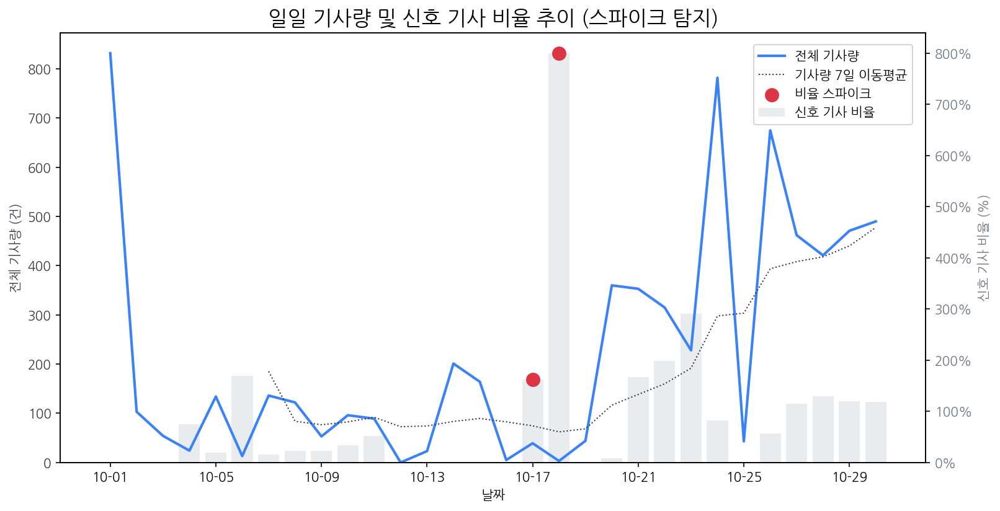

# 일간 상세 해설 리포트

Date: 2025-10-30 | Generated by Market Intelligence Team

## Executive Summary

오늘 시장은 특이사항 없이 안정적인 흐름을 보였으나, LG디스플레이의 주가 급등이 두드러졌습니다. 이는 경쟁사인 삼성전자의 3분기 역대 최대 실적 발표와 대비되며, 디스플레이 시장 내 경쟁 심화 및 LG디스플레이의 특정 사업 부문에 대한 기대 심리를 반영한 것으로 분석됩니다. 따라서 경영진은 삼성전자의 실적 발표가 LG디스플레이에 미치는 단기적/장기적 영향과, 급등 원인을 면밀히 분석하여 향후 전략 수립에 참고해야 할 것입니다. 특히, 경쟁사 이벤트가 LG디스플레이의 주가에 미치는 변동성을 주시하며, 관련 시장 동향을 지속적으로 모니터링해야 합니다.

## 1. 시장 활동량 및 이상 징후

> 최근 30일간의 기사량 변화와 금일 발생한 이상 급등(Spike) 현황 및 원인을 분석합니다.

> 금일 유의미한 스파이크는 포착되지 않았습니다.

### 1.5 오늘의 리스크 신호 (감성 급락)

> 토픽별 일일 감성 점수의 급락 패턴을 탐지하고 그 원인을 분석합니다.

> 금일 감성 급락으로 인한 리스크 신호는 포착되지 않았습니다.

### 2. 오늘의 급등 신호

> 전일 및 주간 평균 대비 언급량이 급증하고 모멘텀이 높은 신호를 분석합니다.

| 급등 신호   |   금일 언급량 |   전일 대비 증가 |   모멘텀 | 해설                                                                     |
|:--------|---------:|-----------:|------:|:-----------------------------------------------------------------------|
| lg디스플레이 |       30 |         26 |  6.96 | LG디스플레이, 3분기 흑자 전환 및 연간 흑자 전환 기대감 고조.                                  |
| 삼성전자    |       56 |         39 |  4.23 | 삼성전자가 역대 최대 분기 매출과 깜짝 영업이익을 기록하며 시장 기대치를 상회했기 때문입니다.                   |
| lg화학    |       10 |         10 |  3.45 | LG화학, 독일 자이스와 '포토폴리머 필름' 사업 협력 계약 체결 (HWD용)                            |
| amd     |        9 |          9 |  2.57 | 펄어비스 '붉은사막' 게임 체험 팝업 스토어에서 AMD 고성능 PC를 사용하며 화제성 급증.                    |
| 엔비디아    |       17 |          2 |  2.1  | 삼성전자의 HBM3E가 엔비디아에 납품되며, 반도체 부활 기대감을 높여 '엔비디아' 키워드가 급증했습니다.            |
| 공급망     |        6 |          5 |  1.97 | 최윤범 회장의 전략광물 공급망 구축 노력과 삼성/LGD의 아이폰 패널 공급망 주도가 '공급망' 키워드 급증의 핵심 이유입니다. |
| 메타      |        5 |          4 |  1.63 | 메타 실적 쇼크 및 주가 폭락, 미 증시 전반 하락에 영향을 주며 투자 심리 위축.                         |

## 3. 경쟁사 주요 활동

> 금일 발생한 경쟁사의 주요 이벤트(신제품, 파트너십, 투자 등)를 추적합니다.

| date       | types                                | title                                            | url                                                                        |
|:-----------|:-------------------------------------|:-------------------------------------------------|:---------------------------------------------------------------------------|
| 2025-10-30 | INVEST,LAUNCH,ORDER                  | 삼성전자, 3Q 매출 86.1조·영업익 12.2조…역대 최대                | https://www.widedaily.com/news/articleView.html?idxno=281575               |
| 2025-10-30 | INVEST,LAUNCH,ORDER                  | 삼성전자, 3분기 86.1조원..역대 최대 분기 매출                    | https://www.kdpress.co.kr/news/articleView.html?idxno=200322               |
| 2025-10-30 | INVEST,LAUNCH,ORDER                  | 삼성전자 3분기 영업익 12조1661억원…전년比 32.5%↑                | https://www.starnewskorea.com/business-life/2025/10/30/2025103012325510821 |
| 2025-10-30 | INVEST,LAUNCH,ORDER                  | 삼성전자, 3분기 영업익 12.2조 '깜짝 실적'…HBM3E 엔비디아 공급 공식...  | https://www.mstoday.co.kr/news/articleView.html?idxno=99277                |
| 2025-10-30 | LAUNCH,ORDER                         | 삼성전자 12조 벌었다, 역대급 실적…반도체만 '7조'                   | http://www.shinailbo.co.kr/news/articleView.html?idxno=2137968             |
| 2025-10-30 | CERT,INVEST,LAUNCH,ORDER,PARTNERSHIP | 반도체 재료·부품 관련주, '신바람난' 하나마이크론·에스에이엠티·샘...         | http://www.finomy.com/news/articleView.html?idxno=241999                   |
| 2025-10-30 | INVEST,LAUNCH                        | "HBM3E 엔디비아 납품 공식화"...삼성전자 3분기 영업익 12조2천억        | http://www.dynews.co.kr/news/articleView.html?idxno=825627                 |
| 2025-10-30 | LAUNCH                               | [재계는 지금] '삼성 인터넷 PC 브라우저' 베타 공개 外                | https://dealsite.co.kr/articles/150524                                     |
| 2025-10-30 | LAUNCH,ORDER,REGUL                   | 제조업 정체·건설 부진…엇갈린 충청권 경기                          | https://www.daejonilbo.com/news/articleView.html?idxno=2235863             |
| 2025-10-30 | LAUNCH                               | 중국 추격에도 견고한 'K-OLED' 경쟁력…애플도 돕는다                 | https://www.joongang.co.kr/article/25378191                                |
| 2025-10-30 | INVEST,LAUNCH,ORDER                  | "흑자 보인다" 삼성 파운드리, 선단 공정 양산 능력 증명                 | https://www.digitaltoday.co.kr/news/articleView.html?idxno=601152          |
| 2025-10-30 | INVEST,LAUNCH,ORDER                  | 삼성전자, 3분기 역대 최대 매출 86.1조                         | http://www.ttlnews.com/news/articleView.html?idxno=3043625                 |
| 2025-10-30 | CERT,INVEST,LAUNCH,ORDER             | 삼성전자, 3분기 영업익 12조… 내년 HBM3E 물량도 '완판' 조짐(종합)      | https://www.moneys.co.kr/article/2025103012582126126                       |
| 2025-10-30 | PARTNERSHIP                          | LG전자, 국립현대미술관서 콘서트 개최…"고객 경험 확장"                 | https://www.thepublic.kr/news/articleView.html?idxno=281699                |
| 2025-10-30 | INVEST,LAUNCH,ORDER                  | 삼성전자, 3분기 DS·DX·하만 매출·영업익↑...4분기 AI 시장서 성장 기...  | http://www.consumernews.co.kr/news/articleView.html?idxno=743034           |
| 2025-10-30 | INVEST,LAUNCH,REGUL                  | '해킹 후폭풍' SKT 사상 첫 분기 적자                          | https://www.mk.co.kr/article/11456024                                      |
| 2025-10-30 | INVEST,LAUNCH,ORDER                  | 삼성전자, 3분기 매출 86.1조, 영업익 12.2조...분기매출 역대 최대       | https://www.m-economynews.com/news/article.html?no=61255                   |
| 2025-10-30 | INVEST,LAUNCH,ORDER                  | 삼성전자, 2025년 3분기  매출 86.1 조원, 영업이익 12.2조원… 역대 최대  | https://www.discoverynews.kr/news/articleView.html?idxno=1076910           |
| 2025-10-30 | INVEST,LAUNCH,ORDER                  | “십만전자에 부스터 달아주나”…삼성전자 반도체서만 영업익 7조               | https://www.mk.co.kr/article/11456146                                      |
| 2025-10-30 | INVEST,LAUNCH                        | LG디스플레이, 3분기 영업익 4310억원…“연간 턴어라운드 가시권”           | https://www.ceoscoredaily.com/page/view/2025103017262746752                |
| 2025-10-30 | LAUNCH,ORDER                         | [컨콜]엔비디아 뚫은 삼성전자, 3분기 반도체 부활에 실적 '훨훨'(종합)        | https://www.g-enews.com/view.php?ud=202510301243141646ed0c62d49_1          |
| 2025-10-30 | LAUNCH                               | LGD, "내년 W- OLED  출하량 목표 700만대 초반"...올해보다 10%↑   | http://www.thelec.kr/news/articleView.html?idxno=43036                     |
| 2025-10-30 | CERT,INVEST,LAUNCH,ORDER             | 삼성전자 2025년 3분기 실적발표 컨퍼런스콜 전문                     | http://www.thelec.kr/news/articleView.html?idxno=42996                     |
| 2025-10-30 | INVEST,LAUNCH                        | '갤Z폴드7' 흥행의 힘…모바일·디스플레이도 날았다                     | https://www.sedaily.com/NewsView/2GZDOOE8BK                                |
| 2025-10-30 | INVEST,LAUNCH                        | LG디스플레이, 3분기 영업이익 4310억원...흑자전환 전망               | http://www.finomy.com/news/articleView.html?idxno=241996                   |
| 2025-10-30 | INVEST                               | 삼성전자, 사상 최대 분기 실적…'AI 풀스택' 전략으로 호실적 잇는다          | https://www.asiatoday.co.kr/view.php?key=20251030010013316                 |
| 2025-10-30 | CERT,INVEST,LAUNCH,REGUL             | 삼성전자, 3분기 '역대 최대 매출'…HBM3E 전면 확대·HBM4 샘플 전 고객... | https://www.straightnews.co.kr/news/articleView.html?idxno=285200          |
| 2025-10-30 | INVEST,LAUNCH                        | 삼성전자, 3분기 매출 86.1조원…역대 최대 분기 '매출' 달성             | https://www.100ssd.co.kr/news/articleView.html?idxno=202293                |
| 2025-10-30 | INVEST,LAUNCH                        | 삼성전자, 내년 HBM 물량 고객 확보...AI 특수에 반도체 호조 지속         | http://www.metroseoul.co.kr/article/20251030500534                         |
| 2025-10-30 | INVEST,LAUNCH                        | LG디스플레이, 3분기 영업익 4310억... 연간 흑자전환 가시화            | http://www.sisacast.kr/news/articleView.html?idxno=84703                   |
| 2025-10-30 | INVEST                               | "곧 반도체·車·방산시장 안개 걷힌다"... 소부장 기업들 공장 증설 드...      | http://www.fnnews.com/news/202510301828152036                              |
| 2025-10-30 | LAUNCH,ORDER                         | 삼성전자, 3분기 영업이익 12.2조 '역대 최대 매출'…"DS와 DX 양쪽에서 ... | https://www.s-journal.co.kr/news/articleView.html?idxno=35076              |
| 2025-10-30 | INVEST,LAUNCH                        | LG디스플레이, 3분기 영업이익 4310억⋯4년 만에 흑자 전환 가시화          | https://www.viva100.com/article/20251030501241                             |
| 2025-10-30 | INVEST,LAUNCH                        | 삼성전자, AI 수혜 '본격화'…HBM 판매 더 커진다                   | https://www.widedaily.com/news/articleView.html?idxno=281585               |
| 2025-10-30 | INVEST,LAUNCH,ORDER                  | 삼성전자, 올해 3분기 실적 발표… 영업이익 12조2000억원               | https://www.siminilbo.co.kr/news/newsview.php?ncode=1160297530982212       |
| 2025-10-30 | LAUNCH,ORDER                         | 삼성전자, 3분기 영업이익 12.2조                             | https://www.idaegu.co.kr/news/articleView.html?idxno=528114                |
| 2025-10-30 | INVEST,LAUNCH,ORDER                  | '역대 최대' 삼성전자 3분기 매출 86.1조...영업익 12.2조 '날아올랐다'    | https://www.theguru.co.kr/news/article.html?no=93646                       |
| 2025-10-30 | INVEST,LAUNCH                        | 삼성전자,3Q 영업익 12조1661억원…전년比 32.5%↑                 | https://www.e-science.co.kr/news/articleView.html?idxno=114720             |
| 2025-10-30 | INVEST,LAUNCH,ORDER                  | JY 취임 3년 만에 '신기록'…삼성전자, 영업익 '12조 클럽' 달성(종합)      | https://www.newsway.co.kr/news/view?ud=2025103013155449454                 |
| 2025-10-30 | INVEST,LAUNCH                        | [DD퇴근길] 카톡 업데이트·사법리스크…'카카오 대표 연임' 변수로            | https://www.ddaily.co.kr/page/view/2025103017063219631                     |
| 2025-10-30 | CERT,INVEST,ORDER,PARTNERSHIP,REGUL  | 자동차부품 관련주, '웃음꽃' 디젠스·세동·한일단조·SJG세종... '한숨...     | http://www.finomy.com/news/articleView.html?idxno=241990                   |
| 2025-10-30 | LAUNCH                               | 삼성·LG 디스플레이,  OLED 가 매출 구원투수                     | https://www.joongang.co.kr/article/25378297                                |
| 2025-10-30 | INVEST,LAUNCH                        | LG디스플레이, 3분기 영업익 4310억원···OLED 체질 개선 효과 본격화      | https://www.smartfn.co.kr/news/articleView.html?idxno=124401               |
| 2025-10-30 | INVEST,REGUL                         | [APEC 경주]"APEC 열려도 우린 일터로 못 돌아가"…경주서 일본기업 '니...  | https://www.asiatoday.co.kr/view.php?key=20251030010013503                 |
| 2025-10-30 | INVEST                               | LG디스플레이, 3Q 영업이익 4310억… OLED  매출 비중 65%로 사상 최대   | https://www.nspna.com/news/?mode=view&newsid=784498                        |
| 2025-10-30 | INVEST,LAUNCH,PARTNERSHIP            | LG디스플레이 2025년 3분기 실적발표 컨퍼런스콜 전문                  | http://www.thelec.kr/news/articleView.html?idxno=43033                     |
| 2025-10-30 | INVEST,LAUNCH,ORDER                  | 삼성전자 3분기 실적, 역대 최대 분기 매출 기록...86.1 조원            | https://www.thefairnews.co.kr/news/articleView.html?idxno=59301            |
| 2025-10-30 | INVEST,LAUNCH,ORDER                  | 반도체·모바일 쌍끌이…삼성전자, 3분기 영업이익 12.2조                 | https://www.koit.co.kr/news/articleView.html?idxno=203132                  |
| 2025-10-30 | INVEST,LAUNCH,ORDER                  | "반도체·갤럭시 업고 10조 클럽 귀환" 삼성전자 3Q 영업익 12조 돌파 (종...  | https://www.dailian.co.kr/news/view/1566289/?sc=Naver                      |
| 2025-10-30 | LAUNCH,ORDER,REGUL                   | 충청권 3분기 건설경기는 여전히 '얼음'                           | https://www.joongdo.co.kr/web/view.php?key=20251030010009409               |

### 4. 주요 기사

> 오늘의 핵심 이슈와 가장 관련성이 높은 기사 목록과 요약입니다.

### ["진짜 승부는 HBM4"...'내년 완판' 삼성 반도체, 엔비디아 문도 열었다](https://www.hankookilbo.com/News/Read/A2025103015300005728?did=NA)
> SK하이닉스에 시장을 내줬던 고대역폭메모리(HBM) 5세대 제품(HBM3E)을 마침내 엔비디아에 납품하고 내년 HBM 물량은 사실상 완판돼 증산을 검토할 정도로 기술 경쟁력을 완전히 회복한 삼성 반도체의 거침없는 질주로 SK하이닉스가 한발 앞서간 차세대 HBM(HBM(HBM4) 시장은 불꽃 튀는 한판 승부가 펼쳐질 전망이다.

---

### [삼성전자, 반도체 부활에 깜짝실적…HBM4로 왕좌 탈환 노린다](https://it.chosun.com/news/articleView.html?idxno=2023092149939)
> HBM3E 판매 확대와 HBM4 샘플 출하가 맞물리며 AI 반도체 시장 주도권을 되찾은 삼성전자는 올해 3분기 연결 기준 매출 86조617억원, 영업이익 12조1661억원을 기록했다고 30일 밝혔다.

---

### [‘반도체 부활’  삼성 전자, 내년 HBM4로 ‘대반격’](https://www.ekn.kr/web/view.php?key=20251030025381724)
> 삼성전자는 30일 3분기 매출 86조1000억원, 영업이익 12조2000억원을 기록했다고 공시했다. 삼성전자는 30일 올해 3분기 매출 86조1000억원, 영업이익 12조2000억원을 기록했다고 공시했다. 삼성전자는 30일 올해 3분기 매출 86조1000억원, 영업이익 12조2000억원을 기록했다고 공시했다.

---

### 참고: 최근 30일 누적 강한 신호 Top 5

> 장기적 관점의 시장 핵심 키워드입니다.

| 누적 신호   |   30일 누적 언급량 |   현재 모멘텀 |
|:--------|-------------:|---------:|
| 삼성전자    |          404 |    4.229 |
| oled    |          196 |    0.065 |
| 애플      |          193 |   -1.066 |
| lg전자    |          138 |   -0.329 |
| 디스플레이   |          109 |   -0.801 |
