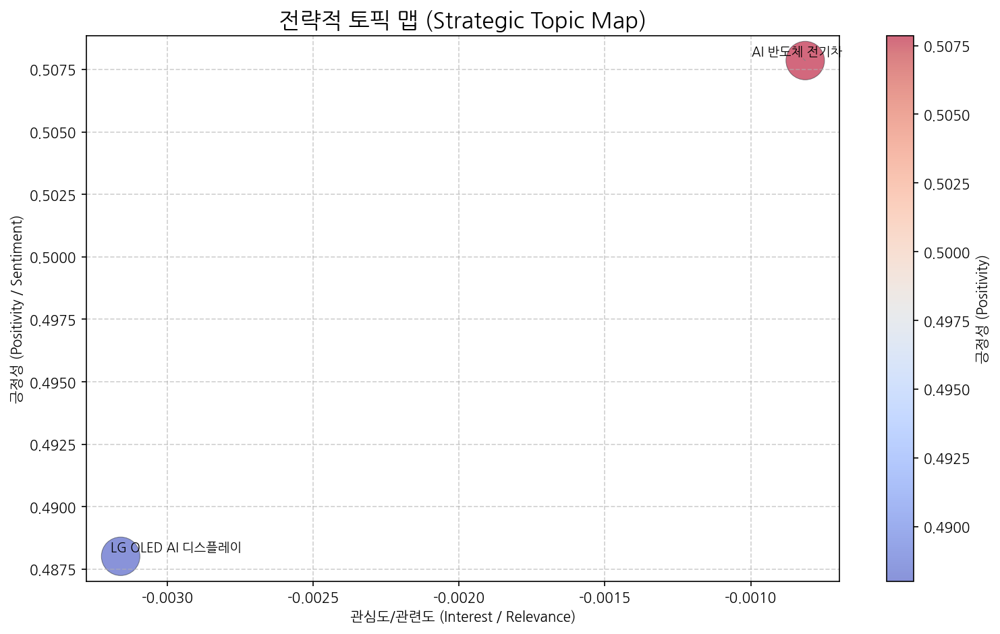
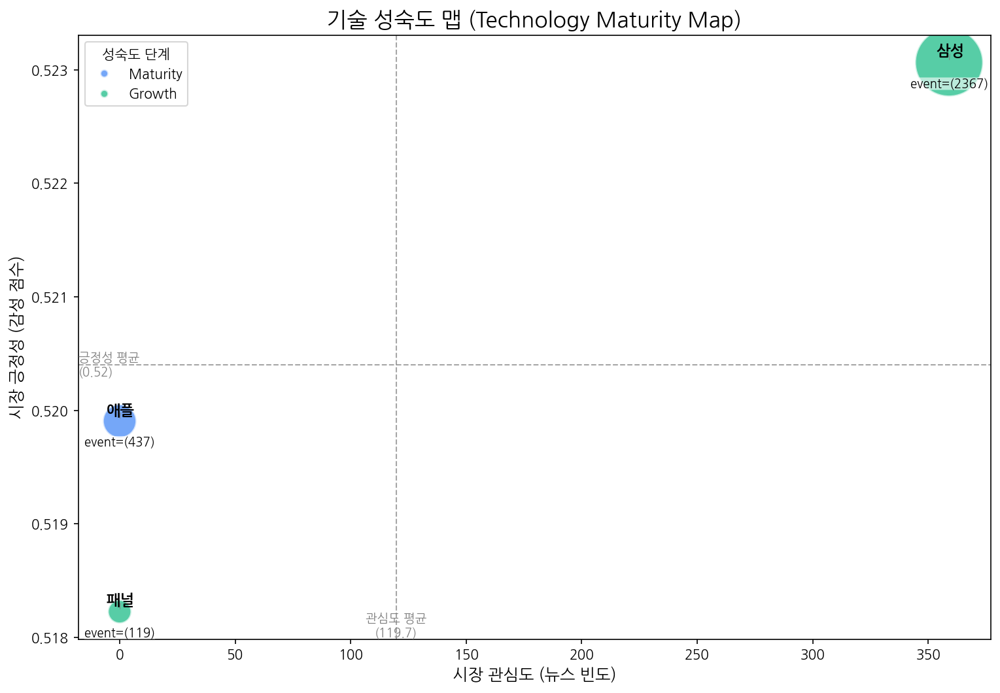
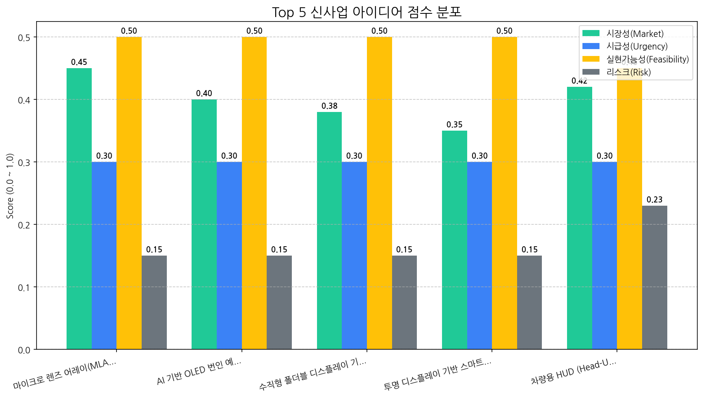

# Monthly Strategic Review (2025-09-20 ~ 2025-10-19)

## 1. 전략적 시장 포지셔닝 맵

| 토픽명              | 요약                                                                                | 핵심 키워드          |
|:-----------------|:----------------------------------------------------------------------------------|:----------------|
| AI 반도체 전기차       | AI 기술 발전을 위한 반도체 산업과 전기차 판매 동향을 프랑스어 키워드(de, ai, la, et, des, les)와 함께 다루는 뉴스입니다. | de, ai, la      |
| LG OLED AI 디스플레이 | LG전자의 OLED 디스플레이 기술과 AI 기술을 결합한 사업 및 관련 기술 동향 분석.                                 | oled, 디스플레이, 기술 |

## 2. 기술 수명 주기 및 R&D 투자 타이밍 분석

| 기술   | 단계       | 판단 근거                                                                        |
|:-----|:---------|:-----------------------------------------------------------------------------|
| 애플   | Maturity | 뉴스 언급 빈도가 낮고 출시 이벤트가 투자 이벤트보다 압도적으로 많은 것으로 보아 시장 성숙기에 접어들었다고 판단됩니다.          |
| 삼성   | Growth   | 높은 출시 건수와 투자 건수는 시장 성장기에 나타나는 특징이며, 뉴스 언급 빈도와 시장 감성 점수가 중간 수준인 점도 이를 뒷받침합니다. |
| 패널   | Growth   | 출시 건수가 투자 및 수주 건수보다 월등히 높아 시장 성장 단계에 진입한 것으로 판단됩니다.                          |

## 3. 경쟁사 전략적 의도 및 파트너 관계망 분석

### 기업별 토픽 집중도 (상위 5개사)
- (데이터 없음)

## 4. 전략적 리스크 관리 및 완화 액션 제안

- (데이터 없음)

## 5. 데이터 기반 신사업 아이디어 및 초기 검증

| 아이디어                                    | 가치 제안                                                                                              |   총점 |
|:----------------------------------------|:---------------------------------------------------------------------------------------------------|-----:|
| 마이크로 렌즈 어레이(MLA) 기반 초고해상도 VR/AR 디스플레이   | 기존 VR/AR 디스플레이 대비 4배 높은 해상도 제공, 넓은 시야각 확보, 렌즈 왜곡 최소화, 초경량 디자인, 저전력 소비                              |  3.5 |
| AI 기반 OLED 번인 예측 및 보상 알고리즘              | OLED 디스플레이 수명 30% 연장, 번인 발생 가능성 사전 예측, 실시간 보상 알고리즘 적용, 화질 저하 최소화, 사용자 맞춤형 번인 관리 기능 제공              |  3.3 |
| 수직형 폴더블 디스플레이 기반 스마트 오피스 솔루션            | 기존 모니터 대비 70% 공간 절약, 휴대성 극대화, 멀티태스킹 지원, 화상 회의 및 협업 기능 강화, 눈 피로 감소를 위한 블루라이트 저감 기술 적용               |  3.3 |
| 투명 디스플레이 기반 스마트 윈도우                     | 투명도 90% 이상 유지, 에너지 효율 극대화 (단열 기능 강화), 날씨 정보, 뉴스, 광고 등 다양한 정보 표시, 터치 인터랙션 지원, 스마트 홈 시스템 연동          |  3.2 |
| 차량용 HUD (Head-Up Display) 증강현실 (AR) 글래스 | 기존 AR HUD 대비 50% 저렴한 비용으로 넓은 시야각과 선명한 AR 정보 제공, 운전자 맞춤형 정보 표시, 첨단 운전자 보조 시스템(ADAS) 연동을 통한 안전 기능 강화 |  3   |

## 6. 향후 2주 실행 계획 (Action Plan)

| Hypothesis                                                                        | Target                                                                 | KPI                                                                                     | Owner   | Due        |
|:----------------------------------------------------------------------------------|:-----------------------------------------------------------------------|:----------------------------------------------------------------------------------------|:--------|:-----------|
| 글로벌 VR/AR 기기 제조사들은 기존 디스플레이 대비 4배 높은 해상도를 제공하는 MLA 기반 디스플레이에 대한 수요가 존재한다.         | 글로벌 VR/AR 기기 제조사 상위 5개사 (Meta, Sony, HTC, Apple, PICO) 제품 담당자 및 기술 책임자 | 5개사 중 최소 3개사로부터 MLA 기반 디스플레이 샘플 테스트 및 기술 협력에 대한 NDA 체결 의향 확보                            | 사업개발팀   | 2025-11-02 |
| MLA 공정 기술 확보 및 MicroLED 광원 적용을 통해 VR/AR 디스플레이 제작 시 양산 가능한 수준의 수율 및 성능을 달성할 수 있다.  | 자체 보유한 디스플레이 개발 연구소 및 협력 가능한 외부 연구기관 (한국광기술원, ETRI 등)                  | MLA 기반 초고해상도 VR/AR 디스플레이 프로토타입 제작 및 목표 해상도(8K 이상), 시야각(120도 이상), 소비 전력(10W 이하) 성능 검증 완료 | 기술기획팀   | 2025-11-02 |
| AI 기반 이미지 스케일링 및 보정 기술을 통해 MLA 기반 초고해상도 VR/AR 디스플레이의 렌즈 왜곡을 최소화하고 몰입감을 향상시킬 수 있다. | AI 솔루션 개발 전문 기업 (국내외 3개사 이상)                                           | AI 기반 이미지 보정 솔루션 PoC (Proof of Concept) 테스트 결과, 렌즈 왜곡으로 인한 시각적 불편함이 20% 이상 감소하는 것을 확인   | 선행기술연구팀 | 2025-11-02 |
